# SMO（服务管理和编排）

<cite>
**本文引用的文件**
- [smo.md](file://02-core-components/smo.md)
- [readme.md](file://01-architecture-system/readme.md)
- [architecture-evolution.md](file://01-architecture-system/architecture-evolution.md)
- [functional-distribution.md](file://01-architecture-system/functional-distribution.md)
- [layered-architecture.md](file://01-architecture-system/layered-architecture.md)
- [cloud-native-architecture.md](file://05-cloud-integration/cloud-native-architecture.md)
- [automated-deployment.md](file://05-cloud-integration/automated-deployment.md)
- [container-orchestration.md](file://05-cloud-integration/container-orchestration.md)
- [monitoring-integration.md](file://05-cloud-integration/monitoring-integration.md)
- [readme.md](file://08-deployment-implementation/readme.md)
- [o1-interface.md](file://03-interface-standards/o1-interface.md)
- [o2-interface.md](file://03-interface-standards/o2-interface.md)
- [a1-interface.md](file://03-interface-standards/a1-interface.md)
- [e2-interface.md](file://03-interface-standards/e2-interface.md)
- [f1-interface.md](file://03-interface-standards/f1-interface.md)
- [oam-interface.md](file://03-interface-standards/oam-interface.md)
- [fault-troubleshooting-guide.md](file://14-operations-management/fault-handling/fault-troubleshooting-guide.md)
- [operations-monitoring-framework.md](file://14-operations-management/monitoring-alerting/operations-monitoring-framework.md)
- [capacity-planning-framework.md](file://14-operations-management/capacity-planning/capacity-planning-framework.md)
- [performance-optimization-framework.md](file://14-operations-management/performance-optimization/performance-optimization-framework.md)
- [daily-operation-procedures.md](file://14-operations-management/daily-operations/daily-operation-procedures.md)
- [security-reference-architecture.md](file://12-security-privacy/security-architecture/security-reference-architecture.md)
- [authentication-framework.md](file://12-security-privacy/authentication/authentication-framework.md)
- [compliance-auditing-framework.md](file://12-security-privacy/compliance-auditing/compliance-auditing-framework.md)
- [network-security-framework.md](file://12-security-privacy/network-security/network-security-framework.md)
- [test-automation-framework.md](file://13-testing-validation/automation-framework/test-automation-framework.md)
- [o-ran-conformance-testing.md](file://13-testing-validation/conformance-testing/o-ran-conformance-testing.md)
- [interoperability-testing.md](file://13-testing-validation/interoperability/interoperability-testing.md)
- [performance-testing.md](file://13-testing-validation/performance-testing/performance-testing.md)
- [wg-overview.md](file://06-working-groups/wg-overview.md)
- [wg-detailed-responsibilities.md](file://06-working-groups/wg-detailed-responsibilities.md)
</cite>

## 目录
1. [简介](#简介)
2. [项目结构](#项目结构)
3. [核心组件](#核心组件)
4. [架构总览](#架构总览)
5. [详细组件分析](#详细组件分析)
6. [依赖分析](#依赖分析)
7. [性能考虑](#性能考虑)
8. [故障排查指南](#故障排查指南)
9. [结论](#结论)
10. [附录](#附录)

## 简介
本文件围绕SMO（服务管理和编排）在O-RAN生态系统中的核心作用进行系统化阐述，重点覆盖服务生命周期管理、服务编排、资源分配、配置管理与故障处理机制；深入解析SMO与各网络元素的O1接口通信、服务模板管理、自动化部署与动态扩缩容能力；并给出API接口设计思路、事件驱动架构建议以及与外部系统的集成方案。同时提供SMO部署指南、服务编排最佳实践与运维管理策略，帮助读者从架构、实现与运维三个维度全面掌握SMO能力与落地方法。

## 项目结构
本仓库以主题域划分内容，SMO相关内容主要分布在“核心组件”“架构系统”“接口标准”“云原生集成”“部署与实施”“运维管理”“安全与合规”“测试与验证”“工作组职责”等章节。下图给出与SMO相关的关键文件与主题域映射关系。

```mermaid
graph TB
subgraph "核心组件"
SMO["SMO服务管理和编排"]
ODU["O-DU分布式单元"]
OCU["O-CU集中式单元"]
ORIC["O-RICRAN智能控制器"]
ORU["O-RU射频单元"]
end
subgraph "架构系统"
Arch["架构系统总览"]
Layered["分层架构"]
FuncDist["功能分布"]
Evol["架构演进"]
end
subgraph "接口标准"
O1["O1接口NETCONF/YANG"]
O2["O2接口云资源管理"]
A1["A1接口策略管理"]
E2["E2接口RIC服务"]
F1["F1接口CU-DU"]
OAM["OAM接口整体网管"]
end
subgraph "云原生集成"
CN["云原生架构"]
AutoDeploy["自动化部署"]
Orchestr["容器编排"]
MonInt["监控集成"]
end
subgraph "部署与实施"
Impl["部署与实施"]
end
subgraph "运维管理"
Fault["故障处理"]
Mon["监控告警"]
CapPlan["容量规划"]
PerfOpt["性能优化"]
DailyOps["日常运维"]
end
subgraph "安全与合规"
SecArch["安全架构"]
Auth["认证框架"]
ComAud["合规审计"]
NetSec["网络安全"]
end
subgraph "测试与验证"
TAF["测试自动化框架"]
ConTest["符合性测试"]
IntTest["互操作性测试"]
PerfTest["性能测试"]
end
subgraph "工作组职责"
WG["工作组概览"]
WGResp["工作组详细职责"]
end
Arch --> SMO
Layered --> SMO
FuncDist --> SMO
Evol --> SMO
SMO --> O1
SMO --> O2
SMO --> A1
SMO --> E2
SMO --> F1
SMO --> OAM
SMO --> CN
SMO --> AutoDeploy
SMO --> Orchestr
SMO --> MonInt
SMO --> Impl
SMO --> Fault
SMO --> Mon
SMO --> CapPlan
SMO --> PerfOpt
SMO --> DailyOps
SMO --> SecArch
SMO --> Auth
SMO --> ComAud
SMO --> NetSec
SMO --> TAF
SMO --> ConTest
SMO --> IntTest
SMO --> PerfTest
SMO --> WG
SMO --> WGResp
```

**图表来源**
- [readme.md](file://01-architecture-system/readme.md#L1-L161)
- [smo.md](file://02-core-components/smo.md#L1-L120)
- [o1-interface.md](file://03-interface-standards/o1-interface.md#L1-L200)
- [o2-interface.md](file://03-interface-standards/o2-interface.md#L1-L200)
- [a1-interface.md](file://03-interface-standards/a1-interface.md#L1-L200)
- [e2-interface.md](file://03-interface-standards/e2-interface.md#L1-L200)
- [f1-interface.md](file://03-interface-standards/f1-interface.md#L1-L200)
- [oam-interface.md](file://03-interface-standards/oam-interface.md#L1-L200)
- [cloud-native-architecture.md](file://05-cloud-integration/cloud-native-architecture.md#L1-L481)
- [automated-deployment.md](file://05-cloud-integration/automated-deployment.md#L1-L200)
- [container-orchestration.md](file://05-cloud-integration/container-orchestration.md#L1-L200)
- [monitoring-integration.md](file://05-cloud-integration/monitoring-integration.md#L1-L200)
- [readme.md](file://08-deployment-implementation/readme.md#L1-L353)
- [fault-troubleshooting-guide.md](file://14-operations-management/fault-handling/fault-troubleshooting-guide.md#L1-L200)
- [operations-monitoring-framework.md](file://14-operations-management/monitoring-alerting/operations-monitoring-framework.md#L1-L200)
- [capacity-planning-framework.md](file://14-operations-management/capacity-planning/capacity-planning-framework.md#L1-L200)
- [performance-optimization-framework.md](file://14-operations-management/performance-optimization/performance-optimization-framework.md#L1-L200)
- [daily-operation-procedures.md](file://14-operations-management/daily-operations/daily-operation-procedures.md#L1-L200)
- [security-reference-architecture.md](file://12-security-privacy/security-architecture/security-reference-architecture.md#L1-L200)
- [authentication-framework.md](file://12-security-privacy/authentication/authentication-framework.md#L1-L200)
- [compliance-auditing-framework.md](file://12-security-privacy/compliance-auditing/compliance-auditing-framework.md#L1-L200)
- [network-security-framework.md](file://12-security-privacy/network-security/network-security-framework.md#L1-L200)
- [test-automation-framework.md](file://13-testing-validation/automation-framework/test-automation-framework.md#L1-L200)
- [o-ran-conformance-testing.md](file://13-testing-validation/conformance-testing/o-ran-conformance-testing.md#L1-L200)
- [interoperability-testing.md](file://13-testing-validation/interoperability/interoperability-testing.md#L1-L200)
- [performance-testing.md](file://13-testing-validation/performance-testing/performance-testing.md#L1-L200)
- [wg-overview.md](file://06-working-groups/wg-overview.md#L1-L200)
- [wg-detailed-responsibilities.md](file://06-working-groups/wg-detailed-responsibilities.md#L1-L200)

**章节来源**
- [readme.md](file://01-architecture-system/readme.md#L1-L161)
- [smo.md](file://02-core-components/smo.md#L1-L120)

## 核心组件
- SMO（服务管理和编排）：负责网络服务的生命周期管理、配置管理、故障管理与性能管理，通过标准化接口与其他网络元素交互，实现端到端的网络管理与编排。
- 关键接口：
  - O1接口：基于NETCONF/YANG协议，用于SMO与各网络元素的管理交互。
  - O2接口：SMO与O-Cloud之间的云资源管理接口。
  - A1接口：Non-RT RIC与Near-RT RIC之间的策略管理接口，基于RESTful架构。
  - E2接口：RIC与CU/DU之间的服务化接口。
  - F1接口：CU-DU之间的控制面与用户面分离接口。
  - OAM接口：整体网络的管理与监控接口。

**章节来源**
- [smo.md](file://02-core-components/smo.md#L1-L120)
- [readme.md](file://01-architecture-system/readme.md#L24-L34)
- [o1-interface.md](file://03-interface-standards/o1-interface.md#L1-L200)
- [o2-interface.md](file://03-interface-standards/o2-interface.md#L1-L200)
- [a1-interface.md](file://03-interface-standards/a1-interface.md#L1-L200)
- [e2-interface.md](file://03-interface-standards/e2-interface.md#L1-L200)
- [f1-interface.md](file://03-interface-standards/f1-interface.md#L1-L200)
- [oam-interface.md](file://03-interface-standards/oam-interface.md#L1-L200)

## 架构总览
SMO位于O-RAN服务层，承担网络服务生命周期管理与跨层协调职责。其典型交互关系如下：
- 与控制层（Near-RT/Non-RT RIC）通过A1接口进行策略下发与执行反馈；
- 与基础设施层（O-Cloud）通过O2接口进行云资源编排与弹性调度；
- 与各网络元素（CU/DU/RU/RIAN）通过O1接口进行配置下发、状态查询与告警采集；
- 与OAM接口协同实现整体网络的可观测性与运维闭环。

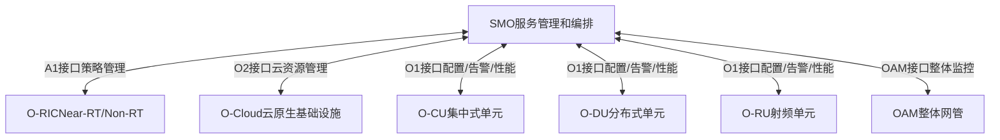

**图表来源**
- [functional-distribution.md](file://01-architecture-system/functional-distribution.md#L30-L200)
- [layered-architecture.md](file://01-architecture-system/layered-architecture.md#L120-L160)
- [o1-interface.md](file://03-interface-standards/o1-interface.md#L1-L200)
- [o2-interface.md](file://03-interface-standards/o2-interface.md#L1-L200)
- [a1-interface.md](file://03-interface-standards/a1-interface.md#L1-L200)
- [oam-interface.md](file://03-interface-standards/oam-interface.md#L1-L200)

**章节来源**
- [functional-distribution.md](file://01-architecture-system/functional-distribution.md#L30-L200)
- [layered-architecture.md](file://01-architecture-system/layered-architecture.md#L120-L160)

## 详细组件分析

### SMO服务生命周期管理
- 生命周期阶段：服务定义、模板化、实例化、部署、运行、变更、回收/退役。
- 关键能力：
  - 服务模板管理：抽象通用服务模型，支持参数化与版本化。
  - 实例化与编排：根据模板生成具体实例，协调跨域资源与接口。
  - 变更与回滚：支持灰度发布、蓝绿部署与一键回滚。
  - 退役与清理：释放资源、删除配置、清理告警与监控。

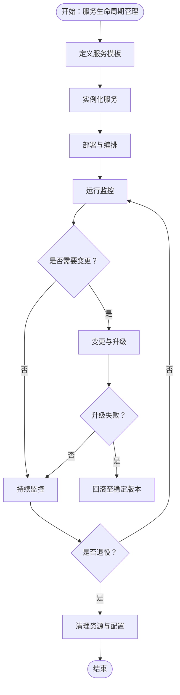

**章节来源**
- [smo.md](file://02-core-components/smo.md#L1-L120)
- [automated-deployment.md](file://05-cloud-integration/automated-deployment.md#L1-L200)
- [readme.md](file://08-deployment-implementation/readme.md#L180-L200)

### SMO与O1接口通信机制
- 协议与建模：基于NETCONF/YANG，实现配置下发、状态查询、告警订阅与性能数据采集。
- 典型流程：SMO向目标网络元素发起配置变更请求，接收确认与状态回报，必要时触发告警上报与性能采集。

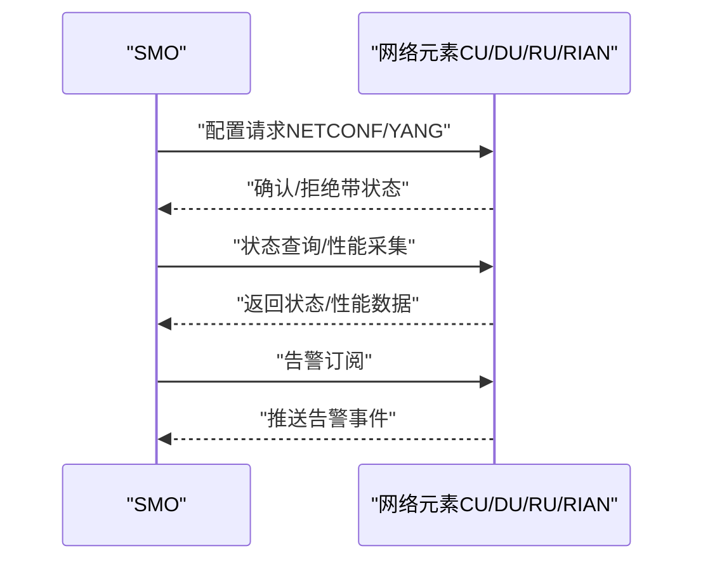

**图表来源**
- [o1-interface.md](file://03-interface-standards/o1-interface.md#L1-L200)
- [smo.md](file://02-core-components/smo.md#L1-L120)

**章节来源**
- [o1-interface.md](file://03-interface-standards/o1-interface.md#L1-L200)
- [smo.md](file://02-core-components/smo.md#L1-L120)

### SMO与O2接口的云资源编排
- 能力范围：资源申请、弹性扩缩容、跨域调度、成本优化与SLA保障。
- 集成要点：与Kubernetes、Helm、ArgoCD等工具链协同，实现GitOps与声明式编排。

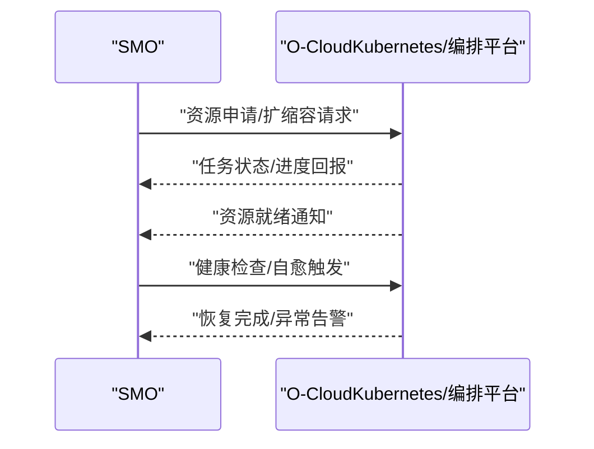

**图表来源**
- [o2-interface.md](file://03-interface-standards/o2-interface.md#L1-L200)
- [cloud-native-architecture.md](file://05-cloud-integration/cloud-native-architecture.md#L1-L481)
- [container-orchestration.md](file://05-cloud-integration/container-orchestration.md#L1-L200)

**章节来源**
- [o2-interface.md](file://03-interface-standards/o2-interface.md#L1-L200)
- [cloud-native-architecture.md](file://05-cloud-integration/cloud-native-architecture.md#L1-L481)
- [container-orchestration.md](file://05-cloud-integration/container-orchestration.md#L1-L200)

### SMO与A1接口的策略协同
- 职责边界：SMO负责端到端服务编排与资源协调，A1负责策略下发与执行反馈。
- 协同流程：SMO制定服务策略，经A1下发至RIC，RIC反馈执行结果，SMO据此调整资源与配置。

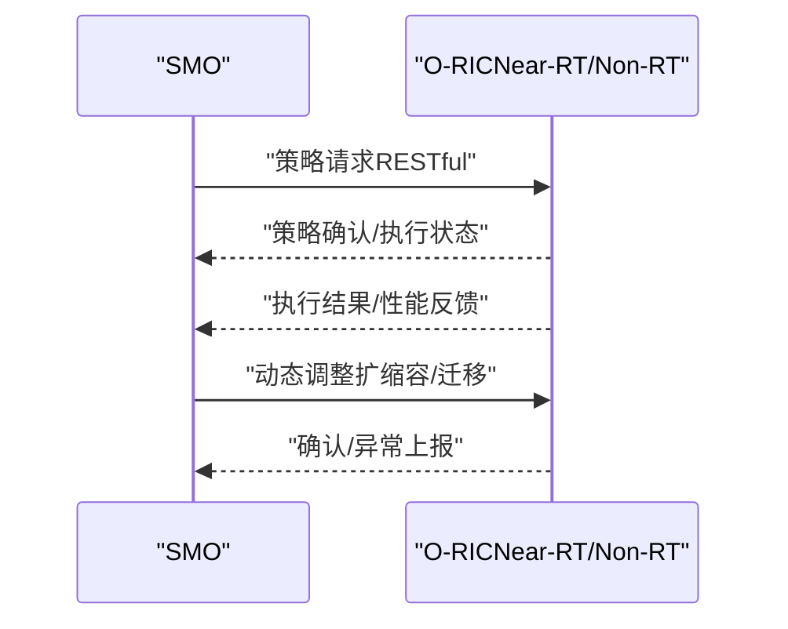

**图表来源**
- [a1-interface.md](file://03-interface-standards/a1-interface.md#L1-L200)
- [functional-distribution.md](file://01-architecture-system/functional-distribution.md#L30-L200)

**章节来源**
- [a1-interface.md](file://03-interface-standards/a1-interface.md#L1-L200)
- [functional-distribution.md](file://01-architecture-system/functional-distribution.md#L30-L200)

### SMO与E2/F1接口的控制面协同
- E2接口：面向RIC的服务化接口，SMO通过策略与事件驱动实现端到端控制闭环。
- F1接口：CU-DU之间的控制面与用户面分离接口，SMO在服务编排层面协调资源与参数。

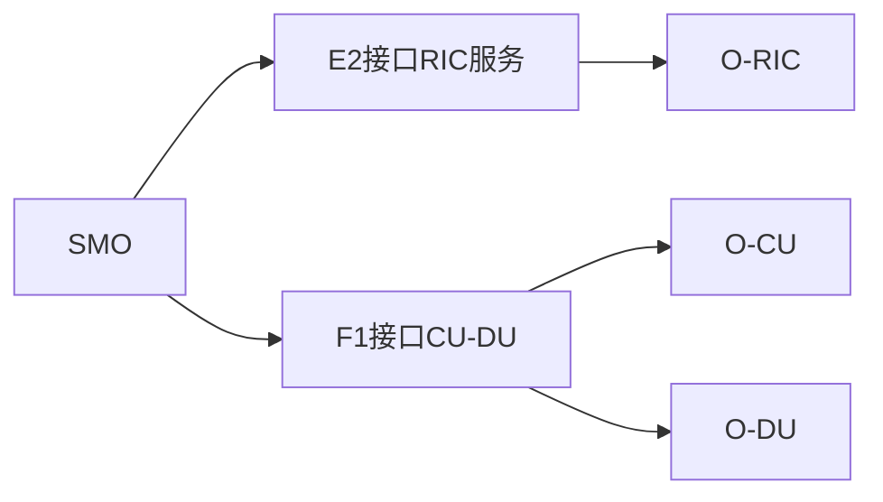

**图表来源**
- [e2-interface.md](file://03-interface-standards/e2-interface.md#L1-L200)
- [f1-interface.md](file://03-interface-standards/f1-interface.md#L1-L200)
- [smo.md](file://02-core-components/smo.md#L1-L120)

**章节来源**
- [e2-interface.md](file://03-interface-standards/e2-interface.md#L1-L200)
- [f1-interface.md](file://03-interface-standards/f1-interface.md#L1-L200)
- [smo.md](file://02-core-components/smo.md#L1-L120)

### SMO的API接口设计与事件驱动架构
- RESTful服务：面向外部系统与管理平台提供统一的REST API，支持服务编排、资源查询、策略下发与事件订阅。
- 事件驱动：基于事件总线/消息中间件实现异步解耦，支持告警、性能、配置变更等事件的实时处理与联动。

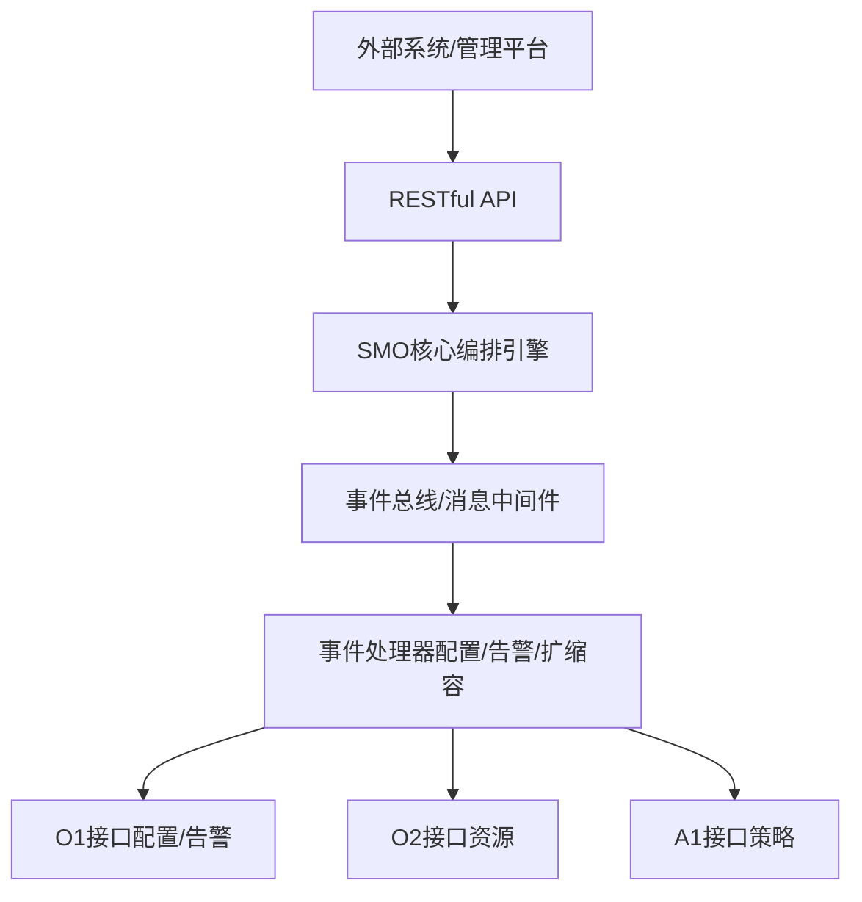

**图表来源**
- [readme.md](file://08-deployment-implementation/readme.md#L180-L200)
- [o1-interface.md](file://03-interface-standards/o1-interface.md#L1-L200)
- [o2-interface.md](file://03-interface-standards/o2-interface.md#L1-L200)
- [a1-interface.md](file://03-interface-standards/a1-interface.md#L1-L200)

**章节来源**
- [readme.md](file://08-deployment-implementation/readme.md#L180-L200)
- [o1-interface.md](file://03-interface-standards/o1-interface.md#L1-L200)
- [o2-interface.md](file://03-interface-standards/o2-interface.md#L1-L200)
- [a1-interface.md](file://03-interface-standards/a1-interface.md#L1-L200)

### 自动化部署与动态扩缩容
- 自动化部署：基于IaC（Terraform/Ansible）、容器编排（Kubernetes/Helm）、GitOps（ArgoCD）实现端到端自动化。
- 动态扩缩容：结合HPA/VPA与业务负载模型，实现按需弹性与成本优化。

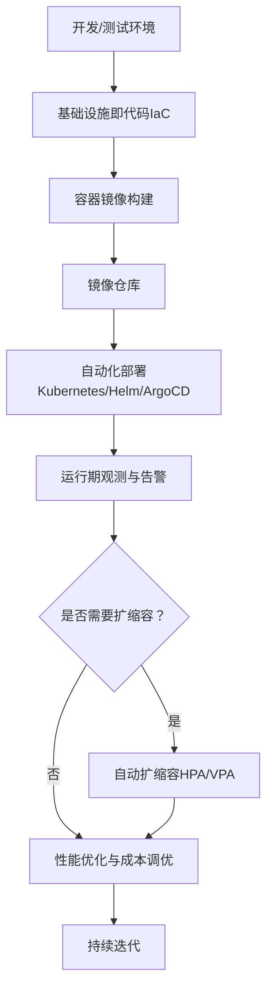

**图表来源**
- [automated-deployment.md](file://05-cloud-integration/automated-deployment.md#L1-L200)
- [container-orchestration.md](file://05-cloud-integration/container-orchestration.md#L1-L200)
- [cloud-native-architecture.md](file://05-cloud-integration/cloud-native-architecture.md#L1-L481)

**章节来源**
- [automated-deployment.md](file://05-cloud-integration/automated-deployment.md#L1-L200)
- [container-orchestration.md](file://05-cloud-integration/container-orchestration.md#L1-L200)
- [cloud-native-architecture.md](file://05-cloud-integration/cloud-native-architecture.md#L1-L481)

### 配置管理与故障处理机制
- 配置管理：集中化配置数据库（CMDB）、版本控制（Git）、自动化校验与回滚。
- 故障处理：自动化检测、根因分析、隔离与恢复、经验沉淀与知识库更新。

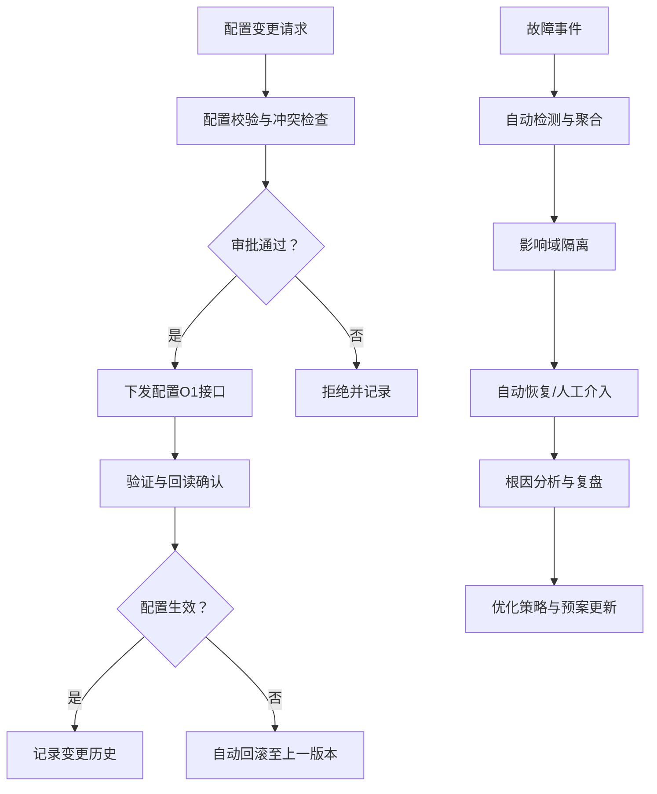

**图表来源**
- [readme.md](file://08-deployment-implementation/readme.md#L94-L125)
- [o1-interface.md](file://03-interface-standards/o1-interface.md#L1-L200)
- [fault-troubleshooting-guide.md](file://14-operations-management/fault-handling/fault-troubleshooting-guide.md#L1-L200)

**章节来源**
- [readme.md](file://08-deployment-implementation/readme.md#L94-L125)
- [fault-troubleshooting-guide.md](file://14-operations-management/fault-handling/fault-troubleshooting-guide.md#L1-L200)

## 依赖分析
- 内部依赖：SMO与A1、O1、O2、E2、F1、OAM接口存在强耦合；与云原生编排工具链（Kubernetes/Helm/ArgoCD）存在松耦合集成。
- 外部依赖：第三方网络元素（多厂商设备）、云平台（O-Cloud）、测试与验证工具链（Keysight/Plugfest）。
- 风险点：接口兼容性、实时性与可靠性、安全与合规、跨域一致性与一致性保障。

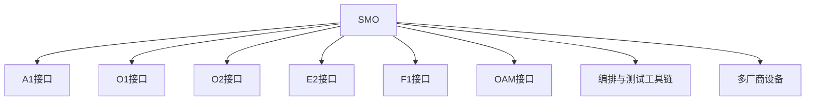

**图表来源**
- [functional-distribution.md](file://01-architecture-system/functional-distribution.md#L30-L200)
- [o1-interface.md](file://03-interface-standards/o1-interface.md#L1-L200)
- [o2-interface.md](file://03-interface-standards/o2-interface.md#L1-L200)
- [a1-interface.md](file://03-interface-standards/a1-interface.md#L1-L200)
- [e2-interface.md](file://03-interface-standards/e2-interface.md#L1-L200)
- [f1-interface.md](file://03-interface-standards/f1-interface.md#L1-L200)
- [oam-interface.md](file://03-interface-standards/oam-interface.md#L1-L200)

**章节来源**
- [functional-distribution.md](file://01-architecture-system/functional-distribution.md#L30-L200)

## 性能考虑
- 实时性与延迟：Near-RT RIC与F1接口对毫秒级延迟敏感，容器化需结合特权容器、CPU亲和性、SR-IOV/DPDK等优化手段。
- 可靠性与可用性：多副本部署、自动故障转移、状态一致性与备份恢复机制，满足电信级可靠性要求。
- 可观测性：统一监控（Prometheus/Grafana）、分布式追踪（Jaeger）、日志管理（ELK）与告警聚合，支撑端到端问题定位。
- 资源优化：HPA/VPA自动扩缩容、资源预留与配额、容量规划与成本优化。

**章节来源**
- [cloud-native-architecture.md](file://05-cloud-integration/cloud-native-architecture.md#L120-L180)
- [monitoring-integration.md](file://05-cloud-integration/monitoring-integration.md#L1-L200)
- [capacity-planning-framework.md](file://14-operations-management/capacity-planning/capacity-planning-framework.md#L1-L200)
- [performance-optimization-framework.md](file://14-operations-management/performance-optimization/performance-optimization-framework.md#L1-L200)

## 故障排查指南
- 分类与流程：接口故障、性能问题、可用性问题、配置问题、兼容性问题；遵循问题定义、信息收集、假设验证、根因分析、解决与验证的闭环流程。
- 工具与方法：Wireshark/tcpdump、协议分析器、ELK/Splunk、性能分析工具、5Why/Fishbone/FTA等根因分析方法。
- SOP：故障响应、升级、沟通、事后复盘与知识库更新。

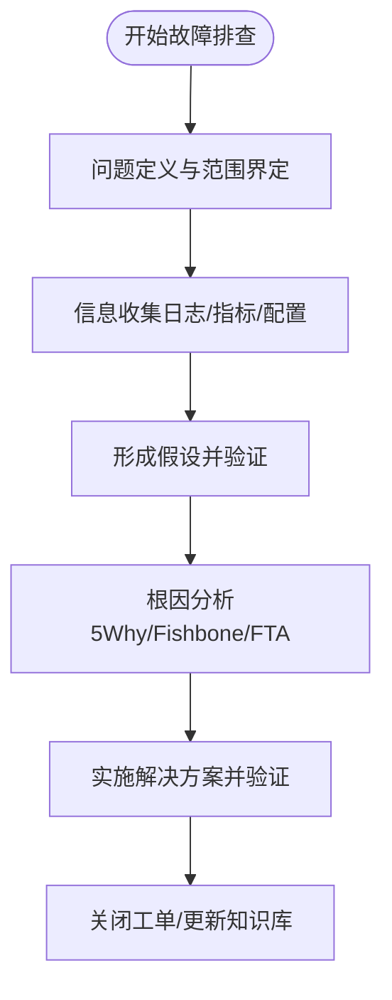

**图表来源**
- [readme.md](file://08-deployment-implementation/readme.md#L126-L157)
- [fault-troubleshooting-guide.md](file://14-operations-management/fault-handling/fault-troubleshooting-guide.md#L1-L200)

**章节来源**
- [readme.md](file://08-deployment-implementation/readme.md#L126-L157)
- [fault-troubleshooting-guide.md](file://14-operations-management/fault-handling/fault-troubleshooting-guide.md#L1-L200)

## 结论
SMO在O-RAN生态中承担服务生命周期管理与跨层编排的关键职责，通过O1/O2/A1等接口与各网络元素及云平台协同，结合云原生技术实现自动化部署、动态扩缩容与事件驱动的智能运维。依托完善的监控、测试与安全体系，SMO能够有效支撑大规模、多厂商、低时延的现代无线网络建设与运营。

## 附录
- 标准化与工作组：O-RAN联盟WG5（SMO）、WG1（架构）、WG2/WG3（RIC/A1/E2接口）等，为SMO能力与接口规范提供权威依据。
- 测试与验证：符合性测试、互操作性测试、性能测试与自动化测试框架，保障SMO在多厂商环境下的稳定性与一致性。
- 安全与合规：安全架构、认证授权、合规审计与网络安全框架，确保SMO在全生命周期内的安全可控。

**章节来源**
- [wg-overview.md](file://06-working-groups/wg-overview.md#L1-L200)
- [wg-detailed-responsibilities.md](file://06-working-groups/wg-detailed-responsibilities.md#L1-L200)
- [o-ran-conformance-testing.md](file://13-testing-validation/conformance-testing/o-ran-conformance-testing.md#L1-L200)
- [interoperability-testing.md](file://13-testing-validation/interoperability/interoperability-testing.md#L1-L200)
- [performance-testing.md](file://13-testing-validation/performance-testing/performance-testing.md#L1-L200)
- [security-reference-architecture.md](file://12-security-privacy/security-architecture/security-reference-architecture.md#L1-L200)
- [authentication-framework.md](file://12-security-privacy/authentication/authentication-framework.md#L1-L200)
- [compliance-auditing-framework.md](file://12-security-privacy/compliance-auditing/compliance-auditing-framework.md#L1-L200)
- [network-security-framework.md](file://12-security-privacy/network-security/network-security-framework.md#L1-L200)