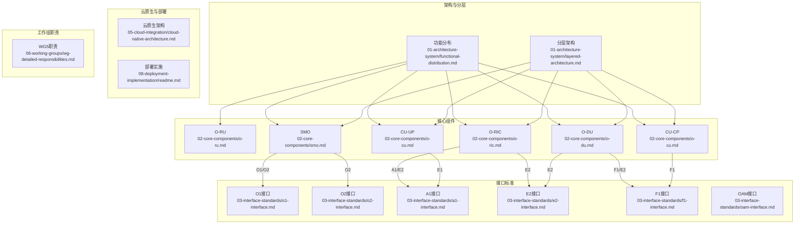
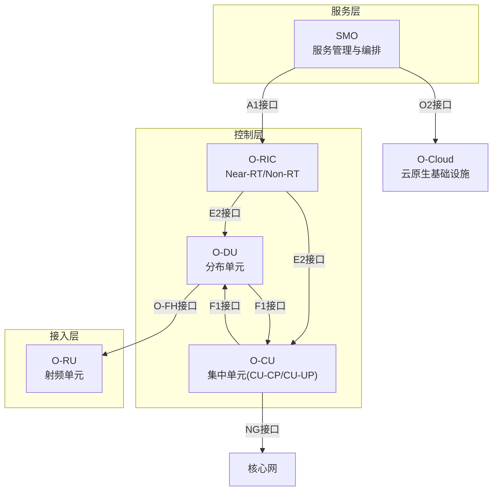
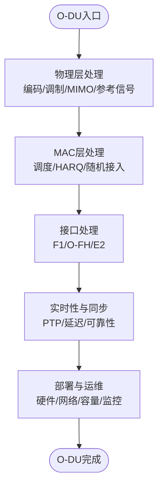
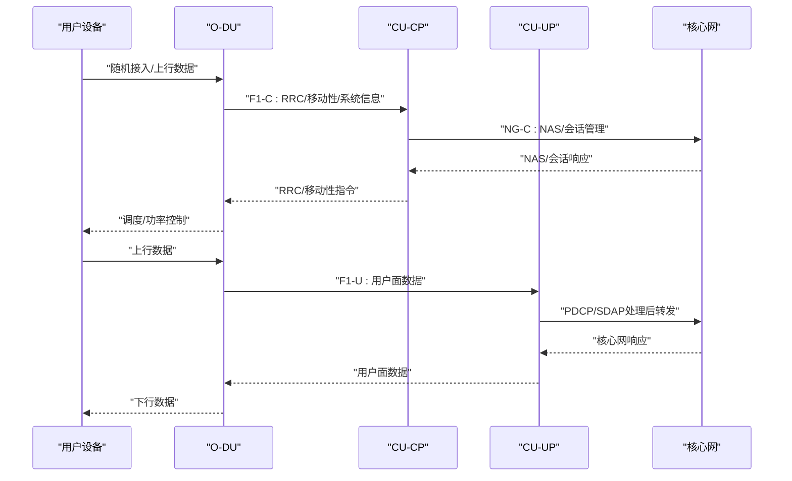
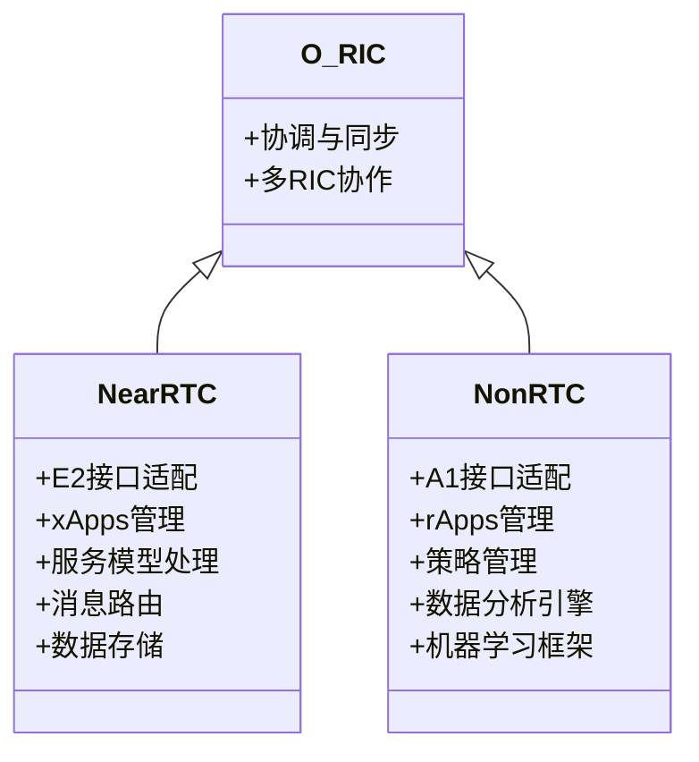
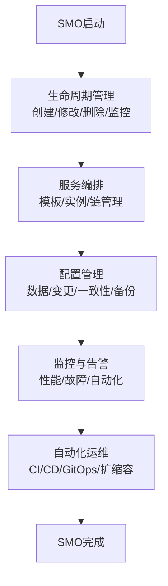
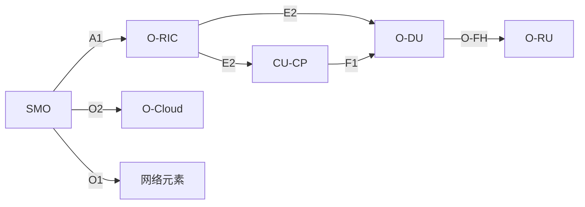

# 核心网络元素

<cite>
**本文引用的文件**
- [O-DU.md](file://02-core-components/o-du.md)
- [O-CU.md](file://02-core-components/o-cu.md)
- [O-RIC.md](file://02-core-components/o-ric.md)
- [SMO.md](file://02-core-components/smo.md)
- [功能分布.md](file://01-architecture-system/functional-distribution.md)
- [分层架构.md](file://01-architecture-system/layered-architecture.md)
- [O1接口.md](file://03-interface-standards/o1-interface.md)
- [O2接口.md](file://03-interface-standards/o2-interface.md)
- [A1接口.md](file://03-interface-standards/a1-interface.md)
- [E2接口.md](file://03-interface-standards/e2-interface.md)
- [F1接口.md](file://03-interface-standards/f1-interface.md)
- [OAM接口.md](file://03-interface-standards/oam-interface.md)
- [云原生架构.md](file://05-cloud-integration/cloud-native-architecture.md)
- [部署实施.md](file://08-deployment-implementation/readme.md)
- [WG5职责.md](file://06-working-groups/wg-detailed-responsibilities.md)
</cite>

## 目录
1. [引言](#引言)
2. [项目结构](#项目结构)
3. [核心组件](#核心组件)
4. [架构总览](#架构总览)
5. [详细组件分析](#详细组件分析)
6. [依赖分析](#依赖分析)
7. [性能考虑](#性能考虑)
8. [故障排查指南](#故障排查指南)
9. [结论](#结论)
10. [附录](#附录)

## 引言
本文件聚焦于O-RAN核心网络元素的系统化解析，围绕O-RU（射频单元）、O-DU（分布单元）、O-CU（集中单元，含CU-CP与CU-UP）、O-RIC（RAN智能控制器，含Near-RT RIC与Non-RT RIC）以及SMO（服务管理与编排）展开，系统阐述其功能定位、技术特性、实现原理与协作关系，并给出部署与运维层面的实践指导。

## 项目结构
本仓库以主题域组织内容，核心组件与接口规范、架构分层、云原生集成、部署与运维、工作组职责等文档共同构成O-RAN知识体系。与本主题直接相关的文件主要分布在“01-architecture-system”、“02-core-components”、“03-interface-standards”、“05-cloud-integration”、“08-deployment-implementation”、“06-working-groups”等目录。

图示来源
- [功能分布.md](file://01-architecture-system/functional-distribution.md#L1-L325)
- [分层架构.md](file://01-architecture-system/layered-architecture.md#L1-L250)
- [O-RU.md](file://02-core-components/o-ru.md#L1-L200)
- [O-DU.md](file://02-core-components/o-du.md#L1-L415)
- [O-CU.md](file://02-core-components/o-cu.md#L1-L419)
- [O-RIC.md](file://02-core-components/o-ric.md#L1-L437)
- [SMO.md](file://02-core-components/smo.md#L1-L120)
- [O1接口.md](file://03-interface-standards/o1-interface.md#L1-L200)
- [O2接口.md](file://03-interface-standards/o2-interface.md#L1-L200)
- [A1接口.md](file://03-interface-standards/a1-interface.md#L1-L200)
- [E2接口.md](file://03-interface-standards/e2-interface.md#L1-L200)
- [F1接口.md](file://03-interface-standards/f1-interface.md#L1-L200)
- [OAM接口.md](file://03-interface-standards/oam-interface.md#L1-L200)
- [云原生架构.md](file://05-cloud-integration/cloud-native-architecture.md#L1-L120)
- [部署实施.md](file://08-deployment-implementation/readme.md#L90-L130)
- [WG5职责.md](file://06-working-groups/wg-detailed-responsibilities.md#L209-L259)

章节来源
- [功能分布.md](file://01-architecture-system/functional-distribution.md#L1-L325)
- [分层架构.md](file://01-architecture-system/layered-architecture.md#L1-L250)

## 核心组件
本节对O-RU、O-DU、O-CU（CU-CP/CU-UP）、O-RIC（Near-RT/Non-RT）、SMO进行要点梳理与对比，帮助读者快速把握各组件的职责边界与协作关系。

- O-RU（射频单元）
  - 职责：BBU与AAU之间的射频处理与天线接口，承担前传协议承载与同步信号分发。
  - 关键点：前传接口（eCPRI/RoE）、同步、功放与滤波、射频链路可靠性。
  - 参考：[O-DU.md](file://02-core-components/o-du.md#L76-L80)

- O-DU（分布单元）
  - 职责：物理层与MAC层处理，连接O-CU与O-RU；对实时性要求高。
  - 关键点：物理层编码/调制、MIMO预编码、随机接入、HARQ、F1接口（控制面/用户面分离）、O-FH接口、E2接口。
  - 参考：[O-DU.md](file://02-core-components/o-du.md#L1-L415)

- O-CU（集中单元）
  - 职责：高层协议处理，控制面与用户面分离（CU-CP/CU-UP），集中化管理。
  - 关键点：CU-CP（RRC/NG/F1-C）、CU-UP（PDCP/SDAP/用户面转发）、E1接口、F1接口、Xn接口。
  - 参考：[O-CU.md](file://02-core-components/o-cu.md#L1-L419)

- O-RIC（RAN智能控制器）
  - 职责：智能化控制与优化，分为Near-RT RIC（毫秒级闭环）与Non-RT RIC（秒级到分钟级策略）。
  - 关键点：Near-RT RIC（E2接口、xApps运行环境、实时控制）、Non-RT RIC（A1接口、策略管理、rApps、数据分析与ML）。
  - 参考：[O-RIC.md](file://02-core-components/o-ric.md#L1-L437)

- SMO（服务管理与编排）
  - 职责：网络服务生命周期管理、配置管理、故障管理、性能管理、服务编排与API治理。
  - 关键点：与控制层（A1）、基础设施层（O2）交互；与O1接口配合实现跨厂商管理；云原生编排与自动化。
  - 参考：[SMO.md](file://02-core-components/smo.md#L1-L120)

章节来源
- [O-DU.md](file://02-core-components/o-du.md#L1-L415)
- [O-CU.md](file://02-core-components/o-cu.md#L1-L419)
- [O-RIC.md](file://02-core-components/o-ric.md#L1-L437)
- [SMO.md](file://02-core-components/smo.md#L1-L120)

## 架构总览
下图展示O-RAN核心网络元素在三层架构中的角色与接口关系，体现SMO在服务层的编排作用、O-RIC在控制层的智能控制、O-DU/O-CU在接入与传输中的处理职责。

图示来源
- [分层架构.md](file://01-architecture-system/layered-architecture.md#L1-L250)
- [功能分布.md](file://01-architecture-system/functional-distribution.md#L1-L325)
- [O-RIC.md](file://02-core-components/o-ric.md#L1-L437)
- [O-DU.md](file://02-core-components/o-du.md#L1-L415)
- [O-CU.md](file://02-core-components/o-cu.md#L1-L419)

## 详细组件分析

### O-RU（射频单元）
- 功能定位
  - 承担BBU与AAU之间的射频信号转换与前传协议承载，负责同步信号分发与射频链路管理。
- 技术特性
  - 前传协议支持（eCPRI/RoE）、时间同步（IEEE 1588 PTP v2）、射频链路可靠性与功放/滤波。
- 实现原理
  - 基带数字信号经前传协议封装后传输至AAU，AAU完成射频上变频与天线辐射。
- 部署考量
  - 前传带宽与延迟、同步精度、前传拓扑（环形/树形/星型）与冗余设计。

章节来源
- [O-DU.md](file://02-core-components/o-du.md#L76-L80)

### O-DU（分布单元）
- 功能定位
  - 物理层与MAC层处理，连接O-CU与O-RU，对实时性要求高。
- 技术特性
  - 下行：Turbo/LDPC编码、QPSK/16QAM/64QAM/256QAM调制、MIMO层映射与预编码、参考信号生成、PDSCH/PBCH/PDCCH生成。
  - 上行：PUSCH/PUCCH/PRACH接收、信道估计/均衡、解调/解码、上行功率控制、干扰抑制。
  - MAC：随机接入、调度、HARQ、BSR/PHR/SR处理。
- 实时性与可靠性
  - 物理层/调度延迟要求、端到端延迟、时间同步（PTP v2）、可用性与故障恢复。
- 接口
  - F1接口（控制面/用户面分离）、O-FH接口（eCPRI/RoE）、E2接口（与O-RIC服务化接口）。
- 部署与运维
  - 硬件选型（多核CPU/DSP/FPGA/加速卡）、网络规划（前传/中传带宽与QoS）、同步规划（PTP边界/透明时钟）、容量与负载均衡、监控与告警、配置管理与故障处理、性能优化。

图示来源
- [O-DU.md](file://02-core-components/o-du.md#L1-L415)

章节来源
- [O-DU.md](file://02-core-components/o-du.md#L1-L415)

### O-CU（集中单元，CU-CP/CU-UP）
- 功能定位
  - 非实时高层协议处理，控制面与用户面分离，集中化管理。
- 技术特性
  - CU-CP：RRC层、NG接口控制面、F1接口控制面、移动性与安全。
  - CU-UP：PDCP/SDAP、用户面转发、QoS、负载均衡、统计与计费。
  - E1接口（CU-CP与CU-UP）、F1接口（与DU）、Xn接口（gNB间）。
- 部署与运维
  - 硬件选型（通用/高性能服务器）、部署架构（集中/分布式/混合/多租户）、网络规划（传输带宽/QoS/安全）、容量规划（水平/垂直扩展/自动扩缩容）、监控与告警、配置管理、故障处理、性能优化。

图示来源
- [O-CU.md](file://02-core-components/o-cu.md#L1-L419)
- [F1接口.md](file://03-interface-standards/f1-interface.md#L1-L200)
- [A1接口.md](file://03-interface-standards/a1-interface.md#L1-L200)

章节来源
- [O-CU.md](file://02-core-components/o-cu.md#L1-L419)

### O-RIC（RAN智能控制器，Near-RT/Non-RT）
- 功能定位
  - Near-RT RIC：毫秒级实时控制闭环，管理xApps，处理E2接口。
  - Non-RT RIC：秒级到分钟级策略管理，管理rApps，处理A1接口，进行数据分析与ML建模。
- 技术架构
  - Near-RT RIC：微服务架构、E2适配层、xApps管理框架、服务模型处理、消息路由、数据存储。
  - Non-RT RIC：微服务架构、A1适配层、rApps管理框架、策略管理、数据分析引擎、机器学习框架。
- 部署与运维
  - 硬件选型（高性能/大容量服务器）、网络规划（E2/A1带宽与QoS）、容量规划（处理/内存/存储/带宽）、xApps/rApps管理（生命周期/开发框架/安全）、监控与告警、配置管理、故障处理、性能优化。

图示来源
- [O-RIC.md](file://02-core-components/o-ric.md#L1-L437)

章节来源
- [O-RIC.md](file://02-core-components/o-ric.md#L1-L437)

### SMO（服务管理与编排）
- 功能定位
  - 网络服务生命周期管理、配置管理、故障管理、性能管理、服务编排与API治理。
- 技术架构
  - 分层架构：服务层（SMO）、管理层（配置/故障/性能/安全/资产）、基础设施层（O-Cloud/O2接口）。
  - 接口：与控制层通过A1接口交互，与基础设施层通过O2接口交互，与网络元素通过O1接口交互。
- 生命周期管理
  - 服务创建/修改/删除/监控；服务模板标准化与自动化编排；服务链管理与依赖管理；版本管理与平滑升级回滚。
- 配置管理
  - 配置数据管理、变更流程、一致性与备份恢复；与O1接口（NETCONF/YANG）配合实现跨厂商互操作。
- 故障处理机制
  - 故障检测/分类/告警/处理流程；与云原生监控/自动化运维结合，实现自动定位、隔离与恢复。
- 云原生集成
  - 微服务化拆分、容器编排（Kubernetes）、自动扩缩容与故障恢复、与云原生监控系统集成。

图示来源
- [SMO.md](file://02-core-components/smo.md#L1-L120)
- [功能分布.md](file://01-architecture-system/functional-distribution.md#L1-L325)
- [O1接口.md](file://03-interface-standards/o1-interface.md#L1-L200)
- [O2接口.md](file://03-interface-standards/o2-interface.md#L1-L200)
- [云原生架构.md](file://05-cloud-integration/cloud-native-architecture.md#L1-L120)
- [部署实施.md](file://08-deployment-implementation/readme.md#L90-L130)

章节来源
- [SMO.md](file://02-core-components/smo.md#L1-L120)
- [功能分布.md](file://01-architecture-system/functional-distribution.md#L1-L325)
- [O1接口.md](file://03-interface-standards/o1-interface.md#L1-L200)
- [O2接口.md](file://03-interface-standards/o2-interface.md#L1-L200)
- [云原生架构.md](file://05-cloud-integration/cloud-native-architecture.md#L1-L120)
- [部署实施.md](file://08-deployment-implementation/readme.md#L90-L130)

## 依赖分析
- 层间依赖
  - 服务层（SMO）通过A1接口向控制层（O-RIC/CU/DU）下发策略与编排指令；通过O2接口管理基础设施层资源。
  - 控制层通过E2接口与DU/CU交互，执行实时控制；通过F1接口与DU交互，传递RRC/移动性/系统信息。
  - 管理层通过O1接口管理具体网络元素，实现配置、监控与维护。
- 组件耦合
  - O-DU与O-CU通过F1接口耦合（控制面/用户面分离），与O-RU通过O-FH接口耦合。
  - O-RIC与DU/CU通过E2接口耦合，与SMO通过A1接口耦合。
  - SMO与O-RIC通过A1接口耦合，与O-Cloud通过O2接口耦合，与网络元素通过O1接口耦合。
- 外部依赖
  - 标准化接口（A1/E2/F1/O1/O2）与协议栈（SCTP/GTP-U/PTP/NETCONF/YANG）。
  - 云原生技术栈（Kubernetes/Istio/Kafka/数据库/监控）。

图示来源
- [功能分布.md](file://01-architecture-system/functional-distribution.md#L1-L325)
- [分层架构.md](file://01-architecture-system/layered-architecture.md#L1-L250)
- [O-RIC.md](file://02-core-components/o-ric.md#L1-L437)
- [O-DU.md](file://02-core-components/o-du.md#L1-L415)
- [O-CU.md](file://02-core-components/o-cu.md#L1-L419)

章节来源
- [功能分布.md](file://01-architecture-system/functional-distribution.md#L1-L325)
- [分层架构.md](file://01-architecture-system/layered-architecture.md#L1-L250)

## 性能考虑
- 实时性与延迟
  - O-DU物理层/调度延迟、端到端延迟需满足O-RAN要求；O-RIC Near-RT控制闭环延迟应小于毫秒级。
- 同步精度
  - PTP v2边界/透明时钟配置与优化，满足O-DU与O-RU/O-CU的时间同步精度要求。
- 带宽与QoS
  - 前传/中传/A1/E2带宽需求与QoS策略，保障关键流量的服务质量。
- 资源利用率
  - CPU/内存/存储/网络资源的动态分配与自动扩缩容，结合云原生监控与自动化运维。
- 可靠性与可用性
  - 硬件冗余、传输冗余、控制平面冗余、自动故障转移与快速恢复。

章节来源
- [O-DU.md](file://02-core-components/o-du.md#L51-L66)
- [O-RIC.md](file://02-core-components/o-ric.md#L155-L173)
- [云原生架构.md](file://05-cloud-integration/cloud-native-architecture.md#L1-L120)
- [部署实施.md](file://08-deployment-implementation/readme.md#L90-L130)

## 故障排查指南
- 告警与监控
  - 建立分层告警体系（性能/故障/资源），设置阈值与抑制策略，避免告警风暴。
- 故障定位
  - 告警关联分析、日志分析、性能趋势分析、信令/接口测试验证。
- 故障恢复
  - 重启服务/调整配置/资源扩容/修复接口/应用重启；结合自动化运维与回滚机制。
- SMO运维
  - 配置基线与备份、变更流程与回滚、自动化测试与巡检、容量评估与优化。

章节来源
- [O-DU.md](file://02-core-components/o-du.md#L224-L308)
- [O-CU.md](file://02-core-components/o-cu.md#L197-L282)
- [O-RIC.md](file://02-core-components/o-ric.md#L214-L301)
- [部署实施.md](file://08-deployment-implementation/readme.md#L90-L130)

## 结论
O-RAN核心网络元素通过清晰的分层与接口边界实现灵活部署与高效协同。O-DU承担高实时性处理，O-CU实现控制与用户面分离，O-RIC提供近实时与非实时智能控制，SMO贯穿服务生命周期与编排管理。结合云原生与标准化接口，可在保证可靠性与性能的同时，实现自动化运维与持续优化。

## 附录
- 组件选择与部署指导
  - O-RU：优先选择支持eCPRI/RoE与高精度同步的设备，结合前传拓扑与冗余设计。
  - O-DU：依据小区/用户规模与业务类型选择硬件（CPU/DSP/FPGA/加速卡），优化前传/中传网络与同步。
  - O-CU：CU-CP集中部署、CU-UP分布式部署以平衡性能与管理效率；采用容器化与微服务架构。
  - O-RIC：Near-RT RIC就近部署以满足低延迟，Non-RT RIC集中部署进行全局策略优化；强化xApps/rApps管理与安全。
  - SMO：集中部署统一编排，强化O1/O2接口标准化与自动化，结合云原生实现弹性与可观测性。

章节来源
- [O-DU.md](file://02-core-components/o-du.md#L131-L223)
- [O-CU.md](file://02-core-components/o-cu.md#L122-L196)
- [O-RIC.md](file://02-core-components/o-ric.md#L118-L192)
- [SMO.md](file://02-core-components/smo.md#L1-L120)
- [WG5职责.md](file://06-working-groups/wg-detailed-responsibilities.md#L209-L259)