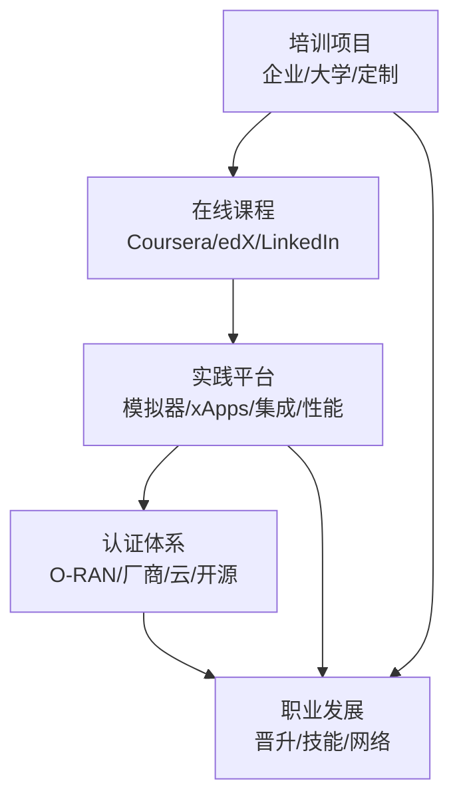
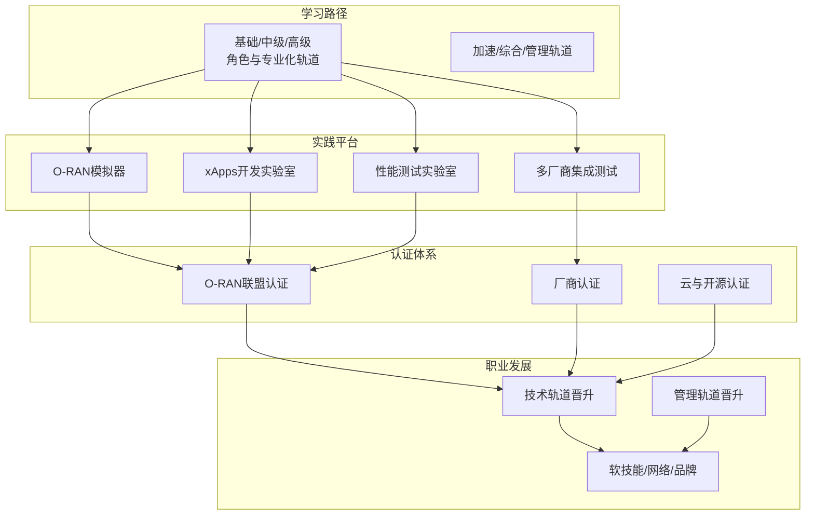
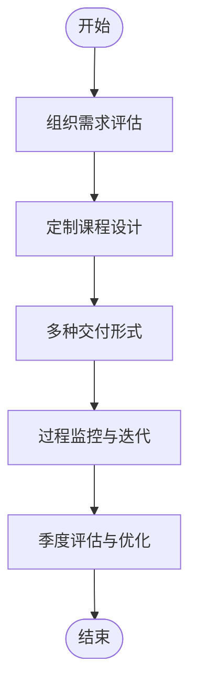
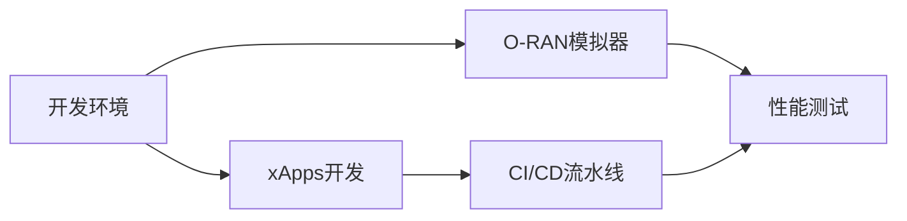
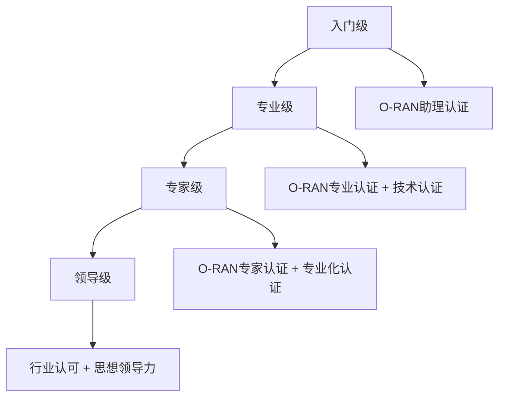
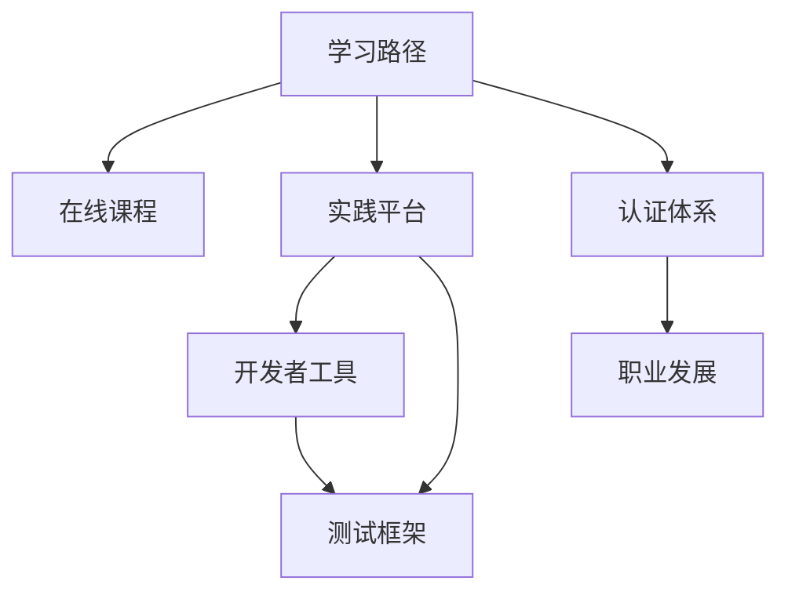
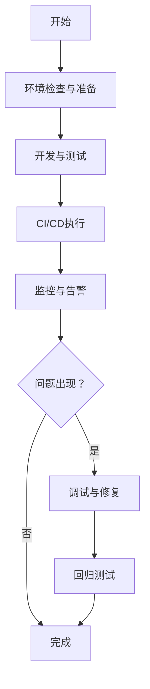

# 培训材料

<cite>
**本文引用的文件**
- [O-RAN 培训项目](file://19-talent-development/training-programs/o-ran-training-framework-zh.md)
- [O-RAN 人才认证体系](file://19-talent-development/certification-system/oran-certification-program.md)
- [O-RAN 学习路径](file://19-talent-development/learning-paths/o-ran-learning-roadmaps-zh.md)
- [O-RAN 职业发展框架](file://19-talent-development/career-development/o-ran-career-pathways-zh.md)
- [O-RAN 开发者工具和SDK](file://17-open-source-ecosystem/developer-tools/oran-development-tools-zh.md)
- [O-RAN 开发工具包](file://22-tool-platforms/development-tools/o-ran-development-toolkit-zh.md)
- [O-RAN 测试一致性验证](file://13-testing-validation/conformance-testing/o-ran-conformance-testing.md)
- [O-RAN 性能测试](file://13-testing-validation/performance-testing/performance-testing-zh.md)
- [资源总览](file://resources/readme-zh.md)
</cite>

## 目录
1. [简介](#简介)
2. [项目结构](#项目结构)
3. [核心组件](#核心组件)
4. [架构总览](#架构总览)
5. [详细组件分析](#详细组件分析)
6. [依赖分析](#依赖分析)
7. [性能考量](#性能考量)
8. [故障排查指南](#故障排查指南)
9. [结论](#结论)
10. [附录](#附录)

## 简介
本文件面向O-RAN培训与人才培养，系统梳理官方培训项目（O-RAN联盟、ETSI、3GPP）、在线课程资源、实践实验室环境、认证体系与职业发展路径，并提供选课策略、学习计划与技能评估方法，帮助组织和个人构建从理论到实践再到认证的完整能力闭环。

## 项目结构
围绕O-RAN人才发展，项目内形成“培训—实践—认证—职业发展”的闭环资源体系：
- 培训项目：企业内训、大学合作、定制化解决方案
- 在线课程：Coursera、edX、LinkedIn Learning等平台资源
- 实践平台：O-RAN模拟器、xApps开发实验室、多厂商集成测试、性能测试实验室
- 认证体系：O-RAN联盟认证、厂商认证、云与开源认证
- 职业发展：晋升路径、技能画像、持续学习与网络建设

**章节来源**
- file://resources/readme-zh.md#L52-L69

## 核心组件
- 官方培训项目：涵盖高管领导力、技术实施、安全与合规、云原生O-RAN、大学合作与定制化企业解决方案
- 在线课程资源：O-RAN与5G相关课程、实践平台、社区资源
- 实践实验室：O-RAN模拟器、xApps开发、多厂商集成测试、性能测试
- 认证体系：O-RAN联盟认证、厂商认证、云与开源认证
- 职业发展：技术轨道与管理轨道晋升路径、软技能与硬技能发展、个人品牌建设

**章节来源**
- file://19-talent-development/training-programs/o-ran-training-framework-zh.md#L1-L329
- file://19-talent-development/certification-system/oran-certification-program.md#L1-L114
- file://19-talent-development/learning-paths/o-ran-learning-roadmaps-zh.md#L1-L297
- file://19-talent-development/career-development/o-ran-career-pathways-zh.md#L1-L268
- file://resources/readme-zh.md#L52-L69

## 架构总览
下图展示O-RAN培训与认证的总体架构：从学习路径出发，经由实践平台与认证，最终导向职业发展；同时通过持续学习与社区参与，形成可持续的人才生态。

**章节来源**
- file://19-talent-development/learning-paths/o-ran-learning-roadmaps-zh.md#L1-L297
- file://19-talent-development/training-programs/o-ran-training-framework-zh.md#L1-L329
- file://19-talent-development/certification-system/oran-certification-program.md#L1-L114
- file://19-talent-development/career-development/o-ran-career-pathways-zh.md#L1-L268

## 详细组件分析

### 官方培训项目
- 高管领导力项目：聚焦商业战略、技术架构概览、风险管理与治理、实践工作坊
- 技术实施项目：5天混合式培训，覆盖基础架构、核心组件、RIC开发与集成、高级功能与优化、生产部署与管理
- 专业化模块：安全与合规培训（3天，含认证）、云原生O-RAN培训（4天，含认证）
- 大学合作：学术证书项目（1学期，混合式）、研究合作项目（教师发展、学生实习、联合研究、行业咨询）
- 定制企业解决方案：需求评估流程（4阶段）、交付选项（现场/虚拟/自定进度/混合/培训师培训）

**章节来源**
- file://19-talent-development/training-programs/o-ran-training-framework-zh.md#L8-L329

### 在线课程资源
- 官方文档：O-RAN联盟规范、3GPP TS系列、ITU建议书
- 在线平台：Coursera（如“5G for Everyone”）、edX（如“Introduction to 5G”）、Udemy、Pluralsight
- 实践平台：O-RAN SC实验室、ONAP演示平台、PacketRan、Open5GS
- 社区资源：O-RAN开发者论坛、GitHub项目、Stack Overflow、Reddit r/O_RAN

**章节来源**
- file://19-talent-development/learning-paths/o-ran-learning-roadmaps-zh.md#L206-L230
- file://resources/readme-zh.md#L52-L69

### 实践实验室环境
- O-RAN模拟器：容器化开发环境、开发脚本、IDE配置、Git钩子、项目模板
- xApps开发：Python模板、Dockerfile、依赖清单、RMR消息处理
- 多厂商集成测试：NS-3扩展、协议分析（Wireshark）、容器与Kubernetes开发工具
- 性能测试：吞吐量、延迟、抖动、丢包、连接密度、资源利用率、可扩展性测试场景与监控

**章节来源**
- file://17-open-source-ecosystem/developer-tools/oran-development-tools-zh.md#L1-L995
- file://22-tool-platforms/development-tools/o-ran-development-toolkit-zh.md#L1-L488
- file://13-testing-validation/performance-testing/performance-testing-zh.md#L1-L327

### 认证体系
- O-RAN联盟认证：Associate（基础理论）、Professional（理论+实操）、Expert（综合评估+案例分析），有效期2-3年
- 主要厂商认证：Ericsson、Nokia、Samsung、ZTE、Huawei
- 云服务商认证：AWS、Azure、Google Cloud相关专业/专家级认证
- 开源项目认证：Linux Foundation、CNCF、ONAP、ONF认证
- 备考建议：分阶段学习（基础知识、专业技能、实战应用）、学习资源与考试准备要点
- 职业价值：薪资提升、职位晋升、行业认可、国际视野、持续发展

**章节来源**
- file://19-talent-development/certification-system/oran-certification-program.md#L1-L114

### 职业发展路径
- 技术轨道：入门（0-2年）、中级（2-5年）、高级（5-8年）、专家（8年以上）
- 管理轨道：团队主管（2-4年）、部门经理（5-8年）、总监级别（8-12年）、高管级别（12年以上）
- 技能画像：网络基础、云原生技术、O-RAN专项技能、自动化与DevOps、软技能
- 持续发展：月度/季度/年度活动、行业组织与专业社区、个人品牌建设

**章节来源**
- file://19-talent-development/career-development/o-ran-career-pathways-zh.md#L1-L268

## 依赖分析
- 学习路径依赖在线课程与实践平台，形成“理论—实践—验证”的闭环
- 实践平台依赖开发者工具与测试框架，保障开发、测试与部署质量
- 认证体系依赖学习路径与实践平台产出，支撑职业发展与组织能力
- 职业发展依赖认证与实践成果，推动组织内部晋升与外部流动

**章节来源**
- file://19-talent-development/learning-paths/o-ran-learning-roadmaps-zh.md#L1-L297
- file://17-open-source-ecosystem/developer-tools/oran-development-tools-zh.md#L1-L995
- file://13-testing-validation/conformance-testing/o-ran-conformance-testing.md#L1-L67
- file://19-talent-development/certification-system/oran-certification-program.md#L1-L114
- file://19-talent-development/career-development/o-ran-career-pathways-zh.md#L1-L268

## 性能考量
- 性能测试类别：网络性能（吞吐量、延迟、丢包、抖动、连接密度）、资源性能（CPU、内存、存储I/O、网络带宽、功耗）、可扩展性（水平/垂直扩展、负载分布、容量规划）
- 关键KPI：无线接入网、核心网、云基础设施KPI及测量方法
- 测试方法论：负载测试框架、测试环境配置、典型测试场景（峰值性能、延迟特征化、可扩展性验证）
- 监控与分析：PromQL指标、性能分析仪表板、持续性能监控与报告
- 优化指南：网络优化、系统优化、应用级优化
- 行业基准：运营商级别目标与竞争指标

**章节来源**
- file://13-testing-validation/performance-testing/performance-testing-zh.md#L1-L327

## 故障排查指南
- 开发环境：系统要求检查、基础依赖安装、Python环境、O-RAN特定工具、IDE配置、Git钩子、项目模板
- 测试框架：单元/集成测试、测试套件、断言与指标、CLI接口
- 协议分析：Wireshark配置（捕获/显示过滤器、自定义解码器）
- 持续集成：GitHub Actions工作流、Docker构建、Kubernetes部署、Helm图表

**章节来源**
- file://17-open-source-ecosystem/developer-tools/oran-development-tools-zh.md#L86-L995
- file://22-tool-platforms/development-tools/o-ran-development-toolkit-zh.md#L111-L488

## 结论
通过系统化的培训项目、丰富的在线课程、完备的实践实验室、权威的认证体系与清晰的职业发展路径，O-RAN人才生态能够支撑从初学者到专家的全链路能力跃迁。建议组织结合自身发展阶段与角色定位，制定个性化学习计划，依托实践平台强化动手能力，循序推进认证与职业晋升，并通过持续学习与社区参与保持技术敏感度与行业影响力。

## 附录
- 选课策略：基于角色与经验水平选择合适轨道，优先补齐基础与专项技能，结合认证目标倒推学习路径
- 学习计划：采用阶段性里程碑（周/月/季度）跟踪进度，结合项目实践与同伴评审
- 技能评估：以知识保留率、技能应用率、认证通过率与职业发展指标衡量成效

**章节来源**
- file://19-talent-development/learning-paths/o-ran-learning-roadmaps-zh.md#L231-L297
- file://19-talent-development/training-programs/o-ran-training-framework-zh.md#L285-L329