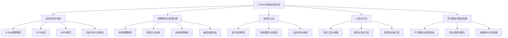
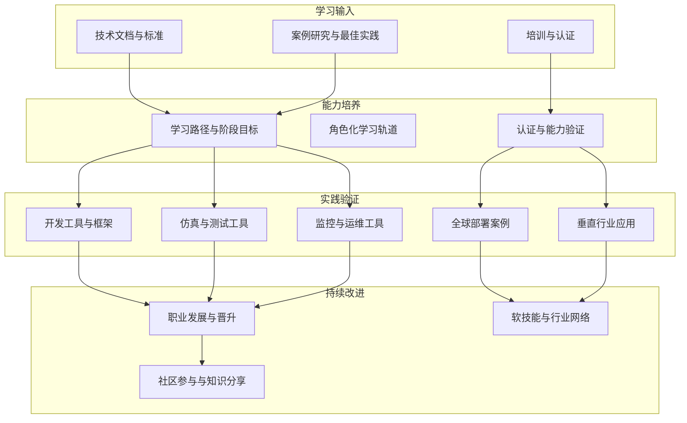
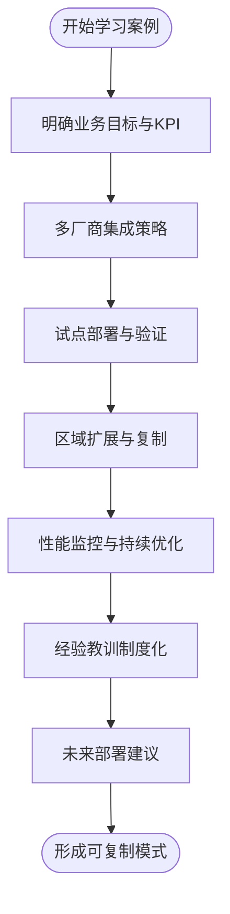
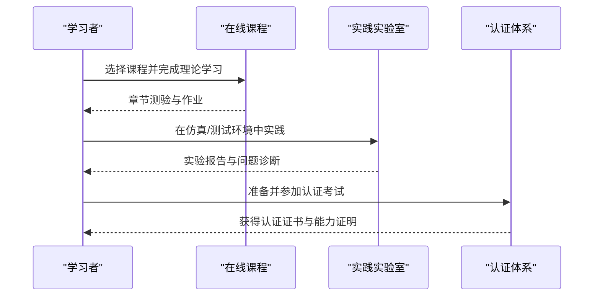
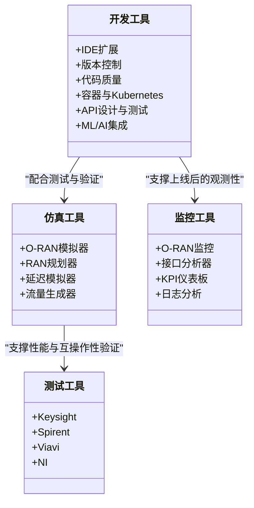
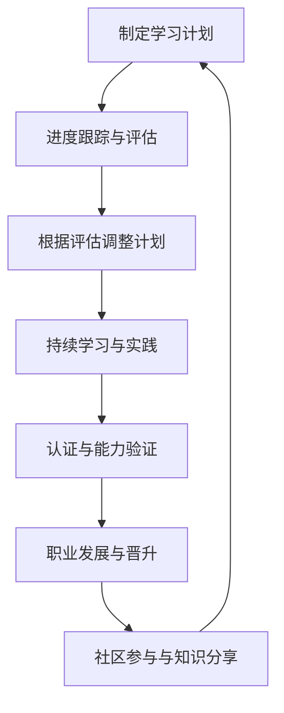
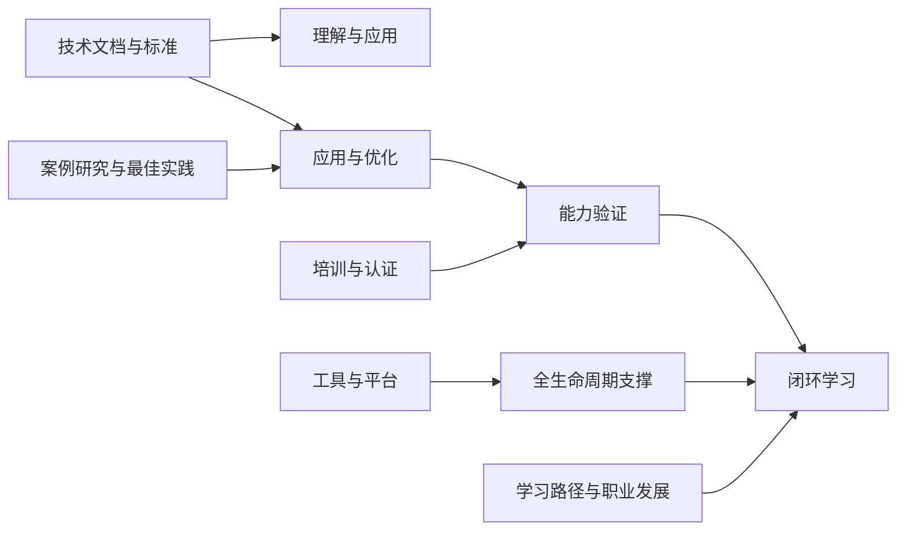

# 学习资源

<cite>
**本文引用的文件**
- [O-RAN学习资源](file://resources/readme.md)
- [O-RAN学习资源（中文）](file://resources/readme-zh.md)
- [O-RAN学习路径](file://19-talent-development/learning-paths/o-ran-learning-roadmaps-zh.md)
- [O-RAN培训项目](file://19-talent-development/training-programs/o-ran-training-framework-zh.md)
- [O-RAN职业发展框架](file://19-talent-development/career-development/o-ran-career-pathways-zh.md)
- [O-RAN人才认证体系](file://19-talent-development/certification-system/oran-certification-program.md)
- [O-RAN最佳实践案例](file://21-case-studies/best-practices/o-ran-best-practice-cases-zh.md)
- [O-RAN开发工具包](file://22-tool-platforms/development-tools/o-ran-development-toolkit-zh.md)
- [O-RAN实用程序](file://22-tool-platforms/utility-programs/o-ran-utility-programs-zh.md)
- [O-RAN全面术语表](file://comprehensive-oran-glossary.md)
- [O-RAN全面专利表](file://comprehensive-oran-patent-table.md)
- [O-RAN专家知识库总览](file://README.md)
</cite>

## 目录
1. [简介](#简介)
2. [项目结构](#项目结构)
3. [核心组件](#核心组件)
4. [架构总览](#架构总览)
5. [详细组件分析](#详细组件分析)
6. [依赖分析](#依赖分析)
7. [性能考虑](#性能考虑)
8. [故障排除指南](#故障排除指南)
9. [结论](#结论)
10. [附录](#附录)

## 简介
本文件面向希望系统学习O-RAN技术的读者，围绕“技术文档资源”“案例研究资源”“培训材料使用”“工具与实用程序”“学习路径制定与实施”“学习社区参与”六个维度，提供可操作的学习指导。内容来源于仓库中的权威资料，既适合初学者循序渐进入门，也适合有经验的专业人士快速定位关键信息与最佳实践。

## 项目结构
该知识库以主题域为纲，形成“知识域—子主题—资源”的层级结构，便于按需检索与系统学习。例如：
- 技术文档与标准：O-RAN联盟规范、ETSI标准、3GPP规范、白皮书与行业报告
- 案例研究：全球运营商部署、垂直行业应用、技术创新与最佳实践
- 培训与认证：官方培训、在线课程、动手实验室、认证体系
- 工具与平台：开发工具、仿真测试、监控与运维工具
- 学习路径与职业发展：角色化学习路径、阶段性目标、认证与成长阶梯

**章节来源**
- [O-RAN专家知识库总览](file://README.md#L1-L365)

## 核心组件
本节聚焦四大类学习资源的组成与使用方法：

- 技术文档与标准
  - O-RAN联盟规范：架构、接口、硬件、软件、测试等规范
  - ETSI标准：Fronthaul、A1接口、传输配置文件等
  - 3GPP规范：NG-RAN架构、F1/Xn/E1接口等
  - 白皮书与行业报告：技术趋势、市场分析、应用前景
  - 建议：以“标准—规范—白皮书”的顺序递进学习，结合具体接口与场景加深理解

- 案例研究与最佳实践
  - 全球运营商部署：分阶段推进、厂商多元策略、自动化测试、性能监控
  - 垂直行业应用：制造业、医疗健康、零售、交通等场景的O-RAN集成
  - 技术创新案例：边缘计算、AI/ML优化、绿色通信、安全架构
  - 最佳实践总结：战略规划、实施卓越、运营卓越、关键成功因素矩阵

- 培训与认证
  - 官方培训：O-RAN联盟、ETSI、3GPP相关课程
  - 在线课程：Coursera、edX、Udemy、Pluralsight等平台的O-RAN与5G课程
  - 实践实验室：O-RAN SC实验室、ONAP演示平台、PacketRan、Open5GS等
  - 认证体系：O-RAN联盟认证、厂商认证、云服务商认证、开源项目认证

- 工具与平台
  - 开发工具：IDE扩展、版本控制、代码质量、容器与Kubernetes、API设计与测试、ML/AI集成
  - 仿真与测试：NS-3扩展、协议分析（Wireshark）、容器与Kubernetes开发环境
  - 监控与运维：指标采集、日志处理、健康检查、备份与恢复

**章节来源**
- [O-RAN学习资源](file://resources/readme.md#L1-L126)
- [O-RAN学习资源（中文）](file://resources/readme-zh.md#L1-L126)

## 架构总览
下图展示了“学习资源—学习路径—培训认证—工具平台—案例研究—职业发展”的闭环学习架构，强调从“知识输入—能力输出—实践验证—持续改进”的路径闭环。

## 详细组件分析

### 技术文档与标准：获取、理解与应用
- 获取渠道
  - 官方网站：O-RAN联盟、ETSI、3GPP、ATIS等
  - 行业资源：5G Americas、GSA、Small Cell Forum、NGMN等
  - 开源项目：O-RAN软件社区、OpenAirInterface、SDR开源项目
- 理解方法
  - 以“接口—协议—实现”的思路拆解标准，先理解接口语义，再掌握协议细节，最后结合实现案例
  - 对照术语表与专利表，建立术语与专利的映射关系，有助于深入理解技术边界与创新点
- 应用建议
  - 在项目中以“最小可行规范”为起点，逐步扩展到完整实现
  - 建立“标准—测试—文档”的闭环，确保实现与规范一致

**章节来源**
- [O-RAN学习资源](file://resources/readme.md#L102-L126)
- [O-RAN全面术语表](file://comprehensive-oran-glossary.md#L1-L656)
- [O-RAN全面专利表](file://comprehensive-oran-patent-table.md#L1-L258)

### 案例研究资源：全球部署、经验教训与最佳实践
- 全球部署案例
  - 德国电信：分阶段部署、多厂商集成、自动化测试、性能监控
  - 乐天移动：端到端云原生移动网络、零接触配置、AI驱动优化
  - 威瑞森：O-RAN与MEC集成、企业场景、低延迟应用
  - 沃达丰：农村覆盖扩展、成本优化、可再生能源集成
- 经验教训与最佳实践
  - 战略规划：明确业务目标、利益相关者对齐、风险评估与缓解
  - 实施卓越：敏捷方法、自动化测试、持续集成/部署、性能基线
  - 运营卓越：实时监控、预测性分析、自动化修复、知识管理

**章节来源**
- [O-RAN最佳实践案例](file://21-case-studies/best-practices/o-ran-best-practice-cases-zh.md#L1-L210)

### 培训材料使用：官方培训、在线课程、实践实验室与自学材料
- 官方培训
  - O-RAN联盟、ETSI、3GPP的官方课程与认证
  - 企业内训：高管领导力、技术实施、专业化模块（安全与合规、云原生O-RAN）
- 在线课程
  - Coursera、edX、Udemy、Pluralsight等平台的O-RAN与5G课程
- 实践实验室
  - O-RAN SC实验室、ONAP演示平台、PacketRan、Open5GS等
- 自学材料
  - 官方技术规范、白皮书、开源项目文档、技术博客与社区讨论

**章节来源**
- [O-RAN培训项目](file://19-talent-development/training-programs/o-ran-training-framework-zh.md#L1-L329)
- [O-RAN学习路径](file://19-talent-development/learning-paths/o-ran-learning-roadmaps-zh.md#L1-L297)
- [O-RAN人才认证体系](file://19-talent-development/certification-system/oran-certification-program.md#L1-L114)

### 工具与实用程序：测试工具、仿真工具、开发工具与辅助工具
- 测试工具
  - Keysight、Spirent、Viavi、NI等厂商的O-RAN测试解决方案
- 仿真工具
  - O-RAN模拟器、RAN Planner、延迟模拟器、流量生成器
- 开发工具
  - IDE扩展、版本控制、代码质量、容器与Kubernetes、API设计与测试、ML/AI集成
- 监控工具
  - O-RAN监控解决方案、接口分析器、KPI仪表板、日志分析工具

**章节来源**
- [O-RAN开发工具包](file://22-tool-platforms/development-tools/o-ran-development-toolkit-zh.md#L1-L488)
- [O-RAN实用程序](file://22-tool-platforms/utility-programs/o-ran-utility-programs-zh.md#L1-L628)
- [O-RAN学习资源](file://resources/readme.md#L76-L126)

### 学习路径制定与实施：学习计划、进度跟踪、效果评估与持续学习
- 角色化学习路径
  - 网络工程师路径：基础—中级—高级，覆盖组件配置、网络管理、性能优化与项目领导力
  - RIC开发者路径：编程基础—开发技能—生产部署，覆盖xApp开发、ML集成、可扩展性与可靠性
  - 专业化轨道：安全专家、云基础设施、无线优化等
- 阶段目标与里程碑
  - 每阶段设置明确的课程、实践与认证目标，配套周度、月度、季度评估
- 效果评估
  - 知识保留率、技能应用率、认证通过率、职业发展指标
- 持续学习
  - 月度技术阅读、在线课程、实践实验室、社区参与；年度技能更新与职业目标修订

**章节来源**
- [O-RAN学习路径](file://19-talent-development/learning-paths/o-ran-learning-roadmaps-zh.md#L1-L297)
- [O-RAN职业发展框架](file://19-talent-development/career-development/o-ran-career-pathways-zh.md#L1-L268)

### 学习社区参与与知识分享：建立有效的学习体系
- 行业组织与专业社区
  - O-RAN联盟、IEEE通信学会、开放网络基金会、Linux基金会网络等
  - Stack Overflow、GitHub、LinkedIn群组、技术论坛等
- 个人品牌建设
  - 技术博客、会议演讲、开源贡献、社交媒体存在
  - 作品集发展：项目文档、代码仓库、认证记录、绩效指标
- 知识分享与协作
  - 经验教训制度化、最佳实践沉淀、跨团队协作与导师关系

**章节来源**
- [O-RAN职业发展框架](file://19-talent-development/career-development/o-ran-career-pathways-zh.md#L171-L218)

## 依赖分析
学习资源之间的相互依赖关系如下：
- 技术文档与标准是“理解—应用—验证”的基础
- 案例研究提供“可复制模式”，指导“实施—优化—固化”
- 培训与认证为“能力验证—职业发展—持续学习”提供通道
- 工具与平台贯穿“开发—仿真—测试—监控—运维”的全生命周期
- 学习路径与职业发展将上述要素串联为闭环

## 性能考虑
- 学习效率
  - 以“标准—案例—工具—认证”的顺序递进，避免重复学习与碎片化
  - 通过阶段性评估与认证，确保知识迁移与技能落地
- 实践效率
  - 在仿真与测试环境中先行验证，降低真实环境的试错成本
  - 建立自动化测试与CI/CD流水线，提升交付质量与速度
- 运维效率
  - 通过监控与日志分析工具，实现问题早发现、早定位、早修复
  - 建立备份与灾难恢复机制，保障业务连续性

## 故障排除指南
- 常见问题与对策
  - 标准理解偏差：对照术语表与专利表，建立术语与专利映射
  - 实施风险：采用分阶段部署与自动化测试，降低风险并提升效率
  - 技术栈不匹配：通过角色化学习路径与专业化轨道，补齐短板
  - 工具链不完善：使用开发工具包与实用程序，补齐测试、仿真、监控能力
- 快速定位与修复
  - 使用健康检查器与日志分析工具，快速定位问题根因
  - 借助备份与恢复工具，缩短故障恢复时间

**章节来源**
- [O-RAN实用程序](file://22-tool-platforms/utility-programs/o-ran-utility-programs-zh.md#L434-L628)

## 结论
通过系统化梳理技术文档、案例研究、培训认证、工具平台与学习路径，结合社区参与与持续学习，学习者可以构建从“理解—应用—验证—优化—固化”的完整能力闭环。建议以角色化学习路径为纲，以认证与实践为目，以工具与平台为剑，在真实场景中不断迭代与提升。

## 附录
- 术语与专利参考
  - 术语表：涵盖O-RAN核心概念，支持中英俄三语对照
  - 专利表：覆盖核心架构、接口标准、网络虚拟化、AI/ML、6G前沿、绿色通信、网络安全、边缘计算、SEPs、垂直应用、开源生态等
- 参考链接
  - 官方网站、行业资源、开源项目、在线社区

**章节来源**
- [O-RAN全面术语表](file://comprehensive-oran-glossary.md#L1-L656)
- [O-RAN全面专利表](file://comprehensive-oran-patent-table.md#L1-L258)
- [O-RAN学习资源](file://resources/readme.md#L102-L126)
- [O-RAN学习资源（中文）](file://resources/readme-zh.md#L102-L126)