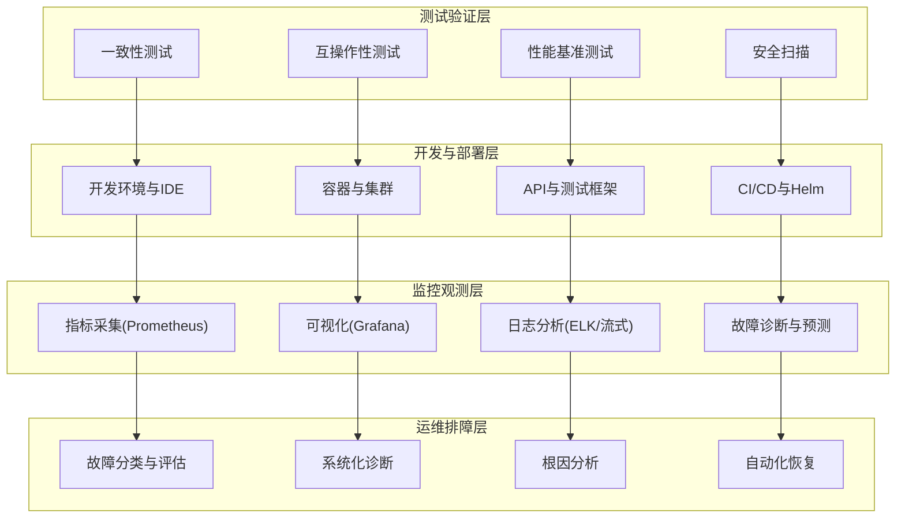
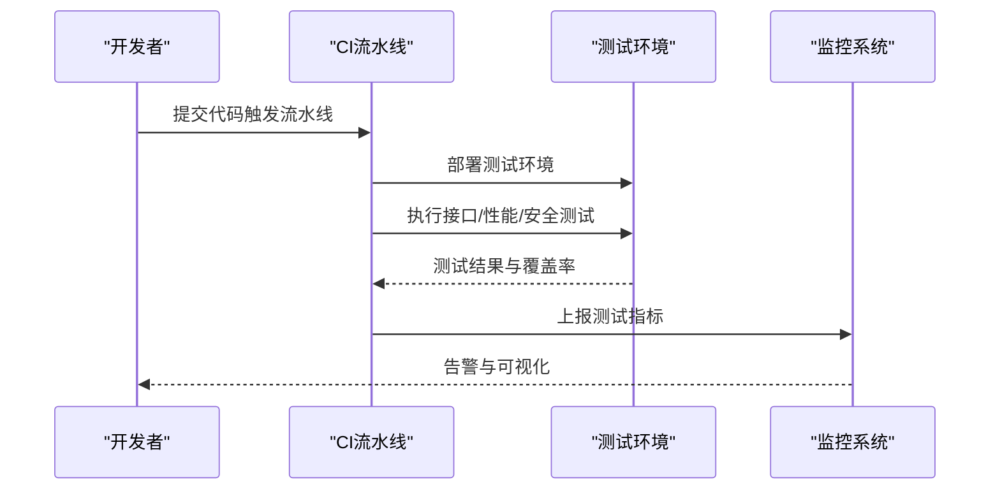
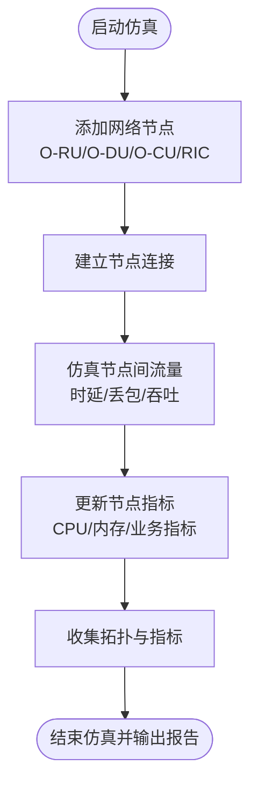
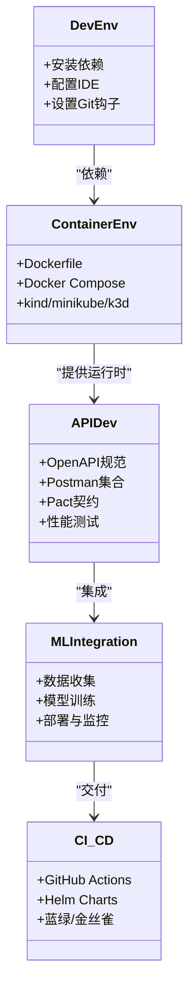
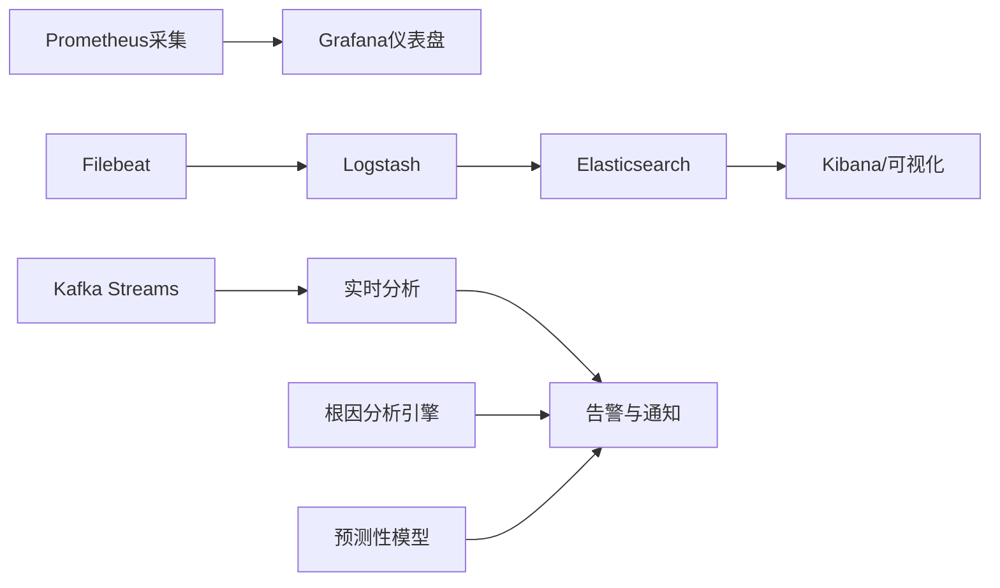
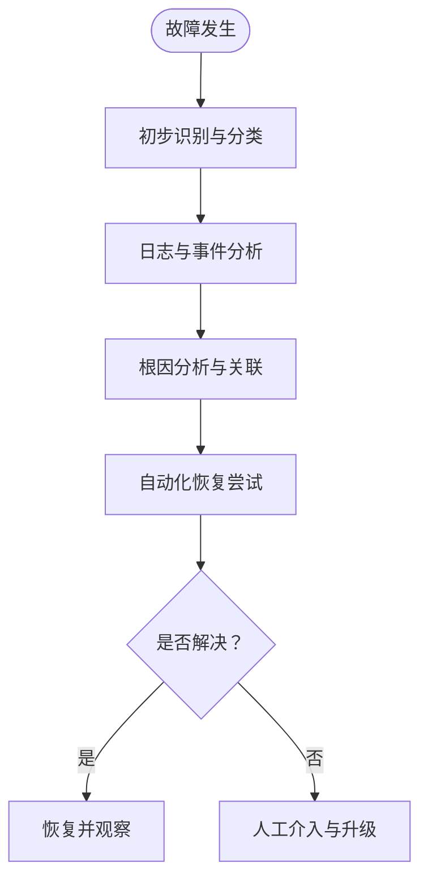
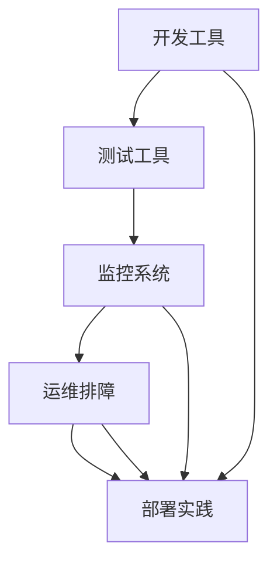

# 工具与实用程序

<cite>
**本文引用的文件**
- [工具与实用程序](file://22-tool-platforms/utility-programs/o-ran-utility-programs.md)
- [O-RAN 开发工具包](file://22-tool-platforms/development-tools/o-ran-development-toolkit.md)
- [O-RAN 监控系统](file://22-tool-platforms/monitoring-systems/o-ran-monitoring-systems.md)
- [O-RAN 测试工具与框架](file://13-testing-validation/testing-tools/testing-tools-frameworks.md)
- [O-RAN 开发者工具与 SDK](file://17-open-source-ecosystem/developer-tools/oran-development-tools.md)
- [O-RAN 性能测试](file://13-testing-validation/performance-testing/performance-testing.md)
- [O-RAN 故障处理与排障指南](file://14-operations-management/fault-handling/fault-troubleshooting-guide.md)
- [O-RAN 运维监控告警系统](file://14-operations-management/monitoring-alerting/operations-monitoring-framework.md)
- [O-RAN 测试一致性验证](file://13-testing-validation/conformance-testing/o-ran-conformance-testing.md)
- [O-RAN 性能监控工具与系统](file://26-performance-optimization/monitoring-tools/o-ran-monitoring-tools.md)
- [O-RAN 部署最佳实践](file://30-best-practices/deployment-practices/o-ran-deployment-best-practices.md)
</cite>

## 目录
1. [简介](#简介)
2. [项目结构](#项目结构)
3. [核心组件](#核心组件)
4. [架构总览](#架构总览)
5. [详细组件分析](#详细组件分析)
6. [依赖关系分析](#依赖关系分析)
7. [性能考量](#性能考量)
8. [故障排查指南](#故障排查指南)
9. [结论](#结论)
10. [附录](#附录)

## 简介
本文件面向 O-RAN 工程师与运维人员，系统梳理 O-RAN 工具与实用程序生态，覆盖测试工具（Keysight、Spirent、Viavi、NI 等厂商方案与开源工具）、仿真工具套件（网络仿真器、RAN 规划工具、时延仿真器、流量生成器）、开发工具框架（xApps/rApps 开发框架、E2 接口 SDK、O1 接口仿真器、部署自动化框架）以及监控工具体系（O-RAN 监控解决方案、接口分析器、KPI 仪表板、日志分析工具）。同时提供工具选型建议、使用最佳实践与常见问题排查方法，帮助读者高效完成 O-RAN 的验证、开发、部署与运维。

## 项目结构
本仓库围绕“工具与实用程序”主题，形成如下知识域分布：
- 测试验证：商业测试平台与开源测试框架、一致性测试、性能测试
- 开发工具：开发环境、容器与本地集群、API 开发与测试、ML/AI 集成、CI/CD
- 监控观测：Prometheus/Grafana、日志分析、故障诊断与预测性维护
- 运维排障：故障分类、诊断方法、根因分析、自动化恢复
- 部署实践：基础设施即代码、持续交付、分阶段上线

**图表来源**
- [O-RAN 测试工具与框架](file://13-testing-validation/testing-tools/testing-tools-frameworks.md#L1-L598)
- [O-RAN 开发工具包](file://22-tool-platforms/development-tools/o-ran-development-toolkit.md#L1-L488)
- [O-RAN 监控系统](file://22-tool-platforms/monitoring-systems/o-ran-monitoring-systems.md#L1-L545)
- [O-RAN 故障处理与排障指南](file://14-operations-management/fault-handling/fault-troubleshooting-guide.md#L1-L633)
- [O-RAN 部署最佳实践](file://30-best-practices/deployment-practices/o-ran-deployment-best-practices.md#L100-L130)

**章节来源**
- [O-RAN 测试工具与框架](file://13-testing-validation/testing-tools/testing-tools-frameworks.md#L1-L598)
- [O-RAN 开发工具包](file://22-tool-platforms/development-tools/o-ran-development-toolkit.md#L1-L488)
- [O-RAN 监控系统](file://22-tool-platforms/monitoring-systems/o-ran-monitoring-systems.md#L1-L545)
- [O-RAN 故障处理与排障指南](file://14-operations-management/fault-handling/fault-troubleshooting-guide.md#L1-L633)
- [O-RAN 部署最佳实践](file://30-best-practices/deployment-practices/o-ran-deployment-best-practices.md#L100-L130)

## 核心组件
- 测试工具与框架：涵盖商业（Keysight、Spirent、Anritsu 等）与开源（Robot Framework、PyTest、Wireshark 插件）测试方案；支持一致性测试、互操作性测试、性能基准测试与安全扫描。
- 仿真工具套件：包含网络仿真器（NS-3 扩展、自研 Python 仿真器）、RAN 规划工具、时延仿真器与流量生成器，支撑端到端链路验证与容量规划。
- 开发工具框架：提供 IDE 配置、容器化开发环境、Kubernetes 本地集群、API 规范与测试、ML/AI 集成、CI/CD 流水线与 Helm 图表模板。
- 监控工具体系：基于 Prometheus/Grafana 的指标采集与可视化，ELK 日志处理与流式分析，故障诊断与根因分析，以及预测性维护与健康评分。
- 运维排障：系统化的故障分类、诊断流程、根因分析方法与自动化恢复脚本，结合网络抓包与资源监控进行快速定位与修复。

**章节来源**
- [O-RAN 测试工具与框架](file://13-testing-validation/testing-tools/testing-tools-frameworks.md#L1-L598)
- [O-RAN 开发者工具与 SDK](file://17-open-source-ecosystem/developer-tools/oran-development-tools.md#L1-L994)
- [O-RAN 监控系统](file://22-tool-platforms/monitoring-systems/o-ran-monitoring-systems.md#L1-L545)
- [O-RAN 故障处理与排障指南](file://14-operations-management/fault-handling/fault-troubleshooting-guide.md#L1-L633)

## 架构总览
下图展示 O-RAN 工具与实用程序的整体架构：从测试验证到开发与部署，再到监控观测与运维排障，形成闭环的质量保障与运维体系。

**图表来源**
- [O-RAN 测试工具与框架](file://13-testing-validation/testing-tools/testing-tools-frameworks.md#L1-L598)
- [O-RAN 开发工具包](file://22-tool-platforms/development-tools/o-ran-development-toolkit.md#L1-L488)
- [O-RAN 监控系统](file://22-tool-platforms/monitoring-systems/o-ran-monitoring-systems.md#L1-L545)
- [O-RAN 故障处理与排障指南](file://14-operations-management/fault-handling/fault-troubleshooting-guide.md#L1-L633)

## 详细组件分析

### 测试工具生态系统
- 商业测试平台
  - Keysight：物理层验证、协议栈分析、网络仿真与基准测试、自动化测试序列与报告。
  - Spirent：多厂商 O-RAN 测试、协议一致性、性能与负载测试、安全漏洞评估、自动化场景执行。
  - Anritsu：专用 RAN 测试仪器，信号质量与性能分析、网络优化与现场验证。
- 开源测试工具
  - Wireshark 扩展：O-RAN 协议解析器、显示过滤器、自定义解码器。
  - Robot Framework：模块化测试用例、SSH/网络接口调用、E2/F1/O-FH 接口验证。
  - PyTest：接口连通性、性能与压缩算法有效性测试、端到端链路验证。
  - 容器化测试环境：Dockerfile、Kubernetes 部署清单，支持分布式测试编排。
- 测试方法论与最佳实践
  - CI/CD 集成：GitHub Actions 流水线、单元/集成测试、覆盖率上报、Docker 镜像构建与推送。
  - 测试数据管理：合成数据生成、生产数据脱敏、基线对比与回归分析。
  - 监控与可视化：Prometheus 指标导出、Grafana 仪表盘、测试环境资源使用监控。

**图表来源**
- [O-RAN 测试工具与框架](file://13-testing-validation/testing-tools/testing-tools-frameworks.md#L364-L418)
- [O-RAN 性能测试](file://13-testing-validation/performance-testing/performance-testing.md#L60-L138)

**章节来源**
- [O-RAN 测试工具与框架](file://13-testing-validation/testing-tools/testing-tools-frameworks.md#L1-L598)
- [O-RAN 性能测试](file://13-testing-validation/performance-testing/performance-testing.md#L1-L327)

### 仿真工具套件
- 网络仿真器
  - NS-3 O-RAN 扩展：PHY 层波形生成、前传链路信道建模、同步机制、干扰仿真；支持小小区、宏站、室内优化、农村部署场景。
  - 自研 Python 仿真器：节点抽象（O-RU/O-DU/O-CU/RIC）、拓扑连接、跨节点流量仿真、时延/丢包/吞吐统计、节点资源指标模拟。
- RAN 规划工具：用于覆盖与容量规划、频谱效率优化、站点选址与参数配置。
- 时延仿真器：基于真实链路参数与队列模型，模拟端到端时延分布与抖动特性。
- 流量生成器：支持多种协议（E2/F1/O-FH），可配置并发连接数、数据包大小、传输模式与持续时间，配合性能测试与压力测试。

**图表来源**
- [O-RAN 开发者工具与 SDK](file://17-open-source-ecosystem/developer-tools/oran-development-tools.md#L646-L797)

**章节来源**
- [O-RAN 开发者工具与 SDK](file://17-open-source-ecosystem/developer-tools/oran-development-tools.md#L1-L994)

### 开发工具框架
- IDE 与开发环境
  - VS Code 扩展推荐与设置、JetBrains PyCharm 配置、YAML/JSON Schema 校验、远程开发与容器集成。
- 版本控制与协作
  - Git 分支策略（main/develop/feature/release/hotfix）、预提交钩子（代码风格、安全扫描、许可证头）、Conventional Commits。
- 容器与本地集群
  - Docker 多阶段构建、Docker Compose 示例、kind/minikube/k3d 本地集群、Helm Chart 开发与测试。
- API 开发与测试
  - OpenAPI/Swagger 规范设计原则、Postman 集合与 Newman CLI、消费者驱动契约（Pact）、性能测试（k6/Locust）。
- 机器学习与 AI 集成
  - TensorFlow/Keras 在 RIC 应用中的数据管线、模型训练与部署、ONNX 转换、A/B 测试与漂移检测。
- CI/CD 与部署自动化
  - GitHub Actions 工作流、Docker 镜像构建与推送、Helm Chart 部署、蓝绿/金丝雀/滚动更新策略。

**图表来源**
- [O-RAN 开发工具包](file://22-tool-platforms/development-tools/o-ran-development-toolkit.md#L1-L488)
- [O-RAN 开发者工具与 SDK](file://17-open-source-ecosystem/developer-tools/oran-development-tools.md#L1-L994)

**章节来源**
- [O-RAN 开发工具包](file://22-tool-platforms/development-tools/o-ran-development-toolkit.md#L1-L488)
- [O-RAN 开发者工具与 SDK](file://17-open-source-ecosystem/developer-tools/oran-development-tools.md#L1-L994)

### 监控工具体系
- Prometheus/Grafana 指标体系
  - 节点与基础设施指标、Kubernetes 组件健康、O-RAN 组件（O-CU/O-DU/Near-RT RIC）指标、告警规则与通知路由。
- 日志分析与流式处理
  - Filebeat/Logstash/Elasticsearch/Logstash 管道、Kafka 流处理、实时异常检测与告警。
- 故障诊断与根因分析
  - 故障树分析、症状检测、依赖映射、影响评估、推荐处置动作。
- 预测性维护
  - 统计与多元分析、时间序列预测、健康评分与预防性维护建议。

**图表来源**
- [O-RAN 监控系统](file://22-tool-platforms/monitoring-systems/o-ran-monitoring-systems.md#L1-L545)

**章节来源**
- [O-RAN 监控系统](file://22-tool-platforms/monitoring-systems/o-ran-monitoring-systems.md#L1-L545)
- [O-RAN 运维监控告警系统](file://14-operations-management/monitoring-alerting/operations-monitoring-framework.md#L1-L44)
- [O-RAN 性能监控工具与系统](file://26-performance-optimization/monitoring-tools/o-ran-monitoring-tools.md#L1-L4)

### 运维排障与自动化
- 故障分类与影响评估：网络功能、接口协议、基础设施与平台故障的分级与影响量化。
- 系统化诊断流程：初始问题识别、日志分析、根因分析框架、症状相关性与时间序列聚类。
- 自动化恢复脚本：针对 E2/F1/O-FH 等关键组件的自动重启、参数调整与健康检查。
- 网络抓包与分析：E2/F1/O-FH 接口抓包、TLS 证书验证、资源监控与性能分析。

**图表来源**
- [O-RAN 故障处理与排障指南](file://14-operations-management/fault-handling/fault-troubleshooting-guide.md#L1-L633)

**章节来源**
- [O-RAN 故障处理与排障指南](file://14-operations-management/fault-handling/fault-troubleshooting-guide.md#L1-L633)

## 依赖关系分析
- 测试与开发：测试框架依赖开发环境与容器化部署，CI/CD 将测试结果反馈至监控与告警。
- 监控与排障：监控系统为排障提供数据基础，根因分析与预测性维护提升系统稳定性。
- 部署与运维：基础设施即代码与持续部署确保变更可控，分阶段上线降低风险。

**图表来源**
- [O-RAN 开发工具包](file://22-tool-platforms/development-tools/o-ran-development-toolkit.md#L1-L488)
- [O-RAN 监控系统](file://22-tool-platforms/monitoring-systems/o-ran-monitoring-systems.md#L1-L545)
- [O-RAN 故障处理与排障指南](file://14-operations-management/fault-handling/fault-troubleshooting-guide.md#L1-L633)
- [O-RAN 部署最佳实践](file://30-best-practices/deployment-practices/o-ran-deployment-best-practices.md#L100-L130)

**章节来源**
- [O-RAN 开发工具包](file://22-tool-platforms/development-tools/o-ran-development-toolkit.md#L1-L488)
- [O-RAN 监控系统](file://22-tool-platforms/monitoring-systems/o-ran-monitoring-systems.md#L1-L545)
- [O-RAN 故障处理与排障指南](file://14-operations-management/fault-handling/fault-troubleshooting-guide.md#L1-L633)
- [O-RAN 部署最佳实践](file://30-best-practices/deployment-practices/o-ran-deployment-best-practices.md#L100-L130)

## 性能考量
- 测试维度：吞吐、时延、抖动、丢包、连接密度、资源利用率、可扩展性与容量规划。
- 基准目标：运营商级性能目标（可用性、可靠性、效率、弹性）与竞品指标对比。
- 优化方向：网络接口调优、缓冲区管理、QoS 与调度、CPU/内存/存储/内核参数优化、应用算法与缓存策略、并行与异步处理。
- 持续监控：自动化回归测试、趋势分析、容量规划与合规报告。

**章节来源**
- [O-RAN 性能测试](file://13-testing-validation/performance-testing/performance-testing.md#L1-L327)
- [O-RAN 性能监控工具与系统](file://26-performance-optimization/monitoring-tools/o-ran-monitoring-tools.md#L1-L4)

## 故障排查指南
- 故障分类：网络功能、接口协议、基础设施与平台三类故障的典型症状与影响范围。
- 诊断流程：系统化识别、日志分析、根因分析与关联、影响评估与处置建议。
- 自动化恢复：针对 E2/F1/O-FH 等关键组件的自动重启、参数调整与健康检查脚本。
- 抓包与分析：E2/F1/O-FH 接口抓包、TLS 证书验证、资源监控与性能分析。

**章节来源**
- [O-RAN 故障处理与排障指南](file://14-operations-management/fault-handling/fault-troubleshooting-guide.md#L1-L633)

## 结论
通过将测试工具、仿真工具、开发框架、监控体系与运维排障有机结合，O-RAN 工程团队可以实现从设计验证到部署运维的全生命周期质量与可靠性保障。建议在实际项目中按需组合使用商业与开源工具，结合自动化流水线与监控告警，持续优化性能与稳定性，并以预测性维护与根因分析提升系统韧性。

## 附录
- 工具选型建议
  - 测试：商用平台用于一致性与性能基准，开源框架用于日常自动化与回归测试。
  - 仿真：NS-3 与自研仿真器互补，前者侧重协议与物理层，后者侧重端到端链路与业务指标。
  - 开发：统一 IDE 与容器化环境，结合 CI/CD 与 Helm 图表，确保可重复与可追溯。
  - 监控：Prometheus/Grafana 作为主干，ELK/流式处理补充日志与实时分析，根因与预测性维护增强可观测性。
- 使用最佳实践
  - 测试：以场景驱动的测试用例为主，结合自动化与可视化报告；性能测试与安全扫描纳入 CI。
  - 开发：采用模块化与容器化，遵循 OpenAPI 规范与契约测试；ML/AI 集成需考虑模型版本与漂移监控。
  - 监控：建立分层指标体系与告警策略，结合可视化与趋势分析；定期回顾与优化。
  - 运维：标准化故障分类与处置流程，自动化恢复与升级；分阶段上线与回滚策略。