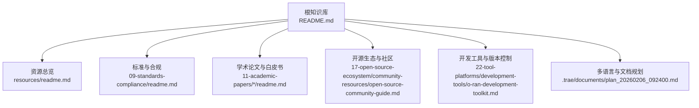
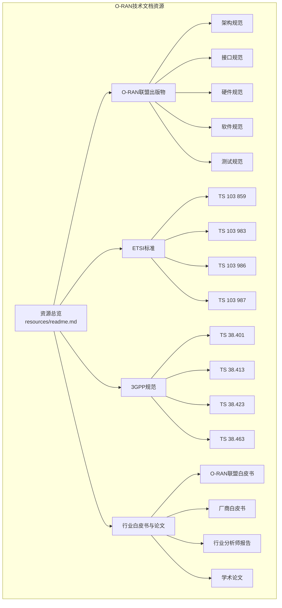
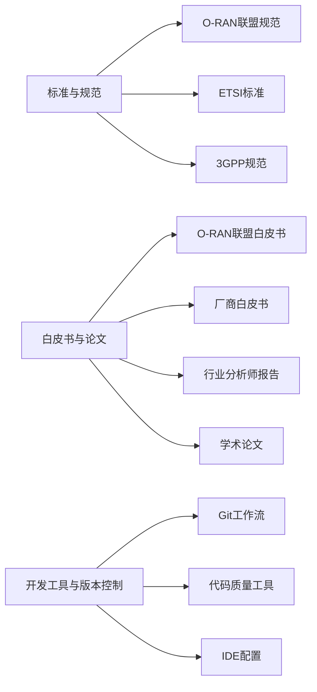

# 技术文档

<cite>
**本文引用的文件**
- [README.md](file://README.md)
- [resources/readme.md](file://resources/readme.md)
- [resources/readme-zh.md](file://resources/readme-zh.md)
- [09-standards-compliance/readme.md](file://09-standards-compliance/readme.md)
- [09-standards-compliance/readme-zh.md](file://09-standards-compliance/readme-zh.md)
- [11-academic-papers/standards/readme.md](file://11-academic-papers/standards/readme.md)
- [11-academic-papers/applications/readme.md](file://11-academic-papers/applications/readme.md)
- [11-academic-papers/surveys/readme.md](file://11-academic-papers/surveys/readme.md)
- [17-open-source-ecosystem/community-resources/open-source-community-guide.md](file://17-open-source-ecosystem/community-resources/open-source-community-guide.md)
- [22-tool-platforms/development-tools/o-ran-development-toolkit.md](file://22-tool-platforms/development-tools/o-ran-development-toolkit.md)
- [22-tool-platforms/development-tools/o-ran-development-toolkit-zh.md](file://22-tool-platforms/development-tools/o-ran-development-toolkit-zh.md)
- [.trae/documents/plan_20260206_092400.md](file://.trae/documents/plan_20260206_092400.md)
</cite>

## 目录
1. [简介](#简介)
2. [项目结构](#项目结构)
3. [核心组件](#核心组件)
4. [架构总览](#架构总览)
5. [详细组件分析](#详细组件分析)
6. [依赖分析](#依赖分析)
7. [性能考量](#性能考量)
8. [故障排查指南](#故障排查指南)
9. [结论](#结论)
10. [附录](#附录)

## 简介
本文件面向O-RAN技术文档使用者，提供系统化的资源导航与应用指导，覆盖O-RAN联盟出版物、ETSI标准、3GPP规范、行业白皮书与学术论文，并给出文档分类管理、版本控制与更新跟踪的最佳实践。内容基于仓库内已有的权威文档与知识库，帮助读者高效定位所需资料、理解技术要点、掌握实施方法与应用技巧。

## 项目结构
该知识库按主题域进行编号化组织，便于按阶段学习与检索。与“技术文档”目标直接相关的内容主要分布在以下区域：
- 资源总览与索引：resources/
- 标准与合规：09-standards-compliance/
- 学术论文与白皮书：11-academic-papers/
- 开源生态与社区：17-open-source-ecosystem/
- 开发工具与版本控制：22-tool-platforms/development-tools/
- 多语言与文档规划：.trae/documents/

图表来源
- [README.md](file://README.md#L1-L472)
- [resources/readme.md](file://resources/readme.md#L1-L126)
- [09-standards-compliance/readme.md](file://09-standards-compliance/readme.md#L1-L371)
- [11-academic-papers/standards/readme.md](file://11-academic-papers/standards/readme.md#L1-L34)
- [17-open-source-ecosystem/community-resources/open-source-community-guide.md](file://17-open-source-ecosystem/community-resources/open-source-community-guide.md#L1-L494)
- [22-tool-platforms/development-tools/o-ran-development-toolkit.md](file://22-tool-platforms/development-tools/o-ran-development-toolkit.md#L44-L89)
- [.trae/documents/plan_20260206_092400.md](file://.trae/documents/plan_20260206_092400.md#L1-L65)

章节来源
- [README.md](file://README.md#L1-L472)

## 核心组件
围绕“技术文档”的目标，本节聚焦四类核心资源与支撑能力：
- O-RAN联盟出版物：架构、接口、硬件、软件、测试规范
- ETSI标准：TS 103 859、TS 103 983、TS 103 986、TS 103 987等
- 3GPP规范：TS 38.401、TS 38.413、TS 38.423、TS 38.463等
- 行业白皮书与学术论文：O-RAN联盟白皮书、厂商白皮书、行业分析师报告、学术综述与应用论文

章节来源
- [resources/readme.md](file://resources/readme.md#L6-L31)
- [resources/readme-zh.md](file://resources/readme-zh.md#L6-L31)
- [09-standards-compliance/readme.md](file://09-standards-compliance/readme.md#L8-L44)
- [09-standards-compliance/readme-zh.md](file://09-standards-compliance/readme-zh.md#L8-L44)
- [11-academic-papers/standards/readme.md](file://11-academic-papers/standards/readme.md#L1-L34)
- [11-academic-papers/applications/readme.md](file://11-academic-papers/applications/readme.md#L1-L66)
- [11-academic-papers/surveys/readme.md](file://11-academic-papers/surveys/readme.md#L1-L34)

## 架构总览
下图展示O-RAN技术文档资源的总体架构与关键入口，帮助读者快速定位到相应主题域与权威来源。

图表来源
- [resources/readme.md](file://resources/readme.md#L8-L31)
- [09-standards-compliance/readme.md](file://09-standards-compliance/readme.md#L46-L76)
- [09-standards-compliance/readme.md](file://09-standards-compliance/readme.md#L78-L108)
- [11-academic-papers/standards/readme.md](file://11-academic-papers/standards/readme.md#L1-L34)
- [11-academic-papers/applications/readme.md](file://11-academic-papers/applications/readme.md#L1-L66)
- [11-academic-papers/surveys/readme.md](file://11-academic-papers/surveys/readme.md#L1-L34)

## 详细组件分析

### O-RAN联盟出版物
- 获取途径
  - 官方文档索引与版本追踪：参见“学习资源”与“推荐活动”，明确各WG规范的最新版本与下载地址。
  - 社区与开源文档：通过O-RAN软件社区（OSC）与相关文档仓库获取补充材料与参考实现。
- 理解方法
  - 以工作组（WG）为单位分层学习：架构（WG2）、接口（WG3）、硬件（WG4）、软件（WG5）、安全（WG6）、测试（WG8）。
  - 对照接口规范与协议栈，理解各组件间的关系与职责边界。
- 应用技巧
  - 将规范要求转化为测试用例与集成策略，确保实现与标准一致。
  - 建立规范变更追踪机制，及时纳入系统升级与回归测试。

章节来源
- [09-standards-compliance/readme.md](file://09-standards-compliance/readme.md#L8-L44)
- [09-standards-compliance/readme-zh.md](file://09-standards-compliance/readme-zh.md#L8-L44)
- [17-open-source-ecosystem/community-resources/open-source-community-guide.md](file://17-open-source-ecosystem/community-resources/open-source-community-guide.md#L86-L119)

### ETSI标准
- 技术要点
  - TS 103 859：前传控制面、用户面、同步面与传输配置文件。
  - TS 103 983：A1接口通用规范与原则，策略管理框架与安全要求。
  - TS 103 986：A1接口传输协议（RESTful API、JSON、HTTP/HTTPS、错误处理与性能）。
  - TS 103 987：前传传输配置文件定义、类型、参数与验证要求。
  - GS ORAN-005：O-RAN安全架构（威胁分析、机制设计、合规要求）。
- 应用场景
  - 前传接口一致性与性能验证、A1策略下发与执行、安全域边界与合规审计。
- 实施要求
  - 明确传输配置文件与参数约束，建立配置管理与验证流程。
  - 强化A1接口的API契约与错误处理，确保跨厂商互通。

章节来源
- [09-standards-compliance/readme.md](file://09-standards-compliance/readme.md#L46-L76)
- [09-standards-compliance/readme-zh.md](file://09-standards-compliance/readme-zh.md#L46-L76)

### 3GPP规范
- 核心内容
  - NG-RAN架构与接口：F1、E1、Xn、NG、N2/N3等接口规范。
  - RAN智能控制器（RIC）：功能概述、相关接口、性能测量与KPI定义。
  - 版本演进：Release 15–18及未来方向。
- 技术实现
  - 将3GPP RAN架构与O-RAN规范协同应用，确保RIC与A1/E2接口的一致性。
  - 借助性能测量与KPI体系，构建端到端质量保障。
- 部署考虑
  - 关注不同Release的特性差异与迁移路径，制定平滑升级策略。

章节来源
- [09-standards-compliance/readme.md](file://09-standards-compliance/readme.md#L78-L108)
- [09-standards-compliance/readme-zh.md](file://09-standards-compliance/readme-zh.md#L78-L108)

### 行业白皮书与学术论文
- O-RAN联盟白皮书：提供标准框架、合规测试与多厂商互操作的综合参考。
- 厂商白皮书：展示解决方案、部署案例与技术优势。
- 行业分析师报告：洞察市场趋势、技术成熟度与投资机会。
- 学术论文：涵盖架构设计、RIC与AI应用、接口标准分析、部署与合规研究等。

章节来源
- [resources/readme.md](file://resources/readme.md#L27-L31)
- [resources/readme-zh.md](file://resources/readme-zh.md#L27-L31)
- [11-academic-papers/standards/readme.md](file://11-academic-papers/standards/readme.md#L1-L34)
- [11-academic-papers/applications/readme.md](file://11-academic-papers/applications/readme.md#L1-L66)
- [11-academic-papers/surveys/readme.md](file://11-academic-papers/surveys/readme.md#L1-L34)

### 开发工具与版本控制
- 版本控制与协作
  - Git分支策略：main/master、develop、feature/*、release/*、hotfix/*。
  - Git钩子：pre-commit（代码风格、安全扫描、许可证头、规范合规）、commit-msg（约定式提交、问题跟踪、变更日志）、post-commit（自动化测试、覆盖率、文档更新通知）。
- 代码质量管理
  - 静态分析：SonarQube、语言特定检查工具（如pylint/flake8/black等）。
  - 安全扫描：SAST（Checkmarx/Veracode）、SCA（OWASP Dependency-Check）、容器扫描（Clair/Trivy）、基础设施扫描（TFSec/KICS）。
- IDE与开发环境
  - PyCharm插件生态、代码模板、远程开发配置（Docker/Kubernetes/云开发环境）。

章节来源
- [22-tool-platforms/development-tools/o-ran-development-toolkit.md](file://22-tool-platforms/development-tools/o-ran-development-toolkit.md#L44-L89)
- [22-tool-platforms/development-tools/o-ran-development-toolkit-zh.md](file://22-tool-platforms/development-tools/o-ran-development-toolkit-zh.md#L64-L109)

### 多语言与文档规划
- 中英文双语推进：依据计划，为关键目录创建中文版readme，确保内容一致、术语准确、链接正确。
- 根目录README维护：确保根目录README与各子目录内容保持一致，便于全局导航。

章节来源
- [.trae/documents/plan_20260206_092400.md](file://.trae/documents/plan_20260206_092400.md#L1-L65)

## 依赖分析
O-RAN技术文档资源之间存在如下依赖关系：
- 标准与规范相互补充：O-RAN联盟规范定义架构与接口，ETSI提供前传与A1接口细节，3GPP提供RAN基础架构与协议，三者协同构成O-RAN标准体系。
- 白皮书与论文提供背景与前沿：为标准理解与实践提供理论支撑与案例借鉴。
- 开发工具与版本控制支撑落地：Git工作流、代码质量工具与IDE配置保障文档与代码的高质量管理。

图表来源
- [09-standards-compliance/readme.md](file://09-standards-compliance/readme.md#L46-L108)
- [resources/readme.md](file://resources/readme.md#L15-L31)
- [22-tool-platforms/development-tools/o-ran-development-toolkit.md](file://22-tool-platforms/development-tools/o-ran-development-toolkit.md#L66-L89)

章节来源
- [09-standards-compliance/readme.md](file://09-standards-compliance/readme.md#L46-L108)
- [resources/readme.md](file://resources/readme.md#L15-L31)
- [22-tool-platforms/development-tools/o-ran-development-toolkit.md](file://22-tool-platforms/development-tools/o-ran-development-toolkit.md#L66-L89)

## 性能考量
- 标准一致性与性能：严格遵循ETSI前传与A1接口规范，确保低延迟与高吞吐量。
- 测试与基准：结合3GPP PM与KPI规范，建立性能测试与基准体系。
- 代码质量与CI/CD：通过静态分析与安全扫描，减少回归风险，提升交付质量。

## 故障排查指南
- 标准合规性问题
  - 使用“合规验证”流程，开展自评估、第三方审核与持续监控。
  - 参与Plugfest与互操作性测试，提前发现并解决兼容性问题。
- 接口与协议问题
  - 对照ETSI与3GPP接口规范，逐项核对消息格式、错误处理与性能要求。
- 文档与版本问题
  - 建立规范版本追踪与变更管理，确保文档与实现同步。

章节来源
- [09-standards-compliance/readme.md](file://09-standards-compliance/readme.md#L110-L134)
- [09-standards-compliance/readme.md](file://09-standards-compliance/readme.md#L155-L161)

## 结论
本技术文档资源指导以“权威来源—系统理解—实践应用—持续改进”为主线，帮助读者高效获取并应用O-RAN联盟、ETSI与3GPP的关键规范，同时结合白皮书与学术论文深化认知，依托开发工具与版本控制保障文档与实现的质量与一致性。建议按主题域逐步深入，建立规范追踪与合规验证闭环，持续跟踪标准演进，保持技术领先。

## 附录
- 快速入口
  - 资源总览：[resources/readme.md](file://resources/readme.md#L1-L126)
  - 标准与合规：[09-standards-compliance/readme.md](file://09-standards-compliance/readme.md#L1-L371)
  - 学术论文与白皮书：[11-academic-papers/*/readme.md](file://11-academic-papers/standards/readme.md#L1-L34)
  - 开源生态与社区：[17-open-source-ecosystem/community-resources/open-source-community-guide.md](file://17-open-source-ecosystem/community-resources/open-source-community-guide.md#L1-L494)
  - 开发工具与版本控制：[22-tool-platforms/development-tools/o-ran-development-toolkit.md](file://22-tool-platforms/development-tools/o-ran-development-toolkit.md#L44-L89)