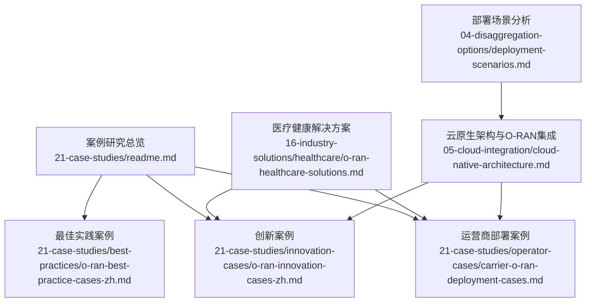
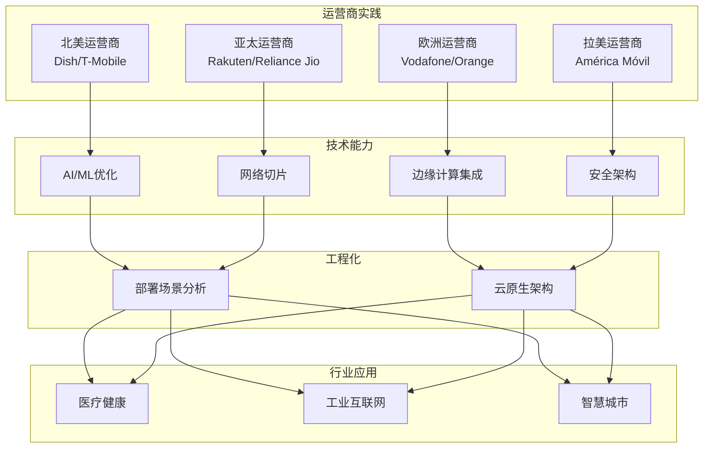
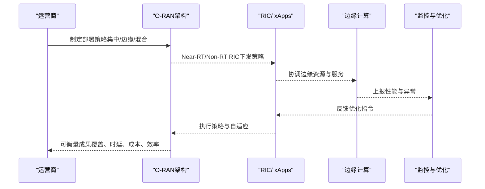
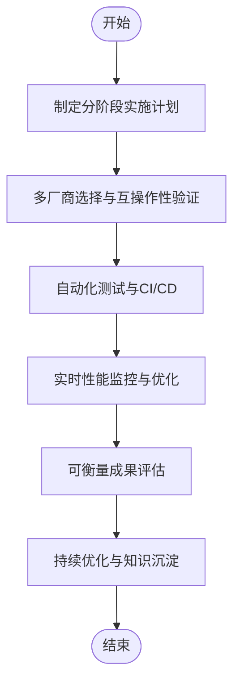
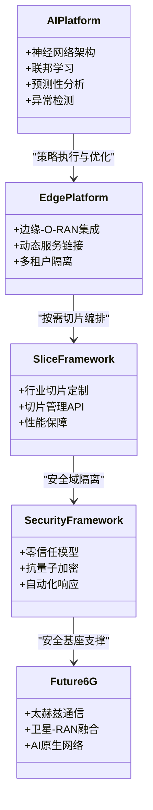
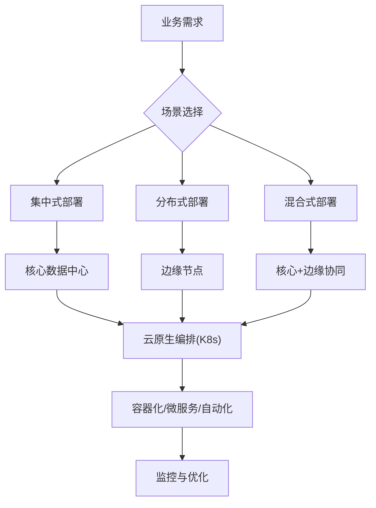
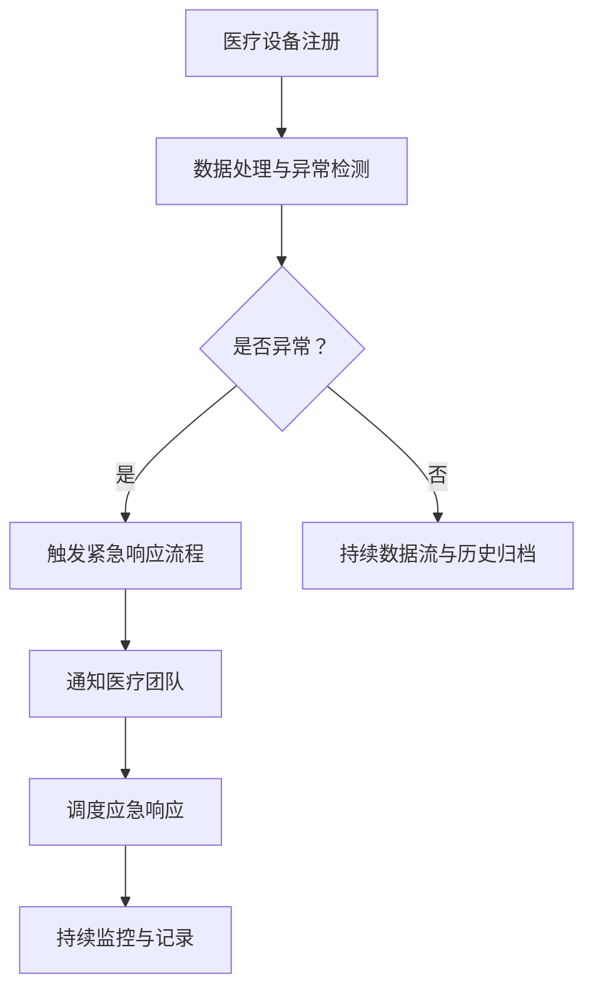

# 案例研究

<cite>
**本文引用的文件**
- [运营商O-RAN部署案例](file://21-case-studies/operator-cases/carrier-o-ran-deployment-cases.md)
- [运营商O-RAN部署案例（英文）](file://21-case-studies/operator-cases/carrier-o-ran-deployment-cases.md)
- [最佳实践案例](file://21-case-studies/best-practices/o-ran-best-practice-cases-zh.md)
- [创新案例](file://21-case-studies/innovation-cases/o-ran-innovation-cases-zh.md)
- [部署场景分析](file://04-disaggregation-options/deployment-scenarios.md)
- [云原生架构与O-RAN集成](file://05-cloud-integration/cloud-native-architecture.md)
- [O-RAN医疗健康解决方案](file://16-industry-solutions/healthcare/o-ran-healthcare-solutions.md)
- [O-RAN案例研究总览](file://21-case-studies/readme.md)
</cite>

## 目录
1. [引言](#引言)
2. [项目结构](#项目结构)
3. [核心组件](#核心组件)
4. [架构总览](#架构总览)
5. [详细组件分析](#详细组件分析)
6. [依赖分析](#依赖分析)
7. [性能考虑](#性能考虑)
8. [故障排查指南](#故障排查指南)
9. [结论](#结论)
10. [附录](#附录)

## 引言
本文件面向O-RAN案例研究的学习者与实践者，系统梳理全球运营商（如AT&T、德国电信、威瑞森、沃达丰、Orange、NTT DOCOMO、Rakuten Mobile、Reliance Jio、América Móvil等）的部署历程、技术选择与策略，并结合垂直行业（如工业互联网、智慧城市、医疗健康）的应用实践，总结经验教训与可复用的最佳实践。同时，提供分析框架、学习方法与实践路径，帮助读者从真实案例中提炼可迁移的模式与方法论。

## 项目结构
本仓库围绕O-RAN的“架构—组件—接口—解耦—云原生—案例—标准—测试—运维—安全—生态”形成完整知识体系。与本案例研究直接相关的主要目录如下：
- 21-case-studies：包含运营商部署案例、最佳实践、创新案例与行业应用案例的汇总与分析
- 04-disaggregation-options：部署场景与功能拆分的工程化指南
- 05-cloud-integration：云原生与O-RAN融合的架构与实践
- 16-industry-solutions：垂直行业（如医疗健康）的O-RAN应用模板与参考

**图表来源**
- [O-RAN案例研究总览](file://21-case-studies/readme.md#L1-L33)
- [运营商O-RAN部署案例](file://21-case-studies/operator-cases/carrier-o-ran-deployment-cases.md#L1-L401)
- [最佳实践案例](file://21-case-studies/best-practices/o-ran-best-practice-cases-zh.md#L1-L210)
- [创新案例](file://21-case-studies/innovation-cases/o-ran-innovation-cases-zh.md#L1-L322)
- [部署场景分析](file://04-disaggregation-options/deployment-scenarios.md#L1-L563)
- [云原生架构与O-RAN集成](file://05-cloud-integration/cloud-native-architecture.md#L1-L481)
- [O-RAN医疗健康解决方案](file://16-industry-solutions/healthcare/o-ran-healthcare-solutions.md#L1-L484)

**章节来源**
- [O-RAN案例研究总览](file://21-case-studies/readme.md#L1-L33)

## 核心组件
- 运营商部署案例：覆盖北美、欧洲、亚太、拉美四大区域的代表性运营商，展示从“绿地建设”到“混合集成”再到“规模化部署”的不同路径与成效。
- 最佳实践案例：聚焦德国电信、乐天移动、威瑞森、沃达丰等的阶段性推进、自动化与运营优化、可衡量成果与经验教训。
- 创新案例：涵盖AI/ML驱动的网络优化、边缘计算融合、网络切片创新、安全架构创新以及面向6G的前瞻性实验网络。
- 部署场景分析：提供集中式、分布式、混合式部署的场景化指南，支撑不同业务密度、延迟与成本约束下的工程选择。
- 云原生架构：阐述容器化、微服务、编排与基础设施即代码在O-RAN中的落地要点与挑战。
- 行业应用：以医疗健康为例，给出网络切片、IoT接入、远程手术等场景的架构与数据流参考。

**章节来源**
- [运营商O-RAN部署案例](file://21-case-studies/operator-cases/carrier-o-ran-deployment-cases.md#L1-L401)
- [最佳实践案例](file://21-case-studies/best-practices/o-ran-best-practice-cases-zh.md#L1-L210)
- [创新案例](file://21-case-studies/innovation-cases/o-ran-innovation-cases-zh.md#L1-L322)
- [部署场景分析](file://04-disaggregation-options/deployment-scenarios.md#L1-L563)
- [云原生架构与O-RAN集成](file://05-cloud-integration/cloud-native-architecture.md#L1-L481)
- [O-RAN医疗健康解决方案](file://16-industry-solutions/healthcare/o-ran-healthcare-solutions.md#L1-L484)

## 架构总览
以下图示化展示O-RAN案例研究的知识映射关系：从运营商实践到技术能力（AI/ML、边缘、切片、安全），再到部署场景与云原生工程化，最终落到垂直行业应用。

**图表来源**
- [运营商O-RAN部署案例](file://21-case-studies/operator-cases/carrier-o-ran-deployment-cases.md#L1-L401)
- [创新案例](file://21-case-studies/innovation-cases/o-ran-innovation-cases-zh.md#L1-L322)
- [部署场景分析](file://04-disaggregation-options/deployment-scenarios.md#L1-L563)
- [云原生架构与O-RAN集成](file://05-cloud-integration/cloud-native-architecture.md#L1-L481)
- [O-RAN医疗健康解决方案](file://16-industry-solutions/healthcare/o-ran-healthcare-solutions.md#L1-L484)

## 详细组件分析

### 运营商部署案例分析（AT&T、Telefonica、Vodafone、NTT DOCOMO、Rakuten、Jio、América Móvil）
- AT&T：认知RAN平台，基于AI/ML的资源分配、联邦学习、预测性分析与xApps执行，实现频谱效率、能耗、延迟与资源利用率的显著提升。
- Telefonica（以Orange法国为代表）：自组织网络与RIC的高级应用，实现自动配置、自愈能力与99.99%可用性；在企业与消费者服务上形成差异化优势。
- Vodafone：欧洲统一标准与区域适配，实现跨国家的架构一致性、成本降低与服务创新加速。
- NTT DOCOMO：6G实验网络，融合太赫兹通信、卫星-RAN与AI原生网络，探索XR、触觉互联网与太空探索通信。
- Rakuten Mobile：从零开始的云原生、全虚拟化网络，实现自动化、自组织与持续交付，显著降低运营成本并提升创新能力。
- Reliance Jio：在地理与人口复杂环境下实现大规模部署，强调成本优化、本地制造与预测性维护。
- América Móvil：区域化协调与本地化适配，实现跨境标准化与差异化服务的平衡。

**图表来源**
- [运营商O-RAN部署案例](file://21-case-studies/operator-cases/carrier-o-ran-deployment-cases.md#L1-L401)
- [创新案例](file://21-case-studies/innovation-cases/o-ran-innovation-cases-zh.md#L1-L322)
- [云原生架构与O-RAN集成](file://05-cloud-integration/cloud-native-architecture.md#L1-L481)

**章节来源**
- [运营商O-RAN部署案例](file://21-case-studies/operator-cases/carrier-o-ran-deployment-cases.md#L8-L352)
- [创新案例](file://21-case-studies/innovation-cases/o-ran-innovation-cases-zh.md#L8-L231)

### 最佳实践案例（德国电信、乐天移动、威瑞森、沃达风）
- 德国电信：三阶段部署（试点→区域→全国），厂商多元化、自动化测试与实时监控，取得部署时间、运营支出、能效与可用性的显著改善。
- 乐天移动：零接触配置与云原生架构，实现资本效率、服务敏捷性、可扩展性与创新速度的跃升。
- 威瑞森：MEC与O-RAN集成，支撑制造业、医疗健康等企业应用，实现低时延、高带宽与高可靠。
- 沃达丰：农村覆盖扩展，通过共享基础设施、简化硬件与可再生能源集成，实现社会与经济效益。

**图表来源**
- [最佳实践案例](file://21-case-studies/best-practices/o-ran-best-practice-cases-zh.md#L11-L209)

**章节来源**
- [最佳实践案例](file://21-case-studies/best-practices/o-ran-best-practice-cases-zh.md#L6-L129)

### 创新案例（AI/ML、边缘、切片、安全、6G前瞻）
- AI/ML驱动的网络优化：深度强化学习、联邦学习、预测性分析与异常检测，显著提升频谱效率、能耗与容量利用率。
- 边缘计算集成：边缘-O-RAN架构，实现亚毫秒级时延与千并发边缘服务，支撑AR/VR、工业物联网与智慧城市。
- 网络切片：面向制造、医疗、交通、娱乐的定制化切片，提供确定性时延、隔离安全域与QoS保障。
- 安全创新：零信任架构、AI入侵检测、抗量子加密与自动化威胁响应，实现高安全与高可用。
- 6G前瞻：太赫兹通信、卫星-RAN融合与AI原生网络，探索全息通信与脑机接口。

**图表来源**
- [创新案例](file://21-case-studies/innovation-cases/o-ran-innovation-cases-zh.md#L6-L231)

**章节来源**
- [创新案例](file://21-case-studies/innovation-cases/o-ran-innovation-cases-zh.md#L6-L231)

### 部署场景与工程化（集中/边缘/混合、云原生）
- 部署场景：集中式（核心城市）、分布式（边缘/微站）、混合式（核心-边缘/分层），分别对应eMBB、URLLC、mMTC等业务类型与成本、延迟、可靠性约束。
- 云原生：容器化、微服务、编排与基础设施即代码，支撑弹性、可观测性与自动化；针对实时性、可靠性、安全性与可观测性提出针对性挑战与最佳实践。
- 案例验证：核心城市集中式、工业园区边缘式、农村地区混合式，均取得管理效率、资源利用率、时延与运维成本的积极改善。

**图表来源**
- [部署场景分析](file://04-disaggregation-options/deployment-scenarios.md#L59-L215)
- [云原生架构与O-RAN集成](file://05-cloud-integration/cloud-native-architecture.md#L65-L122)

**章节来源**
- [部署场景分析](file://04-disaggregation-options/deployment-scenarios.md#L1-L563)
- [云原生架构与O-RAN集成](file://05-cloud-integration/cloud-native-architecture.md#L1-L481)

### 垂直行业应用（医疗健康）
- 医疗网络切片：紧急服务、患者监测、行政管理等切片的优先级、时延、可靠性与QoS参数明确，支撑远程手术、连续监护与电子病历。
- 医疗IoT：设备注册、数据处理、异常检测与紧急响应流程，结合AI辅助与边缘计算，实现生命体征的实时监测与自动预警。
- 远程手术：超低时延连接、触觉反馈、AR引导与AI辅助，确保远程手术的精准与安全。

**图表来源**
- [O-RAN医疗健康解决方案](file://16-industry-solutions/healthcare/o-ran-healthcare-solutions.md#L52-L249)

**章节来源**
- [O-RAN医疗健康解决方案](file://16-industry-solutions/healthcare/o-ran-healthcare-solutions.md#L1-L484)

## 依赖分析
- 案例与技术能力的耦合关系：运营商实践驱动AI/ML、边缘、切片与安全等能力的落地；这些能力反过来指导部署场景选择与云原生工程化。
- 场景与工程化：不同业务密度与延迟要求决定集中/边缘/混合部署；云原生提供自动化、弹性与可观测性支撑。
- 行业应用：医疗健康等垂直行业对时延、可靠性与安全提出刚性约束，需由网络切片与边缘计算协同保障。

**图表来源**
- [运营商O-RAN部署案例](file://21-case-studies/operator-cases/carrier-o-ran-deployment-cases.md#L1-L401)
- [创新案例](file://21-case-studies/innovation-cases/o-ran-innovation-cases-zh.md#L1-L322)
- [部署场景分析](file://04-disaggregation-options/deployment-scenarios.md#L1-L563)
- [云原生架构与O-RAN集成](file://05-cloud-integration/cloud-native-architecture.md#L1-L481)
- [O-RAN医疗健康解决方案](file://16-industry-solutions/healthcare/o-ran-healthcare-solutions.md#L1-L484)

**章节来源**
- [运营商O-RAN部署案例](file://21-case-studies/operator-cases/carrier-o-ran-deployment-cases.md#L319-L374)
- [最佳实践案例](file://21-case-studies/best-practices/o-ran-best-practice-cases-zh.md#L129-L209)

## 性能考虑
- 时延与可靠性：边缘部署与切片隔离是满足URLLC的关键；云原生监控与AI驱动优化可降低端到端时延并提升可用性。
- 资源效率：容器化与弹性编排提升资源利用率；自动化测试与CI/CD缩短部署周期并降低运维成本。
- 安全与合规：零信任与抗量子加密满足高安全场景；自动化审计与取证能力支撑合规要求。
- 成本与收益：规模化部署与共享基础设施降低CAPEX/OPX；服务敏捷性与差异化带来收入增长。

[本节为通用指导，不直接分析具体文件]

## 故障排查指南
- 监控与告警：统一采集指标、日志与追踪，结合AI异常检测与根因分析，快速定位问题。
- 自愈与恢复：基于云原生的自动故障转移、滚动回滚与自愈流程，缩短恢复时间。
- 互操作性：通过标准化接口与多厂商互操作性测试，降低集成风险。
- 变更管理：以基础设施即代码与CI/CD流水线保障变更一致性与可追溯性。

**章节来源**
- [云原生架构与O-RAN集成](file://05-cloud-integration/cloud-native-architecture.md#L123-L176)
- [最佳实践案例](file://21-case-studies/best-practices/o-ran-best-practice-cases-zh.md#L149-L177)

## 结论
通过对全球运营商与创新实践的系统梳理，可以提炼出以下关键结论：
- 成功的O-RAN部署需要清晰的战略目标、成熟的工程能力与组织变革的协同。
- 部署场景应与业务类型、成本与性能约束相匹配；云原生为自动化、弹性与可观测性提供基础。
- AI/ML、边缘计算、网络切片与安全创新是差异化竞争与业务增长的关键抓手。
- 垂直行业应用以确定性时延、高可靠与安全为前提，需通过切片与边缘协同保障。

[本节为总结性内容，不直接分析具体文件]

## 附录
- 分析框架与学习方法
  - 框架：以“业务目标—技术选型—部署场景—工程化—行业应用—评估改进”为主线，逐层递进。
  - 方法：对比不同区域与运营商的路径差异，提炼可迁移的模式与方法论。
- 实践应用指导
  - 从试点到规模化：分阶段推进、自动化优先、性能基线与风险管理并重。
  - 多厂商协同：建立标准化接口与互操作性测试流程，避免厂商锁定。
  - 成本效益：以ROI为导向，平衡初期投资与长期运营成本，关注能效与资源利用率。
  - 知识管理：沉淀经验教训、最佳实践与案例库，形成可复用的知识资产。

**章节来源**
- [运营商O-RAN部署案例](file://21-case-studies/operator-cases/carrier-o-ran-deployment-cases.md#L375-L400)
- [最佳实践案例](file://21-case-studies/best-practices/o-ran-best-practice-cases-zh.md#L190-L209)
- [创新案例](file://21-case-studies/innovation-cases/o-ran-innovation-cases-zh.md#L292-L321)