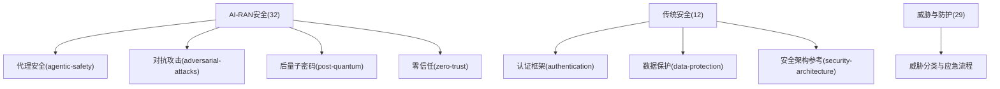
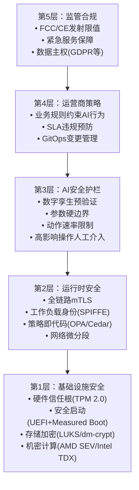
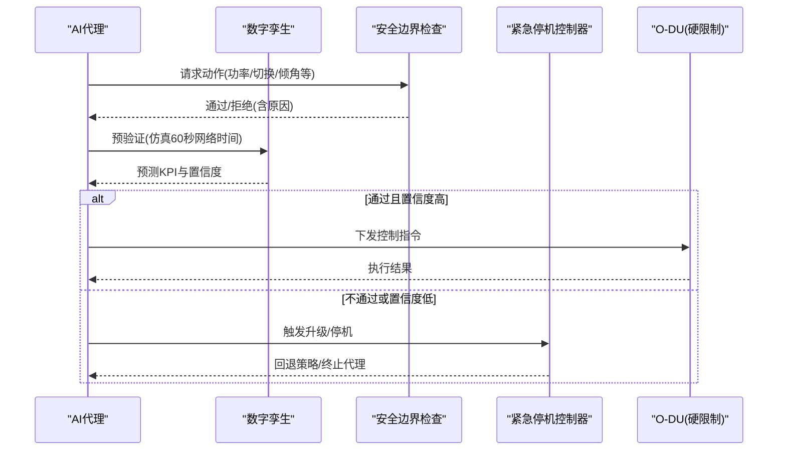
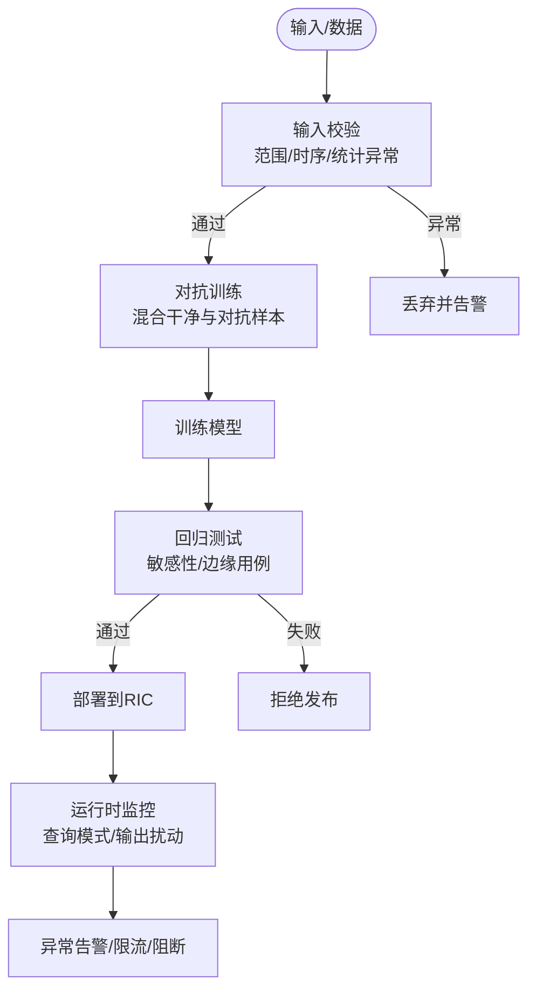
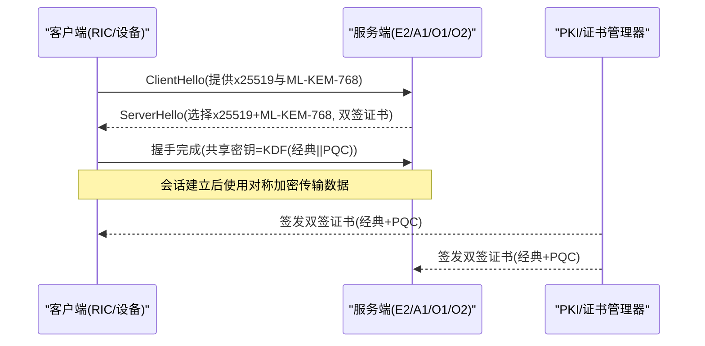
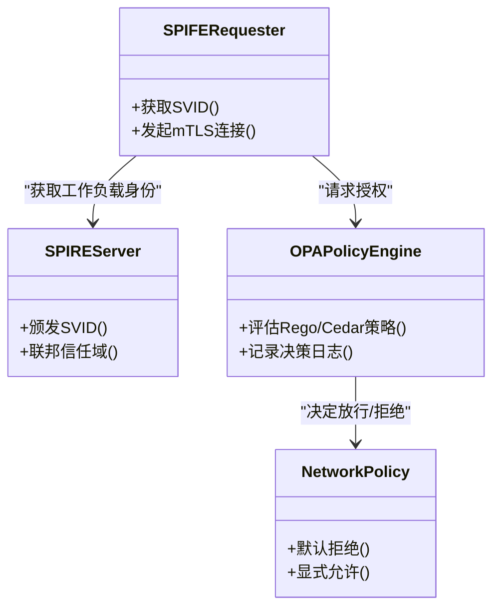
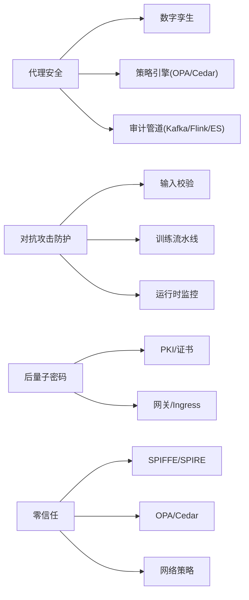

# AI-RAN安全

<cite>
**本文引用的文件**
- [32-ai-ran-security/readme.md](file://32-ai-ran-security/readme.md)
- [32-ai-ran-security/agentic-safety/readme.md](file://32-ai-ran-security/agentic-safety/readme.md)
- [32-ai-ran-security/adversarial-attacks/readme.md](file://32-ai-ran-security/adversarial-attacks/readme.md)
- [32-ai-ran-security/post-quantum/readme.md](file://32-ai-ran-security/post-quantum/readme.md)
- [32-ai-ran-security/zero-trust/readme.md](file://32-ai-ran-security/zero-trust/readme.md)
- [12-security-privacy/readme.md](file://12-security-privacy/readme.md)
- [12-security-privacy/security-architecture/security-reference-architecture-zh.md](file://12-security-privacy/security-architecture/security-reference-architecture-zh.md)
- [12-security-privacy/authentication/authentication-framework-zh.md](file://12-security-privacy/authentication/authentication-framework-zh.md)
- [12-security-privacy/data-protection/data-protection-framework-zh.md](file://12-security-privacy/data-protection/data-protection-framework-zh.md)
- [29-security-threats/readme.md](file://29-security-threats/readme.md)
- [README.md](file://README.md)
</cite>

## 目录
1. [引言](#引言)
2. [项目结构](#项目结构)
3. [核心组件](#核心组件)
4. [架构总览](#架构总览)
5. [详细组件分析](#详细组件分析)
6. [依赖关系分析](#依赖关系分析)
7. [性能考量](#性能考量)
8. [故障排查指南](#故障排查指南)
9. [结论](#结论)
10. [附录](#附录)

## 引言
本章节聚焦AI-RAN安全，围绕O-RAN WG11 Secure AI（2026）与IEEE CAI 2026的Agentic AI安全框架，系统阐述AI-RAN在自治代理、对抗性攻击、后量子密码与零信任方面的安全体系。内容覆盖威胁模型、分层防御、运行时控制、合规审计与事件响应，并提供面向Kubernetes工程的可落地实践清单。

## 项目结构
仓库以主题化目录组织AI-RAN安全与传统安全能力：
- 32-ai-ran-security：AI-RAN安全专章（代理安全、对抗攻击、后量子密码、零信任）
- 12-security-privacy：传统安全与隐私保护（认证、数据保护、网络与安全架构）
- 29-security-threats：威胁分类与防护策略、应急响应流程
- README：知识库导航与更新说明

图表来源
- [32-ai-ran-security/readme.md:40-71](file://32-ai-ran-security/readme.md#L40-L71)
- [12-security-privacy/readme.md:8-47](file://12-security-privacy/readme.md#L8-L47)
- [29-security-threats/readme.md:6-54](file://29-security-threats/readme.md#L6-L54)

章节来源
- [32-ai-ran-security/readme.md:1-71](file://32-ai-ran-security/readme.md#L1-L71)
- [12-security-privacy/readme.md:1-67](file://12-security-privacy/readme.md#L1-L67)
- [29-security-threats/readme.md:1-90](file://29-security-threats/readme.md#L1-L90)
- [README.md:72-78](file://README.md#L72-L78)

## 核心组件
- 代理安全（Agentic Safety）：多层护栏（硬限制、软限制、数字孪生预验证、人工介入、紧急停机），跨层冲突检测与速率限制，审计与可解释性。
- 对抗攻击（Adversarial Attacks）：规避、投毒、模型提取、代理操纵、重放、提示注入；输入校验、对抗训练、数据溯源、鲁棒聚合、输出扰动、签名与时间戳防重放。
- 后量子密码（Post-Quantum Cryptography）：NIST PQC算法（Kyber/Dilithium/SPHINCS+/FALCON）、混合加密迁移路径、E2/A1/O1/O2接口集成、证书与密钥管理、实验室测试与基准。
- 零信任（Zero Trust）：SPIFFE/SPIRE工作负载身份、OPA/Cedar策略即代码、微分段、持续行为监控与审计。

章节来源
- [32-ai-ran-security/agentic-safety/readme.md:18-69](file://32-ai-ran-security/agentic-safety/readme.md#L18-L69)
- [32-ai-ran-security/adversarial-attacks/readme.md:18-30](file://32-ai-ran-security/adversarial-attacks/readme.md#L18-L30)
- [32-ai-ran-security/post-quantum/readme.md:47-67](file://32-ai-ran-security/post-quantum/readme.md#L47-L67)
- [32-ai-ran-security/zero-trust/readme.md:20-32](file://32-ai-ran-security/zero-trust/readme.md#L20-L32)

## 架构总览
AI-RAN安全采用“纵深防御”五层架构，从基础设施到监管合规逐层加固，结合运行时安全与AI安全护栏，形成端到端防护闭环。

图表来源
- [32-ai-ran-security/readme.md:113-147](file://32-ai-ran-security/readme.md#L113-L147)

章节来源
- [32-ai-ran-security/readme.md:113-147](file://32-ai-ran-security/readme.md#L113-L147)

## 详细组件分析

### 代理安全（Agentic Safety）
- 分层护栏：硬限制（法规/硬件不可逾越）、软限制（速率/幅度/冲突检测）、数字孪生预验证（仿真预测KPI并评估置信度）、人工介入（高风险/新颖场景升级）、紧急停机（自动触发条件与回退策略）。
- 关键实现要点：
  - 紧急停机：基于KPI异常、越界、推理异常、跨层级联等多信号判定，执行Pod缩容、应用已知良好策略、告警。
  - 硬限制：在Tier 3（O-DU）侧边车执行，确保低延迟与不可绕过。
  - 软限制：令牌桶速率限制、窗口内变化幅度限制、资源图冲突检测。
  - 数字孪生：超时保护、KPI边界检查、置信度阈值、新鲜度监控（避免陈旧孪生导致误判）。
  - 审计与可解释性：结构化JSON日志、Kafka→Flink→ES/TimescaleDB归档，支持合规留存与回溯。

图表来源
- [32-ai-ran-security/agentic-safety/readme.md:384-453](file://32-ai-ran-security/agentic-safety/readme.md#L384-L453)
- [32-ai-ran-security/agentic-safety/readme.md:73-189](file://32-ai-ran-security/agentic-safety/readme.md#L73-L189)

章节来源
- [32-ai-ran-security/agentic-safety/readme.md:18-69](file://32-ai-ran-security/agentic-safety/readme.md#L18-L69)
- [32-ai-ran-security/agentic-safety/readme.md:73-189](file://32-ai-ran-security/agentic-safety/readme.md#L73-L189)
- [32-ai-ran-security/agentic-safety/readme.md:192-279](file://32-ai-ran-security/agentic-safety/readme.md#L192-L279)
- [32-ai-ran-security/agentic-safety/readme.md:282-381](file://32-ai-ran-security/agentic-safety/readme.md#L282-L381)
- [32-ai-ran-security/agentic-safety/readme.md:384-493](file://32-ai-ran-security/agentic-safety/readme.md#L384-L493)
- [32-ai-ran-security/agentic-safety/readme.md:496-554](file://32-ai-ran-security/agentic-safety/readme.md#L496-L554)
- [32-ai-ran-security/agentic-safety/readme.md:558-649](file://32-ai-ran-security/agentic-safety/readme.md#L558-L649)

### 对抗攻击（Adversarial Attacks）
- 攻击家族：规避、投毒、模型提取、代理操纵、重放、提示注入。
- 防护要点：
  - 输入校验：统计异常检测、物理合理性与时序一致性检查。
  - 对抗训练：FGSM/PGD生成对抗样本参与训练，提升鲁棒性。
  - 数据溯源与完整性：CRD声明数据来源、校验和与签名，阻止污染数据进入训练。
  - 鲁棒聚合：Krum/Bulyan抵御拜占庭FL参与者。
  - 模型提取防护：查询模式分析、输出扰动（差分隐私）。
  - 代理通信安全：A1/E2消息签名、时间戳与非ces防重放。
  - 提示注入防护：正则与ML分类器过滤、工具权限最小化。

图表来源
- [32-ai-ran-security/adversarial-attacks/readme.md:68-137](file://32-ai-ran-security/adversarial-attacks/readme.md#L68-L137)
- [32-ai-ran-security/adversarial-attacks/readme.md:161-270](file://32-ai-ran-security/adversarial-attacks/readme.md#L161-L270)
- [32-ai-ran-security/adversarial-attacks/readme.md:294-357](file://32-ai-ran-security/adversarial-attacks/readme.md#L294-L357)
- [32-ai-ran-security/adversarial-attacks/readme.md:469-484](file://32-ai-ran-security/adversarial-attacks/readme.md#L469-L484)
- [32-ai-ran-security/adversarial-attacks/readme.md:511-579](file://32-ai-ran-security/adversarial-attacks/readme.md#L511-L579)

章节来源
- [32-ai-ran-security/adversarial-attacks/readme.md:18-30](file://32-ai-ran-security/adversarial-attacks/readme.md#L18-L30)
- [32-ai-ran-security/adversarial-attacks/readme.md:68-137](file://32-ai-ran-security/adversarial-attacks/readme.md#L68-L137)
- [32-ai-ran-security/adversarial-attacks/readme.md:161-270](file://32-ai-ran-security/adversarial-attacks/readme.md#L161-L270)
- [32-ai-ran-security/adversarial-attacks/readme.md:294-357](file://32-ai-ran-security/adversarial-attacks/readme.md#L294-L357)
- [32-ai-ran-security/adversarial-attacks/readme.md:469-484](file://32-ai-ran-security/adversarial-attacks/readme.md#L469-L484)
- [32-ai-ran-security/adversarial-attacks/readme.md:511-579](file://32-ai-ran-security/adversarial-attacks/readme.md#L511-L579)

### 后量子密码（Post-Quantum Cryptography）
- 威胁背景：“先窃取后解密”风险要求对长期保密数据进行提前迁移。
- 标准与选择：NIST PQC（ML-KEM/Kyber、ML-DSA/Dilithium、SLH-DSA/SPHINCS+、FN-DSA/FALCON），按接口与用途选择算法组合。
- 迁移策略：混合加密（经典+PQC）双签证书、渐进式替换（非生产→生产→纯PQC）。
- 接口集成：E2/A1/O1/O2 TLS配置、Ingress/PKI扩展、QKD与机密计算结合。
- 实施要点：库集成（liboqs + oqs-provider）、基准测试、CI/CD镜像签名与轮换自动化。

图表来源
- [32-ai-ran-security/post-quantum/readme.md:70-96](file://32-ai-ran-security/post-quantum/readme.md#L70-L96)
- [32-ai-ran-security/post-quantum/readme.md:101-147](file://32-ai-ran-security/post-quantum/readme.md#L101-L147)
- [32-ai-ran-security/post-quantum/readme.md:149-183](file://32-ai-ran-security/post-quantum/readme.md#L149-L183)
- [32-ai-ran-security/post-quantum/readme.md:193-263](file://32-ai-ran-security/post-quantum/readme.md#L193-L263)
- [32-ai-ran-security/post-quantum/readme.md:340-399](file://32-ai-ran-security/post-quantum/readme.md#L340-L399)

章节来源
- [32-ai-ran-security/post-quantum/readme.md:17-44](file://32-ai-ran-security/post-quantum/readme.md#L17-L44)
- [32-ai-ran-security/post-quantum/readme.md:47-67](file://32-ai-ran-security/post-quantum/readme.md#L47-L67)
- [32-ai-ran-security/post-quantum/readme.md:70-96](file://32-ai-ran-security/post-quantum/readme.md#L70-L96)
- [32-ai-ran-security/post-quantum/readme.md:101-147](file://32-ai-ran-security/post-quantum/readme.md#L101-L147)
- [32-ai-ran-security/post-quantum/readme.md:149-183](file://32-ai-ran-security/post-quantum/readme.md#L149-L183)
- [32-ai-ran-security/post-quantum/readme.md:193-263](file://32-ai-ran-security/post-quantum/readme.md#L193-L263)
- [32-ai-ran-security/post-quantum/readme.md:340-399](file://32-ai-ran-security/post-quantum/readme.md#L340-L399)

### 零信任（Zero Trust）
- 原则：永不信任、始终验证；所有通信加密；按会话授权；动态策略；持续监控与度量；严格强制；全面审计。
- 身份层：SPIFFE/SPIRE为工作负载颁发短期凭证，节点与工作负载双重证明，跨集群联邦。
- 授权层：OPA/Cedar策略即代码，版本化管理，子毫秒评估，集成Istio/Envoy/K8S准入控制。
- 微分段：默认拒绝，显式允许；命名空间/Topic级别细粒度访问控制。
- 持续验证：基线行为建模，实时偏离检测，联动告警与降级/停机。

图表来源
- [32-ai-ran-security/zero-trust/readme.md:36-73](file://32-ai-ran-security/zero-trust/readme.md#L36-L73)
- [32-ai-ran-security/zero-trust/readme.md:214-323](file://32-ai-ran-security/zero-trust/readme.md#L214-L323)
- [32-ai-ran-security/zero-trust/readme.md:386-502](file://32-ai-ran-security/zero-trust/readme.md#L386-L502)
- [32-ai-ran-security/zero-trust/readme.md:506-580](file://32-ai-ran-security/zero-trust/readme.md#L506-L580)

章节来源
- [32-ai-ran-security/zero-trust/readme.md:20-32](file://32-ai-ran-security/zero-trust/readme.md#L20-L32)
- [32-ai-ran-security/zero-trust/readme.md:36-73](file://32-ai-ran-security/zero-trust/readme.md#L36-L73)
- [32-ai-ran-security/zero-trust/readme.md:214-323](file://32-ai-ran-security/zero-trust/readme.md#L214-L323)
- [32-ai-ran-security/zero-trust/readme.md:386-502](file://32-ai-ran-security/zero-trust/readme.md#L386-L502)
- [32-ai-ran-security/zero-trust/readme.md:506-580](file://32-ai-ran-security/zero-trust/readme.md#L506-L580)

### 传统安全与隐私保护（补充）
- 安全架构参考：分层安全域（管理/控制/用户/基础设施）、纵深防御、证书与密钥管理、mTLS配置。
- 认证框架：多因素认证、PKI层次、OAuth2/JWT、会话管理。
- 数据保护：静态/传输中加密、HSM集成、差分隐私、DLP策略、合规与审计日志。

章节来源
- [12-security-privacy/security-architecture/security-reference-architecture-zh.md:6-71](file://12-security-privacy/security-architecture/security-reference-architecture-zh.md#L6-L71)
- [12-security-privacy/authentication/authentication-framework-zh.md:6-96](file://12-security-privacy/authentication/authentication-framework-zh.md#L6-L96)
- [12-security-privacy/data-protection/data-protection-framework-zh.md:6-96](file://12-security-privacy/data-protection/data-protection-framework-zh.md#L6-L96)
- [12-security-privacy/data-protection/data-protection-framework-zh.md:98-184](file://12-security-privacy/data-protection/data-protection-framework-zh.md#L98-L184)
- [12-security-privacy/data-protection/data-protection-framework-zh.md:186-249](file://12-security-privacy/data-protection/data-protection-framework-zh.md#L186-L249)
- [12-security-privacy/data-protection/data-protection-framework-zh.md:251-376](file://12-security-privacy/data-protection/data-protection-framework-zh.md#L251-L376)

## 依赖关系分析
- 组件耦合：
  - 代理安全依赖数字孪生、策略引擎、审计管道与紧急停机控制器。
  - 对抗攻击防护依赖输入校验、训练流水线、模型注册与运行时监控。
  - 后量子密码依赖PKI、Ingress/网关、库集成与CI/CD签名。
  - 零信任依赖身份服务（SPIRE）、策略引擎（OPA/Cedar）、网络策略与行为监控。
- 外部依赖：
  - NIST PQC标准、O-RAN WG11规范、K8S生态（Ingress、NetworkPolicy、CRD）、Open Policy Agent、SPIFFE/SPIRE、liboqs等。

图表来源
- [32-ai-ran-security/agentic-safety/readme.md:558-649](file://32-ai-ran-security/agentic-safety/readme.md#L558-L649)
- [32-ai-ran-security/adversarial-attacks/readme.md:68-137](file://32-ai-ran-security/adversarial-attacks/readme.md#L68-L137)
- [32-ai-ran-security/post-quantum/readme.md:193-263](file://32-ai-ran-security/post-quantum/readme.md#L193-L263)
- [32-ai-ran-security/zero-trust/readme.md:36-73](file://32-ai-ran-security/zero-trust/readme.md#L36-L73)
- [32-ai-ran-security/zero-trust/readme.md:214-323](file://32-ai-ran-security/zero-trust/readme.md#L214-L323)
- [32-ai-ran-security/zero-trust/readme.md:386-502](file://32-ai-ran-security/zero-trust/readme.md#L386-L502)

章节来源
- [32-ai-ran-security/agentic-safety/readme.md:558-649](file://32-ai-ran-security/agentic-safety/readme.md#L558-L649)
- [32-ai-ran-security/adversarial-attacks/readme.md:68-137](file://32-ai-ran-security/adversarial-attacks/readme.md#L68-L137)
- [32-ai-ran-security/post-quantum/readme.md:193-263](file://32-ai-ran-security/post-quantum/readme.md#L193-L263)
- [32-ai-ran-security/zero-trust/readme.md:36-73](file://32-ai-ran-security/zero-trust/readme.md#L36-L73)
- [32-ai-ran-security/zero-trust/readme.md:214-323](file://32-ai-ran-security/zero-trust/readme.md#L214-L323)
- [32-ai-ran-security/zero-trust/readme.md:386-502](file://32-ai-ran-security/zero-trust/readme.md#L386-L502)

## 性能考量
- 代理安全：
  - 硬限制需在Tier 3（O-DU）侧边车执行，目标延迟<100us，避免阻塞数据面。
  - 数字孪生仿真需限时（如≤5s），防止阻塞决策路径。
  - 紧急停机需高可用（多副本、优先级类、健康探针）。
- 对抗攻击：
  - 对抗训练增加训练成本，建议离线进行；输入校验与回归测试纳入CI/CD。
  - 输出扰动（差分隐私）会引入精度损失，需权衡epsilon与可用性。
- 后量子密码：
  - 混合TLS握手时延与带宽开销约+25%~+100%，但仅发生在握手阶段，对E2高频报文影响有限。
  - 证书链增大，需优化分发与缓存。
- 零信任：
  - OPA/Cedar策略评估需控制在亚毫秒级；网络策略默认拒绝减少横向移动风险。
  - 行为监控流处理（Kafka→Flink）需保证吞吐与低延迟。

[本节为通用指导，无需特定文件引用]

## 故障排查指南
- 代理安全：
  - 紧急停机触发：检查KPI异常、安全越界、推理异常、跨层级联；确认回退策略已应用。
  - 数字孪生失效：核对孪生新鲜度指标、KPI偏差阈值、仿真超时与重试策略。
  - 审计缺失：确认sidecar采集、Kafka Topic、Flink Job与存储索引正常。
- 对抗攻击：
  - 输入异常：查看统计异常检测日志、阈值与Z-score；必要时收紧阈值或启用更严格校验。
  - 模型退化：运行回归测试（准确性、边缘用例、敏感性），定位投毒或过拟合问题。
  - 模型提取：监测查询模式（覆盖率、边界探测），启用输出扰动与限流。
- 后量子密码：
  - 握手失败：检查混合算法协商、证书双签、Provider加载与OpenSSL配置。
  - 性能回退：基准测试各算法耗时，调整密钥交换频率与缓存策略。
- 零信任：
  - 身份问题：核查SPIFFE注册条目、TTL、节点/工作负载证明；确认mTLS链路。
  - 策略拒绝：审查OPA/Cedar策略与输入上下文，定位deny规则；逐步放宽并验证。
  - 网络隔离：检查Namespace/Topic级别的NetworkPolicy与Kafka ACL。

章节来源
- [32-ai-ran-security/agentic-safety/readme.md:73-189](file://32-ai-ran-security/agentic-safety/readme.md#L73-L189)
- [32-ai-ran-security/agentic-safety/readme.md:384-493](file://32-ai-ran-security/agentic-safety/readme.md#L384-L493)
- [32-ai-ran-security/agentic-safety/readme.md:558-649](file://32-ai-ran-security/agentic-safety/readme.md#L558-L649)
- [32-ai-ran-security/adversarial-attacks/readme.md:68-137](file://32-ai-ran-security/adversarial-attacks/readme.md#L68-L137)
- [32-ai-ran-security/adversarial-attacks/readme.md:161-270](file://32-ai-ran-security/adversarial-attacks/readme.md#L161-L270)
- [32-ai-ran-security/adversarial-attacks/readme.md:294-357](file://32-ai-ran-security/adversarial-attacks/readme.md#L294-L357)
- [32-ai-ran-security/post-quantum/readme.md:193-263](file://32-ai-ran-security/post-quantum/readme.md#L193-L263)
- [32-ai-ran-security/post-quantum/readme.md:340-399](file://32-ai-ran-security/post-quantum/readme.md#L340-L399)
- [32-ai-ran-security/zero-trust/readme.md:36-73](file://32-ai-ran-security/zero-trust/readme.md#L36-L73)
- [32-ai-ran-security/zero-trust/readme.md:214-323](file://32-ai-ran-security/zero-trust/readme.md#L214-L323)
- [32-ai-ran-security/zero-trust/readme.md:386-502](file://32-ai-ran-security/zero-trust/readme.md#L386-L502)

## 结论
AI-RAN安全需要在传统网络安全基础上，叠加针对AI代理与模型的专门防护：多层护栏确保自治行动可控，对抗性鲁棒性保障模型与数据可信，后量子密码应对未来威胁，零信任贯穿身份、授权与通信。通过K8S原生能力与开源生态（SPIFFE/SPIRE、OPA/Cedar、liboqs等），可实现可验证、可审计、可演进的AI-RAN安全体系。

[本节为总结性内容，无需特定文件引用]

## 附录
- 快速落地清单（来自各章节）：
  - 代理安全：部署紧急停机控制器、审计sidecar、定义SafetyBounds CRD、启用速率限制与告警。
  - 对抗攻击：接入输入校验、对抗训练、数据溯源CRD、鲁棒聚合、模型回归测试、输出扰动、签名与时间戳。
  - 后量子密码：盘点加密资产、启用crypto-agility、测试liboqs、搭建混合PKI、基准测试与CI/CD签名。
  - 零信任：部署SPIRE、注册工作负载、启用mTLS、默认拒绝网络策略、OPA Gatekeeper与策略版本化。

章节来源
- [32-ai-ran-security/agentic-safety/readme.md:669-685](file://32-ai-ran-security/agentic-safety/readme.md#L669-L685)
- [32-ai-ran-security/adversarial-attacks/readme.md:617-632](file://32-ai-ran-security/adversarial-attacks/readme.md#L617-L632)
- [32-ai-ran-security/post-quantum/readme.md:461-482](file://32-ai-ran-security/post-quantum/readme.md#L461-L482)
- [32-ai-ran-security/zero-trust/readme.md:624-647](file://32-ai-ran-security/zero-trust/readme.md#L624-L647)