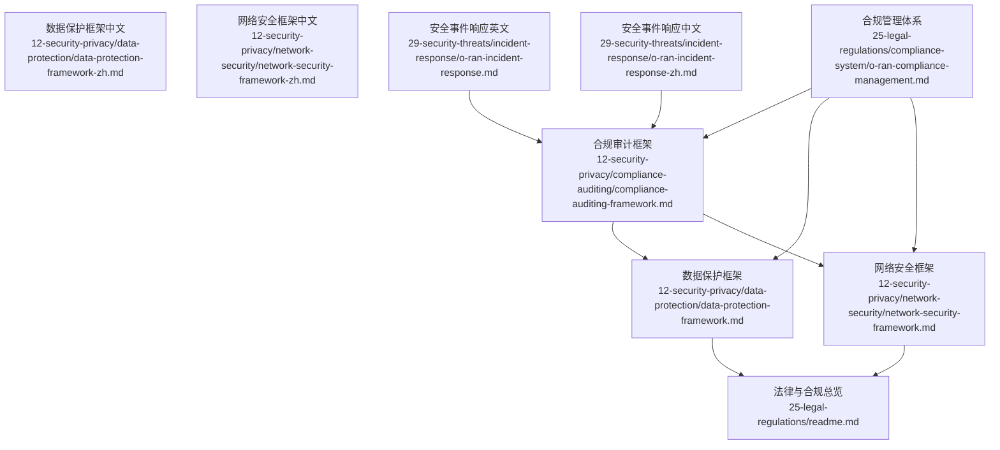
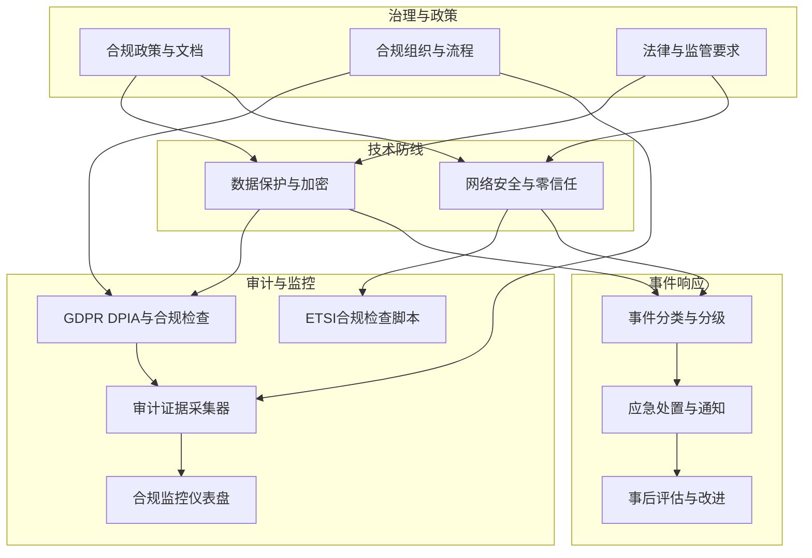
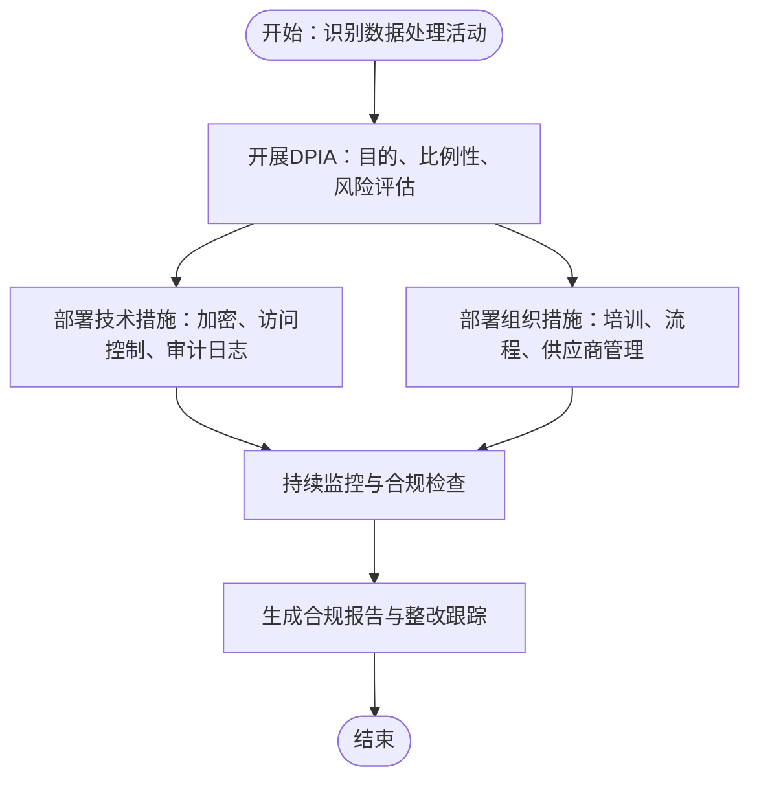
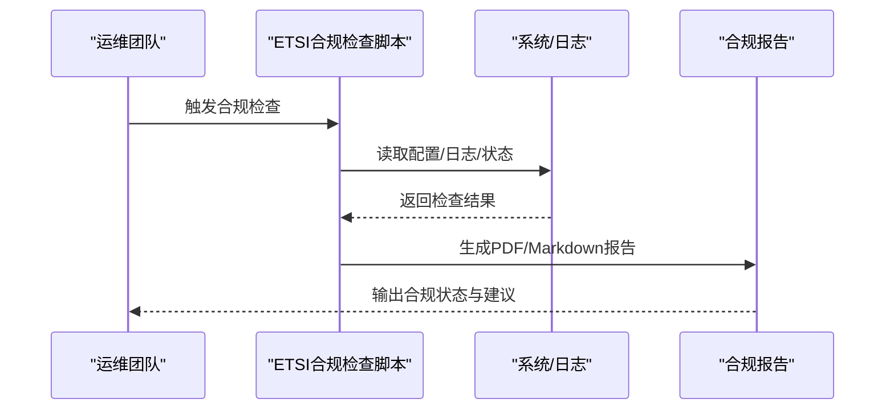
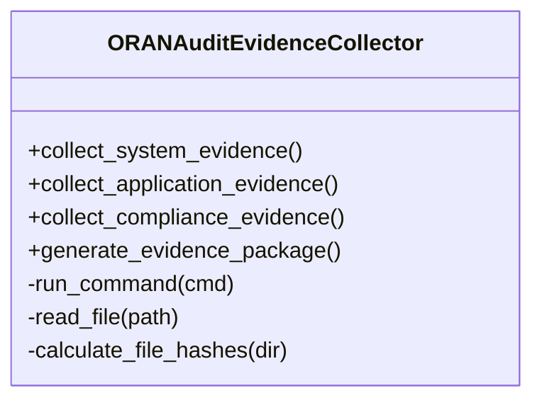
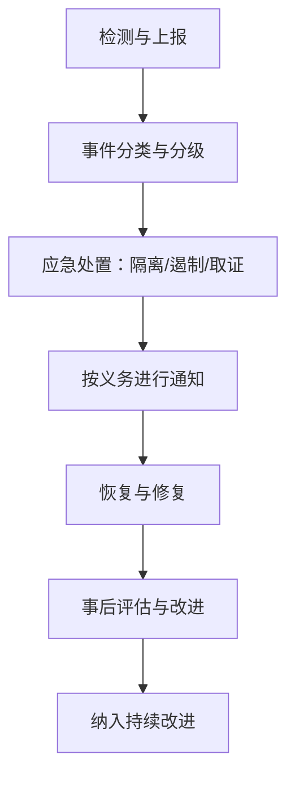
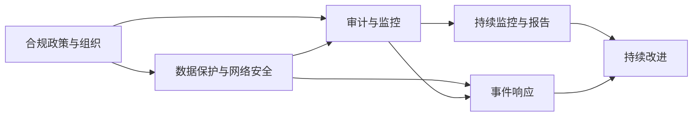

# 合规审计框架

<cite>
**本文引用的文件**
- [合规审计框架.md](file://12-security-privacy/compliance-auditing/compliance-auditing-framework.md)
- [数据保护框架.md](file://12-security-privacy/data-protection/data-protection-framework.md)
- [数据保护框架（中文）.md](file://12-security-privacy/data-protection/data-protection-framework-zh.md)
- [网络安全框架.md](file://12-security-privacy/network-security/network-security-framework.md)
- [网络安全框架（中文）.md](file://12-security-privacy/network-security/network-security-framework-zh.md)
- [法律与合规总览.md](file://25-legal-regulations/readme.md)
- [合规管理体系.md](file://25-legal-regulations/compliance-system/o-ran-compliance-management.md)
- [安全事件响应（英文）.md](file://29-security-threats/incident-response/o-ran-incident-response.md)
- [安全事件响应（中文）.md](file://29-security-threats/incident-response/o-ran-incident-response-zh.md)
</cite>

## 目录
1. [引言](#引言)
2. [项目结构](#项目结构)
3. [核心组件](#核心组件)
4. [架构总览](#架构总览)
5. [详细组件分析](#详细组件分析)
6. [依赖关系分析](#依赖关系分析)
7. [性能考量](#性能考量)
8. [故障排查指南](#故障排查指南)
9. [结论](#结论)
10. [附录](#附录)

## 引言
本文件面向O-RAN合规审计框架的落地实施，围绕以下目标展开：  
- 明确GDPR与数据保护法规的合规要求，覆盖数据主体权利、数据处理合法性与跨境数据传输规则；  
- 说明电信行业安全标准的符合性评估要点，包括网络安全等级保护、关键信息基础设施保护与运营商安全基线；  
- 提供第三方安全审计的准备与实施指南，涵盖审计范围确定、证据收集、缺陷整改与持续改进机制；  
- 构建合规监控体系，包含自动化合规检查、风险指标监控与合规报告生成；  
- 明确安全事件响应流程，包括事件分类、应急处置、通知义务与事后评估；  
- 提供合规检查清单、风险评估模板与审计报告格式范式，便于组织执行与复盘。

## 项目结构
本仓库中与合规审计直接相关的核心文档分布如下：
- 合规审计与GDPR：12-security-privacy/compliance-auditing/compliance-auditing-framework.md
- 数据保护与加密：12-security-privacy/data-protection/data-protection-framework(.md|-zh.md)
- 网络安全与零信任：12-security-privacy/network-security/network-security-framework(.md|-zh.md)
- 法律与合规总览：25-legal-regulations/readme.md
- 合规管理体系：25-legal-regulations/compliance-system/o-ran-compliance-management.md
- 安全事件响应：29-security-threats/incident-response/o-ran-incident-response(.md|-zh.md)

**图示来源**
- [合规审计框架.md](file://12-security-privacy/compliance-auditing/compliance-auditing-framework.md#L1-L486)
- [数据保护框架.md](file://12-security-privacy/data-protection/data-protection-framework.md#L1-L376)
- [数据保护框架（中文）.md](file://12-security-privacy/data-protection/data-protection-framework-zh.md#L1-L376)
- [网络安全框架.md](file://12-security-privacy/network-security/network-security-framework.md#L1-L473)
- [网络安全框架（中文）.md](file://12-security-privacy/network-security/network-security-framework-zh.md#L1-L473)
- [法律与合规总览.md](file://25-legal-regulations/readme.md#L1-L74)
- [合规管理体系.md](file://25-legal-regulations/compliance-system/o-ran-compliance-management.md#L1-L287)
- [安全事件响应（英文）.md](file://29-security-threats/incident-response/o-ran-incident-response.md)
- [安全事件响应（中文）.md](file://29-security-threats/incident-response/o-ran-incident-response-zh.md)

**章节来源**
- [合规审计框架.md](file://12-security-privacy/compliance-auditing/compliance-auditing-framework.md#L1-L486)
- [数据保护框架.md](file://12-security-privacy/data-protection/data-protection-framework.md#L1-L376)
- [网络安全框架.md](file://12-security-privacy/network-security/network-security-framework.md#L1-L473)
- [法律与合规总览.md](file://25-legal-regulations/readme.md#L1-L74)
- [合规管理体系.md](file://25-legal-regulations/compliance-system/o-ran-compliance-management.md#L1-L287)
- [安全事件响应（英文）.md](file://29-security-threats/incident-response/o-ran-incident-response.md)
- [安全事件响应（中文）.md](file://29-security-threats/incident-response/o-ran-incident-response-zh.md)

## 核心组件
- 数据保护与隐私增强：涵盖静态/传输中加密、密钥管理、差分隐私、DLP策略与GDPR合规检查清单。
- 网络安全与零信任：涵盖零信任原则、网络分段、入侵检测/防护、DDoS缓解与安全通信协议。
- 合规审计与证据收集：涵盖GDPR DPIA模板、ETSI合规检查脚本、审计证据采集器与持续合规监控仪表盘。
- 法律与监管：涵盖国际法、区域合规要求与合规管理体系的组织、流程与监督机制。
- 安全事件响应：涵盖事件分类、应急处置、通知与事后评估流程。

**章节来源**
- [合规审计框架.md](file://12-security-privacy/compliance-auditing/compliance-auditing-framework.md#L6-L486)
- [数据保护框架.md](file://12-security-privacy/data-protection/data-protection-framework.md#L6-L376)
- [网络安全框架.md](file://12-security-privacy/network-security/network-security-framework.md#L6-L473)
- [法律与合规总览.md](file://25-legal-regulations/readme.md#L6-L74)
- [合规管理体系.md](file://25-legal-regulations/compliance-system/o-ran-compliance-management.md#L6-L287)
- [安全事件响应（英文）.md](file://29-security-threats/incident-response/o-ran-incident-response.md)
- [安全事件响应（中文）.md](file://29-security-threats/incident-response/o-ran-incident-response-zh.md)

## 架构总览
下图展示合规审计框架的总体架构：以合规政策与组织体系为“治理中枢”，通过数据保护与网络安全两大“技术防线”支撑GDPR与电信安全标准的落地，配合自动化审计证据采集与持续监控，形成闭环的合规与风险管理。

**图示来源**
- [合规审计框架.md](file://12-security-privacy/compliance-auditing/compliance-auditing-framework.md#L6-L486)
- [数据保护框架.md](file://12-security-privacy/data-protection/data-protection-framework.md#L6-L376)
- [网络安全框架.md](file://12-security-privacy/network-security/network-security-framework.md#L6-L473)
- [合规管理体系.md](file://25-legal-regulations/compliance-system/o-ran-compliance-management.md#L6-L287)
- [安全事件响应（英文）.md](file://29-security-threats/incident-response/o-ran-incident-response.md)

## 详细组件分析

### GDPR与数据保护合规
- DPIA模板：明确系统描述、必要性与比例性、风险评估矩阵、隐私保障与审批流程。
- 实施检查清单：覆盖数据保护原则、技术与组织措施、权利管理等。
- 数据保护技术：静态/传输中加密、密钥管理（含HSM）、差分隐私、DLP策略与审计日志框架。
- 跨境数据传输：结合法律与合规总览中的数据保护与数据出境评估要求，制定传输规则与最小化原则。

**图示来源**
- [合规审计框架.md](file://12-security-privacy/compliance-auditing/compliance-auditing-framework.md#L8-L69)
- [数据保护框架.md](file://12-security-privacy/data-protection/data-protection-framework.md#L6-L376)
- [数据保护框架（中文）.md](file://12-security-privacy/data-protection/data-protection-framework-zh.md#L6-L376)
- [法律与合规总览.md](file://25-legal-regulations/readme.md#L12-L18)

**章节来源**
- [合规审计框架.md](file://12-security-privacy/compliance-auditing/compliance-auditing-framework.md#L8-L69)
- [数据保护框架.md](file://12-security-privacy/data-protection/data-protection-framework.md#L6-L376)
- [数据保护框架（中文）.md](file://12-security-privacy/data-protection/data-protection-framework-zh.md#L6-L376)
- [法律与合规总览.md](file://25-legal-regulations/readme.md#L12-L18)

### 电信行业安全标准符合性评估
- 3GPP安全要求映射：TS 33.501、TS 33.102、TS 33.401对O-RAN接口与组件的安全基线影响。
- ETSI安全标准：TS 103 859（安全架构）、TS 103 983（安全测试）的合规检查脚本与报告生成。
- 网络安全与零信任：零信任原则、安全域划分、网络分段、入侵检测/防护、DDoS缓解与TLS配置。

**图示来源**
- [合规审计框架.md](file://12-security-privacy/compliance-auditing/compliance-auditing-framework.md#L114-L197)
- [网络安全框架.md](file://12-security-privacy/network-security/network-security-framework.md#L6-L473)
- [网络安全框架（中文）.md](file://12-security-privacy/network-security/network-security-framework-zh.md#L6-L473)

**章节来源**
- [合规审计框架.md](file://12-security-privacy/compliance-auditing/compliance-auditing-framework.md#L73-L197)
- [网络安全框架.md](file://12-security-privacy/network-security/network-security-framework.md#L6-L473)
- [网络安全框架（中文）.md](file://12-security-privacy/network-security/network-security-framework-zh.md#L6-L473)

### 第三方安全审计准备与实施
- 审计准备清单：文档与技术材料、人员与环境准备。
- 审计证据采集器：系统证据、应用证据、合规证据的采集与证据包生成、完整性校验与清单。
- 合规监控仪表盘：指标采集频率、KPI目标与趋势、告警阈值与通知机制。

**图示来源**
- [合规审计框架.md](file://12-security-privacy/compliance-auditing/compliance-auditing-framework.md#L238-L430)

**章节来源**
- [合规审计框架.md](file://12-security-privacy/compliance-auditing/compliance-auditing-framework.md#L199-L486)

### 合规监控系统建设
- 指标与仪表盘：合规得分、控制有效性、审计发现解决率、监管状态与问题项。
- 告警阈值：合规分数下降、控制失败、审计到期预警。
- 自动化与持续改进：定期审查、版本控制、反馈集成与基准对比。

**章节来源**
- [合规审计框架.md](file://12-security-privacy/compliance-auditing/compliance-auditing-framework.md#L432-L486)
- [合规管理体系.md](file://25-legal-regulations/compliance-system/o-ran-compliance-management.md#L235-L287)

### 安全事件响应程序
- 事件分类与分级：依据影响面、业务连续性与合规影响进行分级。
- 应急处置：隔离、遏制、取证、恢复与修复。
- 通知义务：内部与外部通知时限、内容与渠道。
- 事后评估：根因分析、改进措施、演练与培训。

**图示来源**
- [安全事件响应（英文）.md](file://29-security-threats/incident-response/o-ran-incident-response.md)
- [安全事件响应（中文）.md](file://29-security-threats/incident-response/o-ran-incident-response-zh.md)

**章节来源**
- [安全事件响应（英文）.md](file://29-security-threats/incident-response/o-ran-incident-response.md)
- [安全事件响应（中文）.md](file://29-security-threats/incident-response/o-ran-incident-response-zh.md)

## 依赖关系分析
- 政策与组织体系是合规审计的“上层建筑”，决定资源投入与流程设计。
- 数据保护与网络安全是“技术底座”，为GDPR与电信安全标准提供实现路径。
- 审计与监控工具链负责证据采集、报告生成与持续监督。
- 事件响应与合规体系联动，形成闭环的风险处置与改进机制。

**图示来源**
- [合规管理体系.md](file://25-legal-regulations/compliance-system/o-ran-compliance-management.md#L6-L287)
- [合规审计框架.md](file://12-security-privacy/compliance-auditing/compliance-auditing-framework.md#L6-L486)
- [数据保护框架.md](file://12-security-privacy/data-protection/data-protection-framework.md#L6-L376)
- [网络安全框架.md](file://12-security-privacy/network-security/network-security-framework.md#L6-L473)

**章节来源**
- [合规管理体系.md](file://25-legal-regulations/compliance-system/o-ran-compliance-management.md#L6-L287)
- [合规审计框架.md](file://12-security-privacy/compliance-auditing/compliance-auditing-framework.md#L6-L486)
- [数据保护框架.md](file://12-security-privacy/data-protection/data-protection-framework.md#L6-L376)
- [网络安全框架.md](file://12-security-privacy/network-security/network-security-framework.md#L6-L473)

## 性能考量
- 合规监控的实时性与准确性需平衡：指标采集频率、存储与检索成本、告警风暴抑制。
- 审计证据采集应避免对生产系统造成过大负载，采用增量采集与异步处理。
- 网络安全防护（IDS/IPS、DDoS）需结合业务QoS，防止误伤正常流量。
- 事件响应流程应标准化与自动化，缩短MTTR并降低人工干预风险。

## 故障排查指南
- 合规检查未通过：对照ETSI检查脚本逐项核对配置与日志，确认最近测试与补丁更新。
- 审计证据缺失：检查证据采集器运行日志、目录权限与哈希校验，确保证据包完整性。
- 监控告警频繁：核查阈值设置、异常检测模型误报率与历史趋势，调整参数或补充规则。
- 事件响应滞后：复盘事件分类与通知流程，完善自动化脚本与沟通清单。

**章节来源**
- [合规审计框架.md](file://12-security-privacy/compliance-auditing/compliance-auditing-framework.md#L114-L197)
- [合规审计框架.md](file://12-security-privacy/compliance-auditing/compliance-auditing-framework.md#L238-L430)
- [合规审计框架.md](file://12-security-privacy/compliance-auditing/compliance-auditing-framework.md#L432-L486)

## 结论
通过将合规政策、技术防线、审计工具与事件响应有机整合，O-RAN系统可在GDPR与电信安全标准下实现持续合规。建议以证据驱动的自动化检查与监控为抓手，以标准化的事件响应与持续改进为保障，构建可验证、可追溯、可持续的合规审计框架。

## 附录

### 合规检查清单（GDPR）
- 数据保护原则：合法性、公平性与透明度、目的限制、数据最小化、准确性、存储限制、完整性与保密性、问责制。
- 技术措施：个人数据假名化、静态/传输中加密、定期安全评估、隐私设计、DPIA、违规检测与通知。
- 组织措施：任命数据保护官、员工培训、供应商管理与尽职调查、事件响应程序、定期合规审计、处理活动文档化。
- 权利管理：信息权、访问权、更正权、删除权、限制处理权、数据可携权、反对权、与自动化决策相关的权利。

**章节来源**
- [合规审计框架.md](file://12-security-privacy/compliance-auditing/compliance-auditing-framework.md#L43-L69)
- [数据保护框架.md](file://12-security-privacy/data-protection/data-protection-framework.md#L302-L340)

### 风险评估模板（GDPR DPIA）
- 系统描述：项目名称、数据控制者、处理活动、数据主体。
- 必要性与比例性：法律基础、数据最小化、目的限制、存储限制。
- 风险评估：风险类别、发生概率、影响程度、风险等级与缓解措施。
- 隐私保障：技术、组织与合同措施。
- 咨询与审批：DPO咨询、监管机构通知、利益相关方评审。

**章节来源**
- [合规审计框架.md](file://12-security-privacy/compliance-auditing/compliance-auditing-framework.md#L8-L41)

### 审计报告格式（ETSI）
- 执行摘要：合规状态概览与总体评分。
- 合规状态：各标准条目（如TS 103 859、TS 103 983）的符合性结论。
- 建议：针对不符合项的改进建议与优先级。
- 下次审核日期：基于周期性审核计划设定。

**章节来源**
- [合规审计框架.md](file://12-security-privacy/compliance-auditing/compliance-auditing-framework.md#L166-L197)