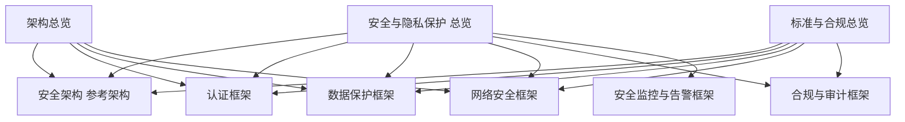
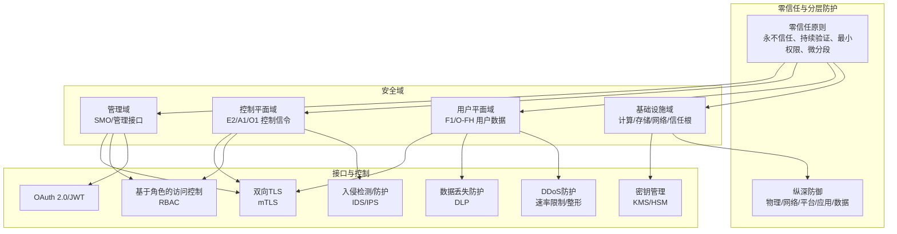
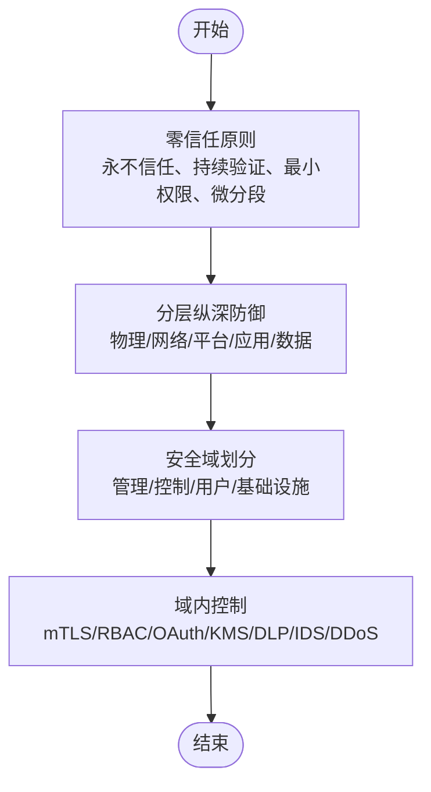
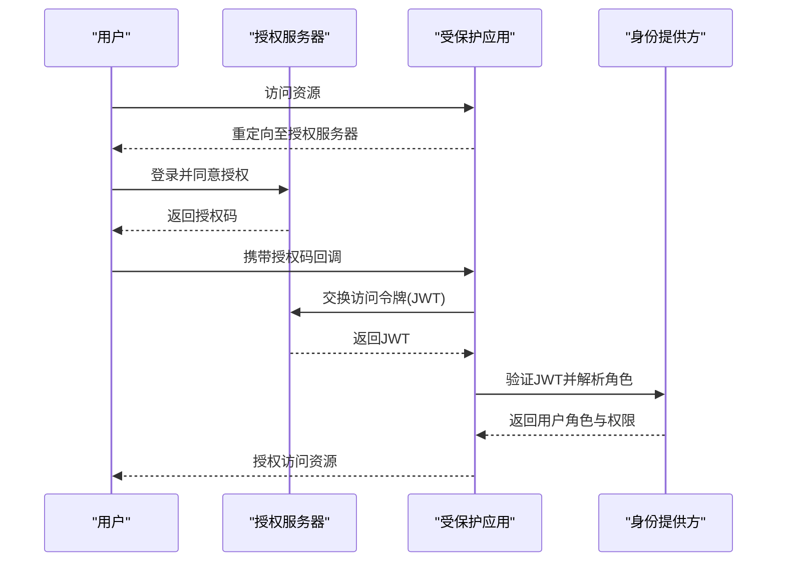
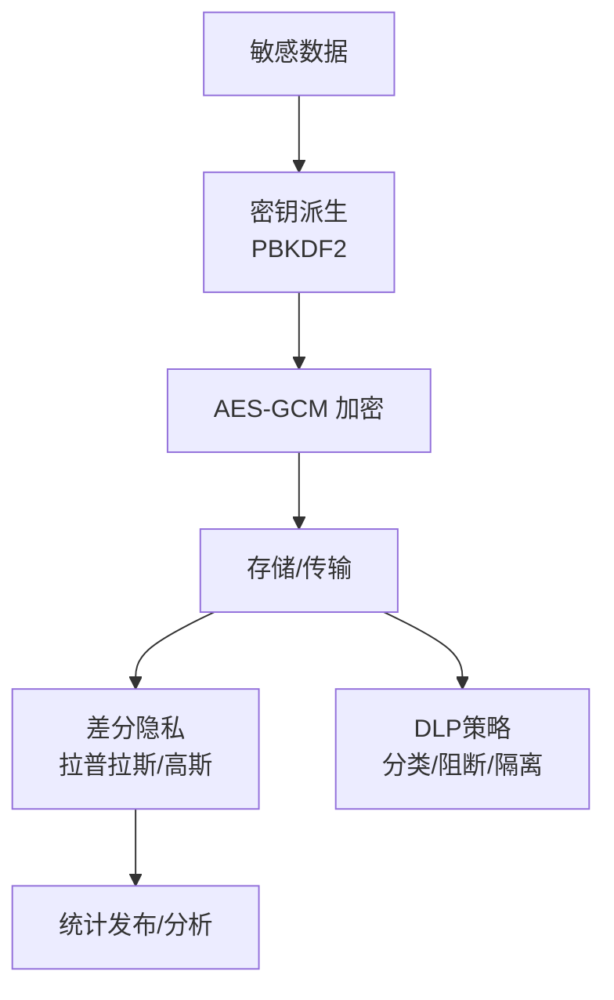
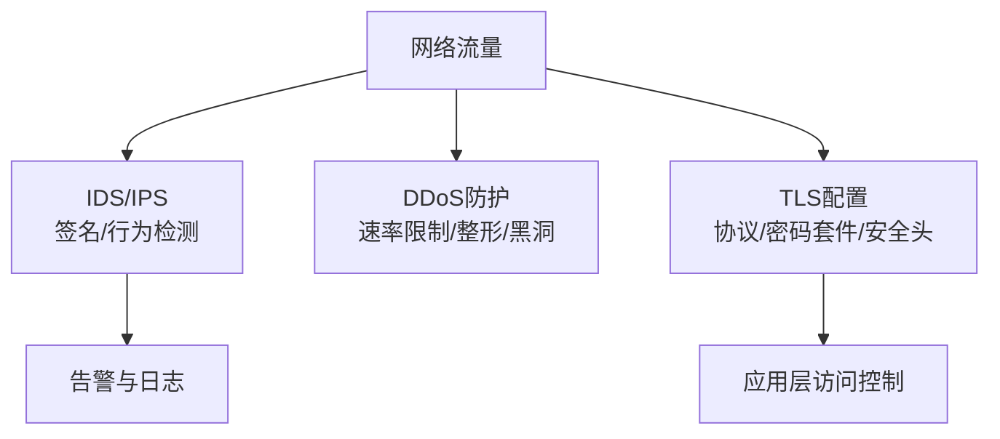
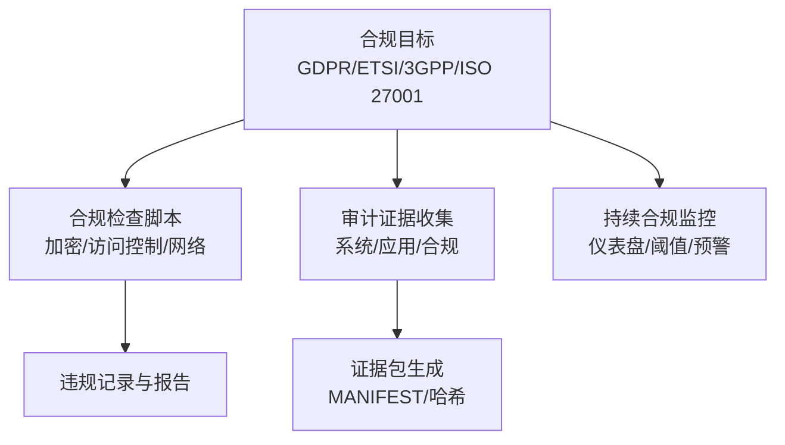
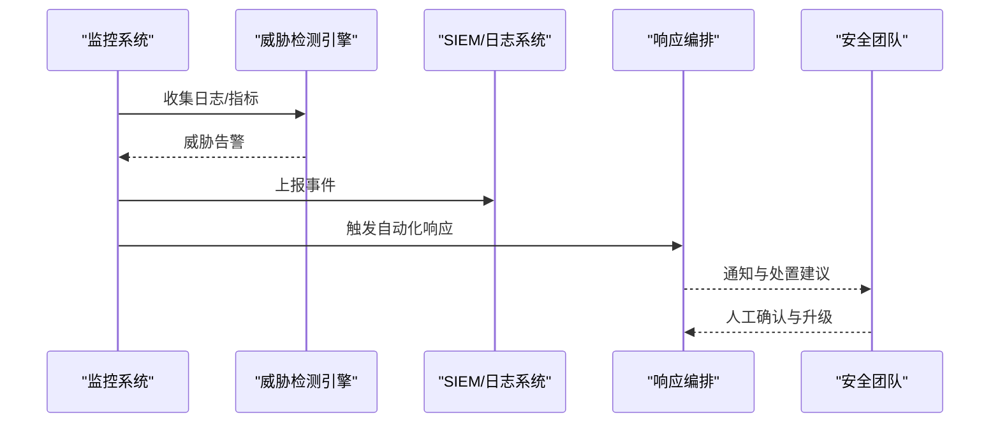
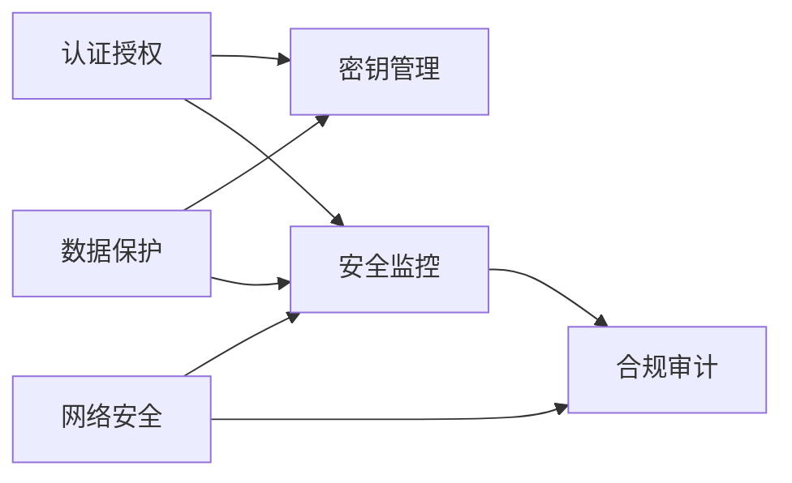

# 安全与隐私保护

<cite>
**本文引用的文件**
- [安全与隐私保护 总览](file://12-security-privacy/readme.md)
- [安全架构 参考架构](file://12-security-privacy/security-architecture/security-reference-architecture.md)
- [认证框架](file://12-security-privacy/authentication/authentication-framework.md)
- [数据保护框架](file://12-security-privacy/data-protection/data-protection-framework.md)
- [网络安全框架](file://12-security-privacy/network-security/network-security-framework.md)
- [合规与审计框架](file://12-security-privacy/compliance-auditing/compliance-auditing-framework.md)
- [安全监控与告警框架](file://12-security-privacy/monitoring-alerting/security-monitoring-framework.md)
- [认证框架（中文）](file://12-security-privacy/authentication/authentication-framework-zh.md)
- [数据保护框架（中文）](file://12-security-privacy/data-protection/data-protection-framework-zh.md)
- [网络安全框架（中文）](file://12-security-privacy/network-security/network-security-framework-zh.md)
- [架构总览](file://01-architecture-system/readme.md)
- [标准与合规总览](file://09-standards-compliance/readme.md)
</cite>

## 目录
1. [简介](#简介)
2. [项目结构](#项目结构)
3. [核心组件](#核心组件)
4. [架构总览](#架构总览)
5. [详细组件分析](#详细组件分析)
6. [依赖关系分析](#依赖关系分析)
7. [性能考虑](#性能考虑)
8. [故障排查指南](#故障排查指南)
9. [结论](#结论)
10. [附录](#附录)

## 简介
本文件面向O-RAN系统的安全与隐私保护，基于仓库中的安全架构、认证授权、数据保护、网络安全、合规审计与监控告警等专题文档，构建一套可落地的综合安全指导。内容覆盖分层安全保护体系、零信任网络模型、综合安全参考架构；认证授权机制（多因素认证、PKI证书管理、OAuth 2.0、RBAC）；数据保护策略（端到端加密、密钥管理、隐私增强技术、数据丢失防护）；网络安全措施（网络切片安全、入侵检测、DDoS防护、微分段）；合规审计框架（GDPR、电信安全标准、第三方审计、监管要求）；以及安全监控告警框架（威胁检测、实时监控、合规验证、自动化事件响应）。

## 项目结构
围绕O-RAN安全主题，仓库形成“专题文档 + 架构与标准”双轨结构：
- 专题文档：安全架构、认证授权、数据保护、网络安全、合规审计、监控告警六大专题，提供方法论、流程与实现要点。
- 架构与标准：总体架构与标准规范，明确O-RAN关键组件、接口与标准边界，为安全设计提供上下文支撑。

图示来源
- [安全与隐私保护 总览](file://12-security-privacy/readme.md#L1-L67)
- [安全架构 参考架构](file://12-security-privacy/security-architecture/security-reference-architecture.md#L1-L559)
- [认证框架](file://12-security-privacy/authentication/authentication-framework.md#L1-L208)
- [数据保护框架](file://12-security-privacy/data-protection/data-protection-framework.md#L1-L376)
- [网络安全框架](file://12-security-privacy/network-security/network-security-framework.md#L1-L473)
- [合规与审计框架](file://12-security-privacy/compliance-auditing/compliance-auditing-framework.md#L1-L486)
- [安全监控与告警框架](file://12-security-privacy/monitoring-alerting/security-monitoring-framework.md#L1-L733)
- [架构总览](file://01-architecture-system/readme.md#L1-L161)
- [标准与合规总览](file://09-standards-compliance/readme.md#L1-L371)

章节来源
- file://12-security-privacy/readme.md#L1-L67
- file://01-architecture-system/readme.md#L1-L161
- file://09-standards-compliance/readme.md#L1-L371

## 核心组件
- 分层安全保护体系：物理安全、网络安全、平台安全、应用安全、数据安全五层纵深防御。
- 零信任网络模型：永不信任、持续验证、最小权限、微分段。
- 认证授权：多因素认证（MFA）、双向TLS、OAuth 2.0/JWT、RBAC。
- 数据保护：端到端加密、密钥管理（含HSM）、隐私增强技术（差分隐私）、数据丢失防护（DLP）。
- 网络安全：网络切片与微分段、入侵检测（IDS/IPS）、DDoS防护（速率限制/整形）、安全信息与事件管理（SIEM）。
- 合规审计：GDPR、NIST、ISO 27001、ETSI、3GPP等标准映射与持续合规监控。
- 安全监控告警：多层监控、威胁检测引擎、可视化仪表盘、自动化响应编排。

章节来源
- file://12-security-privacy/security-architecture/security-reference-architecture.md#L38-L71
- file://12-security-privacy/security-architecture/security-reference-architecture.md#L8-L36
- file://12-security-privacy/authentication/authentication-framework.md#L8-L23
- file://12-security-privacy/authentication/authentication-framework.md#L100-L124
- file://12-security-privacy/authentication/authentication-framework.md#L71-L96
- file://12-security-privacy/data-protection/data-protection-framework.md#L6-L28
- file://12-security-privacy/data-protection/data-protection-framework.md#L98-L184
- file://12-security-privacy/data-protection/data-protection-framework.md#L186-L249
- file://12-security-privacy/data-protection/data-protection-framework.md#L251-L297
- file://12-security-privacy/network-security/network-security-framework.md#L6-L40
- file://12-security-privacy/network-security/network-security-framework.md#L114-L259
- file://12-security-privacy/network-security/network-security-framework.md#L261-L426
- file://12-security-privacy/compliance-auditing/compliance-auditing-framework.md#L6-L41
- file://12-security-privacy/compliance-auditing/compliance-auditing-framework.md#L71-L112
- file://12-security-privacy/compliance-auditing/compliance-auditing-framework.md#L432-L484
- file://12-security-privacy/monitoring-alerting/security-monitoring-framework.md#L6-L31
- file://12-security-privacy/monitoring-alerting/security-monitoring-framework.md#L119-L217

## 架构总览
下图展示O-RAN安全架构的总体视图，强调零信任与分层防护，并映射到关键安全域与控制面/用户面接口。

图示来源
- [安全架构 参考架构](file://12-security-privacy/security-architecture/security-reference-architecture.md#L8-L36)
- [安全架构 参考架构](file://12-security-privacy/security-architecture/security-reference-architecture.md#L38-L71)
- [网络安全框架](file://12-security-privacy/network-security/network-security-framework.md#L8-L40)
- [认证框架](file://12-security-privacy/authentication/authentication-framework.md#L100-L124)
- [数据保护框架](file://12-security-privacy/data-protection/data-protection-framework.md#L98-L184)
- [网络安全框架](file://12-security-privacy/network-security/network-security-framework.md#L114-L259)
- [网络安全框架](file://12-security-privacy/network-security/network-security-framework.md#L261-L426)

## 详细组件分析

### 分层安全保护体系与零信任
- 零信任原则：贯穿所有域，要求持续验证、最小权限、微分段。
- 分层纵深：物理/网络/平台/应用/数据五层，逐层加固。
- 安全域划分：管理域（高）、控制平面域（高）、用户平面域（中）、基础设施域（高），分别配置差异化访问控制与安全能力。

图示来源
- [安全架构 参考架构](file://12-security-privacy/security-architecture/security-reference-architecture.md#L8-L36)
- [安全架构 参考架构](file://12-security-privacy/security-architecture/security-reference-architecture.md#L38-L71)

章节来源
- file://12-security-privacy/security-architecture/security-reference-architecture.md#L8-L36
- file://12-security-privacy/security-architecture/security-reference-architecture.md#L38-L71

### 认证授权机制
- 多因素认证（MFA）：用户名/密码为主认证，结合TOTP、智能卡、生物识别、硬件安全模块等。
- 双向TLS（mTLS）：E2/F1/管理接口分别配置CA、吊销检查、密码套件与有效期。
- OAuth 2.0与JWT：授权服务器、令牌端点、客户端注册、JWT签名与生命周期。
- RBAC：角色定义、权限矩阵、LDAP组映射，限定作用域（全局/域/安全域/RIC域）。

图示来源
- [认证框架](file://12-security-privacy/authentication/authentication-framework.md#L71-L96)
- [认证框架](file://12-security-privacy/authentication/authentication-framework.md#L100-L124)
- [认证框架](file://12-security-privacy/authentication/authentication-framework.md#L284-L337)

章节来源
- file://12-security-privacy/authentication/authentication-framework.md#L8-L23
- file://12-security-privacy/authentication/authentication-framework.md#L25-L69
- file://12-security-privacy/authentication/authentication-framework.md#L71-L96
- file://12-security-privacy/authentication/authentication-framework.md#L100-L124
- file://12-security-privacy/authentication/authentication-framework.md#L284-L337

### 数据保护策略
- 端到端加密：数据库（AES-256-GCM）、文件系统（LUKS/dm-crypt）、对象存储（服务端/可选客户端加密）。
- 传输中加密：IPsec站点到站点隧道、TLS 1.3/1.2、nginx配置、OCSP stapling。
- 密钥管理：PBKDF2派生、AES-GCM、HSM集成、密钥轮换与盐管理。
- 隐私增强技术：差分隐私（拉普拉斯/高斯机制），保护统计查询结果。
- 数据丢失防护（DLP）：分类规则（PII/凭证）、端点与网络监控、策略动作（阻断/隔离/告警）。

图示来源
- [数据保护框架](file://12-security-privacy/data-protection/data-protection-framework.md#L8-L28)
- [数据保护框架](file://12-security-privacy/data-protection/data-protection-framework.md#L30-L96)
- [数据保护框架](file://12-security-privacy/data-protection/data-protection-framework.md#L98-L184)
- [数据保护框架](file://12-security-privacy/data-protection/data-protection-framework.md#L186-L249)
- [数据保护框架](file://12-security-privacy/data-protection/data-protection-framework.md#L251-L297)

章节来源
- file://12-security-privacy/data-protection/data-protection-framework.md#L8-L28
- file://12-security-privacy/data-protection/data-protection-framework.md#L30-L96
- file://12-security-privacy/data-protection/data-protection-framework.md#L98-L184
- file://12-security-privacy/data-protection/data-protection-framework.md#L186-L249
- file://12-security-privacy/data-protection/data-protection-framework.md#L251-L297

### 网络安全措施
- 网络切片与微分段：零信任域划分、网络命名空间/VLAN分段、默认拒绝策略。
- 入侵检测与防护（IDS/IPS）：基于签名与行为的检测、流表维护、异常告警。
- DDoS防护：iptables/NFT速率限制、连接限制、突发控制、流量整形与带宽限制。
- 安全通信：TLS配置（协议/密码套件/会话缓存/安全头）、速率限制区域。

图示来源
- [网络安全框架](file://12-security-privacy/network-security/network-security-framework.md#L6-L40)
- [网络安全框架](file://12-security-privacy/network-security/network-security-framework.md#L114-L259)
- [网络安全框架](file://12-security-privacy/network-security/network-security-framework.md#L261-L426)
- [网络安全框架](file://12-security-privacy/network-security/network-security-framework.md#L428-L471)

章节来源
- file://12-security-privacy/network-security/network-security-framework.md#L6-L40
- file://12-security-privacy/network-security/network-security-framework.md#L114-L259
- file://12-security-privacy/network-security/network-security-framework.md#L261-L426
- file://12-security-privacy/network-security/network-security-framework.md#L428-L471

### 合规审计框架
- GDPR：数据保护原则、技术与组织措施、权利管理、DPIA。
- 电信安全标准：3GPP（TS 33.xxx）、ETSI（TS 103 859/983/986/987/GS ORAN-005）。
- 第三方审计：准备清单、证据收集（系统/应用/合规）、合规仪表盘与持续监控。
- 审计证据包：系统信息、安全配置、网络配置、组件版本、接口配置、安全策略、审计日志、性能指标、供应商评估。

图示来源
- [合规与审计框架](file://12-security-privacy/compliance-auditing/compliance-auditing-framework.md#L6-L41)
- [合规与审计框架](file://12-security-privacy/compliance-auditing/compliance-auditing-framework.md#L71-L112)
- [合规与审计框架](file://12-security-privacy/compliance-auditing/compliance-auditing-framework.md#L199-L236)
- [合规与审计框架](file://12-security-privacy/compliance-auditing/compliance-auditing-framework.md#L238-L430)
- [合规与审计框架](file://12-security-privacy/compliance-auditing/compliance-auditing-framework.md#L432-L484)

章节来源
- file://12-security-privacy/compliance-auditing/compliance-auditing-framework.md#L6-L41
- file://12-security-privacy/compliance-auditing/compliance-auditing-framework.md#L71-L112
- file://12-security-privacy/compliance-auditing/compliance-auditing-framework.md#L199-L236
- file://12-security-privacy/compliance-auditing/compliance-auditing-framework.md#L238-L430
- file://12-security-privacy/compliance-auditing/compliance-auditing-framework.md#L432-L484

### 安全监控告警框架
- 多层监控：网络层（流量/协议/入侵）、应用层（API安全/认证/权限）、系统层（容器/主机/基线）、数据层（加密/泄露/密钥审计）。
- 威胁检测：实时检测引擎、威胁模式匹配、关联ID、推荐处置动作。
- 可视化与仪表盘：实时指标、活跃告警、合规评分、加密健康度。
- 自动化响应：Playbook触发、阻断IP、禁用账户、取证成像、通知流程。
- 安全成熟度评估：威胁检测/响应/合规/自动化/风险管理评分与改进路线。

图示来源
- [安全监控与告警框架](file://12-security-privacy/monitoring-alerting/security-monitoring-framework.md#L6-L31)
- [安全监控与告警框架](file://12-security-privacy/monitoring-alerting/security-monitoring-framework.md#L119-L217)
- [安全监控与告警框架](file://12-security-privacy/monitoring-alerting/security-monitoring-framework.md#L442-L516)
- [安全监控与告警框架](file://12-security-privacy/monitoring-alerting/security-monitoring-framework.md#L518-L637)
- [安全监控与告警框架](file://12-security-privacy/monitoring-alerting/security-monitoring-framework.md#L639-L731)

章节来源
- file://12-security-privacy/monitoring-alerting/security-monitoring-framework.md#L6-L31
- file://12-security-privacy/monitoring-alerting/security-monitoring-framework.md#L119-L217
- file://12-security-privacy/monitoring-alerting/security-monitoring-framework.md#L442-L516
- file://12-security-privacy/monitoring-alerting/security-monitoring-framework.md#L518-L637
- file://12-security-privacy/monitoring-alerting/security-monitoring-framework.md#L639-L731

## 依赖关系分析
- 组件耦合：认证授权（MFA/mTLS/OAuth/RBAC）与密钥管理（KMS/HSM）紧密耦合；数据保护（加密/DLP/隐私增强）与密钥管理高度依赖；网络安全（IDS/DDoS/TLS）与监控告警相互支撑。
- 外部依赖：3GPP/ETSI标准、NIST/ISO 27001合规框架、O-RAN接口（E2/A1/O1/F1/O-FH）。
- 潜在风险：证书吊销链路（OCSP/CRL）、密钥轮换与兼容性、DDoS缓解与业务带宽平衡、合规报告自动化与证据完整性。

图示来源
- [认证框架](file://12-security-privacy/authentication/authentication-framework.md#L25-L69)
- [数据保护框架](file://12-security-privacy/data-protection/data-protection-framework.md#L98-L184)
- [网络安全框架](file://12-security-privacy/network-security/network-security-framework.md#L114-L259)
- [安全监控与告警框架](file://12-security-privacy/monitoring-alerting/security-monitoring-framework.md#L119-L217)
- [合规与审计框架](file://12-security-privacy/compliance-auditing/compliance-auditing-framework.md#L432-L484)

章节来源
- file://12-security-privacy/authentication/authentication-framework.md#L25-L69
- file://12-security-privacy/data-protection/data-protection-framework.md#L98-L184
- file://12-security-privacy/network-security/network-security-framework.md#L114-L259
- file://12-security-privacy/monitoring-alerting/security-monitoring-framework.md#L119-L217
- file://12-security-privacy/compliance-auditing/compliance-auditing-framework.md#L432-L484

## 性能考虑
- 加密开销：AES-GCM与PBKDF2迭代次数需平衡安全与性能；HSM可卸载高强度密钥操作。
- 网络性能：TLS 1.3、HTTP/2、会话缓存与复用降低握手成本；DDoS缓解策略避免误伤正常业务流量。
- 监控与告警：异步采集与批处理、阈值与聚合、机器学习异常检测减少误报与延迟。
- 合规自动化：合规检查脚本与仪表盘定期执行，避免运行时对业务的影响。

## 故障排查指南
- 认证失败/会话异常：检查mTLS证书链、吊销状态、会话超时与令牌校验。
- 加密异常：核对密钥派生参数、盐一致性、nonce与密文匹配。
- 网络攻击迹象：查看IDS告警、DDoS缓解日志、速率限制触发记录。
- 合规问题：依据合规检查脚本输出定位弱密码策略、过期证书、不必要的服务与防火墙规则缺失。
- 审计证据缺失：确认证据收集脚本执行、MANIFEST完整性与文件哈希校验。

章节来源
- file://12-security-privacy/authentication/authentication-framework.md#L126-L185
- file://12-security-privacy/data-protection/data-protection-framework.md#L157-L174
- file://12-security-privacy/network-security/network-security-framework.md#L385-L425
- file://12-security-privacy/compliance-auditing/compliance-auditing-framework.md#L310-L440
- file://12-security-privacy/compliance-auditing/compliance-auditing-framework.md#L238-L430

## 结论
本指导以O-RAN安全架构为核心，结合认证授权、数据保护、网络安全、合规审计与监控告警五大支柱，形成从设计到运营的闭环安全体系。通过零信任与分层防护，配合标准化的流程与工具，可有效应对O-RAN部署中的认证、加密、网络与合规挑战，保障系统在演进中的安全性与可持续性。

## 附录
- 关键术语：mTLS、RBAC、DLP、IDS/IPS、DDoS、HSM、差分隐私、SIEM、GDPR、ETSI、3GPP。
- 参考标准：O-RAN安全架构、ETSI TS 103 859/983/986/987、GS ORAN-005、3GPP TS 33.xxx、NIST CSF、ISO 27001。