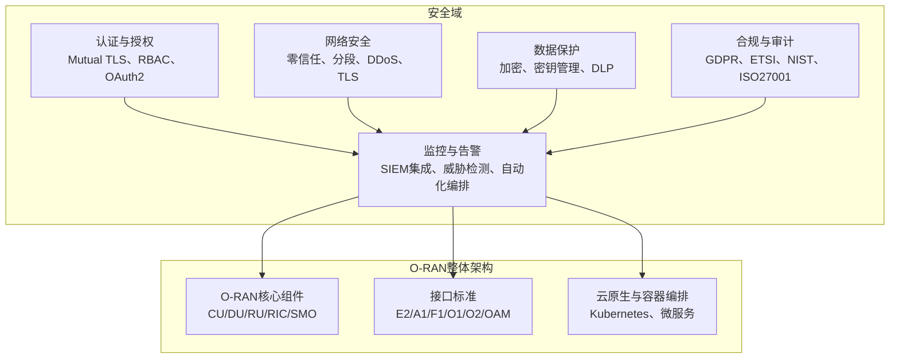
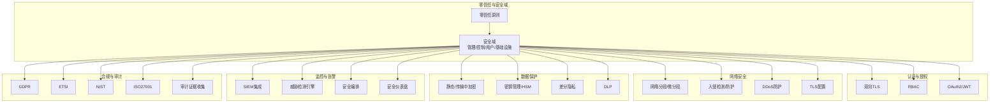
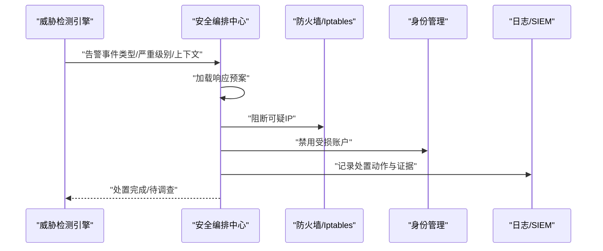
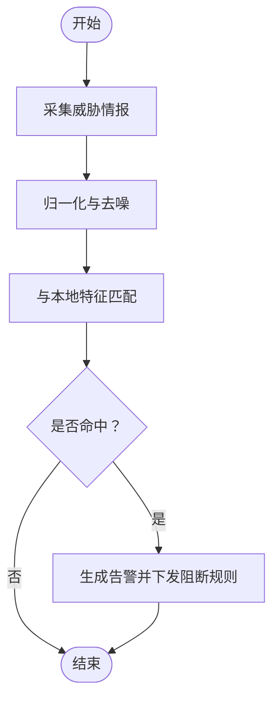
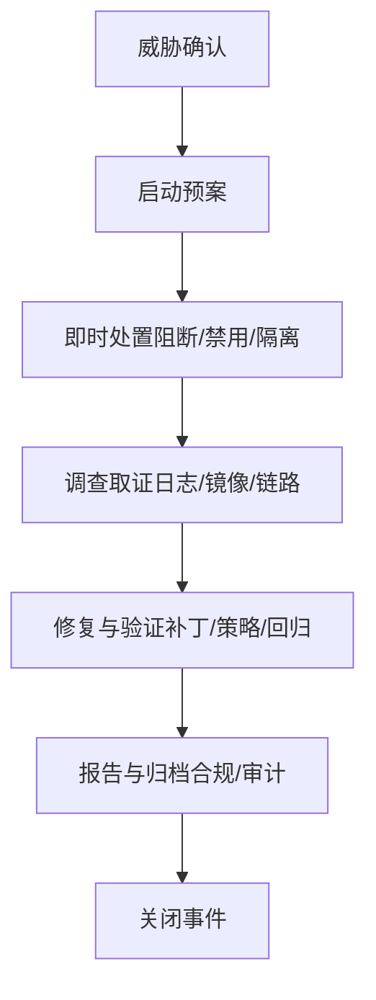
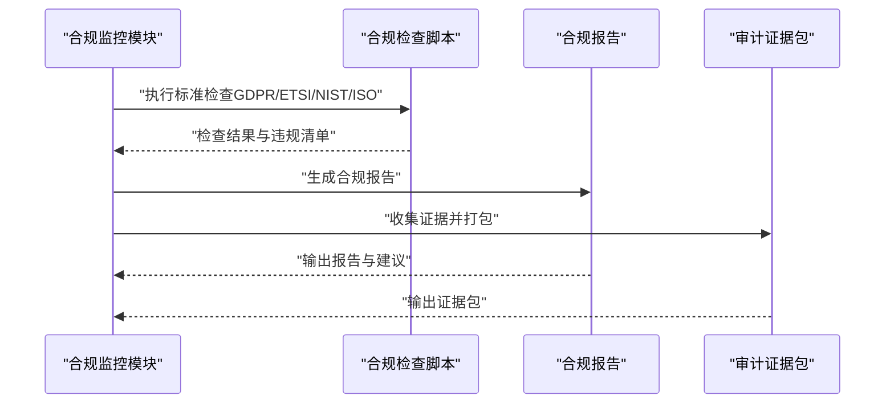
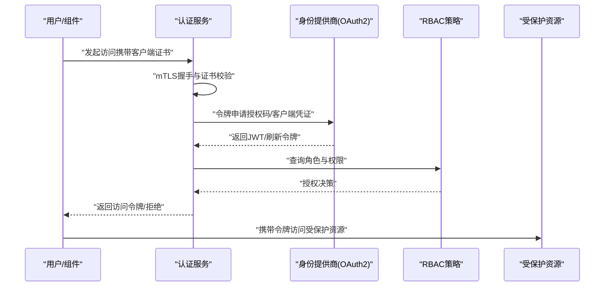
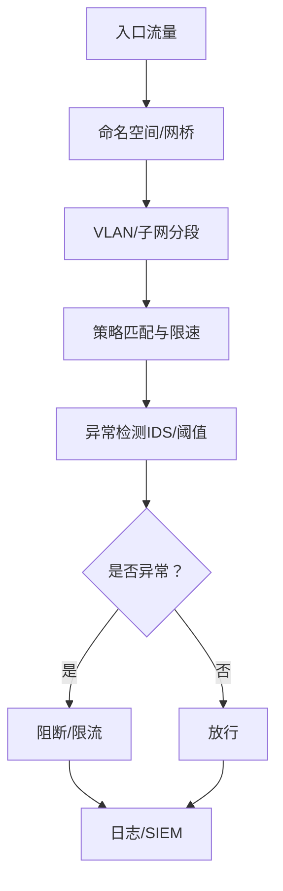
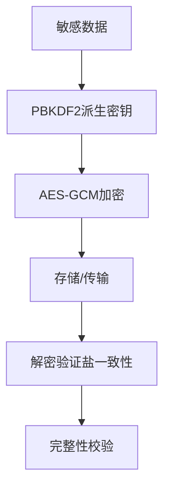
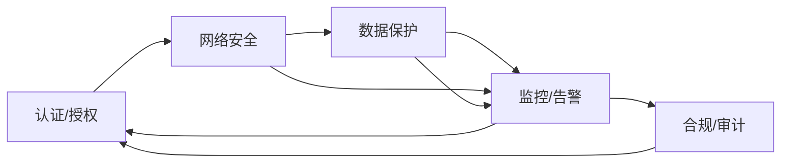

# 安全架构设计

<cite>
**本文引用的文件**
- [安全架构参考（英文）](file://12-security-privacy/security-architecture/security-reference-architecture.md)
- [安全架构参考（中文）](file://12-security-privacy/security-architecture/security-reference-architecture-zh.md)
- [认证框架（英文）](file://12-security-privacy/authentication/authentication-framework.md)
- [网络安全框架（英文）](file://12-security-privacy/network-security/network-security-framework.md)
- [合规与审计框架（英文）](file://12-security-privacy/compliance-auditing/compliance-auditing-framework.md)
- [安全监控与告警框架（英文）](file://12-security-privacy/monitoring-alerting/security-monitoring-framework.md)
- [数据保护框架（英文）](file://12-security-privacy/data-protection/data-protection-framework.md)
- [威胁分析（英文）](file://29-security-threats/threat-analysis/network-security-threats.md)
- [O-RAN 基础知识（英文）](file://01-architecture-system/readme.md)
</cite>

## 目录
1. [引言](#引言)
2. [项目结构](#项目结构)
3. [核心组件](#核心组件)
4. [架构总览](#架构总览)
5. [详细组件分析](#详细组件分析)
6. [依赖关系分析](#依赖关系分析)
7. [性能考量](#性能考量)
8. [故障排查指南](#故障排查指南)
9. [结论](#结论)
10. [附录](#附录)

## 引言
本文件面向O-RAN安全架构设计，系统阐述分层安全保护体系、零信任网络模型、安全域分割与隔离机制，以及安全边界定义、信任根建立、安全策略统一管理与跨域通信保障。文档还给出安全编排中心、威胁情报平台、安全事件响应系统与合规监控模块的架构说明，并结合O-RAN整体架构进行集成与部署适配策略分析。为便于理解，文中提供架构图、组件交互流程与时序图，并在各章节末尾标注“章节来源”以便溯源。

## 项目结构
围绕O-RAN安全主题，仓库内相关文档主要分布在“12-security-privacy”目录下，覆盖认证、网络安全、数据保护、监控告警、合规审计等子域；同时，“01-architecture-system”提供O-RAN整体架构背景，有助于理解安全架构与整体系统的集成关系。

**图表来源**
- [安全架构参考（英文）](file://12-security-privacy/security-architecture/security-reference-architecture.md#L8-L36)
- [网络安全框架（英文）](file://12-security-privacy/network-security/network-security-framework.md#L8-L40)
- [数据保护框架（英文）](file://12-security-privacy/data-protection/data-protection-framework.md#L8-L28)
- [安全监控与告警框架（英文）](file://12-security-privacy/monitoring-alerting/security-monitoring-framework.md#L8-L31)
- [合规与审计框架（英文）](file://12-security-privacy/compliance-auditing/compliance-auditing-framework.md#L6-L41)
- [O-RAN 基础知识（英文）](file://01-architecture-system/readme.md#L8-L34)

**章节来源**
- [安全架构参考（英文）](file://12-security-privacy/security-architecture/security-reference-architecture.md#L1-L71)
- [网络安全框架（英文）](file://12-security-privacy/network-security/network-security-framework.md#L1-L112)
- [数据保护框架（英文）](file://12-security-privacy/data-protection/data-protection-framework.md#L1-L96)
- [安全监控与告警框架（英文）](file://12-security-privacy/monitoring-alerting/security-monitoring-framework.md#L1-L117)
- [合规与审计框架（英文）](file://12-security-privacy/compliance-auditing/compliance-auditing-framework.md#L1-L70)
- [O-RAN 基础知识（英文）](file://01-architecture-system/readme.md#L1-L60)

## 核心组件
- 零信任与安全域
  - 零信任原则：永不信任、始终验证、最小权限、持续验证、微分段。
  - 安全域划分：管理域、控制平面域、用户平面域、基础设施域，分别对应不同的访问控制与安全级别。
- 认证与授权
  - 双向TLS（mTLS）、基于角色的访问控制（RBAC）、OAuth2/JWT令牌。
- 网络安全
  - 网络分段与微分段、防火墙与入侵检测、DDoS防护、TLS配置。
- 数据保护
  - 静态与传输中加密、密钥管理（含HSM）、差分隐私、数据丢失防护（DLP）。
- 监控与告警
  - SIEM集成、实时威胁检测、自动化编排与响应、安全仪表盘。
- 合规与审计
  - GDPR、ETSI、NIST、ISO27001、3GPP安全要求，以及合规检查与证据收集。

**章节来源**
- [安全架构参考（英文）](file://12-security-privacy/security-architecture/security-reference-architecture.md#L8-L71)
- [认证框架（英文）](file://12-security-privacy/authentication/authentication-framework.md#L8-L96)
- [网络安全框架（英文）](file://12-security-privacy/network-security/network-security-framework.md#L42-L112)
- [数据保护框架（英文）](file://12-security-privacy/data-protection/data-protection-framework.md#L8-L96)
- [安全监控与告警框架（英文）](file://12-security-privacy/monitoring-alerting/security-monitoring-framework.md#L8-L31)
- [合规与审计框架（英文）](file://12-security-privacy/compliance-auditing/compliance-auditing-framework.md#L6-L70)

## 架构总览
O-RAN安全架构以“零信任+纵深防御”为核心，通过安全域边界与微分段实现最小暴露面，结合mTLS、RBAC、OAuth2等认证授权机制，配合加密、密钥管理、DLP与差分隐私等数据保护手段，形成覆盖网络、平台、应用与数据的多层防护。监控与告警体系负责威胁检测、事件关联与自动化处置，合规与审计模块确保满足GDPR、ETSI、NIST、ISO27001等要求。

**图表来源**
- [安全架构参考（英文）](file://12-security-privacy/security-architecture/security-reference-architecture.md#L8-L71)
- [网络安全框架（英文）](file://12-security-privacy/network-security/network-security-framework.md#L42-L112)
- [数据保护框架（英文）](file://12-security-privacy/data-protection/data-protection-framework.md#L8-L96)
- [安全监控与告警框架（英文）](file://12-security-privacy/monitoring-alerting/security-monitoring-framework.md#L8-L31)
- [合规与审计框架（英文）](file://12-security-privacy/compliance-auditing/compliance-auditing-framework.md#L6-L70)

## 详细组件分析

### 组件A：安全编排中心（Security Orchestration Center）
- 职责
  - 自动化执行应急响应预案（Playbooks），对检测到的威胁进行阻断、账户禁用、隔离等即时动作，并触发调查与修复流程。
  - 与SIEM、威胁情报平台对接，实现事件关联与联动处置。
- 关键能力
  - 配置驱动的编排（YAML）、可扩展的动作执行器（如iptables封禁、禁用账户）。
  - 与威胁检测引擎协同，按严重级别自动分级处置。
- 典型流程
  - 威胁检测引擎输出告警 → 编排中心加载对应预案 → 执行即时动作 → 触发调查步骤 → 输出处置结果与建议。

**图表来源**
- [安全监控与告警框架（英文）](file://12-security-privacy/monitoring-alerting/security-monitoring-framework.md#L522-L637)
- [安全架构参考（英文）](file://12-security-privacy/security-architecture/security-reference-architecture.md#L339-L513)

**章节来源**
- [安全监控与告警框架（英文）](file://12-security-privacy/monitoring-alerting/security-monitoring-framework.md#L518-L637)
- [安全架构参考（英文）](file://12-security-privacy/security-architecture/security-reference-architecture.md#L339-L513)

### 组件B：威胁情报平台（Threat Intelligence Platform）
- 职责
  - 聚合外部威胁情报源，结合内部日志与流量特征，生成威胁指标（TTPs、IOC、行为模式）。
  - 与监控系统联动，提升检测精度与降低误报。
- 关键能力
  - 实时订阅与聚合（如开源情报、商业订阅、内部归因）。
  - 与SIEM、IDS/IPS、防火墙联动，实现自动阻断与策略更新。
- 典型流程
  - 情报采集 → 归一化与去噪 → 与本地特征库匹配 → 生成告警与阻断规则 → 下发至防护设备。

**图表来源**
- [安全监控与告警框架（英文）](file://12-security-privacy/monitoring-alerting/security-monitoring-framework.md#L310-L440)
- [安全架构参考（英文）](file://12-security-privacy/security-architecture/security-reference-architecture.md#L339-L513)

**章节来源**
- [安全监控与告警框架（英文）](file://12-security-privacy/monitoring-alerting/security-monitoring-framework.md#L306-L440)
- [安全架构参考（英文）](file://12-security-privacy/security-architecture/security-reference-architecture.md#L339-L513)

### 组件C：安全事件响应系统（Security Incident Response System）
- 职责
  - 对已确认威胁进行快速响应，包括隔离、取证、修复与恢复。
  - 与合规模块联动，满足监管报告与审计要求。
- 关键能力
  - 预案模板化（按威胁类型分类）、自动执行与人工复核结合。
  - 事件追踪与闭环管理（处置-调查-整改-验证）。
- 典型流程
  - 威胁确认 → 启动预案 → 即时处置 → 调查取证 → 修复与验证 → 报告与归档。

**图表来源**
- [安全监控与告警框架（英文）](file://12-security-privacy/monitoring-alerting/security-monitoring-framework.md#L442-L517)
- [合规与审计框架（英文）](file://12-security-privacy/compliance-auditing/compliance-auditing-framework.md#L199-L430)

**章节来源**
- [安全监控与告警框架（英文）](file://12-security-privacy/monitoring-alerting/security-monitoring-framework.md#L442-L517)
- [合规与审计框架（英文）](file://12-security-privacy/compliance-auditing/compliance-auditing-framework.md#L199-L430)

### 组件D：合规监控模块（Compliance Monitoring Module）
- 职责
  - 持续验证系统配置与行为是否符合GDPR、ETSI、NIST、ISO27001等标准。
  - 自动生成合规报告与风险评估，支持第三方审计。
- 关键能力
  - 自动化合规检查脚本与仪表盘。
  - 审计证据收集与证据包生成（带哈希校验）。
- 典型流程
  - 配置合规检查 → 违规识别与记录 → 生成合规报告 → 审计证据打包 → 审计准备与反馈。

**图表来源**
- [合规与审计框架（英文）](file://12-security-privacy/compliance-auditing/compliance-auditing-framework.md#L310-L440)
- [合规与审计框架（英文）](file://12-security-privacy/compliance-auditing/compliance-auditing-framework.md#L432-L486)

**章节来源**
- [合规与审计框架（英文）](file://12-security-privacy/compliance-auditing/compliance-auditing-framework.md#L310-L486)

### 组件E：认证与授权（Authentication & Authorization）
- 职责
  - 提供多因子认证（MFA）、双向TLS（mTLS）、RBAC与OAuth2/JWT令牌，确保访问最小化与可追溯。
- 关键能力
  - mTLS配置（不同接口域使用不同CA与吊销检查策略）。
  - RBAC角色映射（LDAP组到角色）。
  - 会话管理与令牌生命周期。
- 典型流程
  - 用户发起访问 → mTLS握手与证书校验 → RBAC鉴权 → OAuth2令牌签发 → 会话维护与超时处理。

**图表来源**
- [认证框架（英文）](file://12-security-privacy/authentication/authentication-framework.md#L100-L185)
- [安全架构参考（英文）](file://12-security-privacy/security-architecture/security-reference-architecture.md#L247-L337)

**章节来源**
- [认证框架（英文）](file://12-security-privacy/authentication/authentication-framework.md#L8-L96)
- [安全架构参考（英文）](file://12-security-privacy/security-architecture/security-reference-architecture.md#L247-L337)

### 组件F：网络安全与DDoS防护
- 职责
  - 通过网络分段、微分段、防火墙、入侵检测与DDoS防护，保障O-RAN接口与域间通信安全。
- 关键能力
  - 零信任网络架构（命名空间/网桥/VLAN）。
  - DDoS防护（限速、连接限制、NFTables/iptables规则）。
  - TLS配置（nginx示例）。
- 典型流程
  - 流量进入 → 分段与微分段 → 策略匹配与限速 → 异常检测与阻断 → 日志记录与告警。

**图表来源**
- [网络安全框架（英文）](file://12-security-privacy/network-security/network-security-framework.md#L42-L112)
- [网络安全框架（英文）](file://12-security-privacy/network-security/network-security-framework.md#L261-L426)
- [网络安全框架（英文）](file://12-security-privacy/network-security/network-security-framework.md#L428-L471)

**章节来源**
- [网络安全框架（英文）](file://12-security-privacy/network-security/network-security-framework.md#L42-L112)
- [网络安全框架（英文）](file://12-security-privacy/network-security/network-security-framework.md#L261-L426)
- [网络安全框架（英文）](file://12-security-privacy/network-security/network-security-framework.md#L428-L471)

### 组件G：数据保护与密钥管理
- 职责
  - 通过端到端加密、密钥管理（含HSM）、差分隐私与DLP，保护静态与传输中数据。
- 关键能力
  - 加密算法与密钥轮换策略。
  - PBKDF2派生密钥与AEAD加密。
  - 差分隐私噪声注入与统计查询。
- 典型流程
  - 数据写入 → 选择算法与密钥 → 加密与完整性保护 → 存储/传输 → 解密与验证。

**图表来源**
- [数据保护框架（英文）](file://12-security-privacy/data-protection/data-protection-framework.md#L98-L184)
- [数据保护框架（英文）](file://12-security-privacy/data-protection/data-protection-framework.md#L186-L249)

**章节来源**
- [数据保护框架（英文）](file://12-security-privacy/data-protection/data-protection-framework.md#L8-L96)
- [数据保护框架（英文）](file://12-security-privacy/data-protection/data-protection-framework.md#L98-L249)

## 依赖关系分析
- 组件耦合与协作
  - 认证与授权为所有域提供统一的身份与权限边界；网络安全为域间通信提供隔离与加密；数据保护贯穿平台与应用层；监控与告警作为中枢协调各域事件；合规与审计为整体提供持续验证与报告。
- 外部依赖与集成点
  - SIEM（Elasticsearch/Kafka）、HSM、OAuth2 IDP、威胁情报源、合规标准库。
- 潜在环路与风险
  - 编排与检测之间应避免循环依赖；密钥管理与加密需独立且受控；DDoS防护与监控需解耦，防止误杀导致业务中断。

**图表来源**
- [安全架构参考（英文）](file://12-security-privacy/security-architecture/security-reference-architecture.md#L8-L71)
- [安全监控与告警框架（英文）](file://12-security-privacy/monitoring-alerting/security-monitoring-framework.md#L8-L31)
- [合规与审计框架（英文）](file://12-security-privacy/compliance-auditing/compliance-auditing-framework.md#L6-L70)

**章节来源**
- [安全架构参考（英文）](file://12-security-privacy/security-architecture/security-reference-architecture.md#L8-L71)
- [安全监控与告警框架（英文）](file://12-security-privacy/monitoring-alerting/security-monitoring-framework.md#L8-L31)
- [合规与审计框架（英文）](file://12-security-privacy/compliance-auditing/compliance-auditing-framework.md#L6-L70)

## 性能考量
- 零信任与微分段
  - 命名空间与VLAN增加少量管理开销，但显著降低横向移动风险；需合理规划路由与队列策略，避免引入额外延迟。
- 加密与密钥管理
  - AEAD加密与PBKDF2派生在CPU上开销可控；建议使用硬件加速或HSM以降低延迟。
- 监控与告警
  - 实时检测与SIEM写入可能带来IO与网络压力；建议采用异步队列与批量写入，设置合理的采样率与阈值。
- DDoS防护
  - 限速与连接限制需平衡用户体验与防护强度；建议动态阈值与自适应策略。

[本节为通用指导，无需“章节来源”]

## 故障排查指南
- 认证失败/会话异常
  - 检查mTLS证书链与吊销状态、RBAC权限映射、会话超时与令牌有效性。
- 网络异常/DDoS
  - 核查分段策略、限速规则、防火墙日志与IDS告警；确认上游/下游设备策略一致性。
- 数据解密失败
  - 校验盐一致性与密钥派生参数；检查密钥轮换与备份策略。
- 合规检查失败
  - 回溯最近变更、补丁与配置；生成证据包并补充审计记录。

**章节来源**
- [认证框架（英文）](file://12-security-privacy/authentication/authentication-framework.md#L126-L185)
- [网络安全框架（英文）](file://12-security-privacy/network-security/network-security-framework.md#L311-L426)
- [数据保护框架（英文）](file://12-security-privacy/data-protection/data-protection-framework.md#L157-L184)
- [合规与审计框架（英文）](file://12-security-privacy/compliance-auditing/compliance-auditing-framework.md#L310-L440)

## 结论
O-RAN安全架构以零信任与纵深防御为基础，通过清晰的安全域边界、严格的认证授权、完善的网络安全与数据保护、智能化的监控告警与自动化编排，以及持续的合规审计，构建了可演进、可验证、可审计的整体安全体系。该体系既满足当前O-RAN部署的安全需求，也为未来在多厂商、多域融合场景下的安全治理提供了坚实支撑。

[本节为总结性内容，无需“章节来源”]

## 附录

### 安全架构与O-RAN整体架构的集成方式
- O-RAN核心组件（CU/DU/RU/RIC/SMO）在各安全域内受控访问，接口（E2/A1/F1/O1/O2/OAM）均采用mTLS与RBAC保护。
- 云原生与容器编排为安全能力提供弹性与可移植性，微服务化组件可按域拆分部署并独立加固。
- 安全编排中心与监控告警系统贯穿全栈，形成统一的事件处置与可视化视图。

**章节来源**
- [O-RAN 基础知识（英文）](file://01-architecture-system/readme.md#L8-L34)
- [安全架构参考（英文）](file://12-security-privacy/security-architecture/security-reference-architecture.md#L8-L36)

### 不同部署场景下的适配策略
- 传统集中式部署
  - 强化边界防护与网络分段，集中式HSM与SIEM，统一RBAC与审计。
- 云原生/多云/混合云
  - 以命名空间/VLAN实现微分段，结合Kubernetes网络策略与RBAC，统一密钥与证书管理。
- 多厂商/多域融合
  - 以标准化接口与mTLS为边界，统一认证与授权策略，集中化编排与合规监控。

**章节来源**
- [网络安全框架（英文）](file://12-security-privacy/network-security/network-security-framework.md#L42-L112)
- [安全架构参考（英文）](file://12-security-privacy/security-architecture/security-reference-architecture.md#L8-L36)