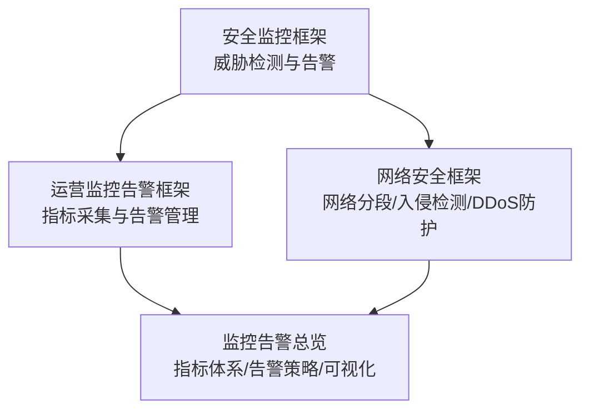
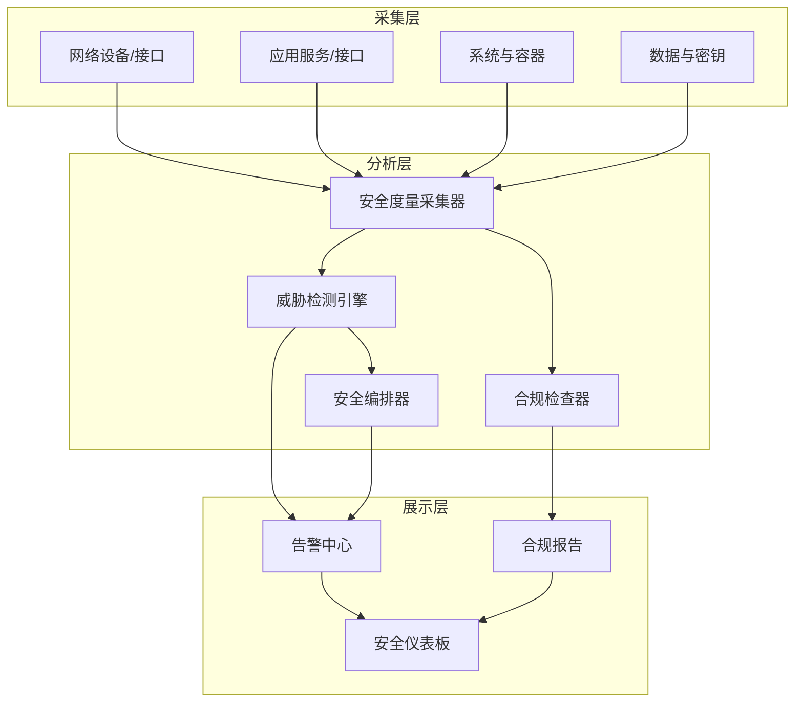
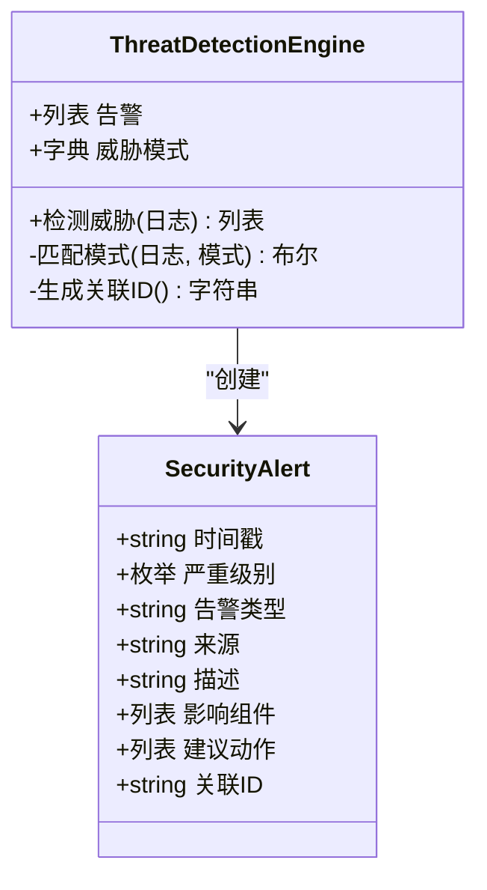
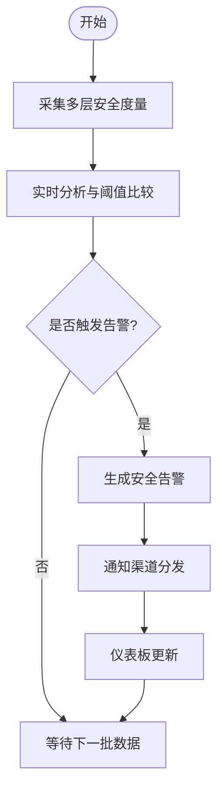
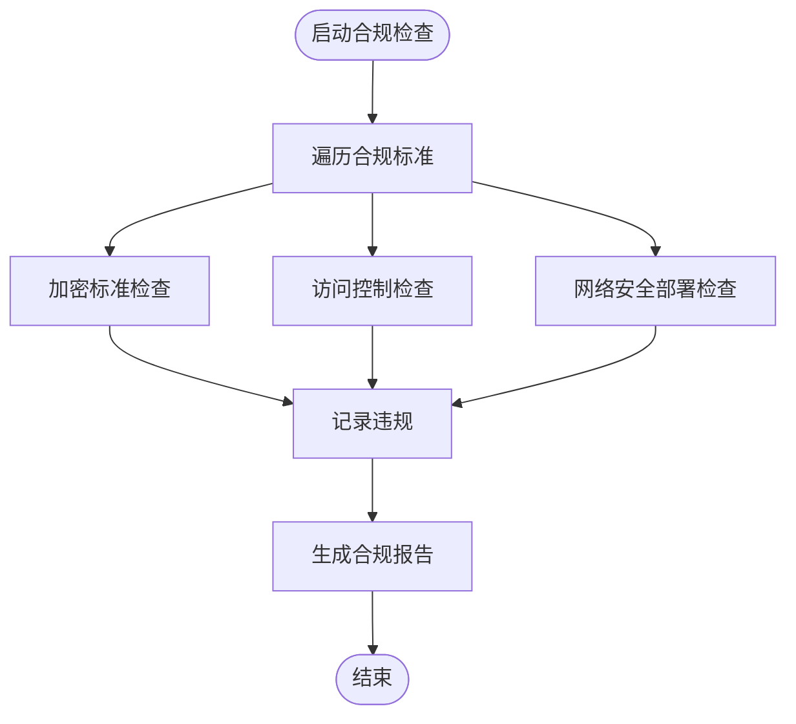
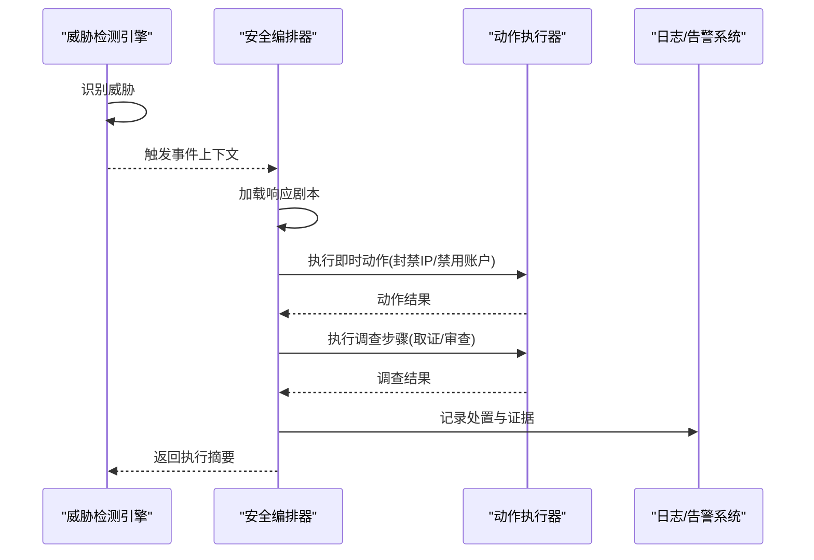
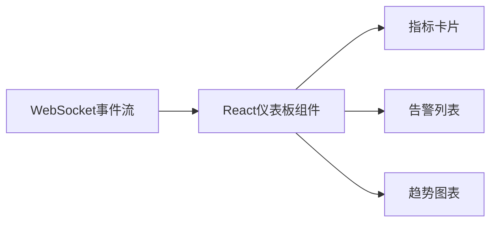
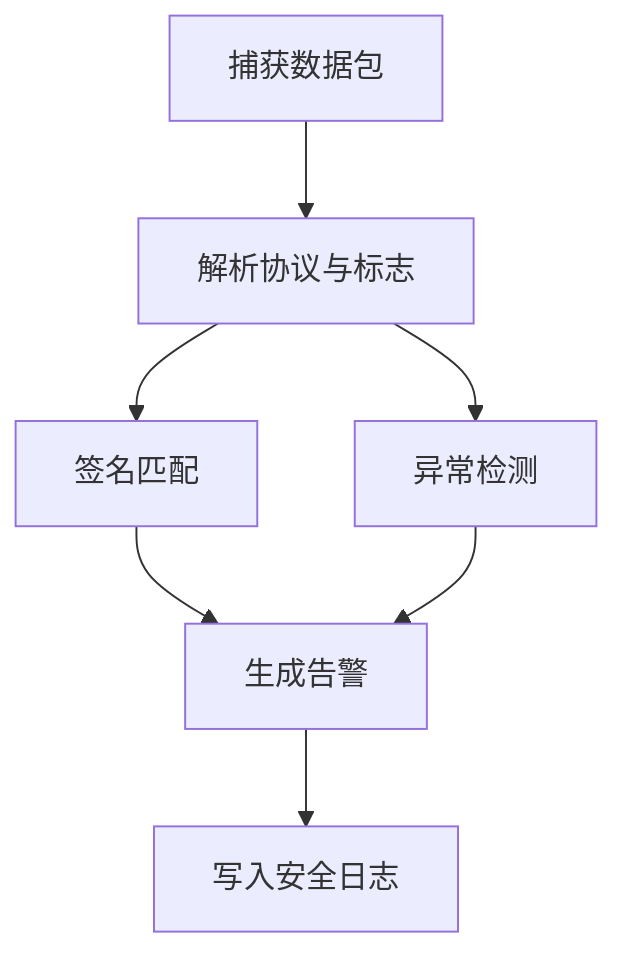
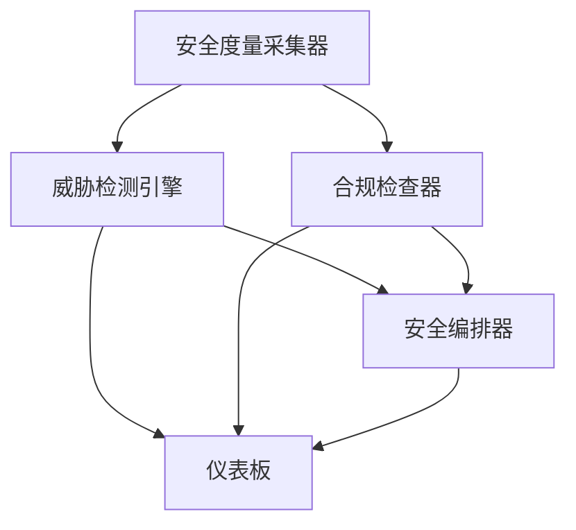

# 安全监控告警

<cite>
**本文引用的文件**
- [安全监控框架.md](file://12-security-privacy/monitoring-alerting/security-monitoring-framework.md)
- [网络安全框架.md](file://12-security-privacy/network-security/network-security-framework-zh.md)
- [运营监控告警框架.md](file://14-operations-management/monitoring-alerting/operations-monitoring-framework-zh.md)
- [监控告警总览.md](file://28-monitoring-alerting/readme.md)
</cite>

## 目录
1. [引言](#引言)
2. [项目结构](#项目结构)
3. [核心组件](#核心组件)
4. [架构总览](#架构总览)
5. [详细组件分析](#详细组件分析)
6. [依赖关系分析](#依赖关系分析)
7. [性能考虑](#性能考虑)
8. [故障排查指南](#故障排查指南)
9. [结论](#结论)
10. [附录](#附录)

## 引言
本文件面向O-RAN安全监控告警系统，围绕威胁检测机制（基于签名、基于异常、基于机器学习）、实时监控架构（数据采集、实时分析、可视化、告警推送）、合规验证（状态监控、违规检测、报告生成）、自动化事件响应（分类、策略执行、效果评估）以及安全仪表板设计（指标展示、趋势分析、辅助决策）进行系统化技术说明，并提供可落地的监控配置示例、阈值设定与响应时间优化建议。内容以仓库中的安全监控、网络安全、运营监控与告警体系文档为基础整理而成，确保与实际实现一致。

## 项目结构
本项目在“安全隐私”“网络安全”“运营监控告警”“监控告警总览”等目录下提供了安全监控框架、威胁检测与告警、合规检查、自动化编排、可视化与仪表板等关键能力的文档与代码片段。整体组织采用主题域划分，便于按层次理解与实施。

图示来源
- [安全监控框架.md](file://12-security-privacy/monitoring-alerting/security-monitoring-framework.md#L1-L733)
- [运营监控告警框架.md](file://14-operations-management/monitoring-alerting/operations-monitoring-framework-zh.md#L1-L909)
- [网络安全框架.md](file://12-security-privacy/network-security/network-security-framework-zh.md#L1-L473)
- [监控告警总览.md](file://28-monitoring-alerting/readme.md#L1-L95)

章节来源
- [安全监控框架.md](file://12-security-privacy/monitoring-alerting/security-monitoring-framework.md#L1-L733)
- [运营监控告警框架.md](file://14-operations-management/monitoring-alerting/operations-monitoring-framework-zh.md#L1-L909)
- [网络安全框架.md](file://12-security-privacy/network-security/network-security-framework-zh.md#L1-L473)
- [监控告警总览.md](file://28-monitoring-alerting/readme.md#L1-L95)

## 核心组件
- 多层监控体系：网络层、应用层、系统层、数据层的安全度量采集与威胁识别。
- 威胁检测引擎：基于签名的模式匹配、基于异常的统计/行为分析、可扩展的机器学习智能检测。
- 合规监控与报告：自动化合规检查脚本、违规日志与合规报告生成。
- 事件响应编排：基于YAML的自动响应剧本（Playbooks），支持即时处置、调查取证与补救。
- 可视化与仪表板：实时指标卡片、趋势图表、告警中心与系统健康状态指示。
- 运维与自动化修复：告警规则驱动的自动修复动作与历史记录。

章节来源
- [安全监控框架.md](file://12-security-privacy/monitoring-alerting/security-monitoring-framework.md#L10-L31)
- [安全监控框架.md](file://12-security-privacy/monitoring-alerting/security-monitoring-framework.md#L119-L217)
- [安全监控框架.md](file://12-security-privacy/monitoring-alerting/security-monitoring-framework.md#L306-L440)
- [安全监控框架.md](file://12-security-privacy/monitoring-alerting/security-monitoring-framework.md#L442-L637)
- [运营监控告警框架.md](file://14-operations-management/monitoring-alerting/operations-monitoring-framework-zh.md#L10-L44)
- [运营监控告警框架.md](file://14-operations-management/monitoring-alerting/operations-monitoring-framework-zh.md#L262-L486)
- [运营监控告警框架.md](file://14-operations-management/monitoring-alerting/operations-monitoring-framework-zh.md#L530-L692)
- [运营监控告警框架.md](file://14-operations-management/monitoring-alerting/operations-monitoring-framework-zh.md#L694-L803)
- [监控告警总览.md](file://28-monitoring-alerting/readme.md#L6-L61)

## 架构总览
系统采用“多层监控 + 威胁检测 + 合规编排 + 可视化”的总体架构，数据从采集层进入实时分析层，触发告警后进入响应编排与可视化呈现，形成闭环。

图示来源
- [安全监控框架.md](file://12-security-privacy/monitoring-alerting/security-monitoring-framework.md#L33-L117)
- [安全监控框架.md](file://12-security-privacy/monitoring-alerting/security-monitoring-framework.md#L119-L217)
- [安全监控框架.md](file://12-security-privacy/monitoring-alerting/security-monitoring-framework.md#L306-L440)
- [安全监控框架.md](file://12-security-privacy/monitoring-alerting/security-monitoring-framework.md#L518-L637)
- [运营监控告警框架.md](file://14-operations-management/monitoring-alerting/operations-monitoring-framework-zh.md#L262-L486)
- [运营监控告警框架.md](file://14-operations-management/monitoring-alerting/operations-monitoring-framework-zh.md#L530-L692)

## 详细组件分析

### 组件A：威胁检测与告警引擎
- 基于签名的检测：内置威胁模式字典，支持阈值与严重级别配置，异步匹配日志/流量特征并生成告警。
- 基于异常的检测：通过统计/行为模式识别异常，结合时间窗口与阈值触发。
- 基于机器学习的智能检测：预留扩展点，支持接入模型推理与异常评分。

图示来源
- [安全监控框架.md](file://12-security-privacy/monitoring-alerting/security-monitoring-framework.md#L130-L217)

章节来源
- [安全监控框架.md](file://12-security-privacy/monitoring-alerting/security-monitoring-framework.md#L119-L217)

### 组件B：安全度量采集与实时分析
- 多层度量采集：网络层（DDoS、协议合规、加密强度）、应用层（API安全、认证、特权审计）、系统层（容器安全、主机入侵、配置漂移）、数据层（加密合规、数据防泄漏、密钥审计）。
- 实时分析：异步处理与阈值规则联动，生成告警并推送到可视化与告警中心。

图示来源
- [安全监控框架.md](file://12-security-privacy/monitoring-alerting/security-monitoring-framework.md#L35-L117)
- [运营监控告警框架.md](file://14-operations-management/monitoring-alerting/operations-monitoring-framework-zh.md#L262-L486)

章节来源
- [安全监控框架.md](file://12-security-privacy/monitoring-alerting/security-monitoring-framework.md#L33-L117)
- [运营监控告警框架.md](file://14-operations-management/monitoring-alerting/operations-monitoring-framework-zh.md#L262-L486)

### 组件C：合规监控与报告生成
- 自动化合规检查：脚本对加密标准、访问控制、网络安全部署进行核查，记录违规并生成JSON报告。
- 合规状态监控：持续运行检查，汇总整体合规状态与改进建议。

图示来源
- [安全监控框架.md](file://12-security-privacy/monitoring-alerting/security-monitoring-framework.md#L308-L440)

章节来源
- [安全监控框架.md](file://12-security-privacy/monitoring-alerting/security-monitoring-framework.md#L306-L440)

### 组件D：自动化事件响应编排
- 响应剧本（Playbooks）：定义触发条件、即时动作、调查步骤与补救措施。
- 编排器：按剧本执行动作（如封禁IP、禁用账户、取证成像、密钥轮换），记录执行结果。

图示来源
- [安全监控框架.md](file://12-security-privacy/monitoring-alerting/security-monitoring-framework.md#L442-L637)

章节来源
- [安全监控框架.md](file://12-security-privacy/monitoring-alerting/security-monitoring-framework.md#L442-L637)

### 组件E：安全仪表板与可视化
- 指标卡片：活跃威胁数量、合规分数、加密健康度等。
- 实时更新：WebSocket订阅事件流，前端组件动态渲染。
- 告警中心：按严重级别与类别聚合，支持快速定位与处置。

图示来源
- [安全监控框架.md](file://12-security-privacy/monitoring-alerting/security-monitoring-framework.md#L219-L304)
- [运营监控告警框架.md](file://14-operations-management/monitoring-alerting/operations-monitoring-framework-zh.md#L530-L692)

章节来源
- [安全监控框架.md](file://12-security-privacy/monitoring-alerting/security-monitoring-framework.md#L219-L304)
- [运营监控告警框架.md](file://14-operations-management/monitoring-alerting/operations-monitoring-framework-zh.md#L530-L692)

### 组件F：网络安全与DDoS防护
- 网络分段与零信任：按域划分（管理域、控制平面域、用户平面域、基础设施域），实施最小权限与持续验证。
- 入侵检测（IDS）：基于签名与异常的流量检测，记录告警并写入日志。
- DDoS防护：速率限制、连接限制、NFTables/iptables规则、流量监控与缓解策略。

图示来源
- [网络安全框架.md](file://12-security-privacy/network-security/network-security-framework-zh.md#L114-L259)

章节来源
- [网络安全框架.md](file://12-security-privacy/network-security/network-security-framework-zh.md#L6-L112)
- [网络安全框架.md](file://12-security-privacy/network-security/network-security-framework-zh.md#L114-L259)
- [网络安全框架.md](file://12-security-privacy/network-security/network-security-framework-zh.md#L261-L426)

## 依赖关系分析
- 组件耦合
  - 威胁检测引擎依赖安全度量采集器提供的原始数据。
  - 合规检查器与编排器相互独立，但都向可视化与告警中心输出结果。
  - 仪表板依赖实时事件流与历史指标。
- 外部依赖
  - 网络安全模块依赖内核网络栈、NFTables/iptables与第三方工具（如OpenSSL）。
  - 运营监控模块依赖系统库（psutil）、容器与K8s API。
- 潜在循环依赖
  - 当前各模块以“采集→分析→展示/响应”的单向流为主，未见循环依赖迹象。

图示来源
- [安全监控框架.md](file://12-security-privacy/monitoring-alerting/security-monitoring-framework.md#L35-L117)
- [安全监控框架.md](file://12-security-privacy/monitoring-alerting/security-monitoring-framework.md#L119-L217)
- [安全监控框架.md](file://12-security-privacy/monitoring-alerting/security-monitoring-framework.md#L306-L440)
- [安全监控框架.md](file://12-security-privacy/monitoring-alerting/security-monitoring-framework.md#L518-L637)
- [运营监控告警框架.md](file://14-operations-management/monitoring-alerting/operations-monitoring-framework-zh.md#L262-L486)
- [运营监控告警框架.md](file://14-operations-management/monitoring-alerting/operations-monitoring-framework-zh.md#L530-L692)

章节来源
- [安全监控框架.md](file://12-security-privacy/monitoring-alerting/security-monitoring-framework.md#L35-L117)
- [运营监控告警框架.md](file://14-operations-management/monitoring-alerting/operations-monitoring-framework-zh.md#L262-L486)

## 性能考虑
- 采集频率与批处理：根据业务负载调整采集间隔，避免高频采样造成CPU/IO压力。
- 异步处理与并发：威胁检测与告警分发采用异步模型，降低阻塞风险。
- 缓存与去重：告警去重与相关性规则减少重复通知与系统开销。
- 可视化优化：前端图表按需渲染，WebSocket增量推送，避免全量刷新。
- 网络安全：NFTables/iptables规则应精简且有序，避免过多规则导致匹配延迟；DDoS缓解策略应与上游协同，减少误伤。

## 故障排查指南
- 威胁检测无告警
  - 检查威胁模式配置与阈值是否合理，确认日志/流量是否被正确采集。
  - 核对异步任务调度与事件通道连通性。
- 合规检查未发现违规
  - 确认检查脚本权限与目标配置文件路径，查看违规日志文件是否生成。
  - 对照标准清单逐项验证。
- 响应编排未执行
  - 检查剧本文件格式与加载路径，确认动作执行器命令可用性与权限。
  - 查看执行结果与错误日志。
- 仪表板不更新
  - 检查WebSocket连接与事件推送，确认指标数据流正常。
  - 校验前端组件渲染逻辑与依赖库版本。

章节来源
- [安全监控框架.md](file://12-security-privacy/monitoring-alerting/security-monitoring-framework.md#L119-L217)
- [安全监控框架.md](file://12-security-privacy/monitoring-alerting/security-monitoring-framework.md#L306-L440)
- [安全监控框架.md](file://12-security-privacy/monitoring-alerting/security-monitoring-framework.md#L518-L637)
- [运营监控告警框架.md](file://14-operations-management/monitoring-alerting/operations-monitoring-framework-zh.md#L530-L692)

## 结论
本系统以多层监控为基础，融合基于签名、基于异常与可扩展的机器学习智能检测，配合自动化合规检查与事件响应编排，构建了覆盖采集、分析、可视化与处置的完整闭环。通过清晰的阈值与规则体系、可演进的指标体系与仪表板设计，能够有效支撑O-RAN网络的安全运营与持续改进。

## 附录

### A. 监控配置示例与阈值建议
- CPU使用率
  - 告警阈值：预警>70%持续5分钟；告警>80%持续3分钟；严重>90%持续1分钟；危急>95%持续30秒。
- 内存使用率
  - 告警阈值：预警>85%持续5分钟；严重>95%持续2分钟。
- RIC响应时间
  - 告警阈值：>1000ms持续1分钟。
- 接口可用性
  - 告警阈值：低于99.0%持续5分钟。
- KPI可用性
  - 告警阈值：低于99.5%持续10分钟。

章节来源
- [监控告警总览.md](file://28-monitoring-alerting/readme.md#L26-L47)
- [运营监控告警框架.md](file://14-operations-management/monitoring-alerting/operations-monitoring-framework-zh.md#L308-L346)

### B. 告警抑制与聚合
- 抑制策略：重复告警在指定周期内仅一次；上游故障导致的下游告警可被抑制；维护窗口内静默；相关告警智能合并。
- 聚合维度：按严重级别、类别、组件聚合，减少噪声。

章节来源
- [监控告警总览.md](file://28-monitoring-alerting/readme.md#L43-L47)
- [运营监控告警框架.md](file://14-operations-management/monitoring-alerting/operations-monitoring-framework-zh.md#L488-L528)

### C. 响应时间优化建议
- 采集与分析：缩短采集间隔，采用批量与异步处理；优化规则匹配与缓存命中。
- 通知渠道：区分紧急与一般告警，采用分级通知策略，避免信息过载。
- 可视化：前端按需渲染与懒加载，WebSocket增量推送。
- 网络安全：规则预热与最小化规则集，DDoS缓解与上游联动。

章节来源
- [监控告警总览.md](file://28-monitoring-alerting/readme.md#L77-L95)
- [网络安全框架.md](file://12-security-privacy/network-security/network-security-framework-zh.md#L261-L426)