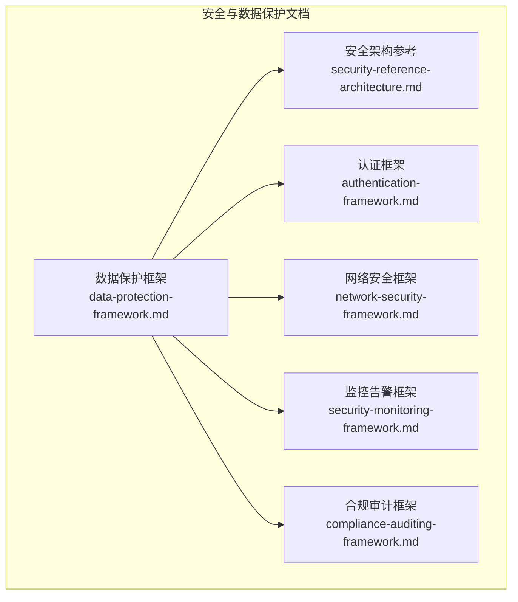
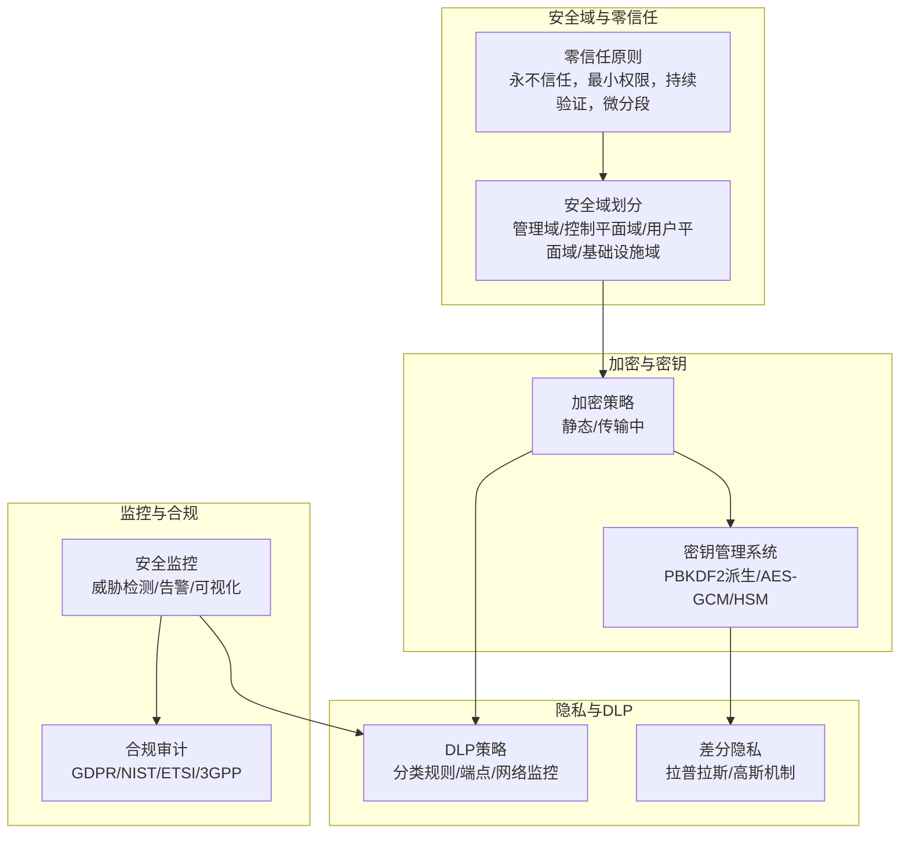
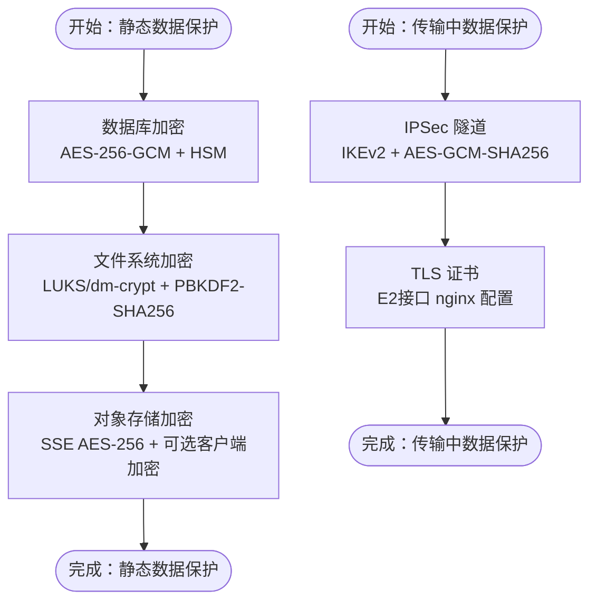
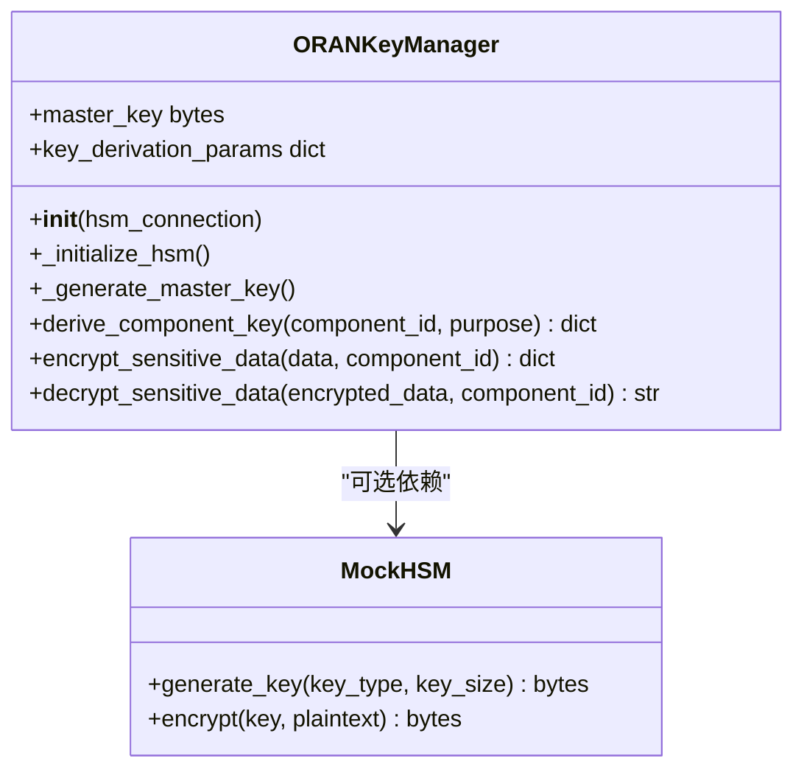
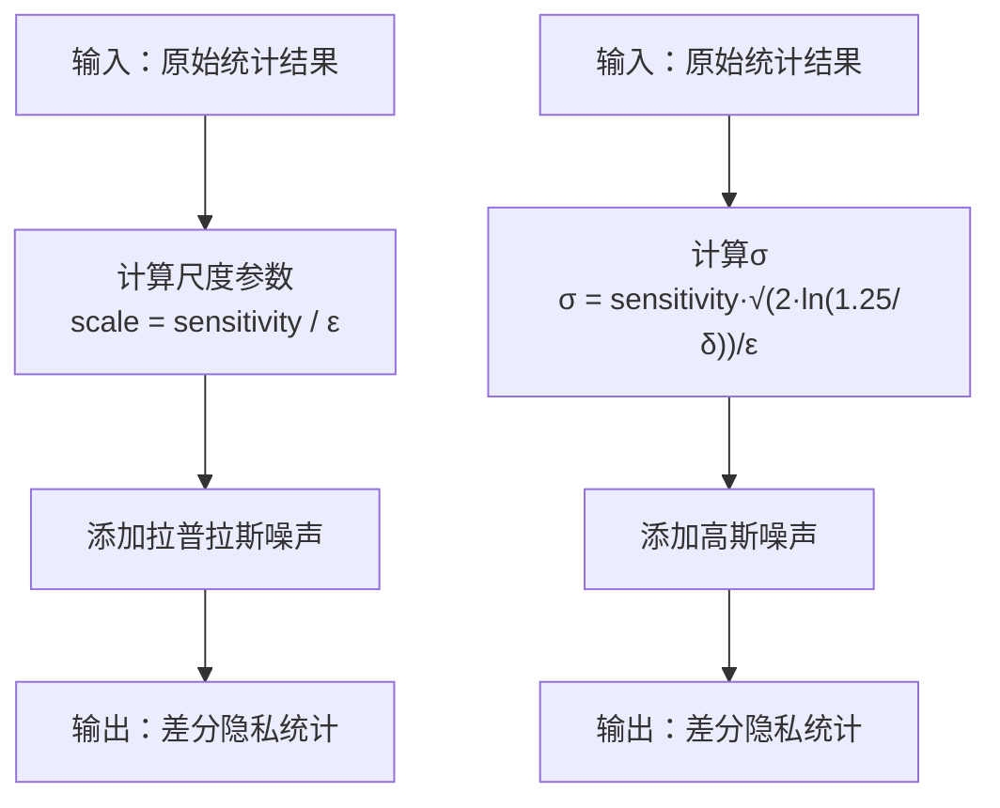
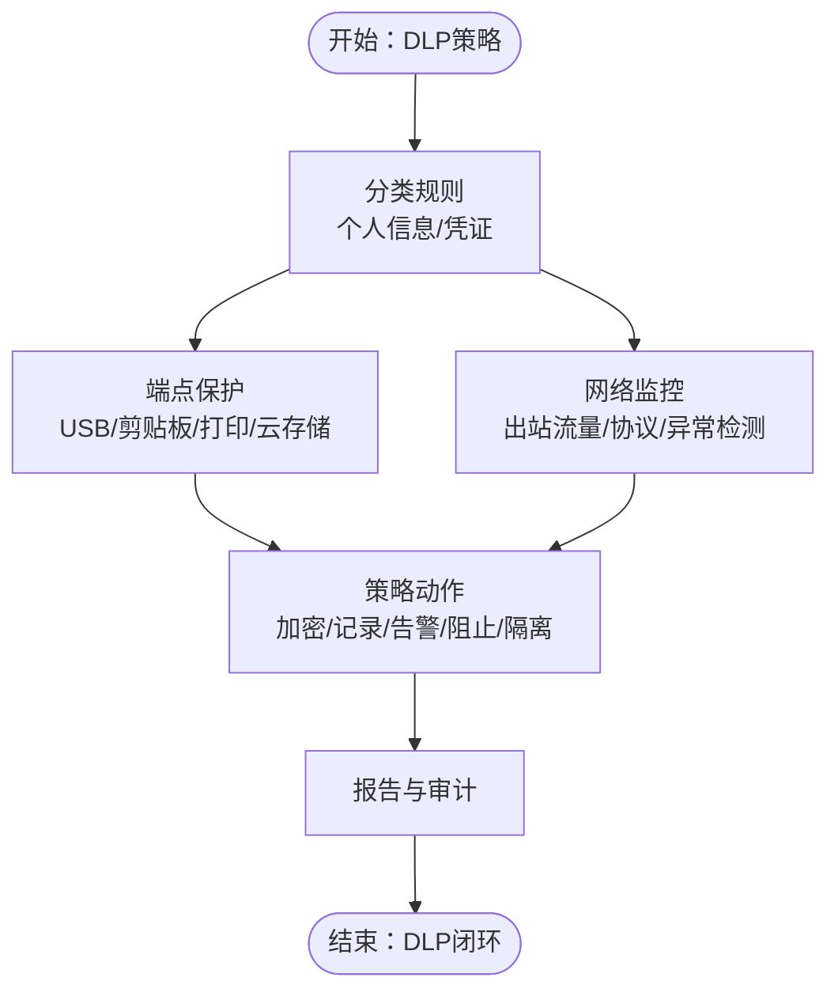
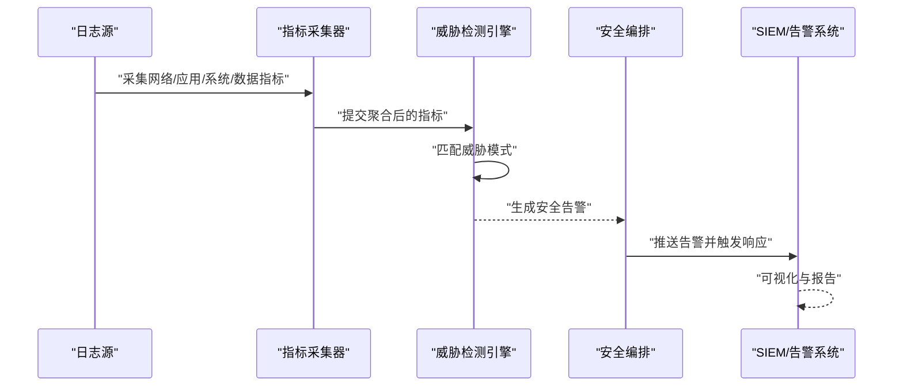
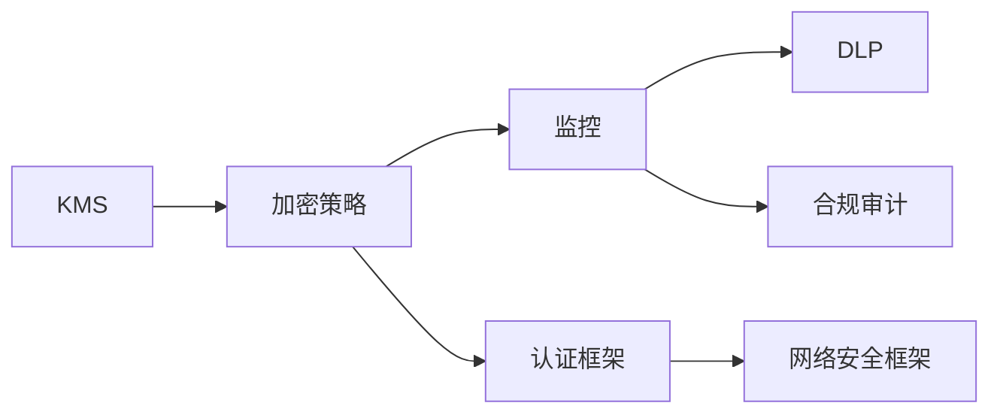

# 数据保护策略

<cite>
**本文引用的文件**
- [数据保护框架（中文）](file://12-security-privacy/data-protection/data-protection-framework-zh.md)
- [数据保护框架（英文）](file://12-security-privacy/data-protection/data-protection-framework.md)
- [安全架构参考（中文）](file://12-security-privacy/security-architecture/security-reference-architecture-zh.md)
- [认证框架（中文）](file://12-security-privacy/authentication/authentication-framework-zh.md)
- [网络安全框架（中文）](file://12-security-privacy/network-security/network-security-framework-zh.md)
- [监控告警框架（英文）](file://12-security-privacy/monitoring-alerting/security-monitoring-framework.md)
- [合规审计框架（英文）](file://12-security-privacy/compliance-auditing/compliance-auditing-framework.md)
</cite>

## 目录
1. [简介](#简介)
2. [项目结构](#项目结构)
3. [核心组件](#核心组件)
4. [架构总览](#架构总览)
5. [详细组件分析](#详细组件分析)
6. [依赖关系分析](#依赖关系分析)
7. [性能考虑](#性能考虑)
8. [故障排查指南](#故障排查指南)
9. [结论](#结论)
10. [附录](#附录)

## 简介
本文件面向O-RAN系统，提供端到端数据保护策略的技术指导，覆盖以下关键主题：
- 端到端加密机制：对称加密、非对称加密与哈希算法的选择与应用
- 密钥管理系统（KMS）：密钥生成、存储、分发、轮换与销毁的全生命周期管理
- 数据分类与标记：敏感数据识别、分级策略与自动化标记
- 隐私增强技术（PETs）：差分隐私、同态加密与安全多方计算的部署要点
- 数据丢失防护（DLP）：数据发现、监控、阻止与报告
- 配置指南、性能优化与合规检查清单

## 项目结构
围绕数据保护，仓库中与安全相关的文档主要分布在“12-security-privacy”目录下，包含数据保护、安全架构、认证、网络安全、监控告警与合规审计等子主题。这些文档共同构成O-RAN数据保护的总体方案与实施依据。

图表来源
- [数据保护框架（英文）](file://12-security-privacy/data-protection/data-protection-framework.md#L1-L376)
- [安全架构参考（中文）](file://12-security-privacy/security-architecture/security-reference-architecture-zh.md#L1-L530)
- [认证框架（中文）](file://12-security-privacy/authentication/authentication-framework-zh.md#L1-L208)
- [网络安全框架（中文）](file://12-security-privacy/network-security/network-security-framework-zh.md#L1-L473)
- [监控告警框架（英文）](file://12-security-privacy/monitoring-alerting/security-monitoring-framework.md#L1-L733)
- [合规审计框架（英文）](file://12-security-privacy/compliance-auditing/compliance-auditing-framework.md#L1-L486)

章节来源
- [数据保护框架（英文）](file://12-security-privacy/data-protection/data-protection-framework.md#L1-L376)
- [安全架构参考（中文）](file://12-security-privacy/security-architecture/security-reference-architecture-zh.md#L1-L530)

## 核心组件
- 端到端加密策略：覆盖静态数据加密（数据库、文件系统、对象存储）、传输中数据加密（IPSec隧道、TLS证书与密码套件）
- 密钥管理系统（KMS）：基于PBKDF2的密钥派生、AES-GCM加解密、可选硬件安全模块（HSM）集成
- 隐私增强技术（PETs）：差分隐私（拉普拉斯与高斯机制），提供统计查询的隐私保护
- 数据丢失防护（DLP）：基于正则表达式的内容识别、端点与网络层面的保护策略
- 安全监控与合规：威胁检测、实时告警、合规检查脚本与自动化响应编排

章节来源
- [数据保护框架（英文）](file://12-security-privacy/data-protection/data-protection-framework.md#L6-L96)
- [数据保护框架（英文）](file://12-security-privacy/data-protection/data-protection-framework.md#L98-L184)
- [数据保护框架（英文）](file://12-security-privacy/data-protection/data-protection-framework.md#L186-L249)
- [数据保护框架（英文）](file://12-security-privacy/data-protection/data-protection-framework.md#L251-L298)

## 架构总览
下图展示O-RAN数据保护的整体架构：从安全域划分、零信任模型，到加密策略、密钥管理、隐私增强与DLP，再到监控与合规闭环。

图表来源
- [安全架构参考（中文）](file://12-security-privacy/security-architecture/security-reference-architecture-zh.md#L8-L36)
- [数据保护框架（英文）](file://12-security-privacy/data-protection/data-protection-framework.md#L6-L96)
- [数据保护框架（英文）](file://12-security-privacy/data-protection/data-protection-framework.md#L98-L184)
- [数据保护框架（英文）](file://12-security-privacy/data-protection/data-protection-framework.md#L186-L249)
- [数据保护框架（英文）](file://12-security-privacy/data-protection/data-protection-framework.md#L251-L298)
- [监控告警框架（英文）](file://12-security-privacy/monitoring-alerting/security-monitoring-framework.md#L6-L31)
- [合规审计框架（英文）](file://12-security-privacy/compliance-auditing/compliance-auditing-framework.md#L6-L70)

## 详细组件分析

### 端到端加密机制
- 静态数据加密
  - 数据库：AES-256-GCM；密钥管理采用硬件安全模块（HSM）；年度轮换；加密异地备份
  - 文件系统：LUKS/dm-crypt；密钥派生PBKDF2-SHA256，迭代100000次，盐长度32
  - 对象存储：服务器端AES-256；客户端加密可选；每桶密钥
- 传输中数据加密
  - 站点到站点：IPSec IKEv2，AES-GCM-SHA256，MODP4096，24小时IKE寿命、8小时SA寿命
  - 接口TLS：E2接口nginx配置，TLSv1.3/TLSv1.2，ECDHE-RSA-AES256-GCM-SHA384等密码套件，OCSP stapling

图表来源
- [数据保护框架（英文）](file://12-security-privacy/data-protection/data-protection-framework.md#L8-L28)
- [数据保护框架（英文）](file://12-security-privacy/data-protection/data-protection-framework.md#L30-L96)

章节来源
- [数据保护框架（英文）](file://12-security-privacy/data-protection/data-protection-framework.md#L8-L96)

### 密钥管理系统（KMS）
- 设计目标：主密钥生成、组件级密钥派生、数据加解密、盐校验与完整性保障
- 关键流程
  - 初始化：连接HSM（可选）或生成随机主密钥
  - 派生：PBKDF2-SHA256，迭代100000次，盐长度16字节，输出32字节密钥
  - 加密：AES-GCM，随机12字节nonce，返回密文、nonce、盐与组件标识
  - 解密：重新派生密钥并校验盐一致性，再执行解密

图表来源
- [数据保护框架（英文）](file://12-security-privacy/data-protection/data-protection-framework.md#L110-L184)

章节来源
- [数据保护框架（英文）](file://12-security-privacy/data-protection/data-protection-framework.md#L98-L184)
- [安全架构参考（中文）](file://12-security-privacy/security-architecture/security-reference-architecture-zh.md#L147-L245)

### 隐私增强技术（PETs）
- 差分隐私
  - 拉普拉斯机制：通过尺度参数scale = 敏感度/ε添加噪声
  - 高斯机制：通过σ = 敏感度·√(2·ln(1.25/δ))/ε添加高斯噪声
  - 应用场景：网络性能统计（均值、计数、直方图）的隐私保护

图表来源
- [数据保护框架（英文）](file://12-security-privacy/data-protection/data-protection-framework.md#L188-L249)

章节来源
- [数据保护框架（英文）](file://12-security-privacy/data-protection/data-protection-framework.md#L186-L249)

### 数据丢失防护（DLP）
- 分类规则
  - 个人信息：基于正则表达式识别（如社会安全号、邮箱、电话）
  - 凭证：识别密码、API Key、Secret等
- 端点保护
  - USB设备受限、剪贴板监控、打印限制按部门、云存储白名单/黑名单
- 网络监控
  - 出站流量全载荷检查、HTTP/HTTPS/FTP/SMTP监控、基于机器学习的异常检测
  - 内容检查与策略违规动作（阻止、隔离、告警），误报减少采用行为分析

图表来源
- [数据保护框架（英文）](file://12-security-privacy/data-protection/data-protection-framework.md#L253-L298)

章节来源
- [数据保护框架（英文）](file://12-security-privacy/data-protection/data-protection-framework.md#L251-L298)

### 安全监控与告警
- 多层监控：网络层（流量分析、协议合规、入侵检测）、应用层（API安全、认证日志、权限审计）、系统层（容器安全、主机HIDS、基线漂移）、数据层（加密合规、DLP、密钥审计）
- 威胁检测引擎：基于规则/模式的实时检测，生成告警并关联到响应编排
- 合规监控：自动化脚本检查TLS版本、证书有效性、密码策略、防火墙规则、不必要的服务等

图表来源
- [监控告警框架（英文）](file://12-security-privacy/monitoring-alerting/security-monitoring-framework.md#L35-L117)
- [监控告警框架（英文）](file://12-security-privacy/monitoring-alerting/security-monitoring-framework.md#L121-L217)
- [监控告警框架（英文）](file://12-security-privacy/monitoring-alerting/security-monitoring-framework.md#L310-L440)

章节来源
- [监控告警框架（英文）](file://12-security-privacy/monitoring-alerting/security-monitoring-framework.md#L6-L31)
- [监控告警框架（英文）](file://12-security-privacy/monitoring-alerting/security-monitoring-framework.md#L119-L217)
- [监控告警框架（英文）](file://12-security-privacy/monitoring-alerting/security-monitoring-framework.md#L306-L440)

## 依赖关系分析
- 组件耦合
  - KMS与加密策略强耦合：KMS负责密钥派生与加解密，加密策略定义算法与轮换策略
  - DLP与监控：DLP依赖网络与端点监控提供的上下文信息
  - 监控与合规：监控输出作为合规检查的证据来源
- 外部依赖
  - HSM：用于主密钥生成与密钥材料保护
  - 证书体系：PKI用于mTLS与接口TLS
  - SIEM/日志系统：集中化日志与告警
  - 3GPP/ETSI/ISO/NIST：合规标准与规范

图表来源
- [数据保护框架（英文）](file://12-security-privacy/data-protection/data-protection-framework.md#L98-L184)
- [监控告警框架（英文）](file://12-security-privacy/monitoring-alerting/security-monitoring-framework.md#L6-L31)
- [认证框架（中文）](file://12-security-privacy/authentication/authentication-framework-zh.md#L25-L69)
- [网络安全框架（中文）](file://12-security-privacy/network-security/network-security-framework-zh.md#L42-L112)

章节来源
- [数据保护框架（英文）](file://12-security-privacy/data-protection/data-protection-framework.md#L98-L184)
- [监控告警框架（英文）](file://12-security-privacy/monitoring-alerting/security-monitoring-framework.md#L6-L31)
- [认证框架（中文）](file://12-security-privacy/authentication/authentication-framework-zh.md#L25-L69)
- [网络安全框架（中文）](file://12-security-privacy/network-security/network-security-framework-zh.md#L42-L112)

## 性能考虑
- 加密开销
  - AES-GCM适合高性能场景；PBKDF2迭代次数高（100000）提升抗暴力破解能力但增加派生延迟
  - 建议：在高并发场景下使用硬件加速（HSM/专用加密卡）与缓存派生结果（短期）
- 网络性能
  - IPSec与TLS均引入CPU与带宽开销；建议在边界设备上启用硬件卸载
  - 流量整形与限速避免DDoS放大效应，同时保障关键接口（如E2/F1）带宽
- 监控与DLP
  - 全载荷检查成本高；建议结合启发式与机器学习降低误报与漏报
  - 分层监控：关键域内深度检查，边缘轻量检测

[本节为通用性能讨论，无需具体文件引用]

## 故障排查指南
- 加密与密钥问题
  - 盐不匹配：解密阶段会校验盐一致性，若不一致需检查派生输入或密钥轮换流程
  - HSM不可用：降级为本地随机主密钥生成，但会失去硬件级密钥保护
- DLP误报/漏报
  - 调整正则表达式阈值与动作；结合行为分析减少误报
  - 审核端点与网络策略配置，确保白名单/黑名单生效
- 监控告警
  - 检查日志采集与转发链路；确认威胁模式规则与阈值合理
  - 结合合规脚本输出定位TLS版本、证书有效性、防火墙规则等问题

章节来源
- [数据保护框架（英文）](file://12-security-privacy/data-protection/data-protection-framework.md#L214-L234)
- [监控告警框架（英文）](file://12-security-privacy/monitoring-alerting/security-monitoring-framework.md#L310-L440)

## 结论
本文件基于仓库中的安全与数据保护文档，构建了O-RAN端到端数据保护的实施蓝图：以零信任与安全域为基础，结合严格的加密策略、完善的KMS生命周期管理、隐私增强与DLP，辅以持续监控与合规闭环，形成可落地、可审计、可演进的综合数据保护体系。

[本节为总结性内容，无需具体文件引用]

## 附录

### 配置指南（摘要）
- 静态数据加密
  - 数据库：AES-256-GCM + HSM；年度轮换；加密异地备份
  - 文件系统：LUKS/dm-crypt + PBKDF2-SHA256（100000次迭代）
  - 对象存储：SSE AES-256 + 可选客户端加密 + 每桶密钥
- 传输中数据加密
  - IPSec：IKEv2 + AES-GCM-SHA256 + MODP4096；24h IKE寿命、8h SA寿命
  - TLS：E2接口nginx配置，TLSv1.3/TLSv1.2，ECDHE-RSA-AES256-GCM-SHA384等
- KMS
  - PBKDF2-SHA256（100000次迭代，盐16字节，输出32字节）
  - AES-GCM随机nonce（12字节）
- DLP
  - 分类规则：个人信息/凭证正则；动作：加密/记录/告警/阻止/隔离
  - 端点：USB受限、剪贴板监控、打印限制、云存储白名单/黑名单
  - 网络：全载荷检查、HTTP/HTTPS/FTP/SMTP、ML异常检测

章节来源
- [数据保护框架（英文）](file://12-security-privacy/data-protection/data-protection-framework.md#L8-L28)
- [数据保护框架（英文）](file://12-security-privacy/data-protection/data-protection-framework.md#L30-L96)
- [数据保护框架（英文）](file://12-security-privacy/data-protection/data-protection-framework.md#L98-L184)
- [数据保护框架（英文）](file://12-security-privacy/data-protection/data-protection-framework.md#L253-L298)

### 合规检查清单（摘自GDPR）
- 数据保护原则：合法性、公平性、透明度、目的限制、数据最小化、准确性、存储限制、完整性与保密性、问责制
- 技术措施：个人数据假名化、静态与传输中数据加密、定期安全评估、隐私设计、DPIA、违规检测与通知
- 组织措施：任命数据保护官、员工培训、供应商管理与尽职调查、事件响应程序、定期合规审计、处理活动文档化
- 权利管理：信息权、访问权、更正权、删除权、“被遗忘权”、限制处理权、数据可携权、反对权、与自动化决策相关权利

章节来源
- [数据保护框架（英文）](file://12-security-privacy/data-protection/data-protection-framework.md#L302-L340)