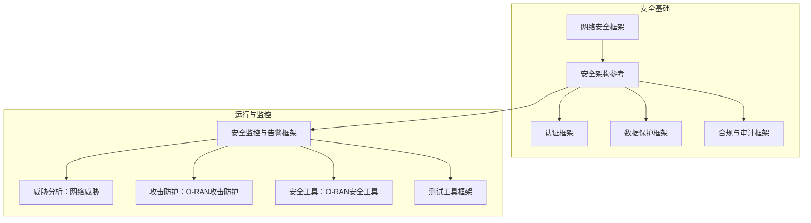
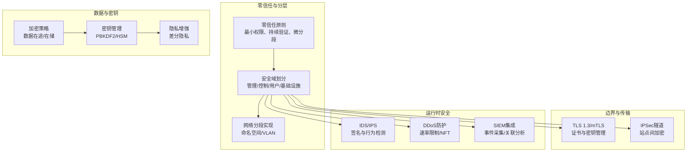
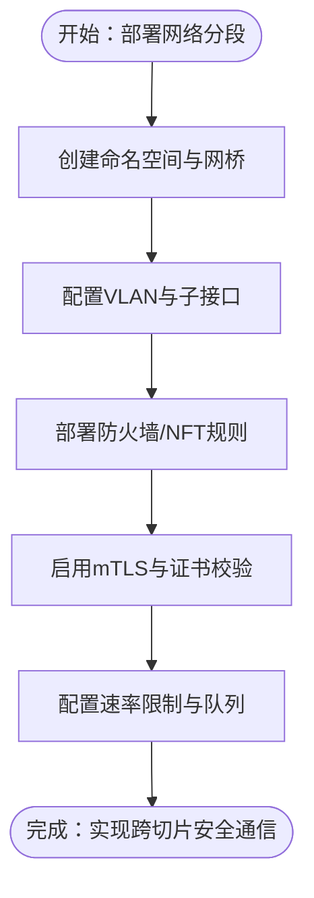
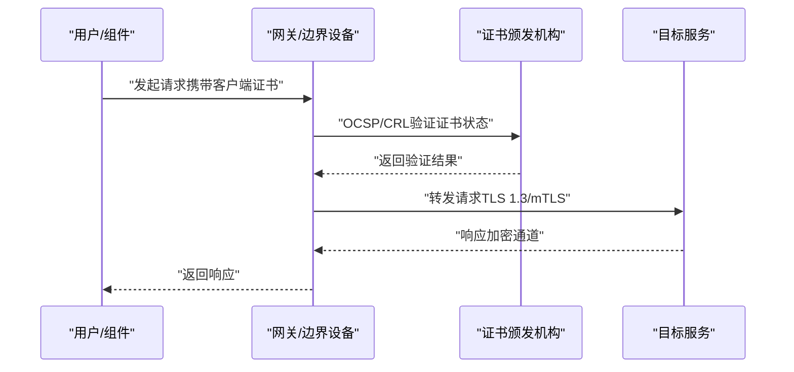
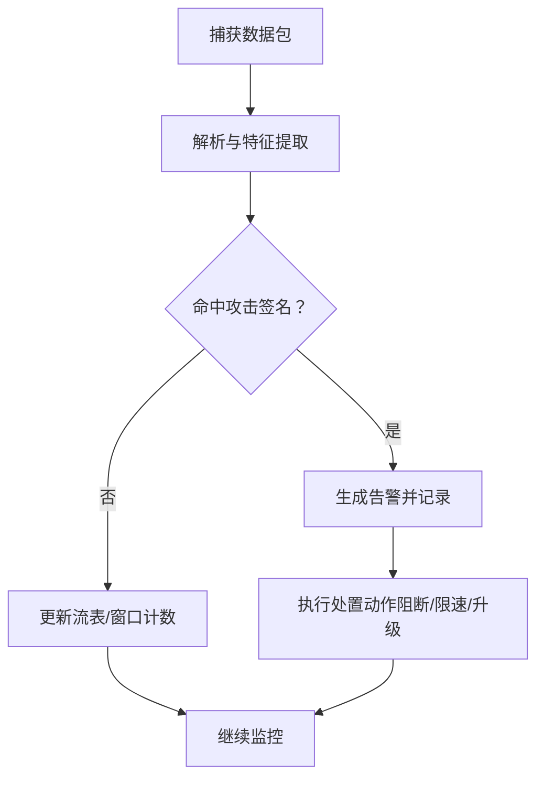
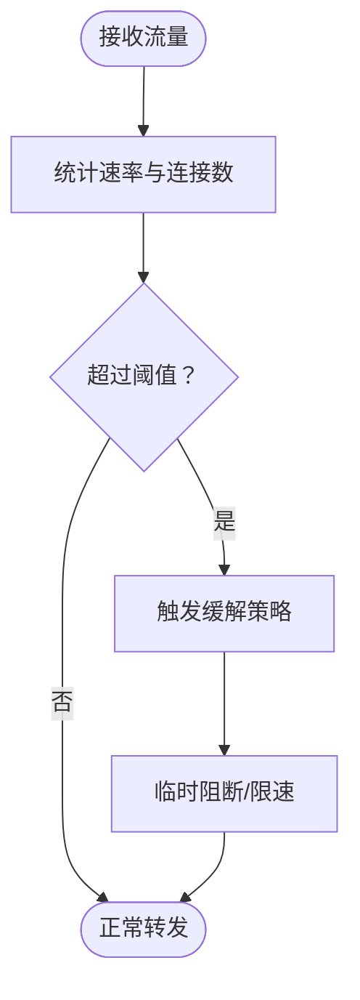
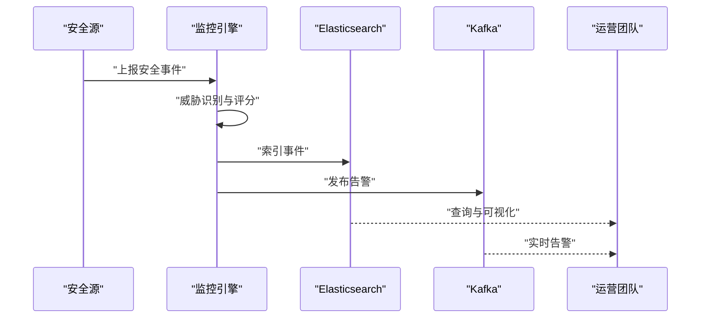
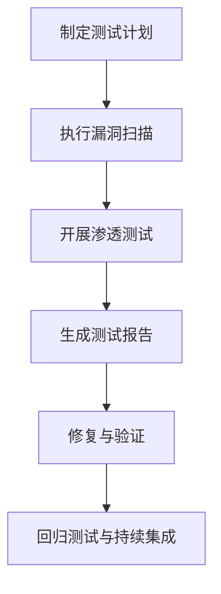
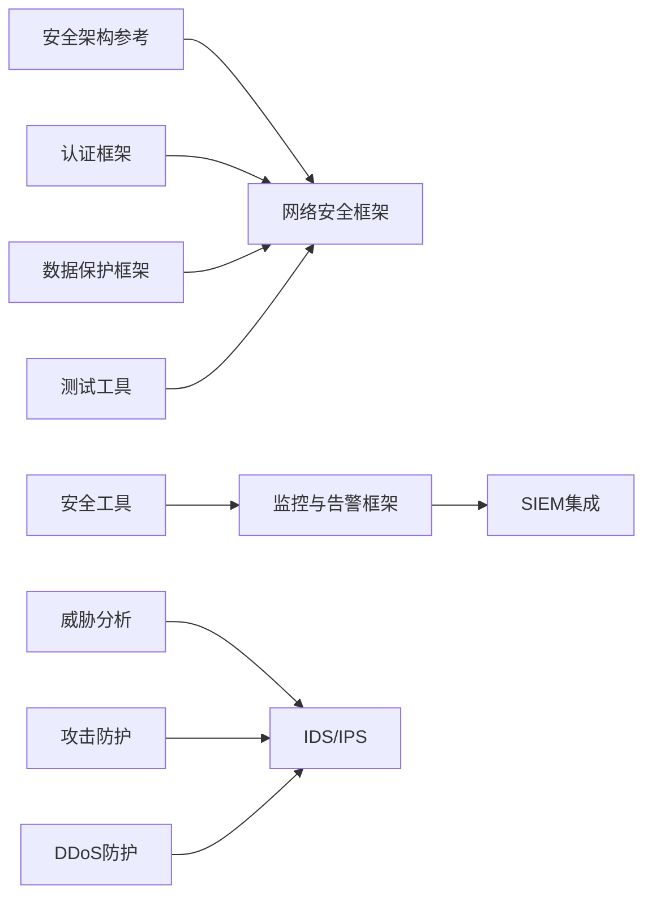

# 网络安全防护

<cite>
**本文引用的文件**
- [网络安全框架](file://12-security-privacy/network-security/network-security-framework.md)
- [安全架构参考](file://12-security-privacy/security-architecture/security-reference-architecture.md)
- [认证框架](file://12-security-privacy/authentication/authentication-framework.md)
- [数据保护框架](file://12-security-privacy/data-protection/data-protection-framework.md)
- [合规与审计框架](file://12-security-privacy/compliance-auditing/compliance-auditing-framework.md)
- [安全监控与告警框架](file://12-security-privacy/monitoring-alerting/security-monitoring-framework.md)
- [威胁分析：网络威胁](file://29-security-threats/threat-analysis/network-security-threats.md)
- [攻击防护：O-RAN攻击防护](file://29-security-threats/attack-protection/o-ran-attack-protection.md)
- [安全工具：O-RAN安全工具](file://29-security-threats/security-tools/o-ran-security-tools.md)
- [测试工具框架](file://13-testing-validation/testing-tools/testing-tools-frameworks.md)
</cite>

## 目录
1. [引言](#引言)
2. [项目结构](#项目结构)
3. [核心组件](#核心组件)
4. [架构总览](#架构总览)
5. [详细组件分析](#详细组件分析)
6. [依赖关系分析](#依赖关系分析)
7. [性能考量](#性能考量)
8. [故障排查指南](#故障排查指南)
9. [结论](#结论)
10. [附录](#附录)

## 引言
本文件面向O-RAN网络安全防护，围绕网络切片安全、微分段部署、入侵检测与预防（IDS/IPS）、DDoS防护、SIEM集成、拓扑与漏洞评估等主题，结合仓库中的安全框架、架构参考、认证与数据保护、监控与告警、威胁分析及测试工具等资料，形成可操作的实施指南与最佳实践。文档在保持技术深度的同时，兼顾非专业读者的理解需求。

## 项目结构
本仓库与网络安全相关的内容主要分布在“12-security-privacy”和“29-security-threats”两大板块，并辅以“13-testing-validation”中的测试工具框架。下图展示与网络安全防护直接相关的模块及其职责：

图表来源
- [网络安全框架](file://12-security-privacy/network-security/network-security-framework.md#L1-L473)
- [安全架构参考](file://12-security-privacy/security-architecture/security-reference-architecture.md#L1-L559)
- [认证框架](file://12-security-privacy/authentication/authentication-framework.md#L1-L208)
- [数据保护框架](file://12-security-privacy/data-protection/data-protection-framework.md#L1-L376)
- [合规与审计框架](file://12-security-privacy/compliance-auditing/compliance-auditing-framework.md#L1-L486)
- [安全监控与告警框架](file://12-security-privacy/monitoring-alerting/security-monitoring-framework.md#L1-L733)
- [威胁分析：网络威胁](file://29-security-threats/threat-analysis/network-security-threats.md)
- [攻击防护：O-RAN攻击防护](file://29-security-threats/attack-protection/o-ran-attack-protection.md)
- [安全工具：O-RAN安全工具](file://29-security-threats/security-tools/o-ran-security-tools.md)
- [测试工具框架](file://13-testing-validation/testing-tools/testing-tools-frameworks.md#L561-L598)

章节来源
- [网络安全框架](file://12-security-privacy/network-security/network-security-framework.md#L1-L473)
- [安全架构参考](file://12-security-privacy/security-architecture/security-reference-architecture.md#L1-L559)

## 核心组件
- 网络分段与微分段：通过零信任模型划分管理域、控制平面域、用户平面域与基础设施域，结合命名空间与VLAN实现逻辑隔离。
- 入侵检测与预防（IDS/IPS）：基于签名与行为的检测、异常流量识别与告警落盘。
- DDoS防护：速率限制、连接限制、NFTables规则、流量监控与缓解策略。
- 安全通信协议：TLS 1.3配置、互认证（mTLS）、证书颁发与吊销检查。
- 密钥与数据保护：基于PBKDF2的密钥派生、AES-GCM加密、HSM集成、差分隐私。
- SIEM集成：事件采集、威胁识别、告警生成与通知。
- 合规与审计：GDPR、3GPP、ETSI等标准映射与持续合规检查。
- 测试与验证：静态/动态安全扫描、容器镜像扫描、网络渗透测试。

章节来源
- [网络安全框架](file://12-security-privacy/network-security/network-security-framework.md#L6-L426)
- [安全架构参考](file://12-security-privacy/security-architecture/security-reference-architecture.md#L8-L513)
- [认证框架](file://12-security-privacy/authentication/authentication-framework.md#L8-L185)
- [数据保护框架](file://12-security-privacy/data-protection/data-protection-framework.md#L8-L374)
- [安全监控与告警框架](file://12-security-privacy/monitoring-alerting/security-monitoring-framework.md#L8-L731)
- [合规与审计框架](file://12-security-privacy/compliance-auditing/compliance-auditing-framework.md#L6-L484)
- [攻击防护：O-RAN攻击防护](file://29-security-threats/attack-protection/o-ran-attack-protection.md)
- [安全工具：O-RAN安全工具](file://29-security-threats/security-tools/o-ran-security-tools.md)
- [测试工具框架](file://13-testing-validation/testing-tools/testing-tools-frameworks.md#L561-L598)

## 架构总览
下图展示O-RAN网络安全防护的整体架构，强调零信任、分层防御与自动化编排：

图表来源
- [网络安全框架](file://12-security-privacy/network-security/network-security-framework.md#L8-L426)
- [安全架构参考](file://12-security-privacy/security-architecture/security-reference-architecture.md#L8-L245)
- [数据保护框架](file://12-security-privacy/data-protection/data-protection-framework.md#L8-L184)
- [安全监控与告警框架](file://12-security-privacy/monitoring-alerting/security-monitoring-framework.md#L8-L217)

## 详细组件分析

### 网络切片与微分段
- 零信任与安全域
  - 管理域：高安全级别，采用双向TLS、RBAC与审计日志。
  - 控制平面域：高安全级别，证书认证、消息签名与速率限制。
  - 用户平面域：中等安全级别，加密、完整性保护与QoS隔离。
  - 基础设施域：高安全级别，虚拟化安全、网络分段与硬件信任根。
- 网络分段实现
  - 命名空间：为各域创建独立网络命名空间与网桥，隔离路由与默认网关。
  - VLAN：按域分配VLAN ID，分别配置子接口与地址段。
- 资源分配安全
  - 通过命名空间与VLAN实现逻辑隔离，避免跨域横向移动。
  - 结合速率限制与队列调度，保障关键接口（如F1）的带宽与优先级。
- 跨切片通信保护
  - 通过mTLS与证书链路校验，确保跨域通信的端到端加密与身份可信。
  - 在边界设备上部署防火墙规则与NFTables策略，限制不必要的跨域访问。

图表来源
- [网络安全框架](file://12-security-privacy/network-security/network-security-framework.md#L42-L112)
- [安全架构参考](file://12-security-privacy/security-architecture/security-reference-architecture.md#L250-L282)

章节来源
- [网络安全框架](file://12-security-privacy/network-security/network-security-framework.md#L6-L112)
- [安全架构参考](file://12-security-privacy/security-architecture/security-reference-architecture.md#L8-L36)

### 微分段技术部署
- 动态安全域划分
  - 基于业务域与接口类型（E2/A1/O1/F1/O-FH）划分域，域内最小权限访问。
  - 利用命名空间与VLAN实现动态域迁移与弹性扩缩容场景下的隔离。
- 流量加密
  - 对控制面使用证书认证与消息签名；对用户面采用端到端加密与完整性保护。
  - 站点间通过IPSec隧道加密，支持IKEv2与AES-GCM。
- 访问控制策略
  - RBAC与多因素认证（MFA）结合，按角色授予最小权限。
  - 会话管理采用一次性令牌与超时控制，防止会话劫持。

图表来源
- [认证框架](file://12-security-privacy/authentication/authentication-framework.md#L100-L124)
- [数据保护框架](file://12-security-privacy/data-protection/data-protection-framework.md#L35-L96)

章节来源
- [认证框架](file://12-security-privacy/authentication/authentication-framework.md#L8-L124)
- [数据保护框架](file://12-security-privacy/data-protection/data-protection-framework.md#L30-L96)

### 入侵检测与预防（IDS/IPS）
- 检测能力
  - 签名匹配：SYN洪泛、端口扫描、畸形报文等。
  - 行为分析：异常连接数、短时间多端口探测等。
- 处置与告警
  - 将告警写入本地日志或发送至SIEM/Kafka，支持分级处置。
- 自动化响应
  - 可结合防火墙规则临时阻断可疑源IP，或触发账号锁定与日志级别提升。

图表来源
- [网络安全框架](file://12-security-privacy/network-security/network-security-framework.md#L114-L259)

章节来源
- [网络安全框架](file://12-security-privacy/network-security/network-security-framework.md#L114-L259)

### DDoS防护机制
- 速率限制与流量整形
  - 全局与每源限速、突发额度与时间窗口，针对E2/F1/管理接口设定差异化带宽与优先级。
- 防火墙与NFTables
  - iptables规则：SYN限速、ICMP限速、连接数限制、端口扫描检测。
  - NFTables规则：更高效地实现速率限制与连接计数拒绝。
- 流量监控与缓解
  - 周期性统计RX/TX速率，超过阈值触发缓解动作（如临时黑洞、上游协同）。

图表来源
- [网络安全框架](file://12-security-privacy/network-security/network-security-framework.md#L261-L426)

章节来源
- [网络安全框架](file://12-security-privacy/network-security/network-security-framework.md#L261-L426)

### SIEM集成方案
- 日志收集
  - 从认证、网络流量、配置变更、性能异常等多源采集事件。
- 关联分析与威胁识别
  - 基于事件模式识别暴力破解、未授权配置变更等威胁。
- 实时告警
  - 生成告警并推送至Elasticsearch与Kafka，支持自动升级与通知。

图表来源
- [安全架构参考](file://12-security-privacy/security-architecture/security-reference-architecture.md#L341-L513)

章节来源
- [安全架构参考](file://12-security-privacy/security-architecture/security-reference-architecture.md#L341-L513)

### 网络拓扑安全评估、漏洞扫描与渗透测试
- 漏洞扫描与合规
  - 使用OpenSCAP、CIS-CAT、Lynis、OpenVAS等工具进行合规与漏洞扫描。
- 渗透测试
  - 使用Nmap、Nikto、Metasploit、Burp Suite等工具进行受控渗透测试。
- 安全测试集成
  - 静态代码分析（SonarQube）、动态应用安全测试（OWASP ZAP）、容器镜像扫描（Trivy/Clair）。

图表来源
- [测试工具框架](file://13-testing-validation/testing-tools/testing-tools-frameworks.md#L561-L598)
- [安全工具：O-RAN安全工具](file://29-security-threats/security-tools/o-ran-security-tools.md#L85-L179)

章节来源
- [测试工具框架](file://13-testing-validation/testing-tools/testing-tools-frameworks.md#L561-L598)
- [安全工具：O-RAN安全工具](file://29-security-threats/security-tools/o-ran-security-tools.md#L85-L179)

## 依赖关系分析
- 组件耦合
  - 网络安全框架依赖安全架构参考中的零信任与安全域设计；认证与数据保护为传输与存储提供基础能力。
  - 监控与告警框架依赖认证与数据保护提供的日志与事件格式；SIEM集成依赖监控输出。
  - 攻击防护与威胁分析为IDS/IPS与DDoS缓解提供威胁情报与检测模型支撑。
- 外部依赖
  - 证书颁发与吊销（CA/OCSP/CRL）、加密算法（TLS 1.3/AES-GCM）、日志平台（ELK/Kafka）、合规工具（OpenSCAP/Lynis）。

图表来源
- [网络安全框架](file://12-security-privacy/network-security/network-security-framework.md#L1-L473)
- [安全架构参考](file://12-security-privacy/security-architecture/security-reference-architecture.md#L1-L559)
- [监控与告警框架](file://12-security-privacy/monitoring-alerting/security-monitoring-framework.md#L1-L733)
- [威胁分析：网络威胁](file://29-security-threats/threat-analysis/network-security-threats.md)
- [攻击防护：O-RAN攻击防护](file://29-security-threats/attack-protection/o-ran-attack-protection.md)
- [安全工具：O-RAN安全工具](file://29-security-threats/security-tools/o-ran-security-tools.md)
- [测试工具框架](file://13-testing-validation/testing-tools/testing-tools-frameworks.md#L561-L598)

## 性能考量
- 分段与隔离
  - 命名空间与VLAN带来额外开销，需根据域数量与流量规模进行容量规划。
- 加密与完整性
  - TLS 1.3与AES-GCM在现代CPU上性能良好，但高并发场景建议启用硬件加速或专用加密卡。
- 监控与告警
  - 事件聚合与去噪可降低SIEM负载；合理设置阈值与告警抑制，避免告警风暴。
- DDoS缓解
  - NFTables相比iptables在高吞吐场景更具优势；缓存与旁路清洗设备可减轻主干压力。

## 故障排查指南
- 网络分段问题
  - 检查命名空间与网桥状态、VLAN子接口是否正确配置；核对路由与默认网关。
- 认证失败
  - 核查证书链、有效期与吊销状态（OCSP/CRL）；确认mTLS握手参数与客户端证书。
- DDoS缓解误伤
  - 调整速率限制阈值与突发额度；区分合法高并发与攻击流量，必要时启用白名单。
- SIEM告警缺失
  - 检查事件采集管道（日志源、格式、索引策略）；确认告警规则与关联逻辑。
- 合规检查失败
  - 使用合规脚本逐项核查密码策略、SSH配置、防火墙规则与证书有效性。

章节来源
- [网络安全框架](file://12-security-privacy/network-security/network-security-framework.md#L311-L426)
- [安全架构参考](file://12-security-privacy/security-architecture/security-reference-architecture.md#L341-L513)
- [监控与告警框架](file://12-security-privacy/monitoring-alerting/security-monitoring-framework.md#L310-L440)
- [合规与审计框架](file://12-security-privacy/compliance-auditing/compliance-auditing-framework.md#L114-L196)

## 结论
本文件基于仓库中的安全框架与工具体系，构建了覆盖网络切片隔离、微分段部署、入侵检测与预防、DDoS防护、SIEM集成以及测试验证的完整技术路线。通过零信任与分层防御相结合，配合自动化编排与持续改进机制，可有效提升O-RAN网络在复杂威胁环境下的安全性与韧性。

## 附录
- 相关标准与合规
  - GDPR、NIST CSF、ISO 27001、3GPP TS 33.501/33.102/33.401、ETSI TS 103 859/983。
- 威胁情报与工具
  - 商业TI平台（Recorded Future、ThreatConnect等）与开源平台（MISP、OTX、VirusTotal等）。
- 测试与验证清单
  - 静态/动态扫描、容器镜像扫描、网络渗透测试、合规检查与回归测试。

章节来源
- [合规与审计框架](file://12-security-privacy/compliance-auditing/compliance-auditing-framework.md#L515-L557)
- [威胁分析：网络威胁](file://29-security-threats/threat-analysis/network-security-threats.md)
- [安全工具：O-RAN安全工具](file://29-security-threats/security-tools/o-ran-security-tools.md#L85-L179)
- [测试工具框架](file://13-testing-validation/testing-tools/testing-tools-frameworks.md#L561-L598)