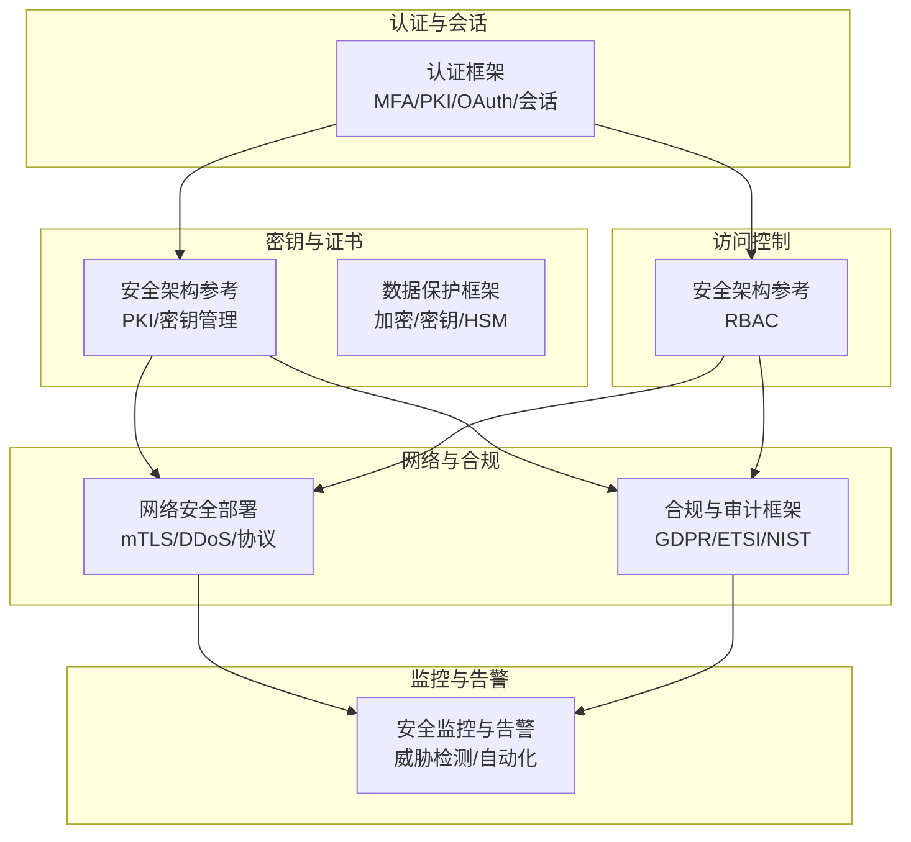
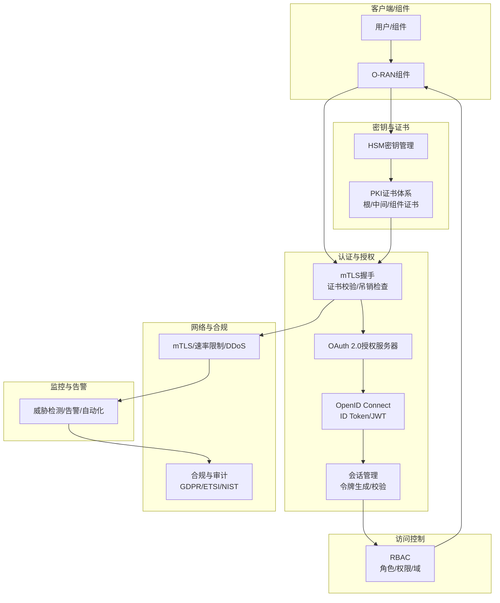
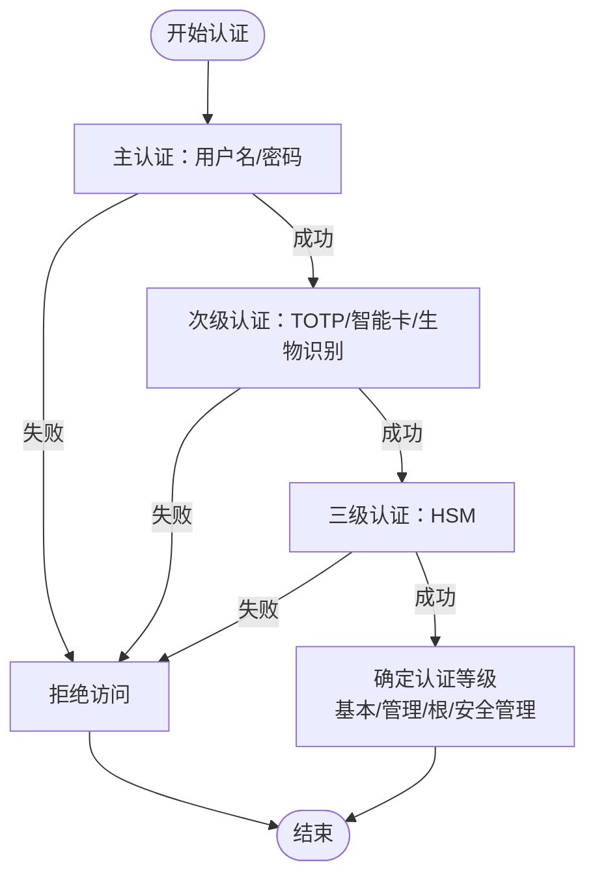
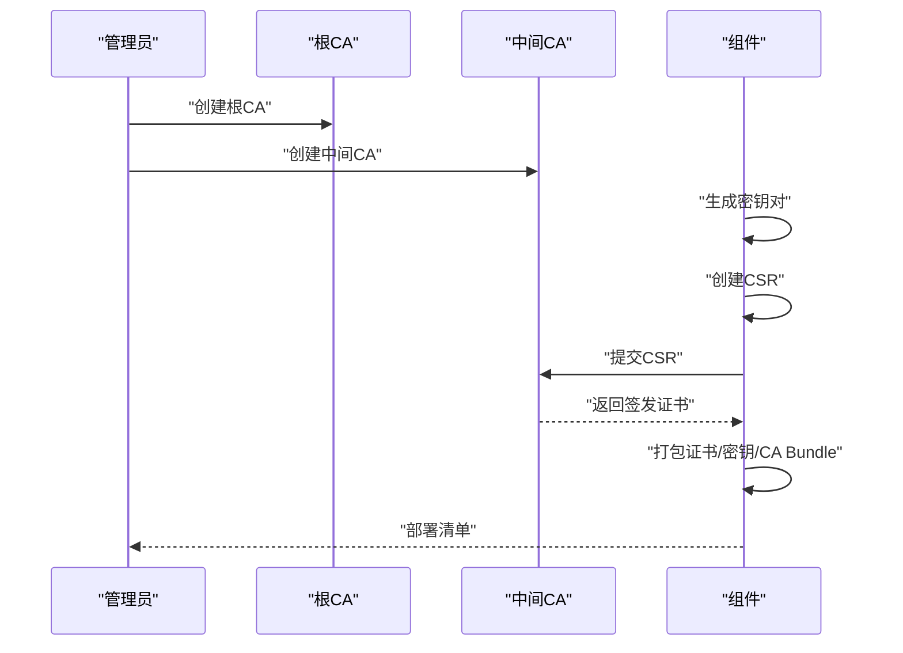
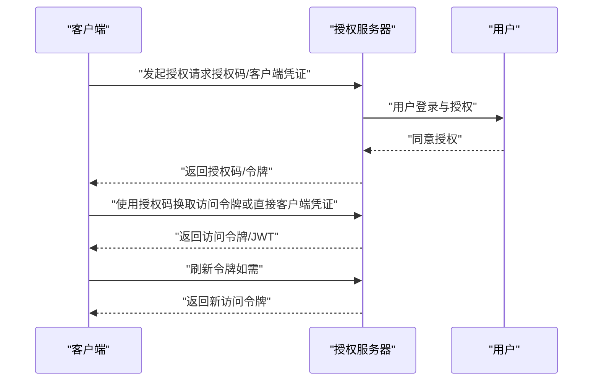
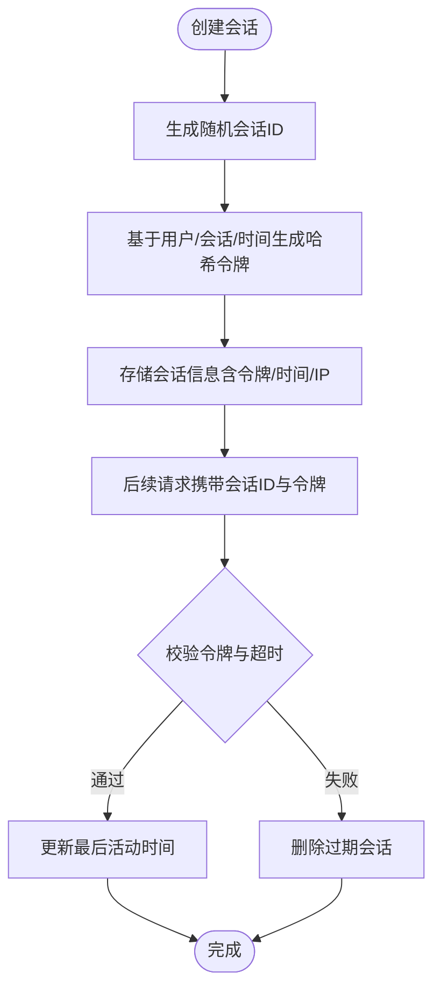
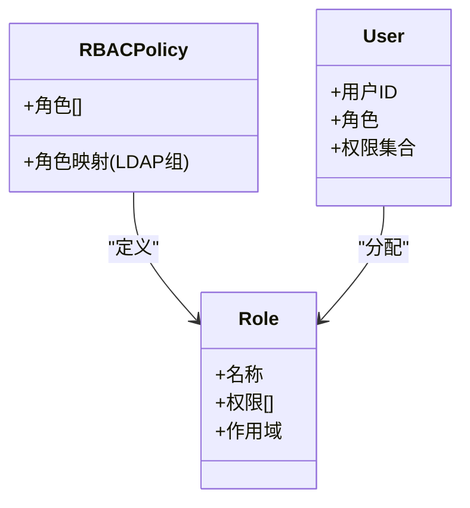
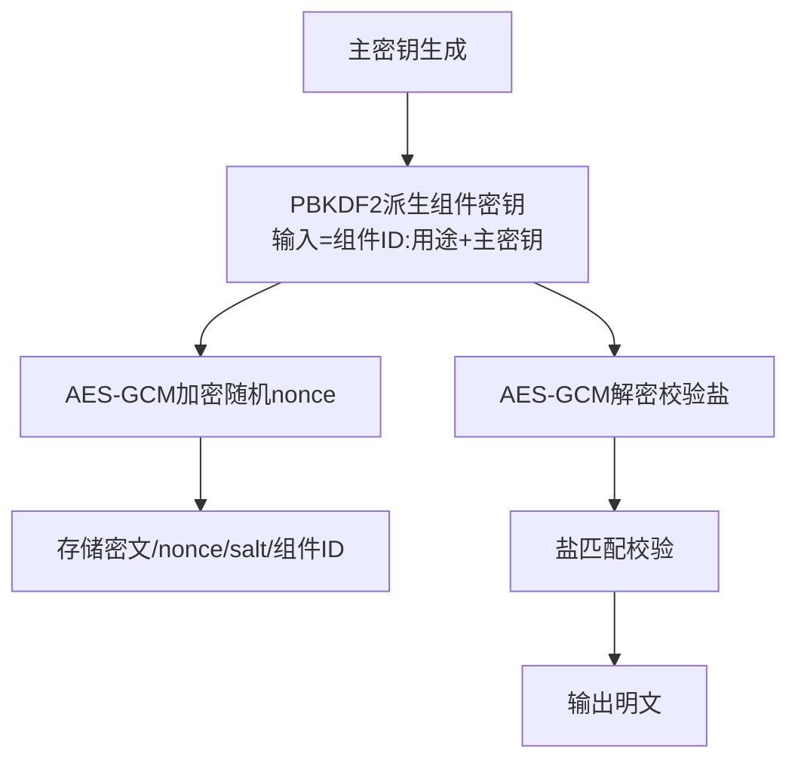
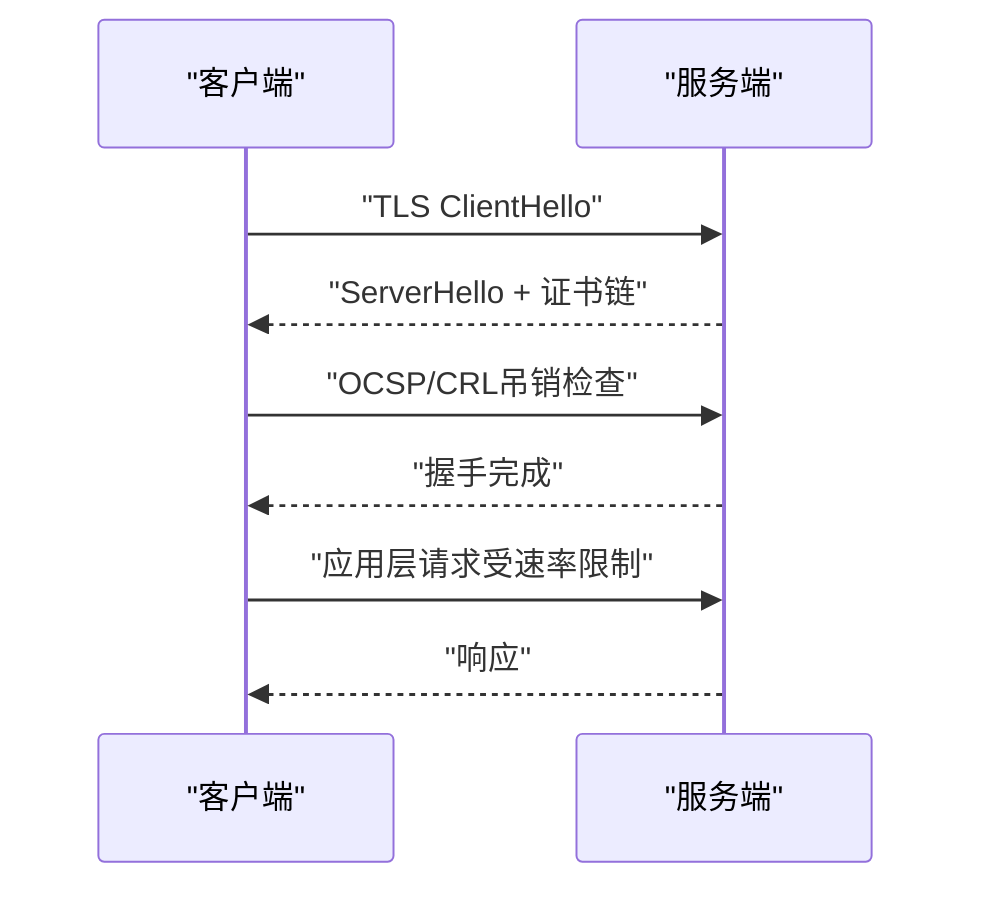
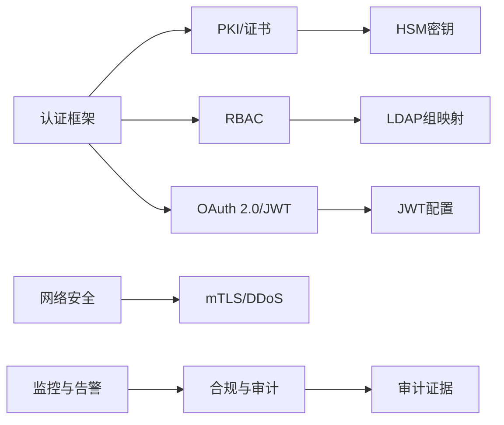

# 认证授权机制

<cite>
**本文引用的文件**
- [认证框架（英文）](file://12-security-privacy/authentication/authentication-framework.md)
- [认证框架（中文）](file://12-security-privacy/authentication/authentication-framework-zh.md)
- [安全架构参考（英文）](file://12-security-privacy/security-architecture/security-reference-architecture.md)
- [安全架构参考（中文）](file://12-security-privacy/security-architecture/security-reference-architecture-zh.md)
- [数据保护框架（英文）](file://12-security-privacy/data-protection/data-protection-framework.md)
- [合规与审计框架（英文）](file://12-security-privacy/compliance-auditing/compliance-auditing-framework.md)
- [网络安全部署（英文）](file://12-security-privacy/network-security/network-security-framework.md)
- [安全监控与告警（英文）](file://12-security-privacy/monitoring-alerting/security-monitoring-framework.md)
</cite>

## 目录
1. [简介](#简介)
2. [项目结构](#项目结构)
3. [核心组件](#核心组件)
4. [架构总览](#架构总览)
5. [详细组件分析](#详细组件分析)
6. [依赖关系分析](#依赖关系分析)
7. [性能考量](#性能考量)
8. [故障排查指南](#故障排查指南)
9. [结论](#结论)
10. [附录](#附录)

## 简介
本文件面向O-RAN系统的认证授权机制，围绕多因素认证（MFA）、PKI证书管理体系、OAuth 2.0/OpenID Connect、基于角色的访问控制（RBAC）与密钥管理等主题，结合仓库现有文档，形成可落地的实施方案与最佳实践。文档既覆盖技术细节，也提供可视化图示与实操建议，帮助读者快速理解并部署符合O-RAN与相关标准的安全体系。

## 项目结构
本认证授权主题主要分布在以下安全文档中：
- 认证与会话管理：认证框架（英文/中文）
- PKI与证书管理：安全架构参考（英文/中文）、数据保护框架（英文）
- OAuth 2.0与会话：认证框架（英文/中文）
- RBAC与密钥管理：安全架构参考（英文/中文）
- 网络与合规：网络安全部署（英文）、合规与审计框架（英文）
- 安全监控：安全监控与告警（英文）

图表来源
- [认证框架（英文）](file://12-security-privacy/authentication/authentication-framework.md#L1-L208)
- [安全架构参考（英文）](file://12-security-privacy/security-architecture/security-reference-architecture.md#L1-L559)
- [数据保护框架（英文）](file://12-security-privacy/data-protection/data-protection-framework.md#L1-L376)
- [网络安全部署（英文）](file://12-security-privacy/network-security/network-security-framework.md#L1-L473)
- [合规与审计框架（英文）](file://12-security-privacy/compliance-auditing/compliance-auditing-framework.md#L1-L486)
- [安全监控与告警（英文）](file://12-security-privacy/monitoring-alerting/security-monitoring-framework.md#L1-L733)

章节来源
- [认证框架（英文）](file://12-security-privacy/authentication/authentication-framework.md#L1-L208)
- [安全架构参考（英文）](file://12-security-privacy/security-architecture/security-reference-architecture.md#L1-L559)
- [数据保护框架（英文）](file://12-security-privacy/data-protection/data-protection-framework.md#L1-L376)
- [网络安全部署（英文）](file://12-security-privacy/network-security/network-security-framework.md#L1-L473)
- [合规与审计框架（英文）](file://12-security-privacy/compliance-auditing/compliance-auditing-framework.md#L1-L486)
- [安全监控与告警（英文）](file://12-security-privacy/monitoring-alerting/security-monitoring-framework.md#L1-L733)

## 核心组件
- 多因素认证（MFA）：用户名/密码为主认证，辅以TOTP令牌、智能卡、生物识别与硬件安全模块（HSM），并定义认证等级。
- PKI证书管理体系：组织根CA、域内中间CA、组件证书签发与打包、吊销检查（OCSP/CRL）与自动续期。
- OAuth 2.0与OpenID Connect：授权码流程、客户端凭证流程、JWT配置与刷新机制。
- 会话管理：基于安全随机数与哈希的会话令牌生成与校验，带超时与活动时间更新。
- RBAC：角色与权限映射、LDAP组到角色映射、域范围的访问控制。
- 密钥管理：基于HSM的主密钥生成与派生、PBKDF2密钥派生、AES-GCM加解密。
- 网络安全：mTLS、DDoS防护、流量整形与速率限制、协议合规检查。
- 合规与审计：GDPR、ETSI、NIST等合规矩阵与持续监测。

章节来源
- [认证框架（英文）](file://12-security-privacy/authentication/authentication-framework.md#L8-L124)
- [认证框架（中文）](file://12-security-privacy/authentication/authentication-framework-zh.md#L8-L124)
- [安全架构参考（英文）](file://12-security-privacy/security-architecture/security-reference-architecture.md#L247-L337)
- [安全架构参考（中文）](file://12-security-privacy/security-architecture/security-reference-architecture-zh.md#L247-L337)
- [数据保护框架（英文）](file://12-security-privacy/data-protection/data-protection-framework.md#L98-L184)
- [网络安全部署（英文）](file://12-security-privacy/network-security/network-security-framework.md#L261-L426)

## 架构总览
下图展示认证授权在O-RAN中的整体交互：组件通过mTLS与授权服务器交互，完成OAuth 2.0授权与会话建立；RBAC控制资源访问；密钥管理与证书管理贯穿全链路。

图表来源
- [认证框架（英文）](file://12-security-privacy/authentication/authentication-framework.md#L100-L185)
- [安全架构参考（英文）](file://12-security-privacy/security-architecture/security-reference-architecture.md#L247-L337)
- [数据保护框架（英文）](file://12-security-privacy/data-protection/data-protection-framework.md#L98-L184)
- [网络安全部署（英文）](file://12-security-privacy/network-security/network-security-framework.md#L261-L426)
- [合规与审计框架（英文）](file://12-security-privacy/compliance-auditing/compliance-auditing-framework.md#L1-L486)
- [安全监控与告警（英文）](file://12-security-privacy/monitoring-alerting/security-monitoring-framework.md#L1-L733)

## 详细组件分析

### 多因素认证（MFA）与认证等级
- 主认证：用户名/密码
- 次级认证：TOTP令牌、智能卡、生物识别
- 三级认证：硬件安全模块（HSM）
- 认证等级：基本访问、管理访问、根访问、安全管理

图表来源
- [认证框架（英文）](file://12-security-privacy/authentication/authentication-framework.md#L8-L23)
- [认证框架（中文）](file://12-security-privacy/authentication/authentication-framework-zh.md#L8-L23)

章节来源
- [认证框架（英文）](file://12-security-privacy/authentication/authentication-framework.md#L8-L23)
- [认证框架（中文）](file://12-security-privacy/authentication/authentication-framework-zh.md#L8-L23)

### PKI证书管理体系
- 层次结构：组织根CA → 管理/控制/用户/基础设施中间CA
- 组件证书签发：组件密钥生成、CSR创建、中间CA签名、打包部署清单
- 吊销与更新：OCSP/CRL、证书有效期、续订提前量
- 自动化脚本：证书颁发、打包、部署清单生成

图表来源
- [安全架构参考（英文）](file://12-security-privacy/security-architecture/security-reference-architecture.md#L75-L145)
- [数据保护框架（英文）](file://12-security-privacy/data-protection/data-protection-framework.md#L30-L96)

章节来源
- [安全架构参考（英文）](file://12-security-privacy/security-architecture/security-reference-architecture.md#L75-L145)
- [安全架构参考（中文）](file://12-security-privacy/security-architecture/security-reference-architecture-zh.md#L75-L145)
- [数据保护框架（英文）](file://12-security-privacy/data-protection/data-protection-framework.md#L30-L96)

### OAuth 2.0与OpenID Connect实现
- 授权服务器与令牌端点
- 客户端注册：授权类型（授权码、客户端凭证）、重定向URI、作用域
- JWT配置：签名算法、令牌有效期、刷新令牌有效期、发行方
- 会话管理：会话ID与令牌生成、校验、超时与活动时间更新

图表来源
- [认证框架（英文）](file://12-security-privacy/authentication/authentication-framework.md#L71-L96)
- [认证框架（中文）](file://12-security-privacy/authentication/authentication-framework-zh.md#L71-L96)

章节来源
- [认证框架（英文）](file://12-security-privacy/authentication/authentication-framework.md#L71-L96)
- [认证框架（中文）](file://12-security-privacy/authentication/authentication-framework-zh.md#L71-L96)

### 会话管理与令牌校验
- 会话创建：安全随机会话ID、基于用户ID/会话ID/创建时间的哈希令牌
- 会话校验：令牌一致性、超时判断、最后活动时间更新
- 客户端IP记录：便于审计与风控

图表来源
- [认证框架（英文）](file://12-security-privacy/authentication/authentication-framework.md#L126-L185)
- [认证框架（中文）](file://12-security-privacy/authentication/authentication-framework-zh.md#L126-L185)

章节来源
- [认证框架（英文）](file://12-security-privacy/authentication/authentication-framework.md#L126-L185)
- [认证框架（中文）](file://12-security-privacy/authentication/authentication-framework-zh.md#L126-L185)

### 基于角色的访问控制（RBAC）
- 角色定义：系统管理员、网络工程师、安全分析师、RIC开发者
- 权限与范围：全局/域特定/安全域/RIC域
- LDAP组映射： oran-admins → 系统管理员， oran-engineers → 网络工程师，依此类推

图表来源
- [安全架构参考（英文）](file://12-security-privacy/security-architecture/security-reference-architecture.md#L284-L337)
- [安全架构参考（中文）](file://12-security-privacy/security-architecture/security-reference-architecture-zh.md#L284-L337)

章节来源
- [安全架构参考（英文）](file://12-security-privacy/security-architecture/security-reference-architecture.md#L284-L337)
- [安全架构参考（中文）](file://12-security-privacy/security-architecture/security-reference-architecture-zh.md#L284-L337)

### 密钥管理与HSM集成
- 主密钥生成：随机数生成（可由HSM提供）
- 密钥派生：PBKDF2（迭代次数、盐长度、密钥长度）
- 加解密：AES-GCM（随机nonce）
- 证据：盐匹配校验，防止篡改

图表来源
- [数据保护框架（英文）](file://12-security-privacy/data-protection/data-protection-framework.md#L98-L184)
- [安全架构参考（英文）](file://12-security-privacy/security-architecture/security-reference-architecture.md#L147-L245)

章节来源
- [数据保护框架（英文）](file://12-security-privacy/data-protection/data-protection-framework.md#L98-L184)
- [安全架构参考（英文）](file://12-security-privacy/security-architecture/security-reference-architecture.md#L147-L245)

### 网络安全与mTLS
- mTLS配置：E2/F1/管理接口的CA、客户端证书要求、有效期、吊销检查（OCSP/CRL）、密码套件
- DDoS防护：速率限制、连接限制、NFTables规则、流量监控与缓解
- 协议合规：TLS 1.3/1.2、OCSP stapling、安全头部

图表来源
- [认证框架（英文）](file://12-security-privacy/authentication/authentication-framework.md#L100-L124)
- [网络安全部署（英文）](file://12-security-privacy/network-security/network-security-framework.md#L261-L426)

章节来源
- [认证框架（英文）](file://12-security-privacy/authentication/authentication-framework.md#L100-L124)
- [网络安全部署（英文）](file://12-security-privacy/network-security/network-security-framework.md#L261-L426)

### 合规与审计
- 合规矩阵：GDPR、NIST CSF、ISO 27001、ETSI、3GPP
- 审计证据收集：系统信息、安全配置、网络配置、应用证据、合规证据
- 持续监测：仪表盘指标、阈值告警、趋势分析

章节来源
- [合规与审计框架（英文）](file://12-security-privacy/compliance-auditing/compliance-auditing-framework.md#L1-L486)
- [安全监控与告警（英文）](file://12-security-privacy/monitoring-alerting/security-monitoring-framework.md#L306-L486)

## 依赖关系分析
- 认证框架依赖PKI与密钥管理提供证书与密钥能力
- RBAC依赖LDAP组映射与会话管理提供访问控制
- OAuth 2.0与OpenID Connect依赖授权服务器与JWT配置
- 网络安全依赖mTLS与DDoS防护保障通信安全
- 合规与审计依赖监控与自动化工具链

图表来源
- [认证框架（英文）](file://12-security-privacy/authentication/authentication-framework.md#L1-L208)
- [安全架构参考（英文）](file://12-security-privacy/security-architecture/security-reference-architecture.md#L1-L559)
- [网络安全部署（英文）](file://12-security-privacy/network-security/network-security-framework.md#L1-L473)
- [合规与审计框架（英文）](file://12-security-privacy/compliance-auditing/compliance-auditing-framework.md#L1-L486)
- [安全监控与告警（英文）](file://12-security-privacy/monitoring-alerting/security-monitoring-framework.md#L1-L733)

章节来源
- [认证框架（英文）](file://12-security-privacy/authentication/authentication-framework.md#L1-L208)
- [安全架构参考（英文）](file://12-security-privacy/security-architecture/security-reference-architecture.md#L1-L559)
- [网络安全部署（英文）](file://12-security-privacy/network-security/network-security-framework.md#L1-L473)
- [合规与审计框架（英文）](file://12-security-privacy/compliance-auditing/compliance-auditing-framework.md#L1-L486)
- [安全监控与告警（英文）](file://12-security-privacy/monitoring-alerting/security-monitoring-framework.md#L1-L733)

## 性能考量
- 证书与密钥操作：HSM加速、批量签发与续期、缓存吊销状态
- OAuth 2.0：令牌缓存、JWT签名算法选择（RS256）、刷新令牌复用
- mTLS：OCSP Stapling、密码套件优化、会话复用
- RBAC：角色缓存、权限预计算、LDAP查询优化
- DDoS：NFTables高性能规则、速率限制与突发缓冲、上游联动

## 故障排查指南
- 证书问题：吊销检查失败、证书过期、中间CA链不完整
- OAuth 2.0：授权码失效、客户端凭证错误、JWT签名算法不匹配
- 会话问题：令牌不一致、超时频繁、IP变化导致校验失败
- RBAC：角色映射缺失、LDAP组变更未同步、权限粒度过粗
- 网络安全：mTLS握手失败、速率限制误伤、DDoS缓解过度
- 合规与审计：日志缺失、证据包校验失败、合规分数下降

章节来源
- [认证框架（英文）](file://12-security-privacy/authentication/authentication-framework.md#L126-L185)
- [安全架构参考（英文）](file://12-security-privacy/security-architecture/security-reference-architecture.md#L247-L337)
- [网络安全部署（英文）](file://12-security-privacy/network-security/network-security-framework.md#L261-L426)
- [合规与审计框架（英文）](file://12-security-privacy/compliance-auditing/compliance-auditing-framework.md#L1-L486)

## 结论
本认证授权机制以MFA为基础，结合PKI证书与密钥管理、OAuth 2.0/OpenID Connect、RBAC与网络安全策略，形成端到端的安全体系。通过HSM与自动化脚本提升密钥与证书管理效率，借助mTLS与DDoS防护强化通信安全，并以合规与审计保障持续改进。建议在生产环境中按域分层部署、定期演练与评估，确保体系稳定与可持续演进。

## 附录
- 配置示例路径
  - PKI证书颁发与打包：[安全架构参考（英文）](file://12-security-privacy/security-architecture/security-reference-architecture.md#L75-L145)
  - OAuth 2.0客户端配置：[认证框架（英文）](file://12-security-privacy/authentication/authentication-framework.md#L71-L96)
  - mTLS接口配置：[认证框架（英文）](file://12-security-privacy/authentication/authentication-framework.md#L100-L124)
  - 会话管理类：[认证框架（英文）](file://12-security-privacy/authentication/authentication-framework.md#L126-L185)
  - RBAC策略与映射：[安全架构参考（英文）](file://12-security-privacy/security-architecture/security-reference-architecture.md#L284-L337)
  - 密钥管理与HSM：[数据保护框架（英文）](file://12-security-privacy/data-protection/data-protection-framework.md#L98-L184)
  - DDoS防护与速率限制：[网络安全部署（英文）](file://12-security-privacy/network-security/network-security-framework.md#L261-L426)
  - 合规与审计：[合规与审计框架（英文）](file://12-security-privacy/compliance-auditing/compliance-auditing-framework.md#L1-L486)
  - 安全监控与告警：[安全监控与告警（英文）](file://12-security-privacy/monitoring-alerting/security-monitoring-framework.md#L1-L733)