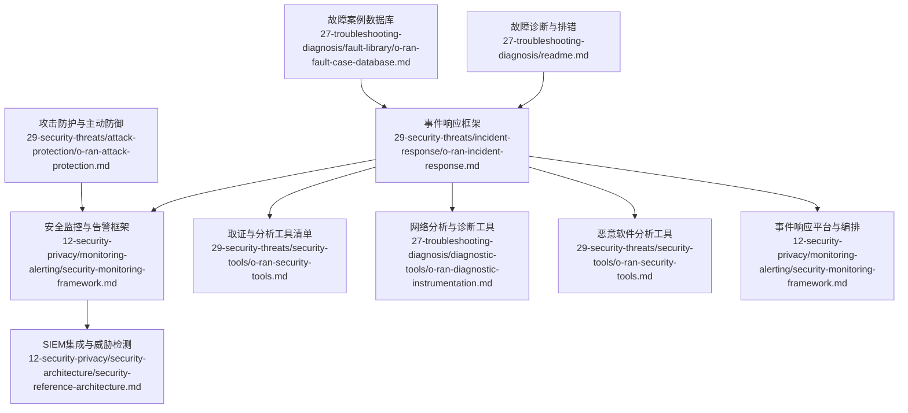
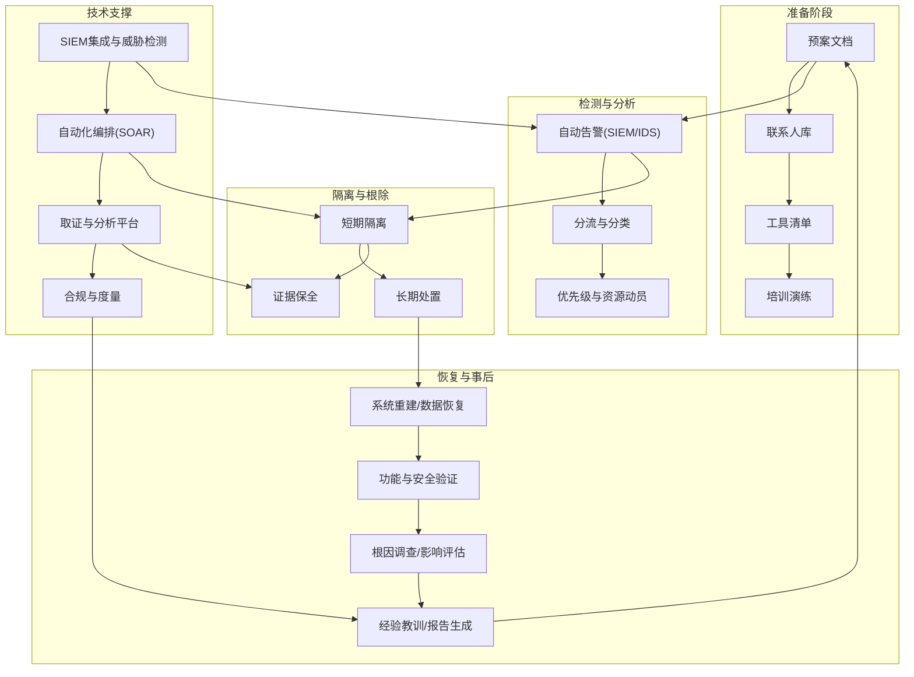
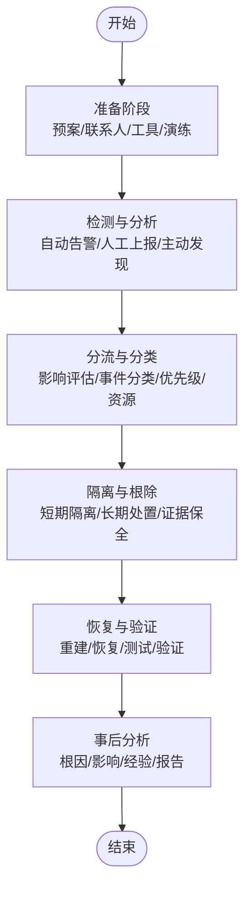
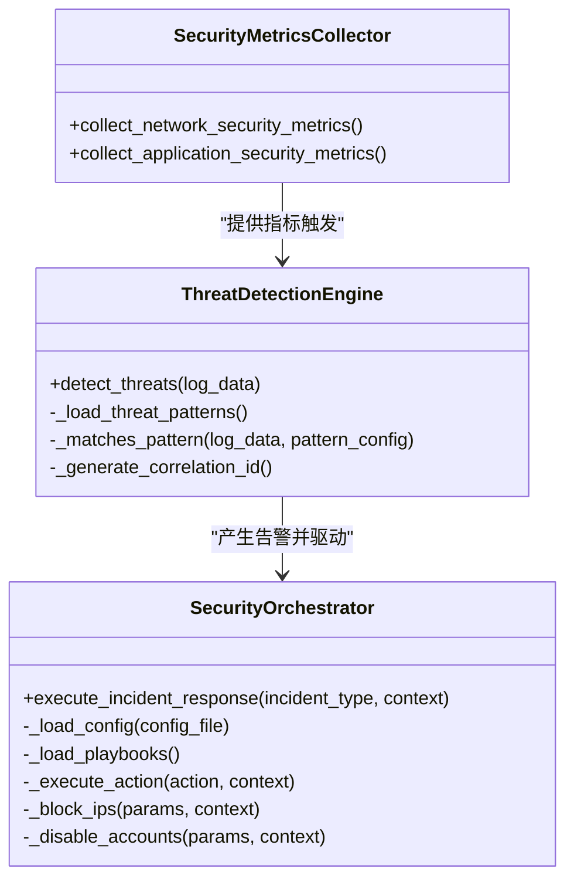
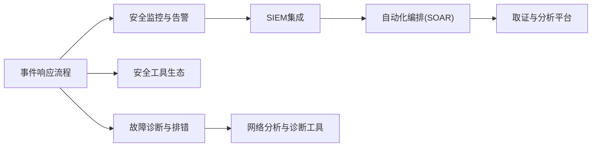

# 事件响应

<cite>
**本文引用的文件**
- [O-RAN 安全事件响应框架](file://29-security-threats/incident-response/o-ran-incident-response.md)
- [O-RAN 安全监控与告警框架](file://12-security-privacy/monitoring-alerting/security-monitoring-framework.md)
- [O-RAN 安全参考架构](file://12-security-privacy/security-architecture/security-reference-architecture.md)
- [O-RAN 故障诊断与排错](file://27-troubleshooting-diagnosis/readme.md)
- [O-RAN 故障案例数据库](file://27-troubleshooting-diagnosis/fault-library/o-ran-fault-case-database.md)
- [O-RAN 网络分析与诊断工具](file://27-troubleshooting-diagnosis/diagnostic-tools/o-ran-diagnostic-instrumentation.md)
- [O-RAN 安全工具生态](file://29-security-threats/security-tools/o-ran-security-tools.md)
- [O-RAN 攻击防护与主动防御](file://29-security-threats/attack-protection/o-ran-attack-protection.md)
</cite>

## 目录
1. [引言](#引言)
2. [项目结构](#项目结构)
3. [核心组件](#核心组件)
4. [架构总览](#架构总览)
5. [详细组件分析](#详细组件分析)
6. [依赖关系分析](#依赖关系分析)
7. [性能考量](#性能考量)
8. [故障排查指南](#故障排查指南)
9. [结论](#结论)
10. [附录](#附录)

## 引言
本文件面向O-RAN（开放无线接入网）安全事件响应，基于仓库现有文档，构建标准化的应急处理流程与工具体系。内容覆盖事件发现、初步评估、隔离措施、清除处理、恢复验证与总结改进六个阶段，并明确应急响应团队的组织架构、职责分工与协作机制；同时提供取证分析、网络分析、恶意软件分析与事件响应平台等工具的使用指南，并制定不同类别安全事件的响应预案与处置流程，以实现快速、有效、可追溯的安全事件处理。

## 项目结构
围绕事件响应主题，相关知识与工具分布在以下目录与文件：
- 事件响应与流程：29-security-threats/incident-response/o-ran-incident-response.md
- 安全监控与告警：12-security-privacy/monitoring-alerting/security-monitoring-framework.md
- 安全参考架构与SIEM集成：12-security-privacy/security-architecture/security-reference-architecture.md
- 故障诊断与排错：27-troubleshooting-diagnosis/readme.md、fault-library/o-ran-fault-case-database.md、diagnostic-tools/o-ran-diagnostic-instrumentation.md
- 安全工具生态：29-security-threats/security-tools/o-ran-security-tools.md
- 攻击防护与主动防御：29-security-threats/attack-protection/o-ran-attack-protection.md

**图表来源**
- [O-RAN 安全事件响应框架](file://29-security-threats/incident-response/o-ran-incident-response.md#L1-L269)
- [O-RAN 安全监控与告警框架](file://12-security-privacy/monitoring-alerting/security-monitoring-framework.md#L1-L733)
- [O-RAN 安全参考架构](file://12-security-privacy/security-architecture/security-reference-architecture.md#L339-L513)
- [O-RAN 网络分析与诊断工具](file://27-troubleshooting-diagnosis/diagnostic-tools/o-ran-diagnostic-instrumentation.md#L134-L202)
- [O-RAN 安全工具生态](file://29-security-threats/security-tools/o-ran-security-tools.md#L1-L277)
- [O-RAN 攻击防护与主动防御](file://29-security-threats/attack-protection/o-ran-attack-protection.md#L70-L177)

**章节来源**
- [O-RAN 安全事件响应框架](file://29-security-threats/incident-response/o-ran-incident-response.md#L1-L269)
- [O-RAN 安全监控与告警框架](file://12-security-privacy/monitoring-alerting/security-monitoring-framework.md#L1-L733)

## 核心组件
- 应急响应团队与职责
  - 核心响应团队：指挥官、技术负责人、通信经理、法务顾问、取证专家
  - 扩展支持团队：网络工程师、安全分析师、系统管理员、管理层代表
- 响应流程阶段
  - 准备阶段：预案、联系人库、工具清单、培训演练
  - 检测与分析：自动告警、人工上报、第三方通知、主动发现；分流与分类、优先级与资源动员
  - 隔离与根除：短期隔离（网络隔离、账户冻结、服务关停、证据保全）、长期处置（永久修复、配置加固、访问控制更新、监控增强）
  - 恢复与事后：系统重建、数据恢复、功能测试、安全验证；根因调查、影响评估、经验教训、报告生成
- 通信协议
  - 内部：加密消息、会议桥接、共享文档、状态更新；按需知原则、升级路径、文档标准、例会制度
  - 外部：客户沟通、监管报告、合作伙伴、公关声明；模板化通知（初始、进展、结案、复盘）
- 取证与分析
  - 数字证据：系统镜像、日志、网络抓包、配置备份；链保存护：标识、加密存储、访问日志、转移记录
  - 分析方法：时间线重建、工件检查、网络流量分析、恶意软件分析；工具：取证套件、内存分析、网络分析、日志分析
- 工具与技术栈
  - 响应自动化：SOAR（工作流自动化、编排、决策支持）、事件管理、协作与通知、文档平台
  - 前沿技术：SIEM集成、威胁检测引擎、合规检查脚本、自动化编排器

**章节来源**
- [O-RAN 安全事件响应框架](file://29-security-threats/incident-response/o-ran-incident-response.md#L6-L269)

## 架构总览
下图展示O-RAN安全事件响应的整体架构：从“准备—检测—隔离—清除—恢复—总结”的闭环流程，贯穿“监控—告警—编排—取证—平台—度量”的技术支撑。

**图表来源**
- [O-RAN 安全事件响应框架](file://29-security-threats/incident-response/o-ran-incident-response.md#L45-L105)
- [O-RAN 安全监控与告警框架](file://12-security-privacy/monitoring-alerting/security-monitoring-framework.md#L442-L637)
- [O-RAN 安全参考架构](file://12-security-privacy/security-architecture/security-reference-architecture.md#L339-L513)

## 详细组件分析

### 应急响应团队与职责
- 指挥官：总体策略与时间线、资源分配与优先级、对外沟通与报告、隔离与清除最终决策权
- 技术负责人：技术调查与根因分析、修复方案制定与执行监督、技术团队与厂商协调、取证准备
- 通信经理：内部协调与信息流、外部通知与更新、媒体关系与声明、文档与记录
- 法务顾问：合规与监管考虑、法律风险评估、披露要求
- 取证专家：数字证据采集与分析、证据保全与链保存护

协作机制
- 按需知原则分级分发信息
- 明确升级路径与决策通道
- 统一文档标准与会议节奏

**章节来源**
- [O-RAN 安全事件响应框架](file://29-security-threats/incident-response/o-ran-incident-response.md#L6-L43)

### 响应流程阶段详解
- 准备阶段
  - 文档化预案、维护联系人库、盘点工具、定期演练
  - 准备应急联系清单、备份与恢复系统、隔离环境、安全通信渠道
- 检测与分析
  - 自动告警（SIEM、IDS/IPS、监控工具）、人工上报、第三方通知、主动发现
  - 初步评估、事件分类、优先级设定、资源动员
- 隔离与根除
  - 短期：网络隔离、账户冻结、服务关停、证据保全
  - 长期：打补丁、加固配置、更新访问控制、增强监控
- 恢复与事后
  - 清洁重建、数据恢复、功能测试、安全验证
  - 根因调查、影响评估、经验教训、报告生成

**图表来源**
- [O-RAN 安全事件响应框架](file://29-security-threats/incident-response/o-ran-incident-response.md#L45-L105)

**章节来源**
- [O-RAN 安全事件响应框架](file://29-security-threats/incident-response/o-ran-incident-response.md#L45-L105)

### 通信协议与模板
- 内部：加密消息、会议桥接、共享文档、定期状态更新；按需知、升级路径、文档标准、例会
- 外部：客户沟通、监管报告、合作伙伴、公关声明；模板：初始通知、进度更新、结案公告、复盘总结

**章节来源**
- [O-RAN 安全事件响应框架](file://29-security-threats/incident-response/o-ran-incident-response.md#L107-L137)

### 取证与分析流程
- 数字证据：系统镜像、日志、网络抓包、配置备份；链保存护：唯一标识、加密存储、访问日志、转移记录
- 分析方法：时间线重建、工件检查、网络流量分析、恶意软件分析
- 工具：取证套件、内存分析、网络分析、日志分析平台

**章节来源**
- [O-RAN 安全事件响应框架](file://29-security-threats/incident-response/o-ran-incident-response.md#L139-L169)

### 工具与技术栈
- 响应自动化：SOAR（工作流自动化、编排、决策支持）、事件管理、协作与通知、文档平台
- 前沿技术：SIEM集成、威胁检测引擎、合规检查脚本、自动化编排器

**章节来源**
- [O-RAN 安全事件响应框架](file://29-security-threats/incident-response/o-ran-incident-response.md#L205-L235)

### 安全监控与告警框架
- 多层监控：网络层、应用层、系统层、数据层
- 威胁检测与告警：实时威胁检测引擎、安全仪表盘与可视化
- 合规监控：自动化合规检查脚本
- 编排与自动化：自动化响应编排器与Playbook

**图表来源**
- [O-RAN 安全监控与告警框架](file://12-security-privacy/monitoring-alerting/security-monitoring-framework.md#L33-L117)
- [O-RAN 安全监控与告警框架](file://12-security-privacy/monitoring-alerting/security-monitoring-framework.md#L119-L217)
- [O-RAN 安全监控与告警框架](file://12-security-privacy/monitoring-alerting/security-monitoring-framework.md#L518-L637)

**章节来源**
- [O-RAN 安全监控与告警框架](file://12-security-privacy/monitoring-alerting/security-monitoring-framework.md#L1-L733)

### SIEM集成与威胁检测
- SIEM集成：事件采集、聚合、关联与告警
- 威胁检测：基于规则/模式的检测与置信度评估
- 告警生成：推荐处置动作、是否需要升级

**章节来源**
- [O-RAN 安全参考架构](file://12-security-privacy/security-architecture/security-reference-architecture.md#L339-L513)

### 攻击防护与主动防御
- 先进检测：机器学习、签名匹配、IOC匹配
- 持续评估：漏洞管理、补丁、基线审计、渗透测试
- 主动防御：欺骗技术（诱饵、蜜罐、假凭证、假文件）、行为安全（用户与实体行为分析）

**章节来源**
- [O-RAN 攻击防护与主动防御](file://29-security-threats/attack-protection/o-ran-attack-protection.md#L70-L177)

### 故障诊断与排错工具
- 故障分类：硬件、软件、网络、安全、协议
- 诊断方法：现象收集、影响评估、初步调查、深入分析、根因确认、解决方案、验证
- 诊断工具箱：系统、网络、应用、专用工具
- 常见故障处理：引导式步骤（启动失败、网络连通性、性能异常）
- 预防性维护：健康监控、日志审查、配置备份、及时补丁、基线维护

**章节来源**
- [O-RAN 故障诊断与排错](file://27-troubleshooting-diagnosis/readme.md#L1-L105)
- [O-RAN 故障案例数据库](file://27-troubleshooting-diagnosis/fault-library/o-ran-fault-case-database.md#L61-L225)

### 网络分析与诊断工具
- 连接性测试：ICMP、ARP、DNS、端口与服务
- 高级分析：路由追踪、带宽与性能、抓包与分析、配置核查
- 专项诊断：无线分析、安全测试、QoS分析、协议特定测试

**章节来源**
- [O-RAN 网络分析与诊断工具](file://27-troubleshooting-diagnosis/diagnostic-tools/o-ran-diagnostic-instrumentation.md#L134-L202)

### 安全工具生态
- 网络安全：防火墙、IDS/IPS、流量分析、安全监控、VPN与零信任
- 终端安全：反病毒、EDR、主机监控、完整性校验
- 威胁情报：TI平台、开源情报、漏洞扫描、渗透测试
- 取证与IR：取证套件、IR平台、证据采集
- 合规与审计：SIEM、日志管理、配置与合规管理
- 安全编排与自动化：SOAR、工作流、API集成
- 专用O-RAN工具：5G安全工具、O-RAN安全框架、射频与协议安全测试

**章节来源**
- [O-RAN 安全工具生态](file://29-security-threats/security-tools/o-ran-security-tools.md#L1-L277)

## 依赖关系分析
- 流程依赖：准备阶段为检测与分析提供基础；检测结果驱动隔离与根除；恢复与事后反馈到准备阶段形成闭环
- 技术依赖：SIEM与威胁检测引擎为自动化编排提供输入；编排器驱动取证与分析平台；合规与度量贯穿全流程
- 工具依赖：取证工具与IR平台依赖于编排器的触发；网络分析工具与诊断工具服务于检测与恢复阶段

**图表来源**
- [O-RAN 安全事件响应框架](file://29-security-threats/incident-response/o-ran-incident-response.md#L45-L105)
- [O-RAN 安全监控与告警框架](file://12-security-privacy/monitoring-alerting/security-monitoring-framework.md#L442-L637)
- [O-RAN 安全工具生态](file://29-security-threats/security-tools/o-ran-security-tools.md#L1-L277)
- [O-RAN 网络分析与诊断工具](file://27-troubleshooting-diagnosis/diagnostic-tools/o-ran-diagnostic-instrumentation.md#L134-L202)

**章节来源**
- [O-RAN 安全事件响应框架](file://29-security-threats/incident-response/o-ran-incident-response.md#L45-L105)
- [O-RAN 安全监控与告警框架](file://12-security-privacy/monitoring-alerting/security-monitoring-framework.md#L442-L637)

## 性能考量
- 威胁检测与告警：通过多层监控与阈值优化减少误报，结合可视化仪表盘提升响应效率
- 自动化编排：预置Playbook与触发条件，缩短MTTD/MTTR/MTTC/MTTR，提高处置一致性
- 合规与度量：建立关键指标（MTTD、MTTR、MTTC、MTTR、遏制成功率、误报率、客户满意度、合规达成率），持续改进
- 工具性能：分布式传感器、负载均衡、带宽优化、成本控制与资源管理

**章节来源**
- [O-RAN 安全事件响应框架](file://29-security-threats/incident-response/o-ran-incident-response.md#L171-L203)
- [O-RAN 安全监控与告警框架](file://12-security-privacy/monitoring-alerting/security-monitoring-framework.md#L639-L731)

## 故障排查指南
- 故障定位流程：现象收集、影响评估、初步调查、深入分析、根因确认、解决方案、验证
- 诊断工具：系统（dmesg、journalctl、sar、vmstat）、网络（ping、traceroute、netstat、ss）、应用（jstack、jmap、gdb、core dump分析）、专用（O-RAN诊断软件、协议分析仪）
- 常见场景：启动失败、网络连通性、性能异常；按步骤逐项验证
- 预防性维护：健康监控、日志审查、配置备份、补丁更新、基线维护

**章节来源**
- [O-RAN 故障诊断与排错](file://27-troubleshooting-diagnosis/readme.md#L26-L91)
- [O-RAN 故障案例数据库](file://27-troubleshooting-diagnosis/fault-library/o-ran-fault-case-database.md#L61-L225)

## 结论
通过标准化的应急响应流程、清晰的团队职责与协作机制、完善的工具与技术栈支撑，以及持续的预防性维护与度量改进，O-RAN系统能够实现对各类安全事件的快速、有序、可追溯处置。建议在实际落地中结合组织现状，逐步完善预案、工具与人员能力，持续迭代响应体系。

## 附录

### 不同类型安全事件的响应预案与处置流程
- 恶意软件事件
  - 检测与分析：异常进程、可疑文件、网络外联、异常日志
  - 隔离与根除：隔离受感染主机、阻断网络、禁用账户、清理恶意文件、回滚异常配置
  - 恢复与验证：系统重建、数据恢复、功能与安全验证
  - 事后：根因调查、影响评估、经验教训、报告
- 未授权访问/暴力破解
  - 检测与分析：登录失败统计、异常IP、异常时间段
  - 隔离与根除：阻断可疑IP、冻结账户、增强认证策略、启用多因子认证
  - 恢复与验证：审计与验证、安全加固
  - 事后：根因与改进
- 数据泄露/数据窃取
  - 检测与分析：异常数据传输、加密密钥异常、PII暴露
  - 隔离与根除：隔离受影响系统、撤销密钥、取证保全、通知监管与客户
  - 恢复与验证：数据恢复、安全验证、合规评估
  - 事后：影响评估、改进与报告
- 物理安全/设施入侵
  - 检测与分析：门禁异常、视频告警、巡更异常
  - 隔离与根除：现场封锁、人员控制、设备断电、取证
  - 恢复与验证：设施修复、安全加固、验证
  - 事后：根因与改进

**章节来源**
- [O-RAN 安全事件响应框架](file://29-security-threats/incident-response/o-ran-incident-response.md#L171-L203)
- [O-RAN 安全监控与告警框架](file://12-security-privacy/monitoring-alerting/security-monitoring-framework.md#L442-L516)