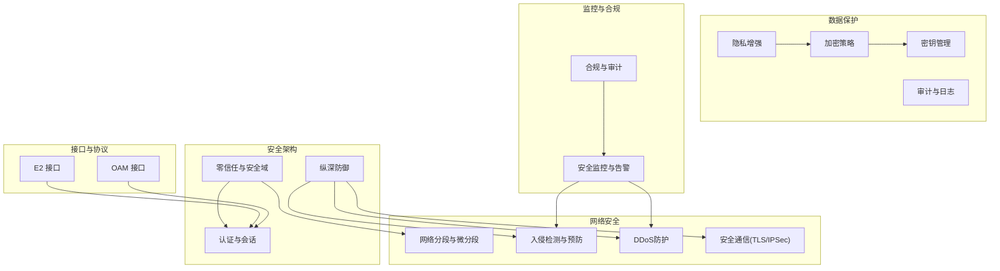
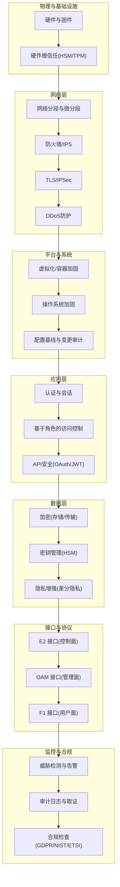
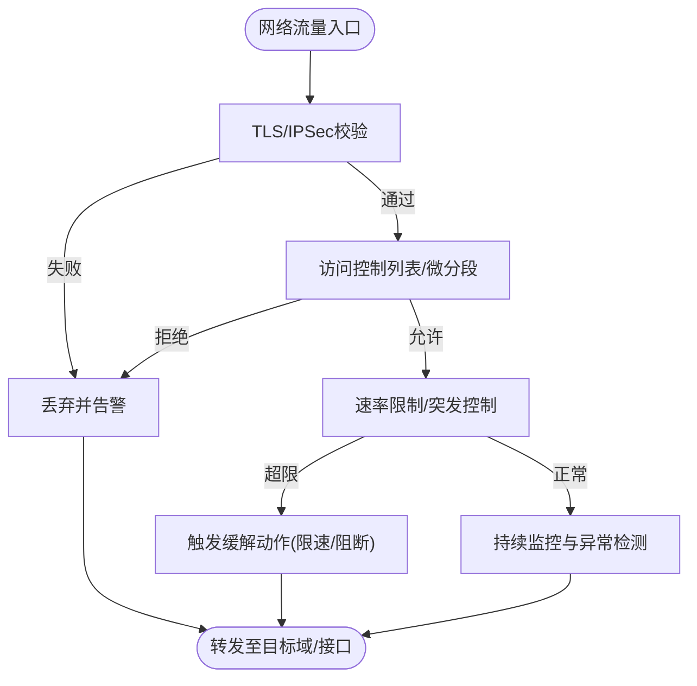
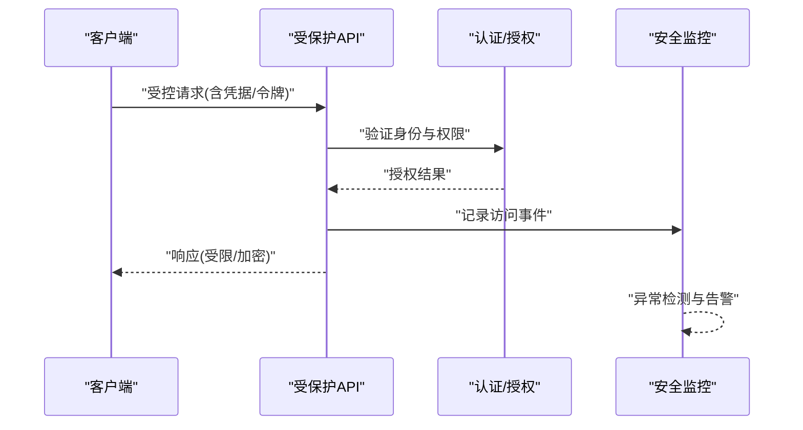
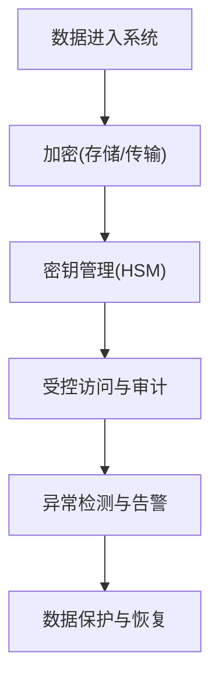
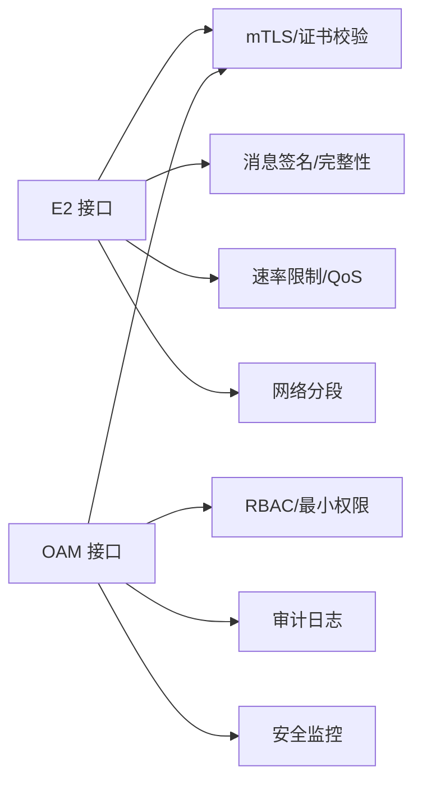
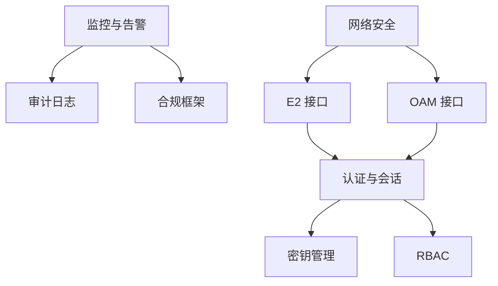
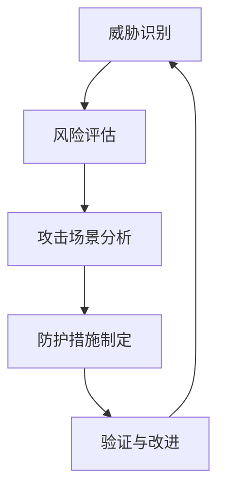

# 威胁分析

<cite>
**本文引用的文件**
- [网络安全部署框架.md](file://12-security-privacy/network-security/network-security-framework.md)
- [数据保护框架.md](file://12-security-privacy/data-protection/data-protection-framework.md)
- [认证框架.md](file://12-security-privacy/authentication/authentication-framework.md)
- [安全参考架构.md](file://12-security-privacy/security-architecture/security-reference-architecture.md)
- [安全监控与告警框架.md](file://12-security-privacy/monitoring-alerting/security-monitoring-framework.md)
- [E2 接口.md](file://03-interface-standards/e2-interface.md)
- [OAM 接口.md](file://03-interface-standards/oam-interface.md)
- [合规与审计框架.md](file://12-security-privacy/compliance-auditing/compliance-auditing-framework.md)
</cite>

## 目录
1. [引言](#引言)
2. [项目结构](#项目结构)
3. [核心组件](#核心组件)
4. [架构总览](#架构总览)
5. [详细组件分析](#详细组件分析)
6. [依赖分析](#依赖分析)
7. [性能考虑](#性能考虑)
8. [故障排查指南](#故障排查指南)
9. [结论](#结论)
10. [附录](#附录)

## 引言
本文件面向O-RAN网络的威胁分析与防护，聚焦网络层与应用层威胁、数据安全威胁，并结合O-RAN关键接口（E2、A1、F1等）与整体架构，给出威胁建模方法论与落地建议。内容来源于仓库内现有安全与接口标准文档，旨在帮助读者系统理解O-RAN在真实部署中的安全风险与应对策略。

## 项目结构
围绕威胁分析与防护，仓库中与本主题密切相关的知识域主要分布在以下模块：
- 安全架构与零信任：提供安全域划分、零信任原则与分层防御策略
- 网络安全框架：涵盖网络分段、DDoS防护、入侵检测与安全通信
- 数据保护框架：涵盖加密、密钥管理、隐私增强与合规
- 认证与会话：多因子认证、证书管理、会话与令牌治理
- 接口标准：E2、OAM等接口的功能、协议与安全部署要点
- 监控与告警：威胁检测、合规监控与自动化响应
- 合规与审计：GDPR、ETSI、NIST等合规要求与审计证据收集

**图表来源**
- [安全参考架构.md](file://12-security-privacy/security-architecture/security-reference-architecture.md#L8-L36)
- [网络安全部署框架.md](file://12-security-privacy/network-security/network-security-framework.md#L6-L40)
- [数据保护框架.md](file://12-security-privacy/data-protection/data-protection-framework.md#L6-L28)
- [认证框架.md](file://12-security-privacy/authentication/authentication-framework.md#L6-L23)
- [E2 接口.md](file://03-interface-standards/e2-interface.md#L105-L109)
- [OAM 接口.md](file://03-interface-standards/oam-interface.md#L117-L121)
- [安全监控与告警框架.md](file://12-security-privacy/monitoring-alerting/security-monitoring-framework.md#L6-L31)
- [合规与审计框架.md](file://12-security-privacy/compliance-auditing/compliance-auditing-framework.md#L6-L41)

**章节来源**
- [安全参考架构.md](file://12-security-privacy/security-architecture/security-reference-architecture.md#L8-L71)
- [网络安全部署框架.md](file://12-security-privacy/network-security/network-security-framework.md#L6-L40)

## 核心组件
- 零信任与安全域：明确管理域、控制面域、用户面域与基础设施域的安全边界与访问控制要求
- 网络分段与微分段：通过命名空间、VLAN与策略路由实现域间隔离
- 入侵检测与DDoS防护：基于签名与行为的检测、速率限制与流量整形
- 加密与密钥管理：数据在途与在存储加密、HSM集成与派生密钥策略
- 认证与会话：多因子认证、mTLS、OAuth/JWT与会话令牌治理
- 接口安全：E2/OAM等接口的加密、认证与QoS保障
- 监控与合规：威胁检测、合规检查与自动化响应

**章节来源**
- [网络安全部署框架.md](file://12-security-privacy/network-security/network-security-framework.md#L6-L40)
- [数据保护框架.md](file://12-security-privacy/data-protection/data-protection-framework.md#L6-L28)
- [认证框架.md](file://12-security-privacy/authentication/authentication-framework.md#L6-L23)
- [E2 接口.md](file://03-interface-standards/e2-interface.md#L105-L109)
- [OAM 接口.md](file://03-interface-standards/oam-interface.md#L117-L121)
- [安全监控与告警框架.md](file://12-security-privacy/monitoring-alerting/security-monitoring-framework.md#L6-L31)

## 架构总览
下图展示O-RAN威胁分析与防护的整体架构映射，强调零信任、分层防御与关键接口安全：

**图表来源**
- [安全参考架构.md](file://12-security-privacy/security-architecture/security-reference-architecture.md#L8-L71)
- [网络安全部署框架.md](file://12-security-privacy/network-security/network-security-framework.md#L6-L40)
- [数据保护框架.md](file://12-security-privacy/data-protection/data-protection-framework.md#L6-L28)
- [认证框架.md](file://12-security-privacy/authentication/authentication-framework.md#L6-L23)
- [E2 接口.md](file://03-interface-standards/e2-interface.md#L105-L109)
- [OAM 接口.md](file://03-interface-standards/oam-interface.md#L117-L121)
- [安全监控与告警框架.md](file://12-security-privacy/monitoring-alerting/security-monitoring-framework.md#L6-L31)
- [合规与审计框架.md](file://12-security-privacy/compliance-auditing/compliance-auditing-framework.md#L6-L41)

## 详细组件分析

### 网络层威胁与防护
- 拒绝服务攻击(DoS/DDoS)
  - 防护要点：全局/源限速、突发容忍、连接限制、NFTables/iptables规则、流量整形与带宽上限
  - 关键接口：E2/A1/F1/OAM等接口的速率限制与队列策略
- 中间人攻击(MITM)
  - 防护要点：端到端加密(TLS 1.3/IPSec)、证书校验(OCSP/CRL)、mTLS双向认证
- 网络嗅探
  - 防护要点：加密传输、网络分段、VLAN隔离、最小权限访问
- 路由攻击
  - 防护要点：域间路由控制、默认策略拒绝、源地址验证、微分段

**图表来源**
- [网络安全部署框架.md](file://12-security-privacy/network-security/network-security-framework.md#L261-L309)
- [网络安全部署框架.md](file://12-security-privacy/network-security/network-security-framework.md#L311-L426)
- [E2 接口.md](file://03-interface-standards/e2-interface.md#L105-L109)
- [OAM 接口.md](file://03-interface-standards/oam-interface.md#L117-L121)

**章节来源**
- [网络安全部署框架.md](file://12-security-privacy/network-security/network-security-framework.md#L261-L309)
- [网络安全部署框架.md](file://12-security-privacy/network-security/network-security-framework.md#L311-L426)
- [E2 接口.md](file://03-interface-standards/e2-interface.md#L105-L109)
- [OAM 接口.md](file://03-interface-standards/oam-interface.md#L117-L121)

### 应用层威胁与防护
- 接口滥用
  - 防护要点：速率限制、请求验证、最小权限、API安全(OAuth/JWT)
- 权限提升
  - 防护要点：RBAC、最小权限、会话令牌治理、审计日志
- 恶意软件
  - 防护要点：容器/镜像安全、主机入侵检测、基线合规
- 配置攻击
  - 防护要点：配置基线、变更审计、自动化合规检查

**图表来源**
- [认证框架.md](file://12-security-privacy/authentication/authentication-framework.md#L126-L185)
- [安全监控与告警框架.md](file://12-security-privacy/monitoring-alerting/security-monitoring-framework.md#L119-L217)

**章节来源**
- [认证框架.md](file://12-security-privacy/authentication/authentication-framework.md#L126-L185)
- [安全监控与告警框架.md](file://12-security-privacy/monitoring-alerting/security-monitoring-framework.md#L119-L217)

### 数据安全威胁与防护
- 数据泄露
  - 防护要点：端到端加密、密钥轮换、访问审计
- 数据篡改
  - 防护要点：完整性保护、哈希校验、只读基线
- 数据丢失
  - 防护要点：备份策略、灾备演练、密钥保护
- 隐私侵犯
  - 防护要点：差分隐私、数据最小化、匿名化

**图表来源**
- [数据保护框架.md](file://12-security-privacy/data-protection/data-protection-framework.md#L8-L28)
- [数据保护框架.md](file://12-security-privacy/data-protection/data-protection-framework.md#L98-L144)
- [数据保护框架.md](file://12-security-privacy/data-protection/data-protection-framework.md#L186-L249)

**章节来源**
- [数据保护框架.md](file://12-security-privacy/data-protection/data-protection-framework.md#L8-L28)
- [数据保护框架.md](file://12-security-privacy/data-protection/data-protection-framework.md#L98-L144)
- [数据保护框架.md](file://12-security-privacy/data-protection/data-protection-framework.md#L186-L249)

### O-RAN接口特定威胁与防护
- E2 接口
  - 威胁：控制面消息被截获/篡改、未授权服务调用、订阅滥用
  - 防护：mTLS、消息完整性、速率限制、域隔离、QoS保障
- OAM 接口
  - 威胁：管理通道被攻破、配置被篡改、越权操作
  - 防护：加密传输、强认证、RBAC、审计日志、批量操作与异步处理

**图表来源**
- [E2 接口.md](file://03-interface-standards/e2-interface.md#L105-L109)
- [认证框架.md](file://12-security-privacy/authentication/authentication-framework.md#L100-L124)
- [安全监控与告警框架.md](file://12-security-privacy/monitoring-alerting/security-monitoring-framework.md#L119-L217)

**章节来源**
- [E2 接口.md](file://03-interface-standards/e2-interface.md#L105-L109)
- [认证框架.md](file://12-security-privacy/authentication/authentication-framework.md#L100-L124)
- [安全监控与告警框架.md](file://12-security-privacy/monitoring-alerting/security-monitoring-framework.md#L119-L217)

## 依赖分析
- 组件耦合
  - 认证与授权依赖证书与密钥管理；监控与告警依赖日志与合规框架
  - 接口安全依赖网络分段与TLS/IPSec；应用安全依赖RBAC与API安全
- 外部依赖
  - 合规框架依赖GDPR、ETSI、NIST等标准；审计框架依赖证据收集与报告生成

**图表来源**
- [认证框架.md](file://12-security-privacy/authentication/authentication-framework.md#L126-L185)
- [安全监控与告警框架.md](file://12-security-privacy/monitoring-alerting/security-monitoring-framework.md#L442-L516)
- [E2 接口.md](file://03-interface-standards/e2-interface.md#L105-L109)
- [OAM 接口.md](file://03-interface-standards/oam-interface.md#L117-L121)

**章节来源**
- [认证框架.md](file://12-security-privacy/authentication/authentication-framework.md#L126-L185)
- [安全监控与告警框架.md](file://12-security-privacy/monitoring-alerting/security-monitoring-framework.md#L442-L516)
- [E2 接口.md](file://03-interface-standards/e2-interface.md#L105-L109)
- [OAM 接口.md](file://03-interface-standards/oam-interface.md#L117-L121)

## 性能考虑
- 传输层优化：SCTP参数、多流、多路径；E2接口延迟与吞吐优化
- 应用层优化：批量处理、缓存、异步处理；API安全与限流的平衡
- 网络优化：QoS优先级、负载均衡、微分段；避免成为性能瓶颈

**章节来源**
- [E2 接口.md](file://03-interface-standards/e2-interface.md#L131-L146)
- [OAM 接口.md](file://03-interface-standards/oam-interface.md#L143-L158)

## 故障排查指南
- 常见问题
  - 连接故障：检查证书、mTLS握手、网络连通性
  - 操作/管理故障：核对RBAC、审计日志、配置同步
  - 性能故障：核查QoS、速率限制、异常流量
- 排查步骤
  - 告警分析 → 日志分析 → 信令/网络诊断 → 测试验证
  - 自动化恢复与升级修复

**章节来源**
- [E2 接口.md](file://03-interface-standards/e2-interface.md#L170-L188)
- [OAM 接口.md](file://03-interface-standards/oam-interface.md#L186-L204)

## 结论
通过对O-RAN安全架构、网络安全、数据保护、认证与接口安全的系统梳理，可以形成覆盖网络层与应用层的威胁画像与防护闭环。结合零信任与纵深防御，强化接口加密与认证、完善监控与合规，是O-RAN在开放与云化趋势下实现稳健安全运营的关键。

## 附录

### 威胁建模方法论（识别-评估-场景-防护）
- 威胁识别：基于接口与协议特性，识别DoS/DDoS、MITM、嗅探、路由攻击、接口滥用、权限提升、恶意软件、配置攻击、数据泄露/篡改/丢失/隐私侵犯
- 风险评估：影响度与发生概率矩阵，结合资产价值与合规要求
- 攻击场景分析：以E2/OAM/F1等接口为切入点，构建典型攻击路径与缓解策略
- 防护措施制定：以零信任为原则，结合网络分段、mTLS、RBAC、加密与密钥管理、监控与告警、合规审计

[本图为概念流程，无需图表来源]

### 合规与审计要点
- GDPR：数据最小化、加密、DPIA、72小时通报、数据主体权利
- ETSI/3GPP：安全架构、密钥管理、接口安全要求
- 内部审计：证据包生成、合规仪表盘、持续监测与改进

**章节来源**
- [合规与审计框架.md](file://12-security-privacy/compliance-auditing/compliance-auditing-framework.md#L6-L41)
- [合规与审计框架.md](file://12-security-privacy/compliance-auditing/compliance-auditing-framework.md#L114-L196)
- [合规与审计框架.md](file://12-security-privacy/compliance-auditing/compliance-auditing-framework.md#L432-L484)