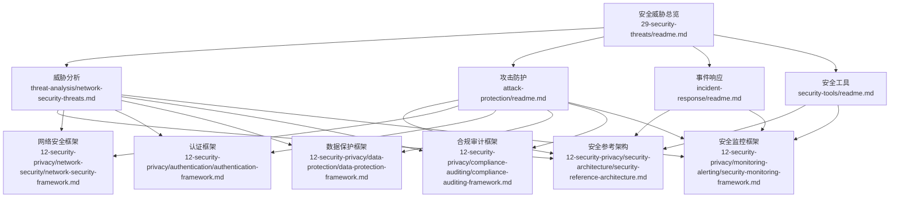
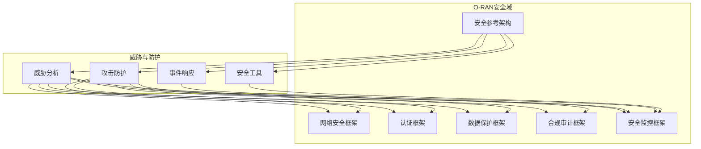
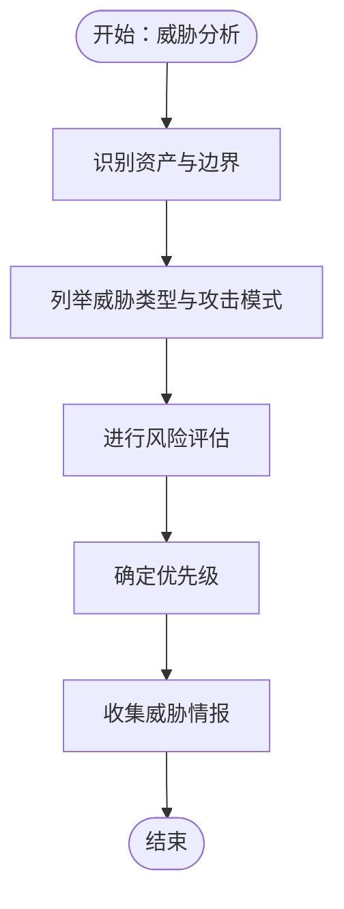
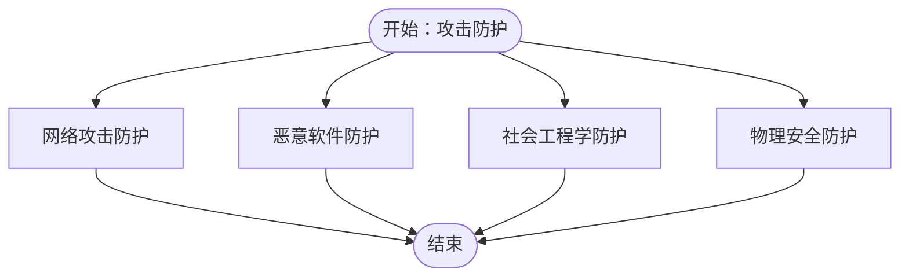
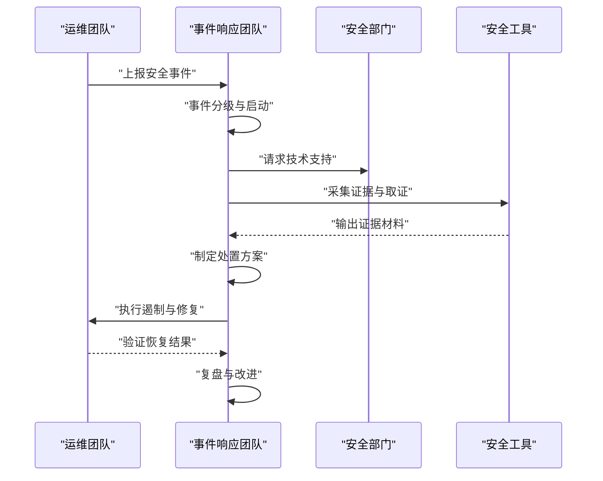
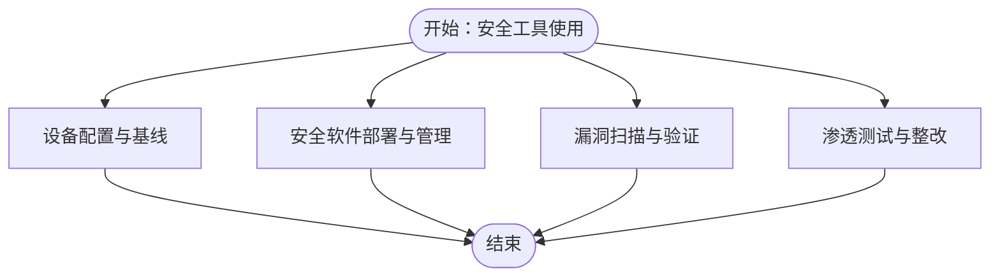
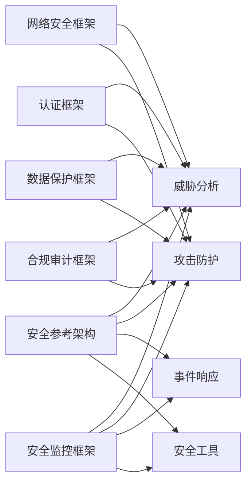
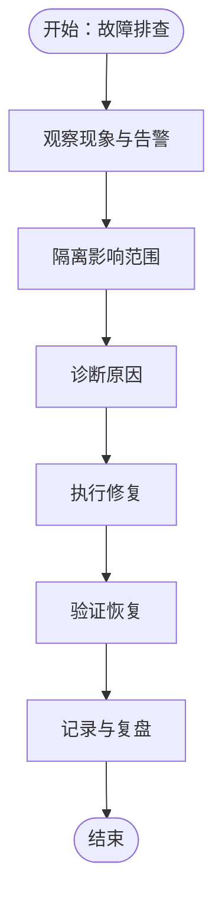

# 安全威胁

<cite>
**本文引用的文件**
- [安全威胁总览（英文）](file://29-security-threats/readme.md)
- [安全威胁总览（中文）](file://29-security-threats/readme-zh.md)
- [网络威胁分析（英文）](file://29-security-threats/threat-analysis/network-security-threats.md)
- [网络威胁分析（中文）](file://29-security-threats/threat-analysis/network-security-threats-zh.md)
- [攻击防护（英文）](file://29-security-threats/attack-protection/readme.md)
- [攻击防护（中文）](file://29-security-threats/attack-protection/readme-zh.md)
- [事件响应（英文）](file://29-security-threats/incident-response/readme.md)
- [事件响应（中文）](file://29-security-threats/incident-response/readme-zh.md)
- [安全工具（英文）](file://29-security-threats/security-tools/readme.md)
- [安全工具（中文）](file://29-security-threats/security-tools/readme-zh.md)
- [安全参考架构（英文）](file://12-security-privacy/security-architecture/security-reference-architecture.md)
- [安全参考架构（中文）](file://12-security-privacy/security-architecture/security-reference-architecture-zh.md)
- [网络安全框架（英文）](file://12-security-privacy/network-security/network-security-framework.md)
- [网络安全框架（中文）](file://12-security-privacy/network-security/network-security-framework-zh.md)
- [认证框架（英文）](file://12-security-privacy/authentication/authentication-framework.md)
- [认证框架（中文）](file://12-security-privacy/authentication/authentication-framework-zh.md)
- [数据保护框架（英文）](file://12-security-privacy/data-protection/data-protection-framework.md)
- [数据保护框架（中文）](file://12-security-privacy/data-protection/data-protection-framework-zh.md)
- [合规审计框架（英文）](file://12-security-privacy/compliance-auditing/compliance-auditing-framework.md)
- [合规审计框架（中文）](file://12-security-privacy/compliance-auditing/compliance-auditing-framework-zh.md)
- [安全监控框架（英文）](file://12-security-privacy/monitoring-alerting/security-monitoring-framework.md)
- [安全监控框架（中文）](file://12-security-privacy/monitoring-alerting/security-monitoring-framework-zh.md)
- [云原生架构（英文）](file://05-cloud-integration/cloud-native-architecture.md)
- [容器编排（英文）](file://05-cloud-integration/container-orchestration.md)
- [微服务架构（英文）](file://05-cloud-integration/microservices-architecture.md)
- [自动化部署（英文）](file://05-cloud-integration/automated-deployment.md)
- [监控集成（英文）](file://05-cloud-integration/monitoring-integration.md)
- [故障处理指南（中文）](file://14-operations-management/fault-handling/fault-troubleshooting-guide-zh.md)
- [日常运维流程（中文）](file://14-operations-management/daily-operations/daily-operation-procedures-zh.md)
- [性能优化框架（中文）](file://14-operations-management/performance-optimization/performance-optimization-framework-zh.md)
- [测试自动化框架（英文）](file://13-testing-validation/automation-framework/test-automation-framework.md)
- [互操作性测试（中文）](file://13-testing-validation/interoperability/interoperability-testing-zh.md)
- [性能测试（中文）](file://13-testing-validation/performance-testing/performance-testing-zh.md)
- [测试工具框架（中文）](file://13-testing-validation/testing-tools/testing-tools-frameworks-zh.md)
- [O-RAN一致性测试（中文）](file://13-testing-validation/conformance-testing/o-ran-conformance-testing.md)
- [O-RAN一致性测试（中文）](file://13-testing-validation/conformance-testing/o-ran-conformance-testing-zh.md)
- [O-RAN开发工具包（中文）](file://22-tool-platforms/development-tools/o-ran-development-toolkit-zh.md)
- [O-RAN管理平台（中文）](file://22-tool-platforms/management-platforms/o-ran-management-platforms-zh.md)
- [O-RAN监控系统（中文）](file://22-tool-platforms/monitoring-systems/o-ran-monitoring-systems-zh.md)
- [O-RAN实用程序（中文）](file://22-tool-platforms/utility-programs/o-ran-utility-programs-zh.md)
- [O-RAN学习路径（中文）](file://19-talent-development/learning-paths/o-ran-learning-roadmaps-zh.md)
- [O-RAN培训框架（中文）](file://19-talent-development/training-programs/o-ran-training-framework-zh.md)
- [O-RAN认证项目（中文）](file://19-talent-development/certification-system/oran-certification-program.md)
- [O-RAN最佳实践案例（中文）](file://21-case-studies/best-practices/o-ran-best-practice-cases-zh.md)
- [O-RAN创新案例（中文）](file://21-case-studies/innovation-cases/o-ran-innovation-cases-zh.md)
- [O-RAN行业应用案例（中文）](file://21-case-studies/industry-applications/vertical-industry-o-ran-cases-zh.md)
- [O-RAN部署案例（中文）](file://21-case-studies/operator-cases/carrier-o-ran-deployment-cases-zh.md)
- [O-RAN生态系统战略（中文）](file://20-ecosystem-partnership/ecosystem-strategy/o-ran-ecosystem-strategy-zh.md)
- [O-RAN业务模型（中文）](file://20-ecosystem-partnership/business-models/o-ran-business-models-zh.md)
- [O-RAN合作伙伴分类（中文）](file://20-ecosystem-partnership/partner-types/o-ran-partner-classification-zh.md)
- [O-RAN国际运营框架（中文）](file://23-international-deployment/international-operations-framework-zh.md)
- [O-RAN本地化策略（中文）](file://23-international-deployment/localization-adaptation/o-ran-localization-strategies-zh.md)
- [O-RAN区域部署策略（中文）](file://23-international-deployment/regional-strategies/o-ran-regional-deployment-strategies-zh.md)
- [O-RAN跨文化管理（中文）](file://23-international-deployment/cross-cultural-management/o-ran-cross-cultural-management-zh.md)
- [O-RAN可持续发展（中文）](file://24-sustainable-development/readme-zh.md)
- [O-RAN合规体系（中文）](file://25-legal-regulations/compliance-system/readme-zh.md)
- [O-RAN国际法律（中文）](file://25-legal-regulations/international-laws/readme-zh.md)
- [O-RAN区域要求（中文）](file://25-legal-regulations/regional-requirements/readme-zh.md)
- [O-RAN实施指南（中文）](file://25-legal-regulations/implementation-guides/readme-zh.md)
- [O-RAN网络性能调优（中文）](file://26-performance-optimization/network-optimization/network-performance-tuning.md)
- [O-RAN容量规划框架（中文）](file://14-operations-management/capacity-planning/capacity-planning-framework-zh.md)
- [O-RAN架构演进（英文）](file://01-architecture-system/architecture-evolution.md)
- [O-RAN分层架构（英文）](file://01-architecture-system/layered-architecture.md)
- [O-RAN功能分布（英文）](file://01-architecture-system/functional-distribution.md)
- [O-RAN弹性伸缩（英文）](file://01-architecture-system/elastic-scaling.md)
- [O-RAN O-Cloud架构（英文）](file://01-architecture-system/o-cloud-architecture.md)
- [O-RAN核心组件：O-CU（英文）](file://02-core-components/o-cu.md)
- [O-RAN核心组件：O-CUCP/CU-UP（英文）](file://02-core-components/o-cucp-cuup.md)
- [O-RAN核心组件：O-DU（英文）](file://02-core-components/o-du.md)
- [O-RAN核心组件：O-RIC（英文）](file://02-core-components/o-ric.md)
- [O-RAN核心组件：O-RU（英文）](file://02-core-components/o-ru.md)
- [O-RAN核心组件：SMO（英文）](file://02-core-components/smo.md)
- [O-RAN接口标准：A1（英文）](file://03-interface-standards/a1-interface.md)
- [O-RAN接口标准：E2（英文）](file://03-interface-standards/e2-interface.md)
- [O-RAN接口标准：F1（英文）](file://03-interface-standards/f1-interface.md)
- [O-RAN接口标准：O-FH（英文）](file://03-interface-standards/o-fh-interface.md)
- [O-RAN接口标准：O1/O2/OAM（英文）](file://03-interface-standards/o1-interface.md)
- [O-RAN接口标准：O1/O2/OAM（中文）](file://03-interface-standards/oam-interface.md)
- [O-RAN拆分选项：成本效益分析（英文）](file://04-disaggregation-options/cost-benefit-analysis.md)
- [O-RAN拆分选项：部署场景（英文）](file://04-disaggregation-options/deployment-scenarios.md)
- [O-RAN拆分选项：前传分割（英文）](file://04-disaggregation-options/fronthaul-splits.md)
- [O-RAN拆分选项：功能分割（英文）](file://04-disaggregation-options/functional-splits.md)
- [O-RAN拆分选项：性能影响（英文）](file://04-disaggregation-options/performance-impact.md)
- [O-RAN架构演进（中文）](file://01-architecture-system/readme-zh.md)
- [O-RAN分层架构（中文）](file://01-architecture-system/readme.md)
- [O-RAN核心组件：O-CU（中文）](file://02-core-components/readme-zh.md)
- [O-RAN核心组件：O-DU（中文）](file://02-core-components/readme.md)
- [O-RAN接口标准：A1（中文）](file://03-interface-standards/readme-zh.md)
- [O-RAN接口标准：E2（中文）](file://03-interface-standards/readme.md)
- [O-RAN拆分选项：成本效益分析（中文）](file://04-disaggregation-options/readme-zh.md)
- [O-RAN拆分选项：部署场景（中文）](file://04-disaggregation-options/readme.md)
- [O-RAN云原生架构（中文）](file://05-cloud-integration/readme-zh.md)
- [O-RAN工作小组（中文）](file://06-working-groups/wg-overview.md)
- [O-RAN工作小组职责（中文）](file://06-working-groups/wg-detailed-responsibilities.md)
- [O-RANRIC开发（中文）](file://07-ric-development/readme.md)
- [O-RAN部署实施（中文）](file://08-deployment-implementation/readme-zh.md)
- [O-RAN标准合规（中文）](file://09-standards-compliance/readme-zh.md)
- [O-RAN应用场景（中文）](file://10-application-scenarios/readme-zh.md)
- [O-RAN学术论文：架构（中文）](file://11-academic-papers/architecture/readme-zh.md)
- [O-RAN学术论文：应用（中文）](file://11-academic-papers/applications/readme.md)
- [O-RAN学术论文：接口（中文）](file://11-academic-papers/interfaces/readme-zh.md)
- [O-RAN学术论文：RAN智能（中文）](file://11-academic-papers/ric-ai/readme.md)
- [O-RAN学术论文：标准（中文）](file://11-academic-papers/standards/readme-zh.md)
- [O-RAN学术论文：调查（中文）](file://11-academic-papers/surveys/readme.md)
- [O-RAN初学者：架构（中文）](file://12-oran-for-dummies/architecture/simple-architecture.md)
- [O-RAN初学者：概念（中文）](file://12-oran-for-dummies/concepts/basic-concepts.md)
- [O-RAN初学者：示例（中文）](file://12-oran-for-dummies/examples/real-world-examples.md)
- [O-RAN初学者：常见问题（中文）](file://12-oran-for-dummies/faq/common-questions.md)
- [O-RAN初学者：入门（中文）](file://12-oran-for-dummies/getting-started/first-steps.md)
- [O-RAN初学者：术语表（中文）](file://12-oran-for-dummies/glossary/simple-glossary.md)
- [O-RAN初学者：总览（中文）](file://12-oran-for-dummies/readme-zh.md)
- [O-RAN资源（中文）](file://resources/readme-zh.md)
- [O-RAN综合术语表（中文）](file://comprehensive-oran-glossary.md)
- [O-RAN专利清单（中文）](file://comprehensive-oran-patent-table.md)
</cite>

## 目录
1. [引言](#引言)
2. [项目结构](#项目结构)
3. [核心组件](#核心组件)
4. [架构总览](#架构总览)
5. [详细组件分析](#详细组件分析)
6. [依赖分析](#依赖分析)
7. [性能考虑](#性能考虑)
8. [故障排查指南](#故障排查指南)
9. [结论](#结论)
10. [附录](#附录)

## 引言
本文件围绕O-RAN系统的安全威胁与防护，结合仓库中“安全威胁”主题域的权威资料，系统梳理威胁识别、攻击模式、风险评估、威胁情报收集、攻击防护、事件响应、安全工具与方法论，并给出可操作的实施建议与最佳实践。内容既覆盖技术细节，也兼顾组织层面的流程与能力建设，帮助读者构建面向O-RAN的纵深防御体系。

## 项目结构
“安全威胁”主题域包含四个子域：威胁分析、攻击防护、事件响应、安全工具；同时与“安全参考架构”“网络安全框架”“认证与数据保护”“合规审计”“安全监控”等主题形成协同关系。下图展示与安全威胁相关的主要文件与模块之间的关系。

图表来源
- [安全威胁总览（英文）](file://29-security-threats/readme.md#L1-L200)
- [网络威胁分析（英文）](file://29-security-threats/threat-analysis/network-security-threats.md#L1-L200)
- [攻击防护（英文）](file://29-security-threats/attack-protection/readme.md#L1-L200)
- [事件响应（英文）](file://29-security-threats/incident-response/readme.md#L1-L200)
- [安全工具（英文）](file://29-security-threats/security-tools/readme.md#L1-L200)
- [安全参考架构（英文）](file://12-security-privacy/security-architecture/security-reference-architecture.md#L1-L200)
- [网络安全框架（英文）](file://12-security-privacy/network-security/network-security-framework.md#L1-L200)
- [认证框架（英文）](file://12-security-privacy/authentication/authentication-framework.md#L1-L200)
- [数据保护框架（英文）](file://12-security-privacy/data-protection/data-protection-framework.md#L1-L200)
- [合规审计框架（英文）](file://12-security-privacy/compliance-auditing/compliance-auditing-framework.md#L1-L200)
- [安全监控框架（英文）](file://12-security-privacy/monitoring-alerting/security-monitoring-framework.md#L1-L200)

章节来源
- [安全威胁总览（英文）](file://29-security-threats/readme.md#L1-L200)
- [安全威胁总览（中文）](file://29-security-threats/readme-zh.md#L1-L200)

## 核心组件
- 威胁分析：识别O-RAN关键资产与边界，梳理典型威胁类型、攻击路径与影响面，支撑风险评估与防护设计。
- 攻击防护：从网络、恶意软件、社会工程、物理安全等维度制定防护策略与控制措施。
- 事件响应：建立应急响应计划、组织响应团队、规范处置流程与恢复程序。
- 安全工具：覆盖安全设备配置、安全软件部署、漏洞扫描与渗透测试等工具与流程。

章节来源
- [网络威胁分析（英文）](file://29-security-threats/threat-analysis/network-security-threats.md#L1-L200)
- [网络威胁分析（中文）](file://29-security-threats/threat-analysis/network-security-threats-zh.md#L1-L200)
- [攻击防护（英文）](file://29-security-threats/attack-protection/readme.md#L1-L200)
- [攻击防护（中文）](file://29-security-threats/attack-protection/readme-zh.md#L1-L200)
- [事件响应（英文）](file://29-security-threats/incident-response/readme.md#L1-L200)
- [事件响应（中文）](file://29-security-threats/incident-response/readme-zh.md#L1-L200)
- [安全工具（英文）](file://29-security-threats/security-tools/readme.md#L1-L200)
- [安全工具（中文）](file://29-security-threats/security-tools/readme-zh.md#L1-L200)

## 架构总览
下图展示O-RAN安全威胁防护在整体架构中的位置与协同关系，强调安全参考架构对威胁分析、防护与响应的指导作用。

图表来源
- [安全参考架构（英文）](file://12-security-privacy/security-architecture/security-reference-architecture.md#L1-L200)
- [网络安全框架（英文）](file://12-security-privacy/network-security/network-security-framework.md#L1-L200)
- [认证框架（英文）](file://12-security-privacy/authentication/authentication-framework.md#L1-L200)
- [数据保护框架（英文）](file://12-security-privacy/data-protection/data-protection-framework.md#L1-L200)
- [合规审计框架（英文）](file://12-security-privacy/compliance-auditing/compliance-auditing-framework.md#L1-L200)
- [安全监控框架（英文）](file://12-security-privacy/monitoring-alerting/security-monitoring-framework.md#L1-L200)
- [网络威胁分析（英文）](file://29-security-threats/threat-analysis/network-security-threats.md#L1-L200)
- [攻击防护（英文）](file://29-security-threats/attack-protection/readme.md#L1-L200)
- [事件响应（英文）](file://29-security-threats/incident-response/readme.md#L1-L200)
- [安全工具（英文）](file://29-security-threats/security-tools/readme.md#L1-L200)

## 详细组件分析

### 威胁分析
- 资产与边界识别：明确O-RAN各功能实体（如O-CU、O-DU、O-RU、O-RIC、SMO）及其接口（A1/E2/F1/O1/O2/OAM/O-FH）作为关键资产，识别内外部边界与信任域。
- 威胁类型与攻击模式：基于接口与组件特性，归纳可能的中间人攻击、拒绝服务、凭证泄露、供应链污染、侧信道与物理破坏等威胁。
- 风险评估：结合威胁发生概率与影响程度，量化风险并确定优先级。
- 威胁情报收集：建立情报渠道与共享机制，持续更新威胁特征与攻击趋势。

图表来源
- [网络威胁分析（英文）](file://29-security-threats/threat-analysis/network-security-threats.md#L1-L200)
- [网络威胁分析（中文）](file://29-security-threats/threat-analysis/network-security-threats-zh.md#L1-L200)

章节来源
- [网络威胁分析（英文）](file://29-security-threats/threat-analysis/network-security-threats.md#L1-L200)
- [网络威胁分析（中文）](file://29-security-threats/threat-analysis/network-security-threats-zh.md#L1-L200)

### 攻击防护
- 网络攻击防护：强化边界与内部网络隔离，采用加密通信、最小权限访问、入侵检测与阻断、DDoS缓解等手段。
- 恶意软件防护：部署终端防护、沙箱与启发式检测、白名单策略、补丁与基线管理。
- 社会工程学防护：开展安全意识培训、模拟演练、邮件安全网关、访问控制与审批流程。
- 物理安全防护：门禁与监控、设备加封与巡检、环境与电源冗余、离线备份与介质管控。

图表来源
- [攻击防护（英文）](file://29-security-threats/attack-protection/readme.md#L1-L200)
- [攻击防护（中文）](file://29-security-threats/attack-protection/readme-zh.md#L1-L200)

章节来源
- [攻击防护（英文）](file://29-security-threats/attack-protection/readme.md#L1-L200)
- [攻击防护（中文）](file://29-security-threats/attack-protection/readme-zh.md#L1-L200)

### 事件响应
- 应急响应计划：明确事件分级、报告路径、处置时限、资源协调与沟通机制。
- 响应团队组建：划分事件响应角色（指挥、取证、遏制、修复、沟通），明确职责与联系方式。
- 处置流程：建立标准化流程（发现、确认、评估、遏制、根除、恢复、复盘）。
- 恢复程序：验证系统完整性、恢复业务连续性、更新基线与预案。

图表来源
- [事件响应（英文）](file://29-security-threats/incident-response/readme.md#L1-L200)
- [事件响应（中文）](file://29-security-threats/incident-response/readme-zh.md#L1-L200)
- [安全监控框架（英文）](file://12-security-privacy/monitoring-alerting/security-monitoring-framework.md#L1-L200)

章节来源
- [事件响应（英文）](file://29-security-threats/incident-response/readme.md#L1-L200)
- [事件响应（中文）](file://29-security-threats/incident-response/readme-zh.md#L1-L200)

### 安全工具
- 安全设备配置：统一设备基线、启用日志与告警、定期巡检与变更审批。
- 安全软件部署：集中管理、自动分发、版本控制、补丁策略。
- 漏洞扫描：周期性扫描、差异扫描、结果验证与修复跟踪。
- 渗透测试：制定范围与目标、获取授权、执行测试、出具报告与整改闭环。

图表来源
- [安全工具（英文）](file://29-security-threats/security-tools/readme.md#L1-L200)
- [安全工具（中文）](file://29-security-threats/security-tools/readme-zh.md#L1-L200)

章节来源
- [安全工具（英文）](file://29-security-threats/security-tools/readme.md#L1-L200)
- [安全工具（中文）](file://29-security-threats/security-tools/readme-zh.md#L1-L200)

### 方法与工具：威胁建模、风险评估、安全审计与合规
- 威胁建模：以STRIDE、Attack Tree或威胁图为基础，结合O-RAN接口与组件特性，识别潜在威胁与薄弱环节。
- 风险评估：采用定性/定量方法，评估威胁概率与影响，确定风险等级与处置优先级。
- 安全审计：定期开展系统性检查，覆盖配置、访问、日志、变更与合规性。
- 合规检查：对照国际与地区法规、标准与组织内控要求，形成检查清单与整改闭环。

章节来源
- [网络安全框架（英文）](file://12-security-privacy/network-security/network-security-framework.md#L1-L200)
- [网络安全框架（中文）](file://12-security-privacy/network-security/network-security-framework-zh.md#L1-L200)
- [认证框架（英文）](file://12-security-privacy/authentication/authentication-framework.md#L1-L200)
- [认证框架（中文）](file://12-security-privacy/authentication/authentication-framework-zh.md#L1-L200)
- [数据保护框架（英文）](file://12-security-privacy/data-protection/data-protection-framework.md#L1-L200)
- [数据保护框架（中文）](file://12-security-privacy/data-protection/data-protection-framework-zh.md#L1-L200)
- [合规审计框架（英文）](file://12-security-privacy/compliance-auditing/compliance-auditing-framework.md#L1-L200)
- [合规审计框架（中文）](file://12-security-privacy/compliance-auditing/compliance-auditing-framework-zh.md#L1-L200)

## 依赖分析
安全威胁防护与以下主题域存在强耦合关系：
- 安全参考架构：为威胁分析、防护策略与工具选型提供总体指导。
- 网络安全框架：定义网络层面的控制目标与实现方式。
- 认证与数据保护：保障身份可信与数据机密/完整/可用。
- 合规审计：确保满足外部监管与内部治理要求。
- 安全监控：提供事件发现、告警与溯源能力。

图表来源
- [安全参考架构（英文）](file://12-security-privacy/security-architecture/security-reference-architecture.md#L1-L200)
- [网络安全框架（英文）](file://12-security-privacy/network-security/network-security-framework.md#L1-L200)
- [认证框架（英文）](file://12-security-privacy/authentication/authentication-framework.md#L1-L200)
- [数据保护框架（英文）](file://12-security-privacy/data-protection/data-protection-framework.md#L1-L200)
- [合规审计框架（英文）](file://12-security-privacy/compliance-auditing/compliance-auditing-framework.md#L1-L200)
- [安全监控框架（英文）](file://12-security-privacy/monitoring-alerting/security-monitoring-framework.md#L1-L200)
- [网络威胁分析（英文）](file://29-security-threats/threat-analysis/network-security-threats.md#L1-L200)
- [攻击防护（英文）](file://29-security-threats/attack-protection/readme.md#L1-L200)
- [事件响应（英文）](file://29-security-threats/incident-response/readme.md#L1-L200)
- [安全工具（英文）](file://29-security-threats/security-tools/readme.md#L1-L200)

## 性能考虑
- 安全控制与性能平衡：在加密强度、日志量、扫描频率与检测精度之间取得平衡，避免对业务造成不可接受的影响。
- 可观测性与容量规划：结合监控指标与容量规划框架，评估安全工具对系统资源的占用，提前预留扩容能力。
- 自动化与效率：通过自动化工具减少人工干预，提升威胁检测与处置效率，降低延迟与误报。

章节来源
- [性能优化框架（中文）](file://14-operations-management/performance-optimization/performance-optimization-framework-zh.md#L1-L200)
- [容量规划框架（中文）](file://14-operations-management/capacity-planning/capacity-planning-framework-zh.md#L1-L200)
- [网络性能调优（中文）](file://26-performance-optimization/network-optimization/network-performance-tuning.md#L1-L200)

## 故障排查指南
- 日常运维流程：建立标准化的巡检、变更与应急流程，确保问题早发现、早处置。
- 故障处理指南：针对常见网络、软件与硬件问题，提供快速定位与修复步骤。
- 测试与验证：利用测试自动化框架、一致性测试与互操作性测试，验证修复有效性与兼容性。

图表来源
- [日常运维流程（中文）](file://14-operations-management/daily-operations/daily-operation-procedures-zh.md#L1-L200)
- [故障处理指南（中文）](file://14-operations-management/fault-handling/fault-troubleshooting-guide-zh.md#L1-L200)
- [测试自动化框架（英文）](file://13-testing-validation/automation-framework/test-automation-framework.md#L1-L200)
- [O-RAN一致性测试（中文）](file://13-testing-validation/conformance-testing/o-ran-conformance-testing.md#L1-L200)
- [互操作性测试（中文）](file://13-testing-validation/interoperability/interoperability-testing-zh.md#L1-L200)

章节来源
- [日常运维流程（中文）](file://14-operations-management/daily-operations/daily-operation-procedures-zh.md#L1-L200)
- [故障处理指南（中文）](file://14-operations-management/fault-handling/fault-troubleshooting-guide-zh.md#L1-L200)
- [测试自动化框架（英文）](file://13-testing-validation/automation-framework/test-automation-framework.md#L1-L200)
- [O-RAN一致性测试（中文）](file://13-testing-validation/conformance-testing/o-ran-conformance-testing.md#L1-L200)
- [互操作性测试（中文）](file://13-testing-validation/interoperability/interoperability-testing-zh.md#L1-L200)

## 结论
通过对O-RAN安全威胁的系统化分析与防护实践的梳理，可以形成“以威胁分析为起点、以安全架构为蓝图、以工具与流程为手段”的闭环体系。建议组织结合自身环境与合规要求，逐步完善威胁建模、风险评估、防护策略、事件响应与工具链，持续迭代优化，确保在开放与云原生环境下实现安全与效率的动态平衡。

## 附录
- 云原生与安全：在容器化、微服务与自动化部署背景下，强化镜像安全、运行时保护与可观测性。
- 人员与组织：通过培训、认证与最佳实践案例，提升团队安全意识与能力。
- 国际化与合规：遵循国际法律与地区要求，结合组织内控体系，推进合规检查与审计。

章节来源
- [云原生架构（英文）](file://05-cloud-integration/cloud-native-architecture.md#L1-L200)
- [容器编排（英文）](file://05-cloud-integration/container-orchestration.md#L1-L200)
- [微服务架构（英文）](file://05-cloud-integration/microservices-architecture.md#L1-L200)
- [自动化部署（英文）](file://05-cloud-integration/automated-deployment.md#L1-L200)
- [监控集成（英文）](file://05-cloud-integration/monitoring-integration.md#L1-L200)
- [O-RAN学习路径（中文）](file://19-talent-development/learning-paths/o-ran-learning-roadmaps-zh.md#L1-L200)
- [O-RAN培训框架（中文）](file://19-talent-development/training-programs/o-ran-training-framework-zh.md#L1-L200)
- [O-RAN认证项目（中文）](file://19-talent-development/certification-system/oran-certification-program.md#L1-L200)
- [O-RAN最佳实践案例（中文）](file://21-case-studies/best-practices/o-ran-best-practice-cases-zh.md#L1-L200)
- [O-RAN创新案例（中文）](file://21-case-studies/innovation-cases/o-ran-innovation-cases-zh.md#L1-L200)
- [O-RAN行业应用案例（中文）](file://21-case-studies/industry-applications/vertical-industry-o-ran-cases-zh.md#L1-L200)
- [O-RAN部署案例（中文）](file://21-case-studies/operator-cases/carrier-o-ran-deployment-cases-zh.md#L1-L200)
- [O-RAN生态系统战略（中文）](file://20-ecosystem-partnership/ecosystem-strategy/o-ran-ecosystem-strategy-zh.md#L1-L200)
- [O-RAN业务模型（中文）](file://20-ecosystem-partnership/business-models/o-ran-business-models-zh.md#L1-L200)
- [O-RAN合作伙伴分类（中文）](file://20-ecosystem-partnership/partner-types/o-ran-partner-classification-zh.md#L1-L200)
- [O-RAN国际运营框架（中文）](file://23-international-deployment/international-operations-framework-zh.md#L1-L200)
- [O-RAN本地化策略（中文）](file://23-international-deployment/localization-adaptation/o-ran-localization-strategies-zh.md#L1-L200)
- [O-RAN区域部署策略（中文）](file://23-international-deployment/regional-strategies/o-ran-regional-deployment-strategies-zh.md#L1-L200)
- [O-RAN跨文化管理（中文）](file://23-international-deployment/cross-cultural-management/o-ran-cross-cultural-management-zh.md#L1-L200)
- [O-RAN合规体系（中文）](file://25-legal-regulations/compliance-system/readme-zh.md#L1-L200)
- [O-RAN国际法律（中文）](file://25-legal-regulations/international-laws/readme-zh.md#L1-L200)
- [O-RAN区域要求（中文）](file://25-legal-regulations/regional-requirements/readme-zh.md#L1-L200)
- [O-RAN实施指南（中文）](file://25-legal-regulations/implementation-guides/readme-zh.md#L1-L200)
- [O-RAN可持续发展（中文）](file://24-sustainable-development/readme-zh.md#L1-L200)
- [O-RAN开发工具包（中文）](file://22-tool-platforms/development-tools/o-ran-development-toolkit-zh.md#L1-L200)
- [O-RAN管理平台（中文）](file://22-tool-platforms/management-platforms/o-ran-management-platforms-zh.md#L1-L200)
- [O-RAN监控系统（中文）](file://22-tool-platforms/monitoring-systems/o-ran-monitoring-systems-zh.md#L1-L200)
- [O-RAN实用程序（中文）](file://22-tool-platforms/utility-programs/o-ran-utility-programs-zh.md#L1-L200)