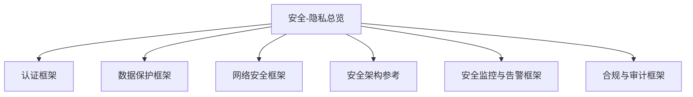
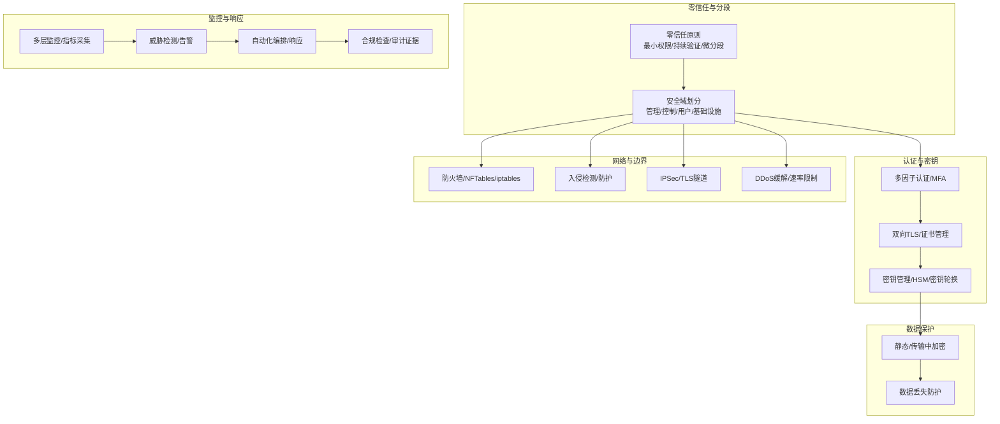
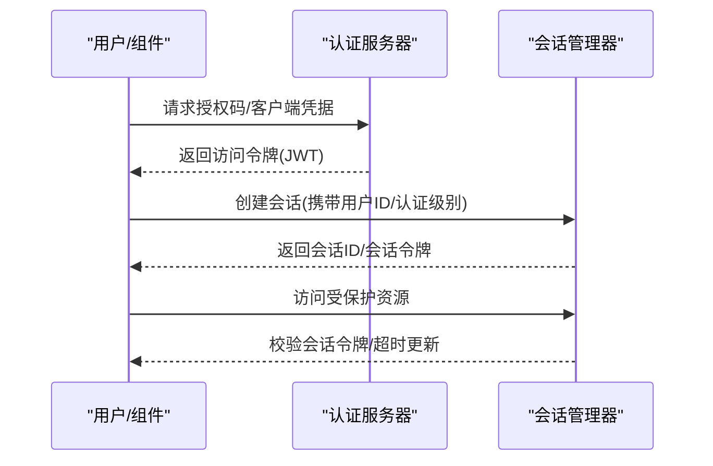
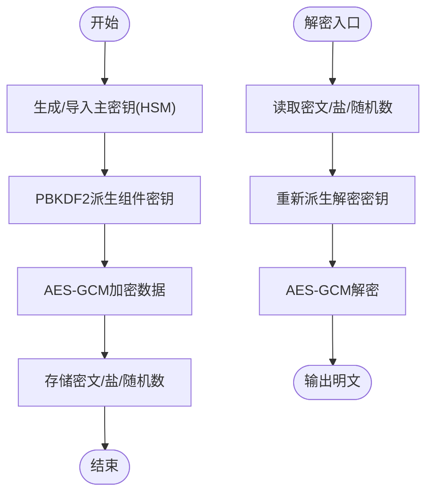
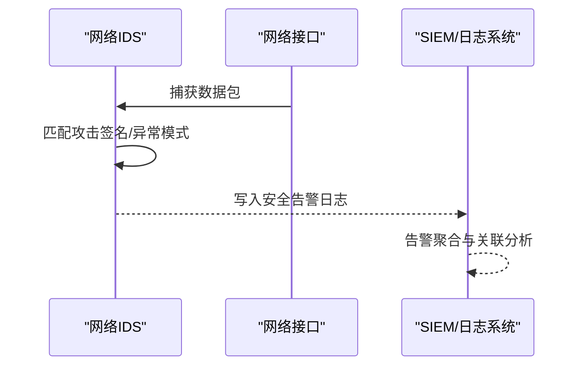
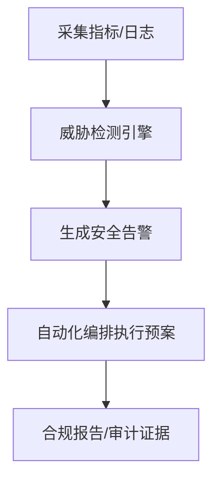
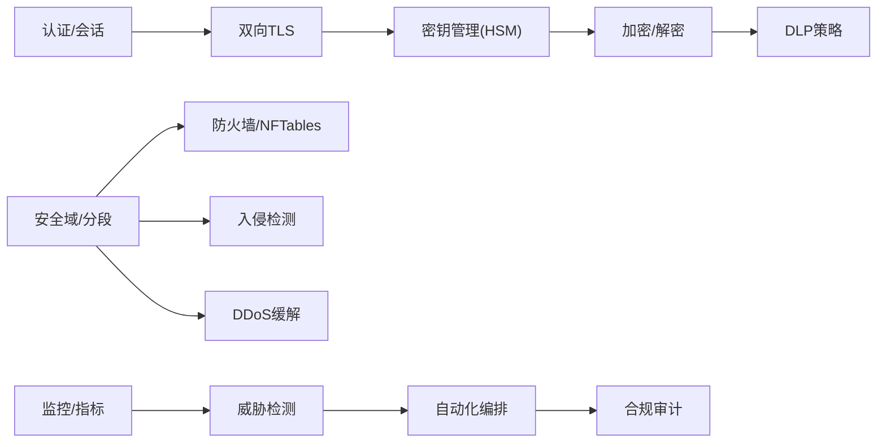

# 安全工具

<cite>
**本文引用的文件**
- [安全-隐私总览](file://12-security-privacy/readme.md)
- [认证框架（中文）](file://12-security-privacy/authentication/authentication-framework-zh.md)
- [认证框架（英文）](file://12-security-privacy/authentication/authentication-framework.md)
- [合规与审计框架（英文）](file://12-security-privacy/compliance-auditing/compliance-auditing-framework.md)
- [数据保护框架（中文）](file://12-security-privacy/data-protection/data-protection-framework-zh.md)
- [数据保护框架（英文）](file://12-security-privacy/data-protection/data-protection-framework.md)
- [网络安全框架（中文）](file://12-security-privacy/network-security/network-security-framework-zh.md)
- [网络安全框架（英文）](file://12-security-privacy/network-security/network-security-framework.md)
- [安全架构参考（中文）](file://12-security-privacy/security-architecture/security-reference-architecture-zh.md)
- [安全架构参考（英文）](file://12-security-privacy/security-architecture/security-reference-architecture.md)
- [安全监控与告警框架（英文）](file://12-security-privacy/monitoring-alerting/security-monitoring-framework.md)
</cite>

## 目录
1. [简介](#简介)
2. [项目结构](#项目结构)
3. [核心组件](#核心组件)
4. [架构总览](#架构总览)
5. [详细组件分析](#详细组件分析)
6. [依赖分析](#依赖分析)
7. [性能考虑](#性能考虑)
8. [故障排查指南](#故障排查指南)
9. [结论](#结论)
10. [附录](#附录)

## 简介
本指南面向O-RAN安全工具的使用与管理，围绕“设备配置、软件部署、监控与管理”四大类，结合仓库内已有的认证、数据保护、网络安全、安全架构与监控告警等权威文档，给出可落地的工具配置与运维建议。内容覆盖：
- 安全设备配置：防火墙规则、入侵检测系统、VPN/隧道配置
- 安全软件部署：证书与密钥管理、加密与传输安全、DLP策略
- 监控工具使用：网络与系统监控、日志与合规分析、威胁检测与告警
- 管理工具操作：补丁与变更管理、配置与策略管理、合规审计与持续改进

## 项目结构
本仓库的“安全-隐私”目录是O-RAN安全工具与体系的核心资料来源，包含认证、数据保护、网络安全、安全架构与监控告警等子主题，形成完整的安全工具使用与管理知识图谱。

**图表来源**
- [安全-隐私总览](file://12-security-privacy/readme.md#L1-L67)

**章节来源**
- [安全-隐私总览](file://12-security-privacy/readme.md#L1-L67)

## 核心组件
- 认证与会话管理：多因素认证、OAuth 2.0/JWT、双向TLS、会话令牌校验与超时控制
- 数据保护与密钥管理：静态与传输中加密、HSM集成、密钥派生与轮换、DLP策略
- 网络安全与边界：零信任分段、微分段、IDS/IPS、DDoS缓解、TLS与IPSec
- 安全监控与告警：多层监控体系、威胁检测引擎、合规检查脚本、自动化响应编排
- 合规与审计：GDPR、ETSI、NIST、ISO 27001等合规矩阵与审计证据收集

**章节来源**
- [认证框架（英文）](file://12-security-privacy/authentication/authentication-framework.md#L1-L208)
- [数据保护框架（英文）](file://12-security-privacy/data-protection/data-protection-framework.md#L1-L376)
- [网络安全框架（英文）](file://12-security-privacy/network-security/network-security-framework.md#L1-L473)
- [安全架构参考（英文）](file://12-security-privacy/security-architecture/security-reference-architecture.md#L1-L559)
- [安全监控与告警框架（英文）](file://12-security-privacy/monitoring-alerting/security-monitoring-framework.md#L1-L733)
- [合规与审计框架（英文）](file://12-security-privacy/compliance-auditing/compliance-auditing-framework.md#L1-L486)

## 架构总览
下图展示O-RAN安全工具在整体架构中的位置与交互关系，强调“零信任分段 + 多层加密 + 持续监控”的纵深防御思路。

**图表来源**
- [安全架构参考（英文）](file://12-security-privacy/security-architecture/security-reference-architecture.md#L8-L71)
- [网络安全框架（英文）](file://12-security-privacy/network-security/network-security-framework.md#L42-L112)
- [认证框架（英文）](file://12-security-privacy/authentication/authentication-framework.md#L100-L185)
- [数据保护框架（英文）](file://12-security-privacy/data-protection/data-protection-framework.md#L6-L96)
- [安全监控与告警框架（英文）](file://12-security-privacy/monitoring-alerting/security-monitoring-framework.md#L8-L31)
- [合规与审计框架（英文）](file://12-security-privacy/compliance-auditing/compliance-auditing-framework.md#L114-L197)

## 详细组件分析

### 组件A：认证与会话管理
- 多因素认证（MFA）与认证级别分级，支持TOTP、智能卡、生物识别与硬件安全模块
- OAuth 2.0与JWT令牌配置，含授权服务器、令牌端点、客户端注册与作用域
- 双向TLS（mTLS）配置，按接口域启用OCSP/CRL吊销检查与密码套件
- 会话管理：基于随机数与时间戳生成会话令牌，支持超时与活动更新

**图表来源**
- [认证框架（英文）](file://12-security-privacy/authentication/authentication-framework.md#L71-L96)
- [认证框架（英文）](file://12-security-privacy/authentication/authentication-framework.md#L126-L185)

**章节来源**
- [认证框架（中文）](file://12-security-privacy/authentication/authentication-framework-zh.md#L8-L23)
- [认证框架（英文）](file://12-security-privacy/authentication/authentication-framework.md#L8-L23)
- [认证框架（中文）](file://12-security-privacy/authentication/authentication-framework-zh.md#L71-L96)
- [认证框架（英文）](file://12-security-privacy/authentication/authentication-framework.md#L71-L96)
- [认证框架（中文）](file://12-security-privacy/authentication/authentication-framework-zh.md#L100-L124)
- [认证框架（英文）](file://12-security-privacy/authentication/authentication-framework.md#L100-L124)
- [认证框架（中文）](file://12-security-privacy/authentication/authentication-framework-zh.md#L126-L185)
- [认证框架（英文）](file://12-security-privacy/authentication/authentication-framework.md#L126-L185)

### 组件B：数据保护与密钥管理
- 静态数据加密（数据库/文件系统/对象存储）、传输中加密（IPSec/TLS）
- 基于HSM的密钥管理与PBKDF2派生，支持组件级密钥与加密数据封装
- DLP策略：基于正则的敏感信息识别与处置动作（加密/记录/告警/阻止）
- 审计日志：统一字段、保留策略、实时监控与取证分析能力

**图表来源**
- [数据保护框架（英文）](file://12-security-privacy/data-protection/data-protection-framework.md#L101-L184)

**章节来源**
- [数据保护框架（中文）](file://12-security-privacy/data-protection/data-protection-framework-zh.md#L8-L28)
- [数据保护框架（英文）](file://12-security-privacy/data-protection/data-protection-framework.md#L8-L28)
- [数据保护框架（中文）](file://12-security-privacy/data-protection/data-protection-framework-zh.md#L30-L96)
- [数据保护框架（英文）](file://12-security-privacy/data-protection/data-protection-framework.md#L30-L96)
- [数据保护框架（中文）](file://12-security-privacy/data-protection/data-protection-framework-zh.md#L98-L184)
- [数据保护框架（英文）](file://12-security-privacy/data-protection/data-protection-framework.md#L98-L184)
- [数据保护框架（中文）](file://12-security-privacy/data-protection/data-protection-framework-zh.md#L251-L298)
- [数据保护框架（英文）](file://12-security-privacy/data-protection/data-protection-framework.md#L251-L298)
- [数据保护框架（中文）](file://12-security-privacy/data-protection/data-protection-framework-zh.md#L342-L376)
- [数据保护框架（英文）](file://12-security-privacy/data-protection/data-protection-framework.md#L342-L376)

### 组件C：网络安全与边界防护
- 零信任与微分段：命名空间/网桥/命名空间路由、VLAN分段
- 入侵检测与防护：基于签名与行为的IDS，异常端口扫描与畸形包检测
- DDoS缓解：iptables/NFTables速率限制、连接限制、突发与黑洞路由
- 通信安全：TLS配置（HSTS、OCSP、安全头）、IPSec站点到站点隧道

**图表来源**
- [网络安全框架（英文）](file://12-security-privacy/network-security/network-security-framework.md#L116-L259)

**章节来源**
- [网络安全框架（中文）](file://12-security-privacy/network-security/network-security-framework-zh.md#L6-L40)
- [网络安全框架（英文）](file://12-security-privacy/network-security/network-security-framework.md#L6-L40)
- [网络安全框架（中文）](file://12-security-privacy/network-security/network-security-framework-zh.md#L42-L112)
- [网络安全框架（英文）](file://12-security-privacy/network-security/network-security-framework.md#L42-L112)
- [网络安全框架（中文）](file://12-security-privacy/network-security/network-security-framework-zh.md#L114-L259)
- [网络安全框架（英文）](file://12-security-privacy/network-security/network-security-framework.md#L114-L259)
- [网络安全框架（中文）](file://12-security-privacy/network-security/network-security-framework-zh.md#L261-L426)
- [网络安全框架（英文）](file://12-security-privacy/network-security/network-security-framework.md#L261-L426)
- [网络安全框架（中文）](file://12-security-privacy/network-security/network-security-framework-zh.md#L428-L473)
- [网络安全框架（英文）](file://12-security-privacy/network-security/network-security-framework.md#L428-L473)

### 组件D：安全监控与告警
- 多层监控：网络/应用/系统/数据层指标采集与异常检测
- 威胁检测引擎：基于模式匹配与阈值的实时告警
- 自动化编排：根据预案执行阻断、禁用账户、取证等动作
- 合规检查：自动化脚本验证加密、访问控制、防火墙与服务配置

**图表来源**
- [安全监控与告警框架（英文）](file://12-security-privacy/monitoring-alerting/security-monitoring-framework.md#L35-L117)
- [安全监控与告警框架（英文）](file://12-security-privacy/monitoring-alerting/security-monitoring-framework.md#L121-L217)
- [安全监控与告警框架（英文）](file://12-security-privacy/monitoring-alerting/security-monitoring-framework.md#L518-L637)
- [合规与审计框架（英文）](file://12-security-privacy/compliance-auditing/compliance-auditing-framework.md#L114-L197)

**章节来源**
- [安全监控与告警框架（英文）](file://12-security-privacy/monitoring-alerting/security-monitoring-framework.md#L6-L31)
- [安全监控与告警框架（英文）](file://12-security-privacy/monitoring-alerting/security-monitoring-framework.md#L119-L217)
- [安全监控与告警框架（英文）](file://12-security-privacy/monitoring-alerting/security-monitoring-framework.md#L219-L304)
- [安全监控与告警框架（英文）](file://12-security-privacy/monitoring-alerting/security-monitoring-framework.md#L306-L440)
- [安全监控与告警框架（英文）](file://12-security-privacy/monitoring-alerting/security-monitoring-framework.md#L442-L517)
- [安全监控与告警框架（英文）](file://12-security-privacy/monitoring-alerting/security-monitoring-framework.md#L518-L637)
- [安全监控与告警框架（英文）](file://12-security-privacy/monitoring-alerting/security-monitoring-framework.md#L639-L731)
- [合规与审计框架（英文）](file://12-security-privacy/compliance-auditing/compliance-auditing-framework.md#L199-L326)
- [合规与审计框架（英文）](file://12-security-privacy/compliance-auditing/compliance-auditing-framework.md#L338-L431)
- [合规与审计框架（英文）](file://12-security-privacy/compliance-auditing/compliance-auditing-framework.md#L432-L486)

## 依赖分析
- 认证与密钥：认证依赖证书与密钥；密钥依赖HSM；mTLS依赖证书与吊销检查
- 网络安全：防火墙/NFTables依赖内核模块；IDS依赖抓包库；DDoS缓解依赖连接跟踪
- 监控与告警：SIEM依赖日志聚合；自动化编排依赖外部命令与系统调用
- 合规与审计：合规检查脚本依赖系统状态与配置文件

**图表来源**
- [认证框架（英文）](file://12-security-privacy/authentication/authentication-framework.md#L100-L185)
- [数据保护框架（英文）](file://12-security-privacy/data-protection/data-protection-framework.md#L101-L184)
- [网络安全框架（英文）](file://12-security-privacy/network-security/network-security-framework.md#L42-L112)
- [安全监控与告警框架（英文）](file://12-security-privacy/monitoring-alerting/security-monitoring-framework.md#L518-L637)
- [合规与审计框架（英文）](file://12-security-privacy/compliance-auditing/compliance-auditing-framework.md#L114-L197)

**章节来源**
- [认证框架（英文）](file://12-security-privacy/authentication/authentication-framework.md#L100-L185)
- [数据保护框架（英文）](file://12-security-privacy/data-protection/data-protection-framework.md#L101-L184)
- [网络安全框架（英文）](file://12-security-privacy/network-security/network-security-framework.md#L42-L112)
- [安全监控与告警框架（英文）](file://12-security-privacy/monitoring-alerting/security-monitoring-framework.md#L518-L637)
- [合规与审计框架（英文）](file://12-security-privacy/compliance-auditing/compliance-auditing-framework.md#L114-L197)

## 性能考虑
- 网络性能：流量整形与队列算法（令牌桶、fq_codel、RED）需结合接口带宽与QoS策略配置
- 加密开销：AES-GCM硬件加速与HSM可显著降低CPU占用；密钥轮换应安排在低峰时段
- 监控开销：日志聚合与SIEM索引需平衡保留周期与查询性能；告警风暴可通过阈值与去重缓解
- 合规检查：批量扫描与日志解析应分批执行，避免阻塞生产流量

## 故障排查指南
- 认证失败/会话超时：检查会话令牌生成逻辑、超时参数与客户端IP获取
- mTLS握手失败：确认证书链、吊销检查配置与密码套件兼容性
- DDoS缓解误伤：调整速率阈值、突发窗口与白名单；核查上游黑洞路由
- IDS误报/漏报：优化签名库与异常阈值；结合历史流量训练行为模型
- 合规检查失败：逐项核对加密版本、证书有效期、SSH与密码策略配置

**章节来源**
- [认证框架（英文）](file://12-security-privacy/authentication/authentication-framework.md#L126-L185)
- [网络安全框架（英文）](file://12-security-privacy/network-security/network-security-framework.md#L261-L426)
- [安全监控与告警框架（英文）](file://12-security-privacy/monitoring-alerting/security-monitoring-framework.md#L306-L440)
- [合规与审计框架（英文）](file://12-security-privacy/compliance-auditing/compliance-auditing-framework.md#L114-L197)

## 结论
本指南基于仓库内的权威文档，构建了O-RAN安全工具的配置与管理全景：以零信任分段为基础，通过认证与密钥保障身份与数据安全，借助网络安全边界与监控告警实现持续防护，并以合规与审计闭环推动持续改进。建议在不同规模与类型的O-RAN部署中，按需组合上述工具与流程，形成标准化的安装、配置、维护与升级机制。

## 附录
- O-RAN特定场景下的工具选择与部署建议
  - 小型部署：集中式证书与密钥管理、基础防火墙与mTLS、轻量级监控与告警
  - 中型部署：分布式HSM、微分段与NFTables、容器化监控与SIEM集成
  - 大型部署：多域CA、企业级SIEM与威胁情报、自动化编排与合规仪表盘
- 工具协同与集成
  - 认证与密钥：统一证书生命周期管理与密钥轮换策略
  - 网络与监控：IDS与SIEM联动、DDoS缓解与流量整形联动
  - 合规与审计：自动化检查脚本与审计证据收集工具集成