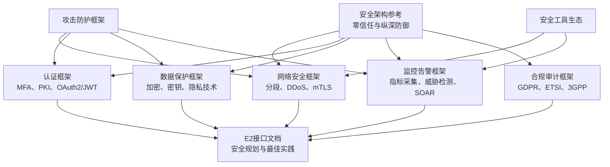
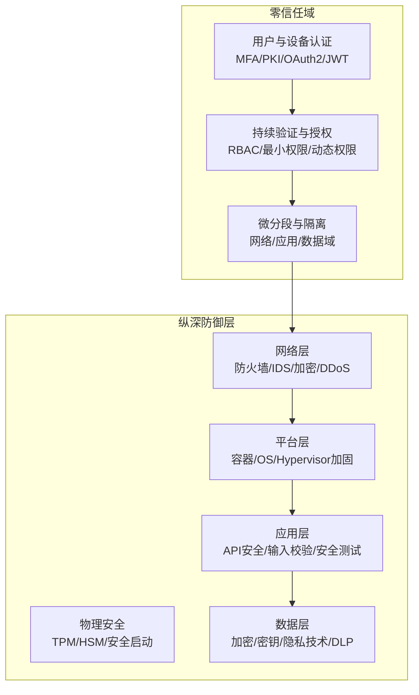
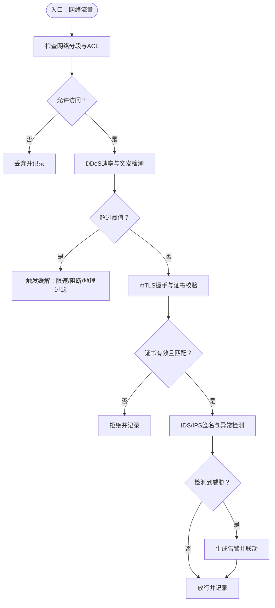
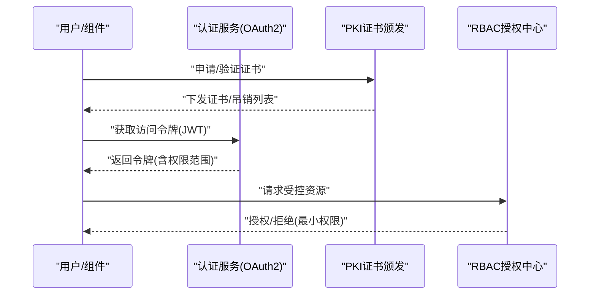
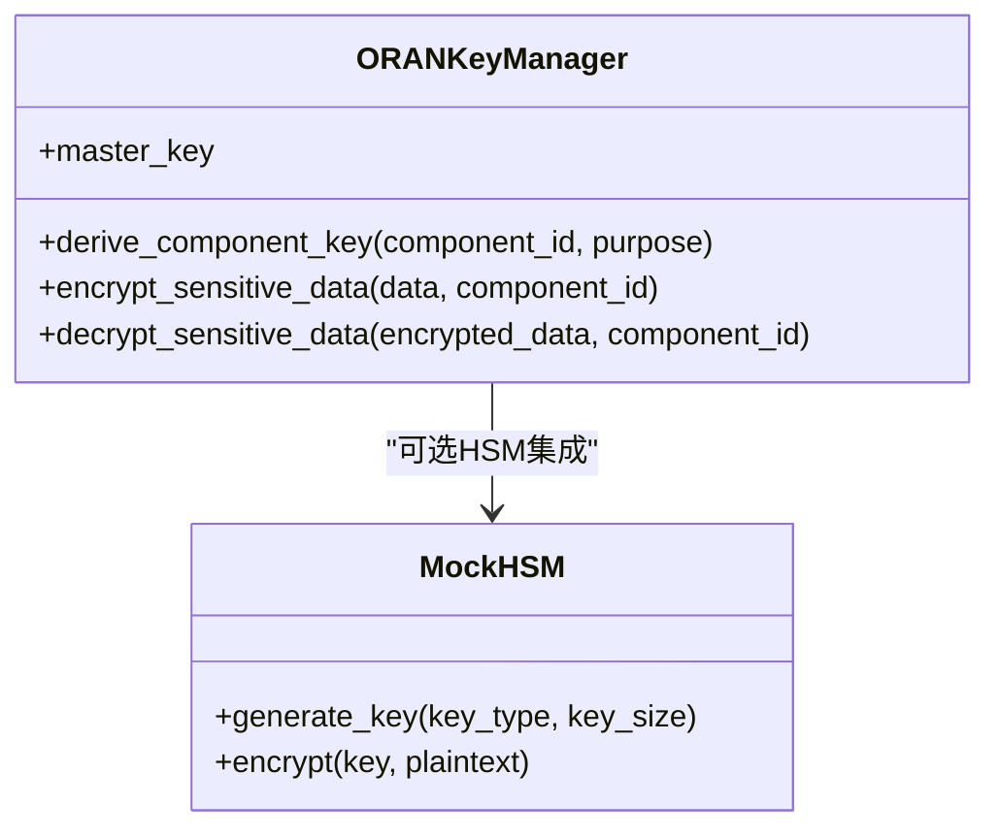
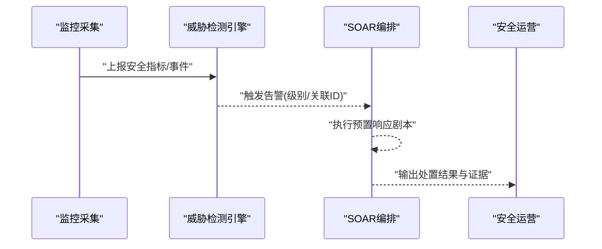
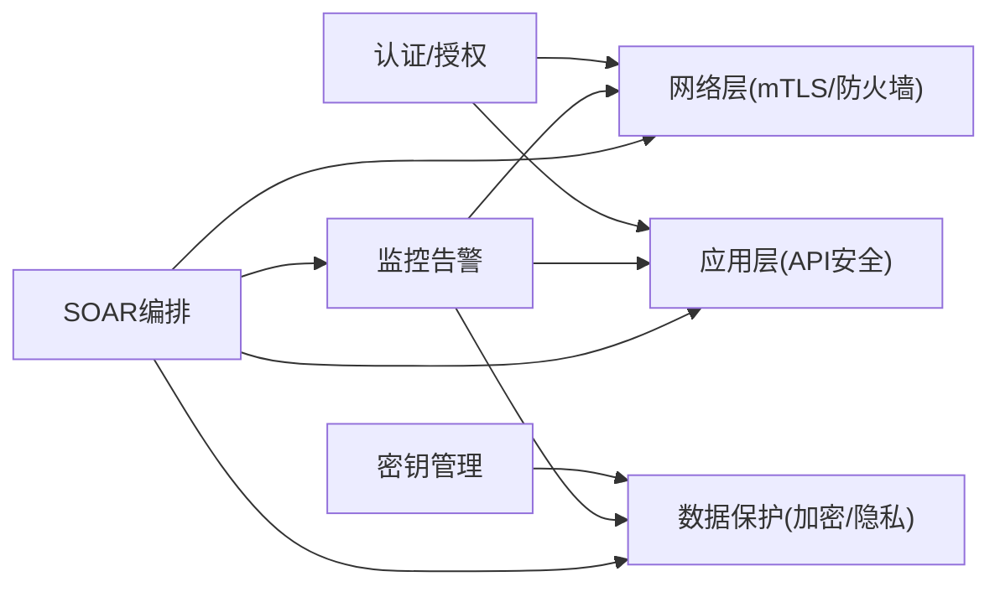

# 攻击防护

<cite>
**本文引用的文件**
- [O-RAN 安全架构参考](file://12-security-privacy/security-architecture/security-reference-architecture.md)
- [O-RAN 网络安全框架](file://12-security-privacy/network-security/network-security-framework.md)
- [O-RAN 认证框架](file://12-security-privacy/authentication/authentication-framework.md)
- [O-RAN 数据保护框架](file://12-security-privacy/data-protection/data-protection-framework.md)
- [O-RAN 合规与审计框架](file://12-security-privacy/compliance-auditing/compliance-auditing-framework.md)
- [E2 接口](file://03-interface-standards/e2-interface.md)
- [O-RAN 攻击防护框架](file://29-security-threats/attack-protection/o-ran-attack-protection.md)
- [O-RAN 安全工具生态](file://29-security-threats/security-tools/o-ran-security-tools.md)
- [O-RAN 安全监控与告警框架](file://12-security-privacy/monitoring-alerting/security-monitoring-framework.md)
</cite>

## 目录
1. [简介](#简介)
2. [项目结构](#项目结构)
3. [核心组件](#核心组件)
4. [架构总览](#架构总览)
5. [详细组件分析](#详细组件分析)
6. [依赖关系分析](#依赖关系分析)
7. [性能考虑](#性能考虑)
8. [故障排查指南](#故障排查指南)
9. [结论](#结论)
10. [附录](#附录)

## 简介
本文件面向O-RAN系统的攻击防护，围绕纵深防御策略，系统阐述边界防护（防火墙、入侵检测、网络隔离）、身份认证（多因子认证、PKI证书系统）、访问控制（RBAC权限模型、最小权限原则）与数据保护（加密传输、密钥管理、数据匿名化）的实施方案，并结合DDoS防护、中间人攻击（MITM）防护、恶意软件防护、配置攻击防护等典型威胁场景，给出O-RAN特定接口（E2、A1、F1等）的安全防护建议。同时提供部署场景下的配置指南、实施步骤与效果评估方法，帮助读者构建可落地、可验证、可持续改进的O-RAN安全体系。

## 项目结构
本仓库提供了O-RAN安全体系的多维度文档支撑，涵盖安全架构、网络安全、认证与授权、数据保护、合规审计、威胁防护、监控告警与工具生态等模块。这些文档共同构成O-RAN攻击防护的知识基础与实践指南。

图示来源
- [O-RAN 安全架构参考](file://12-security-privacy/security-architecture/security-reference-architecture.md#L8-L36)
- [O-RAN 网络安全框架](file://12-security-privacy/network-security/network-security-framework.md#L6-L40)
- [O-RAN 认证框架](file://12-security-privacy/authentication/authentication-framework.md#L6-L23)
- [O-RAN 数据保护框架](file://12-security-privacy/data-protection/data-protection-framework.md#L6-L28)
- [O-RAN 安全监控与告警框架](file://12-security-privacy/monitoring-alerting/security-monitoring-framework.md#L6-L31)
- [O-RAN 合规与审计框架](file://12-security-privacy/compliance-auditing/compliance-auditing-framework.md#L6-L41)
- [E2 接口](file://03-interface-standards/e2-interface.md#L105-L109)
- [O-RAN 攻击防护框架](file://29-security-threats/attack-protection/o-ran-attack-protection.md#L6-L51)
- [O-RAN 安全工具生态](file://29-security-threats/security-tools/o-ran-security-tools.md#L6-L51)

章节来源
- [O-RAN 安全架构参考](file://12-security-privacy/security-architecture/security-reference-architecture.md#L8-L36)
- [O-RAN 网络安全框架](file://12-security-privacy/network-security/network-security-framework.md#L6-L40)

## 核心组件
- 边界防护与网络隔离
  - 零信任网络分段与微分段
  - 防火墙与入侵检测/预防（IDS/IPS）
  - DDoS防护（速率限制、流量整形、地理过滤）
  - 加密通信（TLS 1.3、IPSec）
- 身份认证与授权
  - 多因子认证（MFA）
  - 公钥基础设施（PKI）与证书管理
  - OAuth 2.0/JWT与会话管理
  - RBAC权限模型与最小权限原则
- 数据保护
  - 数据在途与在库加密
  - 密钥管理系统（含HSM）
  - 差分隐私与数据匿名化
- 安全监控与响应
  - 威胁检测与告警
  - 自动化编排与响应（SOAR）
  - 合规监测与持续评估
- 合规与审计
  - GDPR、ETSI、3GPP等标准映射
  - 审计证据收集与报告生成

章节来源
- [O-RAN 网络安全框架](file://12-security-privacy/network-security/network-security-framework.md#L42-L71)
- [O-RAN 认证框架](file://12-security-privacy/authentication/authentication-framework.md#L8-L23)
- [O-RAN 数据保护框架](file://12-security-privacy/data-protection/data-protection-framework.md#L8-L28)
- [O-RAN 安全监控与告警框架](file://12-security-privacy/monitoring-alerting/security-monitoring-framework.md#L119-L217)
- [O-RAN 合规与审计框架](file://12-security-privacy/compliance-auditing/compliance-auditing-framework.md#L6-L41)

## 架构总览
O-RAN攻击防护采用“零信任+纵深防御”双引擎：
- 零信任：永不信任、始终验证；按域划分安全域，域内最小权限与持续验证
- 纵深防御：物理—网络—平台—应用—数据五层防护，每层均具备检测与处置能力

图示来源
- [O-RAN 安全架构参考](file://12-security-privacy/security-architecture/security-reference-architecture.md#L8-L36)
- [O-RAN 网络安全框架](file://12-security-privacy/network-security/network-security-framework.md#L38-L71)

## 详细组件分析

### 边界防护与网络隔离
- 网络分段与微分段
  - 基于零信任原则划分管理域、控制面域、用户面域、基础设施域
  - 通过命名空间/VLAN实现逻辑隔离，配合默认拒绝策略
- 防火墙与入侵防护
  - iptables/NFTables规则集，包含SYN洪泛、ICMP洪泛、端口扫描检测与连接限制
  - 结合基于签名与行为的IDS/IPS进行实时阻断
- DDoS防护
  - 全局/源粒度速率限制与突发窗口
  - 针对E2/F1/管理接口的差异化带宽与队列策略
  - 黑洞路由、地理过滤、协议验证与签名阻断
- 加密通信
  - mTLS强制启用，OCSP/CRL吊销检查，TLS 1.3/1.2套件优选
  - 管理接口与控制面接口分别配置不同CA与有效期策略

图示来源
- [O-RAN 网络安全框架](file://12-security-privacy/network-security/network-security-framework.md#L261-L310)
- [O-RAN 网络安全框架](file://12-security-privacy/network-security/network-security-framework.md#L311-L426)
- [O-RAN 安全架构参考](file://12-security-privacy/security-architecture/security-reference-architecture.md#L249-L282)

章节来源
- [O-RAN 网络安全框架](file://12-security-privacy/network-security/network-security-framework.md#L6-L40)
- [O-RAN 网络安全框架](file://12-security-privacy/network-security/network-security-framework.md#L261-L310)
- [O-RAN 网络安全框架](file://12-security-privacy/network-security/network-security-framework.md#L311-L426)
- [O-RAN 安全架构参考](file://12-security-privacy/security-architecture/security-reference-architecture.md#L249-L282)

### 身份认证与授权
- 多因子认证（MFA）
  - 一级：用户名/密码；二级：TOTP/智能卡/生物识别；三级：硬件安全模块
- PKI证书管理
  - 组织根CA与域级中间CA层级；组件证书签发与打包；自动轮换与吊销检查
- OAuth 2.0/JWT
  - 授权服务器、客户端注册、令牌端点、JWT签名算法与时效
- 会话管理
  - 会话ID与令牌生成、超时与活动刷新、IP绑定与防重放
- RBAC与最小权限
  - 角色权限矩阵、LDAP组映射、域内/全局作用域控制

图示来源
- [O-RAN 认证框架](file://12-security-privacy/authentication/authentication-framework.md#L25-L69)
- [O-RAN 认证框架](file://12-security-privacy/authentication/authentication-framework.md#L71-L96)
- [O-RAN 认证框架](file://12-security-privacy/authentication/authentication-framework.md#L126-L185)
- [O-RAN 安全架构参考](file://12-security-privacy/security-architecture/security-reference-architecture.md#L284-L337)

章节来源
- [O-RAN 认证框架](file://12-security-privacy/authentication/authentication-framework.md#L8-L23)
- [O-RAN 认证框架](file://12-security-privacy/authentication/authentication-framework.md#L25-L69)
- [O-RAN 认证框架](file://12-security-privacy/authentication/authentication-framework.md#L71-L96)
- [O-RAN 认证框架](file://12-security-privacy/authentication/authentication-framework.md#L126-L185)
- [O-RAN 安全架构参考](file://12-security-privacy/security-architecture/security-reference-architecture.md#L284-L337)

### 数据保护与密钥管理
- 加密策略
  - 数据在库：AES-256-GCM、LUKS/dm-crypt、对象存储服务端加密
  - 数据在途：TLS 1.3、IPSec隧道、接口级证书绑定
- 密钥管理
  - HSM/TPM生成与托管主密钥；PBKDF2派生组件密钥；AES-GCM加解密与随机数
- 隐私增强
  - 差分隐私（拉普拉斯/高斯机制）用于统计分析；DLP策略识别敏感数据
- 审计与合规
  - 完整日志格式、保留策略、合规报告与取证能力

图示来源
- [O-RAN 数据保护框架](file://12-security-privacy/data-protection/data-protection-framework.md#L98-L184)

章节来源
- [O-RAN 数据保护框架](file://12-security-privacy/data-protection/data-protection-framework.md#L8-L28)
- [O-RAN 数据保护框架](file://12-security-privacy/data-protection/data-protection-framework.md#L98-L184)
- [O-RAN 数据保护框架](file://12-security-privacy/data-protection/data-protection-framework.md#L186-L249)
- [O-RAN 数据保护框架](file://12-security-privacy/data-protection/data-protection-framework.md#L342-L374)

### 安全监控与告警
- 多层指标采集
  - 网络层：DDoS检测、未授权访问、协议违规、加密强度、恶意特征
  - 应用层：API安全、认证失败、越权、数据外泄、配置脆弱点
- 威胁检测引擎
  - 基于规则/模式的实时检测，生成分级告警并关联追踪ID
- 自动化编排与响应（SOAR）
  - 预定义响应剧本（立即动作、调查步骤、修复动作），自动执行与审计
- 合规监测
  - 定期合规检查脚本、报告生成与整改跟踪

图示来源
- [O-RAN 安全监控与告警框架](file://12-security-privacy/monitoring-alerting/security-monitoring-framework.md#L33-L117)
- [O-RAN 安全监控与告警框架](file://12-security-privacy/monitoring-alerting/security-monitoring-framework.md#L119-L217)
- [O-RAN 安全监控与告警框架](file://12-security-privacy/monitoring-alerting/security-monitoring-framework.md#L442-L516)
- [O-RAN 安全监控与告警框架](file://12-security-privacy/monitoring-alerting/security-monitoring-framework.md#L518-L637)

章节来源
- [O-RAN 安全监控与告警框架](file://12-security-privacy/monitoring-alerting/security-monitoring-framework.md#L6-L31)
- [O-RAN 安全监控与告警框架](file://12-security-privacy/monitoring-alerting/security-monitoring-framework.md#L33-L117)
- [O-RAN 安全监控与告警框架](file://12-security-privacy/monitoring-alerting/security-monitoring-framework.md#L442-L516)
- [O-RAN 安全监控与告警框架](file://12-security-privacy/monitoring-alerting/security-monitoring-framework.md#L518-L637)

### O-RAN特定接口的安全防护
- E2接口
  - 网络隔离与访问控制、加密传输、相互认证、QoS保障
  - 分布式部署降低延迟、批量处理与消息压缩优化性能
- A1接口
  - 基于证书的身份验证与消息签名、速率限制与异常检测
- F1接口
  - 用户面加密与完整性保护、QoS隔离、DDoS与流量整形

章节来源
- [E2 接口](file://03-interface-standards/e2-interface.md#L105-L109)
- [E2 接口](file://03-interface-standards/e2-interface.md#L241-L260)
- [O-RAN 安全架构参考](file://12-security-privacy/security-architecture/security-reference-architecture.md#L22-L30)

### 攻击类型与防护技术
- DDoS防护
  - 速率限制、连接限制、地理过滤、协议验证、黑洞路由
- 中间人攻击（MITM）防护
  - 强制mTLS、证书透明度、OCSP/CRL吊销检查、严格套件选择
- 恶意软件防护
  - 端点检测与响应（EDR）、主机基线监控、沙箱与启发式分析
- 配置攻击防护
  - 最小权限、变更审计、基线合规检查、自动化补丁与配置核查

章节来源
- [O-RAN 攻击防护框架](file://29-security-threats/attack-protection/o-ran-attack-protection.md#L100-L145)
- [O-RAN 网络安全框架](file://12-security-privacy/network-security/network-security-framework.md#L261-L310)
- [O-RAN 安全工具生态](file://29-security-threats/security-tools/o-ran-security-tools.md#L53-L83)

## 依赖关系分析
- 组件耦合与内聚
  - 认证与授权高度内聚于统一身份域；与网络层（mTLS）与应用层（API安全）紧密耦合
  - 密钥管理与数据保护强耦合，形成“密钥—加密—审计”的闭环
  - 监控与告警对各层指标有横切依赖，SOAR对响应剧本与工具链有外部依赖
- 外部依赖与集成
  - PKI根/中间CA、HSM供应商、SIEM/日志平台、威胁情报平台、合规扫描工具
- 潜在循环依赖
  - 防护策略应避免“检测—响应—检测”的反馈环导致的误报放大；通过分级与人工复核缓解

图示来源
- [O-RAN 安全架构参考](file://12-security-privacy/security-architecture/security-reference-architecture.md#L8-L36)
- [O-RAN 安全监控与告警框架](file://12-security-privacy/monitoring-alerting/security-monitoring-framework.md#L6-L31)

章节来源
- [O-RAN 安全架构参考](file://12-security-privacy/security-architecture/security-reference-architecture.md#L8-L36)
- [O-RAN 安全监控与告警框架](file://12-security-privacy/monitoring-alerting/security-monitoring-framework.md#L6-L31)

## 性能考虑
- 传输与处理开销
  - TLS 1.3与硬件加速（如HSM/网卡卸载）可降低握手与加解密延迟
  - 流量整形与队列算法（令牌桶、RED、FQ-CoDel）在保障QoS的同时控制CPU占用
- 监控与检测
  - 指标聚合与采样、阈值与去噪、机器学习模型轻量化部署
- 可扩展性
  - 分布式传感器、云原生安全组件（容器镜像扫描、服务网格安全）提升弹性

## 故障排查指南
- 常见问题定位
  - 认证失败：检查证书链、吊销状态、时间同步、MFA策略
  - 授权失败：核对角色映射、域权限、最小权限配置
  - 通信异常：验证mTLS握手日志、证书有效期、防火墙规则、速率限制
  - 性能退化：检查DDoS缓解是否过度、队列调度是否合理、加密加速是否启用
- 证据与审计
  - 依据统一日志格式与保留策略提取事件、生成合规报告、支持取证

章节来源
- [O-RAN 安全监控与告警框架](file://12-security-privacy/monitoring-alerting/security-monitoring-framework.md#L306-L440)
- [O-RAN 合规与审计框架](file://12-security-privacy/compliance-auditing/compliance-auditing-framework.md#L238-L430)

## 结论
通过零信任与纵深防御相结合，O-RAN可在边界、平台、应用与数据层面构建稳健的攻击防护体系。结合接口特性与威胁形态，采用分层、自动化与持续改进的方法，可显著提升系统的安全性、可观测性与合规性，满足运营商与监管要求。

## 附录

### 配置指南与实施步骤
- 边界防护
  - 部署零信任网络分段，配置默认拒绝策略与最小暴露面
  - 启用mTLS与证书吊销检查，设置TLS套件优先级
  - 部署DDoS规则（iptables/NFTables），开启速率限制与地理过滤
- 身份认证与授权
  - 建立组织级PKI与域级CA，自动化证书签发与轮换
  - 部署OAuth2/JWT与会话管理，启用MFA与最小权限
  - 设计RBAC角色与LDAP映射，定期审计权限矩阵
- 数据保护
  - 部署HSM/TPM密钥托管，实现PBKDF2派生与AES-GCM加解密
  - 启用差分隐私与DLP策略，完善日志与取证能力
- 监控与响应
  - 部署多层指标采集与威胁检测引擎，接入SOAR自动化编排
  - 制定响应剧本并演练，定期评估成熟度与改进项

章节来源
- [O-RAN 网络安全框架](file://12-security-privacy/network-security/network-security-framework.md#L42-L71)
- [O-RAN 认证框架](file://12-security-privacy/authentication/authentication-framework.md#L25-L69)
- [O-RAN 数据保护框架](file://12-security-privacy/data-protection/data-protection-framework.md#L98-L184)
- [O-RAN 安全监控与告警框架](file://12-security-privacy/monitoring-alerting/security-monitoring-framework.md#L518-L637)

### 效果评估方法
- 指标体系
  - 安全事件数量与趋势、告警准确率与误报率、合规得分、响应时间与恢复时间
- 方法
  - 定期渗透测试与红蓝对抗、威胁狩猎与IOC关联分析、合规检查与审计报告
  - 基于成熟度模型（如CMMI/ISO 27001）进行自我评估与改进

章节来源
- [O-RAN 安全监控与告警框架](file://12-security-privacy/monitoring-alerting/security-monitoring-framework.md#L639-L731)
- [O-RAN 合规与审计框架](file://12-security-privacy/compliance-auditing/compliance-auditing-framework.md#L432-L484)