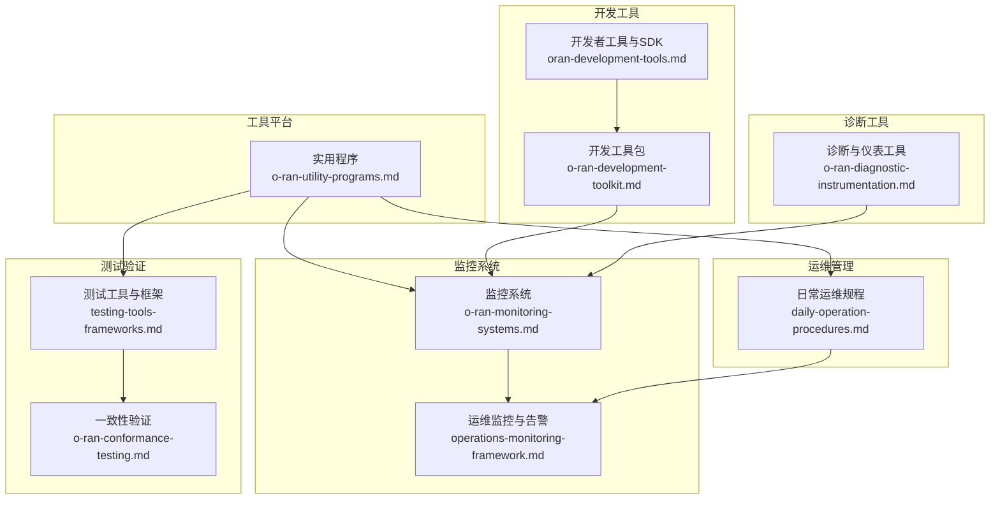
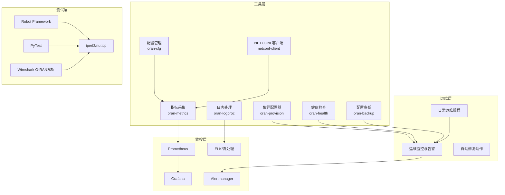
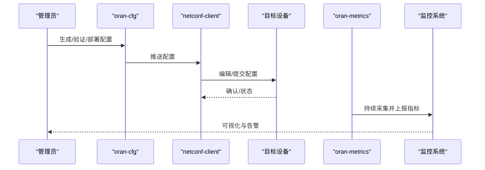
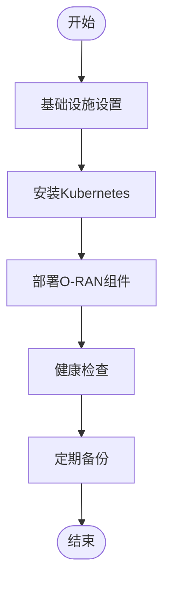
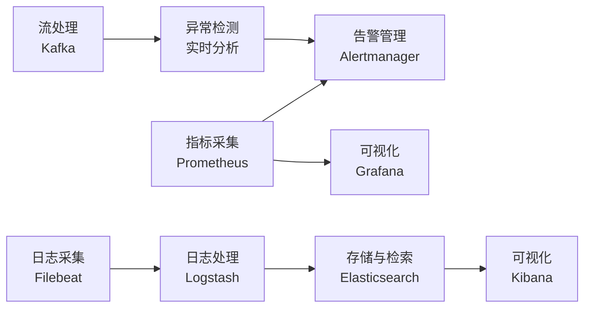
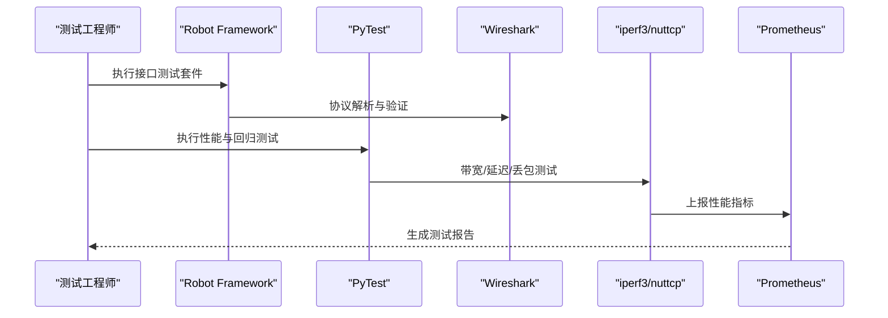
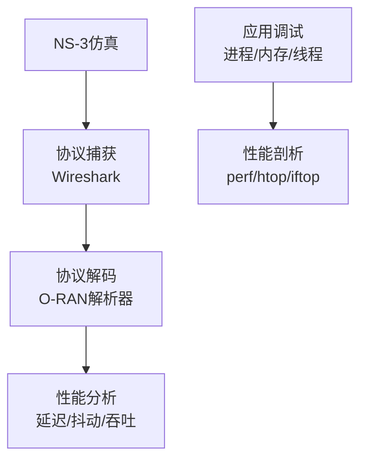
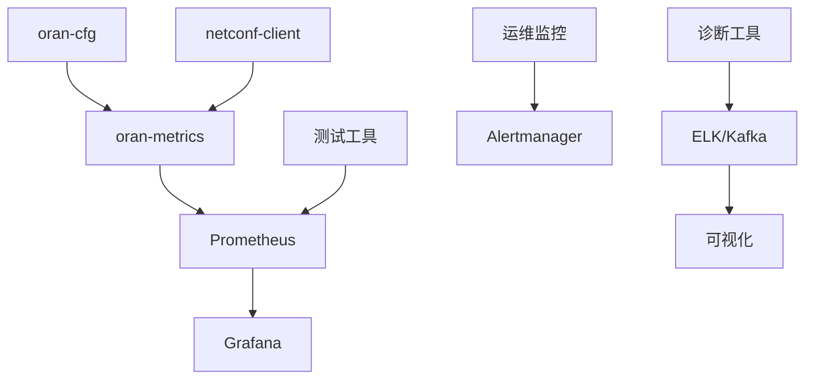

# 实用程序

<cite>
**本文引用的文件**
- [O-RAN 实用程序](file://22-tool-platforms/utility-programs/o-ran-utility-programs.md)
- [O-RAN 实用程序（中文）](file://22-tool-platforms/utility-programs/o-ran-utility-programs-zh.md)
- [O-RAN 开发工具包](file://22-tool-platforms/development-tools/o-ran-development-toolkit.md)
- [O-RAN 开发工具包（中文）](file://22-tool-platforms/development-tools/o-ran-development-toolkit-zh.md)
- [O-RAN 监控系统](file://22-tool-platforms/monitoring-systems/o-ran-monitoring-systems.md)
- [O-RAN 测试工具与框架](file://13-testing-validation/testing-tools/testing-tools-frameworks.md)
- [O-RAN 一致性验证](file://13-testing-validation/conformance-testing/o-ran-conformance-testing.md)
- [O-RAN 运维监控与告警系统](file://14-operations-management/monitoring-alerting/operations-monitoring-framework.md)
- [O-RAN 日常运维规程](file://14-operations-management/daily-operations/daily-operation-procedures.md)
- [O-RAN 开发者工具与SDK](file://17-open-source-ecosystem/developer-tools/oran-development-tools.md)
- [O-RAN 开发者工具与SDK（中文）](file://17-open-source-ecosystem/developer-tools/oran-development-tools-zh.md)
- [O-RAN 诊断与仪表工具](file://27-troubleshooting-diagnosis/diagnostic-tools/o-ran-diagnostic-instrumentation.md)
</cite>

## 目录
1. [简介](#简介)
2. [项目结构](#项目结构)
3. [核心组件](#核心组件)
4. [架构总览](#架构总览)
5. [详细组件分析](#详细组件分析)
6. [依赖关系分析](#依赖关系分析)
7. [性能考虑](#性能考虑)
8. [故障排除指南](#故障排除指南)
9. [结论](#结论)
10. [附录](#附录)

## 简介
本指南面向O-RAN网络管理员与工程师，系统梳理并讲解O-RAN实用程序体系，涵盖命令行工具、网络与系统监控工具、配置与自动化脚本、测试与验证工具、仿真与仪表工具、文档与项目管理工具，并提供安装、配置与使用最佳实践及常见问题排查建议。内容基于仓库中的实用程序、开发工具、监控系统、测试框架与运维规程等文档整理而成，帮助读者快速掌握O-RAN实用程序的使用方法与运维要点。

## 项目结构
实用程序相关文档主要分布在“工具平台”“开发工具”“监控系统”“测试验证”“运维管理”“诊断工具”等主题目录下，形成“工具—开发—监控—测试—运维—诊断”的完整闭环。

**图表来源**
- [O-RAN 实用程序](file://22-tool-platforms/utility-programs/o-ran-utility-programs.md#L1-L628)
- [O-RAN 监控系统](file://22-tool-platforms/monitoring-systems/o-ran-monitoring-systems.md#L1-L545)
- [O-RAN 测试工具与框架](file://13-testing-validation/testing-tools/testing-tools-frameworks.md#L1-L598)
- [O-RAN 一致性验证](file://13-testing-validation/conformance-testing/o-ran-conformance-testing.md#L1-L67)
- [O-RAN 运维监控与告警系统](file://14-operations-management/monitoring-alerting/operations-monitoring-framework.md#L1-L909)
- [O-RAN 日常运维规程](file://14-operations-management/daily-operations/daily-operation-procedures.md#L1-L443)
- [O-RAN 开发工具包](file://22-tool-platforms/development-tools/o-ran-development-toolkit.md#L1-L488)
- [O-RAN 开发者工具与SDK](file://17-open-source-ecosystem/developer-tools/oran-development-tools.md#L1-L994)
- [O-RAN 诊断与仪表工具](file://27-troubleshooting-diagnosis/diagnostic-tools/o-ran-diagnostic-instrumentation.md#L134-L272)

**章节来源**
- [O-RAN 实用程序](file://22-tool-platforms/utility-programs/o-ran-utility-programs.md#L1-L628)
- [O-RAN 监控系统](file://22-tool-platforms/monitoring-systems/o-ran-monitoring-systems.md#L1-L545)
- [O-RAN 测试工具与框架](file://13-testing-validation/testing-tools/testing-tools-frameworks.md#L1-L598)
- [O-RAN 一致性验证](file://13-testing-validation/conformance-testing/o-ran-conformance-testing.md#L1-L67)
- [O-RAN 运维监控与告警系统](file://14-operations-management/monitoring-alerting/operations-monitoring-framework.md#L1-L909)
- [O-RAN 日常运维规程](file://14-operations-management/daily-operations/daily-operation-procedures.md#L1-L443)
- [O-RAN 开发工具包](file://22-tool-platforms/development-tools/o-ran-development-toolkit.md#L1-L488)
- [O-RAN 开发者工具与SDK](file://17-open-source-ecosystem/developer-tools/oran-development-tools.md#L1-L994)
- [O-RAN 诊断与仪表工具](file://27-troubleshooting-diagnosis/diagnostic-tools/o-ran-diagnostic-instrumentation.md#L134-L272)

## 核心组件
- 命令行工具与实用程序：包括O-RAN配置管理、NETCONF客户端、指标采集、日志处理等工具，覆盖配置下发、验证、合规、监控与分析。
- 自动化脚本：涵盖集群部署、健康检查、备份恢复等自动化流程，提升运维效率与一致性。
- 监控与告警：基于Prometheus/Grafana的指标采集与可视化，结合智能告警与根因分析，支撑O-RAN网络可观测性。
- 测试与验证：提供接口一致性、性能基准、互操作性测试方案与自动化测试框架。
- 仿真与仪表：提供网络仿真、协议分析、性能测试与诊断工具，支撑研发与运维验证。
- 文档与项目管理：提供测试报告、安全扫描、CI/CD集成与运维仪表盘等文档化与自动化能力。

**章节来源**
- [O-RAN 实用程序](file://22-tool-platforms/utility-programs/o-ran-utility-programs.md#L6-L628)
- [O-RAN 监控系统](file://22-tool-platforms/monitoring-systems/o-ran-monitoring-systems.md#L6-L545)
- [O-RAN 测试工具与框架](file://13-testing-validation/testing-tools/testing-tools-frameworks.md#L1-L598)
- [O-RAN 诊断与仪表工具](file://27-troubleshooting-diagnosis/diagnostic-tools/o-ran-diagnostic-instrumentation.md#L134-L272)

## 架构总览
实用程序体系围绕“工具—监控—测试—运维—诊断”五大支柱协同工作，形成从开发、测试、部署到运维的全生命周期支撑。

**图表来源**
- [O-RAN 实用程序](file://22-tool-platforms/utility-programs/o-ran-utility-programs.md#L10-L628)
- [O-RAN 监控系统](file://22-tool-platforms/monitoring-systems/o-ran-monitoring-systems.md#L10-L545)
- [O-RAN 测试工具与框架](file://13-testing-validation/testing-tools/testing-tools-frameworks.md#L101-L598)
- [O-RAN 运维监控与告警系统](file://14-operations-management/monitoring-alerting/operations-monitoring-framework.md#L6-L909)
- [O-RAN 日常运维规程](file://14-operations-management/daily-operations/daily-operation-procedures.md#L6-L443)

## 详细组件分析

### 命令行工具与实用程序
- O-RAN配置管理（oran-cfg）
  - 模板生成、参数验证、批量部署、合规检查与审计追踪
  - 典型用法：生成模板、校验配置、部署到设备、检查合规
- NETCONF客户端（netconf-client）
  - 会话管理、编辑/复制/删除配置、锁/解锁、订阅通知
  - 典型用法：连接设备、获取运行配置、编辑候选配置、提交确认、订阅通知
- 指标采集（oran-metrics）
  - 实时采集E2/A1/O1接口、前传性能、资源利用率、QoS指标
  - 典型用法：持续采集、快照分析、导出文件、推送到监控系统
- 日志处理（oran-logproc）
  - 多格式解析、实时流、跨组件关联与根因分析
  - 典型用法：解析过滤、跨组件关联、生成分析报告、实时监控

**图表来源**
- [O-RAN 实用程序](file://22-tool-platforms/utility-programs/o-ran-utility-programs.md#L10-L233)

**章节来源**
- [O-RAN 实用程序](file://22-tool-platforms/utility-programs/o-ran-utility-programs.md#L8-L233)

### 自动化脚本与运维工具
- 集群配置器（oran-provision）
  - 基础设施、Kubernetes安装、O-RAN组件部署
  - 典型用法：创建VPC/安全组、安装容器运行时、部署Near-RT RIC与RAN组件
- 健康检查（oran-health）
  - Kubernetes组件状态、协议接口连通性、性能基准
  - 典型用法：检查节点/Pod状态、测试E2接口、生成健康报告
- 备份与恢复（oran-backup）
  - 配置导出、持久化数据、证书与日志归档、灾难恢复
  - 典型用法：定时备份、归档压缩、清理旧备份

**图表来源**
- [O-RAN 实用程序](file://22-tool-platforms/utility-programs/o-ran-utility-programs.md#L332-L626)

**章节来源**
- [O-RAN 实用程序](file://22-tool-platforms/utility-programs/o-ran-utility-programs.md#L328-L626)

### 监控与告警系统
- 指标采集与可视化
  - Prometheus抓取、Grafana仪表盘、告警规则与路由
  - 典型用法：配置抓取目标、定义告警规则、配置通知渠道
- 日志分析与流处理
  - Filebeat/Logstash/Elasticsearch/Kibana、Kafka流处理与实时告警
  - 典型用法：多行日志解析、字段提取、地理信息增强、异常检测
- 智能告警与根因分析
  - 告警去噪、相关性分析、影响评估与推荐动作
  - 典型用法：阈值告警、趋势分析、根因定位、自动修复

**图表来源**
- [O-RAN 监控系统](file://22-tool-platforms/monitoring-systems/o-ran-monitoring-systems.md#L10-L263)

**章节来源**
- [O-RAN 监控系统](file://22-tool-platforms/monitoring-systems/o-ran-monitoring-systems.md#L6-L545)

### 测试与验证工具
- 商业与开源测试解决方案
  - Spirent、Keysight、Anritsu等商用平台；Robot Framework、PyTest、Wireshark扩展等开源工具
- 自动化测试框架
  - 接口连通性、性能与延迟、压缩算法有效性、端到端信号链测试
- 测试数据管理与安全扫描
  - 生成合成测试数据、匿名化生产数据、静态/动态/容器/网络安全扫描

**图表来源**
- [O-RAN 测试工具与框架](file://13-testing-validation/testing-tools/testing-tools-frameworks.md#L101-L598)

**章节来源**
- [O-RAN 测试工具与框架](file://13-testing-validation/testing-tools/testing-tools-frameworks.md#L1-L598)
- [O-RAN 一致性验证](file://13-testing-validation/conformance-testing/o-ran-conformance-testing.md#L1-L67)

### 仿真与仪表工具
- 网络仿真与协议分析
  - NS-3 O-RAN扩展、Wireshark O-RAN配置文件、eCPRI/协议解码
- 应用调试与性能分析
  - 进程/线程分析、内存泄漏检测、CPU/IO/网络剖析、Java应用诊断
- 网络连通性与性能测试
  - ping/traceroute、iperf3、nmap、iftop、ss/netstat

**图表来源**
- [O-RAN 诊断与仪表工具](file://27-troubleshooting-diagnosis/diagnostic-tools/o-ran-diagnostic-instrumentation.md#L134-L272)

**章节来源**
- [O-RAN 诊断与仪表工具](file://27-troubleshooting-diagnosis/diagnostic-tools/o-ran-diagnostic-instrumentation.md#L134-L272)

### 文档与项目管理工具
- 测试报告与安全扫描
  - Prometheus指标、Grafana仪表盘、安全扫描（SonarQube、OWASP、Trivy、Nmap、Nikto）
- CI/CD与自动化
  - GitHub Actions流水线、容器镜像安全扫描、测试结果发布与对比

**章节来源**
- [O-RAN 测试工具与框架](file://13-testing-validation/testing-tools/testing-tools-frameworks.md#L481-L598)
- [O-RAN 开发工具包](file://22-tool-platforms/development-tools/o-ran-development-toolkit.md#L419-L486)

## 依赖关系分析
- 工具与监控：oran-cfg/NETCONF → oran-metrics → Prometheus/Grafana
- 测试与监控：测试工具输出指标 → Prometheus → Grafana仪表盘
- 运维与监控：oran-health/备份 → 运维监控与告警 → Alertmanager
- 诊断与监控：诊断工具输出日志/指标 → ELK/Kafka → 可视化与告警

**图表来源**
- [O-RAN 实用程序](file://22-tool-platforms/utility-programs/o-ran-utility-programs.md#L10-L233)
- [O-RAN 监控系统](file://22-tool-platforms/monitoring-systems/o-ran-monitoring-systems.md#L10-L263)
- [O-RAN 测试工具与框架](file://13-testing-validation/testing-tools/testing-tools-frameworks.md#L481-L598)
- [O-RAN 运维监控与告警系统](file://14-operations-management/monitoring-alerting/operations-monitoring-framework.md#L262-L486)

**章节来源**
- [O-RAN 实用程序](file://22-tool-platforms/utility-programs/o-ran-utility-programs.md#L10-L233)
- [O-RAN 监控系统](file://22-tool-platforms/monitoring-systems/o-ran-monitoring-systems.md#L10-L263)
- [O-RAN 测试工具与框架](file://13-testing-validation/testing-tools/testing-tools-frameworks.md#L481-L598)
- [O-RAN 运维监控与告警系统](file://14-operations-management/monitoring-alerting/operations-monitoring-framework.md#L262-L486)

## 性能考虑
- 指标采集频率与存储：合理设置抓取间隔与保留策略，避免过高的存储与查询压力。
- 告警阈值与去噪：采用多因子阈值、去抖动与相关性分析，降低误报与噪声。
- 测试负载与基线：建立性能基线，区分正常波动与异常，避免过度反应。
- 自动化脚本幂等性：确保部署/备份/恢复脚本可重复执行且具备回滚能力。
- 监控系统扩展性：Prometheus/Grafana与ELK/Kafka需按容量规划与水平扩展。

[本节为通用指导，无需具体文件引用]

## 故障排除指南
- 健康检查与自愈
  - 使用oran-health检查Kubernetes与O-RAN接口状态，结合自动修复动作快速恢复。
- 告警与根因分析
  - 通过Alertmanager与根因分析框架定位故障根因，评估影响范围与恢复时间。
- 日志与流处理
  - 使用oran-logproc与ELK/Kafka进行日志关联与异常检测，快速定位问题。
- 运维规程
  - 严格遵循日常运维规程中的变更管理、备份恢复与应急响应流程。

**章节来源**
- [O-RAN 实用程序](file://22-tool-platforms/utility-programs/o-ran-utility-programs.md#L434-L561)
- [O-RAN 监控系统](file://22-tool-platforms/monitoring-systems/o-ran-monitoring-systems.md#L265-L353)
- [O-RAN 日常运维规程](file://14-operations-management/daily-operations/daily-operation-procedures.md#L283-L359)

## 结论
O-RAN实用程序体系通过“工具—监控—测试—运维—诊断”的协同，为O-RAN网络的全生命周期管理提供了坚实支撑。建议在实际部署中优先建立完善的监控与告警体系，配合自动化脚本与测试框架，确保配置正确、性能达标、问题可追溯、恢复可预期。

[本节为总结性内容，无需具体文件引用]

## 附录
- 安装与配置最佳实践
  - 开发环境：使用容器化开发环境与IDE插件，统一代码风格与质量检查。
  - 测试环境：容器化测试环境与Kubernetes编排，确保分布式测试一致性。
  - 监控环境：分层监控架构、指标与日志双轨制、告警分级与通知渠道配置。
- 常见问题
  - 配置下发失败：检查NETCONF会话、TLS/SSH加密、候选数据存储验证与提交流程。
  - 指标缺失：核对Prometheus抓取配置、目标标签与认证令牌。
  - 告警风暴：调整阈值、启用去噪与相关性规则、设置静默与抑制。
  - 备份恢复：定期演练、验证恢复流程、确保跨区域容灾。

**章节来源**
- [O-RAN 开发工具包](file://22-tool-platforms/development-tools/o-ran-development-toolkit.md#L6-L110)
- [O-RAN 开发者工具与SDK](file://17-open-source-ecosystem/developer-tools/oran-development-tools.md#L8-L414)
- [O-RAN 监控系统](file://22-tool-platforms/monitoring-systems/o-ran-monitoring-systems.md#L10-L131)
- [O-RAN 测试工具与框架](file://13-testing-validation/testing-tools/testing-tools-frameworks.md#L360-L418)
- [O-RAN 日常运维规程](file://14-operations-management/daily-operations/daily-operation-procedures.md#L163-L281)