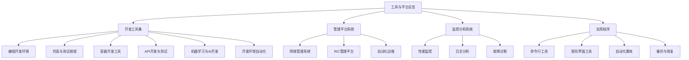
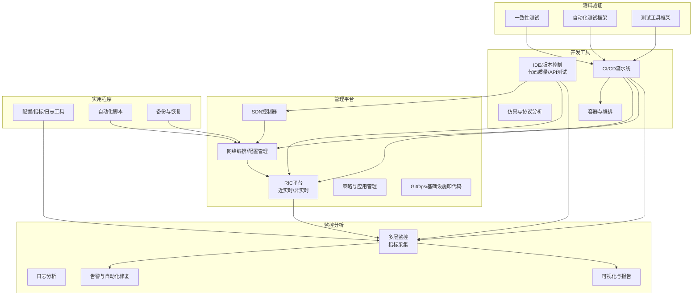
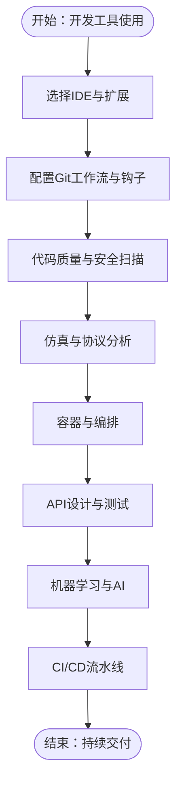
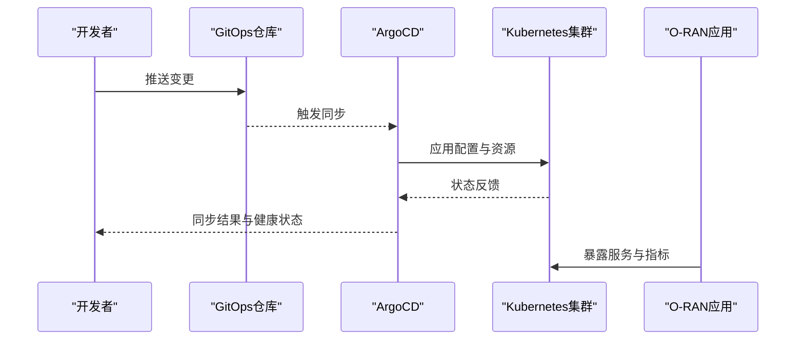
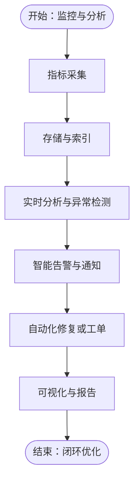
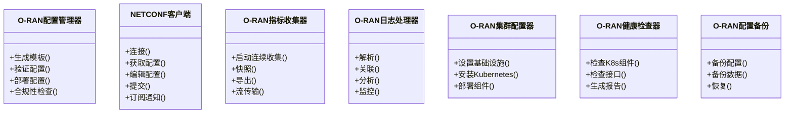
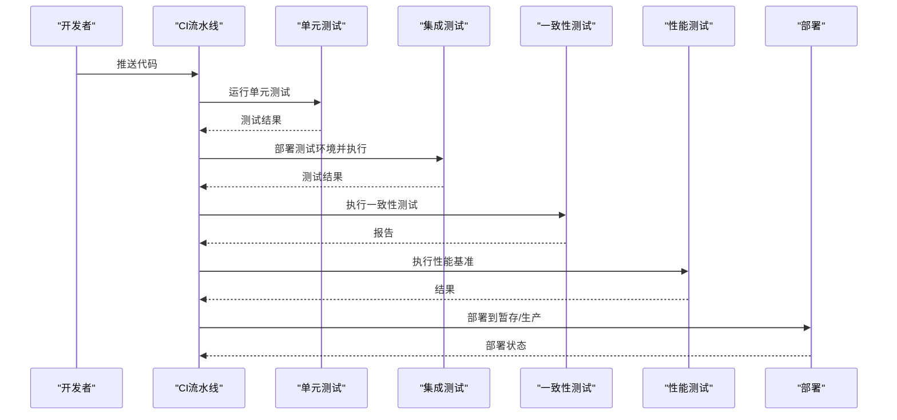
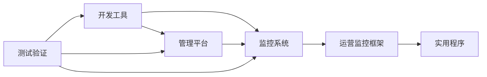

# 工具与平台

<cite>
**本文引用的文件**
- [工具与平台（总览）](file://22-tool-platforms/readme-zh.md)
- [O-RAN开发工具包](file://22-tool-platforms/development-tools/o-ran-development-toolkit-zh.md)
- [O-RAN管理平台](file://22-tool-platforms/management-platforms/o-ran-management-platforms-zh.md)
- [O-RAN监控系统](file://22-tool-platforms/monitoring-systems/o-ran-monitoring-systems-zh.md)
- [O-RAN实用程序](file://22-tool-platforms/utility-programs/o-ran-utility-programs-zh.md)
- [O-RAN运营监控告警系统](file://14-operations-management/monitoring-alerting/operations-monitoring-framework-zh.md)
- [O-RAN性能优化框架](file://14-operations-management/performance-optimization/performance-optimization-framework.md)
- [O-RAN一致性测试](file://13-testing-validation/conformance-testing/o-ran-conformance-testing-en.md)
- [O-RAN测试自动化框架](file://13-testing-validation/automation-framework/test-automation-framework-zh.md)
- [O-RAN测试工具框架](file://13-testing-validation/testing-tools/testing-tools-frameworks.md)
- [O-RAN开发者工具](file://17-open-source-ecosystem/developer-tools/oran-development-tools-zh.md)
</cite>

## 目录
1. [简介](#简介)
2. [项目结构](#项目结构)
3. [核心组件](#核心组件)
4. [架构总览](#架构总览)
5. [详细组件分析](#详细组件分析)
6. [依赖关系分析](#依赖关系分析)
7. [性能考虑](#性能考虑)
8. [故障排查指南](#故障排查指南)
9. [结论](#结论)
10. [附录](#附录)

## 简介
本文件面向O-RAN工具与平台的使用者，提供从开发工具、管理平台、监控分析到实用程序的系统化使用指导。内容覆盖：
- 开发工具集：IDE、版本控制、代码质量、API设计与测试、容器化与编排、仿真与协议分析
- 管理平台系统：网络管理（SDN控制器、编排与配置管理）、RIC管理平台（近实时与非实时）、自动化运维（CI/CD、基础设施即代码）
- 监控分析系统：性能监控、日志分析、故障诊断与预测性维护
- 实用程序：命令行工具、图形化工具、自动化脚本、备份与恢复
- 工具链集成与自动化：CI/CD流水线、测试自动化、部署自动化
- 工具选择与评估：基于场景与需求的选型建议

## 项目结构
该知识库围绕“工具与平台”主题，形成多层级文档体系：
- 顶层总览：工具与平台概览与分类
- 开发工具：开发环境、仿真测试、容器开发、API设计与测试、机器学习与AI、CI/CD流水线
- 管理平台：网络管理、RIC管理、自动化运维
- 监控系统：监控指标、日志分析、可视化与报告
- 实用程序：命令行工具、图形化工具、自动化脚本、备份与恢复
- 运维监控：运营监控框架、告警管理、自动化修复、性能优化
- 测试验证：一致性测试、自动化测试框架、测试工具框架
- 开发者生态：开源开发者工具与CI/CD最佳实践

**章节来源**
- file://22-tool-platforms/readme-zh.md#L1-L78

## 核心组件
- 开发工具集：IDE与版本控制、代码质量、API设计与测试、容器与编排、仿真与协议分析、CI/CD流水线
- 管理平台系统：SDN控制器、网络编排与配置管理、RIC平台（近实时与非实时）、策略与应用管理、自动化运维（GitOps、基础设施即代码）
- 监控分析系统：多层监控（基础设施/应用/业务）、指标采集与可视化、智能告警与自动化修复、日志分析与根因分析
- 实用程序：配置管理器、NETCONF客户端、指标收集器、日志处理器、集群配置器、健康检查器、备份工具
- 测试验证：一致性测试、自动化测试框架、测试工具框架
- 开发者生态：GitHub Actions流水线、Docker与Kubernetes部署、测试与覆盖率上报

**章节来源**
- file://22-tool-platforms/development-tools/o-ran-development-toolkit-zh.md#L1-L488
- file://22-tool-platforms/management-platforms/o-ran-management-platforms-zh.md#L1-L711
- file://22-tool-platforms/monitoring-systems/o-ran-monitoring-systems-zh.md#L1-L628
- file://22-tool-platforms/utility-programs/o-ran-utility-programs-zh.md#L1-L628
- file://14-operations-management/monitoring-alerting/operations-monitoring-framework-zh.md#L1-L909
- file://14-operations-management/performance-optimization/performance-optimization-framework.md#L450-L648
- file://13-testing-validation/conformance-testing/o-ran-conformance-testing-en.md#L517-L615
- file://13-testing-validation/automation-framework/test-automation-framework-zh.md#L1-L200
- file://13-testing-validation/testing-tools/testing-tools-frameworks.md#L359-L418
- file://17-open-source-ecosystem/developer-tools/oran-development-tools-zh.md#L800-L907

## 架构总览
下图展示了O-RAN工具与平台的整体架构：开发工具支撑应用与组件开发；管理平台负责网络与RIC的编排、配置与策略；监控分析系统贯穿基础设施、应用与业务层；实用程序与自动化脚本保障日常运维与故障处理；测试验证与开发者生态确保质量与交付效率。

**图表来源**
- file://22-tool-platforms/development-tools/o-ran-development-toolkit-zh.md#L1-L488
- file://22-tool-platforms/management-platforms/o-ran-management-platforms-zh.md#L1-L711
- file://22-tool-platforms/monitoring-systems/o-ran-monitoring-systems-zh.md#L1-L628
- file://22-tool-platforms/utility-programs/o-ran-utility-programs-zh.md#L1-L628
- file://14-operations-management/monitoring-alerting/operations-monitoring-framework-zh.md#L1-L909
- file://13-testing-validation/conformance-testing/o-ran-conformance-testing-en.md#L517-L615
- file://13-testing-validation/automation-framework/test-automation-framework-zh.md#L1-L200
- file://13-testing-validation/testing-tools/testing-tools-frameworks.md#L359-L418
- file://17-open-source-ecosystem/developer-tools/oran-development-tools-zh.md#L800-L907

## 详细组件分析

### 开发工具集
- 编程开发环境：IDE扩展（VS Code、JetBrains）、远程开发与容器集成、YAML/JSON工具与模式校验
- 版本控制与协作：Git工作流（分支策略、钩子）、代码质量工具（SonarQube、静态分析、安全扫描）
- 仿真与测试框架：NS-3 O-RAN扩展、Wireshark O-RAN配置、协议分析与测试
- 容器开发工具：Docker多阶段构建、Docker Compose、Kubernetes本地开发（kind/minikube/k3d）、Helm图表开发
- API开发与测试：OpenAPI/Swagger规范、Postman/Newman、契约测试（消费者驱动）、性能测试（k6/Locust）
- 机器学习与AI开发：TensorFlow/Keras流水线、特征工程、模型服务与版本化
- 开发环境自动化：GitHub Actions工作流（构建、测试、安全扫描、部署）

**图表来源**
- file://22-tool-platforms/development-tools/o-ran-development-toolkit-zh.md#L1-L488

**章节来源**
- file://22-tool-platforms/development-tools/o-ran-development-toolkit-zh.md#L1-L488

### 管理平台系统
- 网络管理系统：ONOS/OpenDaylight SDN控制器集成、YANG模型与NETCONF、拓扑与设备管理、事件处理
- RIC管理平台：O-RAN软件社区RIC、Aria Operations（VMware）电信云自动化、Helm图表与Kubernetes部署
- 自动化运维：ArgoCD GitOps仓库结构与应用配置、Terraform多云基础设施、Ansible剧本与滚动升级

**图表来源**
- file://22-tool-platforms/management-platforms/o-ran-management-platforms-zh.md#L538-L616

**章节来源**
- file://22-tool-platforms/management-platforms/o-ran-management-platforms-zh.md#L1-L711

### 监控分析系统
- 性能监控：基础设施（CPU/内存/磁盘/网络）、应用（响应时间/错误率/吞吐量）、业务（KPI/SLA/QoS）
- 日志分析：集中式日志（ELK/Splunk/Graylog）、实时分析与异常检测、可视化与报告
- 故障诊断：根因分析、智能告警、预测性维护、知识库系统

**图表来源**
- file://14-operations-management/monitoring-alerting/operations-monitoring-framework-zh.md#L1-L909
- file://22-tool-platforms/monitoring-systems/o-ran-monitoring-systems-zh.md#L1-L628

**章节来源**
- file://14-operations-management/monitoring-alerting/operations-monitoring-framework-zh.md#L1-L909
- file://22-tool-platforms/monitoring-systems/o-ran-monitoring-systems-zh.md#L1-L628

### 实用程序
- 命令行工具：网络诊断、系统监控、文件传输、进程管理
- 图形界面工具：网络拓扑、流程设计、文档编辑、数据可视化
- 自动化脚本：集群配置器（基础设施与Kubernetes部署）、健康检查器（K8s与接口连通性）、备份与恢复
- 实用程序工具：配置管理器（YANG模板与合规性）、NETCONF客户端、指标收集器、日志处理器

**图表来源**
- file://22-tool-platforms/utility-programs/o-ran-utility-programs-zh.md#L1-L628

**章节来源**
- file://22-tool-platforms/utility-programs/o-ran-utility-programs-zh.md#L1-L628

### 测试验证与自动化
- 一致性测试：CI/CD流水线集成（构建、单元测试、集成测试、一致性测试、性能测试、部署）
- 自动化测试框架：测试环境管理、测试执行与报告、覆盖率与基线对比
- 测试工具框架：Python测试自动化、Docker隔离测试、Kubernetes可扩展测试环境、Grafana/Prometheus监控

**图表来源**
- file://13-testing-validation/conformance-testing/o-ran-conformance-testing-en.md#L517-L615
- file://13-testing-validation/automation-framework/test-automation-framework-zh.md#L1-L200
- file://13-testing-validation/testing-tools/testing-tools-frameworks.md#L359-L418

**章节来源**
- file://13-testing-validation/conformance-testing/o-ran-conformance-testing-en.md#L517-L615
- file://13-testing-validation/automation-framework/test-automation-framework-zh.md#L1-L200
- file://13-testing-validation/testing-tools/testing-tools-frameworks.md#L359-L418

### 开发者生态与工具链集成
- GitHub Actions工作流：矩阵构建、代码质量检查、单元/集成测试、Docker镜像构建与推送、Kubernetes部署
- Docker与Kubernetes：多阶段构建、本地开发集群（kind/minikube/k3d）、Helm图表与测试
- 测试与覆盖率：pytest、覆盖率上报、Junit/XML报告

**章节来源**
- file://17-open-source-ecosystem/developer-tools/oran-development-tools-zh.md#L800-L907

## 依赖关系分析
- 开发工具依赖管理平台：开发产出通过CI/CD进入管理平台，管理平台提供运行时环境与可观测性
- 监控分析依赖管理平台：监控数据来自管理平台组件与基础设施，告警与修复联动管理平台的配置与策略
- 实用程序支撑日常运维：配置管理器与备份工具直接作用于管理平台与基础设施
- 测试验证贯穿全链路：从开发到部署的每个环节均需测试验证

**图表来源**
- file://22-tool-platforms/development-tools/o-ran-development-toolkit-zh.md#L1-L488
- file://22-tool-platforms/management-platforms/o-ran-management-platforms-zh.md#L1-L711
- file://22-tool-platforms/monitoring-systems/o-ran-monitoring-systems-zh.md#L1-L628
- file://22-tool-platforms/utility-programs/o-ran-utility-programs-zh.md#L1-L628
- file://14-operations-management/monitoring-alerting/operations-monitoring-framework-zh.md#L1-L909
- file://13-testing-validation/conformance-testing/o-ran-conformance-testing-en.md#L517-L615
- file://13-testing-validation/automation-framework/test-automation-framework-zh.md#L1-L200
- file://13-testing-validation/testing-tools/testing-tools-frameworks.md#L359-L418
- file://17-open-source-ecosystem/developer-tools/oran-development-tools-zh.md#L800-L907

**章节来源**
- file://22-tool-platforms/development-tools/o-ran-development-toolkit-zh.md#L1-L488
- file://22-tool-platforms/management-platforms/o-ran-management-platforms-zh.md#L1-L711
- file://22-tool-platforms/monitoring-systems/o-ran-monitoring-systems-zh.md#L1-L628
- file://22-tool-platforms/utility-programs/o-ran-utility-programs-zh.md#L1-L628
- file://14-operations-management/monitoring-alerting/operations-monitoring-framework-zh.md#L1-L909
- file://13-testing-validation/conformance-testing/o-ran-conformance-testing-en.md#L517-L615
- file://13-testing-validation/automation-framework/test-automation-framework-zh.md#L1-L200
- file://13-testing-validation/testing-tools/testing-tools-frameworks.md#L359-L418
- file://17-open-source-ecosystem/developer-tools/oran-development-tools-zh.md#L800-L907

## 性能考虑
- 性能优化框架：趋势分析、瓶颈识别、资源优化与自动调优，结合监控指标生成优化报告
- 监控指标：基础设施、应用与业务三层指标，支持实时与历史分析
- 自动化修复：针对高CPU、内存耗尽、RIC无响应等场景的自动扩缩容与重启

**章节来源**
- file://14-operations-management/performance-optimization/performance-optimization-framework.md#L450-L648
- file://14-operations-management/monitoring-alerting/operations-monitoring-framework-zh.md#L1-L909

## 故障排查指南
- 运营监控框架：指标采集、智能告警、告警关联与去重、通知渠道、自动化修复
- 实用程序：健康检查器（K8s与接口连通性）、备份与恢复脚本、日志分析与根因分析
- 常见问题定位：CPU/内存/磁盘/网络资源，接口可用性，服务响应时间，业务KPI与SLA

**章节来源**
- file://14-operations-management/monitoring-alerting/operations-monitoring-framework-zh.md#L1-L909
- file://22-tool-platforms/utility-programs/o-ran-utility-programs-zh.md#L1-L628

## 结论
本指南系统梳理了O-RAN工具与平台的开发、管理、监控与运维全链路工具集，提供了从环境搭建、测试验证到自动化运维的最佳实践与参考实现。建议按需选择工具组合，并结合实际部署场景进行定制化配置与优化。

## 附录
- 工具选择与评估：根据项目规模、团队技能、合规要求与预算，评估工具的易用性、可扩展性与生态成熟度
- 集成与自动化：优先采用GitOps与CI/CD流水线，统一配置与部署，提升交付效率与一致性