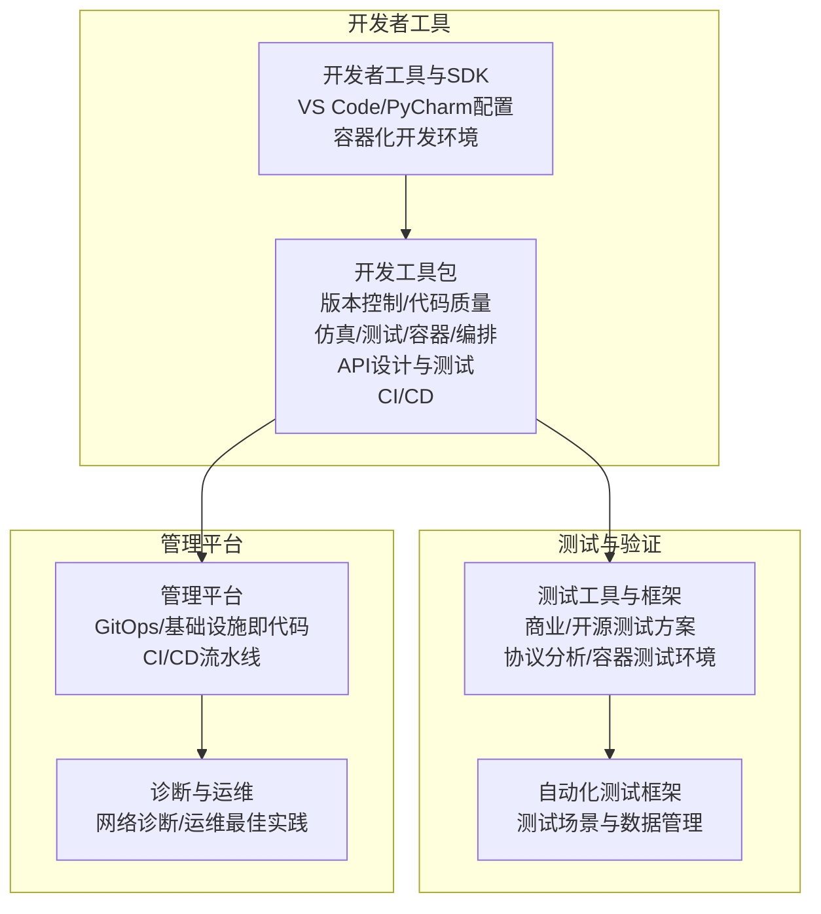
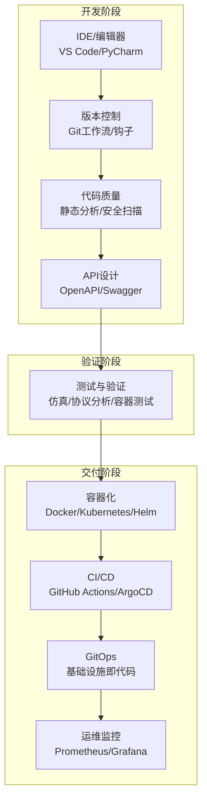
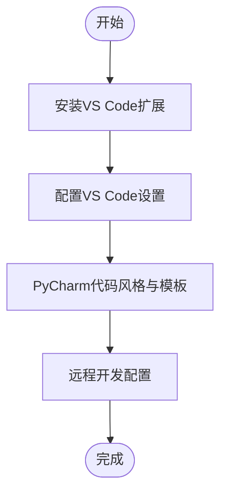
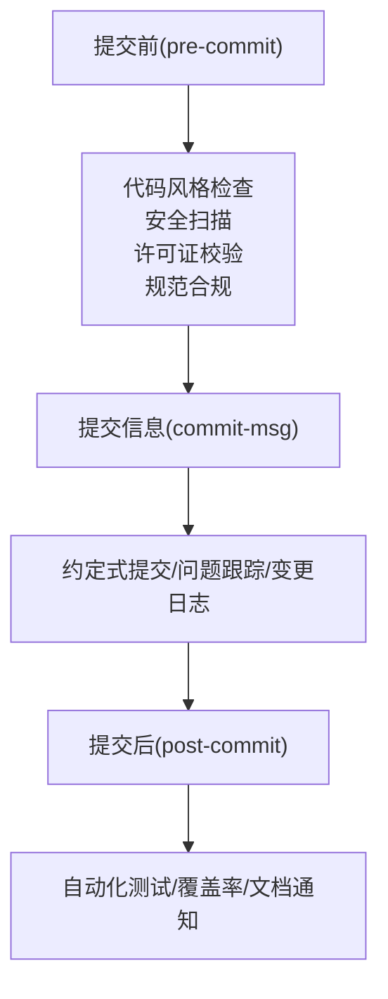
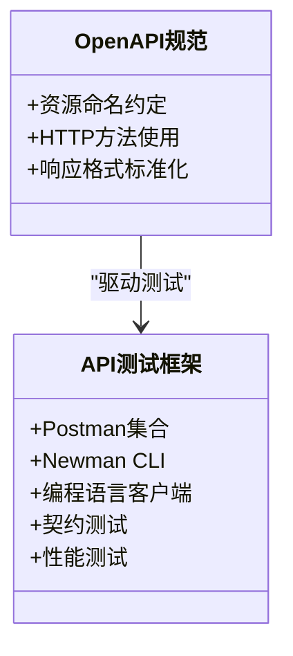
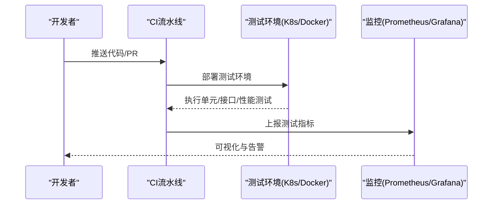
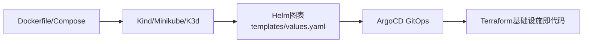
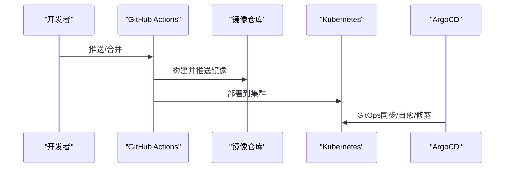
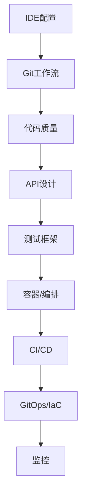
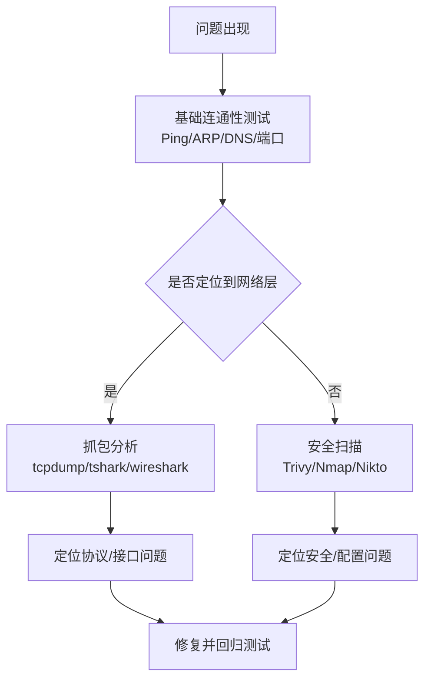

# 开发工具

<cite>
**本文引用的文件**
- [O-RAN 开发者工具和SDK](file://17-open-source-ecosystem/developer-tools/oran-development-tools-zh.md)
- [O-RAN Developer Tools and SDKs](file://17-open-source-ecosystem/developer-tools/oran-development-tools.md)
- [O-RAN 开发工具包](file://22-tool-platforms/development-tools/o-ran-development-toolkit-zh.md)
- [O-RAN Development Toolkit](file://22-tool-platforms/development-tools/o-ran-development-toolkit.md)
- [O-RAN 测试工具和框架](file://13-testing-validation/testing-tools/testing-tools-frameworks.md)
- [O-RAN 网络仿真和测试](file://13-testing-validation/automation-framework/test-automation-framework-zh.md)
- [O-RAN 诊断仪器](file://27-troubleshooting-diagnosis/diagnostic-tools/o-ran-diagnostic-instrumentation.md)
- [O-RAN 管理平台](file://22-tool-platforms/management-platforms/o-ran-management-platforms-zh.md)
- [O-RAN 接口标准：F1 接口](file://03-interface-standards/f1-interface.md)
- [O-RAN 架构演进](file://01-architecture-system/architecture-evolution.md)
- [O-RAN 核心组件：O-CU](file://02-core-components/o-cu.md)
</cite>

## 目录
1. [简介](#简介)
2. [项目结构](#项目结构)
3. [核心组件](#核心组件)
4. [架构总览](#架构总览)
5. [详细组件分析](#详细组件分析)
6. [依赖关系分析](#依赖关系分析)
7. [性能考虑](#性能考虑)
8. [故障排除指南](#故障排除指南)
9. [结论](#结论)
10. [附录](#附录)

## 简介
本指南面向O-RAN项目开发团队，系统梳理从IDE集成、版本控制、代码质量、仿真测试到容器化与编排的完整工具链，结合仓库中的开发者工具、测试框架与管理平台文档，提供可落地的配置步骤、最佳实践与排障建议，帮助开发者高效构建、验证与交付O-RAN系统。

## 项目结构
围绕O-RAN开发工具，仓库主要包含以下几类文档：
- 开发者工具与SDK：IDE集成、开发环境、容器化脚本与模板
- 开发工具包：版本控制、代码质量、仿真与测试框架、API设计与测试、容器与编排、CI/CD
- 测试与验证：商业与开源测试方案、协议分析、容器化测试环境、持续集成测试
- 管理平台：GitOps、基础设施即代码、CI/CD流水线
- 诊断与运维：网络诊断工具、运维最佳实践

**章节来源**
- file://17-open-source-ecosystem/developer-tools/oran-development-tools-zh.md#L1-L995
- file://22-tool-platforms/development-tools/o-ran-development-toolkit-zh.md#L1-L488
- file://13-testing-validation/testing-tools/testing-tools-frameworks.md#L1-L598
- file://22-tool-platforms/management-platforms/o-ran-management-platforms-zh.md#L534-L616
- file://27-troubleshooting-diagnosis/diagnostic-tools/o-ran-diagnostic-instrumentation.md#L134-L202

## 核心组件
- IDE与编辑器：VS Code扩展推荐、PyCharm代码风格与模板、远程开发配置
- 版本控制与协作：Git分支策略、钩子配置、代码质量工具
- 代码质量与API设计：静态分析、安全扫描、OpenAPI规范与测试框架
- 仿真与测试：网络仿真器、协议分析器、容器化测试环境、持续集成测试
- 容器与编排：Docker开发环境、Kubernetes本地集群、Helm图表开发
- CI/CD与GitOps：GitHub Actions工作流、ArgoCD GitOps、基础设施即代码

**章节来源**
- file://17-open-source-ecosystem/developer-tools/oran-development-tools-zh.md#L416-L477
- file://22-tool-platforms/development-tools/o-ran-development-toolkit-zh.md#L6-L62
- file://22-tool-platforms/development-tools/o-ran-development-toolkit-zh.md#L64-L109
- file://22-tool-platforms/development-tools/o-ran-development-toolkit-zh.md#L111-L172
- file://22-tool-platforms/development-tools/o-ran-development-toolkit-zh.md#L174-L257
- file://22-tool-platforms/development-tools/o-ran-development-toolkit-zh.md#L259-L366
- file://22-tool-platforms/development-tools/o-ran-development-toolkit-zh.md#L417-L486
- file://13-testing-validation/testing-tools/testing-tools-frameworks.md#L6-L97
- file://13-testing-validation/testing-tools/testing-tools-frameworks.md#L258-L366
- file://22-tool-platforms/management-platforms/o-ran-management-platforms-zh.md#L534-L616

## 架构总览
下图展示O-RAN开发工具链的整体架构：从IDE与版本控制，到代码质量与API设计，再到仿真测试、容器与编排，最终进入CI/CD与GitOps运维闭环。

**图表来源**
- [O-RAN 开发工具包](file://22-tool-platforms/development-tools/o-ran-development-toolkit-zh.md#L6-L109)
- [O-RAN 测试工具和框架](file://13-testing-validation/testing-tools/testing-tools-frameworks.md#L258-L366)
- [O-RAN 管理平台](file://22-tool-platforms/management-platforms/o-ran-management-platforms-zh.md#L534-L616)

## 详细组件分析

### IDE与编辑器配置（VS Code、PyCharm）
- VS Code扩展推荐：Python/C++/YAML、Kubernetes/Docker、GitLens、ShellCheck、十六进制编辑器等
- VS Code设置要点：Python解释器、格式化、Lint启用、YAML模式绑定、文件关联
- PyCharm代码风格：右边界、运算符空格、注释风格；项目模板与远程开发配置
- 远程开发：SSH/SFTP、Docker容器开发、Kubernetes集群集成、云开发环境

**图表来源**
- [O-RAN 开发者工具和SDK](file://17-open-source-ecosystem/developer-tools/oran-development-tools-zh.md#L418-L477)
- [O-RAN 开发工具包](file://22-tool-platforms/development-tools/o-ran-development-toolkit-zh.md#L10-L62)

**章节来源**
- file://17-open-source-ecosystem/developer-tools/oran-development-tools-zh.md#L416-L477
- file://22-tool-platforms/development-tools/o-ran-development-toolkit-zh.md#L6-L62

### 版本控制与协作（Git）
- 分支策略：主干、集成、特性、发布、热修复
- Git钩子：pre-commit（代码风格、安全扫描、许可证校验、规范合规）、commit-msg（约定式提交、问题跟踪、变更日志）、post-commit（自动化测试、覆盖率、文档通知）
- 代码质量工具：SonarQube定制质量配置、语言特定Linter、SAST/SCA/容器/基础设施扫描

**图表来源**
- [O-RAN 开发工具包](file://22-tool-platforms/development-tools/o-ran-development-toolkit-zh.md#L66-L89)

**章节来源**
- file://22-tool-platforms/development-tools/o-ran-development-toolkit-zh.md#L64-L109

### 代码质量与API设计
- 静态分析与安全扫描：SonarQube、各语言Linter、SAST/SCA/容器/基础设施扫描
- OpenAPI/Swagger：资源命名、HTTP方法、响应格式标准化
- API测试：Postman集合、Newman、编程语言客户端、契约测试、性能测试

**图表来源**
- [O-RAN 开发工具包](file://22-tool-platforms/development-tools/o-ran-development-toolkit-zh.md#L259-L366)

**章节来源**
- file://22-tool-platforms/development-tools/o-ran-development-toolkit-zh.md#L91-L109
- file://22-tool-platforms/development-tools/o-ran-development-toolkit-zh.md#L259-L366

### 仿真与测试框架
- 网络仿真平台：NS-3 O-RAN扩展（PHY层、前传网络、RIC功能仿真），仿真场景（小站/宏站/室内优化/农村部署）
- 协议分析与测试：Wireshark O-RAN配置文件（捕获过滤器、显示过滤器、自定义解码器）
- 容器化测试环境：Dockerfile、Kubernetes部署与配置映射
- 持续集成测试：CI流水线（单元/接口/性能测试）、测试数据管理、Prometheus/Grafana监控

**图表来源**
- [O-RAN 测试工具和框架](file://13-testing-validation/testing-tools/testing-tools-frameworks.md#L363-L418)
- [O-RAN 测试工具和框架](file://13-testing-validation/testing-tools/testing-tools-frameworks.md#L481-L559)

**章节来源**
- file://22-tool-platforms/development-tools/o-ran-development-toolkit-zh.md#L111-L172
- file://13-testing-validation/testing-tools/testing-tools-frameworks.md#L6-L97
- file://13-testing-validation/testing-tools/testing-tools-frameworks.md#L258-L366
- file://13-testing-validation/testing-tools/testing-tools-frameworks.md#L361-L418
- file://13-testing-validation/testing-tools/testing-tools-frameworks.md#L481-L559

### 容器化与编排
- Docker开发环境：多阶段构建（构建/运行/调试）、Compose服务定义（端口/环境/卷）
- Kubernetes开发工具：kind/minikube/k3d本地集群、Helm图表结构与模板函数、测试框架
- GitOps与基础设施即代码：ArgoCD应用配置、Terraform模块（多云/网络/计算）

**图表来源**
- [O-RAN 开发工具包](file://22-tool-platforms/development-tools/o-ran-development-toolkit-zh.md#L174-L257)
- [O-RAN 管理平台](file://22-tool-platforms/management-platforms/o-ran-management-platforms-zh.md#L534-L616)

**章节来源**
- file://22-tool-platforms/development-tools/o-ran-development-toolkit-zh.md#L174-L257
- file://22-tool-platforms/management-platforms/o-ran-management-platforms-zh.md#L534-L616

### CI/CD与GitOps
- GitHub Actions工作流：矩阵构建、代码质量检查、测试、Docker镜像构建与推送、Kubernetes部署
- ArgoCD GitOps：仓库结构、应用配置、同步策略、差异忽略、联系人与频道
- 基础设施即代码：多云O-RAN基础设施、网络与安全组、Kubernetes集群模块

**图表来源**
- [O-RAN 开发者工具和SDK](file://17-open-source-ecosystem/developer-tools/oran-development-tools-zh.md#L802-L907)
- [O-RAN 管理平台](file://22-tool-platforms/management-platforms/o-ran-management-platforms-zh.md#L534-L616)
- [O-RAN 管理平台](file://22-tool-platforms/management-platforms/o-ran-management-platforms-zh.md#L618-L709)

**章节来源**
- file://17-open-source-ecosystem/developer-tools/oran-development-tools-zh.md#L800-L907
- file://22-tool-platforms/management-platforms/o-ran-management-platforms-zh.md#L534-L616
- file://22-tool-platforms/management-platforms/o-ran-management-platforms-zh.md#L618-L709

## 依赖关系分析
- 组件耦合：IDE配置依赖版本控制与代码质量工具；测试框架依赖容器与编排；CI/CD依赖GitOps与基础设施即代码
- 外部依赖：Kubernetes、Helm、ArgoCD、Prometheus/Grafana、Terraform、Wireshark等
- 潜在环依赖：工具链以流水线串联，避免直接循环依赖

**图表来源**
- [O-RAN 开发工具包](file://22-tool-platforms/development-tools/o-ran-development-toolkit-zh.md#L6-L109)
- [O-RAN 测试工具和框架](file://13-testing-validation/testing-tools/testing-tools-frameworks.md#L363-L418)
- [O-RAN 管理平台](file://22-tool-platforms/management-platforms/o-ran-management-platforms-zh.md#L534-L616)

**章节来源**
- file://22-tool-platforms/development-tools/o-ran-development-toolkit-zh.md#L6-L109
- file://13-testing-validation/testing-tools/testing-tools-frameworks.md#L363-L418
- file://22-tool-platforms/management-platforms/o-ran-management-platforms-zh.md#L534-L616

## 性能考虑
- 测试性能：使用k6/Locust进行负载/压力/尖峰/浸泡测试，结合Prometheus指标与Grafana仪表盘
- 容器性能：多阶段构建、非root运行、健康检查、资源限制
- 网络仿真：NS-3与OMNeT++场景设计，关注延迟、抖动、吞吐与丢包率
- 协议分析：Wireshark过滤器与解码器提升分析效率，降低排查成本

**章节来源**
- file://13-testing-validation/testing-tools/testing-tools-frameworks.md#L361-L366
- file://22-tool-platforms/development-tools/o-ran-development-toolkit-zh.md#L176-L194
- file://22-tool-platforms/development-tools/o-ran-development-toolkit-zh.md#L115-L139
- file://13-testing-validation/testing-tools/testing-tools-frameworks.md#L63-L91

## 故障排除指南
- 网络连通性：ICMP/Ping、ARP、DNS、端口与服务测试、路由追踪、带宽与性能测试
- 包捕获与分析：tcpdump/tshark/wireshark/ngrep
- 安全扫描：Trivy、Clair、Nmap、Nikto、OWASP/ZAP
- 运维最佳实践：监控体系、自动化运维、容量管理、高可用与灾备

**图表来源**
- [O-RAN 诊断仪器](file://27-troubleshooting-diagnosis/diagnostic-tools/o-ran-diagnostic-instrumentation.md#L134-L202)
- [O-RAN 测试工具和框架](file://13-testing-validation/testing-tools/testing-tools-frameworks.md#L561-L596)

**章节来源**
- file://27-troubleshooting-diagnosis/diagnostic-tools/o-ran-diagnostic-instrumentation.md#L134-L202
- file://13-testing-validation/testing-tools/testing-tools-frameworks.md#L561-L596

## 结论
本指南基于仓库现有文档，系统化梳理了O-RAN开发所需的IDE配置、版本控制、代码质量、仿真测试、容器与编排以及CI/CD/GitOps。建议团队按“开发—验证—交付—运维”闭环推进，结合Wireshark、NS-3/OMNeT++、容器与Kubernetes等工具，构建稳定高效的O-RAN开发与验证体系。

## 附录
- 实际使用示例与脚本路径参考：
  - VS Code扩展与设置：见“O-RAN 开发者工具和SDK”
  - PyCharm代码风格与模板：见“O-RAN 开发工具包”
  - Git工作流与钩子：见“O-RAN 开发工具包”
  - OpenAPI/Swagger与API测试：见“O-RAN 开发工具包”
  - Docker/Kubernetes/Helm：见“O-RAN 开发工具包”
  - GitHub Actions工作流：见“O-RAN 开发者工具和SDK”
  - ArgoCD与基础设施即代码：见“O-RAN 管理平台”
  - 协议分析与测试：见“O-RAN 测试工具和框架”
  - 网络诊断工具：见“O-RAN 诊断仪器”

**章节来源**
- file://17-open-source-ecosystem/developer-tools/oran-development-tools-zh.md#L416-L477
- file://22-tool-platforms/development-tools/o-ran-development-toolkit-zh.md#L6-L62
- file://22-tool-platforms/development-tools/o-ran-development-toolkit-zh.md#L64-L109
- file://22-tool-platforms/development-tools/o-ran-development-toolkit-zh.md#L259-L366
- file://22-tool-platforms/development-tools/o-ran-development-toolkit-zh.md#L174-L257
- file://17-open-source-ecosystem/developer-tools/oran-development-tools-zh.md#L800-L907
- file://22-tool-platforms/management-platforms/o-ran-management-platforms-zh.md#L534-L616
- file://13-testing-validation/testing-tools/testing-tools-frameworks.md#L6-L97
- file://27-troubleshooting-diagnosis/diagnostic-tools/o-ran-diagnostic-instrumentation.md#L134-L202