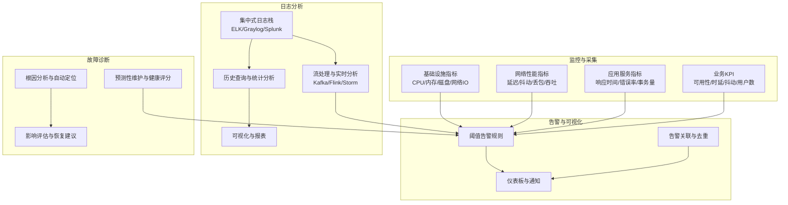
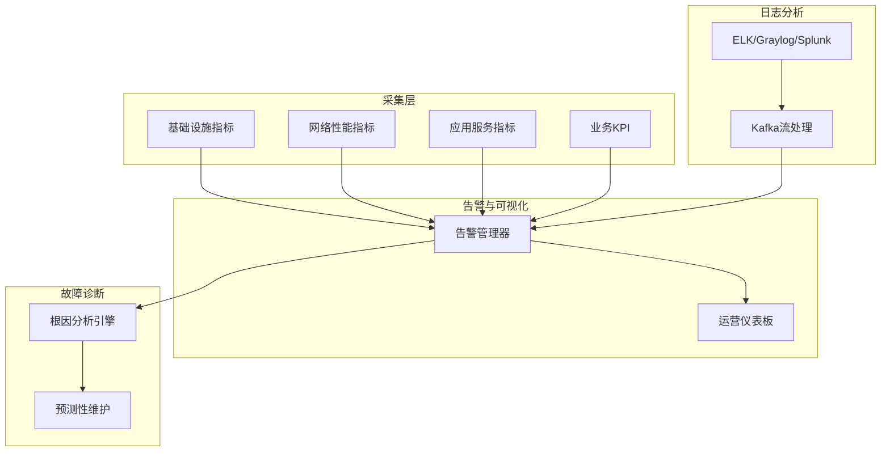
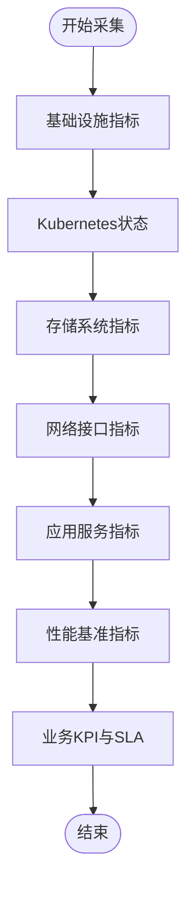
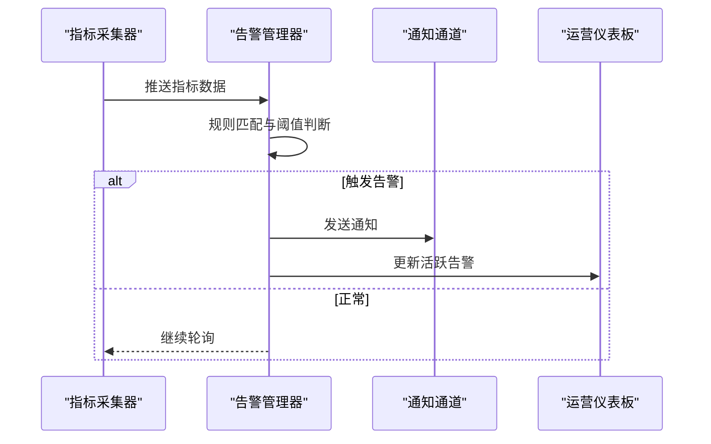
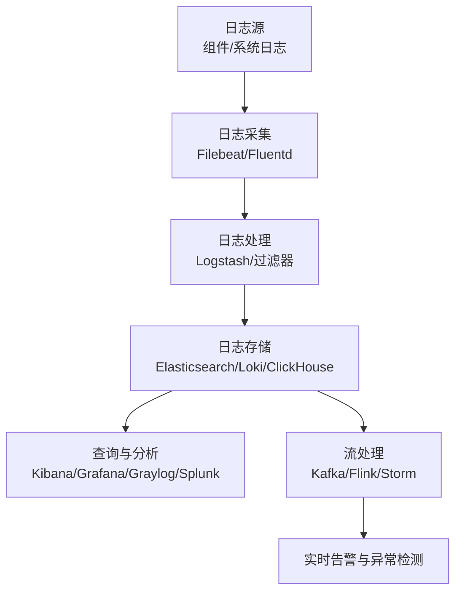
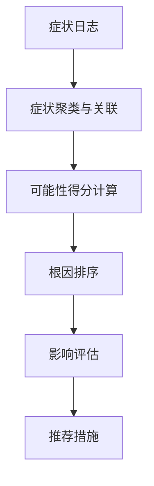
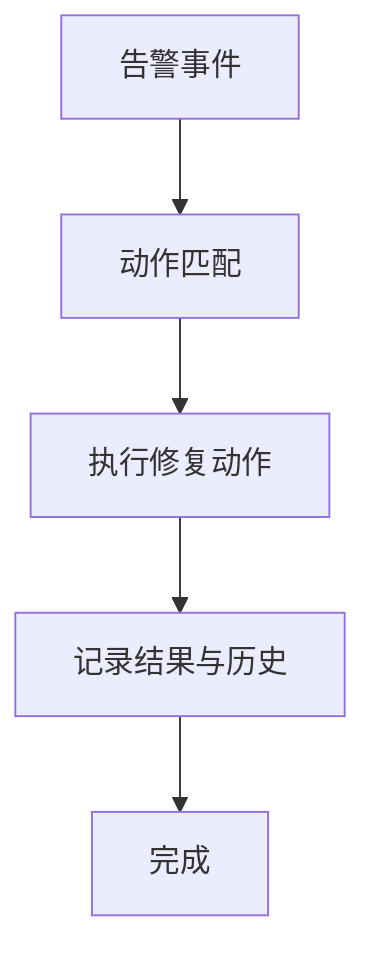
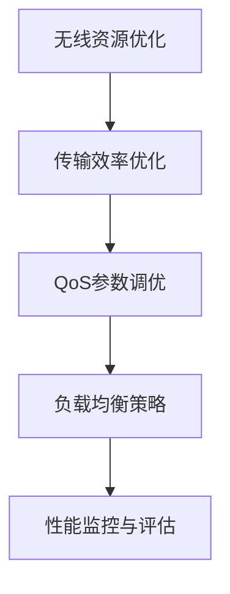
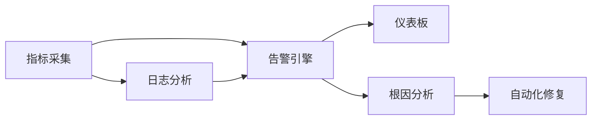

# 监控系统

<cite>
**本文引用的文件**
- [README（监控与告警）](file://28-monitoring-alerting/readme.md)
- [O-RAN 运营监控告警系统（中文）](file://14-operations-management/monitoring-alerting/operations-monitoring-framework-zh.md)
- [O-RAN 故障处理与排障指南（中文）](file://14-operations-management/fault-handling/fault-troubleshooting-guide.md)
- [O-RAN 网络性能优化实践（中文）](file://26-performance-optimization/network-optimization/network-performance-tuning.md)
- [O-RAN 监控系统（英文）](file://22-tool-platforms/monitoring-systems/o-ran-monitoring-systems.md)
- [O-RAN 性能监控工具（中文）](file://26-performance-optimization/monitoring-tools/o-ran-monitoring-tools-zh.md)
- [O-RAN 性能监控工具（英文）](file://26-performance-优化/monitoring-tools/o-ran-monitoring-tools.md)
- [O-RAN 监控与告警（中文）](file://28-monitoring-alerting/alert-strategy/o-ran-alert-strategy.md)
</cite>

## 目录
1. [简介](#简介)
2. [项目结构](#项目结构)
3. [核心组件](#核心组件)
4. [架构总览](#架构总览)
5. [详细组件分析](#详细组件分析)
6. [依赖关系分析](#依赖关系分析)
7. [性能考虑](#性能考虑)
8. [故障排查指南](#故障排查指南)
9. [结论](#结论)
10. [附录](#附录)

## 简介
本文件面向O-RAN监控系统，提供端到端的监控与分析指导，覆盖网络性能指标（延迟、吞吐量、丢包率）、系统资源监控（CPU、内存、磁盘、网络利用率）、应用性能监控（响应时间、错误率、事务量）与用户体验监控（页面加载时间、业务成功率）。同时，系统包含日志分析（集中式日志管理、实时分析与异常检测、历史查询与统计分析、可视化展示与报表生成）、故障诊断（根因分析、智能告警、预测性维护、知识库系统）与自动化修复流程，并给出监控指标选择原则与告警阈值设置的最佳实践。

## 项目结构
围绕O-RAN监控体系，仓库内形成“监控指标体系 + 告警与可视化 + 日志分析 + 故障诊断 + 性能优化”的分层组织方式：
- 监控指标与采集：基础设施、网络性能、应用服务、业务KPI
- 告警与可视化：阈值告警、关联与去重、仪表板与通知
- 日志分析：ELK/Graylog/Splunk等集中式日志栈、流处理与实时告警
- 故障诊断：根因分析、自动定位、影响评估与推荐措施
- 性能优化：无线资源、传输效率、QoS参数、负载均衡与监控指标

**章节来源**
- file://28-monitoring-alerting/readme.md#L1-L24
- file://22-tool-platforms/monitoring-systems/o-ran-monitoring-systems.md#L1-L545

## 核心组件
- 指标采集与分类：按基础设施、应用服务、网络函数、业务质量四个层级进行指标采集与归类，覆盖节点资源、Kubernetes状态、存储与网络接口、RIC状态、接口可用性、微服务健康度、性能基准、KPI与SLA等。
- 告警引擎：基于阈值规则与指标路径提取，支持告警去重、关联与分级通知；提供告警规则模板与通知通道配置。
- 可视化与仪表板：提供实时运营仪表板与图表组件，展示CPU/内存/磁盘使用率、RIC响应时间、吞吐量、延迟、丢包率、业务指标与活跃告警。
- 日志分析：ELK/Graylog/Splunk集中式日志架构，结合Filebeat/Fluentd/Logstash进行采集、解析与路由，支持Kafka流处理与实时异常检测。
- 故障诊断：根因分析框架，基于症状聚类与依赖图，计算可能性得分，输出影响评估与推荐措施。
- 自动化修复：针对典型告警场景（高CPU、内存耗尽、RIC无响应）制定修复动作清单与执行流程，记录修复历史。

**章节来源**
- file://14-operations-management/monitoring-alerting/operations-monitoring-framework-zh.md#L46-L260
- file://14-operations-management/monitoring-alerting/operations-monitoring-framework-zh.md#L262-L486
- file://22-tool-platforms/monitoring-systems/o-ran-monitoring-systems.md#L80-L131
- file://22-tool-platforms/monitoring-systems/o-ran-monitoring-systems.md#L133-L263
- file://14-operations-management/fault-handling/fault-troubleshooting-guide.md#L100-L180
- file://14-operations-management/monitoring-alerting/operations-monitoring-framework-zh.md#L694-L909

## 架构总览
下图展示了O-RAN监控系统的整体架构：指标采集层（基础设施/网络/应用/业务）、告警与可视化层（阈值规则/关联/仪表板）、日志分析层（集中式日志栈/流处理）、故障诊断层（根因分析/影响评估/预测性维护）。

**图表来源**
- [O-RAN 监控系统（英文）](file://22-tool-platforms/monitoring-systems/o-ran-monitoring-systems.md#L1-L545)
- [O-RAN 运营监控告警系统（中文）](file://14-operations-management/monitoring-alerting/operations-monitoring-framework-zh.md#L1-L909)

**章节来源**
- file://22-tool-platforms/monitoring-systems/o-ran-monitoring-systems.md#L1-L545
- file://14-operations-management/monitoring-alerting/operations-monitoring-framework-zh.md#L1-L909

## 详细组件分析

### 指标采集与分类
- 基础设施层：CPU使用率、内存占用、磁盘IO、网络吞吐、节点运行时长等。
- 虚拟化与容器层：Kubernetes节点就绪状态、集群健康、容器资源消耗、虚拟机性能与宿主机健康。
- 应用层：近实时RIC与非实时RIC状态、E2/A1/O1接口可用性、服务响应时间、事务量、消息延迟与错误率。
- 网络函数层：O-CU到O-DU连通性、O-RU定时同步、控制面/用户面性能。
- 业务层：KPI测量、SLA合规、服务质量、收入影响事件。

**章节来源**
- file://14-operations-management/monitoring-alerting/operations-monitoring-framework-zh.md#L46-L260

### 告警引擎与可视化
- 阈值告警：支持按指标路径提取与阈值比较，自动创建告警并去重；提供通知渠道（邮件/微信/短信）。
- 告警关联与去重：基于规则对同时发生或具有因果关系的告警进行合并与升级。
- 可视化仪表板：实时展示系统健康状态、基础设施与应用性能、网络KPI与业务指标，支持图表与告警列表联动。

**章节来源**
- file://14-operations-management/monitoring-alerting/operations-monitoring-framework-zh.md#L262-L486
- file://14-operations-management/monitoring-alerting/operations-monitoring-framework-zh.md#L530-L692

### 日志分析系统
- 集中式日志栈：Filebeat/Fluentd/Logstash负责采集与处理，Elasticsearch/OpenSearch/Loki负责存储与索引，Kibana/Grafana/Graylog/Splunk负责可视化与告警。
- 实时分析：通过Kafka/Flink/Storm进行流式处理，实现异常检测、模式匹配与告警生成。
- 历史查询与统计：基于索引生命周期管理、标签化索引与SQL/DSL查询，支持趋势预测与报表生成。

**章节来源**
- file://22-tool-platforms/monitoring-systems/o-ran-monitoring-systems.md#L133-L263
- file://26-performance-optimization/monitoring-tools/o-ran-monitoring-tools-zh.md#L76-L144
- file://26-performance-optimization/monitoring-tools/o-ran-monitoring-tools.md#L76-L144

### 故障诊断系统
- 根因分析：构建组件依赖图，基于症状聚类与时间聚类计算可能性得分，识别最可能根因。
- 影响评估：量化受影响小区/用户规模、服务降级程度与预计恢复时间。
- 推荐措施：提供清洁/校准/冗余部署等可执行建议。

**章节来源**
- file://14-operations-management/fault-handling/fault-troubleshooting-guide.md#L100-L180
- file://22-tool-platforms/monitoring-systems/o-ran-monitoring-systems.md#L265-L353

### 自动化修复
- 修复动作匹配：根据告警标题关键词匹配到预设修复动作（如扩缩容、重启、清理缓存、检查连接）。
- 执行与记录：执行子流程并记录结果，支持超时与错误回退，维护修复历史。

**章节来源**
- file://14-operations-management/monitoring-alerting/operations-monitoring-framework-zh.md#L694-L909

### 性能优化与网络调优
- 无线资源优化：载波聚合、MCS自适应、干扰协调与波束赋形。
- 传输效率优化：ROHC头部压缩、协议栈优化、QoS参数精细化配置。
- QoS与时延抖动控制：DRB配置、调度策略、队列管理与流量整形。
- 负载均衡：移动性管理、动态资源池与容量弹性。

**章节来源**
- file://26-performance-optimization/network-optimization/network-performance-tuning.md#L1-L98

## 依赖关系分析
- 指标采集依赖系统与网络工具（psutil、net_io_counters、kubectl API），用于节点、K8s、存储与网络指标的采集。
- 告警引擎依赖指标数据结构与阈值规则，输出告警并驱动通知与仪表板更新。
- 日志分析依赖集中式日志栈与流处理框架，支撑实时异常检测与历史分析。
- 故障诊断依赖症状聚类与依赖图，结合历史案例与权重因子计算根因概率。
- 自动化修复依赖kubectl与系统命令，执行扩缩容、重启与缓存清理等操作。

**章节来源**
- file://14-operations-management/monitoring-alerting/operations-monitoring-framework-zh.md#L46-L260
- file://22-tool-platforms/monitoring-systems/o-ran-monitoring-systems.md#L1-L545
- file://14-operations-management/fault-handling/fault-troubleshooting-guide.md#L100-L180

## 性能考虑
- 指标采样与存储：合理设置采集间隔与保留周期，避免高基数标签导致存储膨胀。
- 告警风暴治理：通过阈值去抖、告警聚合与分级抑制，降低噪声与误报。
- 日志处理吞吐：采用多实例负载均衡、索引分层与异步写入，保障高并发场景下的稳定性。
- 诊断与修复自动化：在低风险场景采用自动修复，减少人工干预与MTTR。

## 故障排查指南
- 故障分类：网络功能、接口协议、基础设施与平台、安全组件等。
- 诊断步骤：初始问题识别、日志分析、症状聚类与根因定位、影响评估与恢复建议。
- 常见场景：E2接口连接建立失败、F1接口吞吐与延迟问题、O-FH同步问题。
- 预防与自动恢复：建立健康检查与预测性分析，配置自动恢复脚本与维护计划。

**章节来源**
- file://14-operations-management/fault-handling/fault-troubleshooting-guide.md#L1-L633

## 结论
O-RAN监控系统通过“指标采集—告警与可视化—日志分析—故障诊断—预测性维护—自动化修复”的闭环设计，实现了对网络性能、系统资源、应用服务与用户体验的全栈可观测性。结合告警阈值与规则模板、集中式日志与流处理、根因分析与健康评分，能够显著缩短故障定位与恢复时间，提升网络可靠性与运营效率。

## 附录
- 指标选择原则：聚焦关键KPI、覆盖端到端路径、区分业务影响等级、避免重复与冗余。
- 告警阈值设置最佳实践：基于历史基线与SLO设定、启用滞后与去抖、分级与收敛、定期回顾与调优。