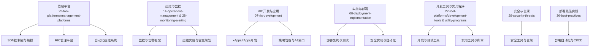
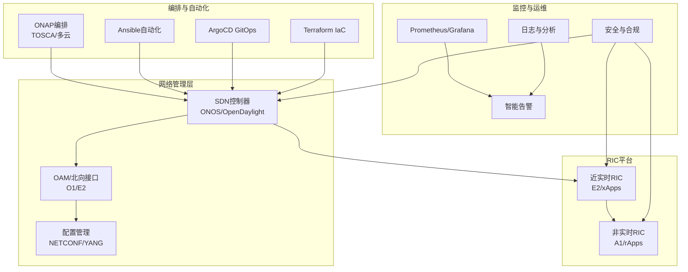
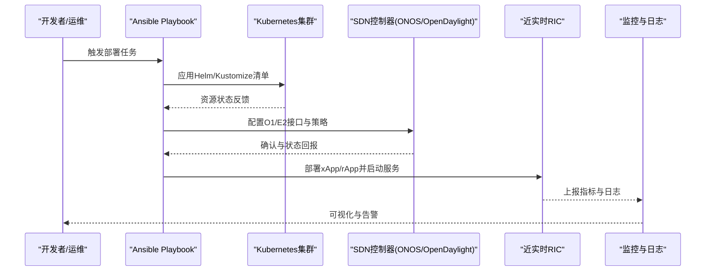
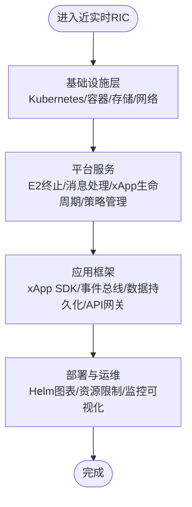
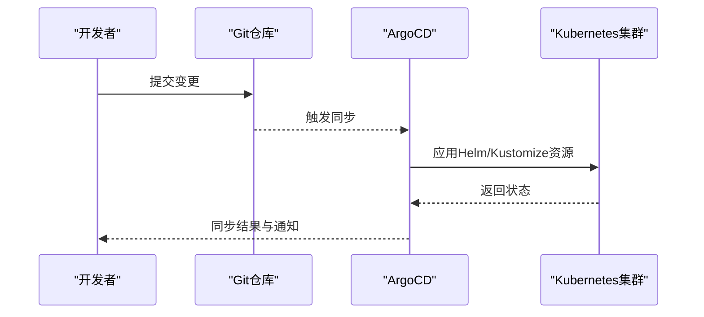
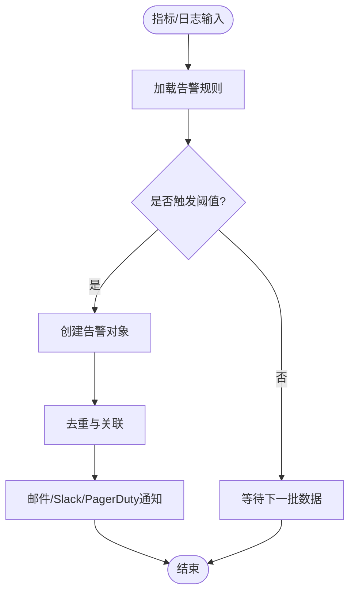
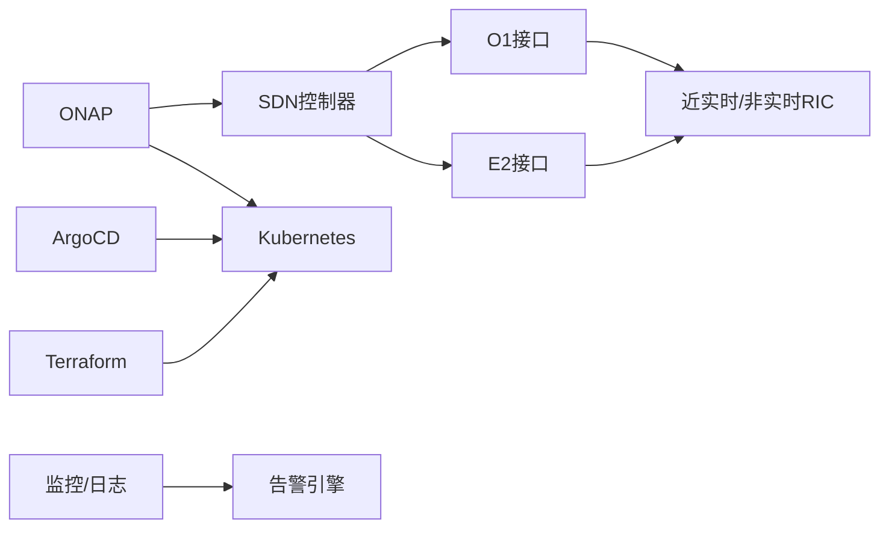

# 管理平台

<cite>
**本文引用的文件**
- [O-RAN 管理平台](file://22-tool-platforms/management-platforms/o-ran-management-platforms-zh.md)
- [O-RAN 管理平台](file://22-tool-platforms/management-platforms/o-ran-management-platforms.md)
- [O-RAN 运维管理](file://14-operations-management/readme-zh.md)
- [O-RAN 运维管理](file://14-operations-management/readme.md)
- [O-RAN 高级技术](file://07-ric-development/readme-zh.md)
- [O-RAN 高级技术](file://07-ric-development/readme.md)
- [O-RAN 实施](file://08-deployment-implementation/readme.md)
- [O-RAN 开发工具包](file://22-tool-platforms/development-tools/o-ran-development-toolkit-zh.md)
- [O-RAN 实用程序](file://22-tool-platforms/utility-programs/o-ran-utility-programs-zh.md)
- [O-RAN 监控工具](file://28-monitoring-alerting/monitoring-tools/o-ran-monitoring-tools.md)
- [O-RAN 运维监控告警框架](file://14-operations-management/monitoring-alerting/operations-monitoring-framework.md)
- [O-RAN 监控告警](file://28-monitoring-alerting/readme.md)
- [O-RAN 安全工具](file://29-security-threats/security-tools/o-ran-security-tools.md)
- [O-RAN 部署最佳实践](file://30-best-practices/deployment-practices/o-ran-deployment-best-practices.md)
</cite>

## 目录
1. [简介](#简介)
2. [项目结构](#项目结构)
3. [核心组件](#核心组件)
4. [架构总览](#架构总览)
5. [详细组件分析](#详细组件分析)
6. [依赖分析](#依赖分析)
7. [性能考虑](#性能考虑)
8. [故障排查指南](#故障排查指南)
9. [结论](#结论)
10. [附录](#附录)

## 简介
本指南面向O-RAN管理平台的使用者与管理者，系统梳理网络管理系统（SDN控制器、网络编排与自动化）、RIC管理平台（近实时与非实时RIC、xApps/rApps、策略管理）、自动化运维平台（CI/CD、基础设施即代码、部署工具）以及平台集成与最佳实践。文档以仓库现有材料为基础，提供可操作的配置要点、流程图与参考路径，帮助读者在多厂商环境下实现标准化、自动化与可演进的O-RAN网络管理。

## 项目结构
围绕“管理平台”主题，仓库中与之直接相关的内容主要分布在以下板块：
- 管理平台与编排：22-tool-platforms/management-platforms
- 运维与监控：14-operations-management、28-monitoring-alerting
- RIC开发与应用：07-ric-development
- 实施与部署：08-deployment-implementation
- 开发工具与实用程序：22-tool-platforms/development-tools、22-tool-platforms/utility-programs
- 安全与合规：29-security-threats
- 部署最佳实践：30-best-practices

下图给出与“管理平台”相关的文件与主题映射关系：

**章节来源**
- file://22-tool-platforms/management-platforms/o-ran-management-platforms-zh.md#L1-L711
- file://14-operations-management/readme-zh.md#L1-L126
- file://28-monitoring-alerting/readme.md#L63-L95
- file://07-ric-development/readme-zh.md#L1-L340
- file://08-deployment-implementation/readme.md#L1-L353
- file://22-tool-platforms/development-tools/o-ran-development-toolkit-zh.md#L1-L488
- file://22-tool-platforms/utility-programs/o-ran-utility-programs-zh.md#L1-L628
- file://29-security-threats/security-tools/o-ran-security-tools.md#L149-L179
- file://30-best-practices/deployment-practices/o-ran-deployment-best-practices.md#L100-L130

## 核心组件
- 网络管理系统
  - SDN控制器平台：ONOS、OpenDaylight（含YANG/NETCONF/RESTCONF、E2/O1接口集成）
  - 编排与自动化：ONAP（TOSCA服务模板、多云编排、策略框架）、Ansible自动化
- RIC管理平台
  - 近实时RIC：O-RAN软件社区RIC、Aria Operations（VMware电信云）
  - 非实时RIC：ONAP集成的非实时RIC（策略管理、大数据与AI）
  - xApps/rApps：E2/A1接口开发与部署、策略下发与执行
- 自动化运维系统
  - CI/CD：ArgoCD GitOps、Terraform IaC、Helm Charts/Kustomize
  - 监控与告警：Prometheus/Grafana、日志与指标采集、智能告警与根因分析
  - 配置管理：Ansible/Puppet/Chef/SaltStack（自动化配置与合规）

**章节来源**
- file://22-tool-platforms/management-platforms/o-ran-management-platforms-zh.md#L6-L711
- file://07-ric-development/readme-zh.md#L1-L340
- file://14-operations-management/monitoring-alerting/operations-monitoring-framework.md#L1-L528
- file://28-monitoring-alerting/monitoring-tools/o-ran-monitoring-tools.md#L136-L186
- file://29-security-threats/security-tools/o-ran-security-tools.md#L149-L179
- file://30-best-practices/deployment-practices/o-ran-deployment-best-practices.md#L100-L130

## 架构总览
下图展示管理平台的关键组成与交互关系，涵盖网络管理、编排、监控、安全与自动化运维：

**图示来源**
- [O-RAN 管理平台](file://22-tool-platforms/management-platforms/o-ran-management-platforms-zh.md#L10-L132)
- [O-RAN 管理平台](file://22-tool-platforms/management-platforms/o-ran-management-platforms-zh.md#L136-L206)
- [O-RAN 管理平台](file://22-tool-platforms/management-platforms/o-ran-management-platforms-zh.md#L297-L452)
- [O-RAN 管理平台](file://22-tool-platforms/management-platforms/o-ran-management-platforms-zh.md#L538-L709)
- [O-RAN 运维监控告警框架](file://14-operations-management/monitoring-alerting/operations-monitoring-framework.md#L262-L528)
- [O-RAN 监控工具](file://28-monitoring-alerting/monitoring-tools/o-ran-monitoring-tools.md#L136-L186)
- [O-RAN 安全工具](file://29-security-threats/security-tools/o-ran-security-tools.md#L149-L179)

## 详细组件分析

### 网络管理系统（SDN控制器与编排）
- ONOS
  - 集群配置与共识协议、应用集成（拓扑管理、策略执行）
  - 北向接口：O1（RESTCONF/YANG）、E2（gRPC）、异步通信（Kafka）、GraphQL
  - 南向协议：OpenFlow、P4Runtime、NETCONF、SNMP
- OpenDaylight
  - MD-SAL数据存储与服务绑定框架
  - O-RAN YANG模型集成（3GPP标准、O-RAN特定、自定义扩展）
  - NETCONF服务器配置（SSH/TLS、Call-home）
- 编排与自动化
  - ONAP：TOSCA服务模板、多云编排、策略框架、服务功能链
  - Ansible：基于角色的部署（O-DU/O-CU/RIC/监控）、编排工作流与验证

**图示来源**
- [O-RAN 管理平台](file://22-tool-platforms/management-platforms/o-ran-management-platforms-zh.md#L10-L72)
- [O-RAN 管理平台](file://22-tool-platforms/management-platforms/o-ran-management-platforms-zh.md#L74-L132)
- [O-RAN 管理平台](file://22-tool-platforms/management-platforms/o-ran-management-platforms-zh.md#L136-L206)
- [O-RAN 管理平台](file://22-tool-platforms/management-platforms/o-ran-management-platforms-zh.md#L208-L291)

**章节来源**
- file://22-tool-platforms/management-platforms/o-ran-management-platforms-zh.md#L6-L711

### RIC管理平台（近实时与非实时）
- 近实时RIC
  - 平台架构：基础设施层、平台服务、应用框架
  - Helm图表：依赖PostgreSQL/Redis/Kafka，全局命名空间与资源限制
  - E2终止、xApp生命周期管理、策略代理（Drools规则引擎）、监控与可视化
- Aria Operations（VMware电信云）
  - 多云编排：vSphere、Tanzu、NSX-T、vRealize Automation
  - 生命周期管理：Day-0至Day-N；智能与分析：AI/ML、预测性维护、根因分析
- 非实时RIC（ONAP）
  - 基于服务的架构：VNF/PNF管理、策略管理、分析与智能
  - 服务组合：控制面/用户面/管理域组件与策略、KPI监控

**图示来源**
- [O-RAN 管理平台](file://22-tool-platforms/management-platforms/o-ran-management-platforms-zh.md#L297-L390)
- [O-RAN 管理平台](file://22-tool-platforms/management-platforms/o-ran-management-platforms-zh.md#L391-L452)
- [O-RAN 管理平台](file://22-tool-platforms/management-platforms/o-ran-management-platforms-zh.md#L454-L532)

**章节来源**
- file://22-tool-platforms/management-platforms/o-ran-management-platforms-zh.md#L293-L532

### 自动化运维系统（CI/CD、IaC、部署工具）
- GitOps（ArgoCD）
  - 仓库结构：基础设施、应用、Operator、应用程序与监控
  - ArgoCD应用配置：源仓库、目标命名空间、同步策略、差异忽略、联系人与Slack通道
- 基础设施即代码（Terraform）
  - 多云O-RAN基础设施：提供商配置、网络基础设施、计算资源
  - 模块化：Kubernetes集群模块、网络基础设施模块
- 部署工具
  - Helm Charts：依赖管理、values.yaml参数化
  - Kustomize：基于基础资源的差异化定制

**图示来源**
- [O-RAN 管理平台](file://22-tool-platforms/management-platforms/o-ran-management-platforms-zh.md#L538-L616)
- [O-RAN 管理平台](file://22-tool-platforms/management-platforms/o-ran-management-platforms-zh.md#L618-L709)

**章节来源**
- file://22-tool-platforms/management-platforms/o-ran-management-platforms-zh.md#L534-L709

### 监控与告警（智能告警与根因分析）
- 指标采集与可视化：Prometheus、Grafana、自定义指标
- 健康检查与探针：Kubernetes探针、自定义健康端点、熔断与降级
- 智能告警引擎：告警严重级别与类别、规则加载、去重与关联、通知渠道
- 日志分析：ELK、日志流处理、跨组件关联与根因分析

**图示来源**
- [O-RAN 运维监控告警框架](file://14-operations-management/monitoring-alerting/operations-monitoring-framework.md#L262-L528)
- [O-RAN 监控工具](file://28-monitoring-alerting/monitoring-tools/o-ran-monitoring-tools.md#L136-L186)

**章节来源**
- file://14-operations-management/monitoring-alerting/operations-monitoring-framework.md#L1-L528
- file://28-monitoring-alerting/monitoring-tools/o-ran-monitoring-tools.md#L136-L186
- file://28-monitoring-alerting/readme.md#L63-L95

### 配置管理与合规（Puppet、Chef、SaltStack）
- 配置管理工具：Ansible（已广泛用于O-RAN）、Puppet、Chef、SaltStack
- 合规与审计：OpenSCAP、CIS-CAT、Lynis、OpenVAS
- 部署自动化：IaC（Terraform）、CI/CD（Jenkins/GitLab/GitHub Actions/Spinnaker）

**章节来源**
- file://29-security-threats/security-tools/o-ran-security-tools.md#L149-L179
- file://30-best-practices/deployment-practices/o-ran-deployment-best-practices.md#L100-L130

### RIC应用开发与策略管理（xApps/rApps）
- 开发框架：E2服务模型（KPM/RC/GNB-CU-UP）、A1策略管理、开发工具链（IDE、测试、CI/CD、容器镜像、部署）
- 编程语言与框架：Python/Go/Java/C++及Spring Boot/Flask/gRPC
- 策略生命周期：创建/验证/分发/执行/回滚与审计
- 智能算法：异常检测、预测性维护、自动优化、能效优化

**章节来源**
- file://07-ric-development/readme-zh.md#L1-L340
- file://07-ric-development/readme.md#L1-L368

## 依赖分析
- 组件耦合
  - SDN控制器与北向接口（O1/E2）紧密耦合，直接影响RIC与RAN组件的控制面
  - ONAP作为编排中枢，向下依赖SDN控制器与Kubernetes，向上提供服务编排与策略
  - ArgoCD与Terraform分别负责GitOps与IaC，共同决定基础设施与应用的一致性
- 外部依赖
  - Prometheus/Grafana、ELK、ArgoCD、Terraform、Helm、Kustomize、Ansible、OpenDaylight/ONOS
- 潜在风险
  - 接口协议一致性（E2/A1/O1）与多厂商兼容性
  - 策略冲突与告警风暴
  - 配置漂移与合规性审计缺失

**图示来源**
- [O-RAN 管理平台](file://22-tool-platforms/management-platforms/o-ran-management-platforms-zh.md#L10-L132)
- [O-RAN 管理平台](file://22-tool-platforms/management-platforms/o-ran-management-platforms-zh.md#L136-L206)
- [O-RAN 管理平台](file://22-tool-platforms/management-platforms/o-ran-management-platforms-zh.md#L538-L709)
- [O-RAN 运维监控告警框架](file://14-operations-management/monitoring-alerting/operations-monitoring-framework.md#L262-L528)

**章节来源**
- file://22-tool-platforms/management-platforms/o-ran-management-platforms-zh.md#L1-L711
- file://14-operations-management/monitoring-alerting/operations-monitoring-framework.md#L1-L528

## 性能考虑
- 网络性能调优：无线资源优化、传输效率、负载均衡、QoS参数、网络切片
- 计算资源优化：CPU/内存分配、容器资源限制、调度策略、缓存与并发
- 存储性能优化：数据库存储、缓存层、访问模式、备份与生命周期
- 监控与可观测性：Prometheus指标、分布式追踪、日志聚合、告警阈值与去噪

**章节来源**
- file://14-operations-management/readme-zh.md#L36-L81
- file://28-monitoring-alerting/monitoring-tools/o-ran-monitoring-tools.md#L136-L186

## 故障排查指南
- 常见问题分类：接口故障（E2/A1/O1/O-FH/F1）、性能问题、可用性问题、配置问题、兼容性问题
- 排查流程：问题定义、信息收集（日志/指标/配置）、假设验证、根因分析（5 Why/鱼骨图/故障树）、解决方案与验证
- 诊断工具：Wireshark/tcpdump、协议分析器（E2/A1/O1）、日志分析（ELK/Splunk）、性能分析（Perf/火焰图）、网络工具（Ping/Traceroute/MTR）
- SOP：故障响应、升级流程、沟通流程、复盘与知识库更新

**章节来源**
- file://08-deployment-implementation/readme.md#L126-L157
- file://22-tool-platforms/utility-programs/o-ran-utility-programs-zh.md#L235-L326

## 结论
本指南基于仓库现有材料，系统梳理了O-RAN管理平台的网络管理、RIC管理、自动化运维与监控告警等关键能力，并给出了架构视图、流程图与参考路径。建议在实际部署中遵循多厂商互操作、标准化与自动化优先的原则，结合GitOps/IaC与CI/CD流水线，实现可演进、可审计、可恢复的O-RAN管理能力。

## 附录
- 开发与测试工具：IDE扩展、版本控制与协作、仿真与测试框架、容器开发工具、API开发与测试、机器学习与AI开发
- 实用程序：命令行工具（配置管理、指标收集、日志处理）、自动化脚本（部署、维护、备份与恢复）
- 安全与合规：SIEM与日志管理、配置与合规管理工具、安全实现与监控

**章节来源**
- file://22-tool-platforms/development-tools/o-ran-development-toolkit-zh.md#L1-L488
- file://22-tool-platforms/utility-programs/o-ran-utility-programs-zh.md#L1-L628
- file://29-security-threats/security-tools/o-ran-security-tools.md#L149-L179