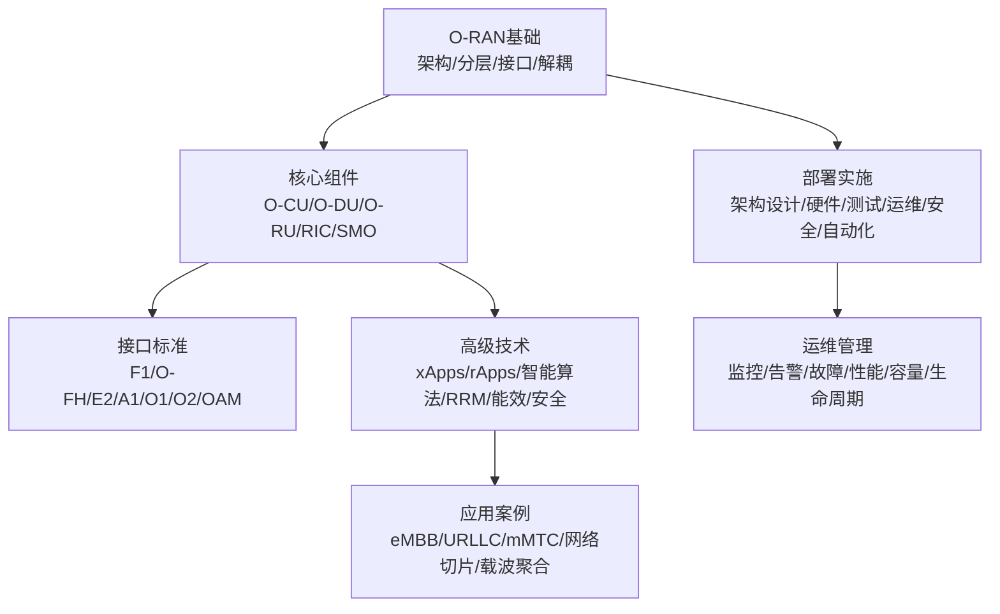
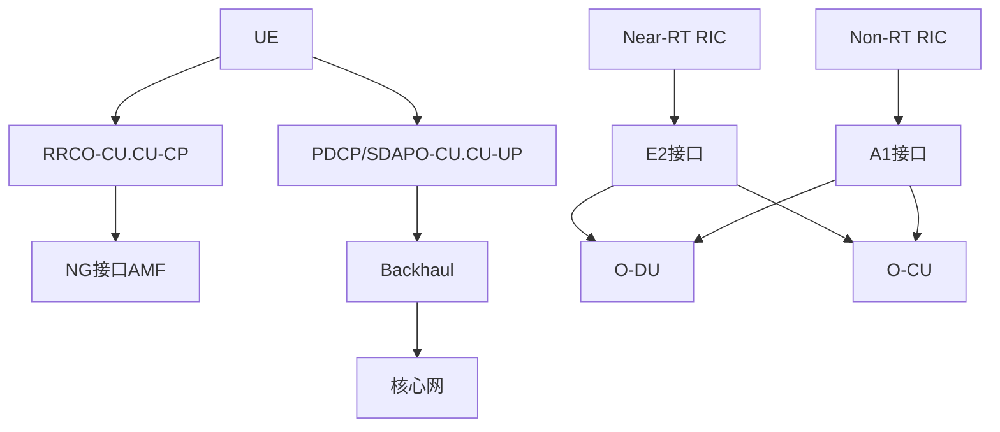
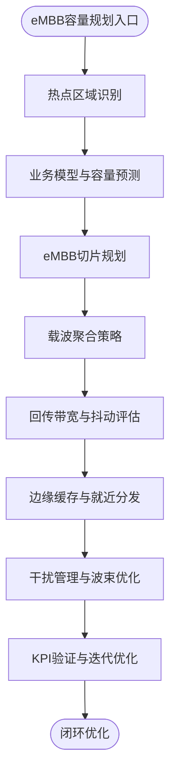
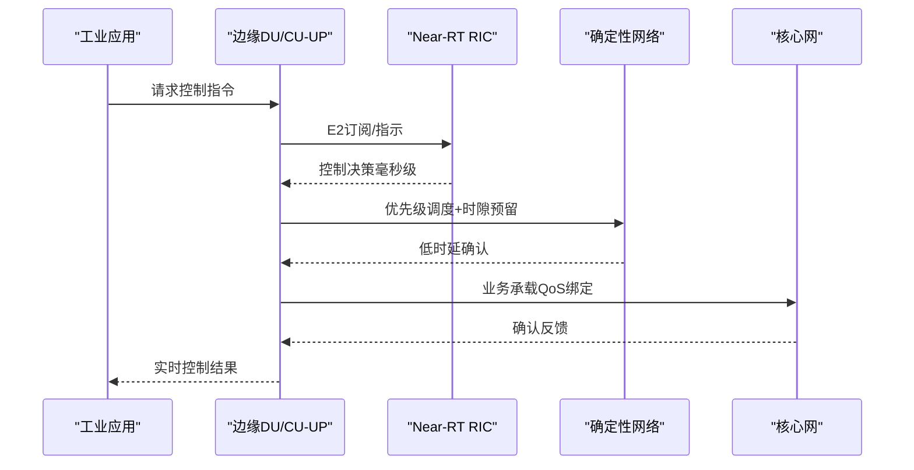
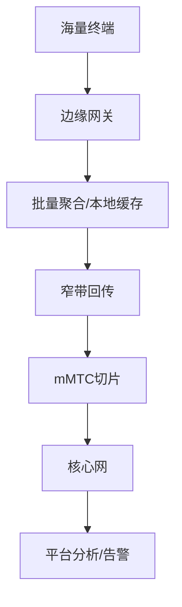
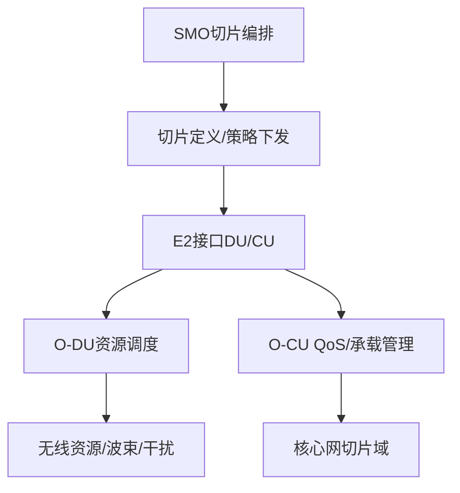
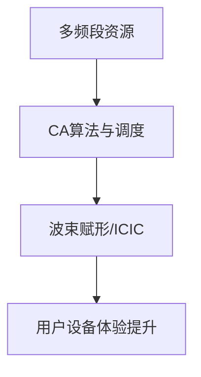
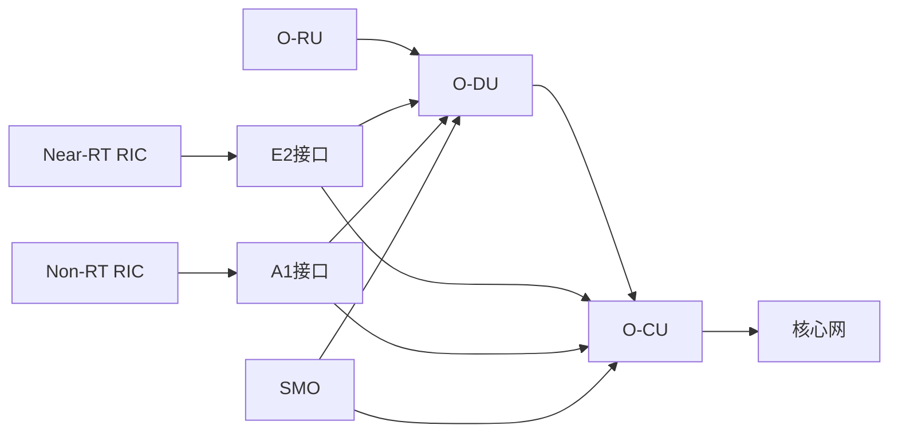

# 5G网络应用

<cite>
**本文引用的文件**
- [README.md](file://README.md)
- [应用案例与场景.md](file://10-application-scenarios/readme.md)
- [O-RAN基础.md](file://01-architecture-system/readme.md)
- [O-RAN高级技术.md](file://07-ric-development/readme.md)
- [O-RAN高级技术（中文）.md](file://07-ric-development/readme-zh.md)
- [O-RAN部署与实施.md](file://08-deployment-implementation/readme.md)
- [O-RAN运维管理.md](file://14-operations-management/readme.md)
- [O-RAN运维管理（中文）.md](file://14-operations-management/readme-zh.md)
- [O-CU.md](file://02-core-components/o-cu.md)
- [O-DU.md](file://02-core-components/o-du.md)
- [E2接口.md](file://03-interface-standards/e2-interface.md)
</cite>

## 目录
1. [引言](#引言)
2. [项目结构](#项目结构)
3. [核心组件](#核心组件)
4. [架构总览](#架构总览)
5. [详细组件分析](#详细组件分析)
6. [依赖关系分析](#依赖关系分析)
7. [性能考虑](#性能考虑)
8. [故障排查指南](#故障排查指南)
9. [结论](#结论)
10. [附录](#附录)

## 引言
本文件面向5G网络应用落地，围绕增强移动宽带（eMBB）、超可靠低时延通信（URLLC）、大规模机器类通信（mMTC）三类5G服务场景，系统梳理O-RAN架构下的网络设计、性能要求、部署策略与实际案例，并重点阐述网络切片与载波聚合的端到端实现路径。同时给出高带宽、低时延高可靠、海量连接三大场景的容量规划、干扰管理与覆盖优化策略，以及边缘计算、优先级调度与冗余设计等工程实践建议，帮助读者完成从概念到生产的全栈交付。

## 项目结构
本知识库以“O-RAN架构—核心组件—接口标准—部署实施—高级技术—运维管理—应用案例”为主线组织内容，形成“自上而下”的知识体系，便于云平台背景的专业人士快速迁移至O-RAN领域并开展工程实践。

图示来源
- [O-RAN基础.md](file://01-architecture-system/readme.md#L1-L161)
- [O-RAN部署与实施.md](file://08-deployment-implementation/readme.md#L1-L353)
- [O-RAN高级技术.md](file://07-ric-development/readme.md#L1-L368)
- [O-RAN运维管理.md](file://14-operations-management/readme.md#L1-L126)
- [应用案例与场景.md](file://10-application-scenarios/readme.md#L1-L470)

章节来源
- [README.md](file://README.md#L1-L365)

## 核心组件
- O-RU：射频前端与天线连接，承担同步与前传接口对接。
- O-DU：物理层与部分MAC层处理，强调低延迟与确定性。
- O-CU：控制面（CU-CP）与用户面（CU-UP）分离，支持集中/分布式/混合部署。
- RIC（Near-RT/Non-RT）：提供xApps/rApps运行环境，支撑闭环优化与策略管理。
- SMO：面向服务的生命周期与配置管理，支撑网络切片编排。

章节来源
- [O-RAN基础.md](file://01-architecture-system/readme.md#L8-L35)
- [O-CU.md](file://02-core-components/o-cu.md#L1-L419)
- [O-DU.md](file://02-core-components/o-du.md#L1-L415)

## 架构总览
O-RAN通过接口开放与功能解耦，实现“云化、智能、开放”。典型端到端路径如下：
- 控制面：UE → RRC（O-CU.CU-CP）→ NG接口 → 核心网AMF
- 用户面：UE → PDCP/SDAP（O-CU.CU-UP）→ backhaul → 核心网
- 智能化：Near-RT RIC（毫秒级）与Non-RT RIC（秒级）协同，经E2接口与CU/DU交互，驱动xApps/rApps闭环优化。

图示来源
- [O-RAN基础.md](file://01-architecture-system/readme.md#L18-L34)
- [E2接口.md](file://03-interface-standards/e2-interface.md#L1-L337)
- [O-RAN高级技术.md](file://07-ric-development/readme.md#L8-L33)

## 详细组件分析

### eMBB（增强移动宽带）场景
- 业务特征：高带宽（4K/8K视频、VR/AR、云游戏），追求峰值速率与用户体验速率双高。
- 网络架构：集中式部署为主，backhaul具备高带宽与低抖动能力；配合边缘计算就近处理热点内容。
- 性能要求：下行速率目标可达10Gbps+，上行1Gbps+；端到端时延远低于URLLC。
- 部署策略：
  - 高频毫米波与Sub-6G协同，提升容量与覆盖平衡；
  - 载波聚合（连续/非连续）提升峰值速率与覆盖；
  - 网络切片：独立eMBB切片，保障带宽与QoS。
- 容量规划与优化：
  - 基于热点区域与业务模型预测容量需求；
  - 通过DU/CU分离与边缘部署降低回传压力；
  - 干扰管理：ICIC/ICNM、波束赋形、动态调度；
  - 覆盖优化：宏微融合、室内外协同、波束切换。
- 实际案例：大型体育场馆、音乐节、购物中心等高密度人群场景，通过切片与边缘缓存显著提升用户体验。

图示来源
- [应用案例与场景.md](file://10-application-scenarios/readme.md#L8-L44)

章节来源
- [应用案例与场景.md](file://10-application-scenarios/readme.md#L8-L44)

### URLLC（超可靠低时延通信）场景
- 业务特征：工业控制、远程医疗、自动驾驶等，端到端时延<1ms，可靠性≥99.999%。
- 网络架构：分布式部署，靠近用户与边缘；结合确定性网络（TSN）与优先级调度。
- 性能要求：空口+传输+处理时延严格预算，保障零数据丢失与强时序约束。
- 部署策略：
  - 边缘本地化：O-DU/CU-UP下沉，缩短回传路径；
  - 优先级调度与资源预留：为关键业务保留带宽与时隙；
  - 冗余设计：多连接/多路径/多频段，实现自愈与快速切换；
  - 同步精度：IEEE 1588 PTP亚微秒级同步。
- 实际案例：工厂自动化产线、远程手术、智慧交通信号控制等，通过切片+边缘+TSN实现确定性保障。

图示来源
- [应用案例与场景.md](file://10-application-scenarios/readme.md#L16-L22)
- [O-DU.md](file://02-core-components/o-du.md#L51-L67)
- [O-RAN高级技术.md](file://07-ric-development/readme.md#L8-L33)

章节来源
- [应用案例与场景.md](file://10-application-scenarios/readme.md#L16-L22)
- [O-DU.md](file://02-core-components/o-du.md#L51-L67)

### mMTC（大规模机器类通信）场景
- 业务特征：海量连接（每平方公里百万级）、低功耗、低速率、长周期上报。
- 网络架构：轻量化协议（如NB-IoT/LTE-M），边缘网关汇聚海量小包，减少核心网压力。
- 性能要求：连接数密度、电池寿命、广覆盖与穿透能力。
- 部署策略：
  - 窄带传输与睡眠机制：降低功耗与干扰；
  - 批量处理与聚合上报：减少信令开销；
  - 边缘网关：协议转换、数据预处理、本地缓存与限流。
- 实际案例：智慧城市（水表/电表/路灯）、环境监测、农业物联网等，通过切片隔离与边缘聚合实现低成本高覆盖。

图示来源
- [应用案例与场景.md](file://10-application-scenarios/readme.md#L23-L29)

章节来源
- [应用案例与场景.md](file://10-application-scenarios/readme.md#L23-L29)

### 网络切片端到端实现
- 切片类型：eMBB切片、URLLC切片、mMTC切片，按需资源分配与隔离。
- 编排与管理：SMO负责切片生命周期与资源编排；E2接口驱动DU/CU侧资源调度与QoS落地。
- 隔离机制：逻辑隔离（VLAN/VPN）与物理隔离（独立硬件/频谱）组合。
- 挑战与对策：资源编排、性能承诺、切片生命周期管理；通过xApps/rApps实现动态优化与自愈。

图示来源
- [应用案例与场景.md](file://10-application-scenarios/readme.md#L30-L36)
- [O-RAN高级技术.md](file://07-ric-development/readme.md#L8-L33)
- [E2接口.md](file://03-interface-standards/e2-interface.md#L1-L337)

章节来源
- [应用案例与场景.md](file://10-application-scenarios/readme.md#L30-L36)

### 载波聚合跨频段与跨标准聚合
- 聚合类型：连续CA与非连续CA，提升峰值速率与覆盖。
- 频谱策略：高频（mmWave）与低频协同，热点区域叠加多频段。
- 部署挑战：终端兼容、网络复杂度、功耗与成本；通过E2接口联动DU侧调度与波束管理，实现动态聚合与干扰协调。

图示来源
- [应用案例与场景.md](file://10-application-scenarios/readme.md#L37-L43)

章节来源
- [应用案例与场景.md](file://10-application-scenarios/readme.md#L37-L43)

### 边缘计算与MEC集成
- 部署形态：MEC与O-DU/O-CU共址或就近部署，降低时延与带宽占用。
- 协同机制：E2接口与MEC服务发现/编排；边缘缓存与内容分发。
- 挑战：资源受限、模型更新、隐私保护；通过容器化与微服务实现弹性与可观测性。

章节来源
- [应用案例与场景.md](file://10-application-scenarios/readme.md#L45-L79)
- [O-RAN高级技术.md](file://07-ric-development/readme.md#L27-L33)

## 依赖关系分析
- 组件耦合：O-DU对实时性要求最高，O-CU负责控制与用户面处理，RIC提供智能闭环；SMO贯穿全生命周期编排。
- 外部依赖：3GPP/ETSI标准、多厂商互通（Plugfest）、安全与合规。
- 关键接口：E2（近实时控制）、A1（策略管理）、F1/O-FH（前后传）。

图示来源
- [O-RAN基础.md](file://01-architecture-system/readme.md#L18-L34)
- [E2接口.md](file://03-interface-standards/e2-interface.md#L1-L337)

章节来源
- [O-RAN基础.md](file://01-architecture-system/readme.md#L18-L34)
- [E2接口.md](file://03-interface-standards/e2-interface.md#L1-L337)

## 性能考虑
- 端到端时延预算：空口、传输、处理三层分解，针对URLLC场景严格控制。
- 峰值速率与容量：通过CA、波束赋形、MIMO、RB分配与负载均衡综合提升。
- 干扰管理：ICIC/ICNM、协作传输（CoMP）、学习型预测与规避。
- 能效优化：基于负载的动态开关、睡眠模式、绿色能源与能耗预测。

章节来源
- [O-RAN高级技术.md](file://07-ric-development/readme.md#L125-L170)
- [O-RAN高级技术（中文）.md](file://07-ric-development/readme-zh.md#L125-L170)

## 故障排查指南
- 分类与流程：接口故障、性能劣化、可用性下降、配置冲突、兼容性问题；遵循问题定义→信息收集→假设验证→根因分析→修复验证的标准流程。
- 工具与手段：Wireshark/tcpdump、协议分析、日志分析、性能分析、网络监控与可视化。
- SOP：故障响应、升级、沟通、复盘与知识库更新。

章节来源
- [O-RAN部署与实施.md](file://08-deployment-implementation/readme.md#L126-L157)

## 结论
面向5G应用的工程化落地，应以场景需求为牵引，结合O-RAN架构的云化、开放与智能特性，系统推进：以切片实现差异化服务，以边缘与确定性网络满足低时延高可靠，以CA与波束赋形提升eMBB容量与覆盖，以轻量化协议与边缘网关支撑海量连接。在此基础上，通过完善的监控告警、自动化运维与安全体系，确保网络的高质量、高可靠与可持续运营。

## 附录
- 学习路径与资源：参见README中的学习路径与推荐资源，结合各专题文档进行系统化学习。
- 实践项目：网络切片设计、边缘集成、工业互联网网络、V2X通信、智慧城市网络、医疗网络等实验室项目与最佳实践。

章节来源
- [README.md](file://README.md#L224-L288)
- [应用案例与场景.md](file://10-application-scenarios/readme.md#L305-L313)