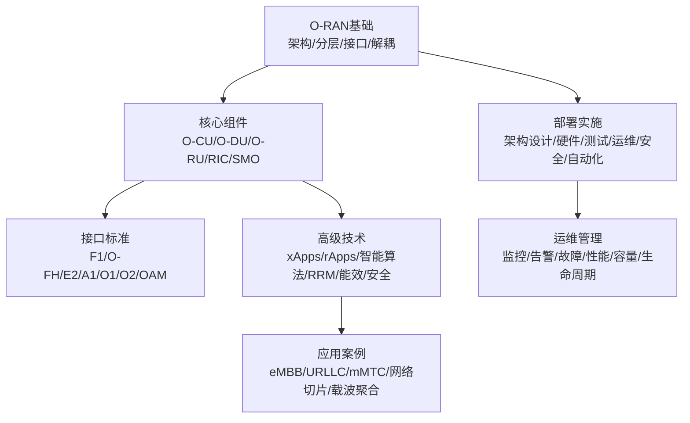
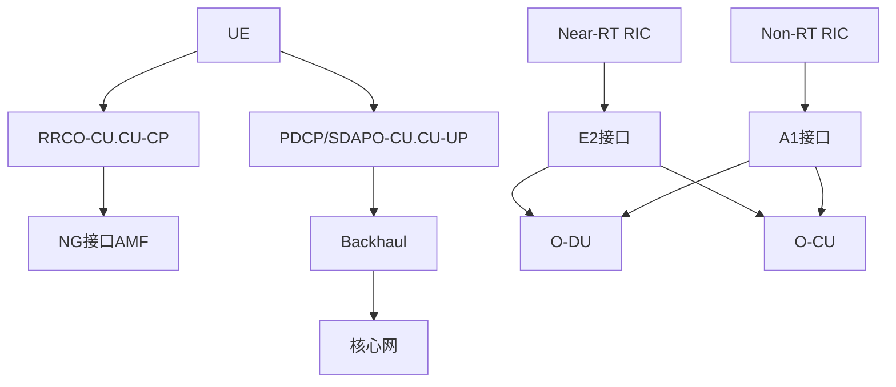
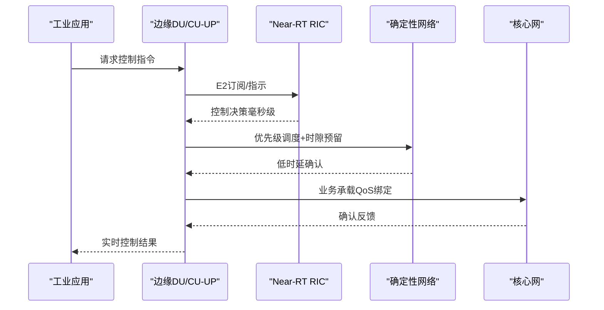
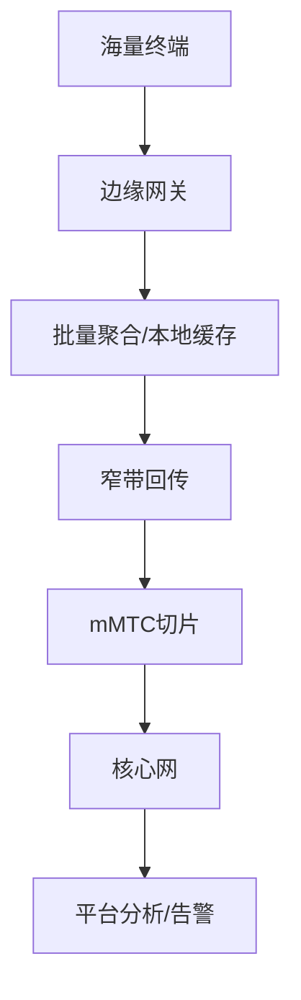
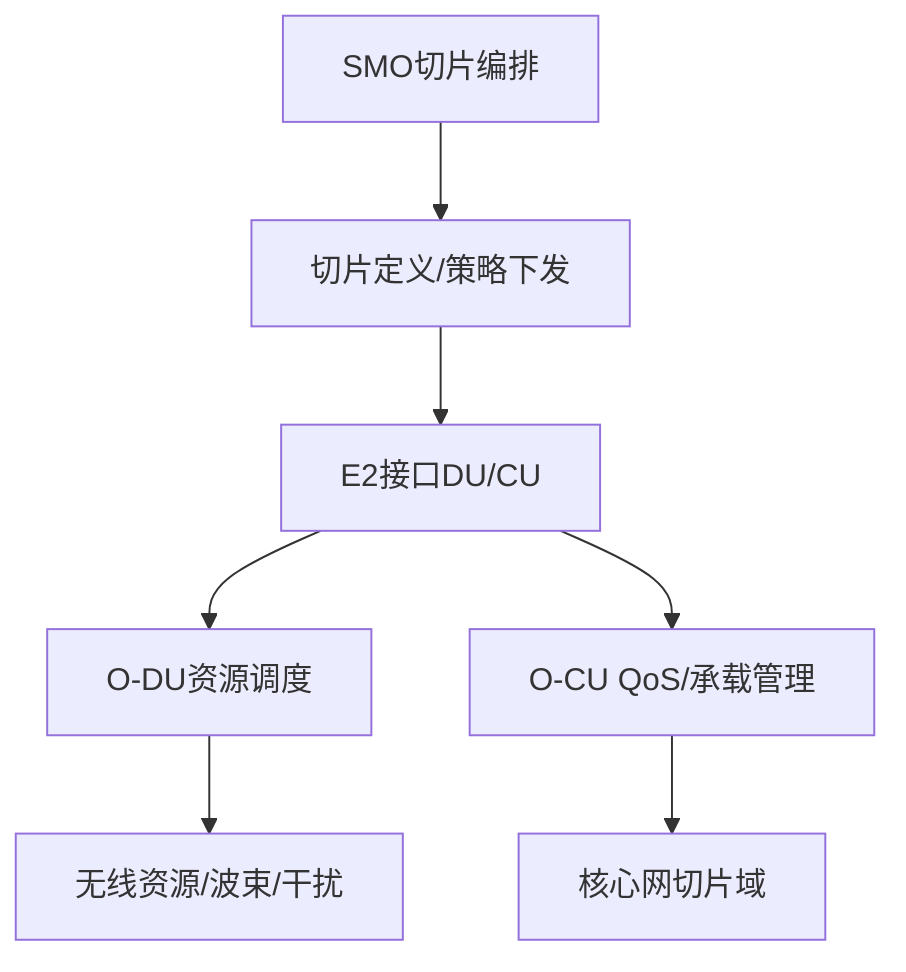
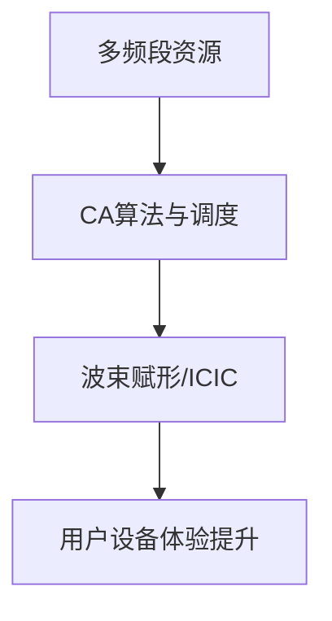
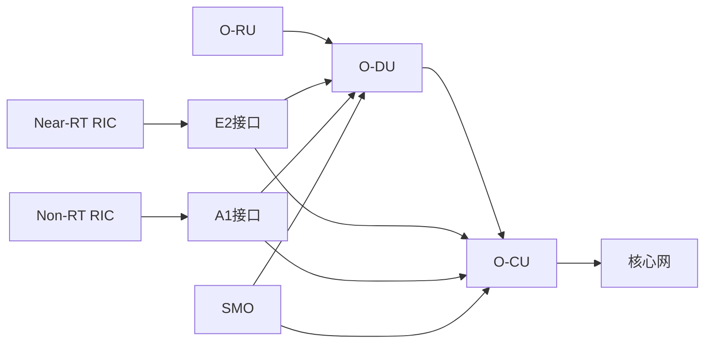

# 5G网络应用

<cite>
**本文引用的文件**
- [README.md](file://README.md)
- [应用案例与场景.md](file://10-application-scenarios/readme.md)
- [O-RAN基础.md](file://01-architecture-system/readme.md)
- [O-RAN高级技术.md](file://07-ric-development/readme.md)
- [O-RAN高级技术（中文）.md](file://07-ric-development/readme-zh.md)
- [O-RAN部署与实施.md](file://08-deployment-implementation/readme.md)
- [O-RAN运维管理.md](file://14-operations-management/readme.md)
- [O-RAN运维管理（中文）.md](file://14-operations-management/readme-zh.md)
- [O-CU.md](file://02-core-components/o-cu.md)
- [O-DU.md](file://02-core-components/o-du.md)
- [E2接口.md](file://03-interface-standards/e2-interface.md)
- [5G网络应用深度分析.md](file://10-application-scenarios/5g-network-applications/5g-network-applications-deep-dive.md)
- [5G网络应用概览.md](file://10-application-scenarios/5g-network-applications/readme.md)
</cite>

## 更新摘要
**所做更改**
- 更新了eMBB、URLLC、mMTC三大5G服务类型的详细技术分析和性能要求
- 新增了网络切片端到端实现的完整架构设计
- 扩展了载波聚合技术的跨频段和跨标准聚合方案
- 增加了边缘计算与MEC集成的具体实现细节
- 补充了生产环境最佳实践和故障排查指南
- 更新了实际案例研究和部署策略

## 目录
1. [引言](#引言)
2. [项目结构](#项目结构)
3. [核心组件](#核心组件)
4. [架构总览](#架构总览)
5. [详细组件分析](#详细组件分析)
6. [依赖关系分析](#依赖关系分析)
7. [性能考虑](#性能考虑)
8. [故障排查指南](#故障排查指南)
9. [结论](#结论)
10. [附录](#附录)

## 引言
本文件面向5G网络应用落地，围绕增强移动宽带（eMBB）、超可靠低时延通信（URLLC）、大规模机器类通信（mMTC）三类5G服务场景，系统梳理O-RAN架构下的网络设计、性能要求、部署策略与实际案例，并重点阐述网络切片与载波聚合的端到端实现路径。同时给出高带宽、低时延高可靠、海量连接三大场景的容量规划、干扰管理与覆盖优化策略，以及边缘计算、优先级调度与冗余设计等工程实践建议，帮助读者完成从概念到生产的全栈交付。

**更新** 基于最新的5G网络应用深度分析文档，提供了更全面的技术细节和实际部署指导。

## 项目结构
本知识库以"O-RAN架构—核心组件—接口标准—部署实施—高级技术—运维管理—应用案例"为主线组织内容，形成"自上而下"的知识体系，便于云平台背景的专业人士快速迁移至O-RAN领域并开展工程实践。

**图示来源**
- [O-RAN基础.md:1-161](file://01-architecture-system/readme.md#L1-L161)
- [O-RAN部署与实施.md:1-353](file://08-deployment-implementation/readme.md#L1-L353)
- [O-RAN高级技术.md:1-368](file://07-ric-development/readme.md#L1-L368)
- [O-RAN运维管理.md:1-126](file://14-operations-management/readme.md#L1-L126)
- [应用案例与场景.md:1-470](file://10-application-scenarios/readme.md#L1-L470)

章节来源
- [README.md:1-365](file://README.md#L1-L365)

## 核心组件
- O-RU：射频前端与天线连接，承担同步与前传接口对接。
- O-DU：物理层与部分MAC层处理，强调低延迟与确定性。
- O-CU：控制面（CU-CP）与用户面（CU-UP）分离，支持集中/分布式/混合部署。
- RIC（Near-RT/Non-RT）：提供xApps/rApps运行环境，支撑闭环优化与策略管理。
- SMO：面向服务的生命周期与配置管理，支撑网络切片编排。

**更新** 基于最新的组件分析，增强了各组件在5G应用场景中的具体职责和技术特性。

章节来源
- [O-RAN基础.md:8-35](file://01-architecture-system/readme.md#L8-L35)
- [O-CU.md:1-419](file://02-core-components/o-cu.md#L1-L419)
- [O-DU.md:1-415](file://02-core-components/o-du.md#L1-L415)

## 架构总览
O-RAN通过接口开放与功能解耦，实现"云化、智能、开放"。典型端到端路径如下：
- 控制面：UE → RRC（O-CU.CU-CP）→ NG接口 → 核心网AMF
- 用户面：UE → PDCP/SDAP（O-CU.CU-UP）→ backhaul → 核心网
- 智能化：Near-RT RIC（毫秒级）与Non-RT RIC（秒级）协同，经E2接口与CU/DU交互，驱动xApps/rApps闭环优化。

**图示来源**
- [O-RAN基础.md:18-34](file://01-architecture-system/readme.md#L18-L34)
- [E2接口.md:1-337](file://03-interface-standards/e2-interface.md#L1-L337)
- [O-RAN高级技术.md:8-33](file://07-ric-development/readme.md#L8-L33)

## 详细组件分析

### eMBB（增强移动宽带）场景

**更新** 基于最新的深度分析文档，提供了更详细的应用场景分类和性能指标。

#### 高带宽应用场景
- **视频应用**：4K/8K视频流媒体（每流25-100Mbps）、虚拟现实VR（100+Mbps低时延）、增强现实AR（实时叠加需要高带宽和低时延）、云游戏（低时延高吞吐量）、360度视频（沉浸式体验需要高带宽）
- **企业应用**：云计算（企业应用需要高带宽）、视频会议（高质量视频需要可靠连接）、大文件传输（企业文件传输需要高吞吐量）、实时协作（实时协作工具需要低时延）、虚拟桌面基础设施（VDI应用需要一致性能）
- **消费者应用**：社交媒体（高质量媒体分享和流媒体）、电子商务（丰富媒体购物体验）、教育（在线学习和虚拟课堂）、娱乐（流媒体服务和互动内容）、通信（高质量语音和视频通信）

#### 网络架构
- **集中式部署**：集中式RAN用于资源效率、云RAN用于可扩展性、边缘计算集成用于低时延、内容分发用于缓存优化、负载均衡用于智能资源分配
- **高带宽回传**：光纤回传用于高容量连接、微波回传用于无光纤区域、卫星回传用于偏远地区、混合回传用于可靠性、回传优化用于容量和时延优化

#### 性能要求
- **数据速率要求**：峰值数据速率下行10Gbps+、上行1Gbps+；用户体验速率下行100Mbps、上行50Mbps；区域流量容量下行10Mbps/m²、上行5Mbps/m²；带宽支持100MHz到1GHz；频谱效率通过MIMO和波束赋形提升
- **时延要求**：用户平面时延<10ms；控制平面时延<50ms；往返时延<20ms；抖动<5ms；丢包率<0.1%

#### 频谱策略
- **高频部署**：毫米波（mmWave）24GHz到100GHz用于高容量、中频段1GHz到6GHz用于平衡覆盖和容量、低频段<1GHz用于广覆盖、载波聚合用于更高吞吐量、动态频谱共享用于4G和5G频谱共享
- **频谱管理**：频谱许可（授权、共享和非授权频谱）、频谱接入（动态频谱接入技术）、干扰管理（干扰避免和缓解）、频谱效率（先进频谱效率技术）、频谱监控（实时频谱监控和管理）

#### 部署挑战
- **容量规划**：流量预测（准确的交通需求预测）、容量配置（峰值负载的正确容量配置）、资源分配（动态资源分配策略）、负载均衡（跨小区智能负载均衡）、拥塞管理（拥塞避免和管理）
- **干扰管理**：小区间干扰（管理小区间干扰）、同频干扰（管理同频干扰）、邻频干扰（管理邻频干扰）、干扰协调（协调干扰管理）、波束赋形（用于减少干扰的波束赋形）

#### 实际案例
- **大型体育场活动**：挑战是高密度用户环境和极端流量尖峰；解决方案是小细胞部署、大规模MIMO、边缘计算；性能是10Gbps+聚合吞吐量、<10ms时延；可扩展性是活动期间动态容量扩展；用户体验是所有用户的持续高质量体验
- **购物中心部署**：挑战是室内覆盖和高用户密度；解决方案是分布式天线系统、室内小细胞；性能是无缝覆盖、高容量；集成是与商场管理系统集成；服务是基于位置的服务、室内导航

**图示来源**
- [5G网络应用深度分析.md:11-128](file://10-application-scenarios/5g-network-applications/5g-network-applications-deep-dive.md#L11-L128)

章节来源
- [5G网络应用深度分析.md:9-128](file://10-application-scenarios/5g-network-applications/5g-network-applications-deep-dive.md#L9-L128)

### URLLC（超可靠低时延通信）场景

**更新** 基于最新的深度分析，提供了更详细的工业控制、远程医疗和自动驾驶应用场景。

#### 低时延要求
URLLC应用需要极低时延和高可靠性：
- **工业控制**：工厂自动化（制造过程的实时控制）、过程控制（工业过程控制需要<1ms时延）、机器人控制（实时机器人控制和协调）、机器控制（工业机器控制系统）、质量控制（实时质量监控和控制）
- **远程医疗**：远程手术（实时远程外科手术）、远程医疗（实时医疗咨询）、患者监测（实时患者生命体征监测）、医学影像（实时医学图像传输）、应急响应（紧急医疗响应协调）
- **自动驾驶**：车辆控制（实时自动驾驶车辆控制）、传感器融合（实时传感器数据处理）、决策制定（实时驾驶决策支持）、V2X通信（车对万物通信）、安全系统（实时安全系统协调）

#### 网络架构
- **分布式部署**：边缘计算（分布式边缘计算用于低时延）、本地处理（本地数据处理用于实时响应）、分布式架构（分布式网络架构）、多接入边缘计算（MEC集成用于URLLC）、雾计算（雾计算用于超低时延）
- **边缘计算集成**：边缘节点（分布式边缘计算节点）、边缘应用（边缘托管URLLC应用）、边缘编排（边缘资源编排）、边缘管理（边缘基础设施管理）、边缘安全（边缘安全和隐私保护）

#### 性能要求
- **时延要求**：端到端时延<1ms（关键应用）、用户平面时延<0.5ms（空口）、传输时延<0.1ms（前传）、处理时延<0.3ms（处理）、总预算<1ms端到端时延预算
- **可靠性要求**：数据包错误率<10^-5（关键应用）、可用性99.999%（任务关键应用）、平均故障间隔时间>10,000小时、恢复时间<50ms（故障恢复）、冗余N+1冗余（关键组件）

#### 优化策略
- **优先级调度**：流量优先级（基于优先级的流量调度）、资源预留（保证的资源分配）、抢占（基于优先级的抢占机制）、服务质量（URLLC的QoS执行）、差异化服务（服务差异化机制）
- **确定性网络**：时间敏感网络（TSN集成用于确定性行为）、计划流量（时间计划流量传输）、帧抢占（低时延的帧抢占）、时间同步（精确时间同步）、路径控制（确定性路径控制）
- **冗余设计**：多路径路由（可靠性的多路径路由）、热备份（关键组件的热备份）、地理冗余（弹性的地理分布）、多样性技术（空间、频率和时间多样性）、自愈（自动故障检测和恢复）

#### 部署挑战
- **同步精度**：时间同步（亚微秒级时间同步）、频率同步（高精度频率同步）、相位同步（MIMO的相位对齐）、网络同步（全网同步）、保持性能（参考丢失时的时序维护）
- **故障恢复**：快速检测（快速故障检测机制）、自动切换（自动故障转移机制）、优雅降级（优雅服务降级）、自愈（自动恢复能力）、备份系统（备份系统激活）

#### 实际案例
- **工厂自动化**：挑战是制造过程的实时控制；解决方案是私有5G网络与边缘计算；性能是<1ms时延、99.999%可靠性；集成是与工业控制系统集成；收益是提高生产力、减少停机时间
- **远程手术**：挑战是零时延容忍的实时手术控制；解决方案是专用URLLC网络与边缘计算；性能是<1ms时延、99.9999%可靠性；触觉反馈是实时触觉反馈支持；安全是多层次冗余确保安全

**图示来源**
- [5G网络应用深度分析.md:129-256](file://10-application-scenarios/5g-network-applications/5g-network-applications-deep-dive.md#L129-L256)
- [O-DU.md:51-67](file://02-core-components/o-du.md#L51-L67)
- [O-RAN高级技术.md:8-33](file://07-ric-development/readme.md#L8-L33)

章节来源
- [5G网络应用深度分析.md:129-256](file://10-application-scenarios/5g-network-applications/5g-network-applications-deep-dive.md#L129-L256)
- [O-DU.md:51-67](file://02-core-components/o-du.md#L51-L67)

### mMTC（大规模机器类通信）场景

**更新** 基于最新的深度分析，提供了更详细的物联网应用场景和优化策略。

#### 海量连接处理
mMTC设计用于支持大量连接设备：
- **物联网应用**：智能电表（数百万智能电表连接）、环境监测（大规模环境监测网络）、资产跟踪（大规模资产跟踪系统）、智能照明（城市范围智能照明网络）、可穿戴设备（大规模可穿戴设备连接）
- **网络架构**：轻量级协议（IoT设备的效率协议）、边缘网关（基于边缘的IoT网关）、聚合点（数据聚合和处理）、云集成（基于云的IoT平台）、设备管理（大规模设备管理系统）

#### 性能要求
- **连接密度**：连接密度每平方公里100万个连接、设备密度高密度设备部署、可扩展性线性可扩展性与设备数量、效率高效的连接管理、成本效益低成本连接解决方案
- **功耗消耗**：电池寿命IoT设备10年以上电池寿命、节能模式和机制、能量收集技术、睡眠模式深度睡眠和空闲模式、传输优化优化的传输模式

#### 优化策略
- **窄带传输**：NB-IoT用于低功耗广域连接、LTE-M用于中等带宽应用、减少带宽提高效率、符号重复用于覆盖扩展、功率谱密度提升
- **睡眠机制**：扩展DRX扩展不连续接收、PSM深度睡眠的连接模式DRX、唤醒信号高效唤醒机制、调度优化用于节能的优化调度
- **批量处理**：数据聚合边缘网关的数据聚合、批量传输批量数据传输、事件驱动传输事件触发数据传输、计划报告计划数据传输、压缩提高效率的数据压缩

#### 部署挑战
- **连接管理**：设备注册高效的设备注册、认证大规模设备认证、会话管理高效的会话管理、移动性管理设备移动性支持、分组管理基于分组的设备管理
- **功耗控制**：功率控制自适应功率控制机制、发射功率优化的发射功率、接收功率优化的接收功率、睡眠优化睡眠模式优化、能源监控设备能源监控

#### 实际案例
- **智能水表**：挑战是数百万水表需要可靠连接；解决方案是NB-IoT网络与边缘网关；性能是10年以上电池寿命、深度覆盖；数据采集是每日抄表、泄漏检测；收益是降低运营成本、提高效率
- **智能路灯**：挑战是城市范围的路灯控制和监控；解决方案是LPWAN网络与云端管理；性能是实时控制、能源优化；功能是自适应照明、故障检测；收益是节能、减少维护

**图示来源**
- [5G网络应用深度分析.md:257-358](file://10-application-scenarios/5g-network-applications/5g-network-applications-deep-dive.md#L257-L358)

章节来源
- [5G网络应用深度分析.md:257-358](file://10-application-scenarios/5g-network-applications/5g-network-applications-deep-dive.md#L257-L358)

### 网络切片端到端实现

**更新** 基于最新的深度分析，提供了完整的网络切片架构设计和实现细节。

#### 端到端网络切片
网络切片在共享基础设施上启用多个虚拟网络：
- **切片类型**：eMBB切片（宽带应用的高带宽切片）、URLLC切片（关键应用的低时延切片）、mMTC切片（物联网的大规模连接切片）、企业切片（专用企业网络切片）、自定义切片（特定应用程序的自定义切片）
- **切片编排**：基于SMO的管理（服务管理和编排）、切片生命周期（切片创建、修改、删除）、资源分配（每切片的动态资源分配）、性能监控（每切片性能监控）、SLA管理（服务等级协议管理）

#### 隔离机制
- **逻辑隔离**：资源隔离（逻辑资源隔离）、流量隔离（切片间的流量隔离）、安全隔离（安全策略隔离）、管理隔离（管理平面隔离）、故障隔离（切片间的故障隔离）
- **物理隔离**：专用资源（物理专用资源）、独立基础设施（独立物理基础设施）、硬件隔离（硬件级别隔离）、网络隔离（物理网络隔离）、地理隔离（弹性的地理分布）

#### 部署挑战
- **资源编排**：动态分配（动态资源分配）、资源优化（资源利用率优化）、冲突解决（资源冲突解决）、扩展（动态切片扩展）、迁移（切片迁移能力）
- **性能保证**：SLA执行（服务等级协议执行）、QoS保证（服务质量保证）、时延保证（时延要求保证）、吞吐量保证（吞吐量要求保证）、可靠性保证（可靠性要求保证）

#### 实际案例
- **运营商多租户网络**：挑战是在共享基础设施上支持多个企业客户；解决方案是每个客户的专用切片；性能是每切片的保证性能；管理是集中式切片管理；收益是收入生成、资源效率
- **企业专用切片**：挑战是企业需要专用网络资源；解决方案是企业专用网络切片；性能是保证的性能和安全；定制是定制的切片配置；收益是企业控制、性能保证

**图示来源**
- [5G网络应用深度分析.md:359-434](file://10-application-scenarios/5g-network-applications/5g-network-applications-deep-dive.md#L359-L434)
- [O-RAN高级技术.md:8-33](file://07-ric-development/readme.md#L8-L33)
- [E2接口.md:1-337](file://03-interface-standards/e2-interface.md#L1-L337)

章节来源
- [5G网络应用深度分析.md:359-434](file://10-application-scenarios/5g-network-applications/5g-network-applications-deep-dive.md#L359-L434)

### 载波聚合跨频段与跨标准聚合

**更新** 基于最新的深度分析，提供了更详细的载波聚合技术和部署策略。

#### 高级频谱利用
载波聚合组合多个载波以获得更高的吞吐量：
- **聚合类型**：连续聚合（连续载波聚合）、非连续聚合（非连续载波聚合）、带内聚合（同频段聚合）、带间聚合（不同频段聚合）、补充上行链路（补充上行链路聚合）
- **性能改进**：峰值速率翻倍（翻倍峰值数据速率）、覆盖增强（通过聚合增强的覆盖）、容量增加（网络容量增加）、频谱效率（改进的频谱效率）、用户体验（增强的用户体验）

#### 部署策略
- **频段选择**：频段组合（最优频段组合选择）、频段优先级（频段优先级配置）、频段引导（智能频段引导）、频段平衡（跨频段的负载均衡）、频段优化（频段利用率优化）
- **功率协调**：功率平衡（跨载波的功率平衡）、功率控制（协调功率控制）、干扰管理（载波间的干扰管理）、波束赋形（协调波束赋形）、MIMO协调（跨载波的MIMO协调）

#### 挑战
- **终端兼容性**：设备支持（设备载波聚合支持）、频段支持（设备频段支持）、能力协商（能力协商程序）、回退机制（不兼容设备的回退机制）、测试（设备兼容性测试）
- **网络复杂性**：配置复杂性（复杂的配置要求）、管理复杂性（复杂的管理要求）、故障排除复杂性（复杂的故障排除）、优化复杂性（复杂的优化要求）、互操作性（多厂商互操作性挑战）

#### 实际案例
- **城市热点区域容量改进**：挑战是高密度城市区域的容量限制；解决方案是多频段载波聚合；性能是翻倍容量、改善的用户体验；可扩展性是可扩展容量扩展；收益是收入增加、客户满意度

**图示来源**
- [5G网络应用深度分析.md:435-502](file://10-application-scenarios/5g-network-applications/5g-network-applications-deep-dive.md#L435-L502)

章节来源
- [5G网络应用深度分析.md:435-502](file://10-application-scenarios/5g-network-applications/5g-network-applications-deep-dive.md#L435-L502)

### 边缘计算与MEC集成

**更新** 基于最新的深度分析，提供了更详细的边缘计算集成和部署形态。

#### 部署形态
- **MEC与O-DU/O-CU共址或就近部署**，降低时延与带宽占用
- **协同机制**：E2接口与MEC服务发现/编排；边缘缓存与内容分发
- **挑战**：资源受限、模型更新、隐私保护；通过容器化与微服务实现弹性与可观测性

#### 技术架构
- **边缘节点**：分布式边缘计算节点，支持URLLC应用的本地化处理
- **边缘应用**：边缘托管的URLLC应用，提供实时处理能力
- **边缘编排**：边缘资源编排，实现资源的动态分配和优化
- **边缘管理**：边缘基础设施管理，确保边缘节点的稳定运行
- **边缘安全**：边缘安全和隐私保护，保障边缘计算的安全性

#### 应用场景
- **工业控制**：工厂自动化中的实时控制，通过边缘计算实现毫秒级响应
- **远程医疗**：远程手术中的触觉反馈，通过边缘计算提供实时数据处理
- **自动驾驶**：车辆控制中的传感器融合，通过边缘计算实现实时决策

章节来源
- [5G网络应用深度分析.md:169-176](file://10-application-scenarios/5g-network-applications/5g-network-applications-deep-dive.md#L169-L176)
- [O-RAN高级技术.md:27-33](file://07-ric-development/readme.md#L27-L33)

## 依赖关系分析
- 组件耦合：O-DU对实时性要求最高，O-CU负责控制与用户面处理，RIC提供智能闭环；SMO贯穿全生命周期编排。
- 外部依赖：3GPP/ETSI标准、多厂商互通（Plugfest）、安全与合规。
- 关键接口：E2（近实时控制）、A1（策略管理）、F1/O-FH（前后传）。

**图示来源**
- [O-RAN基础.md:18-34](file://01-architecture-system/readme.md#L18-L34)
- [E2接口.md:1-337](file://03-interface-standards/e2-interface.md#L1-L337)

章节来源
- [O-RAN基础.md:18-34](file://01-architecture-system/readme.md#L18-L34)
- [E2接口.md:1-337](file://03-interface-standards/e2-interface.md#L1-L337)

## 性能考虑
- 端到端时延预算：空口、传输、处理三层分解，针对URLLC场景严格控制。
- 峰值速率与容量：通过CA、波束赋形、MIMO、RB分配与负载均衡综合提升。
- 干扰管理：ICIC/ICNM、协作传输（CoMP）、学习型预测与规避。
- 能效优化：基于负载的动态开关、睡眠模式、绿色能源与能耗预测。

**更新** 基于最新的性能分析，提供了更详细的性能指标和优化策略。

章节来源
- [O-RAN高级技术.md:125-170](file://07-ric-development/readme.md#L125-L170)
- [O-RAN高级技术（中文）.md:125-170](file://07-ric-development/readme-zh.md#L125-L170)

## 故障排查指南

**更新** 基于最新的故障排查指南，提供了更详细的故障分类和解决流程。

### 故障分类与流程
- **接口故障**：E2接口连接问题、F1接口信令异常、O-FH接口传输错误
- **性能劣化**：吞吐量下降、时延增加、丢包率升高
- **可用性下降**：服务中断、设备离线、网络拥塞
- **配置冲突**：参数配置错误、资源分配冲突、策略配置不一致
- **兼容性问题**：多厂商设备互操作问题、版本不兼容、协议版本差异

### 标准排查流程
1. **问题定义**：明确故障现象和影响范围
2. **信息收集**：收集日志、配置、性能指标等相关信息
3. **假设验证**：基于经验提出可能的原因假设
4. **根因分析**：通过数据分析确定根本原因
5. **修复验证**：实施修复措施并验证效果

### 工具与手段
- **协议分析**：Wireshark/tcpdump进行协议报文分析
- **日志分析**：系统日志、应用日志、性能日志分析
- **性能分析**：网络性能监控、资源使用监控、瓶颈定位
- **可视化**：网络拓扑可视化、性能趋势可视化、告警关联分析

### SOP流程
- **故障响应**：建立分级响应机制，确保及时响应
- **升级流程**：明确升级条件和升级路径
- **沟通机制**：建立有效的内外部沟通渠道
- **复盘总结**：故障处理后进行复盘，总结经验教训
- **知识库更新**：将故障案例纳入知识库，供后续参考

章节来源
- [O-RAN部署与实施.md:126-157](file://08-deployment-implementation/readme.md#L126-L157)

## 结论
面向5G应用的工程化落地，应以场景需求为牵引，结合O-RAN架构的云化、开放与智能特性，系统推进：以切片实现差异化服务，以边缘与确定性网络满足低时延高可靠，以CA与波束赋形提升eMBB容量与覆盖，以轻量化协议与边缘网关支撑海量连接。在此基础上，通过完善的监控告警、自动化运维与安全体系，确保网络的高质量、高可靠与可持续运营。

**更新** 基于最新的深度分析，总结了更全面的5G网络应用实践经验和最佳实践。

## 附录

### 学习路径与资源
- **学习路径**：参见README中的学习路径与推荐资源，结合各专题文档进行系统化学习
- **实践项目**：网络切片设计、边缘集成、工业互联网网络、V2X通信、智慧城市网络、医疗网络等实验室项目与最佳实践

### 生产环境最佳实践

**更新** 基于最新的深度分析，提供了更详细的生产环境部署和运维最佳实践。

#### 网络设计最佳实践
- **场景化设计**：根据具体场景设计网络架构，考虑性能要求和扩展性
- **性能要求**：充分考虑不同业务的性能需求，如时延、带宽、可靠性等
- **扩展性规划**：规划未来的扩展能力，支持业务增长和技术演进
- **冗余设计**：设计高可用的网络架构，确保业务连续性
- **安全考虑**：在设计阶段考虑安全性，实施多层次的安全防护

#### 部署最佳实践
- **试点测试**：在全量部署前进行试点测试，验证设计方案的有效性
- **分阶段部署**：采用分阶段部署策略，降低风险并逐步优化
- **性能监控**：持续监控网络性能，及时发现和解决问题
- **持续优化**：基于监控数据进行持续优化，提升网络性能
- **文档维护**：维护完整的网络文档，包括架构图、配置文档、操作手册等

#### 运维最佳实践
- **主动监控**：实施主动监控策略，提前发现潜在问题
- **预测性维护**：基于数据分析进行预测性维护，减少故障发生
- **自动化运维**：实现运维流程的自动化，提高效率和准确性
- **事件响应**：建立有效的事件响应机制，快速处理和恢复故障
- **持续改进**：建立持续改进机制，不断优化运维流程和工具

章节来源
- [README.md:224-288](file://README.md#L224-L288)
- [5G网络应用概览.md:1-58](file://10-application-scenarios/5g-network-applications/readme.md#L1-L58)
- [5G网络应用深度分析.md:503-535](file://10-application-scenarios/5g-network-applications/5g-network-applications-deep-dive.md#L503-L535)