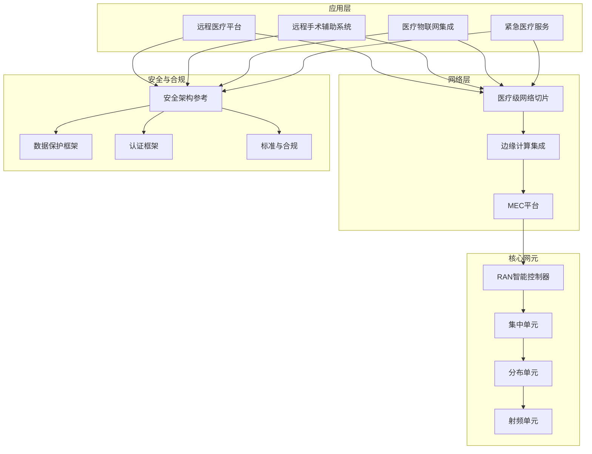
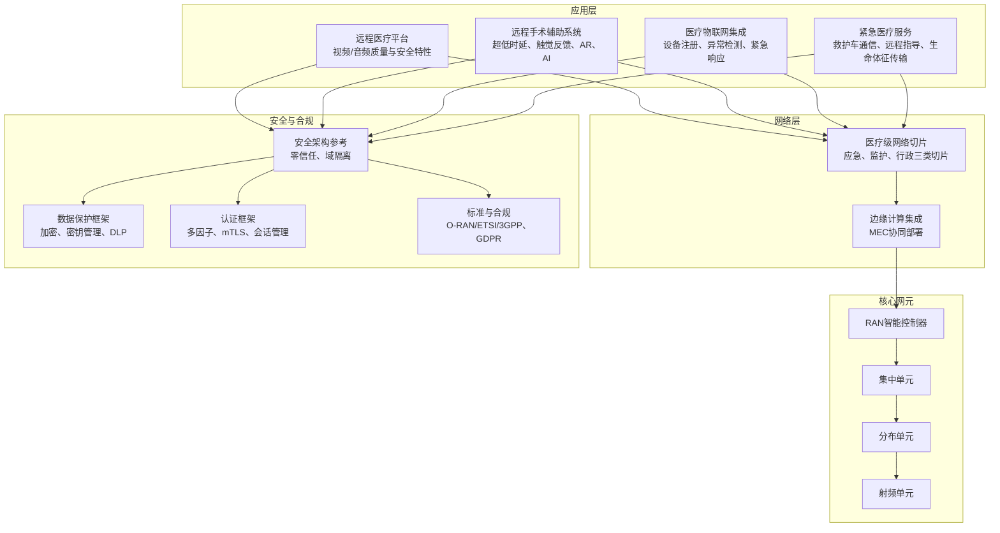
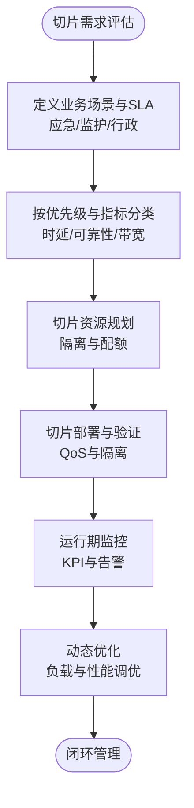
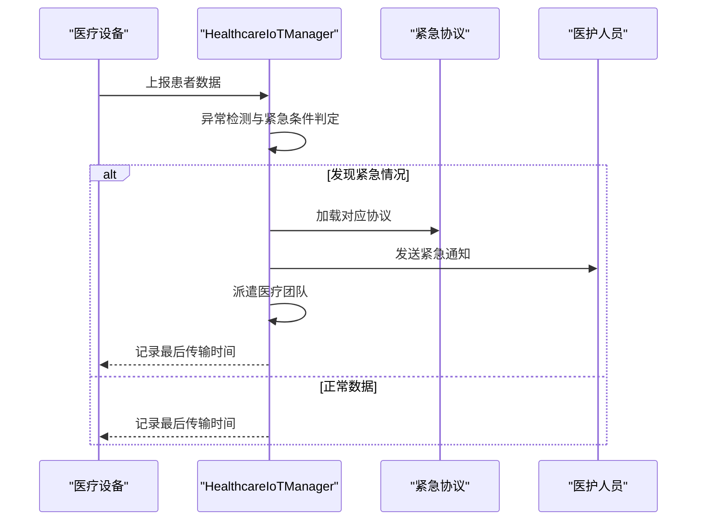
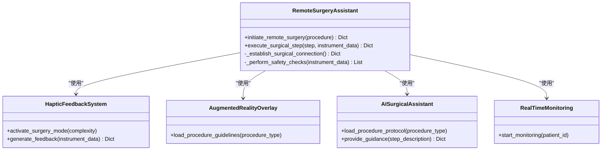
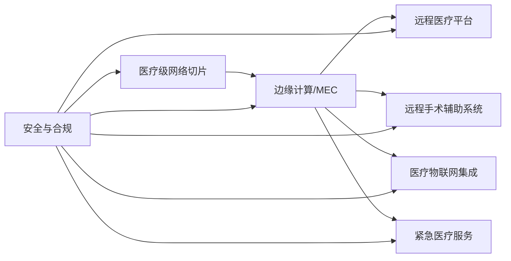

# 医疗健康应用

<cite>
**本文引用的文件**
- [医疗健康深度分析](file://10-application-scenarios/healthcare/healthcare-deep-dive.md)
- [医疗应用概览](file://10-application-scenarios/healthcare/readme.md)
- [O-RAN医疗解决方案（中文）](file://16-industry-solutions/healthcare/o-ran-healthcare-solutions-zh.md)
- [O-RAN医疗解决方案（英文）](file://16-industry-solutions/healthcare/o-ran-healthcare-solutions.md)
- [应用案例总览](file://10-application-scenarios/readme.md)
- [架构基础](file://01-architecture-system/readme.md)
- [部署与实施](file://08-deployment-implementation/readme.md)
- [标准与合规](file://09-standards-compliance/readme.md)
- [安全架构参考](file://12-security-privacy/security-architecture/security-reference-architecture.md)
- [数据保护框架](file://12-security-privacy/data-protection/data-protection-framework.md)
- [认证框架](file://12-security-privacy/authentication/authentication-framework.md)
</cite>

## 更新摘要
**变更内容**
- 新增了详细的医疗健康深度分析章节，涵盖远程医疗、医疗物联网和紧急医疗服务
- 扩展了网络切片、设备连接和患者监护的技术细节
- 增加了院前急救通信和直升机医疗救援的实际案例
- 完善了生产环境最佳实践和部署指导

## 目录
1. [简介](#简介)
2. [项目结构](#项目结构)
3. [核心组件](#核心组件)
4. [架构总览](#架构总览)
5. [详细组件分析](#详细组件分析)
6. [依赖关系分析](#依赖关系分析)
7. [性能考量](#性能考量)
8. [故障排查指南](#故障排查指南)
9. [结论](#结论)
10. [附录](#附录)

## 简介
本文件面向医疗健康应用，围绕远程医疗网络解决方案进行系统化说明，重点覆盖以下方面：
- **远程诊断、远程手术、远程监护的网络需求**：高带宽、低时延、高可靠
- **医院专用网络与边缘计算集成的部署策略**
- **医疗设备连接、患者监护、药品管理的低功耗、广覆盖、安全通信要求**
- **院前急救通信**（救护车通信、远程急救指导、生命体征传输）的无缝覆盖、高可靠与低时延保障
- **医疗数据传输安全**（端到端加密、访问控制、合规要求）与系统集成方案
- **实际应用案例**：远程手术指导、远程会诊、移动医疗、直升机医疗救援
- **智慧医院建设**（无线监护、智能床、药品追踪）、院前急救、直升机医疗救援的网络设计与实施指导
- **医疗设备认证、数据安全、干扰管理等技术要点**

## 项目结构
本仓库提供了O-RAN在医疗健康领域的完整知识体系，涵盖：
- **架构与接口规范**：理解O-RAN整体架构、核心网元与接口
- **应用场景**：明确医疗场景的网络需求与部署策略
- **部署与实施**：从硬件规划、测试到运维与自动化
- **标准与合规**：遵循O-RAN、ETSI、3GPP标准，确保合规与互操作
- **安全与数据保护**：零信任、加密、密钥管理、审计与合规
- **医疗健康解决方案**：网络切片、远程医疗平台、远程手术系统、医疗物联网集成

**图表来源**
- [应用案例总览:185-206](file://10-application-scenarios/readme.md#L185-L206)
- [架构基础:8-26](file://01-architecture-system/readme.md#L8-L26)
- [安全架构参考:6-36](file://12-security-privacy/security-architecture/security-reference-architecture.md#L6-L36)

**章节来源**
- [应用案例总览:1-140](file://10-application-scenarios/readme.md#L1-L140)
- [架构基础:1-161](file://01-architecture-system/readme.md#L1-L161)

## 核心组件
- **医疗级网络切片**：针对远程手术、远程监护、行政业务分别设定优先级、时延、可靠性与带宽目标
- **医疗物联网集成**：设备注册、数据处理、异常检测与紧急响应联动
- **远程手术辅助系统**：超低时延连接、触觉反馈、AR叠加、AI辅助、实时监控
- **紧急医疗服务**：救护车通信、远程急救指导、生命体征传输
- **边缘计算与MEC**：就近处理、降低时延、提升可靠性
- **安全与合规**：零信任、证书与密钥管理、加密、审计日志、GDPR/合规矩阵

**章节来源**
- [O-RAN医疗解决方案（中文）:8-50](file://16-industry-solutions/healthcare/o-ran-healthcare-solutions-zh.md#L8-L50)
- [O-RAN医疗解决方案（英文）:8-50](file://16-industry-solutions/healthcare/o-ran-healthcare-solutions.md#L8-L50)
- [医疗健康深度分析:9-90](file://10-application-scenarios/healthcare/healthcare-deep-dive.md#L9-L90)
- [应用案例总览:45-80](file://10-application-scenarios/readme.md#L45-L80)
- [安全架构参考:8-36](file://12-security-privacy/security-architecture/security-reference-architecture.md#L8-L36)
- [数据保护框架:6-28](file://12-security-privacy/data-protection/data-protection-framework.md#L6-L28)
- [认证框架:8-23](file://12-security-privacy/authentication/authentication-framework.md#L8-L23)

## 架构总览
O-RAN在医疗健康场景下的总体架构由"应用层—网络层—核心网元—安全与合规"四层构成。应用层包括远程医疗、远程手术、医疗物联网和紧急医疗服务；网络层以医疗级网络切片为核心，并结合边缘计算与MEC实现低时延与高可靠；核心网元沿用O-RAN参考架构；安全与合规贯穿全链路，确保数据与访问安全。

**图表来源**
- [O-RAN医疗解决方案（中文）:251-275](file://16-industry-solutions/healthcare/o-ran-healthcare-solutions-zh.md#L251-L275)
- [O-RAN医疗解决方案（英文）:251-275](file://16-industry-solutions/healthcare/o-ran-healthcare-solutions.md#L251-L275)
- [医疗健康深度分析:173-246](file://10-application-scenarios/healthcare/healthcare-deep-dive.md#L173-L246)
- [应用案例总览:45-80](file://10-application-scenarios/readme.md#L45-L80)
- [安全架构参考:8-36](file://12-security-privacy/security-architecture/security-reference-architecture.md#L8-L36)
- [数据保护框架:6-28](file://12-security-privacy/data-protection/data-protection-framework.md#L6-L28)
- [认证框架:8-23](file://12-security-privacy/authentication/authentication-framework.md#L8-L23)
- [标准与合规:8-45](file://09-standards-compliance/readme.md#L8-L45)

## 详细组件分析

### 组件一：医疗级网络切片
- **应急服务切片**：最高优先级，<1ms时延，99.999%可靠性，保障远程手术、远程急救与重症监护
- **患者监测切片**：高优先级，<10ms时延，99.9%可靠性，支撑持续生命体征监测、可穿戴设备与慢病管理
- **行政管理切片**：正常优先级，<100ms时延，99.5%可靠性，承载电子病历、医学影像传输与员工通信

**图表来源**
- [O-RAN医疗解决方案（中文）:8-50](file://16-industry-solutions/healthcare/o-ran-healthcare-solutions-zh.md#L8-L50)
- [O-RAN医疗解决方案（英文）:8-50](file://16-industry-solutions/healthcare/o-ran-healthcare-solutions.md#L8-L50)

**章节来源**
- [O-RAN医疗解决方案（中文）:8-50](file://16-industry-solutions/healthcare/o-ran-healthcare-solutions-zh.md#L8-L50)
- [O-RAN医疗解决方案（英文）:8-50](file://16-industry-solutions/healthcare/o-ran-healthcare-solutions.md#L8-L50)

### 组件二：医疗物联网集成（HealthcareIoTManager）
- **设备注册**：记录设备ID、类型、患者绑定、能力、状态、信号强度与最后传输时间
- **数据处理**：接收设备数据，标注异常、判定紧急条件、触发紧急响应流程
- **紧急响应**：基于预设协议自动通知相关人员、派发医疗团队，记录事件与处置状态

**图表来源**
- [O-RAN医疗解决方案（中文）:52-249](file://16-industry-solutions/healthcare/o-ran-healthcare-solutions-zh.md#L52-L249)

**章节来源**
- [O-RAN医疗解决方案（中文）:52-249](file://16-industry-solutions/healthcare/o-ran-healthcare-solutions-zh.md#L52-L249)
- [O-RAN医疗解决方案（英文）:52-249](file://16-industry-solutions/healthcare/o-ran-healthcare-solutions.md#L52-L249)

### 组件三：远程手术辅助系统（RemoteSurgeryAssistant）
- **超低时延连接**：建立<1ms时延、99.999%可靠性、最大安全等级的连接
- **触觉反馈系统**：根据手术复杂度激活，提供组织阻力反馈
- **AR叠加**：加载特定手术的3D解剖模型与步骤指导
- **AI辅助**：提供推荐动作、风险评估与成功率
- **实时监控**：同步患者生命体征与生理参数

**图表来源**
- [O-RAN医疗解决方案（中文）:277-456](file://16-industry-solutions/healthcare/o-ran-healthcare-solutions-zh.md#L277-L456)

**章节来源**
- [O-RAN医疗解决方案（中文）:277-456](file://16-industry-solutions/healthcare/o-ran-healthcare-solutions-zh.md#L277-L456)

### 组件四：远程医疗平台（高质量视频咨询）
- **视频质量规格**：4K超高清、60fps、<15ms延迟、HEVC/H.265压缩、25–50Mbps带宽
- **音频质量规格**：48kHz采样率、24-bit位深、3D音频渲染、AI降噪
- **安全特性**：AES-256端到端加密、多因素认证、HIPAA合规、全面审计日志

**章节来源**
- [O-RAN医疗解决方案（中文）:251-275](file://16-industry-solutions/healthcare/o-ran-healthcare-solutions-zh.md#L251-L275)
- [O-RAN医疗解决方案（英文）:251-275](file://16-industry-solutions/healthcare/o-ran-healthcare-solutions.md#L251-L275)

### 组件五：紧急医疗服务
- **救护车通信**：实时生命体征传输、视频会诊、患者数据传输、远程指导
- **远程急救指导**：专家支持、程序指导、诊断支持、决策支持、培训模拟
- **生命体征传输**：心电图传输、血压监测、血氧饱和度、呼吸频率、体温监测
- **直升机医疗救援**：飞行中可靠连接、专家医疗支持、改善救援结果

**章节来源**
- [医疗健康深度分析:173-246](file://10-application-scenarios/healthcare/healthcare-deep-dive.md#L173-L246)

### 组件六：边缘计算与MEC集成
- **O-RAN与MEC协同**：边缘智能编排、E2接口与MEC服务发现、动态资源分配
- **应用场景**：边缘视频分析、实时交通监控、工业设备故障预测、智能交通信号控制
- **复原性**：多站点冗余、自动切换、会话持久化、分钟级恢复

**章节来源**
- [应用案例总览:45-80](file://10-application-scenarios/readme.md#L45-L80)
- [部署与实施:27-39](file://08-deployment-implementation/readme.md#L27-L39)
- [部署与实施:75-86](file://08-deployment-implementation/readme.md#L75-L86)

### 组件七：安全与合规
- **零信任模型**：永不信任、最少权限、持续验证、微分段
- **多层防护**：物理安全、网络安全、平台安全、应用安全、数据安全
- **加密与密钥管理**：数据在静止与传输中加密、HSM集成、密钥派生与轮换
- **认证与授权**：多因子、mTLS、RBAC、OAuth 2.0、JWT
- **合规框架**：GDPR、NIST、ISO 27001、3GPP安全要求

**章节来源**
- [安全架构参考:8-36](file://12-security-privacy/security-architecture/security-reference-architecture.md#L8-L36)
- [安全架构参考:147-245](file://12-security-privacy/security-architecture/security-reference-architecture.md#L147-L245)
- [认证框架:8-23](file://12-security-privacy/authentication/authentication-framework.md#L8-L23)
- [认证框架:100-124](file://12-security-privacy/authentication/authentication-framework.md#L100-L124)
- [数据保护框架:6-28](file://12-security-privacy/data-protection/data-protection-framework.md#L6-L28)
- [数据保护框架:98-184](file://12-security-privacy/data-protection/data-protection-framework.md#L98-L184)
- [标准与合规:8-45](file://09-standards-compliance/readme.md#L8-L45)
- [标准与合规:110-135](file://09-standards-compliance/readme.md#L110-L135)

## 依赖关系分析
- 切片依赖于边缘计算与MEC，以满足低时延与高可靠
- 远程医疗与远程手术依赖切片提供的差异化SLA
- 医疗物联网依赖切片与边缘侧的数据处理能力
- 紧急医疗服务依赖切片的高优先级和低时延保障
- 安全与合规贯穿所有组件，形成统一的安全域与密钥管理体系

**图表来源**
- [应用案例总览:45-80](file://10-application-scenarios/readme.md#L45-L80)
- [安全架构参考:8-36](file://12-security-privacy/security-architecture/security-reference-architecture.md#L8-L36)

**章节来源**
- [应用案例总览:45-80](file://10-application-scenarios/readme.md#L45-L80)
- [安全架构参考:8-36](file://12-security-privacy/security-architecture/security-reference-architecture.md#L8-L36)

## 性能考量
- **时延与抖动**：远程手术<1ms，远程监护<10ms，行政业务<100ms
- **可靠性**：应急场景99.999%，监护场景99.9%，行政场景99.5%
- **带宽**：应急场景100Mbps，监护场景10Mbps，行政场景50Mbps
- **边缘部署**：MEC就近处理，减少回传时延
- **自动化与弹性**：容器化与云原生，支持弹性扩缩容与自愈

**章节来源**
- [O-RAN医疗解决方案（中文）:8-50](file://16-industry-solutions/healthcare/o-ran-healthcare-solutions-zh.md#L8-L50)
- [应用案例总览:45-80](file://10-application-scenarios/readme.md#L45-L80)
- [部署与实施:56-61](file://08-deployment-implementation/readme.md#L56-L61)

## 故障排查指南
- **常见问题分类**：接口故障（E2/A1/O1/O-FH/F1）、性能问题（时延/吞吐/丢包）、可用性问题、配置问题、兼容性问题
- **排查流程**：问题定义、信息收集（日志/指标/配置）、假设验证、根因分析（5 Why、鱼骨图、故障树）、解决与验证
- **诊断工具**：Wireshark/tcpdump、协议分析器、日志分析（ELK/Splunk）、性能分析（Perf/火焰图）、网络监控（Ping/Traceroute/MTR）
- **SOP**：故障响应、升级、沟通、复盘与知识库更新

**章节来源**
- [部署与实施:126-156](file://08-deployment-implementation/readme.md#L126-L156)
- [部署与实施:139-150](file://08-deployment-implementation/readme.md#L139-L150)

## 结论
O-RAN为医疗健康应用提供了可定制、低时延、高可靠的网络基础设施。通过医疗级网络切片、边缘计算与MEC集成、以及完善的安全与合规体系，可有效支撑远程诊断、远程手术、远程监护、院前急救、智慧医院等场景。建议在部署中坚持零信任与端到端加密，结合自动化与可观测性，确保系统的安全性、稳定性与可维护性。

## 附录

### 实际应用案例
- **远程医疗**：高质量视频咨询平台，4K超高清、60fps、<15ms延迟，端到端加密与多因素认证
- **远程手术**：超低时延连接（<1ms）、触觉反馈、AR叠加、AI辅助与实时监控
- **医疗物联网**：设备注册、异常检测、紧急响应联动，保障危重患者连续监护
- **院前急救**：救护车通信、远程急救指导、生命体征传输，无缝覆盖与高可靠
- **直升机医疗救援**：飞行中可靠连接、专家医疗支持、改善救援结果
- **智慧医院**：无线监护、智能床、药品追踪，边缘侧数据处理与安全隔离

**章节来源**
- [O-RAN医疗解决方案（中文）:251-275](file://16-industry-solutions/healthcare/o-ran-healthcare-solutions-zh.md#L251-L275)
- [O-RAN医疗解决方案（中文）:277-456](file://16-industry-solutions/healthcare/o-ran-healthcare-solutions-zh.md#L277-L456)
- [O-RAN医疗解决方案（中文）:52-249](file://16-industry-solutions/healthcare/o-ran-healthcare-solutions-zh.md#L52-L249)
- [医疗健康深度分析:67-90](file://10-application-scenarios/healthcare/healthcare-deep-dive.md#L67-L90)
- [医疗健康深度分析:231-246](file://10-application-scenarios/healthcare/healthcare-deep-dive.md#L231-L246)
- [应用案例总览:185-206](file://10-application-scenarios/readme.md#L185-L206)

### 技术要点清单
- **网络切片**：差异化SLA、资源隔离、动态调整
- **边缘计算**：就近处理、缓存策略、跨域协调
- **安全**：零信任、mTLS、RBAC、加密与密钥管理、审计日志
- **合规**：GDPR、NIST、ISO 27001、3GPP安全要求
- **设备认证**：PKI证书、OAuth 2.0、会话管理
- **干扰管理**：频谱规划、容量与覆盖优化、多厂商兼容测试
- **生产环境最佳实践**：可靠性优先、安全设计、低时延优化、互操作性、可扩展性

**章节来源**
- [标准与合规:8-45](file://09-standards-compliance/readme.md#L8-L45)
- [认证框架:25-69](file://12-security-privacy/authentication/authentication-framework.md#L25-L69)
- [数据保护框架:98-184](file://12-security-privacy/data-protection/data-protection-framework.md#L98-L184)
- [安全架构参考:147-245](file://12-security-privacy/security-architecture/security-reference-architecture.md#L147-L245)
- [应用案例总览:185-206](file://10-application-scenarios/readme.md#L185-L206)
- [医疗健康深度分析:247-272](file://10-application-scenarios/healthcare/healthcare-deep-dive.md#L247-L272)