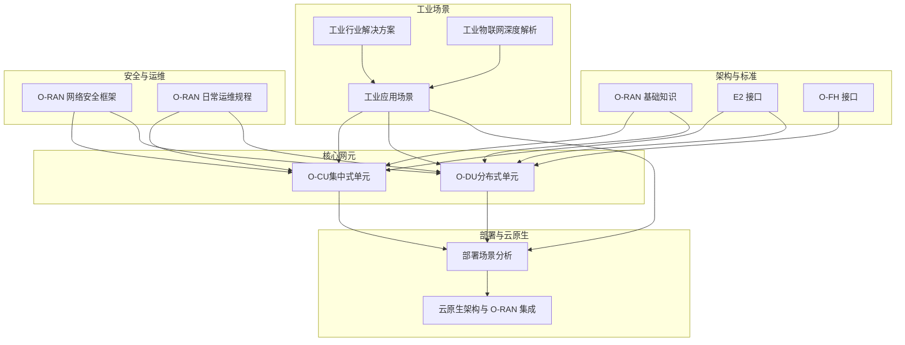
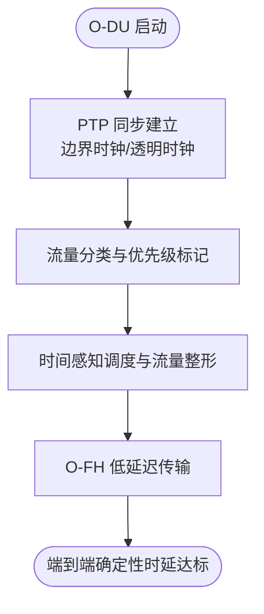
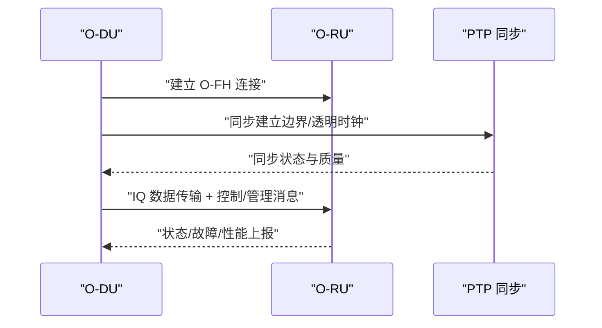
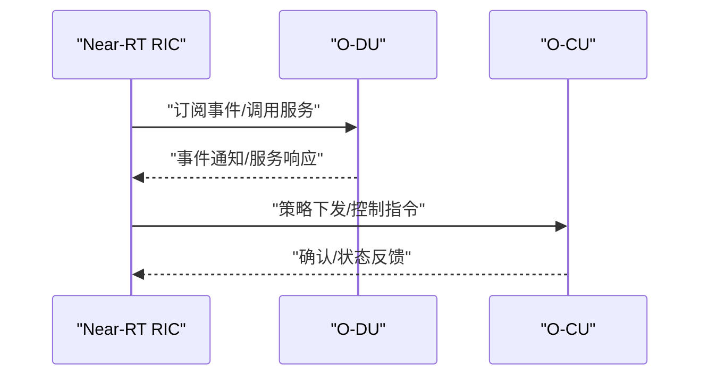
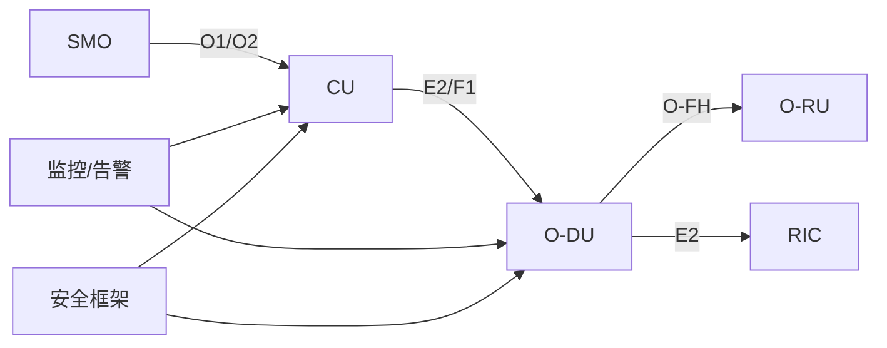

# 工业互联网应用

<cite>
**本文引用的文件**
- [O-RAN 基础知识](file://01-architecture-system/readme.md)
- [O-CU（集中式单元）](file://02-core-components/o-cu.md)
- [O-DU（分布式单元）](file://02-core-components/o-du.md)
- [开放前传接口（O-FH）](file://03-interface-standards/o-fh-interface.md)
- [E2 接口](file://03-interface-standards/e2-interface.md)
- [部署场景分析](file://04-disaggregation-options/deployment-scenarios.md)
- [云原生架构与 O-RAN 集成](file://05-cloud-integration/cloud-native-architecture.md)
- [工业应用场景](file://10-application-scenarios/readme.md)
- [工业物联网深度解析](file://10-application-scenarios/industrial-internet/industrial-internet-deep-dive.md)
- [工业行业解决方案](file://16-industry-solutions/readme.md)
- [制造业4.0解决方案](file://16-industry-solutions/manufacturing-4.0/)
- [O-RAN 网络安全框架](file://12-security-privacy/network-security/network-security-framework.md)
- [O-RAN 日常运维规程](file://14-operations-management/daily-operations/daily-operation-procedures.md)
</cite>

## 更新摘要
**变更内容**
- 新增了工业物联网深度解析章节，涵盖475行详细的技术内容
- 扩展了工业场景需求、私有网络部署、QoS保障机制和确定性网络技术
- 增强了IT/OT融合与工业系统集成的实施方案
- 完善了实际案例研究和最佳实践指导

## 目录
1. [引言](#引言)
2. [项目结构](#项目结构)
3. [核心组件](#核心组件)
4. [架构总览](#架构总览)
5. [详细组件分析](#详细组件分析)
6. [依赖关系分析](#依赖关系分析)
7. [性能与可靠性考量](#性能与可靠性考量)
8. [故障排查与运维指南](#故障排查与运维指南)
9. [结论](#结论)
10. [附录](#附录)

## 引言
本技术解决方案面向工业互联网应用，聚焦工业场景的严苛环境（高温、高湿、强电磁干扰）、网络指标（可靠性>99.999%、时延<1ms）、安全与运维要求，系统阐述专用 O-RAN 网络独立部署模式、本地核心网与边缘计算集成的架构设计，覆盖 QoS 保障机制、差异化服务级别与端到端服务质量保证；深入解析确定性网络技术（TSN 集成、IEEE 1588 高精度同步、时间感知调度）在工业控制中的应用；提供与 OT 系统（IT/OT 融合）的集成方案（SCADA、DCS、PLC、MES），包括协议转换与安全隔离；给出工业网络安全策略、多层防护与入侵检测的实施指导，并提供大型制造企业、工业园区、矿山等实际案例。

**更新** 新增了详细的工业物联网应用场景分析，包括环境挑战、网络指标、安全要求和运维需求的全面覆盖。

## 项目结构
本仓库围绕 O-RAN 架构的知识体系与工程实践，形成"架构—组件—接口—解耦—云原生—场景—安全—运维"完整脉络，支撑工业互联网应用的系统化落地。



**图示来源**
- [O-RAN 基础知识:1-161](file://01-architecture-system/readme.md#L1-L161)
- [O-CU（集中式单元）:1-419](file://02-core-components/o-cu.md#L1-L419)
- [O-DU（分布式单元）:1-415](file://02-core-components/o-du.md#L1-L415)
- [开放前传接口（O-FH）:1-397](file://03-interface-standards/o-fh-interface.md#L1-L397)
- [E2 接口:1-337](file://03-interface-standards/e2-interface.md#L1-L337)
- [部署场景分析:1-563](file://04-disaggregation-options/deployment-scenarios.md#L1-L563)
- [云原生架构与 O-RAN 集成:1-481](file://05-cloud-integration/cloud-native-architecture.md#L1-L481)
- [工业应用场景:81-116](file://10-application-scenarios/readme.md#L81-L116)
- [工业物联网深度解析:1-475](file://10-application-scenarios/industrial-internet/industrial-internet-deep-dive.md#L1-L475)
- [工业行业解决方案:1-24](file://16-industry-solutions/readme.md#L1-L24)
- [O-RAN 网络安全框架:1-473](file://12-security-privacy/network-security/network-security-framework.md#L1-L473)
- [O-RAN 日常运维规程:1-443](file://14-operations-management/daily-operations/daily-operation-procedures.md#L1-L443)

**章节来源**
- [O-RAN 基础知识:1-161](file://01-architecture-system/readme.md#L1-L161)
- [部署场景分析:1-563](file://04-disaggregation-options/deployment-scenarios.md#L1-L563)

## 核心组件
- O-CU（集中式单元）：负责非实时性高层协议栈，控制面（CU-CP）与用户面（CU-UP）分离，支持与 DU、AMF、SMO 等的接口，强调 QoS 管理与端到端服务质量保障。
- O-DU（分布式单元）：承担物理层与 MAC 层处理，对实时性要求高，强调低延迟（端到端<1ms）、高可靠（99.999%+）、时间同步（PTP<1μs）。
- O-FH 接口：连接 DU 与 RU，支持 eCPRI/RoE，提供用户面、控制面与同步功能，满足高带宽、低延迟与高精度同步。
- E2 接口：RIC 与 CU/DU 的服务化接口，基于 SCTP/STREAMS，支撑 Near-RT 控制闭环（<10ms）与 Non-RT 策略管理。

**章节来源**
- [O-CU（集中式单元）:1-419](file://02-core-components/o-cu.md#L1-L419)
- [O-DU（分布式单元）:1-415](file://02-core-components/o-du.md#L1-L415)
- [开放前传接口（O-FH）:1-397](file://03-interface-standards/o-fh-interface.md#L1-L397)
- [E2 接口:1-337](file://03-interface-standards/e2-interface.md#L1-L337)

## 架构总览
面向工业互联网的专用 O-RAN 网络采用"独立部署 + 本地核心网 + 边缘计算"的模式，结合云原生弹性与自动化能力，实现高可靠、低时延、确定性与安全隔离的工业控制网络。

```mermaid
graph TB
subgraph "工业现场"
RU["无线单元O-RU"]
OT["工业控制系统SCADA/DCS/PLC/MES"]
end
subgraph "前传与中传"
FH["开放前传接口O-FH"]
FTW["中传网络"]
end
subgraph "边缘与核心"
DU["分布式单元O-DU"]
CU["集中式单元O-CU"]
RIC["RAN 智能控制器RIC"]
SMO["服务管理与编排SMO"]
end
subgraph "云与安全"
K8S["容器编排Kubernetes"]
MON["监控与告警"]
SEC["多层安全防护"]
end
OT --> RU
RU --> FH
FH --> DU
DU <- --> RIC
DU < --> FTW
FTW --> CU
CU < --> SMO
DU < --> K8S
CU < --> K8S
K8S --> MON
MON --> SEC
```

**图示来源**
- [O-RAN 基础知识:1-161](file://01-architecture-system/readme.md#L1-L161)
- [O-DU（分布式单元）:1-415](file://02-core-components/o-du.md#L1-L415)
- [O-CU（集中式单元）:1-419](file://02-core-components/o-cu.md#L1-L419)
- [开放前传接口（O-FH）:1-397](file://03-interface-standards/o-fh-interface.md#L1-L397)
- [E2 接口:1-337](file://03-interface-standards/e2-interface.md#L1-L337)
- [云原生架构与 O-RAN 集成:1-481](file://05-cloud-integration/cloud-native-architecture.md#L1-L481)
- [O-RAN 网络安全框架:1-473](file://12-security-privacy/network-security/network-security-framework.md#L1-L473)
- [O-RAN 日常运维规程:1-443](file://14-operations-management/daily-operations/daily-operation-procedures.md#L1-L443)

## 详细组件分析

### 工业场景特殊需求与环境挑战

**新增** 基于最新的工业物联网深度解析内容，工业场景面临以下特殊挑战：

#### 环境挑战
- **高温环境**：极端温度条件下的设备可靠性保障
- **高湿度环境**：潮湿环境对设备性能的影响
- **强电磁干扰**：工业机械产生的电磁干扰影响
- **粉尘颗粒**：颗粒物对设备性能的影响
- **振动冲击**：工业过程产生的机械应力

#### 网络指标要求
- **可靠性**：关键应用需要>99.999%的可靠性
- **时延**：实时控制应用需要<1ms的时延
- **可用性**：24/7连续运行
- **确定性**：过程控制的确定性行为
- **可扩展性**：支持数千个连接设备

**章节来源**
- [工业物联网深度解析:11-28](file://10-application-scenarios/industrial-internet/industrial-internet-deep-dive.md#L11-L28)

### O-DU 确定性网络与同步
- 实时性与同步：物理层与 MAC 层处理延迟要求严格，端到端延迟<1ms；时间同步采用 IEEE 1588 PTP，精度<1μs，支持边界时钟/透明时钟。
- 确定性调度：通过时间感知调度、流量整形与 QoS 保障关键控制流量的确定性时延与零抖动。
- 部署与优化：分布式部署靠近 RU/工厂，结合边缘计算平台降低端到端时延；前传网络冗余与低延迟队列配置。



**图示来源**
- [O-DU（分布式单元）:51-67](file://02-core-components/o-du.md#L51-L67)
- [开放前传接口（O-FH）:42-58](file://03-interface-standards/o-fh-interface.md#L42-L58)

**章节来源**
- [O-DU（分布式单元）:51-67](file://02-core-components/o-du.md#L51-L67)
- [开放前传接口（O-FH）:42-58](file://03-interface-standards/o-fh-interface.md#L42-L58)

### O-FH 前传网络与鲁棒性
- 协议与能力：支持 eCPRI/RoE，提供 IQ 数据传输、RU 控制管理与同步（PTP/SyncE）。
- 网络规划：带宽按天线/带宽/调制方式计算并预留冗余；延迟满足 URLLC；链路聚合与路径冗余提升可靠性；QoS 保障同步与控制面优先。
- 同步精度：时间同步<100ns，频率同步<10ppb；部署高精度时间服务器与同步源冗余。



**图示来源**
- [开放前传接口（O-FH）:82-116](file://03-interface-standards/o-fh-interface.md#L82-L116)

**章节来源**
- [开放前传接口（O-FH）:117-198](file://03-interface-standards/o-fh-interface.md#L117-L198)

### E2 接口与 Near-RT 控制闭环
- 服务化架构：基于 SCTP/STREAMS，支持服务发现、调用、事件通知与订阅管理。
- 低延迟与可靠性：Near-RT RIC 延迟<10ms，接口冗余与 QoS 保障；消息压缩、批量处理与网络加速（SR-IOV/DPDK）优化。
- 部署策略：分布式部署靠近 CU/DU，混合部署平衡实时性与管理效率。



**图示来源**
- [E2 接口:90-147](file://03-interface-standards/e2-interface.md#L90-L147)

**章节来源**
- [E2 接口:148-240](file://03-interface-standards/e2-interface.md#L148-L240)

### QoS 保障与差异化服务

**更新** 基于最新的工业物联网深度解析，QoS保障机制更加完善：

#### 差异化服务等级
- **服务类别**：为不同应用提供不同的服务类别
- **优先级级别**：基于优先级的服务差异化
- **资源分配**：每个服务类别的资源预留
- **性能保证**：每个服务级别的性能保证
- **SLA管理**：服务等级协议管理

#### QoS 级别定义
- **关键控制流量**：控制命令的最高优先级
- **非关键监控流量**：监控数据的较低优先级
- **尽力而为流量**：非关键应用的尽力而为
- **背景流量**：批量数据传输的背景流量
- **紧急流量**：最高优先级的紧急流量

#### 实现机制
- **流量分类**：深度包检测、头部分析、应用感知分类
- **优先级标记**：DSCP标记、802.1p标记、流量类别分配
- **资源预留**：RSVP、IntServ、DiffServ架构支持

**章节来源**
- [工业物联网深度解析:191-234](file://10-application-scenarios/industrial-internet/industrial-internet-deep-dive.md#L191-L234)
- [工业应用场景:24-30](file://10-application-scenarios/readme.md#L24-L30)

### 确定性网络技术

**新增** 基于最新的工业物联网深度解析，确定性网络技术得到详细说明：

#### TSN集成
- **IEEE 802.1 TSN**：时间敏感网络标准
- **时间感知调度**：时间感知的流量调度
- **帧抢占**：低延迟的帧抢占机制
- **路径控制**：确定性路径控制
- **流预留**：保证资源的流预留

#### 时间同步
- **IEEE 1588 PTP**：精确时间协议
- **亚微秒级同步**：亚微秒级时间同步
- **全网同步**：全网时间分发
- **保持模式**：参考丢失时的时序维护
- **冗余**：冗余时序源

#### 调度机制
- **循环调度**：循环流量调度
- **门控控制**：时间感知门控控制
- **优先级处理**：时间感知优先级处理
- **带宽分配**：时间感知带宽分配
- **时延控制**：时间感知时延控制

**章节来源**
- [工业物联网深度解析:279-334](file://10-application-scenarios/industrial-internet/industrial-internet-deep-dive.md#L279-L334)

### 私有网络部署模式

**更新** 基于最新的工业物联网深度解析，私有网络部署模式更加详细：

#### 工业企业专用O-RAN网络
- **专用基础设施**：企业专用的网络基础设施
- **本地核心网**：本地部署的核心网络
- **独立管理**：独立的网络管理和控制
- **定制配置**：针对工业需求的定制网络配置
- **安全控制**：全面的网络安全控制

#### 部署模式选择
- **本地核心网**：本地部署核心网以降低时延
- **边缘计算集成**：边缘计算用于实时处理
- **混合云**：混合云边缘部署以提供灵活性
- **多站点部署**：大型企业多站点网络部署
- **灾难恢复**：灾难恢复和业务连续性规划

#### 频谱选择策略
- **授权频谱**：工业使用的专用频段
- **共享频谱**：CBRS公民宽带无线电服务
- **非授权频谱**：Wi-Fi和NR-U在非授权频段的使用

**章节来源**
- [工业物联网深度解析:91-162](file://10-application-scenarios/industrial-internet/industrial-internet-deep-dive.md#L91-L162)

### IT/OT融合与系统集成

**更新** 基于最新的工业物联网深度解析，IT/OT融合更加完善：

#### IT/OT收敛架构
- **收敛架构**：IT/OT收敛的架构设计
- **集成点**：IT和OT之间的集成点
- **数据交换**：域间的安全数据交换
- **协议转换**：域间的协议转换
- **安全边界**：域间的安全边界

#### 集成点识别
- **SCADA系统**：数据采集与监视控制系统集成
- **DCS系统**：分布式控制系统集成
- **PLC系统**：可编程逻辑控制器集成
- **MES系统**：制造执行系统集成
- **ERP系统**：企业资源计划系统集成

#### 协议转换机制
- **工业协议支持**：Modbus、PROFIBUS、OPC UA、EtherNet/IP、PROFINET
- **协议适配**：不同协议间的转换、桥接、标准化和优化

#### 安全策略
- **工业防火墙**：深度包检测、应用感知防火墙规则
- **DMZ架构**：工业网络的隔离区架构
- **访问控制**：区域间的受控访问

**章节来源**
- [工业物联网深度解析:361-416](file://10-application-scenarios/industrial-internet/industrial-internet-deep-dive.md#L361-L416)

### 实际案例研究

**新增** 基于最新的工业物联网深度解析，包含丰富的实际案例：

#### 钢铁厂案例
- **挑战**：极端温度和电磁干扰
- **解决方案**：加固的O-RAN设备，具备EMI屏蔽功能
- **性能**：恶劣环境下的可靠连接
- **集成**：与钢铁制造系统的集成
- **效益**：提高生产效率，减少停机时间

#### 化工厂案例
- **挑战**：危险环境需要安全认证
- **解决方案**：本质安全的O-RAN设备
- **性能**：危险区域的可靠连接
- **安全**：满足化工行业安全标准
- **效益**：提高安全性，运营效率

#### 汽车制造厂案例
- **挑战**：复杂的装配线需要实时协调
- **解决方案**：边缘计算的私有5G网络
- **性能**：机器人控制的<1ms时延
- **集成**：与制造执行系统的集成
- **效益**：提高生产灵活性，质量改进

#### 大型制造企业案例
- **挑战**：连接大型工厂的数千台机器和传感器
- **解决方案**：多小区的校园级私有5G网络
- **性能**：无缝覆盖，高容量
- **集成**：与企业IT系统的集成
- **效益**：数字化转型，运营效率

**章节来源**
- [工业物联网深度解析:65-188](file://10-application-scenarios/industrial-internet/industrial-internet-deep-dive.md#L65-L188)

### 云原生与弹性运维
- 容器化与微服务：CU/DU/RIC/SMO 微服务化与容器化，Kubernetes 编排、HPA/VPA、蓝绿/金丝雀发布。
- 自动化与可观测性：基础设施即代码、CI/CD、Prometheus/Grafana、分布式追踪与智能告警。
- 边缘与混合部署：核心云集中管理、边缘云就近处理、混合云协同，满足不同业务时延与可靠性需求。

**章节来源**
- [云原生架构与 O-RAN 集成:177-296](file://05-cloud-integration/cloud-native-architecture.md#L177-L296)
- [O-RAN 日常运维规程:361-443](file://14-operations-management/daily-operations/daily-operation-procedures.md#L361-L443)

### 工业网络安全与多层防护
- 网络分段与零信任：管理域、控制面域、用户面域、基础设施域分层隔离，最小权限与持续验证。
- 入侵检测与 DDoS 防护：基于签名的 IDS/IPS、速率限制与流量整形、NFTables/iptables 规则、黑洞路由与地理过滤。
- 通信安全：TLS/HTTP2、证书与 OCSP Stapling、安全头部与会话管理。

**章节来源**
- [O-RAN 网络安全框架:6-112](file://12-security-privacy/network-security/network-security-framework.md#L6-L112)
- [O-RAN 网络安全框架:114-309](file://12-security-privacy/network-security/network-security-framework.md#L114-L309)
- [O-RAN 网络安全框架:428-473](file://12-security-privacy/network-security/network-security-framework.md#L428-L473)

## 依赖关系分析
- 组件耦合：O-DU 与 O-FH 的强耦合（同步与 IQ 传输）、O-CU 与 DU/E2 的控制与用户面协同、RIC 与 DU/CU 的服务化交互。
- 外部依赖：PTP/SyncE 同步源、SCTP/STREAMS 协议栈、Kubernetes 编排与云原生工具链。
- 风险与缓解：同步精度与协议栈兼容性风险、跨域 QoS 协同复杂度、多厂商互操作性与安全边界管理。



**图示来源**
- [O-DU（分布式单元）:68-86](file://02-core-components/o-du.md#L68-L86)
- [开放前传接口（O-FH）:1-397](file://03-interface-standards/o-fh-interface.md#L1-L397)
- [E2 接口:1-337](file://03-interface-standards/e2-interface.md#L1-L337)
- [O-RAN 网络安全框架:1-473](file://12-security-privacy/network-security/network-security-framework.md#L1-L473)
- [O-RAN 日常运维规程:1-443](file://14-operations-management/daily-operations/daily-operation-procedures.md#L1-L443)

## 性能与可靠性考量
- 时延目标：<1ms（端到端 URLLC），前传与中传网络优化、队列调度与 SR-IOV/DPDK。
- 可靠性目标：>99.999%（5 个 9），冗余路径、多副本部署、自动故障转移与快速恢复。
- 同步精度：PTP<100ns、频率同步<10ppb，边界时钟/透明时钟与同步源冗余。
- QoS 保障：差异化服务等级、资源预留、端到端监控与策略一致性。

**章节来源**
- [O-DU（分布式单元）:51-67](file://02-core-components/o-du.md#L51-L67)
- [开放前传接口（O-FH）:157-178](file://03-interface-standards/o-fh-interface.md#L157-L178)
- [工业物联网深度解析:21-28](file://10-application-scenarios/industrial-internet/industrial-internet-deep-dive.md#L21-L28)

## 故障排查与运维指南
- 日常健康检查：组件健康状态轮询、接口监控与告警阈值设定。
- 配置管理：备份/恢复、变更流程、回滚策略与自动化验证。
- 故障处理：分级响应矩阵、故障定位方法（告警/日志/性能/测试）、标准化处置流程。
- 性能优化：KPI 面板、自动告警规则、容量评估与资源动态调整。

**章节来源**
- [O-RAN 日常运维规程:6-161](file://14-operations-management/daily-operations/daily-operation-procedures.md#L6-L161)
- [O-RAN 日常运维规程:163-281](file://14-operations-management/daily-operations/daily-operation-procedures.md#L163-L281)
- [O-RAN 日常运维规程:283-443](file://14-operations-management/daily-operations/daily-operation-procedures.md#L283-L443)

## 结论
本方案以 O-RAN 架构为基础，结合云原生弹性与自动化能力，针对工业场景的高可靠、低时延、确定性与安全隔离需求，提出专用 O-RAN 网络独立部署、本地核心网与边缘计算集成的总体思路；通过 O-DU 的确定性网络与同步、O-FH 的高带宽低延迟、E2 接口的 Near-RT 控制闭环、QoS 差异化与端到端保障、IT/OT 融合与安全隔离、以及多层防护与入侵检测，形成完整的工业互联网技术解决方案。依托仓库中的架构、组件、接口、部署、云原生、安全与运维文档，可支撑大型制造企业、工业园区、矿山等规模化落地。

**更新** 新增的详细工业物联网深度解析内容进一步丰富了方案的实施指导和最佳实践，为企业部署工业物联网应用提供了更全面的技术支撑。

## 附录
- 关键术语：O-RAN、O-CU、O-DU、O-RU、O-FH、E2、RIC、SMO、TSN、PTP、SR-IOV、DPDK、Kubernetes、NFTables、零信任。
- 参考文件：见"本文引用的文件"。