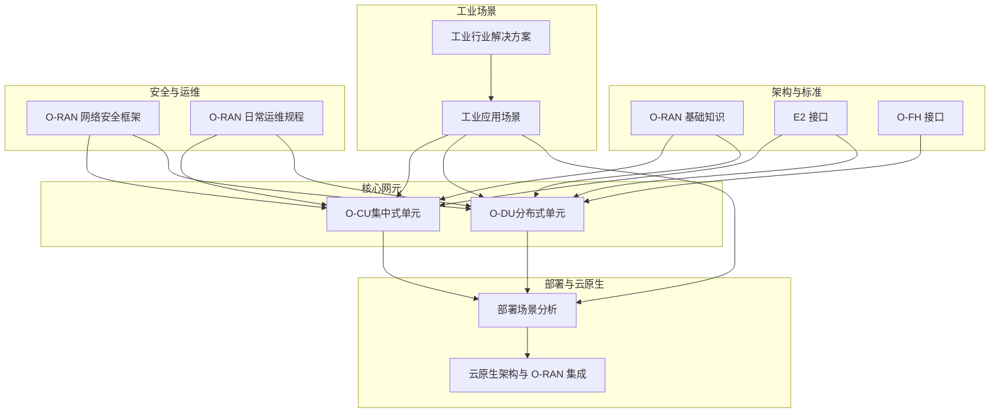
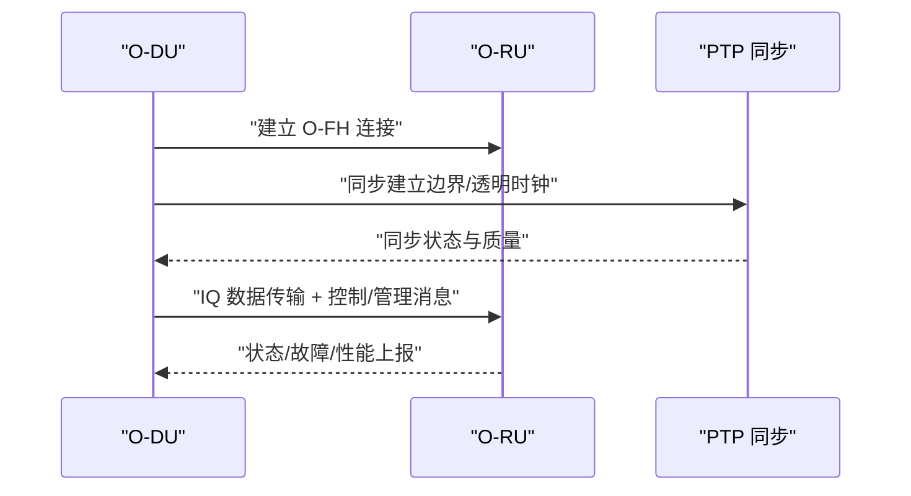
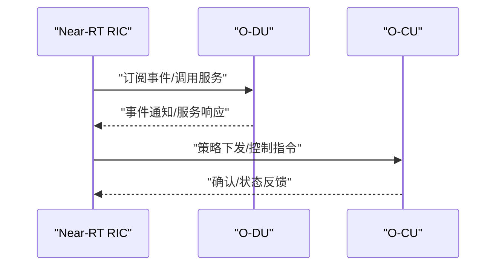
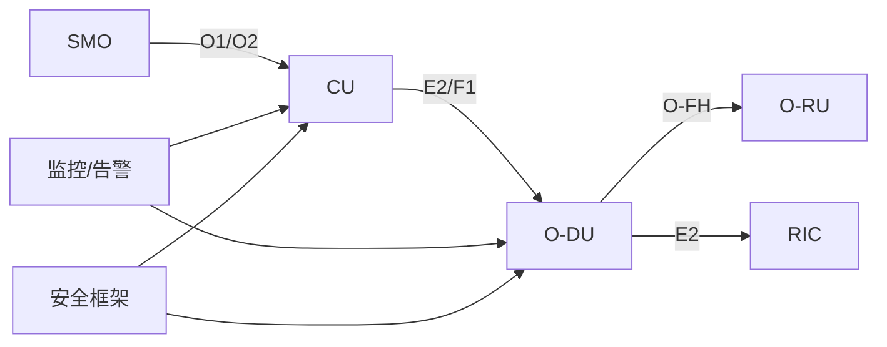

# 工业互联网应用

<cite>
**本文引用的文件**
- [O-RAN 基础知识](file://01-architecture-system/readme.md)
- [O-CU（集中式单元）](file://02-core-components/o-cu.md)
- [O-DU（分布式单元）](file://02-core-components/o-du.md)
- [开放前传接口（O-FH）](file://03-interface-standards/o-fh-interface.md)
- [E2 接口](file://03-interface-standards/e2-interface.md)
- [部署场景分析](file://04-disaggregation-options/deployment-scenarios.md)
- [云原生架构与 O-RAN 集成](file://05-cloud-integration/cloud-native-architecture.md)
- [工业应用场景](file://10-application-scenarios/readme.md)
- [工业行业解决方案](file://16-industry-solutions/readme.md)
- [O-RAN 网络安全框架](file://12-security-privacy/network-security/network-security-framework.md)
- [O-RAN 日常运维规程](file://14-operations-management/daily-operations/daily-operation-procedures.md)
</cite>

## 目录
1. [引言](#引言)
2. [项目结构](#项目结构)
3. [核心组件](#核心组件)
4. [架构总览](#架构总览)
5. [详细组件分析](#详细组件分析)
6. [依赖关系分析](#依赖关系分析)
7. [性能与可靠性考量](#性能与可靠性考量)
8. [故障排查与运维指南](#故障排查与运维指南)
9. [结论](#结论)
10. [附录](#附录)

## 引言
本技术解决方案面向工业互联网应用，聚焦工业场景的严苛环境（高温、高湿、强电磁干扰）、网络指标（可靠性>99.999%、时延<1ms）、安全与运维要求，系统阐述专用 O-RAN 网络独立部署模式、本地核心网与边缘计算集成的架构设计，覆盖 QoS 保障机制、差异化服务级别与端到端服务质量保证；深入解析确定性网络技术（TSN 集成、IEEE 1588 高精度同步、时间感知调度）在工业控制中的应用；提供与 OT 系统（IT/OT 融合）的集成方案（SCADA、DCS、PLC、MES），包括协议转换与安全隔离；给出工业网络安全策略、多层防护与入侵检测的实施指导，并提供大型制造企业、工业园区、矿山等实际案例。

## 项目结构
本仓库围绕 O-RAN 架构的知识体系与工程实践，形成“架构—组件—接口—解耦—云原生—场景—安全—运维”完整脉络，支撑工业互联网应用的系统化落地。



图示来源
- [O-RAN 基础知识](file://01-architecture-system/readme.md#L1-L161)
- [O-CU（集中式单元）](file://02-core-components/o-cu.md#L1-L419)
- [O-DU（分布式单元）](file://02-core-components/o-du.md#L1-L415)
- [开放前传接口（O-FH）](file://03-interface-standards/o-fh-interface.md#L1-L397)
- [E2 接口](file://03-interface-standards/e2-interface.md#L1-L337)
- [部署场景分析](file://04-disaggregation-options/deployment-scenarios.md#L1-L563)
- [云原生架构与 O-RAN 集成](file://05-cloud-integration/cloud-native-architecture.md#L1-L481)
- [工业应用场景](file://10-application-scenarios/readme.md#L81-L116)
- [工业行业解决方案](file://16-industry-solutions/readme.md#L1-L24)
- [O-RAN 网络安全框架](file://12-security-privacy/network-security/network-security-framework.md#L1-L473)
- [O-RAN 日常运维规程](file://14-operations-management/daily-operations/daily-operation-procedures.md#L1-L443)

章节来源
- [O-RAN 基础知识](file://01-architecture-system/readme.md#L1-L161)
- [部署场景分析](file://04-disaggregation-options/deployment-scenarios.md#L1-L563)

## 核心组件
- O-CU（集中式单元）：负责非实时性高层协议栈，控制面（CU-CP）与用户面（CU-UP）分离，支持与 DU、AMF、SMO 等的接口，强调 QoS 管理与端到端服务质量保障。
- O-DU（分布式单元）：承担物理层与 MAC 层处理，对实时性要求高，强调低延迟（端到端<1ms）、高可靠（99.999%+）、时间同步（PTP<1μs）。
- O-FH 接口：连接 DU 与 RU，支持 eCPRI/RoE，提供用户面、控制面与同步功能，满足高带宽、低延迟与高精度同步。
- E2 接口：RIC 与 CU/DU 的服务化接口，基于 SCTP/STREAMS，支撑 Near-RT 控制闭环（<10ms）与 Non-RT 策略管理。

章节来源
- [O-CU（集中式单元）](file://02-core-components/o-cu.md#L1-L419)
- [O-DU（分布式单元）](file://02-core-components/o-du.md#L1-L415)
- [开放前传接口（O-FH）](file://03-interface-standards/o-fh-interface.md#L1-L397)
- [E2 接口](file://03-interface-standards/e2-interface.md#L1-L337)

## 架构总览
面向工业互联网的专用 O-RAN 网络采用“独立部署 + 本地核心网 + 边缘计算”的模式，结合云原生弹性与自动化能力，实现高可靠、低时延、确定性与安全隔离的工业控制网络。

```mermaid
graph TB
subgraph "工业现场"
RU["无线单元O-RU"]
OT["工业控制系统SCADA/DCS/PLC/MES"]
end
subgraph "前传与中传"
FH["开放前传接口O-FH"]
FTW["中传网络"]
end
subgraph "边缘与核心"
DU["分布式单元O-DU"]
CU["集中式单元O-CU"]
RIC["RAN 智能控制器RIC"]
SMO["服务管理与编排SMO"]
end
subgraph "云与安全"
K8S["容器编排Kubernetes"]
MON["监控与告警"]
SEC["多层安全防护"]
end
OT --> RU
RU --> FH
FH --> DU
DU <- --> RIC
DU < --> FTW
FTW --> CU
CU < --> SMO
DU < --> K8S
CU < --> K8S
K8S --> MON
MON --> SEC
```

图示来源
- [O-RAN 基础知识](file://01-architecture-system/readme.md#L1-L161)
- [O-DU（分布式单元）](file://02-core-components/o-du.md#L1-L415)
- [O-CU（集中式单元）](file://02-core-components/o-cu.md#L1-L419)
- [开放前传接口（O-FH）](file://03-interface-standards/o-fh-interface.md#L1-L397)
- [E2 接口](file://03-interface-standards/e2-interface.md#L1-L337)
- [云原生架构与 O-RAN 集成](file://05-cloud-integration/cloud-native-architecture.md#L1-L481)
- [O-RAN 网络安全框架](file://12-security-privacy/network-security/network-security-framework.md#L1-L473)
- [O-RAN 日常运维规程](file://14-operations-management/daily-operations/daily-operation-procedures.md#L1-L443)

## 详细组件分析

### O-DU 确定性网络与同步
- 实时性与同步：物理层与 MAC 层处理延迟要求严格，端到端延迟<1ms；时间同步采用 IEEE 1588 PTP，精度<1μs，支持边界时钟/透明时钟。
- 确定性调度：通过时间感知调度、流量整形与 QoS 保障关键控制流量的确定性时延与零抖动。
- 部署与优化：分布式部署靠近 RU/工厂，结合边缘计算平台降低端到端时延；前传网络冗余与低延迟队列配置。


图示来源
- [O-DU（分布式单元）](file://02-core-components/o-du.md#L51-L67)
- [开放前传接口（O-FH）](file://03-interface-standards/o-fh-interface.md#L42-L58)

章节来源
- [O-DU（分布式单元）](file://02-core-components/o-du.md#L51-L67)
- [开放前传接口（O-FH）](file://03-interface-standards/o-fh-interface.md#L42-L58)

### O-FH 前传网络与鲁棒性
- 协议与能力：支持 eCPRI/RoE，提供 IQ 数据传输、RU 控制管理与同步（PTP/SyncE）。
- 网络规划：带宽按天线/带宽/调制方式计算并预留冗余；延迟满足 URLLC；链路聚合与路径冗余提升可靠性；QoS 保障同步与控制面优先。
- 同步精度：时间同步<100ns，频率同步<10ppb；部署高精度时间服务器与同步源冗余。



图示来源
- [开放前传接口（O-FH）](file://03-interface-standards/o-fh-interface.md#L82-L116)

章节来源
- [开放前传接口（O-FH）](file://03-interface-standards/o-fh-interface.md#L117-L198)

### E2 接口与 Near-RT 控制闭环
- 服务化架构：基于 SCTP/STREAMS，支持服务发现、调用、事件通知与订阅管理。
- 低延迟与可靠性：Near-RT RIC 延迟<10ms，接口冗余与 QoS 保障；消息压缩、批量处理与网络加速（SR-IOV/DPDK）优化。
- 部署策略：分布式部署靠近 CU/DU，混合部署平衡实时性与管理效率。



图示来源
- [E2 接口](file://03-interface-standards/e2-interface.md#L90-L147)

章节来源
- [E2 接口](file://03-interface-standards/e2-interface.md#L148-L240)

### QoS 保障与差异化服务
- 差异化等级：关键控制流量（工业控制）与非关键监控流量区分；资源预留与优先级标记。
- 实现机制：流量分类、优先级标记、队列调度与带宽保障；端到端监控（时延、抖动、丢包、可用性）。
- 跨域协调：跨网元/跨域的 QoS 协同与策略一致性。

章节来源
- [工业应用场景](file://10-application-scenarios/readme.md#L96-L102)

### 云原生与弹性运维
- 容器化与微服务：CU/DU/RIC/SMO 微服务化与容器化，Kubernetes 编排、HPA/VPA、蓝绿/金丝雀发布。
- 自动化与可观测性：基础设施即代码、CI/CD、Prometheus/Grafana、分布式追踪与智能告警。
- 边缘与混合部署：核心云集中管理、边缘云就近处理、混合云协同，满足不同业务时延与可靠性需求。

章节来源
- [云原生架构与 O-RAN 集成](file://05-cloud-integration/cloud-native-architecture.md#L177-L296)
- [O-RAN 日常运维规程](file://14-operations-management/daily-operations/daily-operation-procedures.md#L361-L443)

### 工业场景部署与案例
- 独立部署与本地核心网：工业专网独立部署，本地核心网与边缘计算集成，支持本地化数据与控制。
- 场景适配：工业园区、大型制造企业、矿山等，满足高可靠、低时延、环境适应与安全隔离。
- 案例成果：端到端时延降至 0.5ms 以下、可用性达 99.999%、支持工业控制与智能制造应用。

章节来源
- [工业应用场景](file://10-application-scenarios/readme.md#L89-L116)
- [部署场景分析](file://04-disaggregation-options/deployment-scenarios.md#L216-L295)

### IT/OT 融合与系统集成
- 集成点：SCADA、DCS、PLC、MES 等工业系统；通过协议转换适配 Modbus、PROFINET、OPC UA 等。
- 安全策略：工业防火墙、DMZ、访问控制与最小权限原则；OT/IT 网络分段与隔离。
- 挑战与对策：协议复杂性、边界安全与系统互操作，建议采用专用网关与安全域划分。

章节来源
- [工业应用场景](file://10-application-scenarios/readme.md#L110-L116)

### 工业网络安全与多层防护
- 网络分段与零信任：管理域、控制面域、用户面域、基础设施域分层隔离，最小权限与持续验证。
- 入侵检测与 DDoS 防护：基于签名的 IDS/IPS、速率限制与流量整形、NFTables/iptables 规则、黑洞路由与地理过滤。
- 通信安全：TLS/HTTP2、证书与 OCSP Stapling、安全头部与会话管理。

章节来源
- [O-RAN 网络安全框架](file://12-security-privacy/network-security/network-security-framework.md#L6-L112)
- [O-RAN 网络安全框架](file://12-security-privacy/network-security/network-security-framework.md#L114-L309)
- [O-RAN 网络安全框架](file://12-security-privacy/network-security/network-security-framework.md#L428-L473)

## 依赖关系分析
- 组件耦合：O-DU 与 O-FH 的强耦合（同步与 IQ 传输）、O-CU 与 DU/E2 的控制与用户面协同、RIC 与 DU/CU 的服务化交互。
- 外部依赖：PTP/SyncE 同步源、SCTP/STREAMS 协议栈、Kubernetes 编排与云原生工具链。
- 风险与缓解：同步精度与协议栈兼容性风险、跨域 QoS 协同复杂度、多厂商互操作性与安全边界管理。



图示来源
- [O-DU（分布式单元）](file://02-core-components/o-du.md#L68-L86)
- [开放前传接口（O-FH）](file://03-interface-standards/o-fh-interface.md#L1-L397)
- [E2 接口](file://03-interface-standards/e2-interface.md#L1-L337)
- [O-RAN 网络安全框架](file://12-security-privacy/network-security/network-security-framework.md#L1-L473)
- [O-RAN 日常运维规程](file://14-operations-management/daily-operations/daily-operation-procedures.md#L1-L443)

## 性能与可靠性考量
- 时延目标：<1ms（端到端 URLLC），前传与中传网络优化、队列调度与 SR-IOV/DPDK。
- 可靠性目标：>99.999%（5 个 9），冗余路径、多副本部署、自动故障转移与快速恢复。
- 同步精度：PTP<100ns、频率同步<10ppb，边界时钟/透明时钟与同步源冗余。
- QoS 保障：差异化服务等级、资源预留、端到端监控与策略一致性。

章节来源
- [O-DU（分布式单元）](file://02-core-components/o-du.md#L51-L67)
- [开放前传接口（O-FH）](file://03-interface-standards/o-fh-interface.md#L157-L178)
- [工业应用场景](file://10-application-scenarios/readme.md#L96-L102)

## 故障排查与运维指南
- 日常健康检查：组件健康状态轮询、接口监控与告警阈值设定。
- 配置管理：备份/恢复、变更流程、回滚策略与自动化验证。
- 故障处理：分级响应矩阵、故障定位方法（告警/日志/性能/测试）、标准化处置流程。
- 性能优化：KPI 面板、自动告警规则、容量评估与资源动态调整。

章节来源
- [O-RAN 日常运维规程](file://14-operations-management/daily-operations/daily-operation-procedures.md#L6-L161)
- [O-RAN 日常运维规程](file://14-operations-management/daily-operations/daily-operation-procedures.md#L163-L281)
- [O-RAN 日常运维规程](file://14-operations-management/daily-operations/daily-operation-procedures.md#L283-L443)

## 结论
本方案以 O-RAN 架构为基础，结合云原生弹性与自动化能力，针对工业场景的高可靠、低时延、确定性与安全隔离需求，提出专用 O-RAN 网络独立部署、本地核心网与边缘计算集成的总体思路；通过 O-DU 的确定性网络与同步、O-FH 的高带宽低延迟、E2 接口的 Near-RT 控制闭环、QoS 差异化与端到端保障、IT/OT 融合与安全隔离、以及多层防护与入侵检测，形成完整的工业互联网技术解决方案。依托仓库中的架构、组件、接口、部署、云原生、安全与运维文档，可支撑大型制造企业、工业园区、矿山等规模化落地。

## 附录
- 关键术语：O-RAN、O-CU、O-DU、O-RU、O-FH、E2、RIC、SMO、TSN、PTP、SR-IOV、DPDK、Kubernetes、NFTables、零信任。
- 参考文件：见“本文引用的文件”。