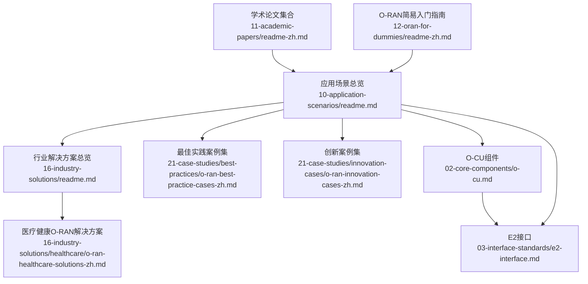
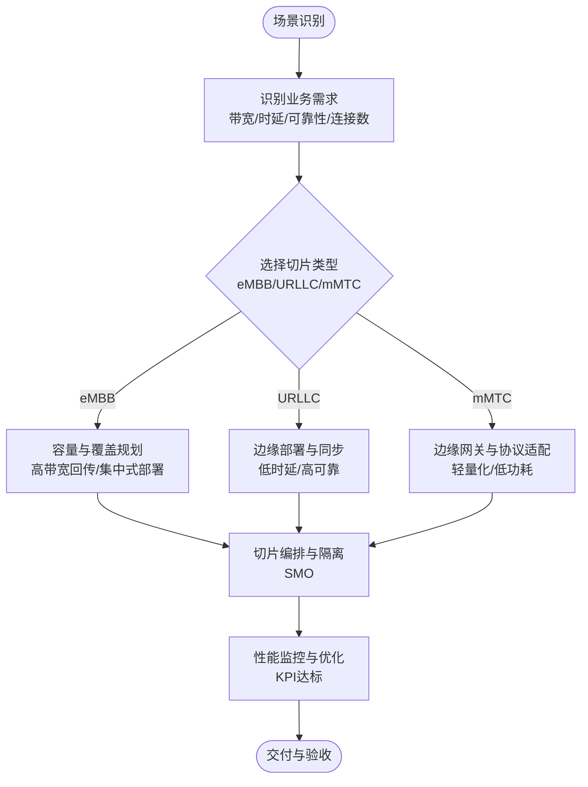
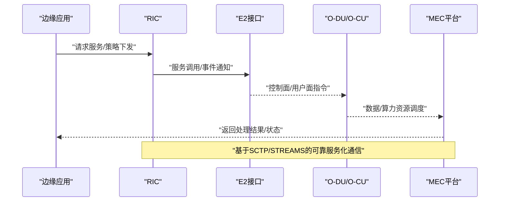
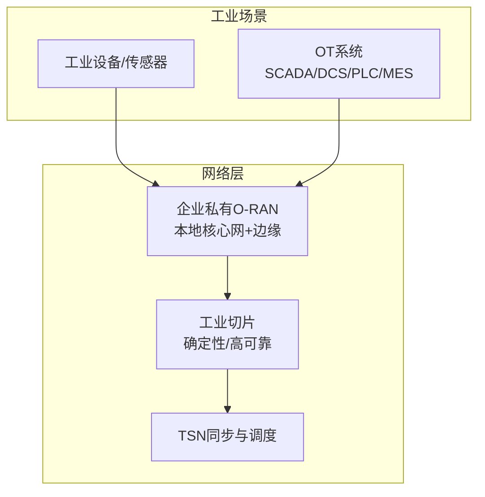
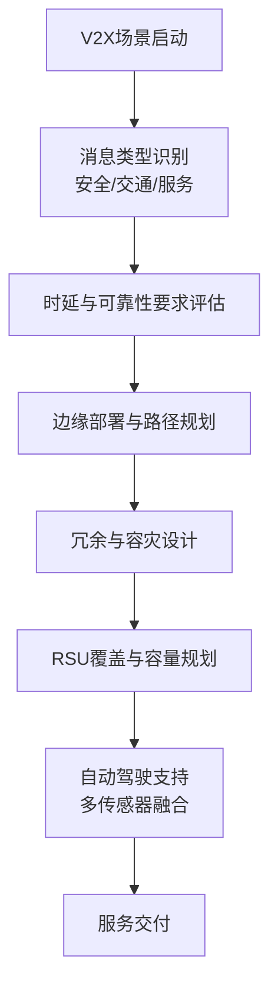
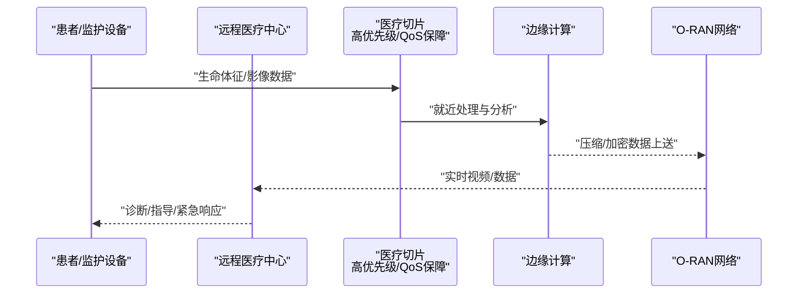
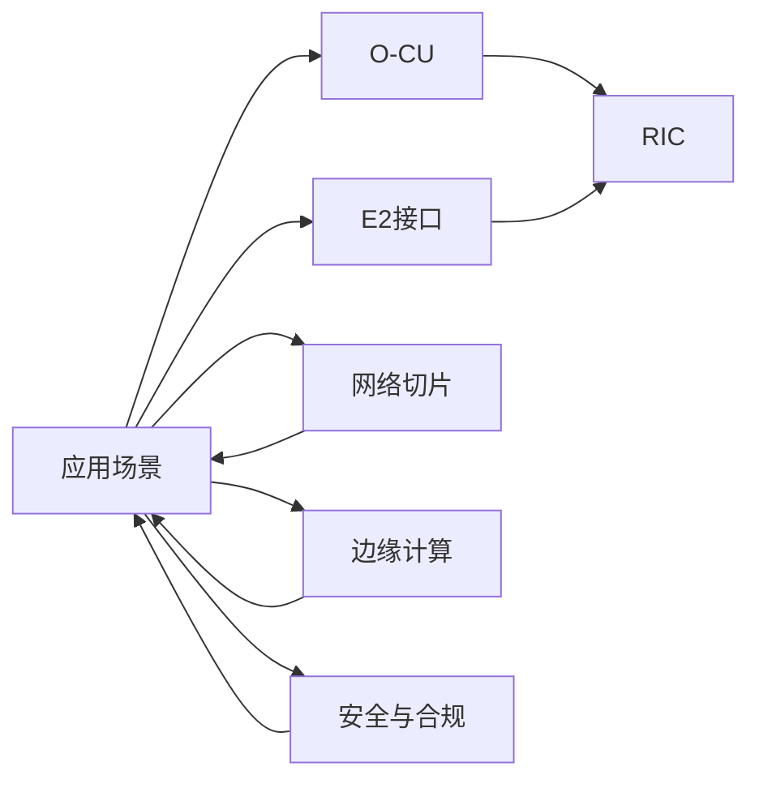

# 应用场景

<cite>
**本文引用的文件**
- [应用场景总览](file://10-application-scenarios/readme.md)
- [行业解决方案总览](file://16-industry-solutions/readme.md)
- [医疗健康O-RAN解决方案](file://16-industry-solutions/healthcare/o-ran-healthcare-solutions-zh.md)
- [最佳实践案例集](file://21-case-studies/best-practices/o-ran-best-practice-cases-zh.md)
- [创新案例集](file://21-case-studies/innovation-cases/o-ran-innovation-cases-zh.md)
- [O-RAN核心组件：集中式单元（O-CU）](file://02-core-components/o-cu.md)
- [E2接口（基于SCTP/STREAMS的服务化接口）](file://03-interface-standards/e2-interface.md)
- [学术论文集合](file://11-academic-papers/readme-zh.md)
- [O-RAN简易入门指南](file://12-oran-for-dummies/readme-zh.md)
</cite>

## 目录
1. [引言](#引言)
2. [项目结构](#项目结构)
3. [核心组件](#核心组件)
4. [架构总览](#架构总览)
5. [详细组件分析](#详细组件分析)
6. [依赖分析](#依赖分析)
7. [性能考虑](#性能考虑)
8. [故障排查指南](#故障排查指南)
9. [结论](#结论)
10. [附录](#附录)

## 引言
本文件面向O-RAN在垂直行业的规模化落地，围绕5G网络应用（eMBB、URLLC、mMTC、网络切片、载波聚合）、边缘计算集成（MEC协同、边缘智能、内容分发、IoT网关、业务连续性）、工业互联网（私有网络、QoS保障、确定性网络、OT系统集成）、连接车辆（V2X、低延迟、高可靠、覆盖、自动驾驶支持）、智慧城市（城市级部署、应急通信、能源管理）与医疗健康（远程医疗、医疗物联网、紧急医疗服务）等场景，提供可操作的应用指导与最佳实践。内容来源于仓库中的应用场景、行业解决方案、案例研究、核心组件与接口规范等资料，帮助读者在生产环境中设计与优化O-RAN部署。

## 项目结构
本仓库围绕O-RAN的架构、组件、接口、标准、部署、运维、案例与未来演进形成系统化知识体系。与“应用场景”主题直接相关的知识域包括：
- 应用场景总览：覆盖5G服务、边缘计算、工业互联网、连接车辆、智慧城市、医疗健康六大场景
- 行业解决方案：提供制造、能源、交通、医疗、教育等垂直行业定制化方案
- 案例研究：最佳实践与创新案例，展示规模化部署与技术突破
- 核心组件与接口：O-CU、E2接口等关键构件与协议，支撑端到端场景实现
- 学术论文与入门指南：为深入理解与知识拓展提供基础



**图表来源**
- [应用场景总览](file://10-application-scenarios/readme.md#L1-L470)
- [行业解决方案总览](file://16-industry-solutions/readme.md#L1-L58)
- [医疗健康O-RAN解决方案](file://16-industry-solutions/healthcare/o-ran-healthcare-solutions-zh.md#L1-L484)
- [最佳实践案例集](file://21-case-studies/best-practices/o-ran-best-practice-cases-zh.md#L1-L210)
- [创新案例集](file://21-case-studies/innovation-cases/o-ran-innovation-cases-zh.md#L1-L322)
- [O-CU组件](file://02-core-components/o-cu.md#L1-L419)
- [E2接口](file://03-interface-standards/e2-interface.md#L1-L337)
- [学术论文集合](file://11-academic-papers/readme-zh.md#L1-L88)
- [O-RAN简易入门指南](file://12-oran-for-dummies/readme-zh.md#L1-L84)

**章节来源**
- [应用场景总览](file://10-application-scenarios/readme.md#L1-L470)
- [行业解决方案总览](file://16-industry-solutions/readme.md#L1-L58)
- [O-RAN简易入门指南](file://12-oran-for-dummies/readme-zh.md#L1-L84)

## 核心组件
- O-CU（集中式单元）：负责非实时高层协议栈功能，控制面（CU-CP）与用户面（CU-UP）分离，支持灵活部署与弹性扩展，是eMBB、URLLC、mMTC等场景的承载核心。
- E2接口：RIC与CU/DU之间的服务化接口，基于SCTP/STREAMS，支撑Near-RT/Non-RT RIC的实时控制与事件通知，是网络切片、边缘智能、自治网络等能力的联接纽带。

**章节来源**
- [O-CU组件](file://02-core-components/o-cu.md#L1-L419)
- [E2接口](file://03-interface-standards/e2-interface.md#L1-L337)

## 架构总览
O-RAN在各应用场景中的端到端架构遵循“云化、开放、智能”的原则，结合边缘计算与网络切片，实现差异化服务保障与低时延控制闭环。

```mermaid
graph TB
subgraph "终端与接入"
UE["用户设备/传感器<br/>UE/车载终端/IoT设备"]
end
subgraph "接入与传输"
RU["射频拉远单元O-RU"]
DU["分布单元O-DU"]
CU["集中式单元O-CU<br/>CU-CP/CU-UP分离"]
FH["前传/中传/回传网络"]
end
subgraph "智能与编排"
RIC["RAN智能控制器RIC<br/>Near-RT/Non-RT"]
E2["E2接口<br/>SCTP/STREAMS"]
SMO["切片编排与管理SMO"]
end
subgraph "边缘与核心"
MEC["多接入边缘计算MEC"]
CORE["核心网5GC/NG-RAN"]
end
UE --> RU --> DU --> CU
CU <- --> RIC
RIC < --> E2
CU --> SMO
CU --> CORE
CU --> MEC
FH -. "前传/中传/回传" .- DU
```

**图表来源**
- [O-CU组件](file://02-core-components/o-cu.md#L1-L419)
- [E2接口](file://03-interface-standards/e2-interface.md#L1-L337)
- [应用场景总览](file://10-application-scenarios/readme.md#L1-L470)

## 详细组件分析

### 5G网络应用（eMBB、URLLC、mMTC、网络切片、载波聚合）
- eMBB：高带宽场景（4K/8K视频、VR/AR、云游戏），强调集中式部署与高带宽回传；需关注容量规划、干扰管理与覆盖优化。
- URLLC：超低时延与超高可靠（工业控制、远程手术、智能电网），强调分布式部署与边缘计算协同；需关注同步精度、故障恢复与资源预留。
- mMTC：海量连接与低功耗（智慧水务、路灯、环境监测），强调轻量化协议与边缘网关；需关注连接管理、能耗控制与数据处理。
- 网络切片：端到端切片编排（SMO），区分eMBB/URLLC/mMTC切片，实现逻辑/物理隔离与生命周期管理。
- 载波聚合：跨带/跨标准聚合，提升峰值速率与覆盖；需关注频谱选择、功率协调与干扰管理。



**图表来源**
- [应用场景总览](file://10-application-scenarios/readme.md#L8-L43)

**章节来源**
- [应用场景总览](file://10-application-scenarios/readme.md#L8-L43)

### 边缘计算集成（MEC协同、边缘智能、内容分发、IoT网关、业务连续性）
- MEC协同：与O-DU/O-CU共址部署，E2接口服务发现与编排，实现边缘智能与视频分析、交通监控等应用。
- 边缘智能：分布式AI/ML训练与推理，结合联邦学习与缓存策略，应对边缘资源限制与隐私保护。
- 内容分发：多级缓存与CDN集成，热点预测与动态缓存，提升命中率与响应时间。
- IoT网关：协议转换与数据预处理，MQTT/CoAP/LwM2M/NB-IoT等，关注设备多样性与安全防护。
- 业务连续性：多活冗余与自动切换，本地/远程备份，RTO分钟级恢复。



**图表来源**
- [E2接口](file://03-interface-standards/e2-interface.md#L1-L337)
- [O-CU组件](file://02-core-components/o-cu.md#L1-L419)

**章节来源**
- [应用场景总览](file://10-application-scenarios/readme.md#L45-L79)

### 工业互联网应用（私有网络、QoS保障、确定性网络、OT系统集成）
- 私有网络：企业专用O-RAN网络，本地核心网与边缘计算融合，频谱选择与网络设计。
- QoS保障：差异化服务等级（关键控制/监控），流量分类、优先标记与资源预留。
- 确定性网络：TSN集成与IEEE 1588高精度同步，时隙与时延敏感业务。
- OT系统集成：IT/OT融合，SCADA/DCS/PLC/MES对接，工业防火墙与隔离策略。



**图表来源**
- [应用场景总览](file://10-application-scenarios/readme.md#L81-L116)

**章节来源**
- [应用场景总览](file://10-application-scenarios/readme.md#L81-L116)

### 连接车辆应用（V2X、低时延、高可靠、覆盖、自动驾驶支持）
- V2X通信：PC5直连与Uu蜂窝，安全消息、交通信息与服务消息，消息可靠性与隐私保护。
- 低时延：空口/网络/处理时延分解，边缘部署、优先调度与预缓存。
- 高可靠：多路径/多连接/多频段冗余，快速故障检测与自动切换。
- 覆盖：RSU密度与选址，高速公路/城区/停车场场景容量与干扰管理。
- 自动驾驶：L4/L5级需求，多传感器融合与边缘处理，多层覆盖与冗余设计。



**图表来源**
- [应用场景总览](file://10-application-scenarios/readme.md#L118-L153)

**章节来源**
- [应用场景总览](file://10-application-scenarios/readme.md#L118-L153)

### 智慧城市应用（城市级部署、应急通信、能源管理）
- 城市级部署：核心/汇聚/接入分层架构，宏微皮 femto异构网络，边缘云与网络切片。
- 应急通信：抗毁设计与快速恢复，临时容量扩展与优先策略。
- 能源管理：配网自动化与需求响应，杆塔/地埋部署与电磁/运维安全。


**图表来源**
- [应用场景总览](file://10-application-scenarios/readme.md#L155-L183)

**章节来源**
- [应用场景总览](file://10-application-scenarios/readme.md#L155-L183)

### 医疗健康应用（远程医疗、医疗物联网、紧急医疗服务）
- 远程医疗：高质量视频咨询（4K/60fps、亚毫秒级延迟）、端到端加密与HIPAA合规。
- 医疗物联网：设备认证、数据安全与低功耗广覆盖，异常检测与紧急响应。
- 紧急医疗：救护车通信与远程指导，移动性管理与无缝切换。



**图表来源**
- [医疗健康O-RAN解决方案](file://16-industry-solutions/healthcare/o-ran-healthcare-solutions-zh.md#L1-L484)
- [应用场景总览](file://10-application-scenarios/readme.md#L185-L206)

**章节来源**
- [医疗健康O-RAN解决方案](file://16-industry-solutions/healthcare/o-ran-healthcare-solutions-zh.md#L1-L484)
- [应用场景总览](file://10-application-scenarios/readme.md#L185-L206)

## 依赖分析
- 场景到组件：各场景均依赖O-CU的控制与用户面处理能力，以及E2接口实现的RIC与DU/CU之间的服务化通信。
- 场景到边缘：MEC与边缘智能依赖E2接口与O-CU的协同，实现就近计算与实时控制。
- 场景到切片：网络切片（SMO）贯穿eMBB/URLLC/mMTC场景，保障差异化SLA。
- 场景到安全：远程医疗、工业控制、智慧城市等场景对端到端加密、零信任与合规提出更高要求。



**图表来源**
- [O-CU组件](file://02-core-components/o-cu.md#L1-L419)
- [E2接口](file://03-interface-standards/e2-interface.md#L1-L337)
- [应用场景总览](file://10-application-scenarios/readme.md#L1-L470)

**章节来源**
- [O-CU组件](file://02-core-components/o-cu.md#L1-L419)
- [E2接口](file://03-interface-standards/e2-interface.md#L1-L337)
- [应用场景总览](file://10-application-scenarios/readme.md#L1-L470)

## 性能考虑
- 低时延优化：边缘部署、优先调度、资源预留、空口参数优化。
- 高可靠性设计：N+1冗余、快速故障检测与自动恢复、多路径路由。
- 智能运维：AI驱动监控、预测性维护、自动化故障处理、数字孪生仿真。
- 成本优化：白盒设备、动态资源调度、谱效提升、能效管理。

**章节来源**
- [应用场景总览](file://10-application-scenarios/readme.md#L314-L351)

## 故障排查指南
- 告警分级与关联：依据严重程度分级处理，结合告警关联定位根因。
- 日志与信令分析：通过设备日志与信令流程排查异常。
- 接口与性能测试：针对E2接口、F1接口、传输网络进行专项测试验证。
- 故障恢复与回滚：服务重启、配置调整、资源扩容、接口修复与版本回滚。

**章节来源**
- [O-CU组件](file://02-core-components/o-cu.md#L244-L263)
- [E2接口](file://03-interface-standards/e2-interface.md#L170-L189)

## 结论
O-RAN在垂直行业的规模化落地，需要以场景为导向的差异化网络设计、以切片与边缘为核心的端到端架构，以及以E2接口与O-CU为代表的智能编排与控制能力。通过最佳实践与创新案例的借鉴，结合严谨的性能与安全策略，可在工业互联网、连接车辆、智慧城市与医疗健康等领域实现高可靠、低时延、可扩展的5G应用。

## 附录
- 学习路径建议：从入门指南到架构与组件，再到学术论文与案例研究，逐步深化理解。
- 资源索引：O-RAN联盟白皮书、ETSI MEC、3GPP、ITU等标准与指南。

**章节来源**
- [O-RAN简易入门指南](file://12-oran-for-dummies/readme-zh.md#L1-L84)
- [学术论文集合](file://11-academic-papers/readme-zh.md#L1-L88)
- [应用场景总览](file://10-application-scenarios/readme.md#L270-L291)