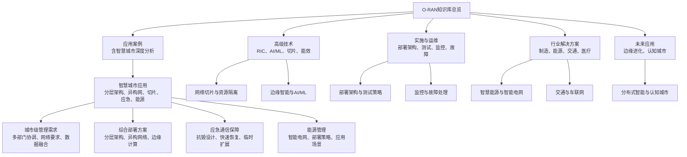
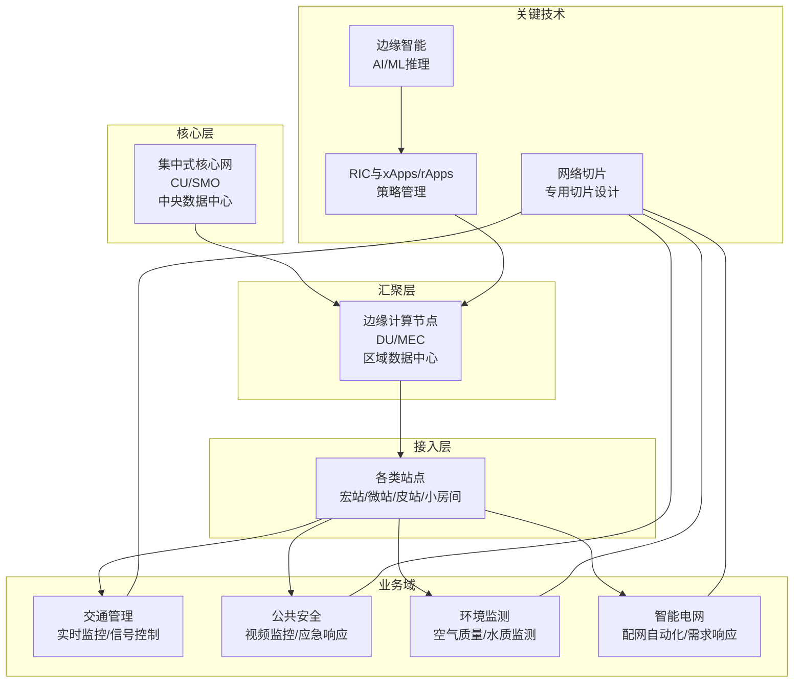
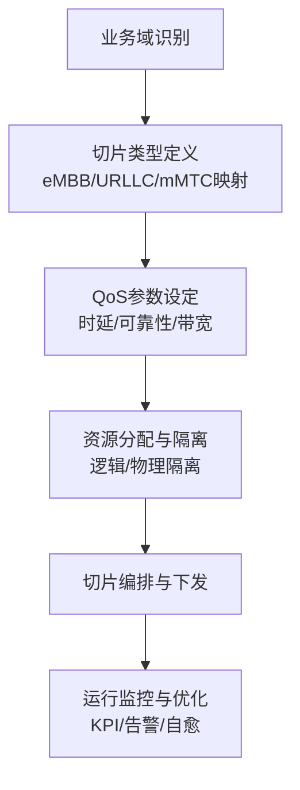
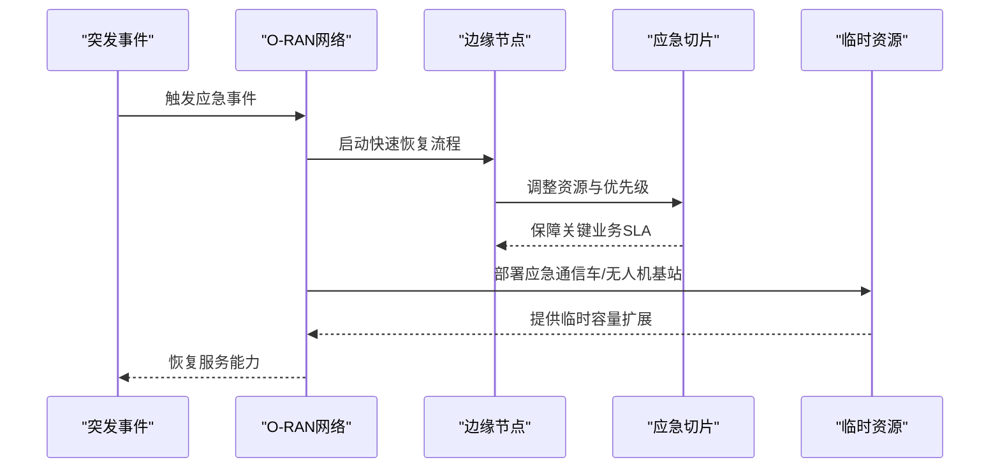
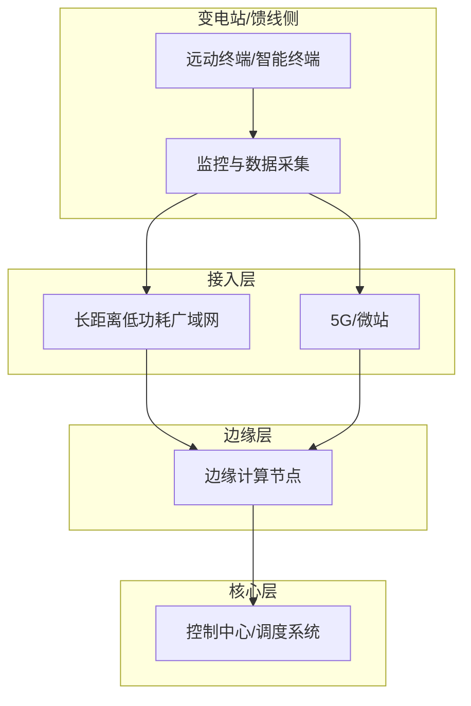
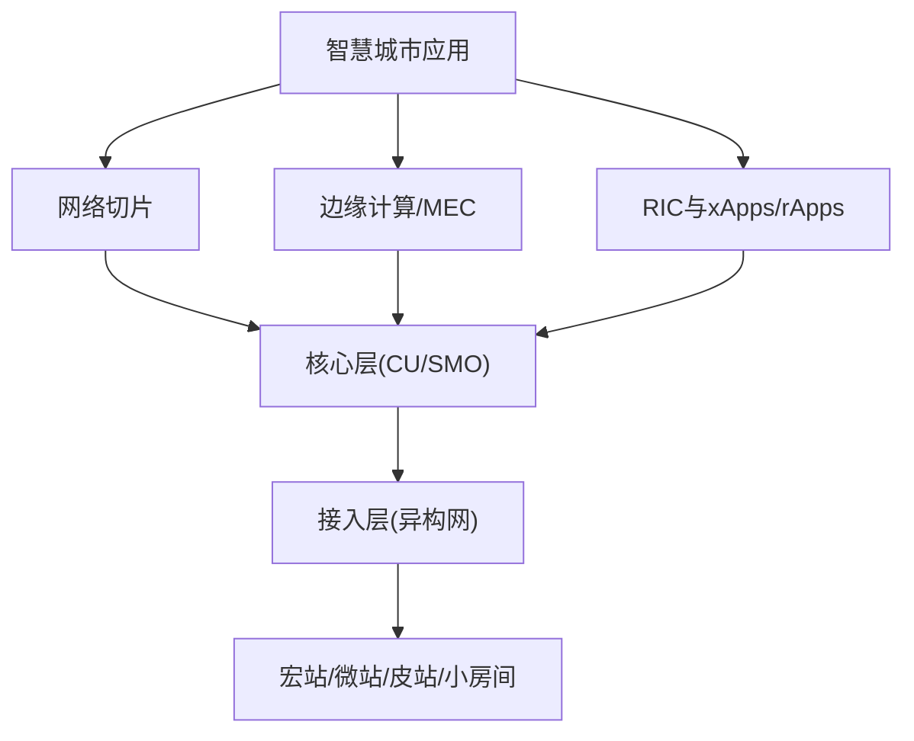

# 智慧城市应用

<cite>
**本文引用的文件**   
- [O-RAN应用概览](file://10-application-scenarios/readme.md)
- [智慧城市深度分析](file://10-application-scenarios/smart-city/smart-city-deep-dive.md)
- [智慧城市应用说明](file://10-application-scenarios/smart-city/readme.md)
- [O-RAN高级技术](file://07-ric-development/readme.md)
- [O-RAN实施与运维](file://08-deployment-implementation/readme.md)
- [O-RAN行业解决方案总览](file://16-industry-solutions/readme.md)
- [O-RAN未来应用路线图](file://15-future-development/emerging-applications/emerging-applications-roadmap.md)
- [O-RAN专利总表](file://comprehensive-oran-patent-table.md)
- [O-DU组件说明](file://02-core-components/o-du.md)
- [国家电网智慧电网案例](file://21-case-studies/industry-applications/vertical-industry-o-ran-cases.md)
- [O-RAN知识库总览](file://README.md)
</cite>

## 更新摘要
**所做更改**
- 新增智慧城市深度分析章节，包含443行详细内容
- 更新了城市级管理需求的多部门协调内容
- 增强了网络要求（广覆盖、高容量、低功耗）的技术细节
- 扩展了多源数据融合与分析平台的技术架构
- 完善了分层架构（核心层、汇聚层、接入层）的详细设计
- 深化了异构网络（宏站、微站、皮站、小房间基站）集成方案
- 增强了分布式边缘节点部署策略
- 细化了网络切片在不同业务场景下的专用切片设计
- 完善了应急通信保障方案的抗毁设计和快速恢复机制
- 深化了智能电网通信的部署策略和应用场景

## 目录
1. [引言](#引言)
2. [项目结构](#项目结构)
3. [核心组件](#核心组件)
4. [架构总览](#架构总览)
5. [详细组件分析](#详细组件分析)
6. [依赖分析](#依赖分析)
7. [性能考虑](#性能考虑)
8. [故障排查指南](#故障排查指南)
9. [结论](#结论)
10. [附录](#附录)

## 引言
本文件面向智慧城市应用，围绕城市级O-RAN网络的综合解决方案进行系统化阐述。内容覆盖城市级管理需求（交通、安防、环保、能源部门协同）、网络要求（广覆盖、高容量、低功耗）、多源数据融合与分析平台、分层架构（核心层、汇聚层、接入层）、异构网络（宏站、微站、皮站、小房间基站）集成、分布式边缘节点部署、网络切片在不同业务场景下的专用切片设计与资源隔离策略、应急通信保障（抗毁设计、快速恢复、临时容量扩展）以及智能电网通信（配网自动化、需求响应）的部署策略与应用场景，并提供大型城市综合体、智慧园区、数字景区等综合部署案例与智能能源管理系统的实施方案。

**更新** 新增了详细的智慧城市深度分析，包含完整的城市级管理需求、综合部署解决方案、应急通信保障和能源管理等四个主要部分，提供了443行的全面技术内容。

## 项目结构
该知识库以主题域划分，智慧城市相关内容主要分布在"应用案例""高级技术""实施与运维""行业解决方案""未来应用"等目录下，形成从架构到落地、从技术到场景的完整知识体系。

**图表来源**
- [智慧城市深度分析:1-443](file://10-application-scenarios/smart-city/smart-city-deep-dive.md#L1-L443)
- [智慧城市应用说明:1-50](file://10-application-scenarios/smart-city/readme.md#L1-L50)

**章节来源**
- [O-RAN知识库总览:1-472](file://README.md#L1-L472)
- [智慧城市深度分析:1-443](file://10-application-scenarios/smart-city/smart-city-deep-dive.md#L1-L443)

## 核心组件
- 城市级O-RAN网络由三层架构支撑：核心层（集中化CU）、汇聚层（DU/边缘节点）、接入层（RU/站点），配合异构网络（宏站、微站、皮站、小房间基站）实现广覆盖与高容量。
- 边缘计算与MEC协同，通过E2接口与RIC协作，支撑视频分析、交通信号控制、环境监测等低时延应用。
- 网络切片按业务场景划分专用切片，实现资源隔离与差异化SLA保障。
- 应急通信具备抗毁设计、快速恢复与临时容量扩展（应急通信车、无人机基站）的优先策略。
- 智能电网通信覆盖配网自动化、需求响应、远程计量与故障定位，强调可靠性、安全性与实时性。

**更新** 基于新的深度分析内容，增强了各核心组件的技术细节和实现方案。

**章节来源**
- [智慧城市深度分析:9-443](file://10-application-scenarios/smart-city/smart-city-deep-dive.md#L9-L443)
- [O-RAN应用概览:36-41](file://10-application-scenarios/readme.md#L36-L41)
- [O-RAN高级技术:1-160](file://07-ric-development/readme.md#L1-L160)
- [O-RAN实施与运维:1-131](file://08-deployment-implementation/readme.md#L1-L131)
- [O-RAN行业解决方案总览:1-58](file://16-industry-solutions/readme.md#L1-L58)

## 架构总览
城市级O-RAN网络采用分层架构与异构网融合，结合边缘智能与网络切片，实现跨部门协同与业务差异化保障。

**图表来源**
- [智慧城市深度分析:117-194](file://10-application-scenarios/smart-city/smart-city-deep-dive.md#L117-L194)
- [智慧城市应用说明:16-22](file://10-application-scenarios/smart-city/readme.md#L16-L22)

## 详细组件分析

### 城市级管理需求与多部门协调

#### 多部门协调架构
- **交通管理**：实时监控、智能信号控制、公共交通管理、停车管理、路线优化
- **安全管理**：全市视频监控、应急响应协调、公共空间访问控制、自动事件检测、人群管理
- **环境保护**：实时空气质量监测、噪音水平监测、智能废物管理、水质监测、绿地管理
- **能源管理**：智能电网管理、可再生能源整合、能效优化、需求响应管理、电动汽车充电基础设施

#### 网络技术要求
- **广覆盖**：全市覆盖、室内覆盖、地下空间覆盖、交通系统覆盖、城乡连续覆盖
- **高容量**：设备密度支持、大流量支持、高带宽需求、并发连接支持、可扩展性
- **低功耗**：IoT设备低功耗、传感器网络低功耗、智能电表低功耗、环境传感器低功耗、长电池寿命

#### 数据融合与分析平台
- **多源数据融合**：传感器数据、视频数据、IoT数据、公共数据、私有数据
- **分析平台**：数据湖、分析引擎、可视化、报告生成、决策支持

**更新** 基于新的深度分析内容，详细描述了城市级管理需求的各个方面和技术要求。

**章节来源**
- [智慧城市深度分析:9-88](file://10-application-scenarios/smart-city/smart-city-deep-dive.md#L9-L88)
- [智慧城市应用说明:8-14](file://10-application-scenarios/smart-city/readme.md#L8-L14)

### 综合部署解决方案

#### 分层架构设计
- **核心层**：中央数据中心、核心网络、管理系统、分析平台、安全系统
- **汇聚层**：区域数据中心、网络汇聚点、边缘计算、缓存系统、区域管理
- **接入层**：接入网络、小基站、Wi-Fi网络、IoT网关、用户设备

#### 异构网络集成
- **宏站**：广域覆盖、大容量、移动性支持、回传连接、高可靠性
- **微站**：局部覆盖、容量增强、干扰管理、灵活部署、成本效益
- **皮站**：室内覆盖、高密度区域、企业解决方案、小范围覆盖、低功耗
- **小房间基站**：家庭覆盖、小型办公解决方案、自组织网络、低成本、用户部署

#### 边缘计算部署
- **分布式边缘节点**：城市级分布、低时延处理、本地数据处理、内容缓存、AI处理
- **边缘云**：区域边缘云、多接入边缘计算、云原生架构、服务编排、资源管理

**更新** 基于新的深度分析内容，详细描述了综合部署解决方案的分层架构和异构网络集成。

**章节来源**
- [智慧城市深度分析:117-194](file://10-application-scenarios/smart-city/smart-city-deep-dive.md#L117-L194)
- [智慧城市应用说明:16-22](file://10-application-scenarios/smart-city/readme.md#L16-L22)

### 网络切片在智慧城市业务场景中的专用切片设计与资源隔离

#### 专用切片设计
- **公共安全切片**：为公共安全业务提供专用网络切片
- **交通管理切片**：为交通管理业务提供专用网络切片
- **公用事业切片**：为公用事业业务提供专用网络切片
- **企业切片**：为企业客户提供专用网络切片
- **IoT切片**：为物联网应用提供专用网络切片

#### 切片管理策略
- **切片编排**：编排多个网络切片
- **资源分配**：为每个切片分配资源
- **性能监控**：监控切片性能
- **SLA管理**：管理服务等级协议
- **隔离保证**：确保切片隔离和安全

**图表来源**
- [智慧城市深度分析:195-212](file://10-application-scenarios/smart-city/smart-city-deep-dive.md#L195-L212)

**章节来源**
- [智慧城市深度分析:195-212](file://10-application-scenarios/smart-city/smart-city-deep-dive.md#L195-L212)
- [O-RAN应用概览:36-41](file://10-application-scenarios/readme.md#L36-L41)
- [O-RAN高级技术:79-98](file://07-ric-development/readme.md#L79-L98)

### 应急通信保障：抗毁设计、快速恢复与临时容量扩展

#### 自然灾害应对
- **地震响应**：地震救援通信
- **洪水响应**：洪水救援通信
- **飓风响应**：飓风救援通信
- **野火响应**：野火救援通信
- **灾后恢复**：灾后恢复通信

#### 公共安全通信
- **执法通信**：执法部门通信
- **消防通信**：消防部门通信
- **紧急医疗服务**：急救服务通信
- **搜救通信**：搜救行动通信
- **公众警报**：公众警报和通知系统

#### 网络韧性设计
- **抗毁设计**：加固通信基础设施、冗余通信系统、备用电源、基础设施物理保护、地理分布韧性
- **快速恢复**：自动故障切换、临时系统快速部署、自愈合网络能力、记录恢复程序、定期恢复测试

#### 临时容量扩展
- **应急通信车**：移动基站、卫星通信、临时通信基础设施、快速部署能力、自给自足通信系统
- **无人机基站**：空中通信平台、无人机覆盖扩展、无人机基站快速部署、灵活覆盖模式、应急响应通信

**图表来源**
- [智慧城市深度分析:239-320](file://10-application-scenarios/smart-city/smart-city-deep-dive.md#L239-L320)

**章节来源**
- [智慧城市深度分析:239-320](file://10-application-scenarios/smart-city/smart-city-deep-dive.md#L239-L320)
- [智慧城市应用说明:24-30](file://10-application-scenarios/smart-city/readme.md#L24-L30)

### 智能电网通信：配网自动化、需求响应与部署策略

#### 配网自动化
- **电网监控**：实时电网监控和控制
- **故障检测**：自动故障检测和隔离
- **服务恢复**：自动服务恢复
- **负载均衡**：配电网负载均衡
- **电压调节**：电压调节和优化

#### 需求响应管理
- **负荷管理**：高峰需求期间的电力负荷管理
- **价格信号**：向消费者传达价格信号
- **激励计划**：基于激励的需求响应计划
- **直接负荷控制**：紧急情况下的直接负荷控制
- **消费者参与**：让消费者参与需求响应

#### 部署策略
- **电杆挂载**：共享电力杆基础设施、通信设备共址、利用现有供电、易于维护访问、成本效益部署
- **地下管道**：在地下管道中部署光纤、保护地下通信基础设施、维护接入点、与其他公用设施共享通道、环境保护考虑

#### 通信要求
- **可靠性**：通过可靠通信确保电网稳定、容错通信系统、冗余通信路径、备用通信系统、通信故障快速恢复
- **安全性**：保护电网免受网络威胁、严格的电网系统访问控制、加密电网通信、持续安全监控、符合能源行业法规
- **实时性能**：电网控制的低时延通信、确定性通信行为、电网操作的时间同步、关键操作的高可用性、保证服务质量

**图表来源**
- [智慧城市深度分析:321-410](file://10-application-scenarios/smart-city/smart-city-deep-dive.md#L321-L410)

**章节来源**
- [智慧城市深度分析:321-410](file://10-application-scenarios/smart-city/smart-city-deep-dive.md#L321-L410)
- [智慧城市应用说明:32-38](file://10-application-scenarios/smart-city/readme.md#L32-L38)
- [国家电网智慧电网案例:237-278](file://21-case-studies/industry-applications/vertical-industry-o-ran-cases.md#L237-L278)

### 生产环境最佳实践

#### 网络设计最佳实践
- **全市规划**：全面的全市网络规划
- **多部门协调**：与多个城市部门协调
- **可扩展性**：为可扩展性和增长而设计
- **韧性**：为韧性和可靠性而设计
- **安全性**：为安全性和隐私而设计

#### 部署最佳实践
- **分阶段部署**：分阶段部署以管理风险
- **试点项目**：全面部署前进行试点项目
- **利益相关者参与**：与城市利益相关者参与
- **公私合作伙伴关系**：利用公私合作伙伴关系
- **可持续性**：考虑环境可持续性

#### 运营最佳实践
- **集中管理**：集中管理和监控
- **主动维护**：主动维护和优化
- **事件响应**：有效的事件响应程序
- **性能监控**：持续性能监控
- **持续改进**：持续改进流程

**更新** 基于新的深度分析内容，新增了生产环境最佳实践章节。

**章节来源**
- [智慧城市深度分析:411-436](file://10-application-scenarios/smart-city/smart-city-deep-dive.md#L411-L436)

### 大型城市综合体、智慧园区、数字景区的综合部署案例

#### 大型城市综合体
- **挑战**：连接大型城市开发中的多样化系统
- **解决方案**：具有边缘计算的全面O-RAN网络
- **性能**：高容量、低时延、广覆盖
- **集成**：与建筑管理系统集成
- **收益**：智能建筑管理、提高效率

#### 智慧公园
- **挑战**：创建连接的智能公园环境
- **解决方案**：公园管理的私有O-RAN网络
- **性能**：公园服务的可靠连接
- **服务**：智能停车、环境监测、安全
- **收益**：改善公园管理、游客体验

#### 数字景区
- **挑战**：在旅游目的地提供连接
- **解决方案**：具有旅游应用的O-RAN网络
- **性能**：游客人群的容量
- **服务**：导航、信息服务、人群管理
- **收益**：增强的游客体验、运营效率

**章节来源**
- [智慧城市深度分析:213-238](file://10-application-scenarios/smart-city/smart-city-deep-dive.md#L213-L238)
- [智慧城市应用说明:20-22](file://10-application-scenarios/smart-city/readme.md#L20-L22)

## 依赖分析
智慧城市O-RAN网络的关键依赖关系如下：

**图表来源**
- [智慧城市深度分析:117-194](file://10-application-scenarios/smart-city/smart-city-deep-dive.md#L117-L194)
- [O-RAN应用概览:36-41](file://10-application-scenarios/readme.md#L36-L41)

**章节来源**
- [智慧城市深度分析:1-443](file://10-application-scenarios/smart-city/smart-city-deep-dive.md#L1-L443)
- [O-RAN应用概览:36-41](file://10-application-scenarios/readme.md#L36-L41)
- [O-RAN高级技术:1-160](file://07-ric-development/readme.md#L1-L160)
- [O-RAN实施与运维:1-131](file://08-deployment-implementation/readme.md#L1-L131)

## 性能考虑
- **时延优化**：边缘下沉、优先调度、资源预留、确定性网络（TSN）
- **容量与覆盖**：异构网融合、载波聚合、密集部署、边缘缓存
- **可靠性与韧性**：N+1冗余、多路径、自动切换、灾备演练
- **能效与绿色**：智能休眠、功率控制、可再生能源集成、碳足迹优化
- **安全与合规**：零信任、端到端加密、审计与合规检查

**更新** 基于新的深度分析内容，增强了性能考虑的技术细节。

## 故障排查指南
- **问题分类**：接口故障（E2/A1/O1/O-FH/F1）、性能问题（时延/吞吐/丢包）、可用性问题、配置问题、兼容性问题
- **排查流程**：问题定义、信息收集（日志/指标/配置）、假设验证、根因分析（5个为什么/鱼骨图/故障树）、修复验证
- **工具与手段**：Wireshark/tcpdump、协议分析、日志分析（ELK/Splunk）、性能分析（Perf/火焰图）、网络监控（Ping/Traceroute/MTR）
- **SOP**：故障响应、升级流程、沟通流程、复盘与知识库更新

**章节来源**
- [O-RAN实施与运维:35-41](file://08-deployment-implementation/readme.md#L35-L41)

## 结论
智慧城市应用需要以O-RAN为核心，结合分层架构、异构网络、边缘智能与网络切片，实现跨部门协同与差异化服务保障。通过抗毁设计、快速恢复与临时容量扩展，确保应急通信的连续性；通过智能电网通信支撑配网自动化与需求响应。依托AI/ML与RIC生态，实现闭环优化与智能化运维，最终达成广覆盖、高容量、低功耗、强韧性的城市级网络目标。

**更新** 基于新的深度分析内容，增强了结论的全面性和技术深度。

## 附录
- **未来演进方向**：边缘智能深化、认知城市、绿色网络、安全增强、6G融合
- **行业专利与创新**：分布式机器学习、实时智能决策等前沿技术为智慧城市提供支撑

**章节来源**
- [O-RAN未来应用路线图:284-337](file://15-future-development/emerging-applications/emerging-applications-roadmap.md#L284-L337)
- [O-RAN专利总表:163-174](file://comprehensive-oran-patent-table.md#L163-L174)
- [智慧城市深度分析:437-443](file://10-application-scenarios/smart-city/smart-city-deep-dive.md#L437-L443)