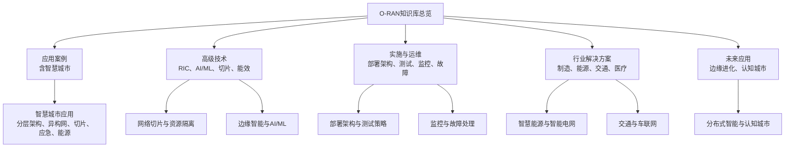
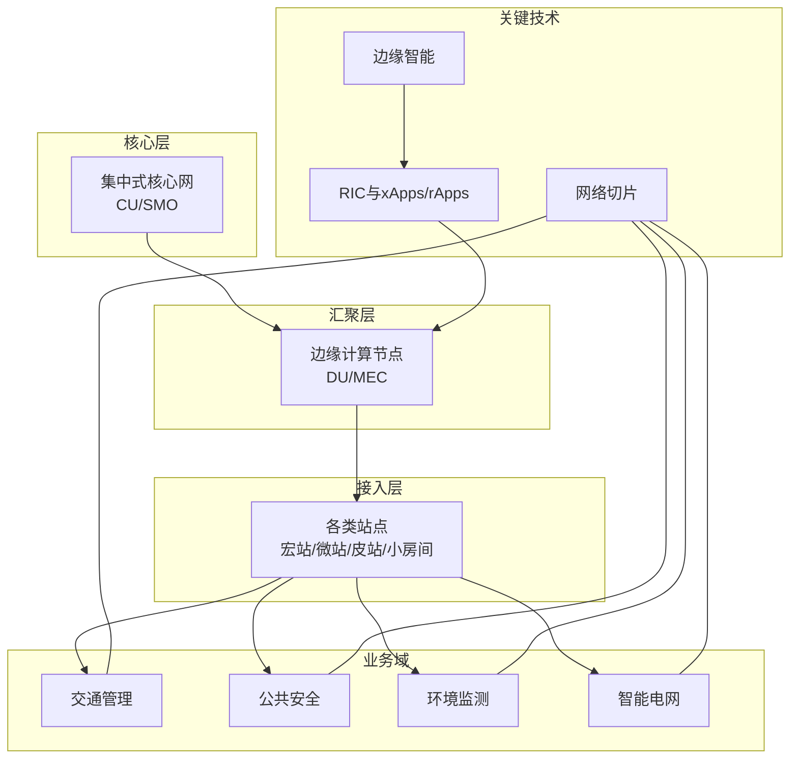
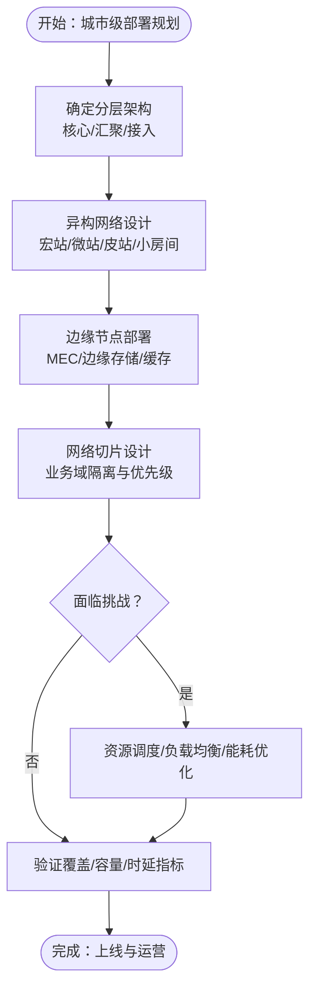
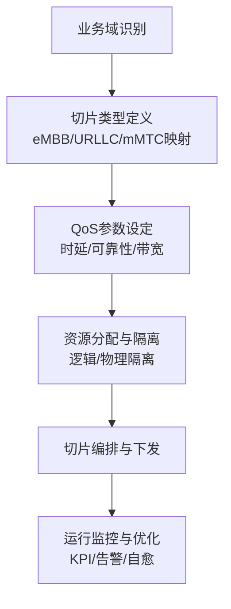
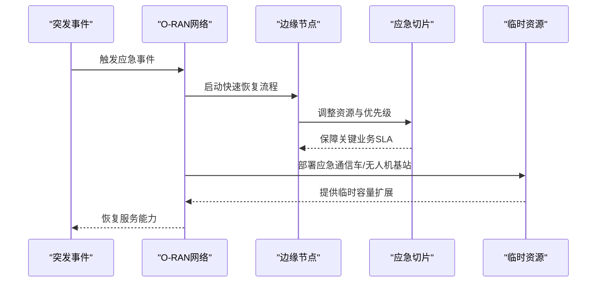
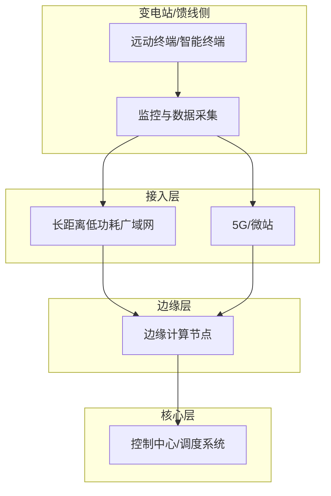
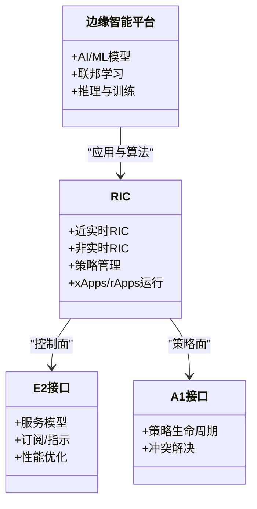
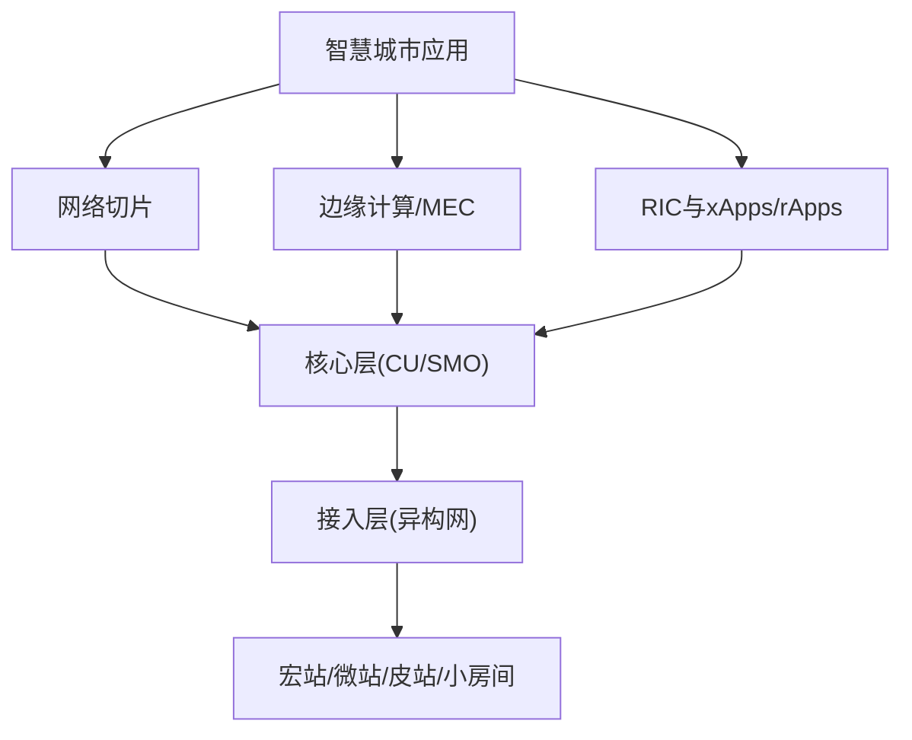

# 智慧城市应用

<cite>
**本文引用的文件**   
- [O-RAN应用概览](file://10-application-scenarios/readme.md)
- [O-RAN高级技术](file://07-ric-development/readme.md)
- [O-RAN实施与运维](file://08-deployment-implementation/readme.md)
- [O-RAN行业解决方案总览](file://16-industry-solutions/readme.md)
- [O-RAN未来应用路线图](file://15-future-development/emerging-applications/emerging-applications-roadmap.md)
- [O-RAN专利总表](file://comprehensive-oran-patent-table.md)
- [O-DU组件说明](file://02-core-components/o-du.md)
- [国家电网智慧电网案例](file://21-case-studies/industry-applications/vertical-industry-o-ran-cases.md)
- [O-RAN知识库总览](file://README.md)
</cite>

## 目录
1. [引言](#引言)
2. [项目结构](#项目结构)
3. [核心组件](#核心组件)
4. [架构总览](#架构总览)
5. [详细组件分析](#详细组件分析)
6. [依赖分析](#依赖分析)
7. [性能考虑](#性能考虑)
8. [故障排查指南](#故障排查指南)
9. [结论](#结论)
10. [附录](#附录)

## 引言
本文件面向智慧城市应用，围绕城市级O-RAN网络的综合解决方案进行系统化阐述。内容覆盖城市级管理需求（交通、安防、环保、能源部门协同）、网络要求（广覆盖、高容量、低功耗）、多源数据融合与分析平台、分层架构（核心层、汇聚层、接入层）、异构网络（宏站、微站、皮站、小房间基站）集成、分布式边缘节点部署、网络切片在不同业务场景下的专用切片设计与资源隔离策略、应急通信保障（抗毁设计、快速恢复、临时容量扩展）以及智能电网通信（配网自动化、需求响应）的部署策略与应用场景，并提供大型城市综合体、智慧园区、数字景区等综合部署案例与智能能源管理系统的实施方案。

## 项目结构
该知识库以主题域划分，智慧城市相关内容主要分布在“应用案例”“高级技术”“实施与运维”“行业解决方案”“未来应用”等目录下，形成从架构到落地、从技术到场景的完整知识体系。

章节来源
- [O-RAN知识库总览](file://README.md#L1-L472)

## 核心组件
- 城市级O-RAN网络由三层架构支撑：核心层（集中化CU）、汇聚层（DU/边缘节点）、接入层（RU/站点），配合异构网络（宏站、微站、皮站、小房间基站）实现广覆盖与高容量。
- 边缘计算与MEC协同，通过E2接口与RIC协作，支撑视频分析、交通信号控制、环境监测等低时延应用。
- 网络切片按业务场景划分专用切片，实现资源隔离与差异化SLA保障。
- 应急通信具备抗毁设计、快速恢复与临时容量扩展（应急通信车、无人机基站）的优先策略。
- 智能电网通信覆盖配网自动化、需求响应、远程计量与故障定位，强调可靠性、安全性与实时性。

章节来源
- [O-RAN应用概览](file://10-application-scenarios/readme.md#L155-L183)
- [O-RAN高级技术](file://07-ric-development/readme.md#L1-L368)
- [O-RAN实施与运维](file://08-deployment-implementation/readme.md#L1-L353)
- [O-RAN行业解决方案总览](file://16-industry-solutions/readme.md#L1-L58)

## 架构总览
城市级O-RAN网络采用分层架构与异构网融合，结合边缘智能与网络切片，实现跨部门协同与业务差异化保障。

图表来源
- [O-RAN应用概览](file://10-application-scenarios/readme.md#L155-L183)
- [O-RAN高级技术](file://07-ric-development/readme.md#L1-L368)

## 详细组件分析

### 城市级O-RAN分层架构与异构网络集成
- 分层架构：核心层集中处理控制面与管理面，汇聚层就近处理用户面与实时业务，接入层实现广域覆盖与高密度热点。
- 异构网络：宏站提供广域覆盖，微站/皮站/小房间站补充室内与热点区域，结合边缘节点实现低时延与高容量协同。
- 部署挑战：资源调度、负载均衡、能耗管理、跨部门协调、标准统一与数据隐私。

图表来源
- [O-RAN应用概览](file://10-application-scenarios/readme.md#L155-L183)

章节来源
- [O-RAN应用概览](file://10-application-scenarios/readme.md#L155-L183)

### 网络切片在智慧城市业务场景中的专用切片设计与资源隔离
- 场景化切片：交通管理、公共安全、环境监测、智能电网等业务域分别建立专用切片，明确时延、可靠性、带宽等QoS目标。
- 隔离策略：逻辑隔离与物理隔离相结合，结合优先级调度与资源预留，保障关键业务SLA。
- 运维要点：切片生命周期管理、动态调整、跨切片协调与性能监控。

图表来源
- [O-RAN应用概览](file://10-application-scenarios/readme.md#L30-L36)
- [O-RAN高级技术](file://07-ric-development/readme.md#L79-L98)

章节来源
- [O-RAN应用概览](file://10-application-scenarios/readme.md#L30-L36)
- [O-RAN高级技术](file://07-ric-development/readme.md#L79-L98)

### 应急通信保障：抗毁设计、快速恢复与临时容量扩展
- 抗毁设计：多路径路由、冗余链路、跨域协同，确保单点故障不影响整体服务。
- 快速恢复：自动切换、会话保持、灾备演练，缩短RTO。
- 临时容量扩展：应急通信车、无人机基站等快速部署手段，优先保障应急通信与临时热点。

图表来源
- [O-RAN应用概览](file://10-application-scenarios/readme.md#L170-L176)

章节来源
- [O-RAN应用概览](file://10-application-scenarios/readme.md#L170-L176)

### 智能电网通信：配网自动化、需求响应与部署策略
- 通信需求：高可靠、高安全、实时性，支持远程计量、故障定位、配网自动化与需求响应。
- 部署策略：电杆挂载、地下管道布线，结合LPWAN与5G混合组网，边缘计算就近处理控制指令。
- 应用场景：风/光/储并网、负荷预测与调节、电动汽车充电优化、碳排放管理。

图表来源
- [O-RAN应用概览](file://10-application-scenarios/readme.md#L177-L183)
- [国家电网智慧电网案例](file://21-case-studies/industry-applications/vertical-industry-o-ran-cases.md#L237-L278)

章节来源
- [O-RAN应用概览](file://10-application-scenarios/readme.md#L177-L183)
- [国家电网智慧电网案例](file://21-case-studies/industry-applications/vertical-industry-o-ran-cases.md#L237-L278)

### 边缘智能与AI/ML：分布式AI、联邦学习与闭环优化
- 边缘智能：在MEC与DU侧部署AI推理与训练，结合E2接口实现闭环控制（如交通信号优化、设备预测性维护）。
- AI/ML：异常检测、预测性维护、容量规划、能效优化，结合联邦学习保护数据隐私。
- RIC与xApps/rApps：近实时与非实时RIC协同，实现策略下发与反馈闭环。

图表来源
- [O-RAN高级技术](file://07-ric-development/readme.md#L1-L368)

章节来源
- [O-RAN高级技术](file://07-ric-development/readme.md#L1-L368)

### 大型城市综合体、智慧园区、数字景区的综合部署案例
- 大型城市综合体：分层架构+异构网+MEC+切片，实现商业、办公、公共设施的统一网络与差异化服务。
- 智慧园区：私有化或半私有化网络，结合TSN与确定性网络，支撑工业/管理类业务。
- 数字景区：热点区域高容量覆盖、应急通信保障、游客服务与安全管理一体化。

章节来源
- [O-RAN应用概览](file://10-application-scenarios/readme.md#L163-L169)

### O-DU在低时延工业场景中的关键作用
- O-DU负责物理层与部分MAC层处理，对实时性要求高，需低延迟调度、确定性网络与边缘集成。
- 成功案例：端到端时延低于0.5ms、可用性达99.999%、支持数千IoT设备并发。

章节来源
- [O-DU组件说明](file://02-core-components/o-du.md#L383-L415)

## 依赖分析
智慧城市O-RAN网络的关键依赖关系如下：

图表来源
- [O-RAN应用概览](file://10-application-scenarios/readme.md#L155-L183)
- [O-RAN高级技术](file://07-ric-development/readme.md#L1-L368)
- [O-RAN实施与运维](file://08-deployment-implementation/readme.md#L1-L353)

章节来源
- [O-RAN应用概览](file://10-application-scenarios/readme.md#L155-L183)
- [O-RAN高级技术](file://07-ric-development/readme.md#L1-L368)
- [O-RAN实施与运维](file://08-deployment-implementation/readme.md#L1-L353)

## 性能考虑
- 时延优化：边缘下沉、优先调度、资源预留、确定性网络（TSN）。
- 容量与覆盖：异构网融合、载波聚合、密集部署、边缘缓存。
- 可靠性与韧性：N+1冗余、多路径、自动切换、灾备演练。
- 能效与绿色：智能休眠、功率控制、可再生能源集成、碳足迹优化。
- 安全与合规：零信任、端到端加密、审计与合规检查。

## 故障排查指南
- 问题分类：接口故障（E2/A1/O1/O-FH/F1）、性能问题（时延/吞吐/丢包）、可用性问题、配置问题、兼容性问题。
- 排查流程：问题定义、信息收集（日志/指标/配置）、假设验证、根因分析（5个为什么/鱼骨图/故障树）、修复验证。
- 工具与手段：Wireshark/tcpdump、协议分析、日志分析（ELK/Splunk）、性能分析（Perf/火焰图）、网络监控（Ping/Traceroute/MTR）。
- SOP：故障响应、升级流程、沟通流程、复盘与知识库更新。

章节来源
- [O-RAN实施与运维](file://08-deployment-implementation/readme.md#L126-L157)

## 结论
智慧城市应用需要以O-RAN为核心，结合分层架构、异构网络、边缘智能与网络切片，实现跨部门协同与差异化服务保障。通过抗毁设计、快速恢复与临时容量扩展，确保应急通信的连续性；通过智能电网通信支撑配网自动化与需求响应。依托AI/ML与RIC生态，实现闭环优化与智能化运维，最终达成广覆盖、高容量、低功耗、强韧性的城市级网络目标。

## 附录
- 未来演进方向：边缘智能深化、认知城市、绿色网络、安全增强、6G融合。
- 行业专利与创新：分布式机器学习、实时智能决策等前沿技术为智慧城市提供支撑。

章节来源
- [O-RAN未来应用路线图](file://15-future-development/emerging-applications/emerging-applications-roadmap.md#L284-L337)
- [O-RAN专利总表](file://comprehensive-oran-patent-table.md#L163-L174)