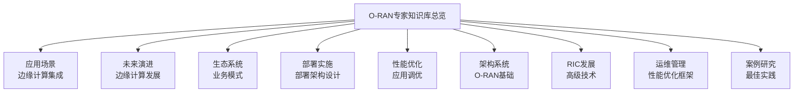
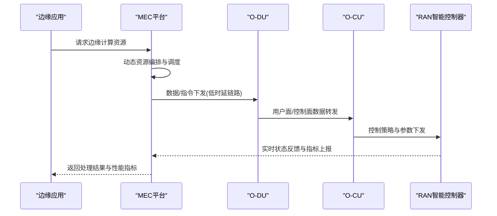
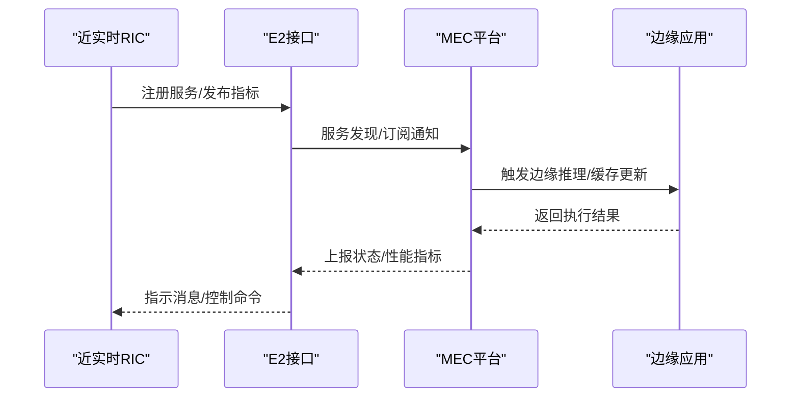
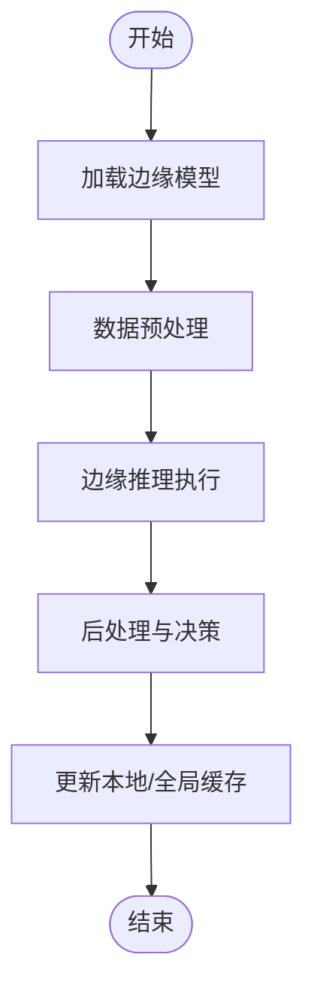
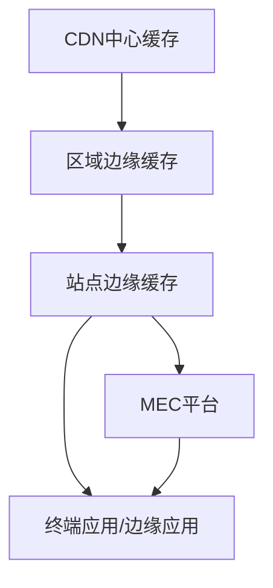
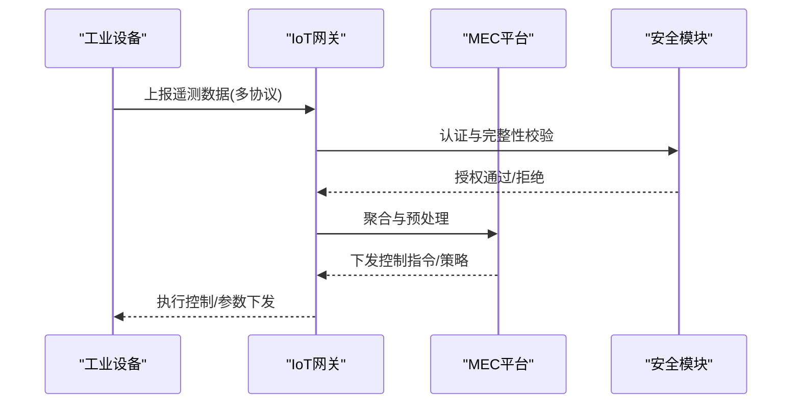
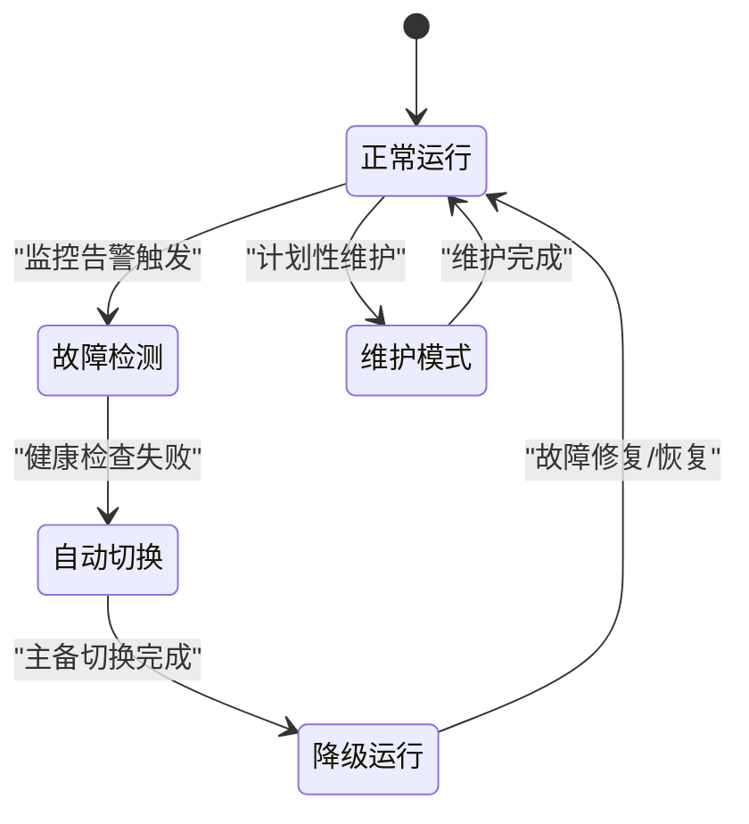
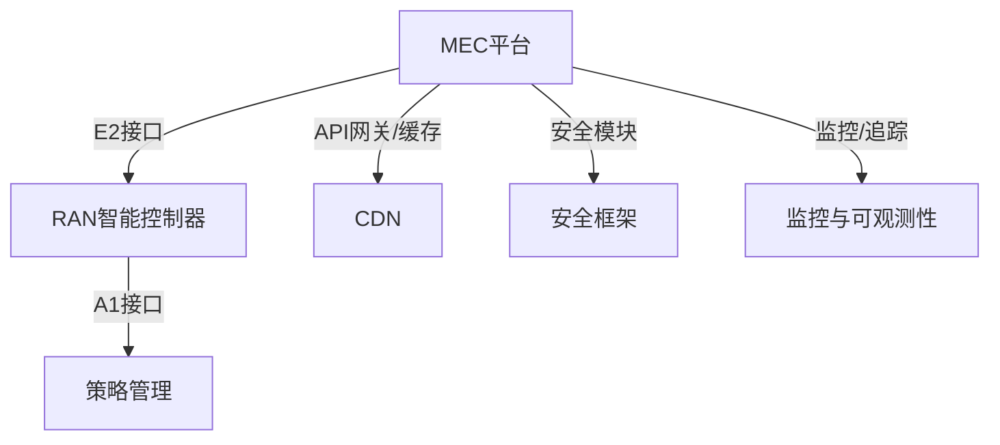
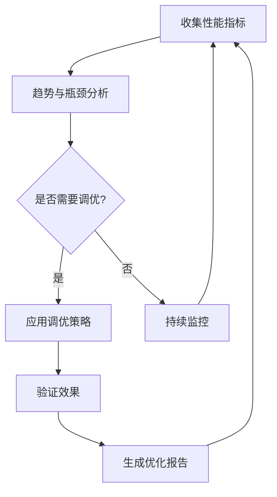

# 边缘计算集成

<cite>
**本文引用的文件**   
- [O-RAN专家知识库总览](file://README.md)
- [应用场景：边缘计算集成](file://10-application-scenarios/readme.md)
- [未来演进：边缘计算发展](file://15-future-development/emerging-applications/emerging-applications-roadmap.md)
- [生态系统：业务模式](file://20-ecosystem-partnership/business-models/o-ran-business-models.md)
- [部署实施：部署架构设计](file://08-deployment-implementation/readme.md)
- [性能优化：应用调优](file://26-performance-optimization/application-tuning/o-ran-application-performance-tuning.md)
- [架构系统：O-RAN基础](file://01-architecture-system/readme.md)
- [RIC发展：高级技术](file://07-ric-development/readme.md)
- [运维管理：性能优化框架](file://14-operations-management/performance-optimization/performance-optimization-framework.md)
- [案例研究：最佳实践](file://21-case-studies/best-practices/o-ran-best-practice-cases.md)
</cite>

## 目录
1. [引言](#引言)
2. [项目结构](#项目结构)
3. [核心组件](#核心组件)
4. [架构总览](#架构总览)
5. [详细组件分析](#详细组件分析)
6. [依赖关系分析](#依赖关系分析)
7. [性能考量](#性能考量)
8. [故障排查指南](#故障排查指南)
9. [结论](#结论)
10. [附录](#附录)

## 引言
本技术指导文档面向边缘计算与O-RAN（开放无线接入网）的协同集成，聚焦MEC（多接入边缘计算）与O-DU/O-CU共址部署、E2接口与MEC服务发现的接口优化、分布式AI/ML在边缘的模型部署与推理、联邦学习与边缘推理性能优化、边缘缓存与多级CDN集成、工业物联网网关的协议转换与安全认证、以及业务连续性保障（容灾备份、自动切换与分钟级恢复）。文档基于仓库中的权威资料进行系统化梳理，并提供可操作的架构设计、流程图与时序图，帮助读者快速构建可落地的边缘O-RAN集成方案。

## 项目结构
该知识库以主题域划分，围绕O-RAN架构、核心网元、接口标准、解耦选项、云平台集成、工作小组职责、部署实施、标准合规、应用场景、测试验证、运维管理、未来发展、行业解决方案、开源生态、成本效益、人才发展、生态合作、案例研究、工具平台、国际部署、可持续发展、法律合规、性能优化、故障诊断、监控告警、安全威胁、最佳实践等维度形成完整体系。与边缘计算集成直接相关的内容主要分布在以下目录：
- 应用场景：边缘计算集成（MEC、边缘智能、CDN、IoT网关、业务连续性）
- 未来演进：边缘计算进化（分布式智能、认知边缘网络、泛在智能）
- 生态系统：业务模式（MEC服务、数据洞察、网络切片即服务）
- 部署实施：部署架构设计（边缘部署、多云部署）
- 性能优化：应用调优（微服务、容器、API网关、CDN集成）
- 架构系统：O-RAN基础（云原生、弹性伸缩、接口标准）
- RIC发展：高级技术（E2接口、A1接口、智能算法、联邦学习）
- 运维管理：性能优化框架（网络、计算、应用层优化）
- 案例研究：最佳实践（MEC与O-RAN集成的实证）



**图表来源**
- [O-RAN专家知识库总览](file://README.md#L1-L472)
- [应用场景：边缘计算集成](file://10-application-scenarios/readme.md#L45-L79)
- [未来演进：边缘计算发展](file://15-future-development/emerging-applications/emerging-applications-roadmap.md#L284-L337)
- [生态系统：业务模式](file://20-ecosystem-partnership/business-models/o-ran-business-models.md#L139-L182)
- [部署实施：部署架构设计](file://08-deployment-implementation/readme.md#L6-L38)
- [性能优化：应用调优](file://26-performance-optimization/application-tuning/o-ran-application-performance-tuning.md#L131-L199)
- [架构系统：O-RAN基础](file://01-architecture-system/readme.md#L1-L161)
- [RIC发展：高级技术](file://07-ric-development/readme.md#L1-L368)
- [运维管理：性能优化框架](file://14-operations-management/performance-optimization/performance-optimization-framework.md#L1-L650)
- [案例研究：最佳实践](file://21-case-studies/best-practices/o-ran-best-practice-cases.md#L1-L210)

**章节来源**
- [O-RAN专家知识库总览](file://README.md#L1-L472)

## 核心组件
- MEC平台与O-RAN共址部署：MEC与O-DU/O-CU在同一站点或机房内部署，实现超低时延与本地化处理。
- E2接口与MEC服务发现：通过E2接口实现RIC与MEC平台的服务注册与发现，支撑边缘智能应用的实时控制面交互。
- 分布式AI/ML：在边缘侧进行模型训练与推理，结合联邦学习实现跨站点隐私保护协作。
- 边缘缓存与CDN：多级缓存架构与CDN集成，提升内容命中率与响应速度。
- 工业物联网网关：协议转换、设备管理、安全认证与边缘聚合。
- 业务连续性：多站点冗余、自动切换、会话保持与分钟级恢复。

**章节来源**
- [应用场景：边缘计算集成](file://10-application-scenarios/readme.md#L45-L79)
- [部署实施：部署架构设计](file://08-deployment-implementation/readme.md#L27-L32)
- [未来演进：边缘计算发展](file://15-future-development/emerging-applications/emerging-applications-roadmap.md#L284-L337)
- [生态系统：业务模式](file://20-ecosystem-partnership/business-models/o-ran-business-models.md#L156-L168)
- [RIC发展：高级技术](file://07-ric-development/readme.md#L60-L78)
- [性能优化：应用调优](file://26-performance-optimization/application-tuning/o-ran-application-performance-tuning.md#L189-L193)

## 架构总览
下图展示MEC与O-RAN协同的端到端架构：O-DU/O-CU负责无线接入与核心网功能，MEC平台提供边缘计算能力；E2接口承载RIC与MEC之间的服务发现与控制指令；边缘缓存与CDN提升内容分发效率；IoT网关完成协议转换与设备管理；业务连续性保障通过多站点冗余与自动切换实现。

```mermaid
graph TB
subgraph "无线接入层"
RU["射频单元(O-RU)"]
DU["分布式单元(O-DU)"]
CU["集中式单元(O-CU)"]
end
subgraph "边缘计算层"
MEC["多接入边缘计算(MEC)平台"]
EDGE_CACHE["边缘缓存"]
CDN["内容分发网络(CDN)"]
IOT_GW["工业物联网网关"]
end
subgraph "智能控制层"
RIC["RAN智能控制器(近实时/非实时)"]
E2["E2接口"]
end
subgraph "业务连续性"
MULTI_SITE["多站点冗余"]
AUTO_SWITCH["自动切换/会话保持"]
MINUTE_RTO["分钟级RTO恢复"]
end
RU --> DU
DU --> CU
CU < --> RIC
RIC < --> E2
E2 < --> MEC
MEC <- --> EDGE_CACHE
EDGE_CACHE < --> CDN
IOT_GW --> MEC
MULTI_SITE --> MEC
AUTO_SWITCH --> MEC
MINUTE_RTO --> MEC
```

**图表来源**
- [架构系统：O-RAN基础](file://01-architecture-system/readme.md#L8-L26)
- [应用场景：边缘计算集成](file://10-application-scenarios/readme.md#L45-L79)
- [部署实施：部署架构设计](file://08-deployment-implementation/readme.md#L27-L32)
- [RIC发展：高级技术](file://07-ric-development/readme.md#L8-L33)
- [未来演进：边缘计算发展](file://15-future-development/emerging-applications/emerging-applications-roadmap.md#L284-L337)
- [生态系统：业务模式](file://20-ecosystem-partnership/business-models/o-ran-business-models.md#L156-L168)

## 详细组件分析

### MEC与O-DU/O-CU共址部署与资源编排
- 共址部署策略：将MEC平台与O-DU/O-CU部署在同一物理或虚拟节点，减少回传时延并提升本地化服务能力。
- 动态资源编排：基于业务负载与SLA需求，动态分配CPU、内存、存储与网络资源，确保边缘应用的低时延与高吞吐。
- 边缘-核心协调：建立MEC与核心网的协调机制，实现数据卸载、缓存同步与任务迁移。



**图表来源**
- [部署实施：部署架构设计](file://08-deployment-implementation/readme.md#L27-L32)
- [架构系统：O-RAN基础](file://01-architecture-system/readme.md#L18-L24)
- [RIC发展：高级技术](file://07-ric-development/readme.md#L8-L33)

**章节来源**
- [部署实施：部署架构设计](file://08-deployment-implementation/readme.md#L27-L32)
- [架构系统：O-RAN基础](file://01-architecture-system/readme.md#L18-L24)

### E2接口与MEC服务发现的接口优化
- E2服务模型：支持KPI订阅、无线资源控制、CU-UP控制等服务模型，满足MEC平台对实时控制的需求。
- 服务注册与发现：通过E2接口实现MEC平台的服务注册、订阅与指示消息处理，保障控制面的高效交互。
- 性能优化：批量消息处理、连接池管理、异步处理与缓存策略，降低控制面开销。



**图表来源**
- [RIC发展：高级技术](file://07-ric-development/readme.md#L60-L78)
- [应用场景：边缘计算集成](file://10-application-scenarios/readme.md#L48-L50)

**章节来源**
- [RIC发展：高级技术](file://07-ric-development/readme.md#L60-L78)
- [应用场景：边缘计算集成](file://10-application-scenarios/readme.md#L48-L50)

### 分布式AI/ML在边缘的模型部署与推理、联邦学习
- 模型部署与推理：在边缘节点进行模型加载、预处理、推理与后处理，结合硬件加速与模型压缩提升性能。
- 联邦学习：在不共享原始数据的前提下，跨站点协同训练模型，保障数据隐私与模型精度。
- 性能优化：模型量化、剪枝、蒸馏与缓存策略，降低边缘侧计算与存储压力。



**图表来源**
- [应用场景：边缘计算集成](file://10-application-scenarios/readme.md#L52-L58)
- [未来演进：边缘计算发展](file://15-future-development/emerging-applications/emerging-applications-roadmap.md#L284-L337)
- [性能优化：应用调优](file://26-performance-optimization/application-tuning/o-ran-application-performance-tuning.md#L189-L193)

**章节来源**
- [应用场景：边缘计算集成](file://10-application-scenarios/readme.md#L52-L58)
- [未来演进：边缘计算发展](file://15-future-development/emerging-applications/emerging-applications-roadmap.md#L284-L337)

### 边缘缓存策略、多级缓存架构与CDN集成
- 缓存策略：热门内容预测、动态缓存与失效策略，提升命中率与降低回源压力。
- 多级缓存：边缘节点缓存、区域缓存与中心缓存协同，缩短访问路径。
- CDN集成：与CDN联动实现就近分发，结合API网关缓存策略与预热机制。



**图表来源**
- [应用场景：边缘计算集成](file://10-application-scenarios/readme.md#L59-L65)
- [性能优化：应用调优](file://26-performance-optimization/application-tuning/o-ran-application-performance-tuning.md#L189-L193)

**章节来源**
- [应用场景：边缘计算集成](file://10-application-scenarios/readme.md#L59-L65)
- [性能优化：应用调优](file://26-performance-optimization/application-tuning/o-ran-application-performance-tuning.md#L189-L193)

### 工业物联网网关的协议转换、设备管理与安全认证
- 协议转换：支持MQTT、CoAP、LwM2M、NB-IoT等协议，实现多样设备接入。
- 设备管理：统一设备生命周期管理、配置下发与远程诊断。
- 安全认证：基于零信任与mTLS、OAuth 2.0/OIDC等机制，保障端到端安全。



**图表来源**
- [应用场景：边缘计算集成](file://10-application-scenarios/readme.md#L66-L72)
- [RIC发展：高级技术](file://07-ric-development/readme.md#L171-L196)

**章节来源**
- [应用场景：边缘计算集成](file://10-application-scenarios/readme.md#L66-L72)
- [RIC发展：高级技术](file://07-ric-development/readme.md#L171-L196)

### 业务连续性保障：容灾备份、自动切换与分钟级恢复
- 多站点冗余：跨站点部署与流量分担，避免单点故障。
- 自动切换与会话保持：基于健康检查与状态同步，实现无感切换。
- 分钟级RTO：通过本地备份与远程复制，结合自动化恢复脚本，达成RTO目标。



**图表来源**
- [应用场景：边缘计算集成](file://10-application-scenarios/readme.md#L73-L79)

**章节来源**
- [应用场景：边缘计算集成](file://10-application-scenarios/readme.md#L73-L79)

## 依赖关系分析
- 组件耦合与内聚：MEC与O-DU/O-CU的共址部署提升了内聚性，降低了跨域耦合；E2接口是RIC与MEC的关键耦合点。
- 外部依赖：CDN、安全框架、监控与可观测性平台、容器编排与微服务治理。
- 接口契约：E2/A1接口定义了策略与控制面交互规范，保证多厂商互操作。



**图表来源**
- [架构系统：O-RAN基础](file://01-architecture-system/readme.md#L27-L34)
- [性能优化：应用调优](file://26-performance-optimization/application-tuning/o-ran-application-performance-tuning.md#L178-L199)
- [运维管理：性能优化框架](file://14-operations-management/performance-optimization/performance-optimization-framework.md#L378-L448)

**章节来源**
- [架构系统：O-RAN基础](file://01-architecture-system/readme.md#L27-L34)
- [性能优化：应用调优](file://26-performance-optimization/application-tuning/o-ran-application-performance-tuning.md#L178-L199)
- [运维管理：性能优化框架](file://14-operations-management/performance-optimization/performance-optimization-framework.md#L378-L448)

## 性能考量
- 网络层优化：Jumbo帧、NUMA感知绑定、中断亲和、优先队列与流量标记，降低E2/F1/O-FH等关键接口的时延与抖动。
- 计算层优化：CPU亲和、进程优先级、内核调度器参数、大页内存与内存分配器优化，提升实时性与稳定性。
- 应用层优化：容器资源请求/限制、并发参数、垃圾回收与GOGC设置、健康探针与就绪探测，配合CDN与缓存策略。
- 自动化调优：基于监控指标的趋势分析与推荐，实现横向扩展、内存与网络参数的自动调整。



**图表来源**
- [运维管理：性能优化框架](file://14-operations-management/performance-optimization/performance-optimization-framework.md#L450-L648)

**章节来源**
- [运维管理：性能优化框架](file://14-operations-management/performance-optimization/performance-optimization-framework.md#L6-L101)
- [运维管理：性能优化框架](file://14-operations-management/performance-optimization/performance-optimization-framework.md#L103-L234)
- [运维管理：性能优化框架](file://14-operations-management/performance-optimization/performance-optimization-framework.md#L236-L376)
- [运维管理：性能优化框架](file://14-operations-management/performance-optimization/performance-optimization-framework.md#L450-L648)

## 故障排查指南
- 网络问题：检查接口统计、中断亲和、队列与优先级配置，定位E2/F1/O-FH链路异常。
- 计算问题：核查CPU亲和、进程优先级、内核调度参数与内存分配器设置，识别资源争用与延迟尖峰。
- 应用问题：审查容器资源限制、启动时间、探针配置与日志聚合，评估健康状态与错误率。
- 安全问题：验证mTLS、OAuth授权、速率限制与API网关安全策略，排查异常行为与重放攻击。

**章节来源**
- [运维管理：性能优化框架](file://14-operations-management/performance-optimization/performance-optimization-framework.md#L6-L101)
- [运维管理：性能优化框架](file://14-operations-management/performance-optimization/performance-optimization-framework.md#L103-L234)
- [运维管理：性能优化框架](file://14-operations-management/performance-optimization/performance-optimization-framework.md#L236-L376)
- [RIC发展：高级技术](file://07-ric-development/readme.md#L171-L196)

## 结论
通过将MEC与O-RAN深度融合，可在边缘实现低时延、高可靠的智能服务与内容分发。依托E2接口与服务发现机制，结合分布式AI/ML与联邦学习，可实现跨站点的协同优化；借助多级缓存与CDN集成，显著提升用户体验与网络效率；工业物联网网关提供协议转换与安全认证能力；完善的业务连续性设计确保关键应用的高可用。建议在部署前制定共址策略与资源编排方案，完善接口优化与自动化调优流程，并以案例研究为参考，持续迭代优化。

## 附录
- 实践案例参考：Verizon 5G边缘计算集成、德國電信O-RAN部署、Rakuten Mobile绿色基建等，均可作为MEC与O-RAN协同的实证借鉴。
- 商业模式：MEC作为服务提供基础设施与平台能力，结合网络切片即服务与数据洞察服务，形成多方共赢的生态。

**章节来源**
- [案例研究：最佳实践](file://21-case-studies/best-practices/o-ran-best-practice-cases.md#L78-L103)
- [案例研究：最佳实践](file://21-case-studies/best-practices/o-ran-best-practice-cases.md#L104-L129)
- [生态系统：业务模式](file://20-ecosystem-partnership/business-models/o-ran-business-models.md#L139-L182)