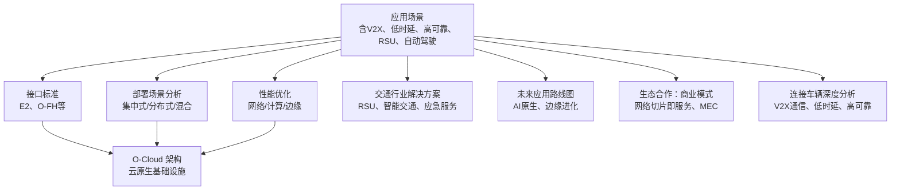
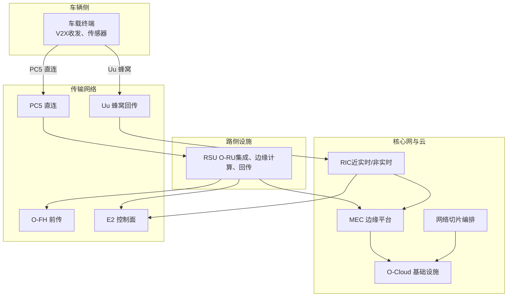
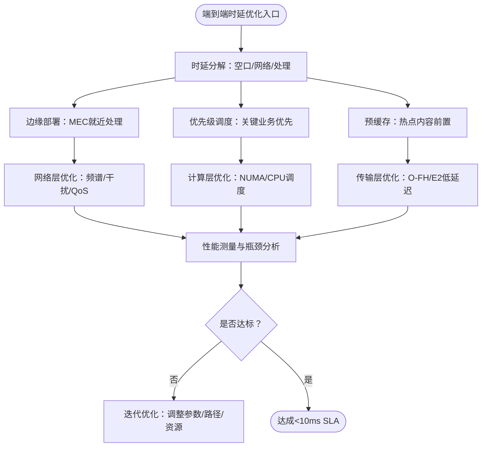
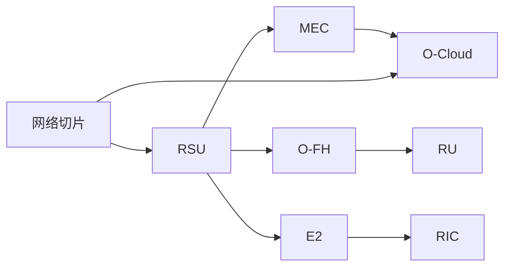

# 连接车辆应用

<cite>
**本文引用的文件**
- [O-RAN 应用场景](file://10-application-scenarios/readme.md)
- [连接车辆深度分析](file://10-application-scenarios/connected-vehicles/connected-vehicles-deep-dive.md)
- [连接车辆概览](file://10-application-scenarios/connected-vehicles/readme.md)
- [O-RAN 交通解决方案](file://16-industry-solutions/transportation/o-ran-transportation-solutions.md)
- [O-RAN 接口标准：E2 接口](file://03-interface-standards/e2-interface.md)
- [O-RAN 接口标准：O-FH 接口](file://03-interface-standards/o-fh-interface.md)
- [O-RAN 架构系统：O-Cloud 架构](file://01-architecture-system/o-cloud-architecture.md)
- [O-RAN 部署场景分析](file://04-disaggregation-options/deployment-scenarios.md)
- [O-RAN 网络性能优化：网络性能调优](file://26-performance-optimization/network-optimization/network-performance-tuning.md)
- [O-RAN 计算层优化](file://26-performance-optimization/compute-optimization/o-ran-compute-optimization.md)
- [O-RAN 未来应用路线图](file://15-future-development/emerging-applications/emerging-applications-roadmap.md)
- [O-RAN 生态合作：商业模式](file://20-ecosystem-partnership/business-models/o-ran-business-models.md)
- [O-RAN 知识库总览](file://README.md)
</cite>

## 更新摘要
**所做更改**
- 新增了连接车辆深度分析的详细内容，包括V2X通信、低时延要求、高可靠性设计、网络覆盖和自动驾驶支持
- 更新了V2X通信类型和应用场景的详细分类
- 增强了端到端时延分解和优化策略的说明
- 完善了高可靠通信的冗余设计和故障容错机制
- 扩展了RSU部署策略和自动驾驶支持的详细分析
- 增加了实际案例研究和生产环境最佳实践

## 目录
1. [引言](#引言)
2. [项目结构](#项目结构)
3. [核心组件](#核心组件)
4. [架构总览](#架构总览)
5. [详细组件分析](#详细组件分析)
6. [依赖关系分析](#依赖关系分析)
7. [性能考量](#性能考量)
8. [故障排查指南](#故障排查指南)
9. [结论](#结论)
10. [附录](#附录)

## 引言
本技术文档面向连接车辆应用，聚焦车对万物（V2X）通信在 O-RAN 架构下的实现路径，系统阐述 V2V、V2I、V2P、V2N 的应用场景与消息类型，PC5 直连与 Uu 蜂窝接口的分工与协同，以及自动驾驶场景下严苛的端到端时延（<1ms）分解与优化策略。同时，文档覆盖高可靠通信的冗余设计、多路径多连接多频段策略、快速故障检测与自动切换机制；详述 RSU 部署策略（密度与位置优化）在高速公路、城市道路、停车场等场景的应用；并深入分析 L4/L5 级自动驾驶的 O-RAN 需求、传感器融合（5G+雷达+相机+激光雷达）、海量传感器数据传输与边缘处理，最后给出 Robotaxi、自动驾驶物流、远程驾驶等实际应用案例与实施指导。

**更新** 新增了详细的连接车辆深度分析，提供了更全面的V2X通信、低时延要求、高可靠性设计、网络覆盖和自动驾驶支持的全面覆盖。

## 项目结构
该知识库围绕 O-RAN 的架构、接口、部署、性能优化、应用案例等维度构建，连接车辆应用相关内容主要分布在"应用场景"、"交通行业解决方案"、"接口标准"、"部署场景"、"性能优化"、"生态合作"等目录中。整体结构清晰，便于从业务场景入手，逐步深入到技术实现与工程落地。

章节来源
- [O-RAN 知识库总览:1-472](file://README.md#L1-L472)
- [连接车辆概览:1-58](file://10-application-scenarios/connected-vehicles/readme.md#L1-L58)

## 核心组件
- V2X 通信与消息类型
  - V2V/V2I/V2P/V2N 的应用场景与消息类型（安全消息、交通信息、服务消息），以及在智能交通系统、车路协同、自动驾驶中的作用。
- 通信接口与协议
  - E2 接口用于 RIC 与 CU/DU 的近实时控制面交互，强调低延迟与高可靠性；O-FH 接口承载 DU 与 RU 间的前传数据面，关注带宽、延迟与可靠性设计。
- 边缘与云原生
  - O-Cloud 架构提供云原生基础设施，支持容器化、虚拟化与自动化编排，支撑低时延与高可靠。
- 部署与网络切片
  - 针对不同场景（集中式/分布式/混合）的部署策略，以及网络切片在安全、娱乐、遥测、应急等业务中的差异化保障。
- 性能与可靠性
  - 网络层（频谱效率、干扰管理、QoS）、计算层（CPU 调度、NUMA、容器级 CPU 管理）、边缘与 O-FH/E2 的协同优化。

**更新** 新增了详细的V2X通信类型分类（V2V、V2I、V2P、V2N、V2X）和通信技术方案（PC5、Uu、DSRC、C-V2X、混合方法）。

章节来源
- [连接车辆深度分析:9-80](file://10-application-scenarios/connected-vehicles/connected-vehicles-deep-dive.md#L9-L80)
- [O-RAN 应用场景:118-153](file://10-application-scenarios/readme.md#L118-L153)
- [O-RAN 接口标准：E2 接口:90-304](file://03-interface-standards/e2-interface.md#L90-L304)
- [O-RAN 接口标准：O-FH 接口:98-139](file://03-interface-standards/o-fh-interface.md#L98-L139)
- [O-RAN 架构系统：O-Cloud 架构:1-238](file://01-architecture-system/o-cloud-architecture.md#L1-L238)
- [O-RAN 部署场景分析:1-563](file://04-disaggregation-options/deployment-scenarios.md#L1-L563)
- [O-RAN 网络性能优化：网络性能调优:1-98](file://26-performance-optimization/network-optimization/network-performance-tuning.md#L1-L98)
- [O-RAN 计算层优化:1-59](file://26-performance-optimization/compute-optimization/o-ran-compute-optimization.md#L1-L59)

## 架构总览
连接车辆应用的端到端架构以 O-RAN 为核心，结合 V2X 直连与蜂窝两种通道路径，通过边缘计算就近处理，配合网络切片与优先级调度，满足自动驾驶的超低时延与超高可靠。

图表来源
- [连接车辆深度分析:21-28](file://10-application-scenarios/connected-vehicles/connected-vehicles-deep-dive.md#L21-L28)
- [O-RAN 接口标准：E2 接口:90-304](file://03-interface-standards/e2-interface.md#L90-L304)
- [O-RAN 接口标准：O-FH 接口:98-139](file://03-interface-standards/o-fh-interface.md#L98-L139)
- [O-RAN 架构系统：O-Cloud 架构:1-238](file://01-architecture-system/o-cloud-architecture.md#L1-L238)
- [O-RAN 部署场景分析:162-214](file://04-disaggregation-options/deployment-scenarios.md#L162-L214)

## 详细组件分析

### V2X 通信与消息类型
- V2X 类型与场景
  - V2V：碰撞预警、协同变道、编队行驶
  - V2I：信号灯协调、限速提示、紧急事件广播
  - V2P：行人安全、弱势道路使用者保护
  - V2N：云端服务、远程诊断、OTA 升级
  - V2X：综合车联网通信
- 消息类型
  - 安全消息（BSM、紧急车辆警报、道路安全警报、天气警报、交通事件警报）
  - 交通信息（SPaT、MAP、旅行者信息、停车信息、充电站信息）
  - 服务消息（支付消息、车队管理、保险遥测、维护警报、基于使用的保险）
- 时延与可靠性
  - 安全类应用端到端时延 <1ms，可靠性 99.999%~99.9999%
  - 通过边缘部署、优先调度、预缓存与冗余路径降低端到端时延

**更新** 新增了详细的V2X通信类型分类和消息类型细分，包括具体的安全消息、交通信息和服务消息类别。

章节来源
- [连接车辆深度分析:11-80](file://10-application-scenarios/connected-vehicles/connected-vehicles-deep-dive.md#L11-L80)
- [连接车辆概览:8-14](file://10-application-scenarios/connected-vehicles/readme.md#L8-L14)

### PC5 直连与 Uu 蜂窝接口
- PC5（V2X 直连）
  - 低时延、高可靠，适合 V2V/V2P/V2I 的安全消息与协同控制
  - 部署 RSU 作为直连与蜂窝的桥梁，实现广域覆盖与局部高密度协同
- Uu（蜂窝回传）
  - 支撑 V2N 与非直连场景，提供广域连接与云服务能力
  - 结合网络切片与边缘分流，满足不同业务 SLA
- 通信技术
  - DSRC：专用短程通信（IEEE 802.11p）
  - C-V2X：蜂窝V2X技术（3GPP）
  - 混合方法：PC5和Uu通信的组合

**更新** 新增了DSRC和C-V2X通信技术的详细说明，以及混合通信方法的介绍。

章节来源
- [连接车辆深度分析:21-28](file://10-application-scenarios/connected-vehicles/connected-vehicles-deep-dive.md#L21-L28)
- [连接车辆概览:9-11](file://10-application-scenarios/connected-vehicles/readme.md#L9-L11)

### E2 接口（近实时控制面）
- 部署考量
  - 传输网络：带宽、延迟（Near-RT <10ms）、可靠性、QoS
  - 架构：集中式/分布式/混合部署，靠近 CU/DU 降低 E2 延迟
  - 安全：网络隔离、访问控制、加密传输、端点认证
- 性能优化
  - SCTP 参数优化、消息批量处理、网络加速（SR-IOV、DPDK）
  - 多路径传输、冗余部署、跨厂商互操作

章节来源
- [O-RAN 接口标准：E2 接口:90-304](file://03-interface-standards/e2-interface.md#L90-L304)

### O-FH 接口（前传数据面）
- 接口流程
  - 初始化：物理连接、链路协商、协议版本、能力交换
  - 正常运行：同步建立、数据传输、状态监控、故障处理
  - 维护：软件升级、诊断测试、配置更新
- 部署考量
  - 带宽需求：天线数、带宽、调制方式、压缩与冗余
  - 延迟要求：URLLC 业务的严格时延
  - 可靠性：路径冗余、链路聚合、备用 RU
  - QoS：同步/控制流量优先，避免用户面拥塞影响

章节来源
- [O-RAN 接口标准：O-FH 接口:98-139](file://03-interface-standards/o-fh-interface.md#L98-L139)

### 端到端时延分解与优化
- 时延构成
  - 空口时延：<1ms
  - 网络时延：<5ms
  - 处理时延：<2ms
  - 应用时延：<2ms
  - 总预算：<10ms 端到端时延预算
- 优化策略
  - 边缘部署（MEC）、优先级调度、预缓存
  - 网络层：频谱效率、干扰管理、QoS 参数调优
  - 计算层：NUMA 亲和、容器级 CPU 管理、实时调度
  - 传输层：O-FH/E2 低延迟路径、多路径冗余

**更新** 新增了详细的时延分解和具体数值要求，包括空口时延、网络时延、处理时延和应用时延的具体指标。

图表来源
- [连接车辆深度分析:107-170](file://10-application-scenarios/connected-vehicles/connected-vehicles-deep-dive.md#L107-L170)
- [O-RAN 网络性能优化：网络性能调优:1-98](file://26-performance-optimization/network-optimization/network-performance-tuning.md#L1-L98)
- [O-RAN 计算层优化:1-59](file://26-performance-optimization/compute-optimization/o-ran-compute-optimization.md#L1-L59)
- [O-RAN 接口标准：E2 接口:90-129](file://03-interface-standards/e2-interface.md#L90-L129)
- [O-RAN 接口标准：O-FH 接口:117-139](file://03-interface-standards/o-fh-interface.md#L117-L139)

### 高可靠通信与快速切换
- 冗余设计
  - 多路径、多连接、多频段
  - 多样性技术：空间、频率和时间多样性
  - 热备份：关键组件的热备份
- 快速故障检测与自动切换
  - 心跳监控、链路质量监控、异常检测
  - E2/O-FH 多路径传输、跨厂商故障协作机制
  - 负载均衡与动态资源分配
  - 自动故障转移、路径切换、服务连续性
- 自愈合机制
  - 自动恢复、自动配置、自动优化、自动保护
- 可靠性评估
  - 故障注入测试、极端场景仿真
  - 可用性要求：99.9999% 自动驾驶
  - 包错误率：<10^-5 安全关键应用

**更新** 新增了详细的故障容错机制、自愈合功能和可靠性评估指标。

章节来源
- [连接车辆深度分析:197-268](file://10-application-scenarios/connected-vehicles/connected-vehicles-deep-dive.md#L197-L268)
- [O-RAN 接口标准：E2 接口:267-304](file://03-interface-standards/e2-interface.md#L267-L304)
- [O-RAN 接口标准：O-FH 接口:117-139](file://03-interface-standards/o-fh-interface.md#L117-L139)

### RSU 部署策略（密度与位置优化）
- RSU 架构
  - O-RU 集成、边缘计算节点、高容量回传、电源管理
- 部署场景
  - 高速公路：长距离覆盖与编队/远程驾驶支持
  - 城市交叉口：高密度交通信号协调与行人保护
  - 停车场：室内覆盖与车服务（充电、泊位引导）
  - 隧道：地下环境的信号穿透与连续性保障
  - 特殊位置：专门位置的部署
- 密度与容量规划
  - 并发连接与交通模型、干扰管理（同频/邻频）
  - 覆盖要求：连续覆盖规划
  - 容量要求：车辆密度规划
  - 成本优化：部署成本优化
  - 可扩展性规划：未来扩展规划

**更新** 新增了详细的RSU部署策略，包括密度规划、位置优化和各种部署场景的具体考虑。

章节来源
- [连接车辆深度分析:269-332](file://10-application-scenarios/connected-vehicles/connected-vehicles-deep-dive.md#L269-L332)
- [O-RAN 交通解决方案:55-83](file://16-industry-solutions/transportation/o-ran-transportation-solutions.md#L55-L83)
- [连接车辆概览:32-38](file://10-application-scenarios/connected-vehicles/readme.md#L32-L38)

### 自动驾驶支持（L4/L5）
- O-RAN 需求
  - 超低时延（<10ms）、超高可靠（99.9999%+）、海量传感器数据
  - 全自动化支持、高带宽、全面覆盖
- 传感器融合
  - 5G+雷达+相机+激光雷达+超声波，边缘计算就近处理
  - 海量传感器数据传输：每小时TB级数据量
  - 实时数据处理要求和数据压缩
- 网络架构
  - 多层覆盖：宏覆盖、微覆盖、皮覆盖、微蜂窝、RSU覆盖
  - 冗余设计：网络冗余、计算冗余、存储冗余、电源冗余、地理冗余
  - 边缘计算与切片隔离

**更新** 新增了详细的自动驾驶支持要求，包括L4/L5级别的特定需求、传感器融合技术和多层网络架构。

章节来源
- [连接车辆深度分析:333-388](file://10-application-scenarios/connected-vehicles/connected-vehicles-deep-dive.md#L333-L388)
- [连接车辆概览:40-46](file://10-application-scenarios/connected-vehicles/readme.md#L40-L46)
- [O-RAN 交通解决方案:23-36](file://16-industry-solutions/transportation/o-ran-transportation-solutions.md#L23-L36)

### 实际应用案例与实施指导
- Robotaxi
  - 低时延 V2X 与蜂窝回传、边缘视频分析、安全切片
  - 挑战：支持自动驾驶出租车运营
  - 解决方案：为自动驾驶车辆提供全面的V2X网络
  - 性能：高可靠性、低时延、高带宽
- 自动驾驶物流
  - 编队行驶（V2V）、信号优先（V2I）、远程监控（V2N）
  - 挑战：自动驾驶卡车和物流
  - 解决方案：为自动驾驶物流车辆提供V2X网络
  - 效益：降低劳动力成本，提高效率
- 远程驾驶
  - 超可靠低时延切片、冗余路径、快速切换
  - 挑战：特定场景下的远程驾驶控制
  - 解决方案：低时延V2N通信
  - 性能：实时控制、高可靠性

**更新** 新增了详细的实际应用案例，包括Robotaxi、自动驾驶物流和远程驾驶的具体挑战和解决方案。

章节来源
- [连接车辆深度分析:389-414](file://10-application-scenarios/connected-vehicles/connected-vehicles-deep-dive.md#L389-L414)
- [连接车辆概览:46-46](file://10-application-scenarios/connected-vehicles/readme.md#L46-L46)
- [O-RAN 交通解决方案:102-130](file://16-industry-solutions/transportation/o-ran-transportation-solutions.md#L102-L130)

### 生产环境最佳实践
- 网络设计
  - 可靠性优先、低时延设计、高带宽设计、可扩展性设计、安全性设计
- 部署最佳实践
  - 试点测试、分阶段部署、集成测试、性能测试、文档维护
- 运维最佳实践
  - 主动监控、预测性维护、事件响应、持续改进、定期培训

**新增** 新增了生产环境最佳实践章节，涵盖网络设计、部署和运维的最佳实践。

章节来源
- [连接车辆深度分析:415-440](file://10-application-scenarios/connected-vehicles/connected-vehicles-deep-dive.md#L415-L440)

## 依赖关系分析
- 组件耦合
  - RSU 与 O-FH/E2 的耦合决定前传与控制面的低时延与可靠性
  - MEC 与 O-Cloud 的协同决定边缘处理能力与资源弹性
  - 网络切片与优先级调度共同保障不同业务的 SLA
- 外部依赖
  - 3GPP/ETSI 标准与 O-RAN 接口规范
  - 多厂商设备互操作与测试验证

图表来源
- [O-RAN 接口标准：E2 接口:90-129](file://03-interface-standards/e2-interface.md#L90-L129)
- [O-RAN 接口标准：O-FH 接口:98-139](file://03-interface-standards/o-fh-interface.md#L98-L139)
- [O-RAN 架构系统：O-Cloud 架构:1-238](file://01-architecture-system/o-cloud-architecture.md#L1-L238)
- [O-RAN 部署场景分析:162-214](file://04-disaggregation-options/deployment-scenarios.md#L162-L214)

## 性能考量
- 网络层
  - 频谱效率、干扰管理、QoS 参数精细化配置、PDU 会话优化
- 计算层
  - NUMA 亲和、容器级 CPU 请求/限制、实时调度策略
- 边缘与接口
  - O-FH/E2 低延迟路径、多路径冗余、网络加速（SR-IOV/DPDK）
- 时延优化
  - 空口时延优化、网络传输优化、处理时延优化
  - 端到端时延预算管理和瓶颈识别

**更新** 新增了时延优化的具体考虑因素，包括空口时延、网络传输和处理时延的优化策略。

章节来源
- [连接车辆深度分析:153-170](file://10-application-scenarios/connected-vehicles/connected-vehicles-deep-dive.md#L153-L170)
- [O-RAN 网络性能优化：网络性能调优:1-98](file://26-performance-optimization/network-optimization/network-performance-tuning.md#L1-L98)
- [O-RAN 计算层优化:1-59](file://26-performance-optimization/compute-optimization/o-ran-compute-optimization.md#L1-L59)
- [O-RAN 接口标准：E2 接口:287-296](file://03-interface-standards/e2-interface.md#L287-L296)
- [O-RAN 接口标准：O-FH 接口:117-139](file://03-interface-standards/o-fh-interface.md#L117-L139)

## 故障排查指南
- E2 接口
  - 延迟与吞吐量监控、多路径与冗余检查、跨厂商互操作验证
- O-FH 接口
  - 带宽与延迟校验、链路聚合与备用 RU 验证、同步精度与 QoS 校验
- 边缘与切片
  - MEC 资源占用与亲和性、切片隔离与优先级、跨域协同与一致性
- 可靠性监控
  - 心跳监控、链路质量监控、异常检测、预测性故障检测
- 故障恢复
  - 自动故障转移、路径切换、服务连续性保证、自动恢复程序

**更新** 新增了可靠性监控和故障恢复相关的故障排查指导。

章节来源
- [连接车辆深度分析:219-242](file://10-application-scenarios/connected-vehicles/connected-vehicles-deep-dive.md#L219-L242)
- [O-RAN 接口标准：E2 接口:267-304](file://03-interface-standards/e2-interface.md#L267-L304)
- [O-RAN 接口标准：O-FH 接口:117-139](file://03-interface-standards/o-fh-interface.md#L117-L139)
- [O-RAN 部署场景分析:477-496](file://04-disaggregation-options/deployment-scenarios.md#L477-L496)

## 结论
连接车辆应用在 O-RAN 架构下，通过 V2X 直连与蜂窝回传的协同、边缘计算就近处理、网络切片与优先级调度、以及严格的 E2/O-FH 低时延与高可靠设计，能够满足自动驾驶的严苛 SLA。RSU 的密度与位置优化是实现广域覆盖与局部高密度协同的关键。面向未来，AI 原生与边缘智能将继续深化 O-RAN 在连接车辆领域的应用潜力。

**更新** 强调了新增的深度分析内容，包括全面的V2X通信、低时延要求、高可靠性设计、网络覆盖和自动驾驶支持。

## 附录
- 商业模式与价值
  - 网络切片即服务、MEC 服务分成、数据洞察与运营优化
- 未来演进
  - AI 原生 O-RAN、分布式智能架构、边缘认知网络、泛在智能
- 参考资源
  - 5GAA - 5G汽车协会
  - Car 2 Car Communication Consortium
  - SAE International
  - O-RAN V2X Applications
  - 3GPP V2X Standards

**更新** 新增了详细的参考资源列表，包括行业标准组织和相关标准文档。

章节来源
- [连接车辆深度分析:441-447](file://10-application-scenarios/connected-vehicles/connected-vehicles-deep-dive.md#L441-L447)
- [O-RAN 生态合作：商业模式:139-182](file://20-ecosystem-partnership/business-models/o-ran-business-models.md#L139-L182)
- [O-RAN 未来应用路线图:61-282](file://15-future-development/emerging-applications/emerging-applications-roadmap.md#L61-L282)
- [O-RAN 未来应用路线图:284-337](file://15-future-development/emerging-applications/emerging-applications-roadmap.md#L284-L337)