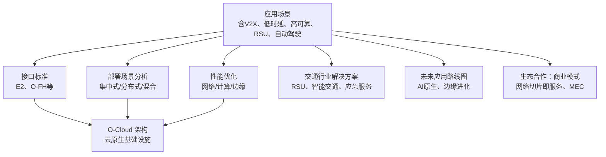
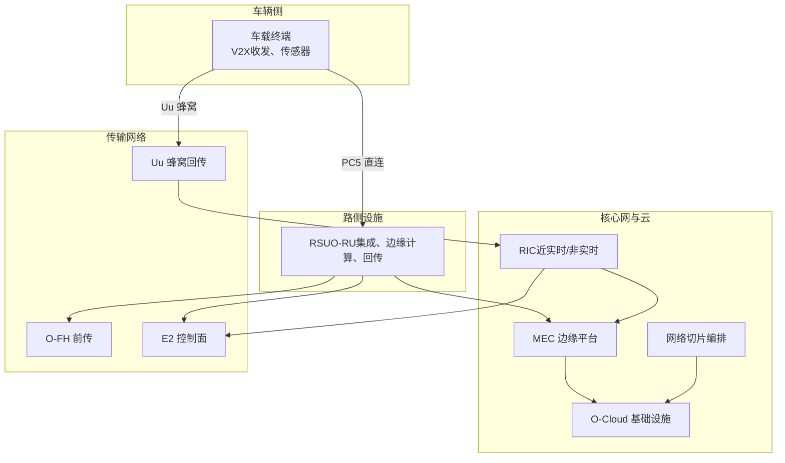
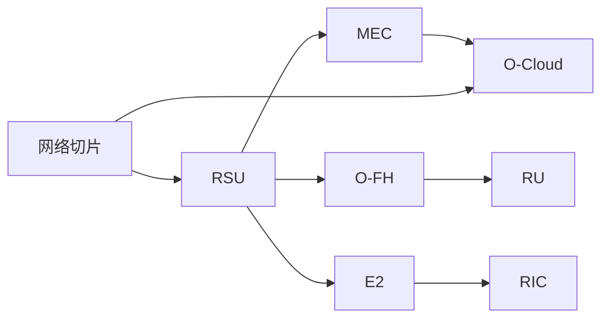

# 连接车辆应用

<cite>
**本文引用的文件**
- [O-RAN 应用场景](file://10-application-scenarios/readme.md)
- [O-RAN 交通解决方案](file://16-industry-solutions/transportation/o-ran-transportation-solutions.md)
- [O-RAN 接口标准：E2 接口](file://03-interface-standards/e2-interface.md)
- [O-RAN 接口标准：O-FH 接口](file://03-interface-standards/o-fh-interface.md)
- [O-RAN 架构系统：O-Cloud 架构](file://01-architecture-system/o-cloud-architecture.md)
- [O-RAN 部署场景分析](file://04-disaggregation-options/deployment-scenarios.md)
- [O-RAN 网络性能优化：网络性能调优](file://26-performance-optimization/network-optimization/network-performance-tuning.md)
- [O-RAN 计算层优化](file://26-performance-optimization/compute-optimization/o-ran-compute-optimization.md)
- [O-RAN 未来应用路线图](file://15-future-development/emerging-applications/emerging-applications-roadmap.md)
- [O-RAN 生态合作：商业模式](file://20-ecosystem-partnership/business-models/o-ran-business-models.md)
- [O-RAN 知识库总览](file://README.md)
</cite>

## 目录
1. [引言](#引言)
2. [项目结构](#项目结构)
3. [核心组件](#核心组件)
4. [架构总览](#架构总览)
5. [详细组件分析](#详细组件分析)
6. [依赖关系分析](#依赖关系分析)
7. [性能考量](#性能考量)
8. [故障排查指南](#故障排查指南)
9. [结论](#结论)
10. [附录](#附录)

## 引言
本技术文档面向连接车辆应用，聚焦车对万物（V2X）通信在 O-RAN 架构下的实现路径，系统阐述 V2V、V2I、V2P、V2N 的应用场景与消息类型，PC5 直连与 Uu 蜂窝接口的分工与协同，以及自动驾驶场景下严苛的端到端时延（<1ms）分解与优化策略。同时，文档覆盖高可靠通信的冗余设计、多路径多连接多频段策略、快速故障检测与自动切换机制；详述 RSU 部署策略（密度与位置优化）在高速公路、城市道路、停车场等场景的应用；并深入分析 L4/L5 级自动驾驶的 O-RAN 需求、传感器融合（5G+雷达+相机+激光雷达）、海量传感器数据传输与边缘处理，最后给出 Robotaxi、自动驾驶物流、远程驾驶等实际应用案例与实施指导。

## 项目结构
该知识库围绕 O-RAN 的架构、接口、部署、性能优化、应用案例等维度构建，连接车辆应用相关内容主要分布在“应用场景”、“交通行业解决方案”、“接口标准”、“部署场景”、“性能优化”、“生态合作”等目录中。整体结构清晰，便于从业务场景入手，逐步深入到技术实现与工程落地。

章节来源
- [O-RAN 知识库总览](file://README.md#L1-L472)

## 核心组件
- V2X 通信与消息类型
  - V2V/V2I/V2P/V2N 的应用场景与消息类型（安全消息、交通信息、服务消息），以及在智能交通系统、车路协同、自动驾驶中的作用。
- 通信接口与协议
  - E2 接口用于 RIC 与 CU/DU 的近实时控制面交互，强调低延迟与高可靠性；O-FH 接口承载 DU 与 RU 间的前传数据面，关注带宽、延迟与可靠性设计。
- 边缘与云原生
  - O-Cloud 架构提供云原生基础设施，支持容器化、虚拟化与自动化编排，支撑低时延与高可靠。
- 部署与网络切片
  - 针对不同场景（集中式/分布式/混合）的部署策略，以及网络切片在安全、娱乐、遥测、应急等业务中的差异化保障。
- 性能与可靠性
  - 网络层（频谱效率、干扰管理、QoS）、计算层（CPU 调度、NUMA、容器级 CPU 管理）、边缘与 O-FH/E2 的协同优化。

章节来源
- [O-RAN 应用场景](file://10-application-scenarios/readme.md#L118-L153)
- [O-RAN 接口标准：E2 接口](file://03-interface-standards/e2-interface.md#L90-L304)
- [O-RAN 接口标准：O-FH 接口](file://03-interface-standards/o-fh-interface.md#L98-L139)
- [O-RAN 架构系统：O-Cloud 架构](file://01-architecture-system/o-cloud-architecture.md#L1-L238)
- [O-RAN 部署场景分析](file://04-disaggregation-options/deployment-scenarios.md#L1-L563)
- [O-RAN 网络性能优化：网络性能调优](file://26-performance-optimization/network-optimization/network-performance-tuning.md#L1-L98)
- [O-RAN 计算层优化](file://26-performance-optimization/compute-optimization/o-ran-compute-optimization.md#L1-L59)

## 架构总览
连接车辆应用的端到端架构以 O-RAN 为核心，结合 V2X 直连与蜂窝两种通道路径，通过边缘计算就近处理，配合网络切片与优先级调度，满足自动驾驶的超低时延与超高可靠。

图表来源
- [O-RAN 应用场景](file://10-application-scenarios/readme.md#L118-L153)
- [O-RAN 接口标准：E2 接口](file://03-interface-standards/e2-interface.md#L90-L304)
- [O-RAN 接口标准：O-FH 接口](file://03-interface-standards/o-fh-interface.md#L98-L139)
- [O-RAN 架构系统：O-Cloud 架构](file://01-architecture-system/o-cloud-architecture.md#L1-L238)
- [O-RAN 部署场景分析](file://04-disaggregation-options/deployment-scenarios.md#L162-L214)

## 详细组件分析

### V2X 通信与消息类型
- V2X 类型与场景
  - V2V：碰撞预警、协同变道、编队行驶
  - V2I：信号灯协调、限速提示、紧急事件广播
  - V2P：行人安全、弱势道路使用者保护
  - V2N：云端服务、远程诊断、OTA 升级
- 消息类型
  - 安全消息（碰撞预警、紧急制动）
  - 交通信息（拥堵、事故、限速）
  - 服务消息（导航、娱乐、远程服务）
- 时延与可靠性
  - 安全类应用端到端时延 <1ms，可靠性 99.999%~99.9999%
  - 通过边缘部署、优先调度、预缓存与冗余路径降低端到端时延

章节来源
- [O-RAN 应用场景](file://10-application-scenarios/readme.md#L118-L153)

### PC5 直连与 Uu 蜂窝接口
- PC5（V2X 直连）
  - 低时延、高可靠，适合 V2V/V2P/V2I 的安全消息与协同控制
  - 部署 RSU 作为直连与蜂窝的桥梁，实现广域覆盖与局部高密度协同
- Uu（蜂窝回传）
  - 支撑 V2N 与非直连场景，提供广域连接与云服务能力
  - 结合网络切片与边缘分流，满足不同业务 SLA

章节来源
- [O-RAN 应用场景](file://10-application-scenarios/readme.md#L118-L125)

### E2 接口（近实时控制面）
- 部署考量
  - 传输网络：带宽、延迟（Near-RT <10ms）、可靠性、QoS
  - 架构：集中式/分布式/混合部署，靠近 CU/DU 降低 E2 延迟
  - 安全：网络隔离、访问控制、加密传输、端点认证
- 性能优化
  - SCTP 参数优化、消息批量处理、网络加速（SR-IOV、DPDK）
  - 多路径传输、冗余部署、跨厂商互操作

章节来源
- [O-RAN 接口标准：E2 接口](file://03-interface-standards/e2-interface.md#L90-L304)

### O-FH 接口（前传数据面）
- 接口流程
  - 初始化：物理连接、链路协商、协议版本、能力交换
  - 正常运行：同步建立、数据传输、状态监控、故障处理
  - 维护：软件升级、诊断测试、配置更新
- 部署考量
  - 带宽需求：天线数、带宽、调制方式、压缩与冗余
  - 延迟要求：URLLC 业务的严格时延
  - 可靠性：路径冗余、链路聚合、备用 RU
  - QoS：同步/控制流量优先，避免用户面拥塞影响

章节来源
- [O-RAN 接口标准：O-FH 接口](file://03-interface-standards/o-fh-interface.md#L98-L139)

### 端到端时延分解与优化
- 时延构成
  - 空口时延、网络时延、处理时延
- 优化策略
  - 边缘部署（MEC）、优先级调度、预缓存
  - 网络层：频谱效率、干扰管理、QoS 参数调优
  - 计算层：NUMA 亲和、容器级 CPU 管理、实时调度
  - 传输层：O-FH/E2 低延迟路径、多路径冗余

图表来源
- [O-RAN 应用场景](file://10-application-scenarios/readme.md#L126-L132)
- [O-RAN 网络性能优化：网络性能调优](file://26-performance-optimization/network-optimization/network-performance-tuning.md#L1-L98)
- [O-RAN 计算层优化](file://26-performance-optimization/compute-optimization/o-ran-compute-optimization.md#L1-L59)
- [O-RAN 接口标准：E2 接口](file://03-interface-standards/e2-interface.md#L90-L129)
- [O-RAN 接口标准：O-FH 接口](file://03-interface-standards/o-fh-interface.md#L117-L139)

### 高可靠通信与快速切换
- 冗余设计
  - 多路径、多连接、多频段
- 快速故障检测与自动切换
  - E2/O-FH 多路径传输、跨厂商故障协作机制
  - 负载均衡与动态资源分配
- 可靠性评估
  - 故障注入测试、极端场景仿真

章节来源
- [O-RAN 应用场景](file://10-application-scenarios/readme.md#L133-L139)
- [O-RAN 接口标准：E2 接口](file://03-interface-standards/e2-interface.md#L267-L304)
- [O-RAN 接口标准：O-FH 接口](file://03-interface-standards/o-fh-interface.md#L117-L139)

### RSU 部署策略（密度与位置优化）
- RSU 架构
  - O-RU 集成、边缘计算节点、高容量回传、电源管理
- 部署场景
  - 高速公路：长距离覆盖与编队/远程驾驶支持
  - 城市交叉口：高密度交通信号协调与行人保护
  - 停车场：室内覆盖与车服务（充电、泊位引导）
  - 隧道：地下环境的信号穿透与连续性保障
- 密度与容量规划
  - 并发连接与交通模型、干扰管理（同频/邻频）

章节来源
- [O-RAN 交通解决方案](file://16-industry-solutions/transportation/o-ran-transportation-solutions.md#L55-L83)
- [O-RAN 应用场景](file://10-application-scenarios/readme.md#L140-L146)

### 自动驾驶支持（L4/L5）
- O-RAN 需求
  - 超低时延（<1ms）、超高可靠（99.999%+）、海量传感器数据
- 传感器融合
  - 5G+雷达+相机+激光雷达，边缘计算就近处理
- 网络架构
  - 多层覆盖、冗余设计、边缘计算与切片隔离

章节来源
- [O-RAN 应用场景](file://10-application-scenarios/readme.md#L147-L153)
- [O-RAN 交通解决方案](file://16-industry-solutions/transportation/o-ran-transportation-solutions.md#L23-L36)

### 实际应用案例与实施指导
- Robotaxi
  - 低时延 V2X 与蜂窝回传、边缘视频分析、安全切片
- 自动驾驶物流
  - 编队行驶（V2V）、信号优先（V2I）、远程监控（V2N）
- 远程驾驶
  - 超可靠低时延切片、冗余路径、快速切换

章节来源
- [O-RAN 应用场景](file://10-application-scenarios/readme.md#L153-L153)
- [O-RAN 交通解决方案](file://16-industry-solutions/transportation/o-ran-transportation-solutions.md#L102-L130)

## 依赖关系分析
- 组件耦合
  - RSU 与 O-FH/E2 的耦合决定前传与控制面的低时延与可靠性
  - MEC 与 O-Cloud 的协同决定边缘处理能力与资源弹性
  - 网络切片与优先级调度共同保障不同业务的 SLA
- 外部依赖
  - 3GPP/ETSI 标准与 O-RAN 接口规范
  - 多厂商设备互操作与测试验证

图表来源
- [O-RAN 接口标准：E2 接口](file://03-interface-standards/e2-interface.md#L90-L129)
- [O-RAN 接口标准：O-FH 接口](file://03-interface-standards/o-fh-interface.md#L98-L139)
- [O-RAN 架构系统：O-Cloud 架构](file://01-architecture-system/o-cloud-architecture.md#L1-L238)
- [O-RAN 部署场景分析](file://04-disaggregation-options/deployment-scenarios.md#L162-L214)

## 性能考量
- 网络层
  - 频谱效率、干扰管理、QoS 参数精细化配置、PDU 会话优化
- 计算层
  - NUMA 亲和、容器级 CPU 请求/限制、实时调度策略
- 边缘与接口
  - O-FH/E2 低延迟路径、多路径冗余、网络加速（SR-IOV/DPDK）

章节来源
- [O-RAN 网络性能优化：网络性能调优](file://26-performance-optimization/network-optimization/network-performance-tuning.md#L1-L98)
- [O-RAN 计算层优化](file://26-performance-optimization/compute-optimization/o-ran-compute-optimization.md#L1-L59)
- [O-RAN 接口标准：E2 接口](file://03-interface-standards/e2-interface.md#L287-L296)
- [O-RAN 接口标准：O-FH 接口](file://03-interface-standards/o-fh-interface.md#L117-L139)

## 故障排查指南
- E2 接口
  - 延迟与吞吐量监控、多路径与冗余检查、跨厂商互操作验证
- O-FH 接口
  - 带宽与延迟校验、链路聚合与备用 RU 验证、同步精度与 QoS 校验
- 边缘与切片
  - MEC 资源占用与亲和性、切片隔离与优先级、跨域协同与一致性

章节来源
- [O-RAN 接口标准：E2 接口](file://03-interface-standards/e2-interface.md#L267-L304)
- [O-RAN 接口标准：O-FH 接口](file://03-interface-standards/o-fh-interface.md#L117-L139)
- [O-RAN 部署场景分析](file://04-disaggregation-options/deployment-scenarios.md#L477-L496)

## 结论
连接车辆应用在 O-RAN 架构下，通过 V2X 直连与蜂窝回传的协同、边缘计算就近处理、网络切片与优先级调度、以及严格的 E2/O-FH 低时延与高可靠设计，能够满足自动驾驶的严苛 SLA。RSU 的密度与位置优化是实现广域覆盖与局部高密度协同的关键。面向未来，AI 原生与边缘智能将继续深化 O-RAN 在连接车辆领域的应用潜力。

## 附录
- 商业模式与价值
  - 网络切片即服务、MEC 服务分成、数据洞察与运营优化
- 未来演进
  - AI 原生 O-RAN、分布式智能架构、边缘认知网络、泛在智能

章节来源
- [O-RAN 生态合作：商业模式](file://20-ecosystem-partnership/business-models/o-ran-business-models.md#L139-L182)
- [O-RAN 未来应用路线图](file://15-future-development/emerging-applications/emerging-applications-roadmap.md#L61-L282)
- [O-RAN 未来应用路线图](file://15-future-development/emerging-applications/emerging-applications-roadmap.md#L284-L337)