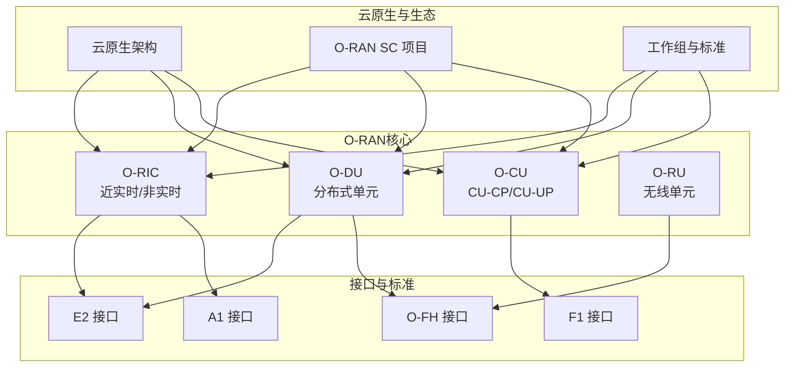
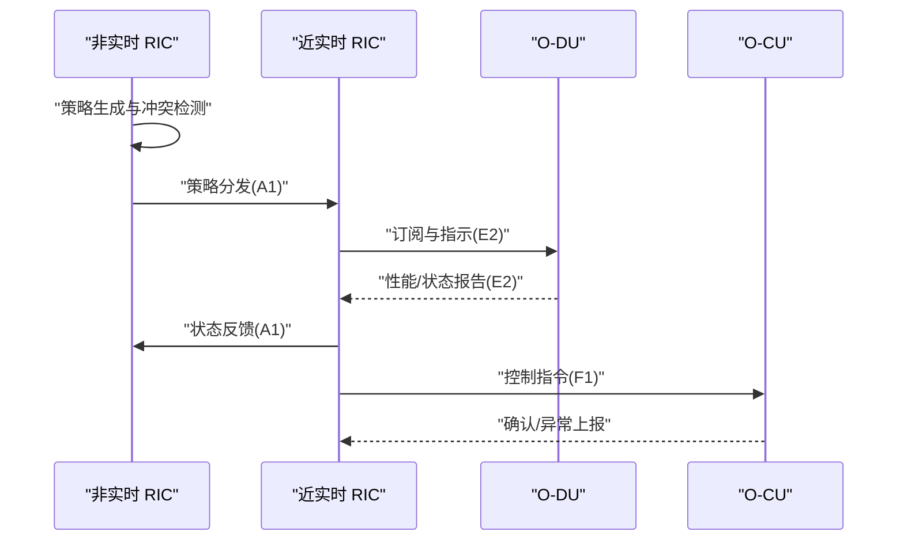
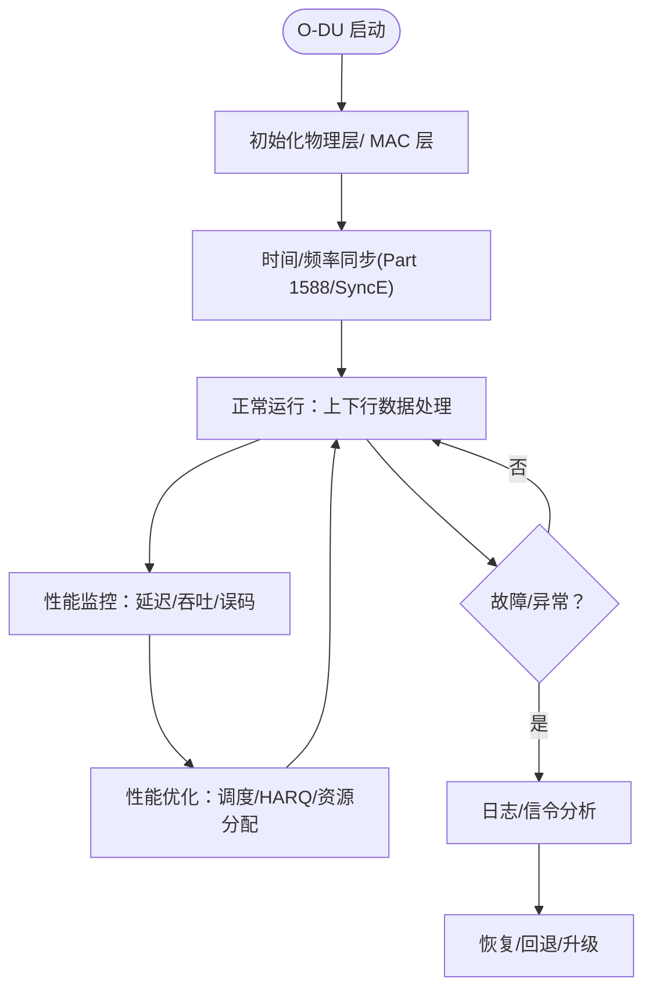
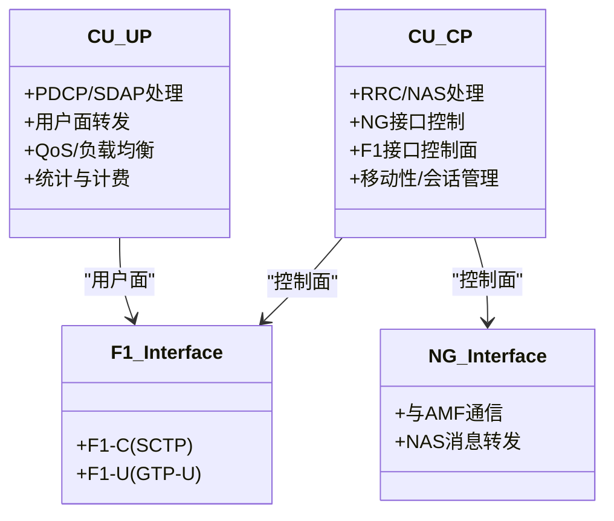
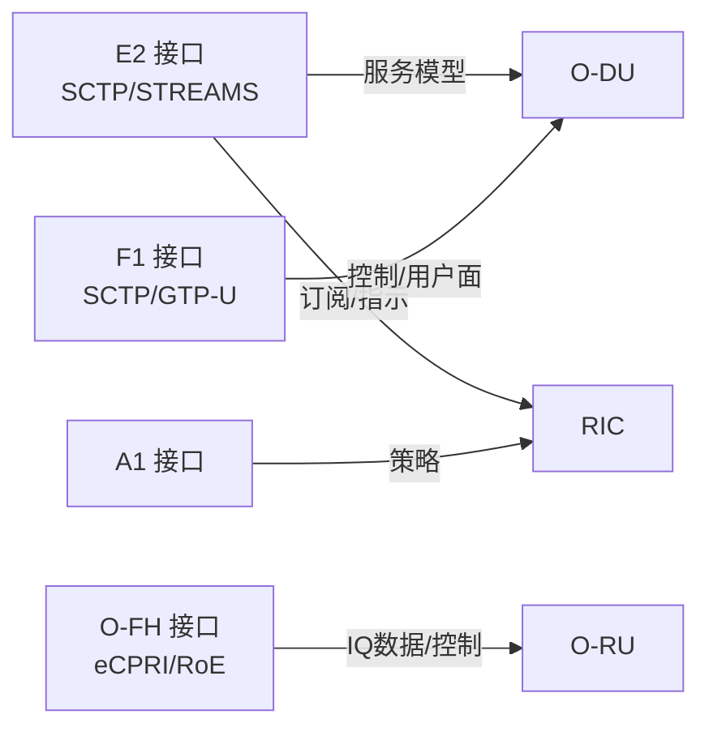
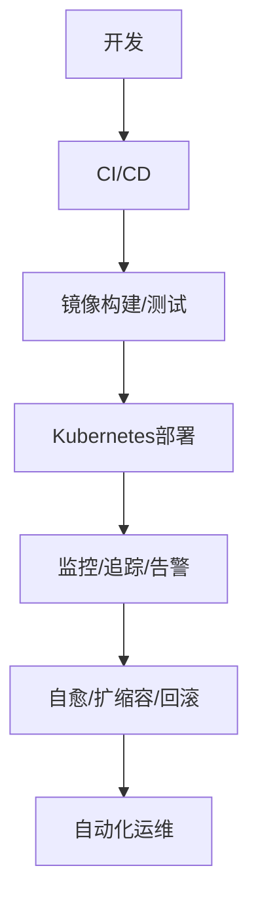
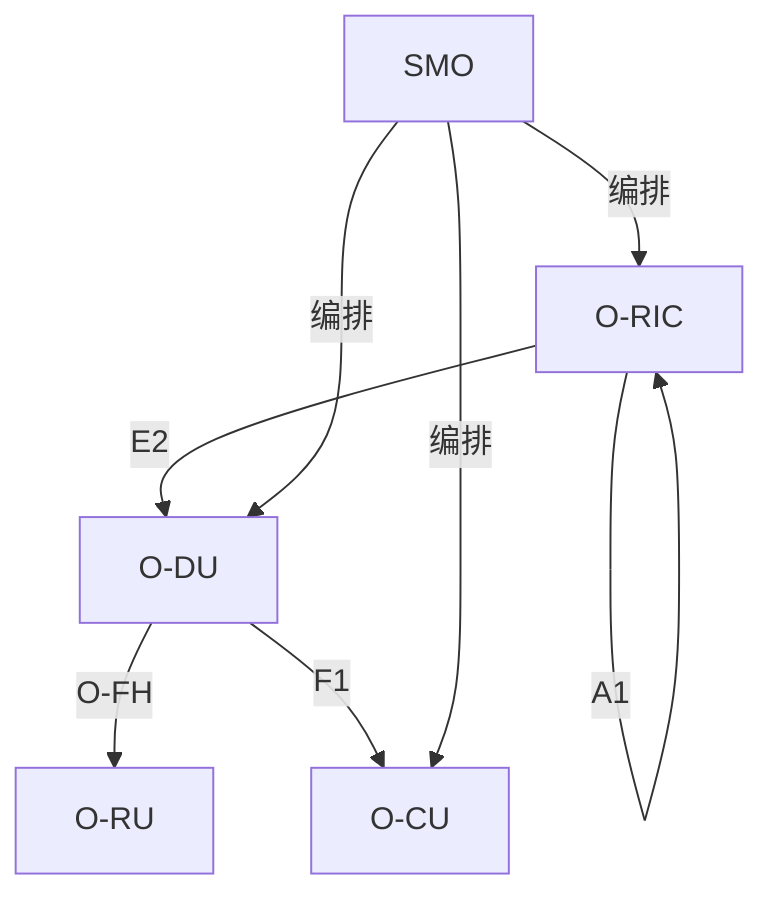
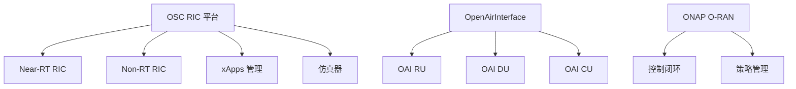

# O-RAN项目

<cite>
**本文引用的文件**
- [README.md](file://README.md)
- [oran-open-source-projects.md](file://17-open-source-ecosystem/oran-projects/oran-open-source-projects.md)
- [o-ric.md](file://02-core-components/o-ric.md)
- [o-cu.md](file://02-core-components/o-cu.md)
- [o-du.md](file://02-core-components/o-du.md)
- [e2-interface.md](file://03-interface-standards/e2-interface.md)
- [o-fh-interface.md](file://03-interface-standards/o-fh-interface.md)
- [cloud-native-architecture.md](file://05-cloud-integration/cloud-native-architecture.md)
- [readme-zh.md](file://07-ric-development/readme-zh.md)
- [contribution-guide.md](file://17-open-source-ecosystem/core-projects/contribution-guide.md)
</cite>

## 目录
1. [简介](#简介)
2. [项目结构](#项目结构)
3. [核心组件](#核心组件)
4. [架构总览](#架构总览)
5. [详细组件分析](#详细组件分析)
6. [依赖关系分析](#依赖关系分析)
7. [性能考虑](#性能考虑)
8. [故障排查指南](#故障排查指南)
9. [结论](#结论)
10. [附录](#附录)

## 简介
本指南面向希望构建完整O-RAN解决方案的工程与运维团队，系统梳理O-RAN软件社区（O-RAN SC）官方项目与生态，聚焦软件定义无线电、网络切片与边缘计算等核心能力，深入解析RIC相关开源项目（近实时RIC/Near-RT RIC与非实时RIC/Non-RT RIC）的架构、算法与应用实践，并提供O-CU与O-DU的部署配置、功能特性与性能优化方法，以及O-RU控制面与用户面的协议栈实现、硬件抽象层与性能调优策略。最后给出项目集成与兼容性要求、评估与选型原则，帮助读者在生产环境中构建稳定、可扩展、可运维的O-RAN系统。

## 项目结构
该知识库围绕“云平台运维专家向O-RAN专家转型”的主线组织，形成“架构—核心组件—接口—解耦—云原生—工作组—RIC开发—部署—标准—场景—测试—运维—未来—产业—案例—工具—国际—可持续—法律—性能—故障—监控—安全—最佳实践”的完整知识体系。核心目录与职责如下：
- 01-architecture-system：架构演进、分层架构、功能分布、O-Cloud架构、弹性伸缩
- 02-core-components：核心网元（O-RU、O-DU、O-CU/CU-CP/CU-UP、O-RIC、SMO）详解
- 03-interface-standards：接口标准（F1、O-FH、E2、A1、O1、O2、OAM）
- 04-disaggregation-options：解耦选项（8种CU/DU拆分、前传拆分、部署场景、性能影响、成本效益）
- 05-cloud-integration：云原生架构（容器编排、微服务、自动化部署、监控集成）
- 06-working-groups：O-RAN联盟工作组职责
- 07-ric-development：RIC开发与高级技术（xApps/rApps、E2/A1接口、智能算法、性能优化）
- 08-deployment-implementation：部署与实施（架构设计、硬件与基础设施、集成测试、运维管理、安全、自动化编排）
- 09-standards-compliance：标准与合规（O-RAN规范、ETSI、3GPP、多厂商集成、最佳实践）
- 10-application-scenarios：应用场景（5G eMBB/URLLC/mMTC、边缘计算、工业互联网、车联网、智慧城市、医疗）
- 17-open-source-ecosystem：开源生态（OSC项目、开发者工具、社区资源、核心项目）
- 19-talent-development：人才发展（认证体系、学习路径、培训项目）
- 20-ecosystem-partnership：生态合作（商业模式、合作伙伴、产业链分析）
- 21-case-studies：案例研究（运营商部署、垂直行业、创新案例、最佳实践）
- 22-tool-platforms：工具与平台（开发工具、管理平台、监控分析、实用程序）
- 23-international-deployment：国际部署（区域策略、本地化、跨文化管理、国际运营）
- 26-performance-optimization：性能优化（网络层、计算层、应用层、容量规划、监控工具链）
- 27-troubleshooting-diagnosis：故障排查（硬件、软件、网络、诊断工具、故障库）
- 28-monitoring-alerting：监控与告警（指标体系、告警策略、可视化）
- 29-security-threats：安全威胁（威胁分析、攻击防护、事件响应、安全工具）
- 30-best-practices：最佳实践（架构设计、部署实施、运维管理、团队协作）



**章节来源**
- [README.md](file://README.md#L1-L472)

## 核心组件
本节聚焦O-RAN三大核心网元：O-RIC（近实时/非实时）、O-DU（分布式单元）、O-CU（CU-CP/CU-UP），并简述O-RU（无线单元）与SMO（系统管理与编排）。

- O-RIC（近实时/非实时）
  - 近实时RIC（Near-RT RIC）：毫秒级控制闭环，基于E2接口与CU/DU交互，部署xApps运行环境，管理服务模型与订阅，支撑实时数据分析与控制下发。
  - 非实时RIC（Non-RT RIC）：秒级到分钟级策略管理，基于A1接口与Near-RT RIC交互，部署rApps运行环境，管理策略生命周期与冲突，提供长期优化与机器学习推理。
  - 协调与编排：跨RIC策略分发、状态同步、冲突解决、负载均衡与故障转移。
  - 技术栈：容器编排（Kubernetes）、服务网格（Istio/Linkerd）、消息队列（Kafka/RabbitMQ）、数据库（Redis/InfluxDB/PostgreSQL/MongoDB）、监控（Prometheus/Grafana）。

- O-DU（分布式单元）
  - 物理层与MAC层：下行/上行处理、调制解调、MIMO、HARQ、功率控制、CSI测量、BSR/PHR/SR处理。
  - 实时性与同步：端到端延迟要求（通常<3ms），时间同步（PTP v2纳秒级），可靠性（99.999%）。
  - 接口：F1（与O-CU）、O-FH（与O-RU）、E2（与O-RIC）。
  - 硬件与软件：多核CPU、DSP/FPGA加速、高速以太网、实时OS、流水线与缓存优化。

- O-CU（CU-CP/CU-UP）
  - CU-CP：RRC/NAS、NG接口、F1接口控制面、移动性与会话管理。
  - CU-UP：PDCP/SDAP、用户面转发、QoS与负载均衡、统计与计费。
  - 接口：NG（与AMF）、F1（与DU）、E1（CU-CP/CU-UP）、Xn（gNB间）。
  - 部署：集中式/分布式/混合部署，容器化与微服务。

- O-RU（无线单元）
  - 控制面：RRC/NAS、移动性、安全、QoS。
  - 用户面：PDCP/SDAP、QoS流映射、端到端QoS保障。
  - 前传：O-FH接口（eCPRI/RoE），同步（PTP/SyncE）。

- SMO（系统管理与编排）
  - 管理与编排：跨域资源编排、服务生命周期管理、多厂商协同、自动化与可观测性。

**章节来源**
- [o-ric.md](file://02-core-components/o-ric.md#L1-L437)
- [o-du.md](file://02-core-components/o-du.md#L1-L415)
- [o-cu.md](file://02-core-components/o-cu.md#L1-L419)

## 架构总览
O-RAN通过软硬解耦与功能虚拟化，实现控制面与用户面分离、DU与RU前传接口标准化、RIC智能化编排与xApps/rApps生态。云原生技术贯穿部署与运维，支撑弹性、可观测与自动化。

```mermaid
graph TB
subgraph "控制面"
AMF["AMF"]
CU_CP["CU-CP"]
RIC_RT["近实时 RIC"]
RIC_NRT["非实时 RIC"]
end
subgraph "用户面"
CU_UP["CU-UP"]
DU["O-DU"]
RU["O-RU"]
end
subgraph "接口"
F1["F1 接口"]
E2["E2 接口"]
FH["O-FH 接口"]
A1["A1 接口"]
end
AMF --> CU_CP
CU_CP <- --> CU_UP
CU_CP --> F1
CU_UP --> F1
DU --> F1
DU --> E2
DU --> FH
RIC_RT --> E2
RIC_RT --> RIC_NRT
RIC_NRT --> A1
RU --> FH
```

**图表来源**
- [o-ric.md](file://02-core-components/o-ric.md#L75-L133)
- [o-cu.md](file://02-core-components/o-cu.md#L101-L121)
- [o-du.md](file://02-core-components/o-du.md#L68-L86)

**章节来源**
- [cloud-native-architecture.md](file://05-cloud-integration/cloud-native-architecture.md#L65-L122)

## 详细组件分析

### RIC（近实时/非实时）架构与应用
- 近实时RIC（Near-RT RIC）
  - 实时控制闭环（<10ms）、E2接口服务模型、xApps生命周期管理、消息路由与状态监控。
  - 部署：Kubernetes容器化、服务网格、消息队列、时序/关系数据库、Prometheus/Grafana。
- 非实时RIC（Non-RT RIC）
  - 策略管理（<1s）、A1接口、rApps生命周期、数据分析与机器学习推理、Spark/Flink、TensorFlow/PyTorch。
- 协调与编排：跨RIC策略分发、状态同步、冲突检测与解决、负载均衡与故障转移。
- 应用：xApps（负载均衡、干扰抑制、节能）、rApps（流量分析、预测、长期优化）。



**图表来源**
- [o-ric.md](file://02-core-components/o-ric.md#L33-L72)
- [e2-interface.md](file://03-interface-standards/e2-interface.md#L49-L62)
- [o-fh-interface.md](file://03-interface-standards/o-fh-interface.md#L25-L41)

**章节来源**
- [o-ric.md](file://02-core-components/o-ric.md#L1-L437)
- [readme-zh.md](file://07-ric-development/readme-zh.md#L1-L340)

### O-DU：物理层与MAC层、实时性与同步
- 物理层：下行/上行处理、调制映射、MIMO、参考信号、功率控制、干扰抑制。
- MAC层：随机接入、调度、HARQ、BSR/PHR/SR处理。
- 实时性：端到端延迟<3ms，PTP v2纳秒级同步，可靠性99.999%。
- 接口：F1（控制面/用户面）、O-FH（eCPRI/RoE）、E2（服务化）。
- 硬件：多核CPU、DSP/FPGA、高速以太网、冗余电源与散热。
- 软件：实时OS、功能模块化、并行与流水线优化、缓存与内存管理。



**图表来源**
- [o-du.md](file://02-core-components/o-du.md#L51-L66)
- [o-fh-interface.md](file://03-interface-standards/o-fh-interface.md#L42-L57)

**章节来源**
- [o-du.md](file://02-core-components/o-du.md#L1-L415)
- [o-fh-interface.md](file://03-interface-standards/o-fh-interface.md#L1-L397)

### O-CU：CU-CP/CU-UP分离与接口
- CU-CP：RRC/NAS、NG接口、F1接口控制面、移动性与会话管理。
- CU-UP：PDCP/SDAP、用户面转发、QoS与负载均衡、统计与计费。
- 接口：NG（SCTP）、F1（F1-C/GTP-U）、E1（SCTP）、Xn（gNB间）。
- 部署：集中式/分布式/混合部署，容器化与微服务。



**图表来源**
- [o-cu.md](file://02-core-components/o-cu.md#L82-L121)

**章节来源**
- [o-cu.md](file://02-core-components/o-cu.md#L1-L419)

### 接口标准与协议栈
- E2接口（SCTP/STREAMS）：服务化架构、服务发现/调用、事件通知、订阅管理、E2SM/E2AP。
- O-FH接口（eCPRI/RoE）：用户平面IQ数据传输、RU控制/管理、PTP/SyncE同步、链路聚合与冗余。
- A1接口：策略生命周期管理、冲突检测与解决、策略分发与状态反馈。
- F1接口：NG与DU之间的控制面/用户面分离，SCTP/GTP-U。



**图表来源**
- [e2-interface.md](file://03-interface-standards/e2-interface.md#L33-L98)
- [o-fh-interface.md](file://03-interface-standards/o-fh-interface.md#L61-L116)

**章节来源**
- [e2-interface.md](file://03-interface-standards/e2-interface.md#L1-L337)
- [o-fh-interface.md](file://03-interface-standards/o-fh-interface.md#L1-L397)

### 云原生与自动化
- 容器化与微服务：Kubernetes编排、服务网格、HPA/VPA、GitOps。
- 自动化：CI/CD流水线、基础设施即代码（Terraform/Ansible）、自动化测试与故障恢复。
- 监控与可观测性：Prometheus/Grafana/Jaeger、端到端业务监控、AI驱动异常检测与根因分析。
- 安全：零信任、mTLS、RBAC、Secrets管理、审计与合规。



**图表来源**
- [cloud-native-architecture.md](file://05-cloud-integration/cloud-native-architecture.md#L221-L233)

**章节来源**
- [cloud-native-architecture.md](file://05-cloud-integration/cloud-native-architecture.md#L1-L481)

## 依赖关系分析
- 组件耦合与内聚：O-DU与O-RU通过O-FH强耦合（eCPRI/RoE与PTP/SyncE），O-DU与O-CU通过F1接口耦合，O-RIC通过E2/A1接口与DU/CU交互。
- 外部依赖：SCTP/STREAMS（E2）、以太网（O-FH/F1）、PTP/SyncE（同步）、Kubernetes/服务网格（云原生）。
- 集成点：SMO负责跨域编排与治理，ONAP等可作为控制闭环与策略管理的补充。



**图表来源**
- [o-ric.md](file://02-core-components/o-ric.md#L59-L71)
- [o-fh-interface.md](file://03-interface-standards/o-fh-interface.md#L98-L116)
- [o-cu.md](file://02-core-components/o-cu.md#L101-L121)

**章节来源**
- [o-ric.md](file://02-core-components/o-ric.md#L1-L437)
- [o-fh-interface.md](file://03-interface-standards/o-fh-interface.md#L1-L397)
- [o-cu.md](file://02-core-components/o-cu.md#L1-L419)

## 性能考虑
- O-DU：物理层与MAC层参数优化（MCS、MIMO、HARQ、调度）、资源分配与缓存优化、网络QoS与低延迟队列、同步精度与稳定性。
- O-CU：信令处理优化、缓存与数据库访问优化、用户面DPDK加速、负载均衡与QoS保障。
- RIC：E2/A1消息批处理、连接池与异步处理、xApps/rApps资源隔离与性能监控、策略冲突检测与自动解决。
- 云原生：容器资源预留与亲和性、网络SR-IOV/DPDK、存储本地化与高性能卷、HPA/VPA与弹性扩缩容。

**章节来源**
- [o-du.md](file://02-core-components/o-du.md#L289-L307)
- [o-cu.md](file://02-core-components/o-cu.md#L264-L281)
- [o-ric.md](file://02-core-components/o-ric.md#L283-L300)
- [cloud-native-architecture.md](file://05-cloud-integration/cloud-native-architecture.md#L123-L176)

## 故障排查指南
- O-DU：物理层/MAC层故障、接口故障（F1/O-FH）、同步异常、硬件故障；通过告警关联、日志与性能分析、信令与测试验证定位与恢复。
- O-CU：信令/接口故障、性能劣化、资源不足；通过信令分析、配置一致性校验、资源扩容与回退。
- RIC：E2/A1接口故障、应用异常、资源不足；通过接口状态监控、服务调用成功率与响应时间、应用生命周期管理与回滚。
- 通用：建立分级告警、告警抑制与自动化、配置基线与备份、定期演练与知识库沉淀。

**章节来源**
- [o-du.md](file://02-core-components/o-du.md#L224-L287)
- [o-cu.md](file://02-core-components/o-cu.md#L197-L263)
- [o-ric.md](file://02-core-components/o-ric.md#L214-L282)

## 结论
O-RAN通过软硬解耦与云原生技术，实现灵活、高效、智能的无线接入网络。以O-RIC为核心，结合E2/A1接口与xApps/rApps生态，配合O-DU/O-CU/O-RU的标准化接口与协议栈，可在边缘计算与网络切片场景中实现低时延、高可靠与智能化运营。生产实践中应重视实时性与可靠性、云原生弹性与可观测性、安全与合规，以及多厂商互操作与自动化运维。

## 附录

### 开源项目与使用指南
- OSC RIC平台：提供Near-RT/Non-RT RIC、xApps/rApps管理框架、仿真器与基准测试脚本，支持容器化与Kubernetes部署。
- OAI RAN：OAI RU/DU/CU实现，支持多种硬件平台与ecpri协议，提供构建与测试流程。
- ONAP O-RAN：与ONAP集成的控制闭环与策略管理模块，支持自动化控制与策略下发。



**图表来源**
- [oran-open-source-projects.md](file://17-open-source-ecosystem/oran-projects/oran-open-source-projects.md#L10-L58)
- [oran-open-source-projects.md](file://17-open-source-ecosystem/oran-projects/oran-open-source-projects.md#L100-L145)
- [oran-open-source-projects.md](file://17-open-source-ecosystem/oran-projects/oran-open-source-projects.md#L147-L194)

**章节来源**
- [oran-open-source-projects.md](file://17-open-source-ecosystem/oran-projects/oran-open-source-projects.md#L1-L716)

### 项目评估与选型原则
- 技术成熟度：接口实现（E2/A1/F1/O-FH）、协议栈完备性、xApps/rApps生态、基准测试结果。
- 社区活跃度：贡献者数量、提交频率、文档与示例质量、社区讨论热度。
- 商业支持：厂商支持与认证、产品化程度、服务与培训资源。
- 兼容性与互操作：多厂商互通、标准符合性、Plugfest参与与测试报告。
- 部署与运维：容器化与云原生支持、自动化与可观测性、安全与合规能力。

**章节来源**
- [oran-open-source-projects.md](file://17-open-source-ecosystem/oran-projects/oran-open-source-projects.md#L196-L211)

### 贡献指南与社区参与
- 贡献流程：Fork→功能分支→代码→单元测试→本地验证→代码审查→CI检查→合并→文档与发布说明。
- 代码规范：遵循PEP8（Python示例）、清晰的提交信息、模块化与可维护性。
- 社区参与：邮件列表、工作组会议、在线技术分享、社区技术论坛。

**章节来源**
- [contribution-guide.md](file://17-open-source-ecosystem/core-projects/contribution-guide.md#L1-L113)