# 开发者工具

<cite>
**本文引用的文件**
- [O-RAN 开发者工具与 SDK](file://17-open-source-ecosystem/developer-tools/oran-development-tools.md)
- [O-RAN 开发工具包](file://22-tool-platforms/development-tools/o-ran-development-toolkit.md)
- [O-RAN 测试工具与框架](file://13-testing-validation/testing-tools/testing-tools-frameworks.md)
- [O-RAN 监控系统](file://22-tool-platforms/monitoring-systems/o-ran-monitoring-systems.md)
- [O-RAN 运维监控与告警系统](file://14-operations-management/monitoring-alerting/operations-monitoring-framework.md)
- [O-RAN 管理平台](file://22-tool-platforms/management-platforms/o-ran-management-platforms.md)
- [O-RAN 故障处理与排障指南](file://14-operations-management/fault-handling/fault-troubleshooting-guide.md)
- [O-RAN 一致性测试](file://13-testing-validation/conformance-testing/o-ran-conformance-testing.md)
- [O-RAN 工具程序集](file://22-tool-platforms/utility-programs/o-ran-utility-programs.md)
</cite>

## 目录
1. [简介](#简介)
2. [项目结构](#项目结构)
3. [核心组件](#核心组件)
4. [架构总览](#架构总览)
5. [详细组件分析](#详细组件分析)
6. [依赖关系分析](#依赖关系分析)
7. [性能考量](#性能考量)
8. [故障排查指南](#故障排查指南)
9. [结论](#结论)
10. [附录](#附录)

## 简介
本指南面向 O-RAN 开发者，系统梳理并讲解 O-RAN 开发工具链：从开发环境与 IDE 配置、SDK 与 API 框架集成、网络模拟与测试工具、CI/CD 流水线到监控与调试工具，并给出运维与排障建议。目标是帮助团队快速建立高效、可维护、可扩展的 O-RAN 开发与交付体系。

## 项目结构
该仓库以主题域划分，开发者工具相关内容主要分布在以下目录：
- 开发工具与 SDK：17-open-source-ecosystem/developer-tools
- 开发工具包（含 CI/CD、容器与 Helm、协议测试）：22-tool-platforms/development-tools
- 测试与验证：13-testing-validation/testing-tools 与 conformance-testing
- 监控与可视化：22-tool-platforms/monitoring-systems 与 14-operations-management/monitoring-alerting
- 管理平台与自动化：22-tool-platforms/management-platforms
- 运维与排障：14-operations-management/fault-handling
- 工具程序集：22-tool-platforms/utility-programs

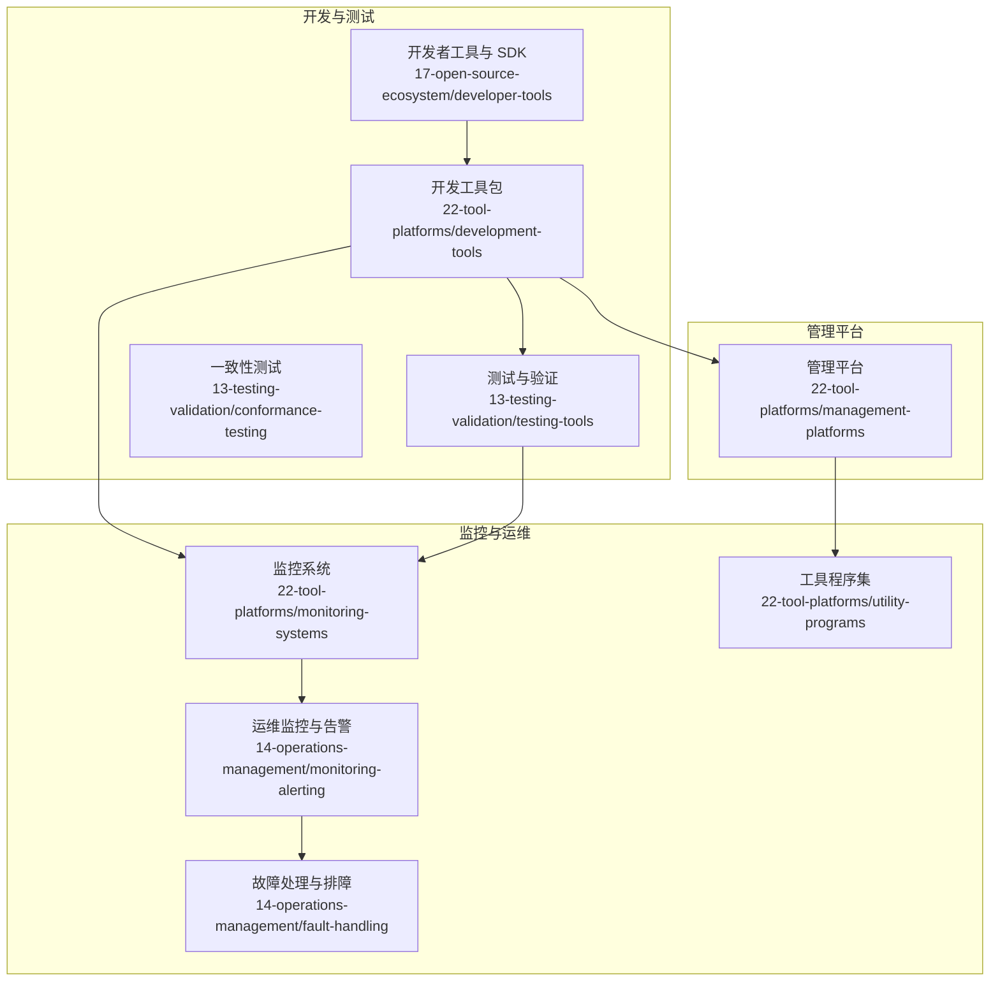

**图表来源**
- [O-RAN 开发者工具与 SDK](file://17-open-source-ecosystem/developer-tools/oran-development-tools.md#L1-L994)
- [O-RAN 开发工具包](file://22-tool-platforms/development-tools/o-ran-development-toolkit.md#L1-L488)
- [O-RAN 测试工具与框架](file://13-testing-validation/testing-tools/testing-tools-frameworks.md#L1-L598)
- [O-RAN 监控系统](file://22-tool-platforms/monitoring-systems/o-ran-monitoring-systems.md#L1-L545)
- [O-RAN 运维监控与告警系统](file://14-operations-management/monitoring-alerting/operations-monitoring-framework.md#L1-L909)
- [O-RAN 管理平台](file://22-tool-platforms/management-platforms/o-ran-management-platforms.md#L1-L711)
- [O-RAN 故障处理与排障指南](file://14-operations-management/fault-handling/fault-troubleshooting-guide.md#L1-L633)
- [O-RAN 工具程序集](file://22-tool-platforms/utility-programs/o-ran-utility-programs.md#L1-L628)

**章节来源**
- [O-RAN 开发者工具与 SDK](file://17-open-source-ecosystem/developer-tools/oran-development-tools.md#L1-L994)
- [O-RAN 开发工具包](file://22-tool-platforms/development-tools/o-ran-development-toolkit.md#L1-L488)

## 核心组件
- 开发环境与 IDE：容器化开发环境、VS Code/PyCharm 推荐扩展与设置、Python 环境与依赖、预提交钩子、项目模板
- SDK 与 API：OpenAPI/Swagger 规范、REST/GraphQL/gRPC 接口设计原则、Postman/Newman、消费者驱动契约（Pact）
- 测试与验证：自动化测试框架（PyTest）、协议分析（Wireshark 插件）、容器化测试环境、性能基准与回归测试
- 网络模拟与仿真：基于 Python 的 O-RAN 网络模拟器、NS-3 扩展与 eCPRI/FRONTHAUL 模型
- CI/CD：GitHub Actions 工作流、Trivy 安全扫描、Helm Chart、GitOps（ArgoCD）、基础设施即代码（Terraform）
- 监控与可视化：Prometheus/Grafana、ELK 日志栈、实时日志分析、根因分析与智能告警
- 运维与排障：健康检查脚本、故障分类与诊断流程、E2/F1/O-FH 排障步骤、预测性维护
- 工具程序集：配置管理（YANG/NETCONF）、指标采集、日志处理、集群编排与备份恢复

**章节来源**
- [O-RAN 开发者工具与 SDK](file://17-open-source-ecosystem/developer-tools/oran-development-tools.md#L8-L994)
- [O-RAN 开发工具包](file://22-tool-platforms/development-tools/o-ran-development-toolkit.md#L1-L488)
- [O-RAN 测试工具与框架](file://13-testing-validation/testing-tools/testing-tools-frameworks.md#L1-L598)
- [O-RAN 监控系统](file://22-tool-platforms/monitoring-systems/o-ran-monitoring-systems.md#L1-L545)
- [O-RAN 运维监控与告警系统](file://14-operations-management/monitoring-alerting/operations-monitoring-framework.md#L1-L909)
- [O-RAN 管理平台](file://22-tool-platforms/management-platforms/o-ran-management-platforms.md#L1-L711)
- [O-RAN 故障处理与排障指南](file://14-operations-management/fault-handling/fault-troubleshooting-guide.md#L1-L633)
- [O-RAN 工具程序集](file://22-tool-platforms/utility-programs/o-ran-utility-programs.md#L1-L628)

## 架构总览
下图展示从“开发—测试—仿真—部署—监控—排障”的端到端工具链架构，强调各组件间的依赖与交互。

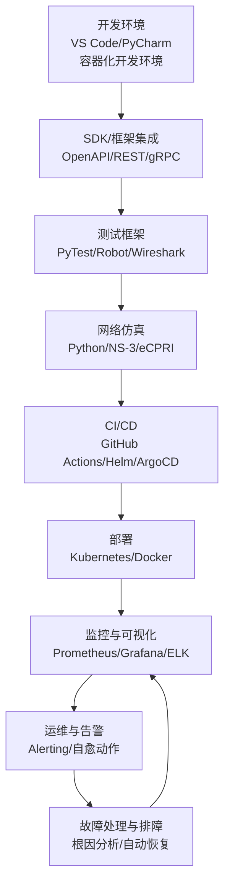

**图表来源**
- [O-RAN 开发者工具与 SDK](file://17-open-source-ecosystem/developer-tools/oran-development-tools.md#L8-L994)
- [O-RAN 开发工具包](file://22-tool-platforms/development-tools/o-ran-development-toolkit.md#L1-L488)
- [O-RAN 测试工具与框架](file://13-testing-validation/testing-tools/testing-tools-frameworks.md#L1-L598)
- [O-RAN 监控系统](file://22-tool-platforms/monitoring-systems/o-ran-monitoring-systems.md#L1-L545)
- [O-RAN 运维监控与告警系统](file://14-operations-management/monitoring-alerting/operations-monitoring-framework.md#L1-L909)
- [O-RAN 故障处理与排障指南](file://14-operations-management/fault-handling/fault-troubleshooting-guide.md#L1-L633)

## 详细组件分析

### 开发环境与 IDE 配置
- 容器化开发环境：包含 Dockerfile、Docker Compose、VS Code Server、常用工具链（Go/Node.js/Python）、端口暴露与默认命令
- 开发环境初始化脚本：系统资源检查、基础依赖安装、Python 虚拟环境、O-RAN 特定工具安装、IDE 扩展推荐、Git 钩子与项目模板生成
- IDE 推荐扩展与设置：VS Code 扩展清单、PyCharm 代码风格与模板、YAML/Proto 文件关联、Kubernetes 配置校验

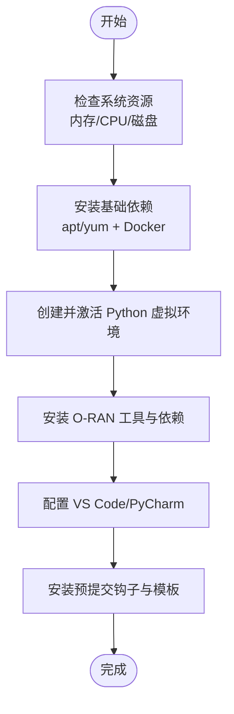

**图表来源**
- [O-RAN 开发者工具与 SDK](file://17-open-source-ecosystem/developer-tools/oran-development-tools.md#L86-L413)

**章节来源**
- [O-RAN 开发者工具与 SDK](file://17-open-source-ecosystem/developer-tools/oran-development-tools.md#L8-L413)

### SDK 与 API 框架集成
- OpenAPI/Swagger 设计：资源命名、HTTP 方法语义、响应格式标准化
- REST/GraphQL/gRPC：接口设计原则、错误响应结构、分页与排序参数、HATEOAS
- API 测试：Postman 集合、Newman 命令行、编程语言客户端（Python/Go/JS/Java）、契约测试（Pact）

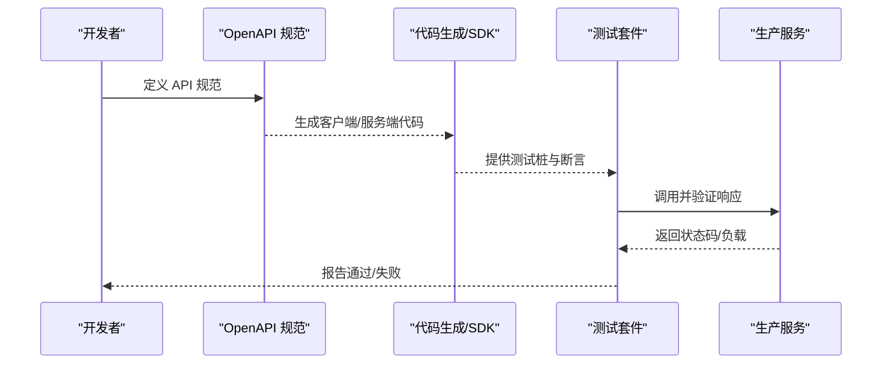

**图表来源**
- [O-RAN 开发工具包](file://22-tool-platforms/development-tools/o-ran-development-toolkit.md#L259-L366)

**章节来源**
- [O-RAN 开发工具包](file://22-tool-platforms/development-tools/o-ran-development-toolkit.md#L259-L366)

### 测试与验证工具
- 自动化测试框架：PyTest 基础类、测试用例组织、断言与性能阈值
- 网络仿真：Python 网络模拟器，节点类型、连接拓扑、流量模拟与指标更新
- 协议分析：Wireshark 插件与配置、E2AP/eCPRI/O1 解析器、抓包与统计
- 容器化测试：Dockerfile、Kubernetes 部署与 ConfigMap、CI 流水线

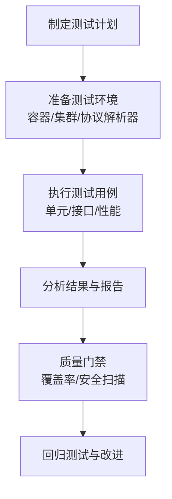

**图表来源**
- [O-RAN 测试工具与框架](file://13-testing-validation/testing-tools/testing-tools-frameworks.md#L364-L418)

**章节来源**
- [O-RAN 测试工具与框架](file://13-testing-validation/testing-tools/testing-tools-frameworks.md#L1-L598)

### 网络模拟与仿真
- Python 网络模拟器：节点模型、连接管理、流量模拟、指标聚合与导出
- NS-3 扩展：PHY 层波形、eCPRI 延迟抖动、QoS 建模、RIC 功能仿真
- 协议测试：Wireshark 自定义过滤器与解码器，显示过滤器与性能统计

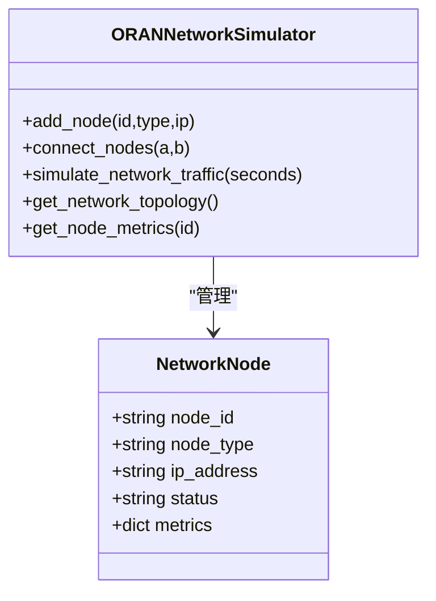

**图表来源**
- [O-RAN 测试工具与框架](file://13-testing-validation/testing-tools/testing-tools-frameworks.md#L648-L797)

**章节来源**
- [O-RAN 测试工具与框架](file://13-testing-validation/testing-tools/testing-tools-frameworks.md#L646-L797)

### CI/CD 流水线工具
- GitHub Actions：Python 环境、代码质量检查（Black/Flake8/安全扫描）、单元/集成测试、构建镜像、Trivy 安全扫描、上传 SARIF
- Helm Chart：多阶段构建、运行时最小化、健康检查、调试阶段
- GitOps（ArgoCD）：应用配置、同步策略、忽略差异、通知渠道
- 基础设施即代码（Terraform）：多云集群、网络安全组、子网与安全策略

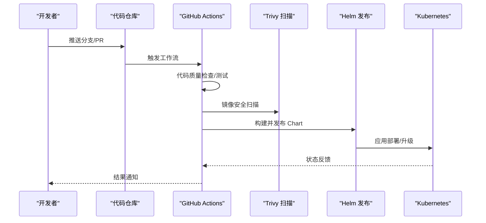

**图表来源**
- [O-RAN 开发工具包](file://22-tool-platforms/development-tools/o-ran-development-toolkit.md#L419-L486)

**章节来源**
- [O-RAN 开发工具包](file://22-tool-platforms/development-tools/o-ran-development-toolkit.md#L419-L486)

### 监控与调试工具
- Prometheus 指标收集：节点/存储/网络/应用层指标、告警规则、Token 认证
- Grafana 可视化：仪表板面板、热力图、单值图、告警联动
- ELK 日志：Filebeat/Logstash/Elasticsearch、Grok 模式、索引生命周期、告警路由
- 实时日志分析：Kafka 流处理、异常检测、根因分析、预测性维护

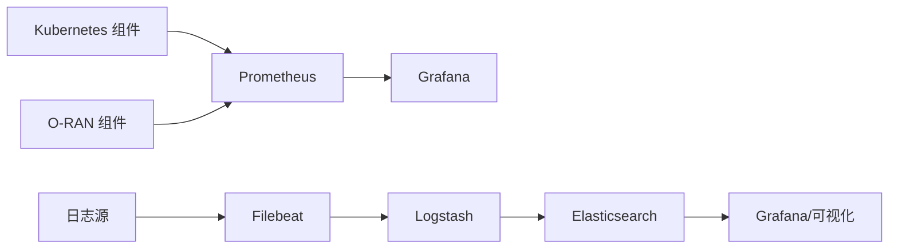

**图表来源**
- [O-RAN 监控系统](file://22-tool-platforms/monitoring-systems/o-ran-monitoring-systems.md#L10-L211)
- [O-RAN 运维监控与告警系统](file://14-operations-management/monitoring-alerting/operations-monitoring-framework.md#L46-L260)

**章节来源**
- [O-RAN 监控系统](file://22-tool-platforms/monitoring-systems/o-ran-monitoring-systems.md#L1-L545)
- [O-RAN 运维监控与告警系统](file://14-operations-management/monitoring-alerting/operations-monitoring-framework.md#L1-L909)

### 运维与排障工具
- 健康检查：K8s 节点/Pod 状态、接口连通性、FRONTHAUL 链路质量
- 故障分类与诊断：症状识别、依赖图、相关性分析、影响评估
- 自动化恢复：E2/F1/O-FH 接口自动恢复脚本、重试与超时策略
- 预测性维护：异常检测模型、剩余寿命估计、预防性维护建议

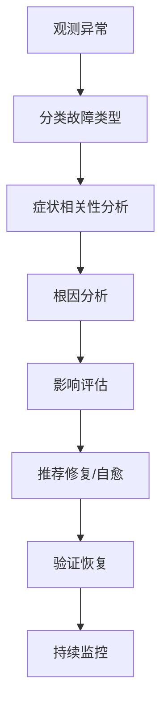

**图表来源**
- [O-RAN 故障处理与排障指南](file://14-operations-management/fault-handling/fault-troubleshooting-guide.md#L100-L180)
- [O-RAN 工具程序集](file://22-tool-platforms/utility-programs/o-ran-utility-programs.md#L434-L561)

**章节来源**
- [O-RAN 故障处理与排障指南](file://14-operations-management/fault-handling/fault-troubleshooting-guide.md#L1-L633)
- [O-RAN 工具程序集](file://22-tool-platforms/utility-programs/o-ran-utility-programs.md#L1-L628)

## 依赖关系分析
- 组件耦合：开发工具链与测试框架强耦合；CI/CD 与 Helm/ArgoCD 强耦合；监控系统与 Prometheus/Grafana/ELK 强耦合
- 外部依赖：容器运行时、Kubernetes、Helm、GitOps、Trivy、Wireshark 插件、NS-3 扩展
- 循环依赖：未发现直接循环；监控与排障形成闭环反馈

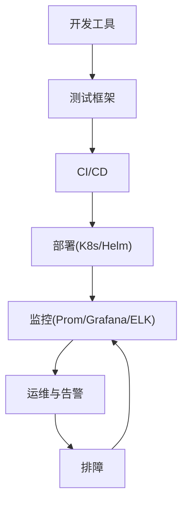

**图表来源**
- [O-RAN 开发工具包](file://22-tool-platforms/development-tools/o-ran-development-toolkit.md#L1-L488)
- [O-RAN 监控系统](file://22-tool-platforms/monitoring-systems/o-ran-monitoring-systems.md#L1-L545)
- [O-RAN 运维监控与告警系统](file://14-operations-management/monitoring-alerting/operations-monitoring-framework.md#L1-L909)

**章节来源**
- [O-RAN 开发工具包](file://22-tool-platforms/development-tools/o-ran-development-toolkit.md#L1-L488)
- [O-RAN 监控系统](file://22-tool-platforms/monitoring-systems/o-ran-monitoring-systems.md#L1-L545)
- [O-RAN 运维监控与告警系统](file://14-operations-management/monitoring-alerting/operations-monitoring-framework.md#L1-L909)

## 性能考量
- 指标采集频率与保留策略：Prometheus 抓取间隔、告警去噪、长期存储与压缩
- 日志处理吞吐：Filebeat/Logstash 并行度、Grok 模式优化、索引分层
- 测试与仿真开销：仿真时长与并发、抓包与解析的资源占用、容器镜像大小与启动时间
- CI/CD 并行化：任务拆分、缓存与制品复用、并行作业与资源池

[本节为通用指导，不直接分析具体文件]

## 故障排查指南
- E2 接口：连通性、证书与安全、配置参数、重启与超时调整
- F1 接口：性能指标、资源利用、流量分析、网络与缓冲区调优、分片选项优化
- O-FH 同步：PTP 同步、硬件时间戳、信号质量、时钟源稳定与补偿
- 自动化恢复：按组件分类的恢复脚本、重试与超时、健康检查与告警联动

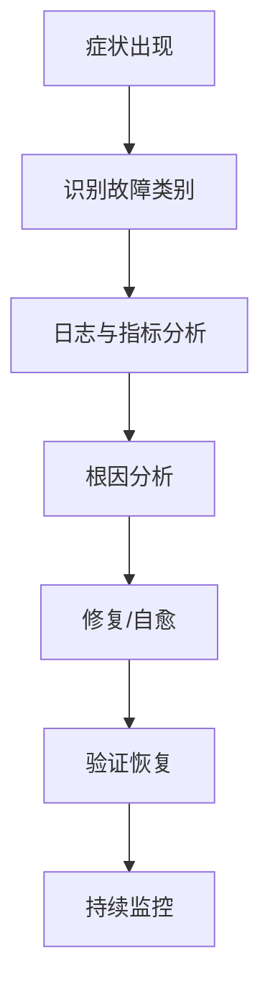

**图表来源**
- [O-RAN 故障处理与排障指南](file://14-operations-management/fault-handling/fault-troubleshooting-guide.md#L35-L98)

**章节来源**
- [O-RAN 故障处理与排障指南](file://14-operations-management/fault-handling/fault-troubleshooting-guide.md#L1-L633)

## 结论
本指南提供了 O-RAN 开发工具链的全景视图：从开发环境、SDK/API 集成、测试与仿真，到 CI/CD、监控与运维，再到排障与工具程序集。建议团队结合项目规模与风险偏好，选择合适的工具组合与流程，逐步建立标准化、自动化、可观测的 O-RAN 开发生态。

[本节为总结性内容，不直接分析具体文件]

## 附录

### 工具选择与配置决策指引
- 开发环境：优先容器化开发环境，统一工具链与依赖；IDE 选择与团队习惯一致
- SDK/API：以 OpenAPI 为中心，配套契约测试与客户端生成；接口设计遵循 REST 原则
- 测试：以 PyTest 为主，结合 Wireshark 协议分析与容器化测试；建立回归与性能基线
- 仿真：小规模用 Python 模拟器，大规模用 NS-3 扩展；关注 eCPRI/FRONTHAUL 模型
- CI/CD：以 GitHub Actions 为基础，集成 Trivy 安全扫描与 Helm 发布；GitOps 保障一致性
- 监控：Prometheus + Grafana + ELK；建立告警分级与去噪策略
- 运维：健康检查与自动化恢复脚本；根因分析与预测性维护

[本节为通用指导，不直接分析具体文件]