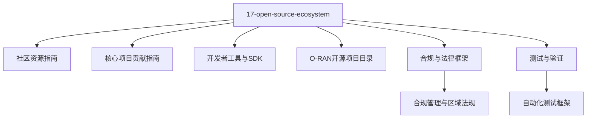
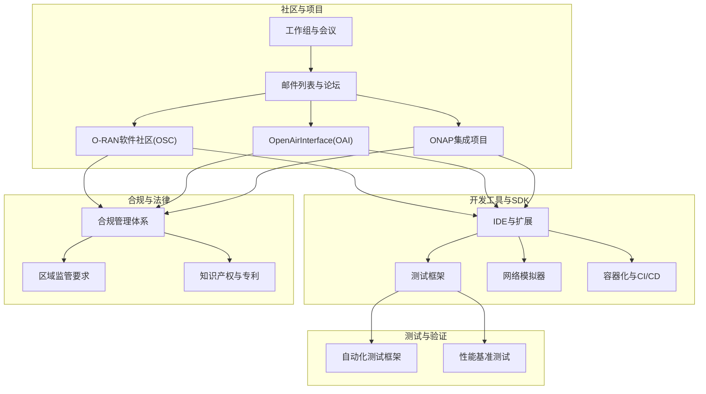
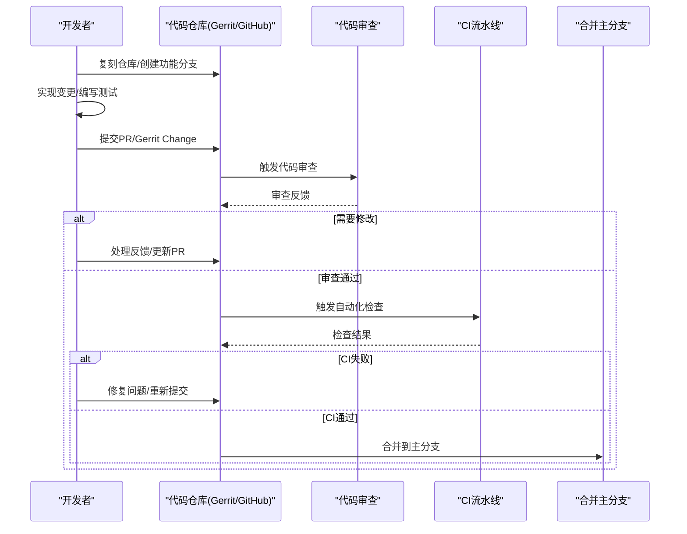
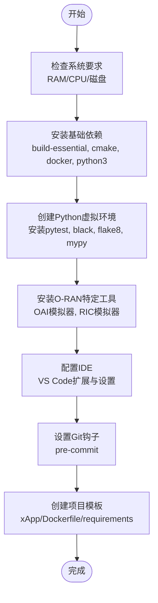
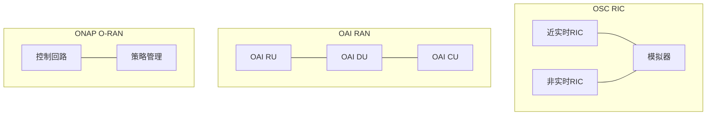
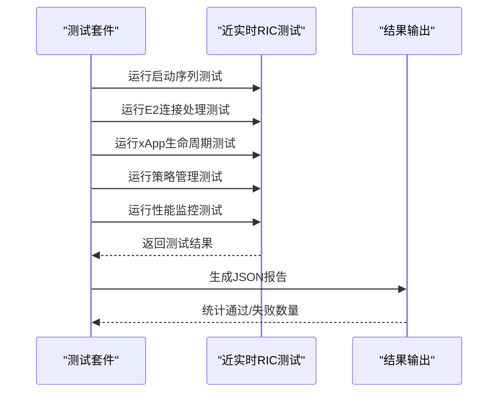
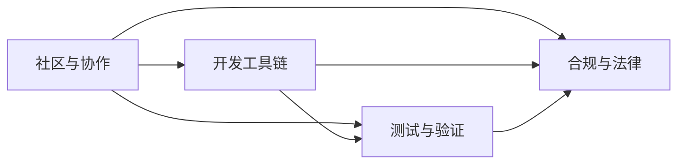

# 开源生态系统

<cite>
**本文引用的文件**
- [开源生态指南（中文）](file://17-open-source-ecosystem/readme-zh.md)
- [社区资源指南（中文）](file://17-open-source-ecosystem/community-resources/open-source-community-guide-zh.md)
- [核心项目贡献指南](file://17-open-source-ecosystem/core-projects/contribution-guide.md)
- [开发者工具与SDK（中文）](file://17-open-source-ecosystem/developer-tools/oran-development-tools-zh.md)
- [O-RAN开源项目目录（中文）](file://17-open-source-ecosystem/oran-projects/oran-open-source-projects-zh.md)
- [O-RAN术语表](file://comprehensive-oran-glossary.md)
- [O-RAN专利表](file://comprehensive-oran-patent-table.md)
- [O-RAN合规与法律框架（中文）](file://25-legal-regulations/readme-zh.md)
- [O-RAN测试与验证自动化框架（中文）](file://13-testing-validation/automation-framework/test-automation-framework.md)
</cite>

## 目录
1. [简介](#简介)
2. [项目结构](#项目结构)
3. [核心组件](#核心组件)
4. [架构总览](#架构总览)
5. [详细组件分析](#详细组件分析)
6. [依赖关系分析](#依赖关系分析)
7. [性能考量](#性能考量)
8. [故障排查指南](#故障排查指南)
9. [结论](#结论)
10. [附录](#附录)

## 简介
本指南面向O-RAN开源生态的参与者，提供从社区资源、核心项目、开发者工具到合规与评估的全景式指导。内容覆盖：
- 社区资源与协作平台、邮件列表与实时沟通渠道
- 主要开源项目（OSC RIC、OAI RAN、ONAP O-RAN）的功能特性、技术架构与贡献方式
- 开发者工具链（IDE、测试框架、模拟器、容器化与CI/CD）
- 参与方式（代码贡献、文档改进、问题报告、社区交流）
- 许可证、知识产权与合规要求
- 项目评估与选择原则

## 项目结构
本仓库围绕“O-RAN开源生态”形成专题化知识库，其中“17-open-source-ecosystem”是核心章节，包含：
- 社区资源与贡献流程
- 开发者工具与SDK
- 主要开源项目目录与快速入门
- 与合规、测试验证相关的跨章节内容

图表来源
- [开源生态指南（中文）](file://17-open-source-ecosystem/readme-zh.md#L1-L50)
- [社区资源指南（中文）](file://17-open-source-ecosystem/community-resources/open-source-community-guide-zh.md#L1-L50)
- [核心项目贡献指南](file://17-open-source-ecosystem/core-projects/contribution-guide.md#L1-L50)
- [开发者工具与SDK（中文）](file://17-open-source-ecosystem/developer-tools/oran-development-tools-zh.md#L1-L50)
- [O-RAN开源项目目录（中文）](file://17-open-source-ecosystem/oran-projects/oran-open-source-projects-zh.md#L1-L50)
- [O-RAN合规与法律框架（中文）](file://25-legal-regulations/readme-zh.md#L26-L74)
- [O-RAN测试与验证自动化框架（中文）](file://13-testing-validation/automation-framework/test-automation-framework.md#L130-L134)

章节来源
- [开源生态指南（中文）](file://17-open-source-ecosystem/readme-zh.md#L1-L120)

## 核心组件
- 社区与协作：OSC、ONAP、OpenAirInterface等主要社区与项目；邮件列表、Slack、Zoom会议等协作渠道；代码贡献流程与问题模板。
- 开发工具链：容器化开发环境、IDE扩展、测试框架、网络模拟器、Git钩子与项目模板。
- 主要开源项目：OSC RIC平台、OAI RAN、ONAP O-RAN集成模块；功能对比矩阵与性能基准测试。
- 合规与法律：区域监管（中国、欧盟、美国）、合规管理体系、风险控制与最佳实践。
- 术语与专利：O-RAN术语表、专利分类与标准必要专利（SEP）布局建议。

章节来源
- [社区资源指南（中文）](file://17-open-source-ecosystem/community-resources/open-source-community-guide-zh.md#L1-L120)
- [开发者工具与SDK（中文）](file://17-open-source-ecosystem/developer-tools/oran-development-tools-zh.md#L1-L120)
- [O-RAN开源项目目录（中文）](file://17-open-source-ecosystem/oran-projects/oran-open-source-projects-zh.md#L1-L120)
- [O-RAN合规与法律框架（中文）](file://25-legal-regulations/readme-zh.md#L26-L74)

## 架构总览
下图展示O-RAN开源生态的协作与技术支撑架构：社区与项目、开发工具、测试验证、合规与法律四条主线协同。

图表来源
- [社区资源指南（中文）](file://17-open-source-ecosystem/community-resources/open-source-community-guide-zh.md#L217-L400)
- [开发者工具与SDK（中文）](file://17-open-source-ecosystem/developer-tools/oran-development-tools-zh.md#L416-L800)
- [O-RAN开源项目目录（中文）](file://17-open-source-ecosystem/oran-projects/oran-open-source-projects-zh.md#L196-L407)
- [O-RAN合规与法律框架（中文）](file://25-legal-regulations/readme-zh.md#L46-L74)
- [O-RAN测试与验证自动化框架（中文）](file://13-testing-validation/automation-framework/test-automation-framework.md#L130-L134)

## 详细组件分析

### 社区资源与协作
- 主要社区与项目：OSC（RIC平台、模拟器、文档）、ONAP（与RAN自动化协作）、OAI（O-RAN参考实现）。
- 开发者资源：技术文档仓库结构、开发环境设置脚本、VS Code扩展与配置。
- 协作平台：邮件列表、Slack频道、Zoom会议安排。
- 贡献流程：复刻仓库、功能分支、提交PR、代码审查、CI/CD与合并。
- 问题模板：缺陷报告、功能请求、文档问题模板。
- 培训与认证：O-RAN学院课程、在线平台、实践实验室与云沙箱。
- 社区活动：PlugFest、Summit、工作组会议。

图表来源
- [社区资源指南（中文）](file://17-open-source-ecosystem/community-resources/open-source-community-guide-zh.md#L266-L284)

章节来源
- [社区资源指南（中文）](file://17-open-source-ecosystem/community-resources/open-source-community-guide-zh.md#L86-L400)

### 开发者工具与SDK
- 容器化开发环境：Dockerfile、Kubernetes/Helm工具、Go/Node.js/VS Code Server安装。
- 环境设置脚本：系统要求检查、基础依赖安装、Python虚拟环境、O-RAN工具安装、IDE配置、Git钩子与项目模板。
- IDE推荐：VS Code扩展清单、PyCharm代码风格配置。
- 测试框架：unittest基类、RIC测试套件、性能断言。
- 网络模拟器：节点模型、连接拓扑、指标采集与可视化。
- 持续集成与部署：容器化与CI/CD流程（见开发者工具文档）。

图表来源
- [开发者工具与SDK（中文）](file://17-open-source-ecosystem/developer-tools/oran-development-tools-zh.md#L86-L414)

章节来源
- [开发者工具与SDK（中文）](file://17-open-source-ecosystem/developer-tools/oran-development-tools-zh.md#L1-L414)

### 主要开源项目与贡献方式
- OSC RIC平台：近实时RIC、非实时RIC、模拟器组件；容器化部署、高可用与扩展能力。
- OAI RAN：OAI RU/DU/CU实现、硬件支持、协议栈与合规性；容器化与Docker支持。
- ONAP O-RAN：控制回路与策略管理模块；与ONAP应用集成。
- 项目对比矩阵：E2/A1/F1接口、CU/DU分割、xApp支持、5G/LTE支持、容器化与高可用性。
- 性能基准测试：E2接口与xApp性能对比、吞吐量/CPU/内存/成功率统计。
- 快速入门：OSC RIC与OAI RAN的先决条件、克隆/构建/部署/验证流程。

图表来源
- [O-RAN开源项目目录（中文）](file://17-open-source-ecosystem/oran-projects/oran-open-source-projects-zh.md#L10-L194)

章节来源
- [O-RAN开源项目目录（中文）](file://17-open-source-ecosystem/oran-projects/oran-open-source-projects-zh.md#L1-L716)

### 测试与验证
- 自动化测试框架：测试用例基类、RIC测试套件、性能断言与结果输出。
- 网络模拟器：节点模型、连接拓扑、指标采集、可视化输出。
- 自动化测试集成：合规性验证、安全标准检查、隐私合规测试、审计追踪生成。

图表来源
- [开发者工具与SDK（中文）](file://17-open-source-ecosystem/developer-tools/oran-development-tools-zh.md#L479-L645)
- [O-RAN测试与验证自动化框架（中文）](file://13-testing-validation/automation-framework/test-automation-framework.md#L130-L134)

章节来源
- [开发者工具与SDK（中文）](file://17-open-source-ecosystem/developer-tools/oran-development-tools-zh.md#L479-L798)
- [O-RAN测试与验证自动化框架（中文）](file://13-testing-validation/automation-framework/test-automation-framework.md#L130-L134)

### 合规与法律
- 区域监管：中国《网络安全法》《数据安全法》《个人信息保护法》《电信条例》；欧盟GDPR、NIS指令、DSA、DMA；美国FCC规则、CLOUD Act、出口管制。
- 合规管理体系：政策制定、组织架构、流程管理、监督机制、风险控制。
- 实施步骤：现状评估、系统建设、资源配置、培训推广、执行监控与持续改进。
- 最佳实践：顶层设计、全员参与、技术支撑、持续改进、文化建设。

章节来源
- [O-RAN合规与法律框架（中文）](file://25-legal-regulations/readme-zh.md#L26-L74)

### 术语与专利
- 术语表：涵盖O-RAN核心概念、接口、架构、功能虚拟化、AI/ML、6G前沿技术、绿色通信、网络安全、边缘计算、标准必要专利等。
- 专利表：核心架构、接口标准、网络功能虚拟化、AI/ML、6G前沿、绿色通信、网络安全、边缘计算、标准必要专利、垂直行业应用、开源生态等分类与布局建议。

章节来源
- [O-RAN术语表](file://comprehensive-oran-glossary.md#L1-L656)
- [O-RAN专利表](file://comprehensive-oran-patent-table.md#L1-L258)

## 依赖关系分析
- 社区与项目依赖：OSC、OAI、ONAP三大项目构成O-RAN生态主体；邮件列表与Slack作为协作纽带。
- 工具链依赖：开发工具链依赖Docker/Kubernetes、Go/Node.js、Python生态与IDE扩展。
- 测试与验证依赖：测试框架依赖Python生态与网络模拟器；自动化测试集成合规与安全检查。
- 合规与法律依赖：区域监管要求驱动合规体系与流程设计。

图表来源
- [社区资源指南（中文）](file://17-open-source-ecosystem/community-resources/open-source-community-guide-zh.md#L217-L400)
- [开发者工具与SDK（中文）](file://17-open-source-ecosystem/developer-tools/oran-development-tools-zh.md#L416-L800)
- [O-RAN合规与法律框架（中文）](file://25-legal-regulations/readme-zh.md#L46-L74)

章节来源
- [社区资源指南（中文）](file://17-open-source-ecosystem/community-resources/open-source-community-guide-zh.md#L217-L400)
- [开发者工具与SDK（中文）](file://17-open-source-ecosystem/developer-tools/oran-development-tools-zh.md#L416-L800)
- [O-RAN合规与法律框架（中文）](file://25-legal-regulations/readme-zh.md#L46-L74)

## 性能考量
- 性能基准测试：E2接口与xApp性能对比，关注吞吐量、延迟、CPU/内存使用与成功率。
- 资源使用：容器化部署与Kubernetes调度对资源占用与弹性伸缩的影响。
- 测试策略：自动化测试框架与模拟器结合，提升回归与性能验证效率。

章节来源
- [O-RAN开源项目目录（中文）](file://17-open-source-ecosystem/oran-projects/oran-open-source-projects-zh.md#L212-L407)
- [开发者工具与SDK（中文）](file://17-open-source-ecosystem/developer-tools/oran-development-tools-zh.md#L647-L798)

## 故障排查指南
- 环境问题：系统要求不足、Docker/Kubernetes未就绪、依赖安装失败。
- 构建问题：OAI构建失败、Python虚拟环境未激活、依赖冲突。
- 运行问题：端口占用、服务不可达、测试无法连接RIC/E2接口。
- 合规问题：数据跨境传输、隐私保护、安全审计与合规检查未通过。

章节来源
- [开发者工具与SDK（中文）](file://17-open-source-ecosystem/developer-tools/oran-development-tools-zh.md#L86-L414)
- [O-RAN开源项目目录（中文）](file://17-open-source-ecosystem/oran-projects/oran-open-source-projects-zh.md#L409-L506)
- [O-RAN合规与法律框架（中文）](file://25-legal-regulations/readme-zh.md#L46-L74)

## 结论
本指南系统梳理了O-RAN开源生态的社区、工具、项目与合规要素，为开发者与组织提供从入门到贡献、从开发到验证、从合规到评估的完整路径。建议按以下顺序推进：
- 熟悉社区资源与协作流程
- 搭建开发环境与工具链
- 选择合适项目进行贡献与验证
- 建立自动化测试与合规检查机制
- 基于性能与功能矩阵评估项目

## 附录
- 术语与专利：作为技术理解与知识产权布局的基础参考。
- 快速入门脚本：OSC RIC与OAI RAN的部署与验证流程，便于快速上手。

章节来源
- [O-RAN术语表](file://comprehensive-oran-glossary.md#L1-L656)
- [O-RAN专利表](file://comprehensive-oran-patent-table.md#L1-L258)
- [O-RAN开源项目目录（中文）](file://17-open-source-ecosystem/oran-projects/oran-open-source-projects-zh.md#L409-L611)