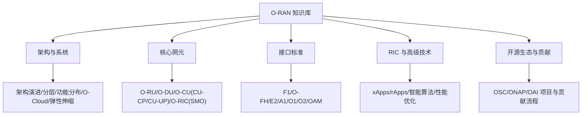
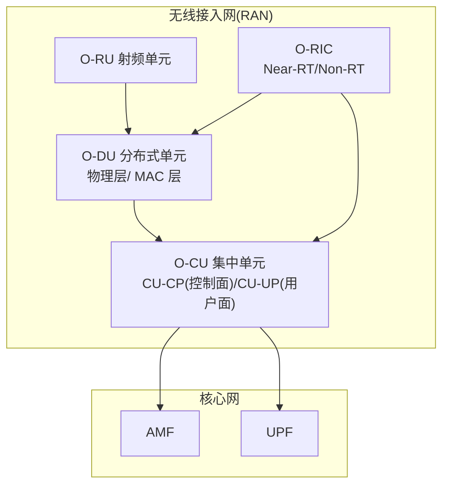
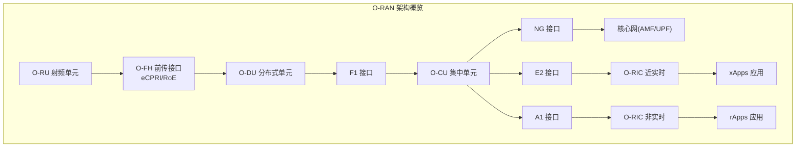
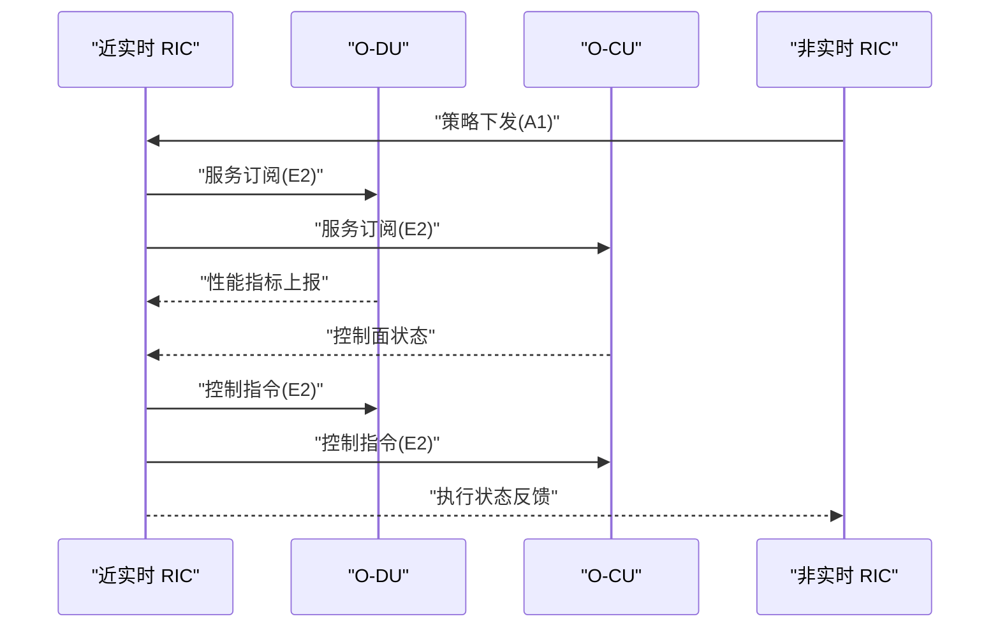
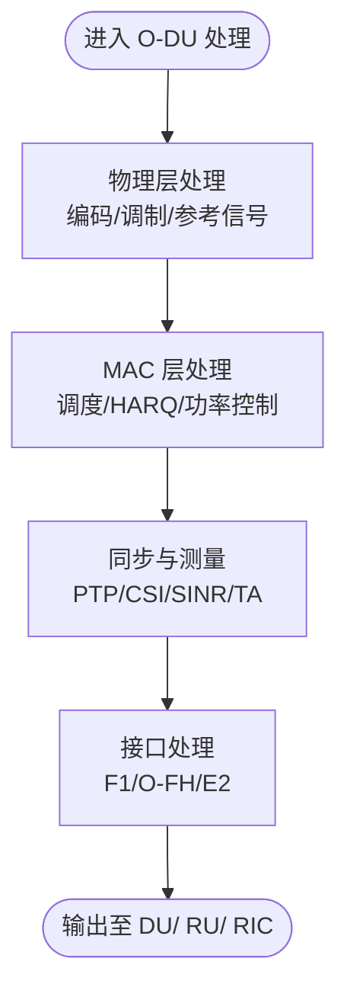
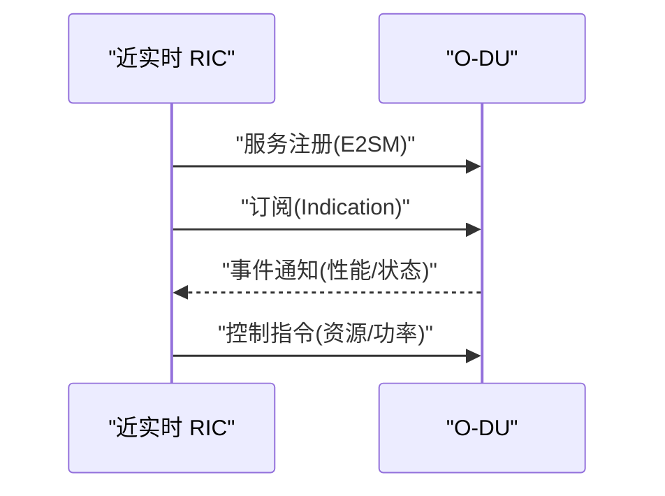
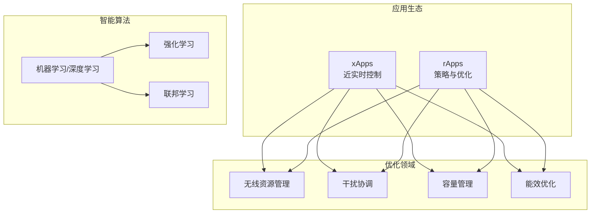
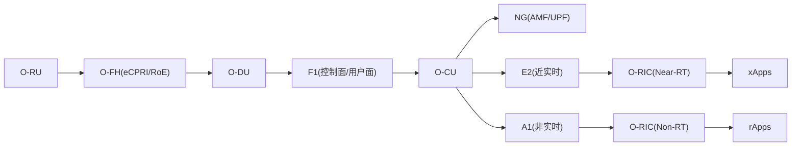
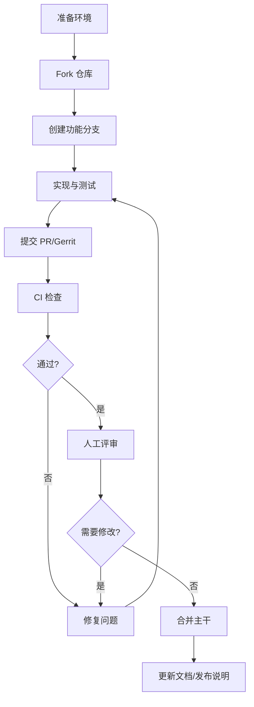

# 核心项目

<cite>
**本文引用的文件**
- [README.md](file://README.md)
- [oran-open-source-projects.md](file://17-open-source-ecosystem/oran-projects/oran-open-source-projects.md)
- [contribution-guide.md](file://17-open-source-ecosystem/core-projects/contribution-guide.md)
- [open-source-community-guide.md](file://17-open-source-ecosystem/community-resources/open-source-community-guide.md)
- [o-cu.md](file://02-core-components/o-cu.md)
- [o-du.md](file://02-core-components/o-du.md)
- [o-ric.md](file://02-core-components/o-ric.md)
- [e2-interface.md](file://03-interface-standards/e2-interface.md)
- [readme.md](file://07-ric-development/readme.md)
- [comprehensive-oran-glossary.md](file://comprehensive-oran-glossary.md)
- [comprehensive-oran-patent-table.md](file://comprehensive-oran-patent-table.md)
</cite>

## 目录
1. [简介](#简介)
2. [项目结构](#项目结构)
3. [核心组件](#核心组件)
4. [架构总览](#架构总览)
5. [详细组件分析](#详细组件分析)
6. [依赖关系分析](#依赖关系分析)
7. [性能考量](#性能考量)
8. [故障排查指南](#故障排查指南)
9. [结论](#结论)
10. [附录](#附录)

## 简介
本指南面向希望参与 O-RAN 核心开源项目的工程师与技术管理者，系统梳理 O-RAN 软件社区（O-RAN SC）及主流开源项目（如 OSC RIC、OAI RAN、ONAP O-RAN 等），并结合接口标准（E2/A1/F1/O-FH）、核心网元（O-CU/O-DU/O-RIC/O-RU/SMO）与 RIC 高级技术，提供从“如何选择”“如何贡献”“如何评估”到“合规与许可”的全流程参与指引。文档同时给出架构视图、流程图与最佳实践，帮助读者在云平台背景基础上快速成长为 O-RAN 专家。

## 项目结构
该知识库以主题域组织，覆盖 O-RAN 从架构、接口、核心网元到部署、测试、安全、运维、未来技术、生态与合规的全栈内容。核心与本指南直接相关的目录如下：
- 01-architecture-system：架构演进、分层架构、功能分布、O-Cloud 架构、弹性伸缩
- 02-core-components：O-RU、O-DU、O-CU（含 CU-CP/CU-UP）、O-RIC（近实时/非实时）、SMO、O-CUCP/O-CUUP
- 03-interface-standards：F1、O-FH、E2、A1、O1、O2、OAM 接口协议与最佳实践
- 07-ric-development：RIC 架构、xApps/rApps 开发、智能算法、性能优化
- 17-open-source-ecosystem：O-RAN SC 项目、开发者工具、社区资源、核心项目清单与贡献指南



章节来源
- file://README.md#L1-L472

## 核心组件
本节聚焦 O-RAN 核心网元与接口，帮助快速建立“网元—接口—协议—部署”的整体认知。

- O-RU（射频单元）：负责射频信号收发与天线连接，是无线链路的起点。
- O-DU（分布式单元）：承担物理层与 MAC 层实时处理，对延迟与同步有严格要求；与 O-RU 通过 O-FH（eCPRI/RoE）连接，与 O-CU 通过 F1 接口连接。
- O-CU（集中单元）：实现高层协议与控制面功能，拆分为 CU-CP（控制面）与 CU-UP（用户面），通过 E1 接口互通，向上对接核心网（AMF/UPF）经 NG 接口，向下经 F1 接口与 DU 交互。
- O-RIC（RAN 智能控制器）：分为 Near-RT RIC（毫秒级闭环）与 Non-RT RIC（秒至分钟级策略），通过 E2/A1 接口与 CU/DU/RIC 协同，支撑 xApps/rApps 部署与智能优化。
- SMO（服务管理与编排）：面向服务生命周期管理与资源编排，提供 O1/O2 接口能力。



章节来源
- file://02-core-components/o-ric.md#L1-L437
- file://02-core-components/o-du.md#L1-L415
- file://02-core-components/o-cu.md#L1-L419

## 架构总览
O-RAN 采用“云化、解耦、接口标准化”的总体思路，通过开放接口（F1/O-FH/E2/A1/O1/O2/OAM）实现 CU/DU/RU 的解耦与灵活部署，结合 RIC 的智能控制与 xApps/rApps 的应用生态，形成“硬件白盒化、软件开源化、网络智能化”的新范式。



章节来源
- file://03-interface-standards/e2-interface.md#L1-L337
- file://02-core-components/o-ric.md#L1-L437
- file://02-core-components/o-du.md#L1-L415
- file://02-core-components/o-cu.md#L1-L419

## 详细组件分析

### O-RIC（近实时/非实时 RIC）
- 近实时 RIC（Near-RT）：毫秒级闭环控制，基于 E2 接口与 CU/DU 交互，提供 xApps 部署环境与服务模型处理；强调低延迟、高可用与实时数据处理。
- 非实时 RIC（Non-RT）：秒至分钟级策略管理，基于 A1 接口与 Near-RT RIC 交互，提供 rApps 部署环境与数据分析/机器学习能力；强调长周期优化与策略生成。
- 协同与编排：RIC 间策略分发、状态同步、冲突消解与跨域协调；支持容器化与微服务架构。



章节来源
- file://02-core-components/o-ric.md#L1-L437
- file://07-ric-development/readme.md#L1-L368

### O-DU（分布式单元）
- 物理层与 MAC 层实时处理：下行编码/调制/参考信号生成、上行信道估计/解调、HARQ、功率控制、BSR/PHR/SR 处理。
- 实时性与同步：端到端延迟通常要求在 3ms 内，时间同步精度需满足 100ns~1μs；支持 IEEE 1588 PTP v2。
- 接口：F1（与 O-CU）、O-FH（与 O-RU）、E2（与 O-RIC）。



章节来源
- file://02-core-components/o-du.md#L1-L415

### O-CU（集中单元）
- CU-CP：RRC/NAS、NG 接口、F1-C 接口、移动性与安全策略。
- CU-UP：PDCP/SDAP、用户面转发、QoS 与负载均衡、统计与计费。
- 接口：NG（与 AMF）、F1（与 DU）、E1（CU-CP/CU-UP）。

```mermaid
classDiagram
class CU_CP {
"+RRC/NAS 处理"
"+NG 接口"
"+F1-C 接口"
"+移动性/安全"
}
class CU_UP {
"+PDCP/SDAP"
"+用户面转发"
"+QoS/负载均衡"
}
class NG { "+SCTP 协议" }
class F1 { "+SCTP(GTP-U)" }
class E1 { "+SCTP" }
CU_CP --> NG : "控制面"
CU_CP --> F1 : "控制面"
CU_UP --> F1 : "用户面"
CU_CP --> E1 : "CU-CP/CU-UP"
CU_UP --> E1 : "CU-CP/CU-UP"
```

章节来源
- file://02-core-components/o-cu.md#L1-L419

### E2 接口（近实时 RIC 与 CU/DU）
- 服务化架构：基于 SCTP/STREAMS，支持服务注册、调用、事件通知与订阅管理。
- 实时性：Near-RT RIC 通常要求 <10ms 响应；需关注 SCTP 多流、QoS 与网络拓扑优化。
- 运维：连接状态、消息吞吐、延迟与错误率监控；告警分级与关联分析。



章节来源
- file://03-interface-standards/e2-interface.md#L1-L337

### RIC 高级技术与应用生态
- xApps（近实时）：部署在 Near-RT RIC，实现毫秒级闭环控制（如负载均衡、干扰抑制、能效优化）。
- rApps（非实时）：部署在 Non-RT RIC，实现策略生成与长期优化（如 QoS/切片/安全策略）。
- 智能算法：异常检测、预测维护、强化学习、联邦学习、能量优化与绿色 O-RAN。



章节来源
- file://07-ric-development/readme.md#L1-L368

## 依赖关系分析
- 网元依赖：O-RU → O-DU → O-CU → 核心网；O-RIC 与 CU/DU 通过 E2 接口耦合；O-RIC 与彼此通过 A1 接口耦合。
- 接口依赖：F1（控制面/用户面分离）、O-FH（eCPRI/RoE）、E2（近实时闭环）、A1（策略下发）、O1/O2（SMO 管理与云资源）。
- 技术栈依赖：容器化（Kubernetes）、服务网格（Istio/Linkerd）、消息队列（Kafka/RabbitMQ）、时序/关系数据库、监控（Prometheus/Grafana）。



章节来源
- file://03-interface-standards/e2-interface.md#L1-L337
- file://02-core-components/o-ric.md#L1-L437
- file://02-core-components/o-du.md#L1-L415
- file://02-core-components/o-cu.md#L1-L419

## 性能考量
- O-DU：物理层/ MAC 层延迟、吞吐量、误码率、调度效率；需关注硬件选型（CPU/DSP/FPGA）、网络拓扑与同步精度（PTP）。
- O-CU：CU-CP 信令延迟与资源利用率、CU-UP 吞吐量与延迟；需关注容器化与微服务编排、QoS 与资源池管理。
- O-RIC：E2/A1 接口延迟与吞吐、xApps/rApps 资源占用与性能；需关注 SCTP 参数优化、消息批处理与缓存策略。
- 网络：前传/中传带宽与延迟、QoS 与冗余、跨厂商互操作性与一致性测试。

章节来源
- file://02-core-components/o-du.md#L1-L415
- file://02-core-components/o-cu.md#L1-L419
- file://02-core-components/o-ric.md#L1-L437
- file://03-interface-standards/e2-interface.md#L1-L337

## 故障排查指南
- 告警分级与关联：建立分级告警与根因关联分析，避免告警风暴。
- 日志与信令：结合设备日志、性能指标与 E2/F1/O-FH 信令流程定位问题。
- 常见故障：接口断连、性能劣化、资源不足、配置错误；按“重启/调整配置/扩容/修复传输/应用重启”流程处置。
- 自动化：自动化测试、故障自愈与容量评估，降低人工干预。

章节来源
- file://02-core-components/o-ric.md#L214-L301
- file://02-core-components/o-du.md#L224-L288
- file://02-core-components/o-cu.md#L197-L263
- file://03-interface-standards/e2-interface.md#L148-L190

## 结论
O-RAN 通过开放接口与智能控制实现了 RAN 的云化、解耦与智能化。对于贡献者而言，建议从理解核心网元与接口入手，结合 RIC 应用生态与测试验证体系，逐步深入到性能优化与安全合规。依托开源生态与社区资源，可高效开展原型验证、互操作测试与规模化部署。

## 附录

### 项目评估与选择指南
- 技术需求匹配：是否满足 CU/DU 分离、前传接口（eCPRI/RoE）、E2/A1 接口能力与 xApps/rApps 支持。
- 社区活跃度：查看 OSC/ONAP/OAI 项目仓库的提交频率、Issue/PR 响应与会议参与度。
- 成熟度与合规：参考各项目许可证（如 Apache 2.0、BSD 3-Clause、O-AI Public License）、标准符合性与认证信息。
- 部署与运维：评估容器化/云原生支持、HA/扩展性、监控与可观测性能力。

章节来源
- file://17-open-source-ecosystem/oran-projects/oran-open-source-projects.md#L1-L716
- file://17-open-source-ecosystem/core-projects/contribution-guide.md#L1-L113

### 贡献流程与最佳实践
- 环境准备：Git/GitHub/Gerrit、SSH 密钥、开发工具链（VS Code、pytest/black/flake8 等）。
- 提交流程：Fork → 分支 → 编码/测试 → 提交 PR/Gerrit Change → CI/手动评审 → 合并 → 文档与发布说明。
- 代码规范：命名约定、文档字符串、复杂度限制、安全检查；遵循项目风格与测试覆盖率要求。
- 社区参与：邮件列表（o-ran-tech-discuss、o-ran-wg4、onos-dev）、TSC/WG 会议、在线技术分享。



章节来源
- file://17-open-source-ecosystem/core-projects/contribution-guide.md#L1-L113
- file://17-open-source-ecosystem/community-resources/open-source-community-guide.md#L266-L314

### 许可证与合规
- 许可证：OSC RIC（Apache 2.0）、OAI RAN（O-AI Public License v1.1）、ONAP（Apache 2.0）、OAI 模拟器（BSD 3-Clause）。
- 合规要点：遵循项目许可证条款、版权声明与免责声明；在商业使用中进行专利与合规评估。
- 专利与标准：参考“O-RAN 全面专利表”，关注 SEPs（3GPP/O-RAN 联盟/ETSI）与垂直行业应用专利布局。

章节来源
- file://17-open-source-ecosystem/oran-projects/oran-open-source-projects.md#L1-L716
- file://comprehensive-oran-patent-table.md#L1-L258

### 术语与概念
- 术语表覆盖 O-RAN 核心概念（中/英/俄），便于跨语言协作与知识沉淀。
- 建议在项目文档与代码注释中统一术语，减少歧义。

章节来源
- file://comprehensive-oran-glossary.md#L1-L656