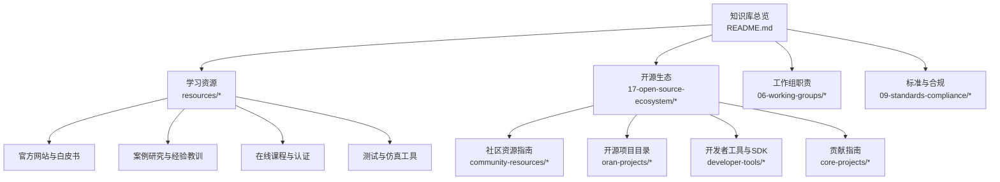
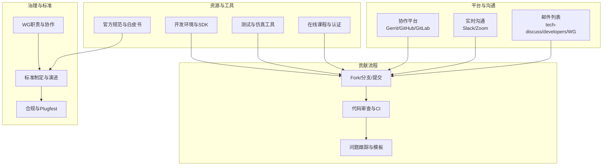
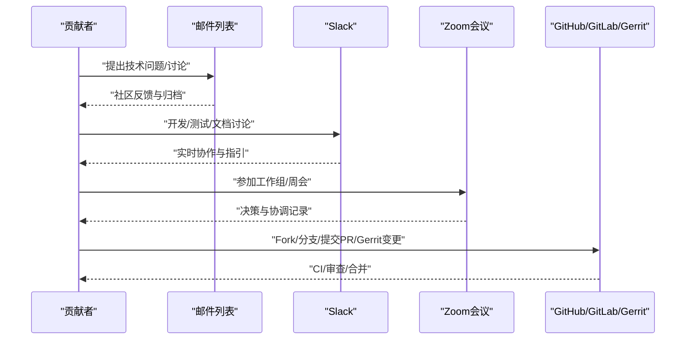
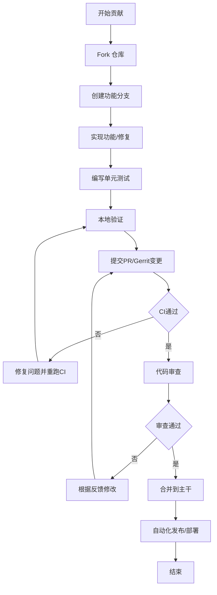
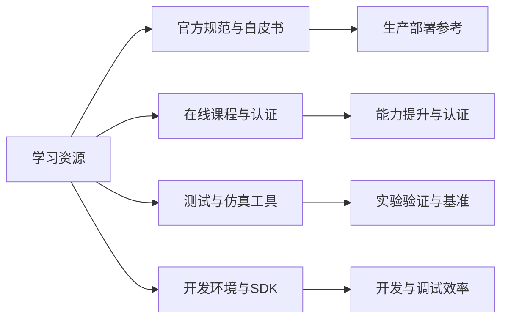
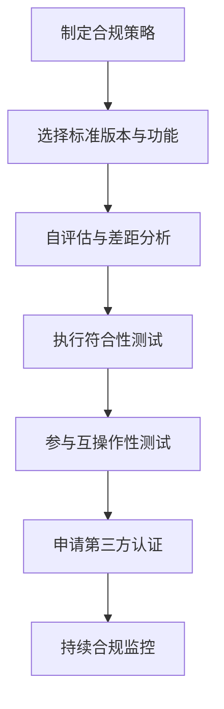
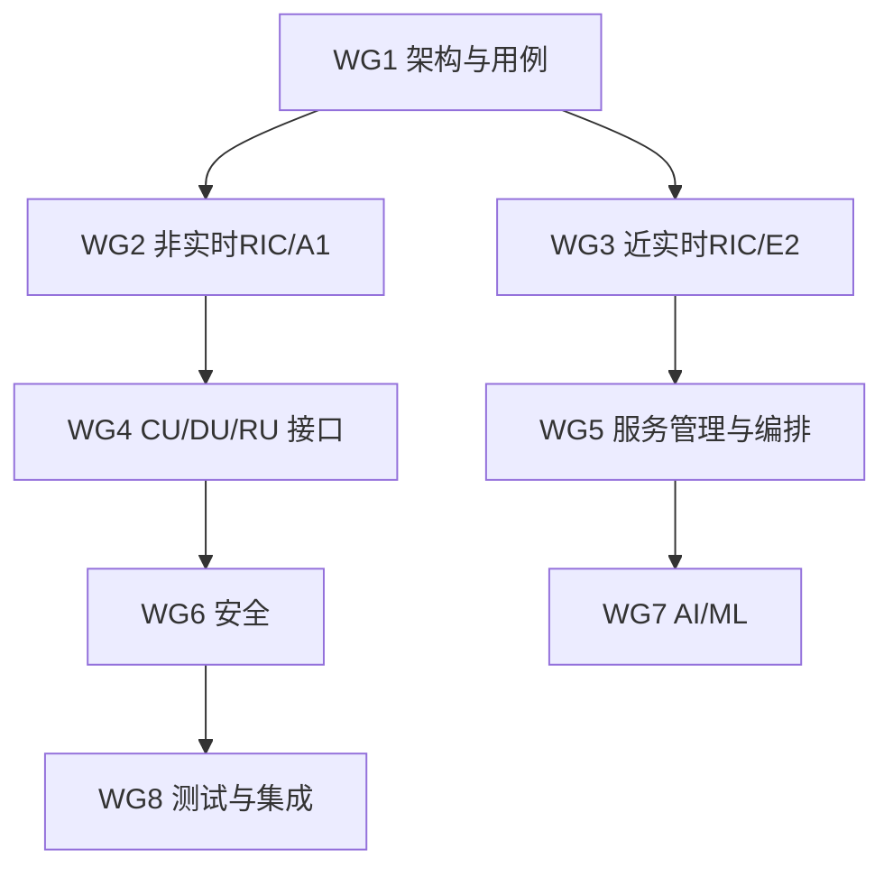
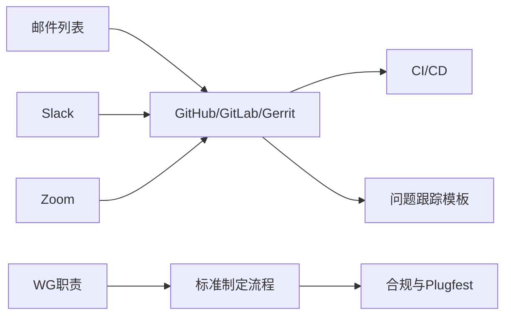

# 社区资源

<cite>
**本文引用的文件**
- [README.md](file://README.md)
- [resources/readme.md](file://resources/readme.md)
- [resources/readme-zh.md](file://resources/readme-zh.md)
- [open-source-community-guide.md](file://17-open-source-ecosystem/community-resources/open-source-community-guide.md)
- [open-source-community-guide-zh.md](file://17-open-source-ecosystem/community-resources/open-source-community-guide-zh.md)
- [oran-open-source-projects.md](file://17-open-source-ecosystem/oran-projects/oran-open-source-projects.md)
- [oran-open-source-projects-zh.md](file://17-open-source-ecosystem/oran-projects/oran-open-source-projects-zh.md)
- [oran-development-tools.md](file://17-open-source-ecosystem/developer-tools/oran-development-tools.md)
- [oran-development-tools-zh.md](file://17-open-source-ecosystem/developer-tools/oran-development-tools-zh.md)
- [contribution-guide.md](file://17-open-source-ecosystem/core-projects/contribution-guide.md)
- [wg-detailed-responsibilities.md](file://06-working-groups/wg-detailed-responsibilities.md)
- [standards-compliance/readme.md](file://09-standards-compliance/readme.md)
- [standards-compliance/readme-zh.md](file://09-standards-compliance/readme-zh.md)
</cite>

## 目录
1. [简介](#简介)
2. [项目结构](#项目结构)
3. [核心组件](#核心组件)
4. [架构总览](#架构总览)
5. [详细组件分析](#详细组件分析)
6. [依赖分析](#依赖分析)
7. [性能考虑](#性能考虑)
8. [故障排查指南](#故障排查指南)
9. [结论](#结论)
10. [附录](#附录)

## 简介
本指南面向希望参与 O-RAN 开源社区的工程师与研究者，系统梳理社区平台、技术资源、贡献流程与治理机制，帮助新成员快速融入并高效参与 O-RAN 生态的协作与创新。内容覆盖 GitHub/GitLab 组织、邮件列表与在线论坛、开发者工具与测试平台、标准与规范体系、工作组职责与协作流程，以及社区行为准则与沟通规范。

## 项目结构
该知识库以主题域组织，围绕 O-RAN 技术全景构建，其中“开源生态”“学习资源”“工作组职责”“标准与合规”等模块直接对应社区参与的关键入口与支撑资源。

图表来源
- [README.md](file://README.md#L1-L464)
- [resources/readme.md](file://resources/readme.md#L1-L126)
- [open-source-community-guide.md](file://17-open-source-ecosystem/community-resources/open-source-community-guide.md#L1-L494)
- [oran-open-source-projects.md](file://17-open-source-ecosystem/oran-projects/oran-open-source-projects.md#L1-L716)
- [oran-development-tools.md](file://17-open-source-ecosystem/developer-tools/oran-development-tools.md#L1-L800)

章节来源
- [README.md](file://README.md#L1-L464)

## 核心组件
- 社区平台与沟通渠道
  - 邮件列表与归档：技术讨论、开发者聚焦、工作组专用
  - 实时沟通：Slack 频道与 Zoom 会议安排
- 开源项目与协作
  - OSC、ONAP、OpenAirInterface 等主要项目与贡献流程
  - 代码审查、CI/CD、问题跟踪模板
- 学习与资源
  - 官方规范、白皮书、行业报告
  - 在线课程、认证、实践实验室
  - 测试工具、仿真工具、开发环境脚本
- 标准与合规
  - O-RAN 联盟规范、ETSI、3GPP 标准
  - 测试规范、Plugfest、互操作性验证
- 工作组与治理
  - 各 WG 职责、协作机制、与 3GPP 的对齐
  - 标准制定流程、演进方向与生产应用

章节来源
- [open-source-community-guide.md](file://17-open-source-ecosystem/community-resources/open-source-community-guide.md#L217-L399)
- [oran-open-source-projects.md](file://17-open-source-ecosystem/oran-projects/oran-open-source-projects.md#L1-L716)
- [resources/readme.md](file://resources/readme.md#L1-L126)
- [standards-compliance/readme.md](file://09-standards-compliance/readme.md#L1-L363)
- [wg-detailed-responsibilities.md](file://06-working-groups/wg-detailed-responsibilities.md#L1-L607)

## 架构总览
下图展示社区参与的“平台—资源—流程—治理”四维架构，帮助新成员建立全局视角：

图表来源
- [open-source-community-guide.md](file://17-open-source-ecosystem/community-resources/open-source-community-guide.md#L217-L399)
- [oran-development-tools.md](file://17-open-source-ecosystem/developer-tools/oran-development-tools.md#L1-L800)
- [wg-detailed-responsibilities.md](file://06-working-groups/wg-detailed-responsibilities.md#L419-L458)
- [standards-compliance/readme.md](file://09-standards-compliance/readme.md#L1-L363)

## 详细组件分析

### 社区平台与沟通渠道
- 邮件列表
  - 技术讨论列表：用于架构与技术问题讨论
  - 开发者列表：聚焦代码与开发流程
  - 工作组专用列表：按 WG 分发与归档
- 实时沟通
  - Slack 频道：通用、开发、测试、文档、WG 专属
  - Zoom 例会：周同步、工作组会议、专题讨论
- 协作平台
  - GitHub/GitLab：公开仓库与文档
  - Gerrit：代码审查与变更流程

图表来源
- [open-source-community-guide.md](file://17-open-source-ecosystem/community-resources/open-source-community-guide.md#L217-L284)

章节来源
- [open-source-community-guide.md](file://17-open-source-ecosystem/community-resources/open-source-community-guide.md#L217-L284)

### 开源项目与贡献流程
- 主要项目
  - OSC：RIC 平台、DU/CU 高层、仿真器
  - ONAP：与 O-RAN 的集成模块（控制回路、策略管理）
  - OpenAirInterface：RAN 参考实现（RU/DU/CU）
- 贡献流程
  - Fork 仓库 → 创建功能分支 → 编写代码与测试 → 提交 PR/Gerrit → CI 检查 → 代码审查 → 合并与发布

图表来源
- [oran-open-source-projects.md](file://17-open-source-ecosystem/oran-projects/oran-open-source-projects.md#L613-L637)
- [contribution-guide.md](file://17-open-source-ecosystem/core-projects/contribution-guide.md#L23-L50)

章节来源
- [oran-open-source-projects.md](file://17-open-source-ecosystem/oran-projects/oran-open-source-projects.md#L1-L716)
- [contribution-guide.md](file://17-open-source-ecosystem/core-projects/contribution-guide.md#L1-L113)

### 学习资源与工具
- 官方规范与白皮书
  - O-RAN 联盟规范、ETSI 标准、3GPP 规范、行业白皮书
- 在线课程与认证
  - 官方培训、Coursera/edX 等平台课程、厂商培训、认证项目
- 实践实验室与沙箱
  - Plugfest、Summit、虚拟/物理测试床、云平台配额
- 开发与测试工具
  - Docker/K8s/Helm 环境、VS Code 插件、测试框架、网络仿真器

图表来源
- [resources/readme.md](file://resources/readme.md#L6-L126)
- [oran-development-tools.md](file://17-open-source-ecosystem/developer-tools/oran-development-tools.md#L1-L800)

章节来源
- [resources/readme.md](file://resources/readme.md#L1-L126)
- [resources/readme-zh.md](file://resources/readme-zh.md#L1-L126)
- [oran-development-tools.md](file://17-open-source-ecosystem/developer-tools/oran-development-tools.md#L1-L800)
- [oran-development-tools-zh.md](file://17-open-source-ecosystem/developer-tools/oran-development-tools-zh.md#L1-L800)

### 标准与合规
- 标准体系
  - O-RAN 联盟规范（架构、接口、硬件、软件、安全、测试）
  - ETSI 标准（前传、A1 接口、传输配置文件）
  - 3GPP 标准（NG-RAN、接口协议、RIC 规范）
- 合规与认证
  - 自评估、符合性测试、互操作性测试、Plugfest、第三方认证
- 生产应用
  - 标准版本选择、功能裁剪、接口测试、功能验证、渐进式部署

图表来源
- [standards-compliance/readme.md](file://09-standards-compliance/readme.md#L1-L363)
- [standards-compliance/readme-zh.md](file://09-standards-compliance/readme-zh.md#L1-L371)

章节来源
- [standards-compliance/readme.md](file://09-standards-compliance/readme.md#L1-L363)
- [standards-compliance/readme-zh.md](file://09-standards-compliance/readme-zh.md#L1-L371)

### 工作组与治理
- 各 WG 职责
  - WG1：架构与用例；WG2：非实时 RIC/A1；WG3：近实时 RIC/E2；WG4：CU/DU/RU 接口；WG5：服务管理与编排；WG6：安全；WG7：AI/ML；WG8：测试与集成
- 协作机制
  - 跨工作组技术协调、文档协调、用例驱动
  - 标准制定流程：需求收集、规范开发、批准与维护
- 与 3GPP 协同
  - 技术联络、标准对齐、分工协作与互补关系

图表来源
- [wg-detailed-responsibilities.md](file://06-working-groups/wg-detailed-responsibilities.md#L1-L607)

章节来源
- [wg-detailed-responsibilities.md](file://06-working-groups/wg-detailed-responsibilities.md#L1-L607)

## 依赖分析
- 平台依赖
  - 邮件列表与 Slack 作为信息与协作入口，Gerrit/GitHub/GitLab 作为代码与文档托管
- 资源依赖
  - 官方规范与白皮书为标准与合规依据；在线课程与认证为能力提升路径；测试与仿真工具为实验验证基础
- 流程依赖
  - 贡献流程与审查流程依赖 CI/CD 与问题跟踪模板；工作组协作依赖跨组协调与文档一致性
- 治理依赖
  - 标准制定流程依赖 WG 职责与 3GPP 对齐；生产应用依赖合规与 Plugfest 验证

图表来源
- [open-source-community-guide.md](file://17-open-source-ecosystem/community-resources/open-source-community-guide.md#L217-L399)
- [wg-detailed-responsibilities.md](file://06-working-groups/wg-detailed-responsibilities.md#L419-L458)
- [standards-compliance/readme.md](file://09-standards-compliance/readme.md#L1-L363)

章节来源
- [open-source-community-guide.md](file://17-open-source-ecosystem/community-resources/open-source-community-guide.md#L217-L399)
- [wg-detailed-responsibilities.md](file://06-working-groups/wg-detailed-responsibilities.md#L419-L458)
- [standards-compliance/readme.md](file://09-standards-compliance/readme.md#L1-L363)

## 性能考虑
- 贡献效率
  - 使用统一的开发环境与工具链，减少本地配置成本
  - 采用自动化测试与 CI，缩短反馈周期
- 标准与合规
  - 通过 Plugfest 与互操作性测试提前发现接口与兼容性问题，降低后期返工成本
- 沟通与协作
  - 利用邮件列表与 Slack 的异步与实时互补，提升问题定位与解决速度

## 故障排查指南
- 贡献流程问题
  - 本地测试失败：检查测试环境与依赖，参考项目提供的测试框架与模板
  - 代码审查反馈：按审查意见逐项修正，必要时在邮件列表或 Slack 澄清技术细节
- 标准与合规问题
  - 接口不兼容：对照 WG4/F1/O-FH 接口规范，确认消息格式与同步要求
  - 合规验证失败：依据 WG8 测试规范与 Plugfest 指南，补齐测试用例与验证流程
- 学习与工具问题
  - 开发环境搭建：参考容器化脚本与 IDE 配置，确保系统资源满足最低要求
  - 仿真与测试：使用提供的仿真器与测试工具，结合日志与仪表板定位问题

章节来源
- [oran-development-tools.md](file://17-open-source-ecosystem/developer-tools/oran-development-tools.md#L1-L800)
- [oran-open-source-projects.md](file://17-open-source-ecosystem/oran-projects/oran-open-source-projects.md#L613-L716)
- [standards-compliance/readme.md](file://09-standards-compliance/readme.md#L1-L363)

## 结论
通过本指南，您可以系统地了解 O-RAN 开源社区的平台、资源、流程与治理，快速定位适合自己的参与路径：从学习资源与工具入手，借助邮件列表与 Slack 获取支持，按照贡献流程参与项目，依托标准与合规体系确保质量，最后在工作组与治理框架下推动技术演进与生态繁荣。

## 附录
- 快速入口
  - 社区资源与工具：resources/*、17-open-source-ecosystem/*
  - 标准与合规：09-standards-compliance/*
  - 工作组职责：06-working-groups/*
  - 总览与过渡指南：README.md