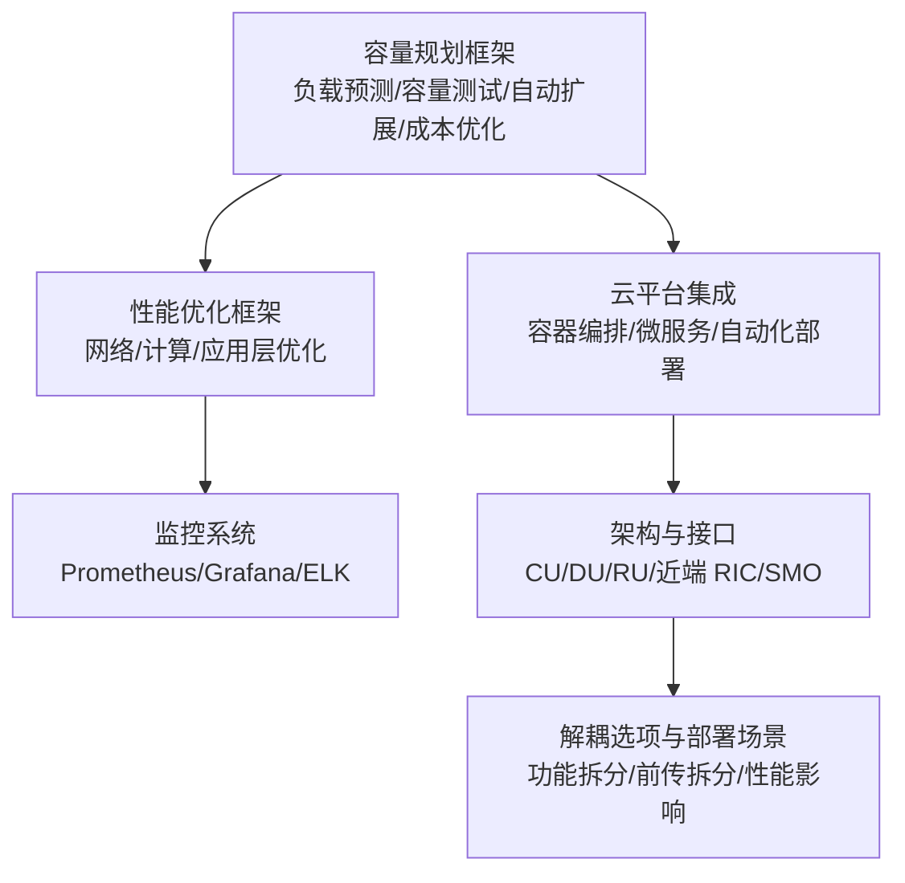
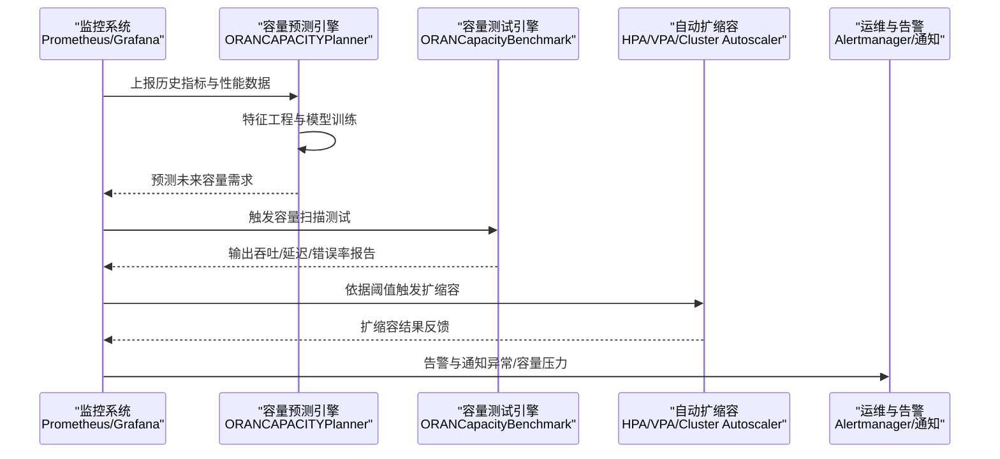
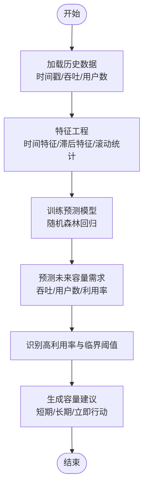
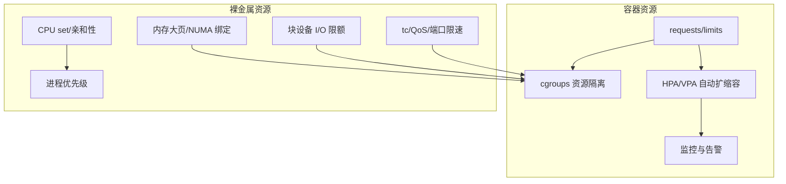
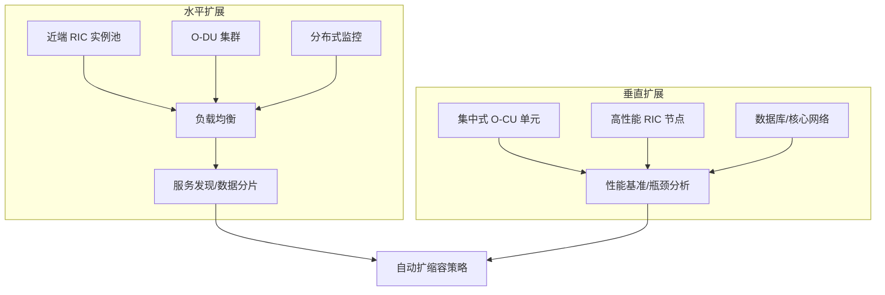
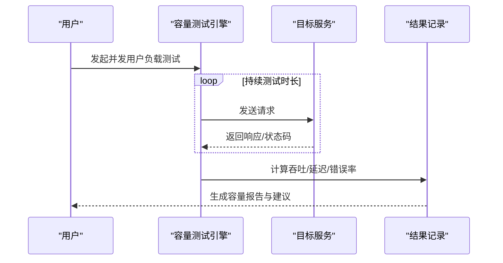
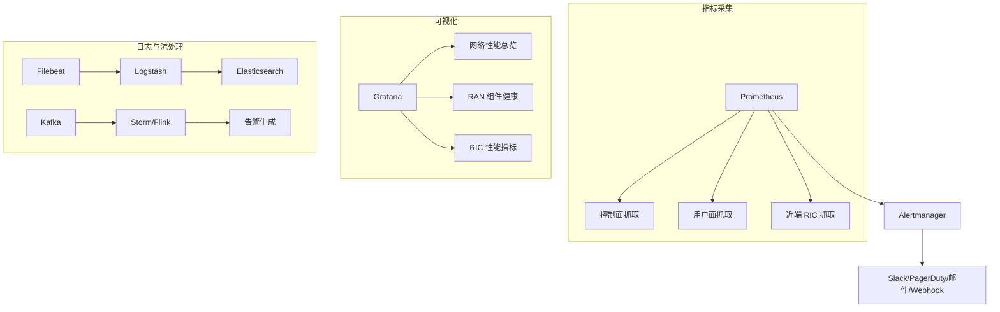
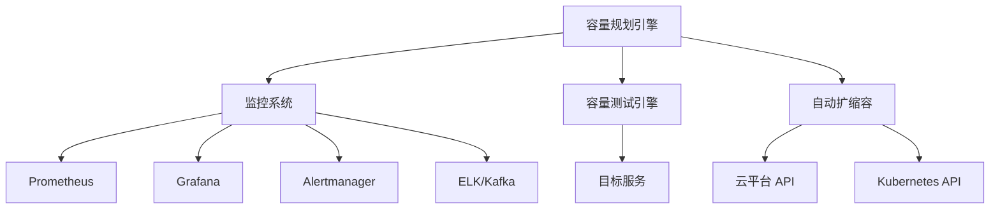

# 容量规划

<cite>
**本文引用的文件**
- [容量规划框架（中文）](file://14-operations-management/capacity-planning/capacity-planning-framework-zh.md)
- [容量规划框架（英文）](file://14-operations-management/capacity-planning/capacity-planning-framework.md)
- [O-RAN 容量规划与资源管理](file://26-performance-optimization/capacity-planning/o-ran-capacity-planning.md)
- [O-RAN 性能优化框架（中文）](file://14-operations-management/performance-optimization/performance-optimization-framework-zh.md)
- [O-RAN 性能优化框架（英文）](file://14-operations-management/performance-optimization/performance-optimization-framework.md)
- [O-RAN 监控系统](file://22-tool-platforms/monitoring-systems/o-ran-monitoring-systems.md)
- [O-RAN 架构基础](file://01-architecture-system/readme.md)
- [O-RAN 架构系统-弹性伸缩](file://01-architecture-system/elastic-scaling.md)
- [O-RAN 架构系统-功能分布](file://01-architecture-system/functional-distribution.md)
- [O-RAN 架构系统-分层架构](file://01-architecture-system/layered-architecture.md)
- [O-RAN 架构系统-O-Cloud 架构](file://01-architecture-system/o-cloud-architecture.md)
- [O-RAN 架构系统-接口标准-A1 接口](file://03-interface-standards/a1-interface.md)
- [O-RAN 架构系统-接口标准-E2 接口](file://03-interface-standards/e2-interface.md)
- [O-RAN 架构系统-接口标准-F1 接口](file://03-interface-standards/f1-interface.md)
- [O-RAN 架构系统-接口标准-O-FH 接口](file://03-interface-standards/o-fh-interface.md)
- [O-RAN 架构系统-接口标准-O1 接口](file://03-interface-standards/o1-interface.md)
- [O-RAN 架构系统-接口标准-O2 接口](file://03-interface-standards/o2-interface.md)
- [O-RAN 架构系统-接口标准-OAM 接口](file://03-interface-standards/oam-interface.md)
- [O-RAN 架构系统-解耦选项-部署场景](file://04-disaggregation-options/deployment-scenarios.md)
- [O-RAN 架构系统-解耦选项-功能拆分](file://04-disaggregation-options/functional-splits.md)
- [O-RAN 架构系统-解耦选项-前传拆分](file://04-disaggregation-options/fronthaul-splits.md)
- [O-RAN 架构系统-解耦选项-性能影响](file://04-disaggregation-options/performance-impact.md)
- [O-RAN 架构系统-云平台集成-容器编排](file://05-cloud-integration/container-orchestration.md)
- [O-RAN 架构系统-云平台集成-微服务架构](file://05-cloud-integration/microservices-architecture.md)
- [O-RAN 架构系统-云平台集成-监控集成](file://05-cloud-integration/monitoring-integration.md)
- [O-RAN 架构系统-云平台集成-自动化部署](file://05-cloud-integration/automated-deployment.md)
- [O-RAN 架构系统-云平台集成-云原生架构](file://05-cloud-integration/cloud-native-architecture.md)
- [O-RAN 运维-容量规划-容量规划框架](file://14-operations-management/capacity-planning/capacity-planning-framework.md)
- [O-RAN 运维-容量规划-容量规划框架（中文）](file://14-operations-management/capacity-planning/capacity-planning-framework-zh.md)
- [O-RAN 运维-性能优化-性能优化框架（中文）](file://14-operations-management/performance-optimization/performance-optimization-framework-zh.md)
- [O-RAN 运维-性能优化-性能优化框架（英文）](file://14-operations-management/performance-optimization/performance-optimization-framework.md)
- [O-RAN 运维-监控告警-监控工具链](file://28-monitoring-alerting/readme.md)
- [O-RAN 运维-监控告警-告警策略](file://28-monitoring-alerting/alert-strategy/o-ran-alert-strategy.md)
- [O-RAN 工具平台-监控系统](file://22-tool-platforms/monitoring-systems/o-ran-monitoring-systems.md)
</cite>

## 目录
1. [引言](#引言)
2. [项目结构](#项目结构)
3. [核心组件](#核心组件)
4. [架构总览](#架构总览)
5. [详细组件分析](#详细组件分析)
6. [依赖关系分析](#依赖关系分析)
7. [性能考量](#性能考量)
8. [故障排查指南](#故障排查指南)
9. [结论](#结论)
10. [附录](#附录)

## 引言
本文件面向 O-RAN 系统的容量规划与资源管理，围绕负载预测模型、资源配额策略、弹性伸缩与性能容量规划，结合 O-RAN 核心网元（CU/DU/RU/RIC/SMO）与云原生架构，提供从数据采集、建模预测、容量测试到自动化运维的完整方法论与实践指南。文档同时给出横向与纵向扩展策略、成本优化与监控告警体系，帮助运营商与厂商在多场景部署中实现高效、稳定、可扩展的容量管理。

## 项目结构
本仓库包含 O-RAN 从架构、接口、解耦选项到云平台集成、监控告警、性能优化与容量规划的完整知识体系。与容量规划直接相关的内容主要分布在以下模块：
- 容量规划框架：提供负载预测、容量测试、自动扩展策略与成本优化的工具与流程
- 性能优化框架：覆盖网络、计算、应用层优化与自动化调优
- 监控系统：提供 Prometheus/Grafana/ELK 等观测栈在 O-RAN 场景下的配置与实践
- 架构与接口：明确 CU/DU/RU/近端 RIC 等关键组件的职责与接口特性，支撑容量规划边界定义
- 云平台集成：容器编排、微服务、自动化部署与监控集成，支撑弹性伸缩与资源隔离

**章节来源**
- [O-RAN 架构基础](file://01-architecture-system/readme.md#L1-L161)
- [O-RAN 容量规划框架（英文）](file://14-operations-management/capacity-planning/capacity-planning-framework.md#L1-L505)
- [O-RAN 性能优化框架（英文）](file://14-operations-management/performance-optimization/performance-optimization-framework.md#L1-L650)
- [O-RAN 监控系统](file://22-tool-platforms/monitoring-systems/o-ran-monitoring-systems.md#L1-L545)

## 核心组件
- 负载预测与容量规划引擎：基于历史流量与性能数据，提取时间特征、滞后特征与滚动统计，采用随机森林等模型进行吞吐量预测，并输出容量建议
- 容量测试与基准：通过并发用户负载测试，评估系统在不同负载下的吞吐、延迟与错误率，形成容量报告与扩展阈值
- 自动扩展策略：针对近端 RIC、O-DU 集群、CU 池等关键组件，设定 CPU/用户数/吞吐量等指标阈值与扩缩容因子，结合冷却期与实例上下限
- 资源配额与隔离：覆盖 Kubernetes 资源请求/限制、HPA/VPA、cgroups 控制、裸金属隔离与容量预留，确保关键服务的 SLA 与资源保障
- 监控与告警：Prometheus 抓取 O-RAN 关键组件指标，Grafana 可视化，Alertmanager 与多通道通知联动；日志分析与实时流处理支撑根因定位与预测性维护

**章节来源**
- [容量规划框架（中文）](file://14-operations-management/capacity-planning/capacity-planning-framework-zh.md#L8-L186)
- [容量规划框架（英文）](file://14-operations-management/capacity-planning/capacity-planning-framework.md#L8-L186)
- [O-RAN 容量规划与资源管理](file://26-performance-optimization/capacity-planning/o-ran-capacity-planning.md#L76-L144)
- [O-RAN 性能优化框架（中文）](file://14-operations-management/performance-optimization/performance-optimization-framework-zh.md#L103-L234)
- [O-RAN 性能优化框架（英文）](file://14-operations-management/performance-optimization/performance-optimization-framework.md#L103-L234)
- [O-RAN 监控系统](file://22-tool-platforms/monitoring-systems/o-ran-monitoring-systems.md#L10-L78)

## 架构总览
O-RAN 容量规划以“数据驱动 + 自动化运维”为核心，贯穿以下闭环：
- 数据采集：通过 Prometheus、自定义导出器与日志系统收集 O-RAN 组件的网络、计算与应用指标
- 预测建模：对历史数据进行特征工程与模型训练，预测未来容量需求与峰值负载
- 规划执行：依据预测结果制定容量缓冲、扩展阈值与成本优化策略
- 自动化运维：基于阈值触发的自动扩缩容、资源配额与隔离、SLA 保障与告警联动
- 持续优化：容量测试与性能基准评估，结合趋势分析与异常检测，持续迭代容量策略

**图表来源**
- [容量规划框架（英文）](file://14-operations-management/capacity-planning/capacity-planning-framework.md#L18-L186)
- [容量规划框架（中文）](file://14-operations-management/capacity-planning/capacity-planning-framework-zh.md#L18-L186)
- [O-RAN 容量规划与资源管理](file://26-performance-optimization/capacity-planning/o-ran-capacity-planning.md#L146-L214)
- [O-RAN 监控系统](file://22-tool-platforms/monitoring-systems/o-ran-monitoring-systems.md#L10-L78)

**章节来源**
- [O-RAN 架构基础](file://01-architecture-system/readme.md#L1-L161)
- [O-RAN 架构系统-弹性伸缩](file://01-architecture-system/elastic-scaling.md)
- [O-RAN 架构系统-功能分布](file://01-architecture-system/functional-distribution.md)
- [O-RAN 架构系统-分层架构](file://01-architecture-system/layered-architecture.md)
- [O-RAN 架构系统-O-Cloud 架构](file://01-architecture-system/o-cloud-architecture.md)

## 详细组件分析

### 负载预测模型与业务场景建模
- 历史数据分析：提取时间特征（小时、星期、月份、周末）、滞后特征（1 小时、24 小时、168 小时）、滚动统计（24 小时、168 小时），作为模型输入
- 业务场景建模：区分日常、峰值、节假日与特殊事件场景，结合用户行为聚类与趋势外推，建立多场景预测
- 峰值负载估算：基于预测结果识别高利用率时段与临界阈值，输出短期与长期扩容建议
- 模型训练与特征重要性：标准化特征后训练随机森林回归模型，输出特征重要性，辅助容量规划决策

**图表来源**
- [容量规划框架（英文）](file://14-operations-management/capacity-planning/capacity-planning-framework.md#L34-L150)
- [容量规划框架（中文）](file://14-operations-management/capacity-planning/capacity-planning-framework-zh.md#L34-L150)

**章节来源**
- [容量规划框架（英文）](file://14-operations-management/capacity-planning/capacity-planning-framework.md#L8-L186)
- [容量规划框架（中文）](file://14-operations-management/capacity-planning/capacity-planning-framework-zh.md#L8-L186)

### 资源配额管理策略
- CPU 配额分配：Kubernetes Pod 的 requests/limits、HPA/VPA 自动扩缩容、cgroups CPU 隔离与亲和性绑定；裸金属场景通过 CPU set 与优先级隔离关键进程
- 内存配额控制：容器内存限制与交换策略、cgroups 内存限额、NUMA 绑定与大页优化；Go/JVM 等应用的 GC 与内存上限调优
- 存储配额管理：容器临时存储限制、块设备 I/O 限额、裸金属 I/O 调度与分区隔离
- 网络带宽控制：tc 队列调度、优先级队列、端口级带宽限制与 O-RAN 接口（E2/F1/O-FH）差异化标记

**图表来源**
- [O-RAN 容量规划与资源管理](file://26-performance-optimization/capacity-planning/o-ran-capacity-planning.md#L78-L144)
- [O-RAN 性能优化框架（中文）](file://14-operations-management/performance-optimization/performance-optimization-framework-zh.md#L103-L234)
- [O-RAN 性能优化框架（英文）](file://14-operations-management/performance-optimization/performance-optimization-framework.md#L103-L234)

**章节来源**
- [O-RAN 容量规划与资源管理](file://26-performance-optimization/capacity-planning/o-ran-capacity-planning.md#L76-L144)
- [O-RAN 性能优化框架（中文）](file://14-operations-management/performance-optimization/performance-optimization-framework-zh.md#L103-L234)
- [O-RAN 性能优化框架（英文）](file://14-operations-management/performance-optimization/performance-optimization-framework.md#L103-L234)

### 横向与纵向扩展策略
- 水平扩展：近端 RIC 实例、O-DU 集群、负载均衡的 CU 池、分布式监控系统；优势在于容错与突发负载成本效益，劣势是复杂性与状态同步挑战
- 垂直扩展：集中式 O-CU 单元、高性能 RIC 节点、数据库服务器、核心网络功能；优势在于管理简单与较低网络开销，劣势是单点故障与硬件上限
- 自动扩展配置：针对不同组件设定 CPU 利用率、连接用户数、吞吐量等指标阈值与扩缩因子，结合冷却期与实例上下限，避免震荡

**图表来源**
- [容量规划框架（英文）](file://14-operations-management/capacity-planning/capacity-planning-framework.md#L190-L266)
- [容量规划框架（中文）](file://14-operations-management/capacity-planning/capacity-planning-framework-zh.md#L190-L266)
- [O-RAN 容量规划与资源管理](file://26-performance-optimization/capacity-planning/o-ran-capacity-planning.md#L146-L214)

**章节来源**
- [容量规划框架（英文）](file://14-operations-management/capacity-planning/capacity-planning-framework.md#L188-L266)
- [容量规划框架（中文）](file://14-operations-management/capacity-planning/capacity-planning-framework-zh.md#L188-L266)
- [O-RAN 容量规划与资源管理](file://26-performance-optimization/capacity-planning/o-ran-capacity-planning.md#L146-L214)

### 容量测试与性能基准
- 负载测试：以并发用户数为变量，运行固定时长的负载测试，统计吞吐、延迟与错误率
- 容量扫描：在多个并发用户数下重复测试，绘制吞吐-用户曲线，识别最佳并发用户数与扩展阈值
- 报告与建议：输出最大可持续吞吐、峰值延迟与错误率，给出安全边际与增长规划建议

**图表来源**
- [容量规划框架（英文）](file://14-operations-management/capacity-planning/capacity-planning-framework.md#L364-L503)
- [容量规划框架（中文）](file://14-operations-management/capacity-planning/capacity-planning-framework-zh.md#L364-L503)

**章节来源**
- [容量规划框架（英文）](file://14-operations-management/capacity-planning/capacity-planning-framework.md#L361-L503)
- [容量规划框架（中文）](file://14-operations-management/capacity-planning/capacity-planning-framework-zh.md#L361-L503)

### 监控与告警体系
- 指标采集：Prometheus 抓取 O-RAN 控制面/用户面/近端 RIC 指标，配置告警规则（如 E2 接口延迟、用户面吞吐）
- 可视化：Grafana 仪表盘展示关键 KPI、地理覆盖、质量指标与 RIC 性能
- 日志分析：Filebeat/Logstash/ELK 进行结构化解析、地理位置增强与索引分层
- 实时流处理：Kafka + Storm/Flink 进行异常检测与预测性分析
- 告警联动：Alertmanager 分级路由、静默抑制、Webhook 与多渠道通知

**图表来源**
- [O-RAN 监控系统](file://22-tool-platforms/monitoring-systems/o-ran-monitoring-systems.md#L10-L131)
- [O-RAN 监控系统](file://22-tool-platforms/monitoring-systems/o-ran-monitoring-systems.md#L133-L263)
- [O-RAN 监控系统](file://22-tool-platforms/monitoring-systems/o-ran-monitoring-systems.md#L265-L413)

**章节来源**
- [O-RAN 监控系统](file://22-tool-platforms/monitoring-systems/o-ran-monitoring-systems.md#L1-L545)
- [O-RAN 运维-监控告警-监控工具链](file://28-monitoring-alerting/readme.md#L63-L95)
- [O-RAN 运维-监控告警-告警策略](file://28-monitoring-alerting/alert-strategy/o-ran-alert-strategy.md#L126-L171)

## 依赖关系分析
- 组件耦合与协作
  - 容量预测依赖监控系统提供的历史指标与实时数据
  - 容量测试依赖目标服务的接口稳定性与可观测性
  - 自动扩缩容依赖 Kubernetes/Helm/云平台 API 与监控阈值
  - 资源配额与隔离依赖容器运行时（Docker/CRI-O）与 cgroups
- 外部依赖与集成
  - Prometheus 生态与 Alertmanager
  - Grafana 仪表盘与数据源
  - ELK/Fluentd/Kafka 等日志与流处理栈
  - 云平台的自动扩缩容组与节点池管理

**图表来源**
- [容量规划框架（英文）](file://14-operations-management/capacity-planning/capacity-planning-framework.md#L18-L186)
- [O-RAN 监控系统](file://22-tool-platforms/monitoring-systems/o-ran-monitoring-systems.md#L10-L78)

**章节来源**
- [容量规划框架（英文）](file://14-operations-management/capacity-planning/capacity-planning-framework.md#L1-L505)
- [O-RAN 监控系统](file://22-tool-platforms/monitoring-systems/o-ran-monitoring-systems.md#L1-L545)

## 性能考量
- 网络层面：禁用可能导致问题的网络卸载、设置巨帧、中断聚合、优先级队列与端口限速，结合 NUMA 绑定减少跨 NUMA 访问
- 计算层面：CPU 亲和性与优先级、内核调度器调优、内存大页与 NUMA 绑定、GC 与内存上限调优
- 应用层面：容器资源请求/限制、探针配置、健康检查与就绪检查，确保弹性伸缩与故障恢复
- 监控层面：多维度指标采集、阈值告警、根因分析与预测性维护，降低 MTTR 与 MTBF 之间的波动

**章节来源**
- [O-RAN 性能优化框架（中文）](file://14-operations-management/performance-optimization/performance-optimization-framework-zh.md#L6-L101)
- [O-RAN 性能优化框架（英文）](file://14-operations-management/performance-optimization/performance-optimization-framework.md#L6-L101)
- [O-RAN 性能优化框架（中文）](file://14-operations-management/performance-optimization/performance-optimization-framework-zh.md#L103-L234)
- [O-RAN 性能优化框架（英文）](file://14-operations-management/performance-optimization/performance-optimization-framework.md#L103-L234)
- [O-RAN 性能优化框架（中文）](file://14-operations-management/performance-optimization/performance-optimization-framework-zh.md#L236-L376)
- [O-RAN 性能优化框架（英文）](file://14-operations-management/performance-optimization/performance-optimization-framework.md#L236-L376)

## 故障排查指南
- 根因分析：症状识别（性能退化/连通性/配置不一致/资源耗尽）→ 依赖映射（服务/网络/硬件）→ 影响评估（服务停机范围/客户影响/业务连续性）
- 告警处理：噪声抑制（去重/抖动/滞后）、告警关联（时序/空间/因果）、分级升级（Tier/自动化工单/通知路由）
- 预测性维护：异常检测（单变量/多变量/时间序列）、剩余寿命估计、预防性维护建议与容量规划联动

**章节来源**
- [O-RAN 监控系统](file://22-tool-platforms/monitoring-systems/o-ran-monitoring-systems.md#L265-L413)
- [O-RAN 运维-监控告警-告警策略](file://28-monitoring-alerting/alert-strategy/o-ran-alert-strategy.md#L126-L171)

## 结论
O-RAN 容量规划应以“数据驱动 + 自动化运维”为核心，结合负载预测模型、容量测试与自动扩缩容策略，配合资源配额与隔离、监控告警与根因分析，形成闭环的容量管理体系。通过横向与纵向扩展的混合策略，结合云原生的弹性伸缩与成本优化，可在多场景部署中实现性能与成本的平衡，支撑 O-RAN 网络的持续演进与业务增长。

## 附录
- O-RAN 核心网元与接口参考
  - [O-RAN 架构系统-接口标准-A1 接口](file://03-interface-standards/a1-interface.md)
  - [O-RAN 架构系统-接口标准-E2 接口](file://03-interface-standards/e2-interface.md)
  - [O-RAN 架构系统-接口标准-F1 接口](file://03-interface-standards/f1-interface.md)
  - [O-RAN 架构系统-接口标准-O-FH 接口](file://03-interface-standards/o-fh-interface.md)
  - [O-RAN 架构系统-接口标准-O1 接口](file://03-interface-standards/o1-interface.md)
  - [O-RAN 架构系统-接口标准-O2 接口](file://03-interface-standards/o2-interface.md)
  - [O-RAN 架构系统-接口标准-OAM 接口](file://03-interface-standards/oam-interface.md)
- 解耦选项与部署场景
  - [O-RAN 架构系统-解耦选项-部署场景](file://04-disaggregation-options/deployment-scenarios.md#L399-L517)
  - [O-RAN 架构系统-解耦选项-功能拆分](file://04-disaggregation-options/functional-splits.md)
  - [O-RAN 架构系统-解耦选项-前传拆分](file://04-disaggregation-options/fronthaul-splits.md)
  - [O-RAN 架构系统-解耦选项-性能影响](file://04-disaggregation-options/performance-impact.md)
- 云平台集成
  - [O-RAN 架构系统-云平台集成-容器编排](file://05-cloud-integration/container-orchestration.md)
  - [O-RAN 架构系统-云平台集成-微服务架构](file://05-cloud-integration/microservices-architecture.md)
  - [O-RAN 架构系统-云平台集成-监控集成](file://05-cloud-integration/monitoring-integration.md)
  - [O-RAN 架构系统-云平台集成-自动化部署](file://05-cloud-integration/automated-deployment.md)
  - [O-RAN 架构系统-云平台集成-云原生架构](file://05-cloud-integration/cloud-native-architecture.md)