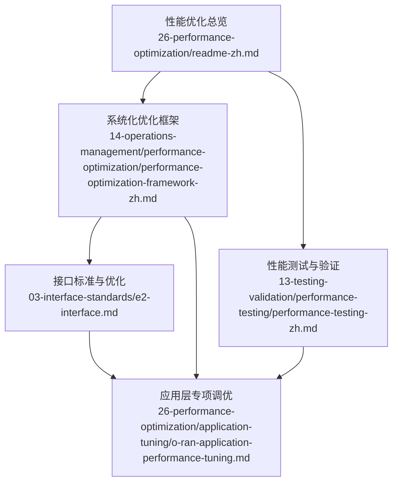
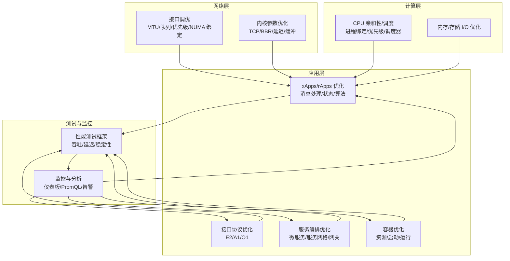
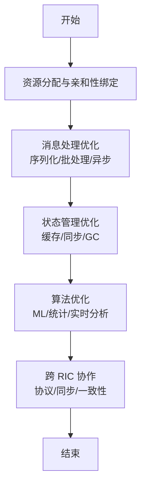
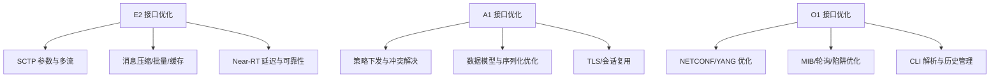
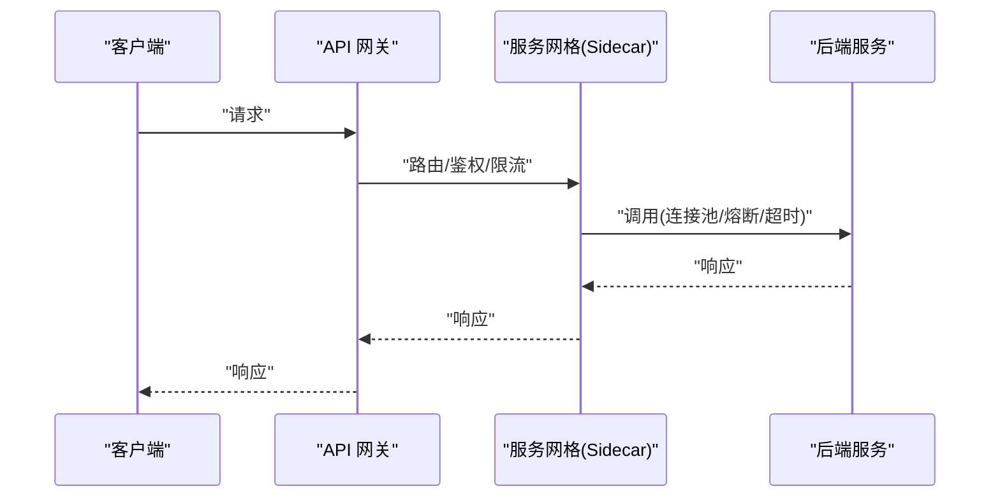
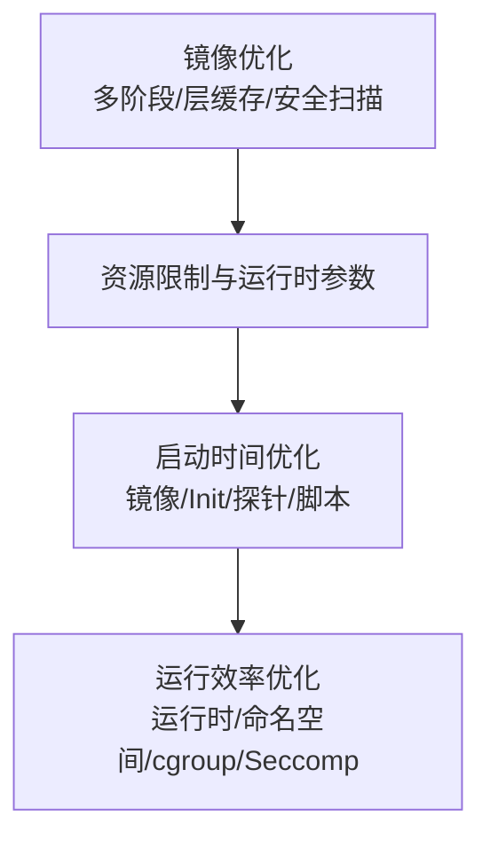
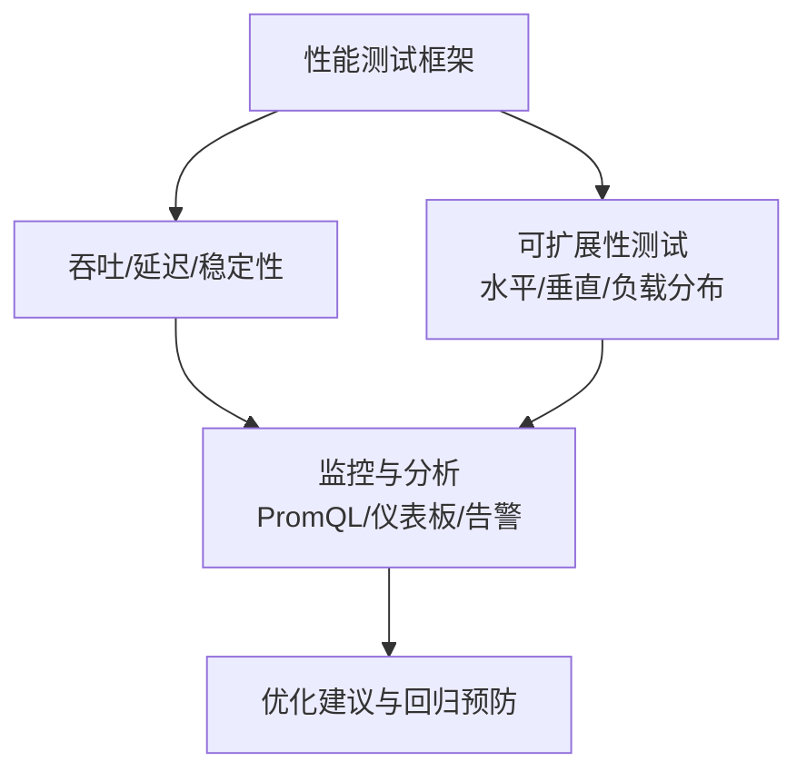
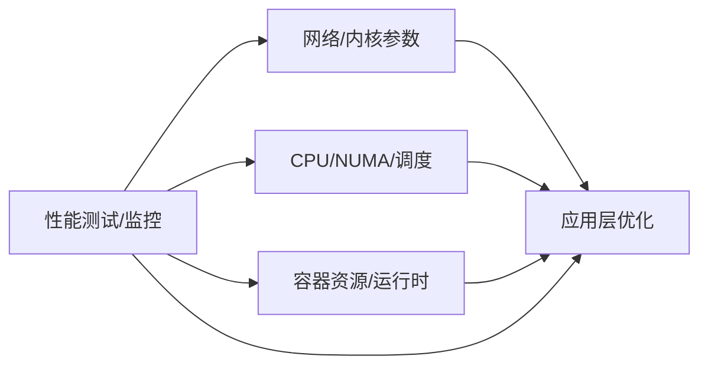

# 应用调优

<cite>
**本文引用的文件**
- [O-RAN 性能优化与调优](file://26-performance-optimization/readme-zh.md)
- [O-RAN 性能优化框架](file://14-operations-management/performance-optimization/performance-optimization-framework-zh.md)
- [O-RAN 性能测试](file://13-testing-validation/performance-testing/performance-testing-zh.md)
- [E2 接口](file://03-interface-standards/e2-interface.md)
- [O-RAN 应用性能调优](file://26-performance-optimization/application-tuning/o-ran-application-performance-tuning.md)
</cite>

## 目录
1. [简介](#简介)
2. [项目结构](#项目结构)
3. [核心组件](#核心组件)
4. [架构总览](#架构总览)
5. [详细组件分析](#详细组件分析)
6. [依赖关系分析](#依赖关系分析)
7. [性能考虑](#性能考虑)
8. [故障排查指南](#故障排查指南)
9. [结论](#结论)
10. [附录](#附录)

## 简介
本文件聚焦 O-RAN 应用层性能优化，围绕 RIC 应用（xApps/rApps）与接口协议（E2/A1/O1）的性能调优、服务编排优化（微服务调用链与服务网格）、容器性能优化（资源限制、启动时间与运行效率），以及结合实际场景的性能测试与调优最佳实践，形成系统化、可落地的应用层性能优化指导。

## 项目结构
本仓库与“应用调优”直接相关的知识主要分布在以下模块：
- 性能优化总览与方法论：26-performance-optimization/readme-zh.md
- 系统化性能优化框架（含网络、计算、应用层与监控）：14-operations-management/performance-optimization/performance-optimization-framework-zh.md
- 性能测试与验证（指标、场景、监控与分析）：13-testing-validation/performance-testing/performance-testing-zh.md
- 接口标准与性能优化要点（E2/A1/O1）：03-interface-standards/e2-interface.md（A1/O1相关内容可类推）
- 应用层专项调优（xApps/rApps、接口协议、服务编排、容器）：26-performance-optimization/application-tuning/o-ran-application-performance-tuning.md

**图表来源**
- [O-RAN 性能优化与调优](file://26-performance-optimization/readme-zh.md#L1-L67)
- [O-RAN 性能优化框架](file://14-operations-management/performance-optimization/performance-optimization-framework-zh.md#L1-L342)
- [O-RAN 性能测试](file://13-testing-validation/performance-testing/performance-testing-zh.md#L1-L327)
- [E2 接口](file://03-interface-standards/e2-interface.md#L1-L337)
- [O-RAN 应用性能调优](file://26-performance-optimization/application-tuning/o-ran-application-performance-tuning.md#L1-L266)

**章节来源**
- [O-RAN 性能优化与调优](file://26-performance-optimization/readme-zh.md#L1-L67)
- [O-RAN 性能优化框架](file://14-operations-management/performance-optimization/performance-optimization-framework-zh.md#L1-L342)
- [O-RAN 性能测试](file://13-testing-validation/performance-testing/performance-testing-zh.md#L1-L327)
- [E2 接口](file://03-interface-standards/e2-interface.md#L1-L337)
- [O-RAN 应用性能调优](file://26-performance-optimization/application-tuning/o-ran-application-performance-tuning.md#L1-L266)

## 核心组件
- RIC 应用优化：面向 Near-RT/Non-RT RIC 的 xApps/rApps，覆盖资源分配、消息处理、状态管理、算法优化与跨 RIC 协作。
- 接口协议优化：E2/A1/O1 接口的协议编解码、连接管理、订阅管理、错误恢复、策略下发与安全协议优化。
- 服务编排优化：微服务调用链优化、服务网格（Istio/Envoy）配置、可观测性与 API 网关性能。
- 容器性能优化：资源请求/限制、启动时间、运行效率、镜像优化与运行时配置。

**章节来源**
- [O-RAN 应用性能调优](file://26-performance-optimization/application-tuning/o-ran-application-performance-tuning.md#L6-L69)
- [O-RAN 应用性能调优](file://26-performance-optimization/application-tuning/o-ran-application-performance-tuning.md#L71-L129)
- [O-RAN 应用性能调优](file://26-performance-optimization/application-tuning/o-ran-application-performance-tuning.md#L131-L199)
- [O-RAN 应用性能调优](file://26-performance-optimization/application-tuning/o-ran-application-performance-tuning.md#L157-L177)

## 架构总览
应用层性能优化贯穿“网络—计算—应用—测试—运维”的闭环，形成“识别瓶颈—制定方案—验证效果—持续优化”的方法论。

**图表来源**
- [O-RAN 性能优化框架](file://14-operations-management/performance-optimization/performance-optimization-framework-zh.md#L8-L101)
- [O-RAN 性能优化框架](file://14-operations-management/performance-optimization/performance-optimization-framework-zh.md#L103-L234)
- [O-RAN 性能测试](file://13-testing-validation/performance-testing/performance-testing-zh.md#L60-L138)
- [O-RAN 应用性能调优](file://26-performance-optimization/application-tuning/o-ran-application-performance-tuning.md#L6-L69)

## 详细组件分析

### RIC 应用优化（xApps/rApps）
- 资源分配与亲和性：为 Near-RT/Non-RT RIC 组件绑定 CPU 核心、设置进程优先级，降低调度抖动。
- 消息处理优化：E2AP 消息序列化、Protocol Buffer 优化、批处理与异步处理，减少处理延迟。
- 状态管理：内存数据结构、缓存预热、状态同步与 GC 调优，提升一致性与吞吐。
- 算法优化：机器学习模型推理加速、统计计算优化、决策树剪枝与实时分析调优。
- 跨 RIC 协作：消息协议、数据同步、冲突解决与一致性模型选择；分布式模式（MapReduce/Actor/事件溯源/CQRS）与可观测性集成。

**图表来源**
- [O-RAN 应用性能调优](file://26-performance-optimization/application-tuning/o-ran-application-performance-tuning.md#L10-L69)

**章节来源**
- [O-RAN 应用性能调优](file://26-performance-optimization/application-tuning/o-ran-application-performance-tuning.md#L8-L69)

### 接口协议优化（E2/A1/O1）
- E2 接口优化要点：SCTP 参数、多流配置、消息压缩、批量处理、缓存机制；Near-RT 延迟与可靠性要求。
- A1 接口优化要点：策略下发效率、冲突解决、JSON Schema/数据模型优化、TLS 握手与会话复用。
- O1 接口优化要点：NETCONF/YANG 编译与会话管理、MIB 优化、轮询与陷阱处理、CLI 命令解析与历史管理。

**图表来源**
- [E2 接口](file://03-interface-standards/e2-interface.md#L131-L147)
- [O-RAN 应用性能调优](file://26-performance-optimization/application-tuning/o-ran-application-performance-tuning.md#L75-L129)

**章节来源**
- [E2 接口](file://03-interface-standards/e2-interface.md#L131-L147)
- [O-RAN 应用性能调优](file://26-performance-optimization/application-tuning/o-ran-application-performance-tuning.md#L71-L129)

### 服务编排优化（微服务调用链与服务网格）
- 服务网格（Istio/Envoy）：Sidecar 代理优化、连接池/负载均衡/熔断/重试/超时调优；遥测与安全策略。
- 微服务调用链：服务发现、DNS 解析、东西向/南北向流量治理；可观测性（分布式追踪/指标/日志）。
- API 网关：路由/粘性会话/健康检查/故障切换；限流/配额与缓存策略；认证/授权与 TLS 终止优化。

**图表来源**
- [O-RAN 应用性能调优](file://26-performance-optimization/application-tuning/o-ran-application-performance-tuning.md#L135-L199)

**章节来源**
- [O-RAN 应用性能调优](file://26-performance-optimization/application-tuning/o-ran-application-performance-tuning.md#L131-L199)

### 容器性能优化（资源限制、启动时间、运行效率）
- 资源限制：CPU/Memory/存储/网络带宽的 requests/limits 设定；GOGC/GOMAXPROCS 等运行时参数。
- 启动时间：镜像层数优化、多阶段构建、InitContainer 效率、就绪探针与启动脚本优化。
- 运行效率：容器运行时选择、命名空间与 cgroup 配置、Seccomp 策略；Kubernetes 调度与亲和性。

**图表来源**
- [O-RAN 性能优化框架](file://14-operations-management/performance-optimization/performance-optimization-framework-zh.md#L238-L300)
- [O-RAN 应用性能调优](file://26-performance-optimization/application-tuning/o-ran-application-performance-tuning.md#L157-L177)

**章节来源**
- [O-RAN 性能优化框架](file://14-operations-management/performance-optimization/performance-optimization-framework-zh.md#L238-L300)
- [O-RAN 应用性能调优](file://26-performance-optimization/application-tuning/o-ran-application-performance-tuning.md#L157-L177)

### 性能测试与验证（最佳实践）
- 测试类别：网络/资源/可扩展性；关键指标（吞吐、延迟、抖动、丢包、连接建立、API 响应、容器启动时间等）。
- 方法论：负载测试框架（持续吞吐、延迟画像、压力测试、环境扩展）、测试场景（峰值性能、延迟特征化、可扩展性验证）。
- 监控与分析：PromQL 指标、仪表板、异常检测、容量规划与自动化回归。

**图表来源**
- [O-RAN 性能测试](file://13-testing-validation/performance-testing/performance-testing-zh.md#L60-L138)
- [O-RAN 性能测试](file://13-testing-validation/performance-testing/performance-testing-zh.md#L244-L265)

**章节来源**
- [O-RAN 性能测试](file://13-testing-validation/performance-testing/performance-testing-zh.md#L6-L327)

## 依赖关系分析
- 网络与内核参数直接影响应用层接口协议与服务网格的吞吐与延迟。
- 计算层的 CPU/NUMA 亲和性与调度器设置决定 xApps/rApps 的实时性与稳定性。
- 容器资源与运行时配置影响整体系统资源占用与启动时间。
- 性能测试与监控为优化提供量化依据，并反馈到各层调优闭环。

**图表来源**
- [O-RAN 性能优化框架](file://14-operations-management/performance-optimization/performance-optimization-framework-zh.md#L8-L101)
- [O-RAN 性能优化框架](file://14-operations-management/performance-optimization/performance-optimization-framework-zh.md#L103-L234)
- [O-RAN 性能测试](file://13-testing-validation/performance-testing/performance-testing-zh.md#L60-L138)

**章节来源**
- [O-RAN 性能优化框架](file://14-operations-management/performance-optimization/performance-optimization-framework-zh.md#L1-L342)
- [O-RAN 性能测试](file://13-testing-validation/performance-testing/performance-testing-zh.md#L1-L327)

## 性能考虑
- 端到端时延与吞吐：结合接口协议优化与服务网格调优，确保 Near-RT/Non-RT 场景的 SLA。
- 资源配额与弹性：基于容量规划与可扩展性测试，设定合理的 requests/limits 与自动扩缩容策略。
- 可观测性与告警：统一监控与告警，实现异常检测与自动化恢复。
- 持续优化：定期回归测试、版本升级后的性能验证与优化效果跟踪。

[本节为通用指导，不直接分析具体文件]

## 故障排查指南
- 接口层面：E2/A1/O1 连接状态、消息吞吐与延迟、错误率与订阅状态；结合 SCTP 参数、多流配置与消息压缩策略进行定位。
- 应用层面：xApps/rApps 的 CPU/内存/GC 行为、消息处理队列长度、状态同步延迟；结合缓存预热与算法优化进行排查。
- 服务网格：Sidecar 代理资源占用、连接池/熔断/重试配置、遥测开销；结合路由与健康检查策略进行优化。
- 容器层面：镜像层过多导致启动慢、资源不足引发频繁 OOM、cgroup/Seccomp 导致性能退化；结合多阶段构建与运行时参数进行优化。

**章节来源**
- [E2 接口](file://03-interface-standards/e2-interface.md#L150-L189)
- [O-RAN 应用性能调优](file://26-performance-optimization/application-tuning/o-ran-application-performance-tuning.md#L135-L199)
- [O-RAN 性能优化框架](file://14-operations-management/performance-optimization/performance-optimization-framework-zh.md#L238-L300)

## 结论
通过系统化的性能优化框架、针对 RIC 应用与接口协议的专项优化、服务编排与容器的精细化调优，以及完善的性能测试与监控闭环，O-RAN 应用层可在低时延、高可靠与高扩展性的前提下实现最优性能与用户体验。

[本节为总结，不直接分析具体文件]

## 附录
- 方法论：性能基线建立、瓶颈识别、根因分析、优化方案制定与效果验证。
- 工具链：系统监控、网络分析、性能剖析、日志分析与可视化。
- 最佳实践：持续优化、回归测试、上线前验证与容量规划。

**章节来源**
- [O-RAN 性能优化与调优](file://26-performance-optimization/readme-zh.md#L26-L67)
- [O-RAN 性能优化框架](file://14-operations-management/performance-optimization/performance-optimization-framework-zh.md#L302-L342)