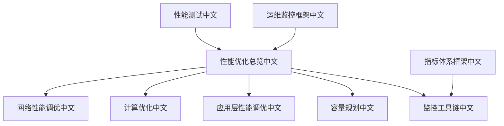
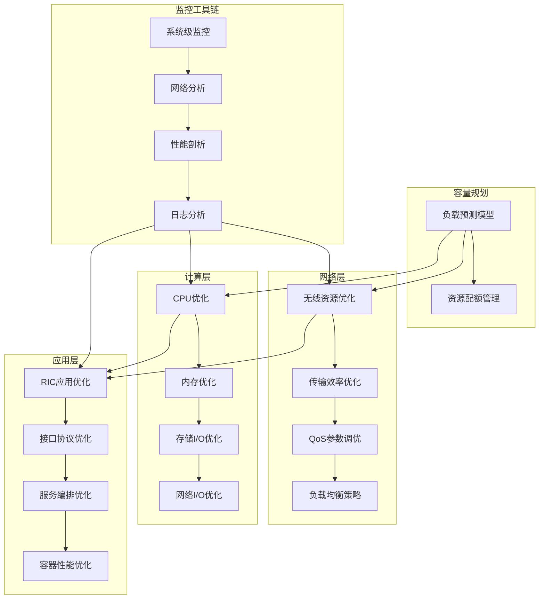
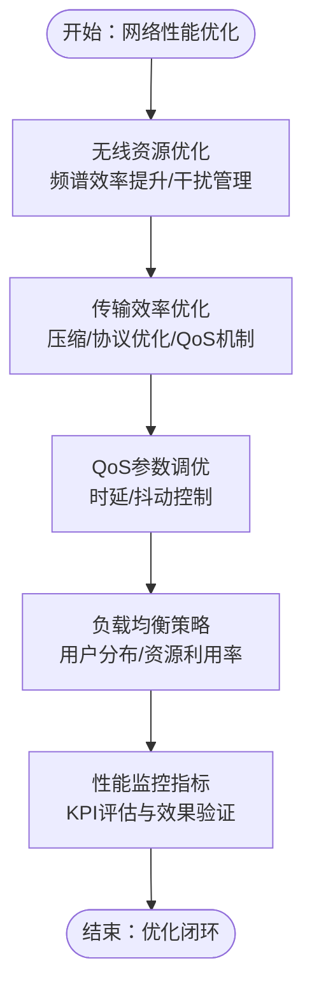
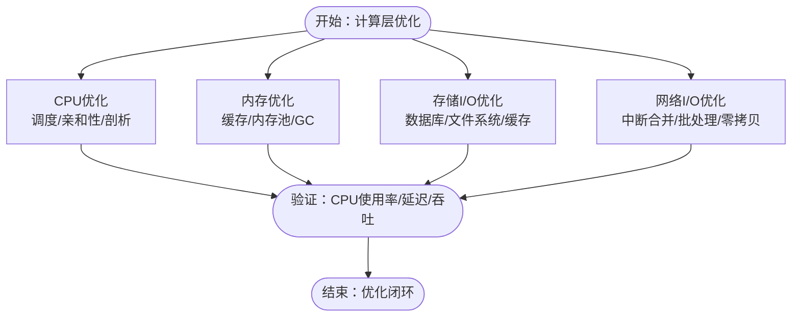
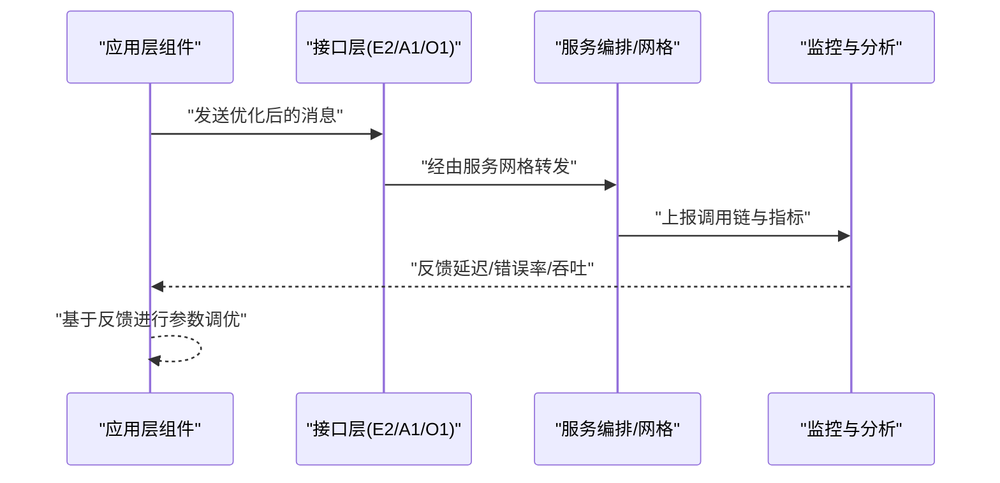
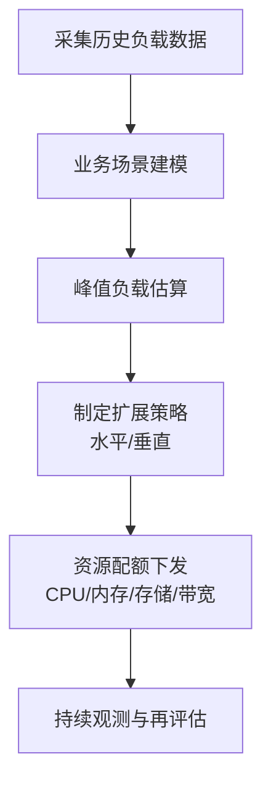
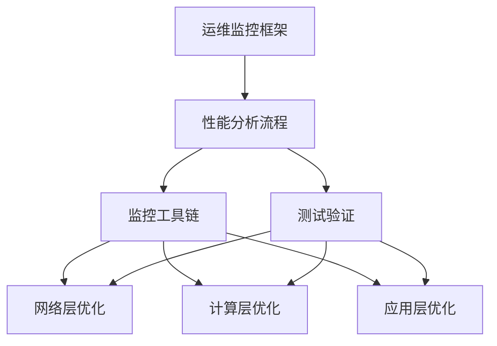

# 性能优化

<cite>
**本文引用的文件**
- [性能优化总览（中文）](file://26-performance-optimization/readme-zh.md)
- [网络性能调优（中文）](file://26-performance-optimization/network-optimization/network-performance-tuning.md)
- [计算优化（中文）](file://26-performance-optimization/compute-optimization/o-ran-compute-optimization-zh.md)
- [应用层性能调优（中文）](file://26-performance-optimization/application-tuning/o-ran-application-performance-tuning-zh.md)
- [容量规划（中文）](file://26-performance-optimization/capacity-planning/o-ran-capacity-planning-zh.md)
- [监控工具链（中文）](file://26-performance-optimization/monitoring-tools/o-ran-monitoring-tools.md)
- [性能测试（中文）](file://13-testing-validation/performance-testing/performance-testing-zh.md)
- [运维监控框架（中文）](file://14-operations-management/performance-optimization/performance-optimization-framework-zh.md)
- [指标体系框架（中文）](file://28-monitoring-alerting/metric-system/monitoring-metrics-framework.md)
</cite>

## 目录
1. [引言](#引言)
2. [项目结构](#项目结构)
3. [核心组件](#核心组件)
4. [架构总览](#架构总览)
5. [详细组件分析](#详细组件分析)
6. [依赖关系分析](#依赖关系分析)
7. [性能考量](#性能考量)
8. [故障排查指南](#故障排查指南)
9. [结论](#结论)
10. [附录](#附录)

## 引言
本文件面向O-RAN系统的性能优化与调优，围绕网络层、计算层、应用层的优化策略，结合容量规划与监控工具链，形成可落地的优化方法论。内容来源于仓库中关于性能优化、网络优化、计算优化、应用调优、容量规划、监控工具以及性能测试的相关文档，旨在帮助读者建立从基线到验证的闭环优化流程，并在不同层面采取针对性措施以提升整体系统性能。

## 项目结构
该仓库将O-RAN性能优化相关内容组织在“26-performance-optimization”目录下，覆盖网络优化、计算优化、应用层调优、容量规划与监控工具链等主题；同时配合测试验证、运维框架与指标体系文档，形成完整的性能优化知识体系。

图表来源
- [性能优化总览（中文）](file://26-performance-optimization/readme-zh.md#L1-L67)
- [网络性能调优（中文）](file://26-performance-optimization/network-optimization/network-performance-tuning.md#L1-L98)
- [计算优化（中文）](file://26-performance-optimization/compute-optimization/o-ran-compute-optimization-zh.md)
- [应用层性能调优（中文）](file://26-performance-optimization/application-tuning/o-ran-application-performance-tuning-zh.md)
- [容量规划（中文）](file://26-performance-optimization/capacity-planning/o-ran-capacity-planning-zh.md)
- [监控工具链（中文）](file://26-performance-optimization/monitoring-tools/o-ran-monitoring-tools.md)
- [性能测试（中文）](file://13-testing-validation/performance-testing/performance-testing-zh.md)
- [运维监控框架（中文）](file://14-operations-management/performance-optimization/performance-optimization-framework-zh.md)
- [指标体系框架（中文）](file://28-monitoring-alerting/metric-system/monitoring-metrics-framework.md)

章节来源
- [性能优化总览（中文）](file://26-performance-optimization/readme-zh.md#L1-L67)

## 核心组件
- 网络层优化：无线资源优化（频谱效率、干扰管理）、传输效率优化（压缩、协议优化、路由优化）、QoS参数调优（时延、抖动、丢包率）、负载均衡策略（用户分布优化、资源利用率提升）。
- 计算层优化：CPU优化（调度策略、亲和性绑定、性能分析）、内存优化（缓存策略、内存池、GC）、存储I/O优化（数据库、文件系统、缓存）、网络I/O优化（中断合并、批处理、零拷贝）。
- 应用层优化：RIC应用（xApps/rApps性能调优、算法优化）、接口协议优化（E2/A1/O1）、服务编排优化（微服务调用链、服务网格）、容器性能优化（资源限制、启动时间、运行效率）。
- 容量规划：负载预测模型（历史数据、业务场景建模、峰值估算）、资源配额管理（CPU、内存、存储、网络带宽）。
- 监控工具链：系统级监控（top/htop/iotop/iftop）、网络分析（tcpdump/Wireshark/iperf3）、性能剖析（perf/strace/gdb/火焰图）、日志分析（ELK/Prometheus/Grafana）。

章节来源
- [性能优化总览（中文）](file://26-performance-optimization/readme-zh.md#L6-L67)

## 架构总览
性能优化贯穿系统全栈，形成“观测—分析—优化—验证”的闭环。网络层负责端到端的低时延与高可靠，计算层提供稳定的资源供给，应用层承载业务逻辑与算法，容量规划确保资源与负载匹配，监控工具链提供实时与历史的性能洞察。

图表来源
- [性能优化总览（中文）](file://26-performance-optimization/readme-zh.md#L6-L67)
- [网络性能调优（中文）](file://26-performance-optimization/network-optimization/network-performance-tuning.md#L1-L98)
- [计算优化（中文）](file://26-performance-optimization/compute-optimization/o-ran-compute-optimization-zh.md)
- [应用层性能调优（中文）](file://26-performance-optimization/application-tuning/o-ran-application-performance-tuning-zh.md)
- [容量规划（中文）](file://26-performance-optimization/capacity-planning/o-ran-capacity-planning-zh.md)
- [监控工具链（中文）](file://26-performance-optimization/monitoring-tools/o-ran-monitoring-tools.md)

## 详细组件分析

### 网络层优化
- 无线资源优化：通过载波聚合、MCS自适应、HARQ重传、多天线技术等手段提升频谱效率；结合ICIC、功率控制、波束赋形、干扰随机化降低干扰。
- 传输效率优化：采用ROHC头部压缩、负载数据压缩、协议栈优化与算法适配；用户面优化（GTP-U简化）、控制面优化（NAS/S1AP消息优化）、QoS机制（5QI精细化配置）、会话管理（PDU Session优化）。
- QoS参数调优：DRB配置优化、调度策略调整、缓冲区管理、优先级映射以降低时延；时间同步、WFQ/SP调度、自适应缓冲区、令牌桶整形控制抖动。
- 负载均衡策略：移动性管理优化（切换参数、负载均衡算法、小区间协调）、资源分配策略（动态资源池、负载预测、容量规划），并辅以统计复用增益、动态调度、智能休眠与容量弹性。

图表来源
- [网络性能调优（中文）](file://26-performance-optimization/network-optimization/network-performance-tuning.md#L6-L98)

章节来源
- [网络性能调优（中文）](file://26-performance-optimization/network-optimization/network-performance-tuning.md#L6-L98)

### 计算层优化
- CPU优化：调度策略优化、NUMA亲和性绑定、热点分析与火焰图剖析，定位高占用路径。
- 内存优化：缓存策略（LRU/LFU）、内存池管理、垃圾回收调优（GC暂停时间、晋升年龄），减少碎片与停顿。
- 存储I/O优化：数据库查询优化、索引与执行计划调优、文件系统参数（读写缓存、队列深度）、SSD/RAID策略、缓存命中率提升。
- 网络I/O优化：中断合并、NAPI/BQL批处理、零拷贝（AF_PACKET环形缓冲、DPDK）、收发队列亲和与NUMA对齐。

图表来源
- [计算优化（中文）](file://26-performance-optimization/compute-optimization/o-ran-compute-optimization-zh.md)

章节来源
- [计算优化（中文）](file://26-performance-optimization/compute-optimization/o-ran-compute-optimization-zh.md)

### 应用层优化
- RIC应用优化：xApps/rApps算法优化、事件驱动与异步处理、线程池与并发模型调优、序列化/反序列化开销降低。
- 接口协议优化：E2/A1/O1接口的消息压缩、批量处理、连接复用、超时与重试策略优化。
- 服务编排优化：微服务调用链追踪（OTel/Prometheus）、熔断降级、限流与排队策略、服务网格（mTLS、HPA、资源配额）。
- 容器性能优化：CPU/内存资源限制与请求、启动探针（liveness/readiness）、镜像分层优化、容器网络（CNI）与存储插件选择。

图表来源
- [应用层性能调优（中文）](file://26-performance-optimization/application-tuning/o-ran-application-performance-tuning-zh.md)
- [监控工具链（中文）](file://26-performance-optimization/monitoring-tools/o-ran-monitoring-tools.md)

章节来源
- [应用层性能调优（中文）](file://26-performance-optimization/application-tuning/o-ran-application-performance-tuning-zh.md)

### 容量规划
- 负载预测模型：基于历史流量与用户行为模式，构建业务场景模型，估算峰值负载，确定水平/垂直扩展策略。
- 资源配额管理：CPU配额分配给核心组件、内存使用上限、存储与日志配额、网络带宽分配与流量控制，避免资源争抢导致的性能退化。

图表来源
- [容量规划（中文）](file://26-performance-optimization/capacity-planning/o-ran-capacity-planning-zh.md)

章节来源
- [容量规划（中文）](file://26-performance-optimization/capacity-planning/o-ran-capacity-planning-zh.md)

### 监控工具链
- 工具链组成：系统级（top/htop/iotop/iftop）、网络分析（tcpdump/Wireshark/iperf3）、性能剖析（perf/strace/gdb/火焰图）、日志分析（ELK/Prometheus/Grafana）。
- 指标体系：KPI分类（无线性能、传输性能、QoS指标、负载均衡），明确优化目标与监控频率，支撑基线建立、优化前后对比与长期趋势分析。

图表来源
- [监控工具链（中文）](file://26-performance-optimization/monitoring-tools/o-ran-monitoring-tools.md)
- [指标体系框架（中文）](file://28-monitoring-alerting/metric-system/monitoring-metrics-framework.md)

章节来源
- [监控工具链（中文）](file://26-performance-optimization/monitoring-tools/o-ran-monitoring-tools.md)
- [指标体系框架（中文）](file://28-monitoring-alerting/metric-system/monitoring-metrics-framework.md)

## 依赖关系分析
- 方法论闭环：性能分析流程（基线建立、瓶颈识别、根因分析、优化方案、效果验证）贯穿各层优化，确保可追溯与可重复。
- 工具链协同：监控工具链为优化提供数据基础，测试验证用于回归与基准评估，运维框架提供流程规范与责任分工。
- 组件耦合：网络层与应用层存在直接交互（接口协议、QoS），计算层为应用层提供资源保障，容量规划影响资源可用性与成本。

图表来源
- [性能优化总览（中文）](file://26-performance-optimization/readme-zh.md#L26-L67)
- [性能测试（中文）](file://13-testing-validation/performance-testing/performance-testing-zh.md)
- [运维监控框架（中文）](file://14-operations-management/performance-optimization/performance-optimization-framework-zh.md)

章节来源
- [性能优化总览（中文）](file://26-performance-optimization/readme-zh.md#L26-L67)

## 性能考量
- 基线建立：在正常运行状态下收集关键指标，形成可对比的性能基线。
- 瓶颈识别：利用系统级监控与性能剖析工具定位CPU/内存/存储/网络瓶颈。
- 根因分析：结合指标体系与日志分析，确认是资源不足、算法缺陷还是配置不当。
- 优化方案：针对瓶颈类型选择相应优化策略（调度、缓存、压缩、限流等）。
- 效果验证：对比优化前后指标，关注长期趋势与回归测试，确保稳定性。

## 故障排查指南
- 快速定位：使用系统级监控与网络分析工具快速判断是CPU/内存/磁盘/网络问题。
- 深入剖析：借助性能剖析工具与火焰图，定位热点函数与阻塞点。
- 日志关联：通过日志分析与指标联动，还原问题发生时的上下文。
- 回归验证：在修复后进行基准测试与压力测试，确保问题不再复现。

章节来源
- [监控工具链（中文）](file://26-performance-optimization/monitoring-tools/o-ran-monitoring-tools.md)
- [性能测试（中文）](file://13-testing-validation/performance-testing/performance-testing-zh.md)

## 结论
O-RAN性能优化需要系统化的方法论与工具链支撑。通过网络层的无线与传输优化、计算层的资源与I/O优化、应用层的服务与接口优化，结合容量规划与监控工具链，形成从观测到验证的闭环。建议在部署初期即建立基线与监控体系，定期进行性能评估与回归测试，持续迭代优化策略，确保系统在高负载下仍保持稳定与高效。

## 附录
- 性能测试与基准测试：参考性能测试文档，制定测试场景、负载模型与评估指标，识别瓶颈并验证优化效果。
- 运维监控框架：依据运维监控框架，明确职责分工、流程规范与告警策略，保障优化过程的可操作性与可追溯性。
- 指标体系：基于指标体系框架，统一KPI定义与监控口径，确保跨团队协作的一致性与准确性。

章节来源
- [性能测试（中文）](file://13-testing-validation/performance-testing/performance-testing-zh.md)
- [运维监控框架（中文）](file://14-operations-management/performance-optimization/performance-optimization-framework-zh.md)
- [指标体系框架（中文）](file://28-monitoring-alerting/metric-system/monitoring-metrics-framework.md)