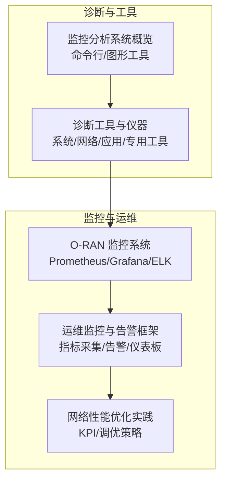
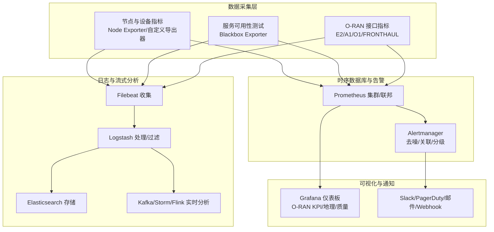
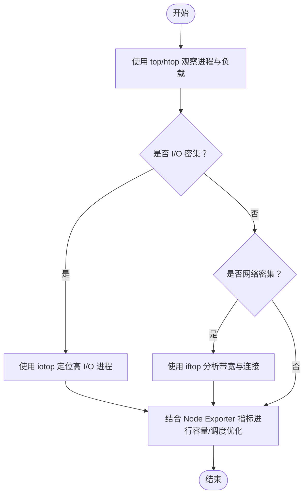
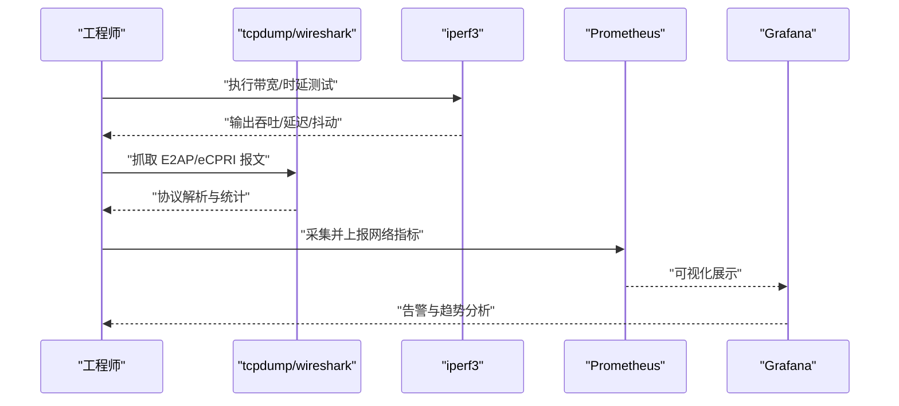
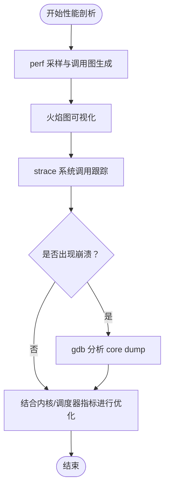
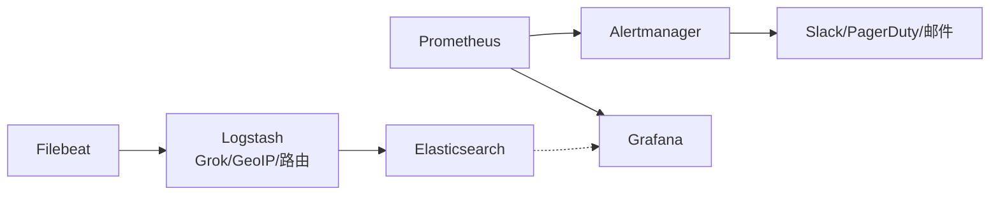
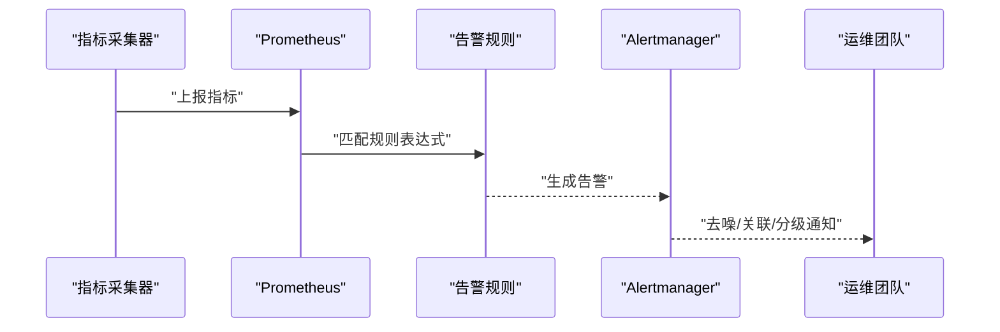
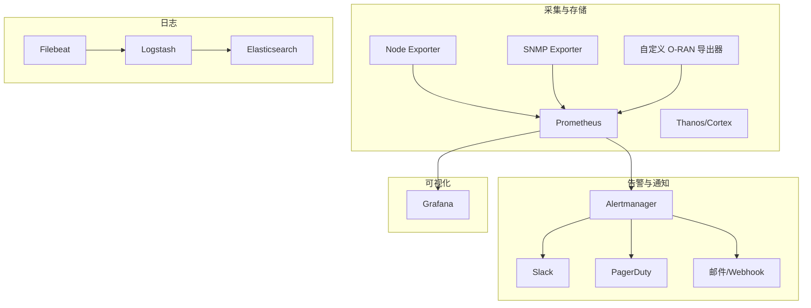
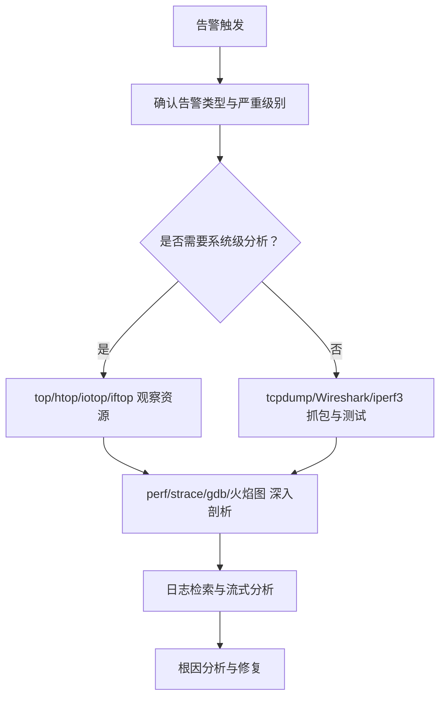

# 监控工具

<cite>
**本文引用的文件**
- [O-RAN 监控系统.md](file://22-tool-platforms/monitoring-systems/o-ran-monitoring-systems.md)
- [O-RAN 运维监控与告警系统.md](file://14-operations-management/monitoring-alerting/operations-monitoring-framework.md)
- [O-RAN 诊断工具与仪器.md](file://27-troubleshooting-diagnosis/diagnostic-tools/o-ran-diagnostic-instrumentation.md)
- [O-RAN 网络性能优化实践.md](file://26-performance-optimization/network-optimization/network-performance-tuning.md)
- [监控分析系统.md](file://22-tool-platforms/readme-zh.md)
</cite>

## 目录
1. [简介](#简介)
2. [项目结构](#项目结构)
3. [核心组件](#核心组件)
4. [架构总览](#架构总览)
5. [详细组件分析](#详细组件分析)
6. [依赖关系分析](#依赖关系分析)
7. [性能考量](#性能考量)
8. [故障排查指南](#故障排查指南)
9. [结论](#结论)
10. [附录](#附录)

## 简介
本文件面向 O-RAN（Open RAN）监控工具链建设，围绕系统级监控、网络分析、性能剖析与日志分析四大方向，结合仓库中已有的监控体系、运维框架与诊断工具文档，给出可操作的工具使用方法、最佳实践与运维建议。重点覆盖以下工具与能力：
- 系统级监控：top、htop、iotop、iftop 等
- 网络分析：tcpdump、Wireshark、iperf3 等
- 性能剖析：perf、strace、gdb、火焰图等
- 日志分析：ELK Stack、Prometheus、Grafana 等
- 结合 O-RAN 特定接口与组件（如 E2、A1、O1、近/远 RT RIC、CU/DU/RU）进行指标采集与可视化

## 项目结构
本仓库中与监控工具链直接相关的内容主要分布在如下位置：
- 22-tool-platforms/monitoring-systems：O-RAN 监控系统与工具链配置示例（Prometheus、Grafana、ELK）
- 14-operations-management/monitoring-alerting：监控架构、指标采集与告警规则
- 27-troubleshooting-diagnosis/diagnostic-tools：系统/网络/应用诊断工具清单与使用场景
- 26-performance-optimization/network-optimization：网络层性能优化实践与 KPI
- 22-tool-platforms/readme-zh：监控分析系统概览与工具分类

**章节来源**
- file://22-tool-platforms/monitoring-systems/o-ran-monitoring-systems.md#L1-L545
- file://14-operations-management/monitoring-alerting/operations-monitoring-framework.md#L1-L909
- file://27-troubleshooting-diagnosis/diagnostic-tools/o-ran-diagnostic-instrumentation.md#L1-L343
- file://26-performance-optimization/network-optimization/network-performance-tuning.md#L1-L98
- file://22-tool-platforms/readme-zh.md#L46-L78

## 核心组件
- 指标采集与存储：Prometheus 及其联邦、长期存储（Thanos/Cortex），节点/设备/自定义 O-RAN 指标导出器
- 实时告警与通知：Alertmanager 的路由、去噪、关联与分级通知
- 可视化与仪表板：Grafana 面向 O-RAN 的 KPI 仪表板与告警联动
- 日志采集与分析：Filebeat → Logstash → Elasticsearch；实时流处理（Kafka/Storm/Flink）与异常检测
- 运维监控框架：分层指标采集（基础设施/应用/业务）、阈值规则、告警去重与关联
- 诊断工具链：系统级（top/htop/iotop/iftop）、网络级（tcpdump/Wireshark/iperf3）、应用级（perf/strace/gdb/火焰图）

**章节来源**
- file://22-tool-platforms/monitoring-systems/o-ran-monitoring-systems.md#L10-L78
- file://14-operations-management/monitoring-alerting/operations-monitoring-framework.md#L46-L260
- file://27-troubleshooting-diagnosis/diagnostic-tools/o-ran-diagnostic-instrumentation.md#L66-L272
- file://22-tool-platforms/readme-zh.md#L46-L78

## 架构总览
下图展示了 O-RAN 监控工具链的整体架构：从底层系统与网络资源，到应用与业务 KPI，再到可视化与告警通知，以及日志与流式分析。

**图表来源**
- [O-RAN 监控系统.md](file://22-tool-platforms/monitoring-systems/o-ran-monitoring-systems.md#L10-L78)
- [O-RAN 监控系统.md](file://22-tool-platforms/monitoring-systems/o-ran-monitoring-systems.md#L135-L211)
- [O-RAN 监控系统.md](file://22-tool-platforms/monitoring-systems/o-ran-monitoring-systems.md#L355-L413)

**章节来源**
- file://22-tool-platforms/monitoring-systems/o-ran-monitoring-systems.md#L10-L78
- file://22-tool-platforms/monitoring-systems/o-ran-monitoring-systems.md#L135-L211
- file://22-tool-platforms/monitoring-systems/o-ran-monitoring-systems.md#L355-L413

## 详细组件分析

### 系统级监控工具链（top/htop/iotop/iftop）
- 使用场景
  - 实时观察 CPU/内存/IO/网络占用，快速定位资源瓶颈
  - 结合 O-RAN 组件（如 O-DU/O-CU/Near-RT RIC）进程状态与负载
- 工具能力
  - top/htop：进程实时排序、负载平均值、上下文切换速率
  - iotop：实时 I/O 使用情况，识别高 I/O 进程
  - iftop：按主机/端口统计带宽，定位异常流量
- O-RAN 关联
  - 在 CU/DU/RU 设备上，结合 E2/A1/O1 接口的吞吐与延迟指标，定位是 CPU、内存还是网络瓶颈
  - 与 Prometheus 的 Node Exporter 指标联动，形成“实时观察 + 持续采集”的闭环

**章节来源**
- file://27-troubleshooting-diagnosis/diagnostic-tools/o-ran-diagnostic-instrumentation.md#L206-L272
- file://26-performance-optimization/compute-optimization/o-ran-compute-optimization.md#L61-L112
- file://22-tool-platforms/readme-zh.md#L66-L78

### 网络分析工具链（tcpdump/Wireshark/iperf3）
- 使用场景
  - 端到端连通性验证、路径追踪、丢包/抖动/时延测量
  - 协议层面的报文分析（E2AP/eCPRI/UDP/TCP），定位协议异常
- 工具能力
  - tcpdump：命令行抓包，支持过滤与离线分析
  - Wireshark：GUI 协议分析器，支持插件与统计报告
  - iperf3：双向带宽测试，评估链路性能
- O-RAN 关联
  - E2 接口消息时延与丢包、FRONTHAUL 链路抖动与带宽余量
  - 与 Prometheus 的 Blackbox Exporter、Grafana 仪表板联动

**章节来源**
- file://27-troubleshooting-diagnosis/diagnostic-tools/o-ran-diagnostic-instrumentation.md#L134-L202
- file://22-tool-platforms/monitoring-systems/o-ran-monitoring-systems.md#L10-L78

### 性能剖析工具链（perf/strace/gdb/火焰图）
- 使用场景
  - CPU 热点定位、系统调用跟踪、内核函数跟踪、崩溃现场分析
- 工具能力
  - perf：硬件事件计数、软件事件、调用图生成、火焰图可视化
  - strace：系统调用跟踪，定位阻塞点
  - gdb：核心转储调试，定位崩溃原因
  - 火焰图：热点函数层级展示，快速识别热点模块
- O-RAN 关联
  - Near-RT RIC 的响应时间异常、xApp/rApp 的 CPU 占用异常、内核调度与中断问题

**章节来源**
- file://27-troubleshooting-diagnosis/diagnostic-tools/o-ran-diagnostic-instrumentation.md#L206-L272
- file://26-performance-optimization/compute-optimization/o-ran-compute-optimization.md#L61-L112

### 日志分析工具链（ELK Stack/Prometheus/Grafana）
- 使用场景
  - 结构化日志采集、清洗、存储与检索；实时流式分析与异常检测；可视化与告警
- 工具能力
  - ELK：Filebeat 收集、Logstash Grok 解析、GeoIP 增强、Elasticsearch 存储与索引生命周期管理
  - Prometheus：指标采集、规则与告警、联邦与长期存储
  - Grafana：O-RAN 专属仪表板（E2 时延、用户面吞吐、RIC 性能）
- O-RAN 关联
  - E2 协议日志分类、组件健康度、跨站点指标聚合与告警路由

**图表来源**
- [O-RAN 监控系统.md](file://22-tool-platforms/monitoring-systems/o-ran-monitoring-systems.md#L135-L211)
- [O-RAN 监控系统.md](file://22-tool-platforms/monitoring-systems/o-ran-monitoring-systems.md#L10-L78)

**章节来源**
- file://22-tool-platforms/monitoring-systems/o-ran-monitoring-systems.md#L135-L211
- file://22-tool-platforms/monitoring-systems/o-ran-monitoring-systems.md#L10-L78

### 运维监控框架与告警系统
- 指标采集分层：基础设施/应用/业务三层指标，覆盖 CPU/内存/磁盘/网络、O-RAN 服务与接口、KPI/SLA/QoS/业务影响
- 告警规则：阈值触发、持续时间、严重级别；与 Alertmanager 的去噪、关联与分级路由
- 仪表板：实时 KPI、地理分布、质量与趋势；与 Prometheus/Grafana 集成

**图表来源**
- [O-RAN 运维监控与告警系统.md](file://14-operations-management/monitoring-alerting/operations-monitoring-framework.md#L46-L260)
- [O-RAN 监控系统.md](file://22-tool-platforms/monitoring-systems/o-ran-monitoring-systems.md#L355-L413)

**章节来源**
- file://14-operations-management/monitoring-alerting/operations-monitoring-framework.md#L46-L260
- file://22-tool-platforms/monitoring-systems/o-ran-monitoring-systems.md#L355-L413

## 依赖关系分析
- 指标采集与存储：Prometheus 依赖 Node Exporter、SNMP Exporter、自定义 O-RAN 导出器；支持联邦与长期存储
- 告警与通知：Alertmanager 依赖 Prometheus；通过 Slack/PagerDuty/邮件/Webhook 进行通知
- 可视化：Grafana 依赖 Prometheus；支持面板模板与告警联动
- 日志：Filebeat 依赖网络/文件输入；Logstash 依赖 Grok/GeoIP 插件；Elasticsearch 依赖安全与索引策略
- 诊断工具：top/htop/iotop/iftop 与 Prometheus 指标互补；tcpdump/Wireshark/iperf3 与 Prometheus/Grafana 联动

**图表来源**
- [O-RAN 监控系统.md](file://22-tool-platforms/monitoring-systems/o-ran-monitoring-systems.md#L10-L78)
- [O-RAN 监控系统.md](file://22-tool-platforms/monitoring-systems/o-ran-monitoring-systems.md#L135-L211)

**章节来源**
- file://22-tool-platforms/monitoring-systems/o-ran-monitoring-systems.md#L10-L78
- file://22-tool-platforms/monitoring-systems/o-ran-monitoring-systems.md#L135-L211

## 性能考量
- 网络层优化：频谱效率、干扰管理、数据压缩、协议优化、QoS 参数调优、负载均衡与资源利用率提升
- 指标监控：建立 KPI 基线，设定监控频率，进行优化前后对比与长期趋势分析
- 工具协同：top/htop/iotop/iftop 与 Prometheus/Grafana 的互补，tcpdump/Wireshark/iperf3 与指标的联动

**章节来源**
- file://26-performance-optimization/network-optimization/network-performance-tuning.md#L1-L98
- file://27-troubleshooting-diagnosis/diagnostic-tools/o-ran-diagnostic-instrumentation.md#L134-L202

## 故障排查指南
- 快速定位
  - 使用 top/htop/iotop/iftop 快速判断是 CPU/内存/I/O/网络瓶颈
  - 使用 tcpdump/Wireshark/iperf3 对接 E2/Fronthaul 链路进行协议与性能验证
- 告警与根因
  - 通过 Alertmanager 的去噪、关联与分级，结合运维框架的阈值规则，快速收敛问题
  - 使用 strace/perf/gdb/火焰图进行系统调用与热点分析，定位崩溃或性能退化
- 日志与流式分析
  - 通过 Filebeat/Logstash/Elasticsearch 进行结构化检索与地理/协议增强
  - 使用 Kafka/Storm/Flink 进行实时异常检测与预测性维护

**章节来源**
- file://14-operations-management/monitoring-alerting/operations-monitoring-framework.md#L262-L486
- file://27-troubleshooting-diagnosis/diagnostic-tools/o-ran-diagnostic-instrumentation.md#L66-L272
- file://22-tool-platforms/monitoring-systems/o-ran-monitoring-systems.md#L135-L211

## 结论
通过将系统级监控（top/htop/iotop/iftop）、网络分析（tcpdump/Wireshark/iperf3）、性能剖析（perf/strace/gdb/火焰图）与日志分析（ELK/Prometheus/Grafana）有机整合，并结合 O-RAN 特定接口与组件的指标采集与可视化，可以构建一套覆盖全栈的监控工具链。配合运维监控框架与告警系统，能够实现从“实时观察”到“持续观测”再到“预测性维护”的闭环，支撑 O-RAN 网络的稳定运行与持续优化。

## 附录
- 工具分类与用途概览参见“监控分析系统”文档中的分类说明
- O-RAN 专用仪表板与告警规则可参考“监控系统”文档中的示例配置

**章节来源**
- file://22-tool-platforms/readme-zh.md#L46-L78
- file://22-tool-platforms/monitoring-systems/o-ran-monitoring-systems.md#L10-L78