# 网络优化

<cite>
**本文引用的文件**
- [网络性能调优实践](file://26-performance-optimization/network-optimization/network-performance-tuning.md)
- [性能优化框架](file://14-operations-management/performance-optimization/performance-optimization-framework.md)
- [性能测试](file://13-testing-validation/performance-testing/performance-testing.md)
- [监控系统](file://22-tool-platforms/monitoring-systems/o-ran-monitoring-systems.md)
- [网络故障排除](file://27-troubleshooting-diagnosis/network-issues/o-ran-network-troubleshooting-zh.md)
- [诊断工具](file://27-troubleshooting-diagnosis/diagnostic-tools/o-ran-diagnostic-instrumentation.md)
- [应用性能调优](file://26-performance-optimization/application-tuning/o-ran-application-performance-tuning.md)
- [容量规划](file://26-performance-optimization/capacity-planning/o-ran-capacity-planning.md)
- [O-RAN DU](file://02-core-components/o-du.md)
- [O-RAN RIC开发](file://07-ric-development/readme.md)
- [O-RAN管理平台](file://22-tool-platforms/management-platforms/o-ran-management-platforms-zh.md)
- [O-RAN工具程序](file://22-tool-platforms/utility-programs/o-ran-utility-programs-zh.md)
</cite>

## 目录
1. [简介](#简介)
2. [项目结构](#项目结构)
3. [核心组件](#核心组件)
4. [架构总览](#架构总览)
5. [详细组件分析](#详细组件分析)
6. [依赖关系分析](#依赖关系分析)
7. [性能考量](#性能考量)
8. [故障排查指南](#故障排查指南)
9. [结论](#结论)
10. [附录](#附录)

## 简介
本文件面向O-RAN网络优化场景，围绕无线资源优化（频谱效率、干扰管理、功率控制）、传输效率优化（数据压缩、协议优化、路由优化）、QoS参数调优（时延、抖动、丢包率）以及负载均衡策略（用户分布、资源利用率），结合实际测试与监控工具，提供系统化的调优方法论与实操建议。文档同时给出性能测试流程、自动化优化与持续监控的最佳实践，帮助运营商在部署与运维阶段实现稳定、高效、可扩展的O-RAN网络。

## 项目结构
该仓库以主题域划分，网络优化相关内容主要分布在以下目录：
- 26-performance-optimization：性能优化与调优方法论、应用层调优、容量规划
- 14-operations-management：性能优化框架（内核、NUMA、进程亲和等）
- 13-testing-validation：性能测试方法与测试环境
- 22-tool-platforms：监控系统、管理平台、工具程序
- 27-troubleshooting-diagnosis：网络故障排除与诊断工具
- 02-core-components、07-ric-development：RAN组件与RIC开发相关优化点

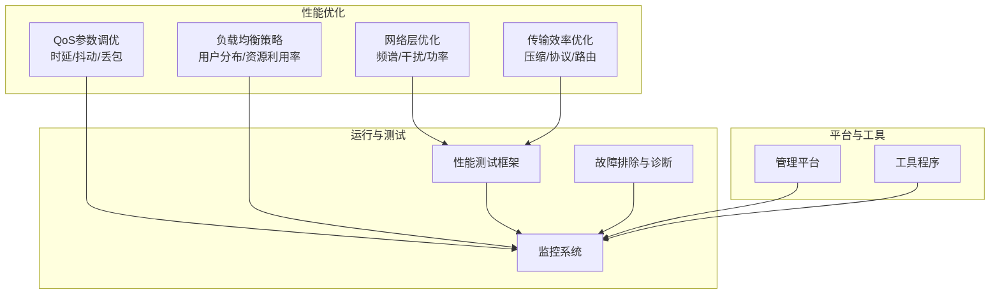

**图表来源**
- [网络性能调优实践](file://26-performance-optimization/network-optimization/network-performance-tuning.md#L1-L98)
- [性能优化框架](file://14-operations-management/performance-optimization/performance-optimization-framework.md#L1-L650)
- [性能测试](file://13-testing-validation/performance-testing/performance-testing.md#L1-L327)
- [监控系统](file://22-tool-platforms/monitoring-systems/o-ran-monitoring-systems.md#L1-L545)
- [网络故障排除](file://27-troubleshooting-diagnosis/network-issues/o-ran-network-troubleshooting-zh.md#L188-L278)
- [诊断工具](file://27-troubleshooting-diagnosis/diagnostic-tools/o-ran-diagnostic-instrumentation.md#L134-L202)
- [O-RAN管理平台](file://22-tool-platforms/management-platforms/o-ran-management-platforms-zh.md#L454-L532)
- [O-RAN工具程序](file://22-tool-platforms/utility-programs/o-ran-utility-programs-zh.md#L6-L89)

**章节来源**
- [网络性能调优实践](file://26-performance-optimization/network-optimization/network-performance-tuning.md#L1-L98)
- [性能优化框架](file://14-operations-management/performance-optimization/performance-optimization-framework.md#L1-L650)
- [性能测试](file://13-testing-validation/performance-testing/performance-testing.md#L1-L327)
- [监控系统](file://22-tool-platforms/monitoring-systems/o-ran-monitoring-systems.md#L1-L545)
- [网络故障排除](file://27-troubleshooting-diagnosis/network-issues/o-ran-network-troubleshooting-zh.md#L188-L278)
- [诊断工具](file://27-troubleshooting-diagnosis/diagnostic-tools/o-ran-diagnostic-instrumentation.md#L134-L202)
- [O-RAN管理平台](file://22-tool-platforms/management-platforms/o-ran-management-platforms-zh.md#L454-L532)
- [O-RAN工具程序](file://22-tool-platforms/utility-programs/o-ran-utility-programs-zh.md#L6-L89)

## 核心组件
- 网络层优化：无线资源优化（频谱效率、干扰管理、功率控制）、传输效率优化（压缩、协议、路由）、QoS参数调优（时延、抖动、丢包）、负载均衡策略（用户分布、资源利用率）
- 运行层优化：内核网络参数、NUMA绑定、进程亲和、调度器优化、内存与容器优化
- 应用层优化：接口协议优化（E2/A1/O1）、服务编排、容器资源限制
- 测试与监控：性能测试框架、Prometheus/Grafana监控、日志分析、故障诊断与告警
- 平台与工具：管理平台（策略、编排、监控）、配置管理工具、网络诊断工具集

**章节来源**
- [网络性能调优实践](file://26-performance-optimization/network-optimization/network-performance-tuning.md#L6-L98)
- [性能优化框架](file://14-operations-management/performance-optimization/performance-optimization-framework.md#L6-L101)
- [应用性能调优](file://26-performance-optimization/application-tuning/o-ran-application-performance-tuning.md#L71-L129)
- [性能测试](file://13-testing-validation/performance-testing/performance-testing.md#L6-L28)
- [监控系统](file://22-tool-platforms/monitoring-systems/o-ran-monitoring-systems.md#L6-L131)
- [O-RAN管理平台](file://22-tool-platforms/management-platforms/o-ran-management-platforms-zh.md#L454-L532)
- [O-RAN工具程序](file://22-tool-platforms/utility-programs/o-ran-utility-programs-zh.md#L6-L89)

## 架构总览
下图展示了O-RAN网络优化的端到端架构：从底层内核与硬件优化，到中间件与应用层调优，再到上层的性能测试、监控与故障诊断闭环。

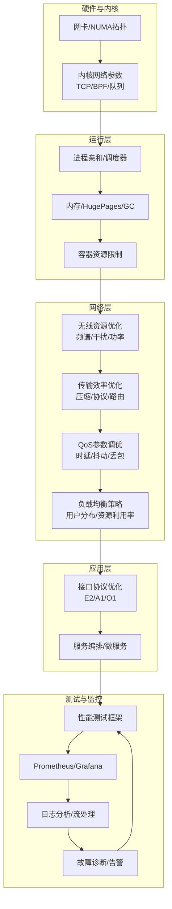

**图表来源**
- [性能优化框架](file://14-operations-management/performance-optimization/performance-optimization-framework.md#L53-L100)
- [网络性能调优实践](file://26-performance-optimization/network-optimization/network-performance-tuning.md#L6-L98)
- [应用性能调优](file://26-performance-optimization/application-tuning/o-ran-application-performance-tuning.md#L71-L129)
- [性能测试](file://13-testing-validation/performance-testing/performance-testing.md#L60-L138)
- [监控系统](file://22-tool-platforms/monitoring-systems/o-ran-monitoring-systems.md#L10-L78)
- [O-RAN管理平台](file://22-tool-platforms/management-platforms/o-ran-management-platforms-zh.md#L454-L532)

## 详细组件分析

### 无线资源优化
- 频谱效率提升：载波聚合配置优化、动态频谱共享、干扰协调机制；调制编码方案优化（MCS自适应、HARQ重传、多天线技术）
- 干扰管理：小区间干扰协调（ICIC）、功率控制优化、波束赋形、干扰随机化（跳频/扩频）

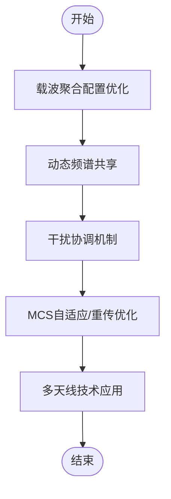

**图表来源**
- [网络性能调优实践](file://26-performance-optimization/network-optimization/network-performance-tuning.md#L8-L26)

**章节来源**
- [网络性能调优实践](file://26-performance-optimization/network-optimization/network-performance-tuning.md#L6-L26)

### 传输效率优化
- 数据压缩技术：头部压缩（ROHC）、负载数据压缩、协议栈优化、算法适配
- 协议优化：用户面（GTP-U简化）、控制面（NAS/S1AP消息优化）、QoS机制（5QI精细化配置）、会话管理（PDU Session优化）

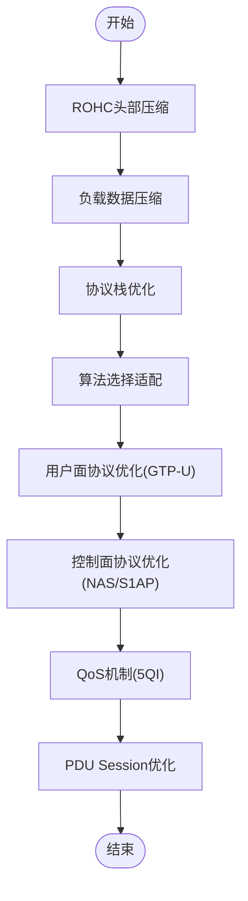

**图表来源**
- [网络性能调优实践](file://26-performance-optimization/network-optimization/network-performance-tuning.md#L28-L44)

**章节来源**
- [网络性能调优实践](file://26-performance-optimization/network-optimization/network-performance-tuning.md#L28-L44)

### QoS参数调优
- 时延优化配置：DRB配置优化、调度策略调整、缓冲区管理、优先级映射
- 抖动控制：时间同步（网络时钟同步）、队列管理（WFQ/SP）、缓冲策略（自适应缓冲区）、流量整形（令牌桶）

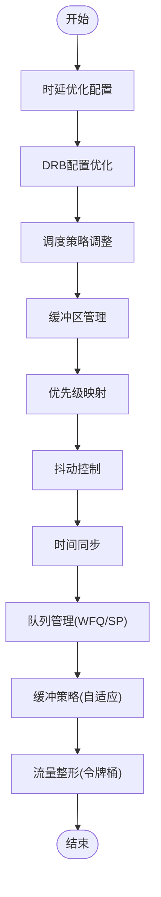

**图表来源**
- [网络性能调优实践](file://26-performance-optimization/network-optimization/network-performance-tuning.md#L45-L61)

**章节来源**
- [网络性能调优实践](file://26-performance-optimization/network-optimization/network-performance-tuning.md#L45-L61)

### 负载均衡策略
- 用户分布优化：移动性管理优化（切换参数、LB算法、小区协调）、资源分配策略（动态资源池、负载预测、容量规划）
- 资源利用率提升：统计复用增益、动态调度、智能休眠、容量弹性

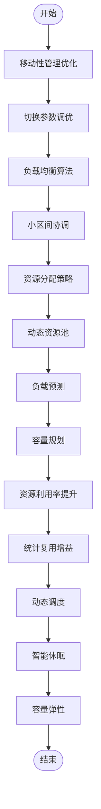

**图表来源**
- [网络性能调优实践](file://26-performance-optimization/network-optimization/network-performance-tuning.md#L62-L82)

**章节来源**
- [网络性能调优实践](file://26-performance-optimization/network-optimization/network-performance-tuning.md#L62-L82)

### 运行层优化（内核/NUMA/进程）
- 网络接口优化：关闭影响性能的卸载、设置最优环回缓冲、中断合并、Jumbo帧、优先级队列与流量标记
- 内核网络参数：增大收发缓冲、BBR拥塞控制、降低TCP延迟、FIN超时与保活时间
- NUMA绑定：将网络中断绑定到特定CPU核，减少跨NUMA开销
- 进程亲和与调度：按组件（near-RT RIC、O-DU、O-CU、SMO）绑定CPU核与优先级，调节内核调度器参数

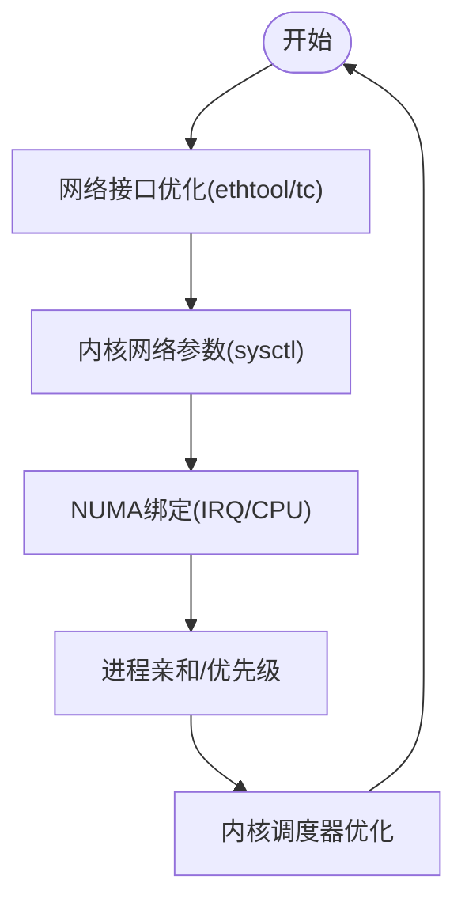

**图表来源**
- [性能优化框架](file://14-operations-management/performance-optimization/performance-optimization-framework.md#L9-L100)

**章节来源**
- [性能优化框架](file://14-operations-management/performance-optimization/performance-optimization-framework.md#L8-L100)

### 应用层优化（接口协议）
- E2接口：ASN.1编译器优化、PER编码效率、连接管理（持久连接、连接池、心跳）、订阅管理（事件过滤、通知批处理）、错误处理与降级
- A1接口：策略分发效率、冲突解决、数据模型优化、TLS握手与证书缓存、会话复用
- O1接口：NETCONF/YANG优化、SNMP集成、CLI性能提升

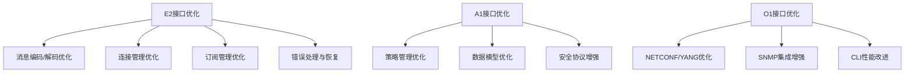

**图表来源**
- [应用性能调优](file://26-performance-optimization/application-tuning/o-ran-application-performance-tuning.md#L71-L129)

**章节来源**
- [应用性能调优](file://26-performance-optimization/application-tuning/o-ran-application-performance-tuning.md#L71-L129)

### 监控与告警
- Prometheus采集：节点/控制面/用户面/近实时RIC指标，告警规则（高延迟、低吞吐）
- Grafana仪表盘：E2/F1延迟、吞吐趋势、资源利用率、异常检测
- 日志分析：Filebeat/Logstash/Elasticsearch，Kafka流处理与实时告警
- 故障诊断：根因分析、告警关联与升级、预测性维护

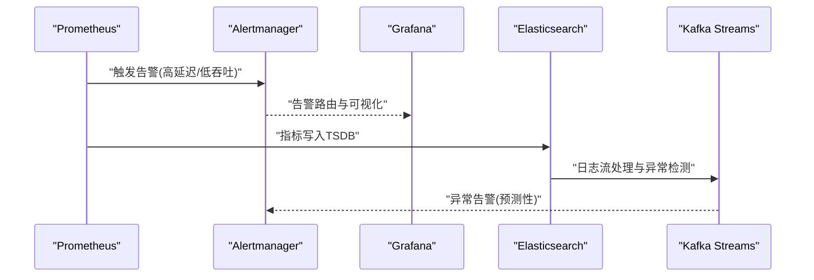

**图表来源**
- [监控系统](file://22-tool-platforms/monitoring-systems/o-ran-monitoring-systems.md#L10-L78)
- [监控系统](file://22-tool-platforms/monitoring-systems/o-ran-monitoring-systems.md#L80-L131)
- [监控系统](file://22-tool-platforms/monitoring-systems/o-ran-monitoring-systems.md#L133-L263)

**章节来源**
- [监控系统](file://22-tool-platforms/monitoring-systems/o-ran-monitoring-systems.md#L6-L131)

### 性能测试与评估
- 测试分类：网络性能（吞吐、时延、丢包、抖动、连接密度）、资源性能（CPU/内存/存储/带宽/功耗）、可扩展性（水平/垂直扩展、负载分布、容量规划）
- 测试方法：加载测试框架（持续吞吐、时延画像、压力测试）、测试环境配置（硬件规格、软件栈、网络拓扑）
- 场景：峰值性能验证、时延特征测试、可扩展性验证
- 指标：RAN/KPI、核心网KPI、云基础设施KPI

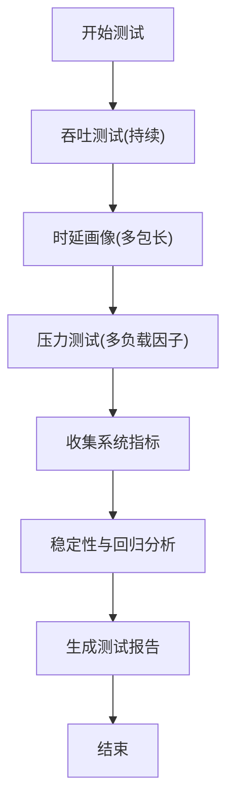

**图表来源**
- [性能测试](file://13-testing-validation/performance-testing/performance-testing.md#L60-L138)
- [性能测试](file://13-testing-validation/performance-testing/performance-testing.md#L169-L242)

**章节来源**
- [性能测试](file://13-testing-validation/performance-testing/performance-testing.md#L6-L28)
- [性能测试](file://13-testing-validation/performance-testing/performance-testing.md#L60-L138)
- [性能测试](file://13-testing-validation/performance-testing/performance-testing.md#L169-L242)

### 平台与工具
- 管理平台：基于ONAP的服务编排（控制面/用户面/管理平面），策略管理（QoS/能耗），监控KPI
- 工具程序：O-RAN配置管理器（模板/验证/部署/合规性），支持YANG模型与批量部署
- 诊断工具：连通性测试、路由追踪、带宽测试、抓包分析、无线/安全/质量分析

**章节来源**
- [O-RAN管理平台](file://22-tool-platforms/management-platforms/o-ran-management-platforms-zh.md#L454-L532)
- [O-RAN工具程序](file://22-tool-platforms/utility-programs/o-ran-utility-programs-zh.md#L6-L89)
- [诊断工具](file://27-troubleshooting-diagnosis/diagnostic-tools/o-ran-diagnostic-instrumentation.md#L134-L202)

## 依赖关系分析
- 组件耦合：网络层优化依赖运行层内核与NUMA优化；应用层协议优化依赖接口规范与平台编排；监控与测试贯穿全链路形成闭环
- 外部依赖：Prometheus/Grafana、ELK、Kafka、容器编排（Kubernetes）、YANG/NETCONF等标准协议
- 循环依赖风险：通过明确的职责边界（网络/运行/应用/测试/监控）避免循环依赖

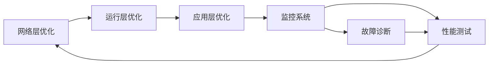

**图表来源**
- [性能优化框架](file://14-operations-management/performance-optimization/performance-optimization-framework.md#L1-L650)
- [网络性能调优实践](file://26-performance-optimization/network-optimization/network-performance-tuning.md#L1-L98)
- [监控系统](file://22-tool-platforms/monitoring-systems/o-ran-monitoring-systems.md#L1-L545)
- [性能测试](file://13-testing-validation/performance-testing/performance-testing.md#L1-L327)

**章节来源**
- [性能优化框架](file://14-operations-management/performance-optimization/performance-optimization-framework.md#L1-L650)
- [网络性能调优实践](file://26-performance-optimization/network-optimization/network-performance-tuning.md#L1-L98)
- [监控系统](file://22-tool-platforms/monitoring-systems/o-ran-monitoring-systems.md#L1-L545)
- [性能测试](file://13-testing-validation/performance-testing/performance-testing.md#L1-L327)

## 性能考量
- 无线侧：频谱效率与干扰控制是决定用户体验的关键；功率控制与波束赋形可显著改善覆盖与容量
- 传输侧：压缩与协议优化可降低用户面开销；路由优化与QoS保障确保关键业务时延与抖动达标
- 运行侧：内核参数、NUMA绑定、进程亲和与调度器优化直接影响系统延迟与吞吐
- 应用侧：接口协议优化与服务编排提升端到端性能与可靠性
- 测试与监控：建立基准、持续评估、自动优化与告警联动，形成闭环

[本节为通用性能讨论，无需具体文件分析]

## 故障排查指南
- 协议与接口故障：E2/A1/O1接口的消息交换、路由、控制环路问题诊断与解决
- 网络连通性：ICMP/ARP/DNS/端口测试、路由追踪、带宽与性能测试、抓包分析
- 日志与流处理：ELK管道、Kafka流分析、异常检测与预测性维护
- 告警与升级：噪声抑制、关联分析、分级升级与工单集成

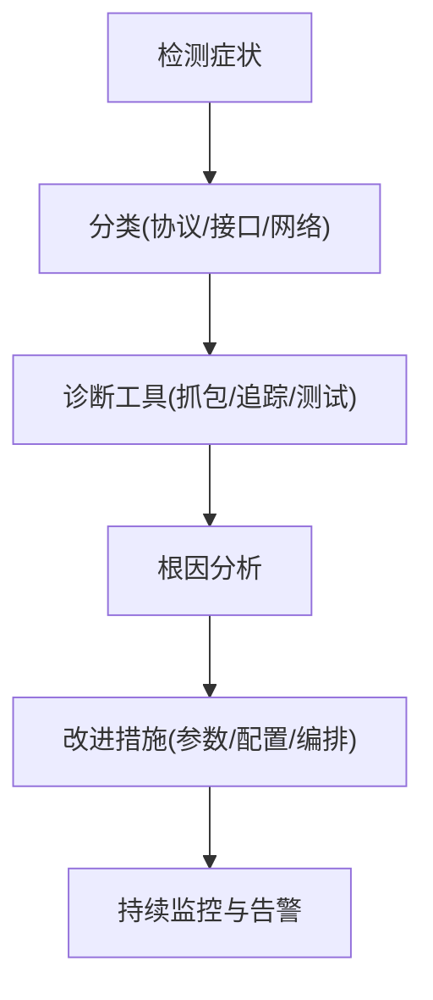

**图表来源**
- [网络故障排除](file://27-troubleshooting-diagnosis/network-issues/o-ran-network-troubleshooting-zh.md#L188-L278)
- [诊断工具](file://27-troubleshooting-diagnosis/diagnostic-tools/o-ran-diagnostic-instrumentation.md#L134-L202)
- [监控系统](file://22-tool-platforms/monitoring-systems/o-ran-monitoring-systems.md#L265-L413)

**章节来源**
- [网络故障排除](file://27-troubleshooting-diagnosis/network-issues/o-ran-network-troubleshooting-zh.md#L188-L278)
- [诊断工具](file://27-troubleshooting-diagnosis/diagnostic-tools/o-ran-diagnostic-instrumentation.md#L134-L202)
- [监控系统](file://22-tool-platforms/monitoring-systems/o-ran-monitoring-systems.md#L265-L413)

## 结论
O-RAN网络优化是一个多层次、端到端的系统工程。通过无线资源优化、传输效率优化、QoS参数调优与负载均衡策略，结合运行层内核与NUMA优化、应用层协议优化，辅以完善的性能测试、监控与故障诊断体系，可实现稳定、高效、可扩展的网络性能。建议在部署前建立性能基线，持续进行容量规划与自动化优化，配合管理平台与工具程序实现标准化与规模化运维。

[本节为总结性内容，无需具体文件分析]

## 附录
- 容量规划：基于历史数据与业务场景建模，预测峰值负载，制定水平/垂直扩展与资源配额策略
- O-RAN DU同步与容量：PTP时间同步、容量规划与负载均衡
- RIC开发：无线资源管理（RRM）优化、能量效率优化、绿色O-RAN

**章节来源**
- [容量规划](file://26-performance-optimization/capacity-planning/o-ran-capacity-planning.md#L216-L285)
- [O-RAN DU](file://02-core-components/o-du.md#L190-L222)
- [O-RAN RIC开发](file://07-ric-development/readme.md#L125-L169)