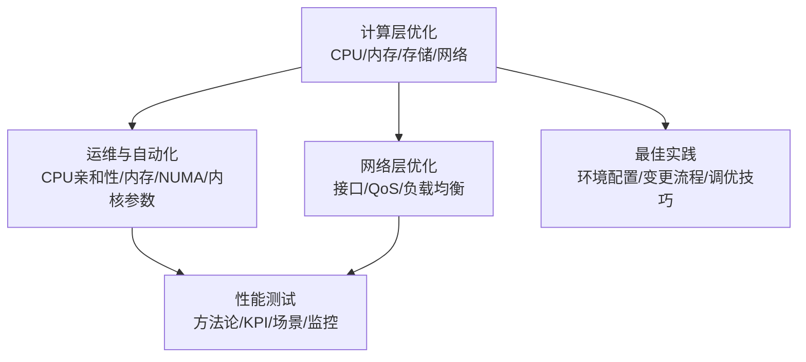
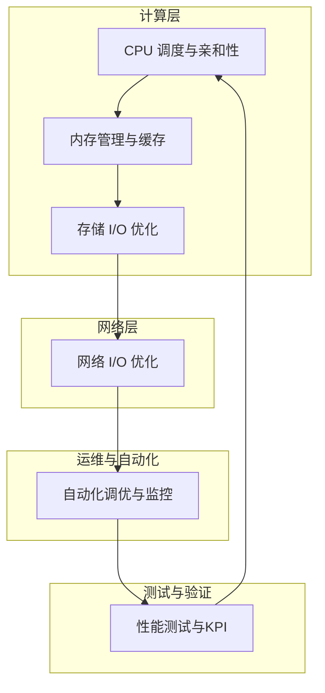
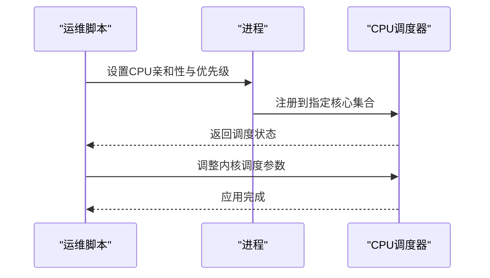
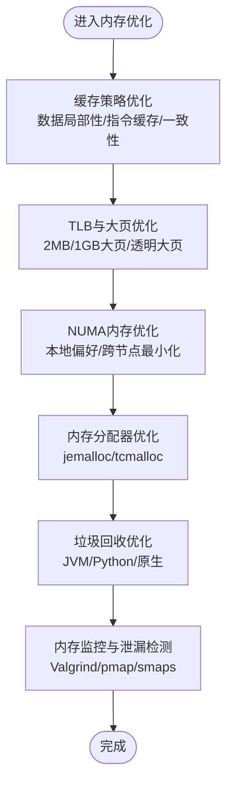
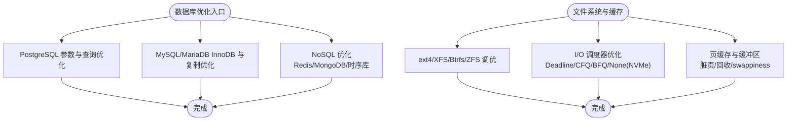
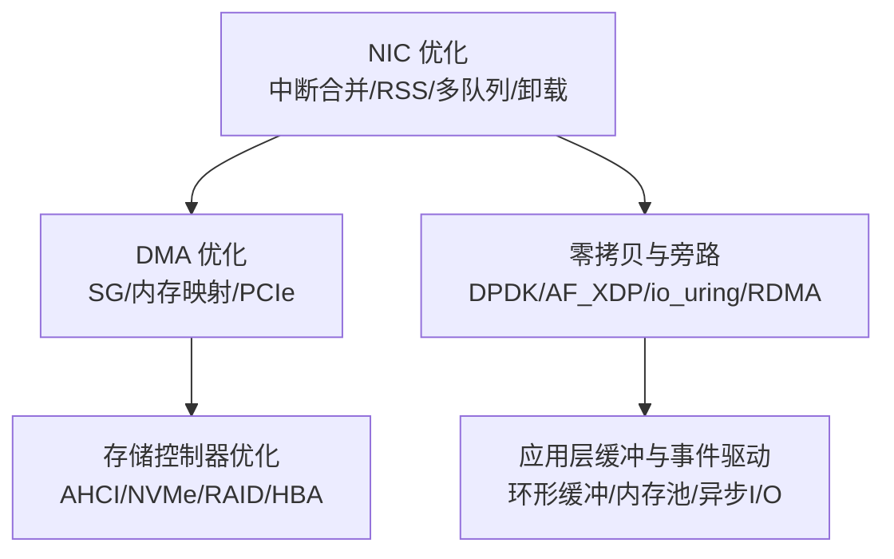
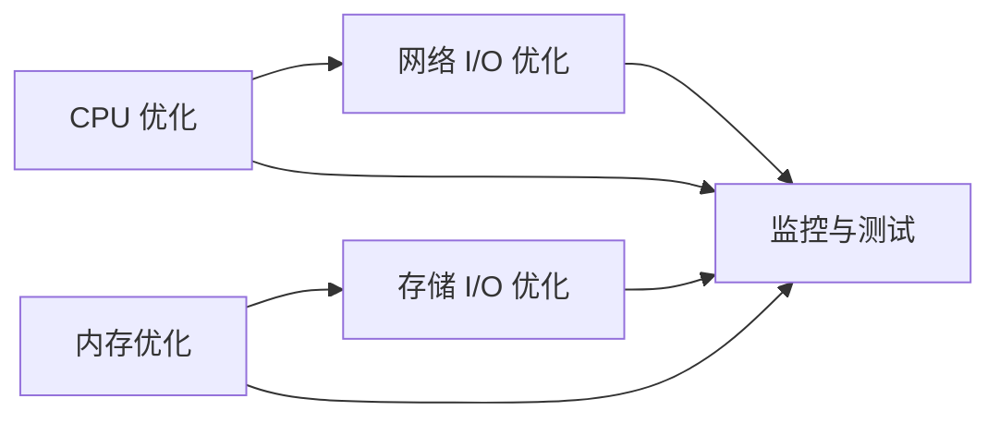

# 计算优化

<cite>
**本文引用的文件**
- [O-RAN 计算层优化](file://26-performance-optimization/compute-optimization/o-ran-compute-optimization.md)
- [O-RAN 性能优化框架（中文）](file://14-operations-management/performance-optimization/performance-optimization-framework-zh.md)
- [O-RAN 网络性能优化实践](file://26-performance-optimization/network-optimization/network-performance-tuning.md)
- [O-RAN 性能测试（中文）](file://13-testing-validation/performance-testing/performance-testing-zh.md)
- [O-RAN 性能优化与调优（中文）](file://26-performance-optimization/readme-zh.md)
- [O-RAN 性能优化最佳实践（中文）](file://30-best-practices/readme.md)
</cite>

## 目录
1. [简介](#简介)
2. [项目结构](#项目结构)
3. [核心组件](#核心组件)
4. [架构总览](#架构总览)
5. [详细组件分析](#详细组件分析)
6. [依赖关系分析](#依赖关系分析)
7. [性能考量](#性能考量)
8. [故障排查指南](#故障排查指南)
9. [结论](#结论)
10. [附录](#附录)

## 简介
本文件面向O-RAN系统的计算资源优化，围绕CPU资源优化（调度策略、亲和性绑定、性能分析）、内存管理优化（缓存策略、内存池、垃圾回收）、存储I/O优化（数据库、文件系统、缓存机制）、网络I/O优化（中断合并、批量处理、零拷贝）提供系统化指导，并结合O-RAN系统特性给出参数配置与性能测试方法，帮助在高实时性、低时延场景下实现资源高效利用与稳定性保障。

## 项目结构
本仓库中与“计算优化”直接相关的内容主要分布在以下位置：
- 计算层优化：CPU调度、亲和性、内存、存储I/O、网络I/O
- 运维与自动化：CPU亲和性与调度优化器、内存优化脚本、NUMA绑定、内核调度参数调优
- 网络层优化：接口调优、QoS、负载均衡、内核参数
- 性能测试：测试方法论、KPI、测试场景、监控与分析
- 最佳实践：环境配置、变更流程、资源调优技巧

**章节来源**
- file://26-performance-optimization/readme-zh.md#L1-L67

## 核心组件
- CPU资源优化：调度策略、NUMA感知、容器级CPU管理、性能分析工具链
- 内存管理优化：多级缓存、TLB、NUMA内存、内存池、垃圾回收、内存调试与监控
- 存储I/O优化：数据库参数、文件系统调优、I/O调度器、页缓存与缓冲区
- 网络I/O优化：中断合并、RSS、DMA、存储控制器、零拷贝与内核旁路

**章节来源**
- file://26-performance-optimization/compute-optimization/o-ran-compute-optimization.md#L6-L112
- file://26-performance-optimization/compute-optimization/o-ran-compute-optimization.md#L114-L220
- file://26-performance-optimization/compute-optimization/o-ran-compute-optimization.md#L222-L348
- file://26-performance-optimization/compute-optimization/o-ran-compute-optimization.md#L350-L471

## 架构总览
下图展示O-RAN系统在计算层的优化闭环：通过CPU亲和性与调度、内存与存储I/O优化、网络I/O优化，配合性能测试与监控，形成持续优化的体系。

**章节来源**
- file://26-performance-optimization/compute-optimization/o-ran-compute-optimization.md#L6-L112
- file://26-performance-optimization/compute-optimization/o-ran-compute-optimization.md#L114-L220
- file://26-performance-optimization/compute-optimization/o-ran-compute-optimization.md#L222-L348
- file://26-performance-optimization/compute-optimization/o-ran-compute-optimization.md#L350-L471
- file://14-operations-management/performance-optimization/performance-optimization-framework-zh.md#L103-L234

## 详细组件分析

### CPU资源优化
- 调度策略优化
  - 实时调度（FIFO/RR/OTHER）与优先级继承、批处理与后台任务管理
  - NUMA感知：节点局部性、工作负载感知放置、迁移成本分析、资源分区
  - 容器级CPU管理：Kubernetes CPU请求/限制、Guaranteed/Burstable、Cgroups参数
- 性能分析与监控
  - 系统级：top/htop、vmstat、sar
  - 进程级：ps、pidstat、perf（硬件事件、调用图、火焰图）
  - 内核级：/proc/cpuinfo、/sys/devices/system/cpu、ftrace
- 亲和性绑定与调度器调优
  - 进程CPU亲和性绑定、优先级调整
  - 内核调度器参数（迁移成本、RT配额、CFS切片）

**章节来源**
- file://26-performance-optimization/compute-optimization/o-ran-compute-optimization.md#L8-L59
- file://26-performance-optimization/compute-optimization/o-ran-compute-optimization.md#L61-L112
- file://14-operations-management/performance-optimization/performance-optimization-framework-zh.md#L105-L234

### 内存管理优化
- 多级缓存优化
  - L1/L2数据局部性、SoA/AoS、缓存行对齐、预取策略
  - 指令缓存、分支预测、循环展开、函数内联
  - 缓存一致性（MESI）、伪共享消除、缓存着色、访问模式分析
- TLB与大页优化
  - 大页配置（2MB/1GB）、透明大页、页表项优化、内存映射效率
  - 地址空间布局（ASLR影响最小化、共享库定位、堆栈分离）
- NUMA内存优化
  - 本地内存偏好、libnuma绑定、跨节点流量最小化、交错策略
- 动态内存管理与垃圾回收
  - jemalloc/tcmalloc定制、线程缓存、碎片减少
  - JVM GC（G1/CMS/ZGC/Shenandoah）、Python引用计数与环形GC、原生内存RAII
- 内存监控与泄漏检测
  - Valgrind系列、pmap/smaps、/proc/meminfo、AddressSanitizer/LeakSanitizer

**章节来源**
- file://26-performance-optimization/compute-optimization/o-ran-compute-optimization.md#L116-L167
- file://26-performance-optimization/compute-optimization/o-ran-compute-optimization.md#L169-L220
- file://14-operations-management/performance-optimization/performance-optimization-framework-zh.md#L302-L375

### 存储I/O优化
- 数据库性能增强
  - PostgreSQL：shared_buffers/work_mem/maintenance_work_mem/effective_cache_size
  - 查询计划与索引、统计更新、Vacuum/Analyze、PgBouncer连接池
  - MySQL/MariaDB：InnoDB缓冲池、日志文件、刷盘方法、线程并发、复制优化
  - NoSQL：Redis内存策略、持久化、集群分片；MongoDB WiredTiger、索引与副本集；时序库InfluxDB保留策略、压缩、分片
- 文件系统与缓存机制
  - ext4/XFS/Btrfs/ZFS参数调优、条带宽度、子卷、ARC/L2ARC、ZIL、去重
  - I/O调度器：Deadline/CFQ/BFQ/None（NVMe），延迟敏感工作负载
  - 页缓存与缓冲区：脏页回写、回收算法、swappiness、缓存压力
- 直接I/O与权衡
  - 对齐要求、绕过缓存场景、性能与一致性的权衡

**章节来源**
- file://26-performance-optimization/compute-optimization/o-ran-compute-optimization.md#L224-L285
- file://26-performance-optimization/compute-optimization/o-ran-compute-optimization.md#L287-L348

### 网络I/O优化
- 中断合并与批量处理
  - NIC中断合并（rx-usecs/tx-usecs/帧数）、RSS键、多队列、收包缩放、卸载启用（TSO/GSO/LRO/GRO）
  - DMA散射-聚集、内存映射I/O、PCIe带宽与最大载荷
  - 存储控制器（AHCI/NVMe、RAID/HBA）队列深度、MSI-X、电源管理、NCQ/背压
- 零拷贝与内核旁路
  - sendfile/splice/mmap、DMA-BUF共享缓冲
  - DPDK轮询模式驱动、内存池、环形队列、数据面流水线
  - AF_XDP零拷贝、BPF集成、填充/完成环
  - io_uring异步I/O、提交/完成队列、操作批处理、内存注册
  - RDMA队列对、内存注册、工作请求、连接管理
  - 应用侧事件驱动I/O（epoll/kqueue）、异步框架（libuv/libevent）、缓冲管理（环形缓冲、Slab、内存池）

**章节来源**
- file://26-performance-optimization/compute-optimization/o-ran-compute-optimization.md#L352-L408
- file://26-performance-optimization/compute-optimization/o-ran-compute-optimization.md#L410-L471

## 依赖关系分析
- 计算层优化依赖于系统内核参数与NUMA拓扑感知，需要与网络层优化协同（中断亲和、队列绑定）
- 内存优化与存储I/O优化相互影响（页缓存、缓冲区、数据库缓存参数）
- 性能测试与监控贯穿全链路，为优化提供量化依据与回归保障

**章节来源**
- file://26-performance-optimization/compute-optimization/o-ran-compute-optimization.md#L6-L112
- file://26-performance-optimization/compute-optimization/o-ran-compute-optimization.md#L114-L220
- file://26-performance-optimization/compute-optimization/o-ran-compute-optimization.md#L222-L348
- file://26-performance-optimization/compute-optimization/o-ran-compute-optimization.md#L350-L471
- file://13-testing-validation/performance-testing/performance-testing-zh.md#L58-L327

## 性能考量
- 基线建立与回归：在稳定状态下采集CPU/内存/网络/存储关键指标，作为优化前后对比基准
- 瓶颈识别：结合系统级（top/htop/vmstat/sar）、进程级（pidstat/perf）与内核级（ftrace）工具定位
- 根因分析：针对CPU争用、内存压力、I/O等待、网络拥塞分别制定优化策略
- 优化方案：按维度（CPU/内存/存储/网络）分步实施，避免一次性大改动
- 效果验证：通过持续监控与自动化回归测试验证优化收益

**章节来源**
- file://26-performance-optimization/readme-zh.md#L26-L67
- file://13-testing-validation/performance-testing/performance-testing-zh.md#L58-L138

## 故障排查指南
- 网络配置调优：关闭可能导致问题的卸载（GRO/LRO/TSO/GSO）、增大环形缓冲、设置MTU、启用流量控制与优先级队列
- CPU亲和性与调度：为关键进程绑定核心、设置优先级、调优内核调度参数（迁移成本、RT配额）
- QoS与缓冲区：tc队列与过滤器、套接字缓冲区参数（tcp_rmem/tcp_wmem）
- Split选项优化：根据时延与处理能力平衡（如F1拆分option2），开启动态压缩与头部压缩

**章节来源**
- file://14-operations-management/fault-handling/fault-troubleshooting-guide.md#L397-L433
- file://14-operations-management/performance-optimization/performance-optimization-framework-zh.md#L103-L234

## 结论
O-RAN计算优化是一个跨CPU/内存/存储/网络的系统工程。通过NUMA感知的亲和性绑定、精细的调度参数、多级缓存与大页策略、数据库与文件系统参数调优、以及中断合并与零拷贝等内核旁路技术，结合完善的性能测试与监控体系，可在保证低时延与高可靠的同时，最大化资源利用效率。

## 附录

### O-RAN系统优化参数速查
- CPU
  - 进程亲和性：绑定到NUMA本地核心集合
  - 优先级：关键进程负优先级，后台进程正优先级
  - 内核调度：降低迁移成本、合理RT配额、缩短CFS切片
- 内存
  - 大页：启用2MB/1GB大页，透明大页，hugetlbfs挂载
  - swappiness：设为1，避免交换
  - 分配器：jemalloc/tcmalloc线程缓存与碎片优化
  - GC：JVM（G1/ZGC/Shenandoah）或Go（GOGC/GOMEMLIMIT）参数
- 存储
  - PostgreSQL：shared_buffers/work_mem/maintenance_work_mem/effective_cache_size
  - MySQL：InnoDB缓冲池、日志文件、刷盘方法、线程并发
  - 文件系统：ext4/XFS/Btrfs/ZFS关键参数；I/O调度器选择
- 网络
  - NIC：中断合并、RSS、多队列、卸载（TSO/GSO/LRO/GRO）
  - 零拷贝：DPDK/AF_XDP/io_uring/RDMA
  - 应用：事件驱动I/O、环形缓冲、内存池

**章节来源**
- file://26-performance-optimization/compute-optimization/o-ran-compute-optimization.md#L6-L59
- file://26-performance-optimization/compute-optimization/o-ran-compute-optimization.md#L116-L220
- file://26-performance-optimization/compute-optimization/o-ran-compute-optimization.md#L224-L348
- file://26-performance-optimization/compute-optimization/o-ran-compute-optimization.md#L352-L471
- file://14-operations-management/performance-optimization/performance-optimization-framework-zh.md#L302-L375

### 性能测试方法与KPI
- 测试类别：网络吞吐、延迟、丢包、抖动、连接密度；CPU/内存/存储/网络带宽/功耗
- KPI示例：峰值吞吐量、用户面/控制面延迟、会话建立速率、数据库查询响应、容器启动时间、存储IOPS
- 方法论：负载测试框架（持续吞吐、延迟画像、压力测试）、测试环境配置（硬件/软件/网络拓扑）、场景设计（峰值/延迟/可扩展性）
- 监控与分析：PromQL指标、实时仪表板、异常检测、容量规划

**章节来源**
- file://13-testing-validation/performance-testing/performance-testing-zh.md#L6-L327