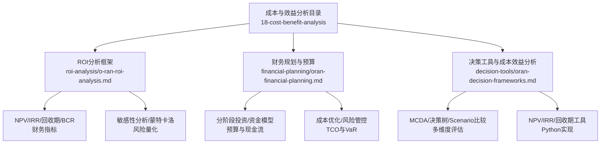
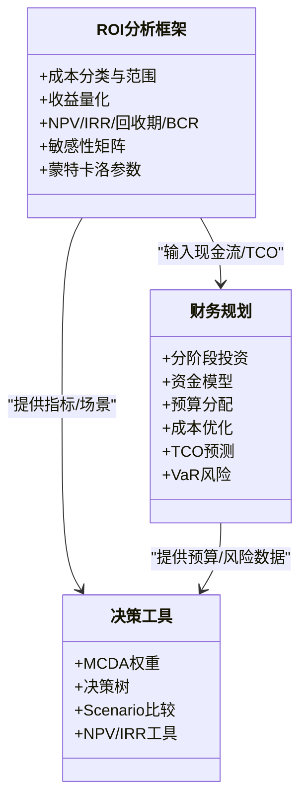
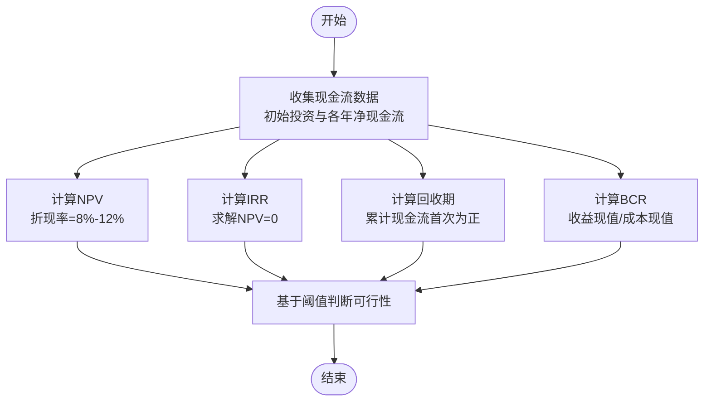
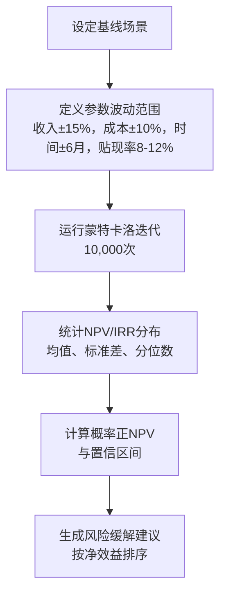
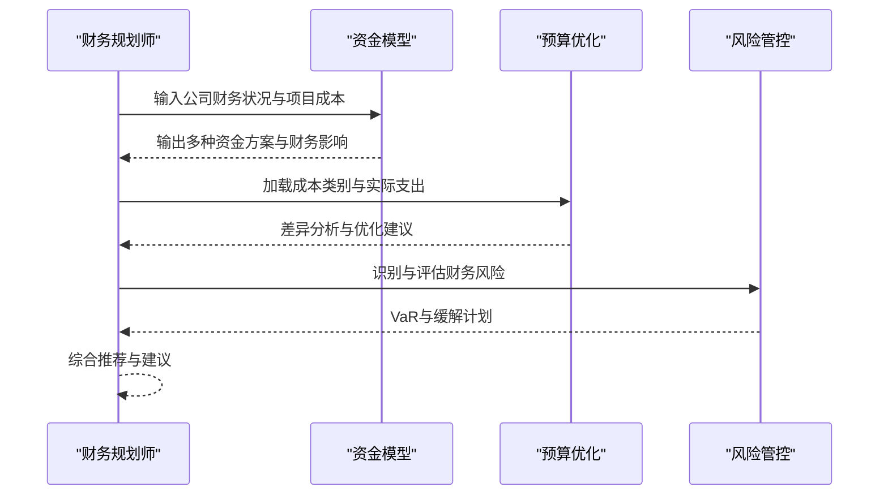
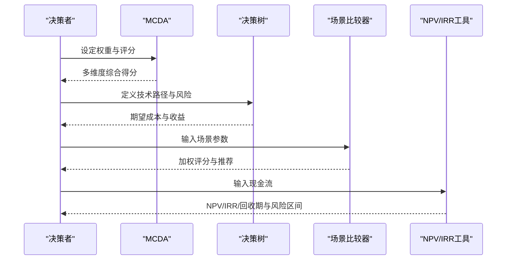
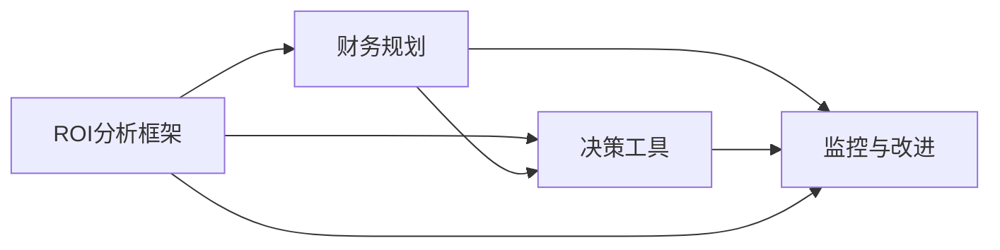

# ROI分析

<cite>
**本文引用的文件**
- [O-RAN投资回报分析框架](file://18-cost-benefit-analysis/roi-analysis/o-ran-roi-analysis.md)
- [O-RAN财务规划和预算](file://18-cost-benefit-analysis/financial-planning/oran-financial-planning.md)
- [O-RAN决策工具与成本效益分析](file://18-cost-benefit-analysis/decision-tools/oran-decision-frameworks.md)
- [O-RAN成本效益分析目录](file://18-cost-benefit-analysis/readme.md)
- [O-RAN财务规划和预算（中文）](file://18-cost-benefit-analysis/financial-planning/oran-financial-planning-zh.md)
</cite>

## 目录
1. [简介](#简介)
2. [项目结构](#项目结构)
3. [核心组件](#核心组件)
4. [架构总览](#架构总览)
5. [详细组件分析](#详细组件分析)
6. [依赖关系分析](#依赖关系分析)
7. [性能考量](#性能考量)
8. [故障排查指南](#故障排查指南)
9. [结论](#结论)
10. [附录](#附录)

## 简介
本文件面向O-RAN项目的投资回报评估，系统化梳理并呈现完整的ROI分析技术体系：涵盖净现值(NPV)、内部收益率(IRR)、投资回收期、收益成本比率等财务指标；结合敏感性分析、蒙特卡洛模拟与风险评估；提供基准线设定与行业对标方法；并给出ROI持续监控与改进机制，帮助组织以量化方式判断O-RAN部署的经济合理性，并在全生命周期内实现价值最大化。

## 项目结构
围绕ROI分析，该仓库在“成本与效益分析”目录下提供了三大类文档与工具：
- 投资回报分析框架：明确成本构成、收益来源、财务指标与敏感性分析方法
- 财务规划与预算：提供分阶段投资、资金模型、预算优化与长期可持续性框架
- 决策工具与成本效益分析：包含多准则决策、投资决策树、NPV/IRR/回收期计算与情景比较工具

**图表来源**
- [O-RAN投资回报分析框架](file://18-cost-benefit-analysis/roi-analysis/o-ran-roi-analysis.md#L1-L181)
- [O-RAN财务规划和预算](file://18-cost-benefit-analysis/financial-planning/oran-financial-planning.md#L1-L773)
- [O-RAN决策工具与成本效益分析](file://18-cost-benefit-analysis/decision-tools/oran-decision-frameworks.md#L1-L726)

**章节来源**
- [O-RAN成本效益分析目录](file://18-cost-benefit-analysis/readme.md#L1-L62)

## 核心组件
- 财务指标计算模块：NPV、IRR、回收期、收益成本比率
- 敏感性分析与风险评估：成本变化、收入波动、时间因素、技术与市场风险
- 资金模型与预算：分阶段投资、资金来源模型、预算优化与成本控制
- 决策支持工具：多准则决策分析(MCDA)、投资决策树、场景比较与推荐
- 基准与行业对标：KPI目标、行业平均对比、差距分析
- 持续监控与改进：KPI仪表盘、偏差分析、调整策略

**章节来源**
- [O-RAN投资回报分析框架](file://18-cost-benefit-analysis/roi-analysis/o-ran-roi-analysis.md#L50-L181)
- [O-RAN财务规划和预算](file://18-cost-benefit-analysis/financial-planning/oran-financial-planning.md#L68-L773)
- [O-RAN决策工具与成本效益分析](file://18-cost-benefit-analysis/decision-tools/oran-decision-frameworks.md#L6-L726)

## 架构总览
下面以代码级视角展示ROI分析相关模块之间的关系与调用链：

**图表来源**
- [O-RAN投资回报分析框架](file://18-cost-benefit-analysis/roi-analysis/o-ran-roi-analysis.md#L6-L181)
- [O-RAN财务规划和预算](file://18-cost-benefit-analysis/financial-planning/oran-financial-planning.md#L68-L773)
- [O-RAN决策工具与成本效益分析](file://18-cost-benefit-analysis/decision-tools/oran-decision-frameworks.md#L6-L726)

## 详细组件分析

### 组件A：财务指标计算与分析
- 净现值(NPV)：对各年现金流按折现率折现后求和，衡量项目绝对价值
- 内部收益率(IRR)：使NPV为零的折现率，衡量项目相对回报率
- 投资回收期：累计现金流首次转正的年份，衡量流动性回收速度
- 收益成本比率(BCR)：收益现值与成本现值之比，辅助决策

**图表来源**
- [O-RAN投资回报分析框架](file://18-cost-benefit-analysis/roi-analysis/o-ran-roi-analysis.md#L52-L72)
- [O-RAN决策工具与成本效益分析](file://18-cost-benefit-analysis/decision-tools/oran-decision-frameworks.md#L338-L476)

**章节来源**
- [O-RAN投资回报分析框架](file://18-cost-benefit-analysis/roi-analysis/o-ran-roi-analysis.md#L50-L72)
- [O-RAN决策工具与成本效益分析](file://18-cost-benefit-analysis/decision-tools/oran-decision-frameworks.md#L338-L476)

### 组件B：敏感性分析与风险评估
- 成本敏感性矩阵：对CAPEX、OPEX、收入变化进行压力测试
- 时间维度分析：不同投资周期下的NPV/IRR/回收期
- 蒙特卡洛模拟：对收入、成本、时间、贴现率进行随机扰动，输出概率分布与置信区间
- 风险评估：技术、市场、实施、监管等风险分类与缓解策略，结合VaR与风险容忍度

**图表来源**
- [O-RAN投资回报分析框架](file://18-cost-benefit-analysis/roi-analysis/o-ran-roi-analysis.md#L74-L110)
- [O-RAN财务规划和预算](file://18-cost-benefit-analysis/financial-planning/oran-financial-planning.md#L558-L771)

**章节来源**
- [O-RAN投资回报分析框架](file://18-cost-benefit-analysis/roi-analysis/o-ran-roi-analysis.md#L74-L110)
- [O-RAN财务规划和预算](file://18-cost-benefit-analysis/financial-planning/oran-financial-planning.md#L558-L771)

### 组件C：资金模型与预算管理
- 分阶段投资：试点、扩展、全面部署三阶段的目标、预算与里程碑
- 资金模型：传统CapEx、运营费用、即服务、合资、渐进式迁移等模型对比
- 预算优化：类别化成本分析、差异与优化机会、风险与缓解
- 长期可持续性：TCO五载预测、风险价值(VaR)与风险容忍度

**图表来源**
- [O-RAN财务规划和预算](file://18-cost-benefit-analysis/financial-planning/oran-financial-planning.md#L68-L773)
- [O-RAN财务规划和预算（中文）](file://18-cost-benefit-analysis/financial-planning/oran-financial-planning-zh.md#L68-L773)

**章节来源**
- [O-RAN财务规划和预算](file://18-cost-benefit-analysis/financial-planning/oran-financial-planning.md#L68-L773)
- [O-RAN财务规划和预算（中文）](file://18-cost-benefit-analysis/financial-planning/oran-financial-planning-zh.md#L68-L773)

### 组件D：决策支持与场景比较
- 多准则决策分析(MCDA)：财务、技术、战略三维度权重与评分
- 投资决策树：技术路径选择与风险路径分支，期望值计算
- 场景比较：成本效率、时间到价值、风险缓解、灵活性、未来就绪度加权评分与推荐
- NPV/IRR工具：Python实现，支持现金流汇总、IRR求解与蒙特卡洛风险分析

**图表来源**
- [O-RAN决策工具与成本效益分析](file://18-cost-benefit-analysis/decision-tools/oran-decision-frameworks.md#L6-L726)

**章节来源**
- [O-RAN决策工具与成本效益分析](file://18-cost-benefit-analysis/decision-tools/oran-decision-frameworks.md#L6-L726)

### 组件E：基准线设定与行业对标
- 关键指标(KPI)：ROI、回收期、NPV增长、部署速度、系统可用性、成本效率
- 行业对标：实施时间、总拥有成本、服务质量等与行业平均对比，形成差距分析
- 基准设定：目标值与测量频率，指导持续改进

**章节来源**
- [O-RAN投资回报分析框架](file://18-cost-benefit-analysis/roi-analysis/o-ran-roi-analysis.md#L143-L161)

### 组件F：持续监控与改进机制
- 监控仪表盘：KPI可视化、偏差分析、趋势追踪
- 偏差分析：预算差异、实际与预测偏离、优化机会识别
- 调整策略：根据监控结果与风险评估，动态优化资源配置与实施节奏

**章节来源**
- [O-RAN投资回报分析框架](file://18-cost-benefit-analysis/roi-analysis/o-ran-roi-analysis.md#L143-L181)

## 依赖关系分析
- ROI分析框架依赖财务规划提供的现金流、TCO与风险数据
- 决策工具依赖ROI框架的财务指标与场景数据
- 财务规划与预算模块相互支撑：前者提供资金模型与风险，后者提供成本优化与预算控制
- 所有模块共同服务于基准设定与持续监控，形成闭环

**图表来源**
- [O-RAN投资回报分析框架](file://18-cost-benefit-analysis/roi-analysis/o-ran-roi-analysis.md#L1-L181)
- [O-RAN财务规划和预算](file://18-cost-benefit-analysis/financial-planning/oran-financial-planning.md#L1-L773)
- [O-RAN决策工具与成本效益分析](file://18-cost-benefit-analysis/decision-tools/oran-decision-frameworks.md#L1-L726)

**章节来源**
- [O-RAN投资回报分析框架](file://18-cost-benefit-analysis/roi-analysis/o-ran-roi-analysis.md#L1-L181)
- [O-RAN财务规划和预算](file://18-cost-benefit-analysis/financial-planning/oran-financial-planning.md#L1-L773)
- [O-RAN决策工具与成本效益分析](file://18-cost-benefit-analysis/decision-tools/oran-decision-frameworks.md#L1-L726)

## 性能考量
- 计算复杂度：NPV/IRR通常为线性或常数级；蒙特卡洛迭代次数越多，结果越稳定但计算开销越大
- 数据质量：成本与收益预测的准确性直接影响ROI可信度，需结合历史数据与专家判断
- 实施节奏：分阶段部署可降低一次性投入与不确定性，提升整体成功率
- 风险建模：VaR与敏感性分析有助于识别关键风险驱动因素，指导资源倾斜

[本节为通用指导，无需特定文件引用]

## 故障排查指南
- 指标异常：若IRR显著低于门槛或NPV为负，检查贴现率、成本预测与收益假设是否合理
- 回收期过长：审视OPEX结构与自动化程度，评估是否可通过预算优化缩短回收期
- 风险超限：当VaR超出容忍度时，优先实施高净效益缓解措施，必要时调整资金模型或延缓部署
- 偏差过大：通过预算优化工具定位高影响类别，制定分阶段整改计划

**章节来源**
- [O-RAN投资回报分析框架](file://18-cost-benefit-analysis/roi-analysis/o-ran-roi-analysis.md#L90-L110)
- [O-RAN财务规划和预算](file://18-cost-benefit-analysis/financial-planning/oran-financial-planning.md#L558-L773)
- [O-RAN决策工具与成本效益分析](file://18-cost-benefit-analysis/decision-tools/oran-decision-frameworks.md#L513-L726)

## 结论
通过将NPV/IRR/回收期/BCR等财务指标与敏感性分析、蒙特卡洛模拟、风险评估相结合，并辅以分阶段投资、预算优化与持续监控机制，O-RAN项目可在全生命周期内实现稳健的经济回报。基准线设定与行业对标进一步确保项目在行业中具备竞争力。建议在项目启动前完成详尽的场景建模与风险准备，在执行过程中持续跟踪KPI并动态优化策略。

[本节为总结性内容，无需特定文件引用]

## 附录
- ROI分析方法学要点：明确成本与收益边界、设定合理的折现率、进行多情景与压力测试
- 基准与行业对标：建立KPI清单与目标值，定期与行业平均对比并形成改进计划
- 持续改进：将监控、偏差分析与调整策略纳入项目治理流程，确保长期价值最大化

[本节为概念性内容，无需特定文件引用]