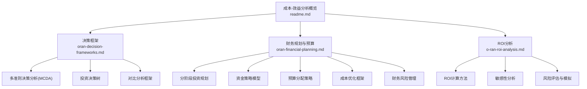
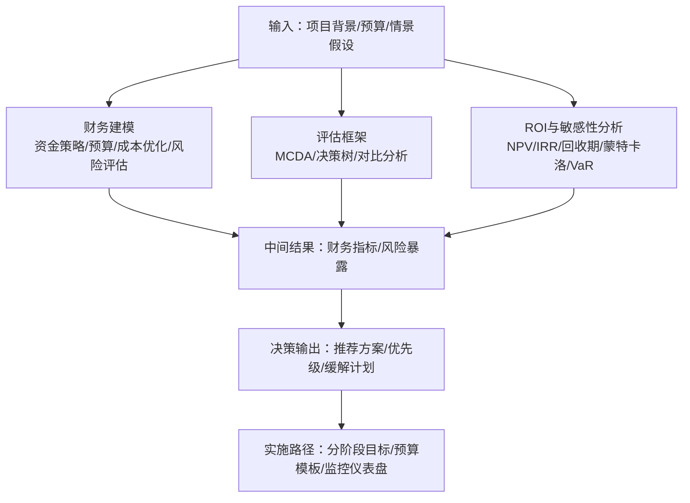
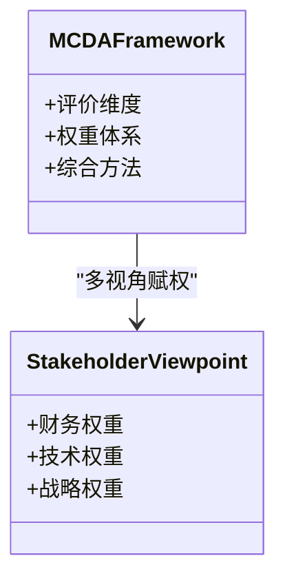
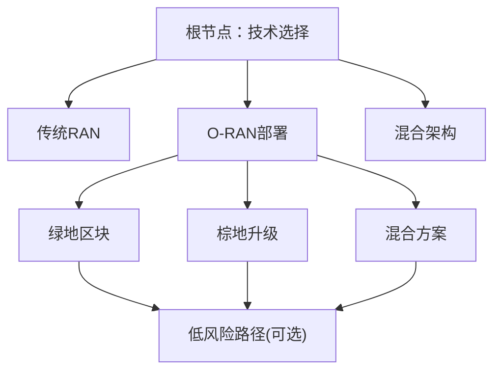
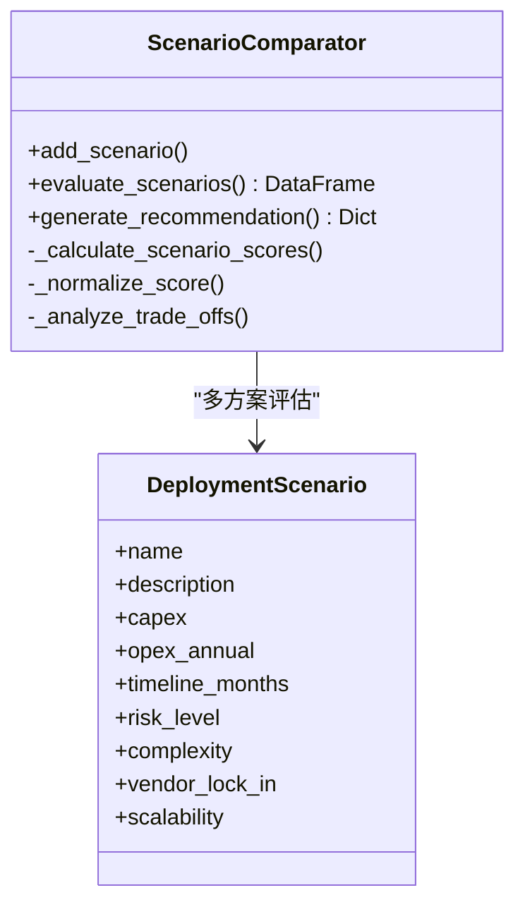
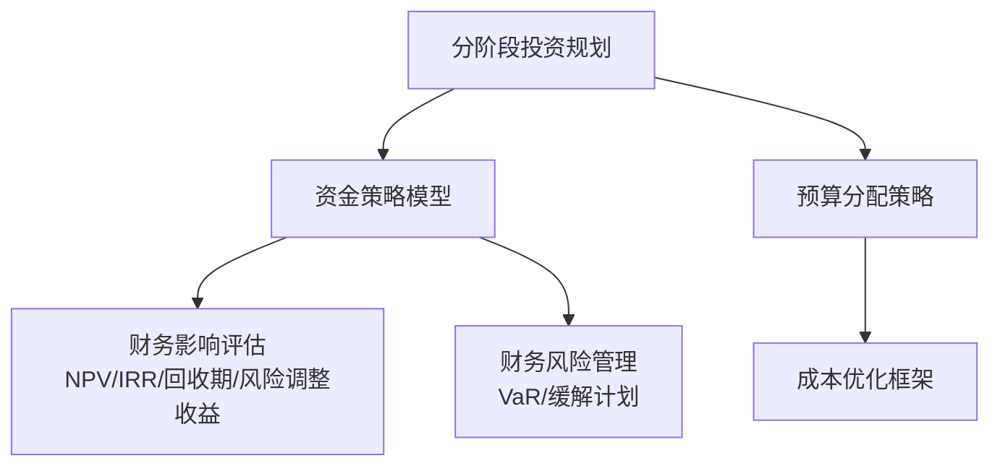
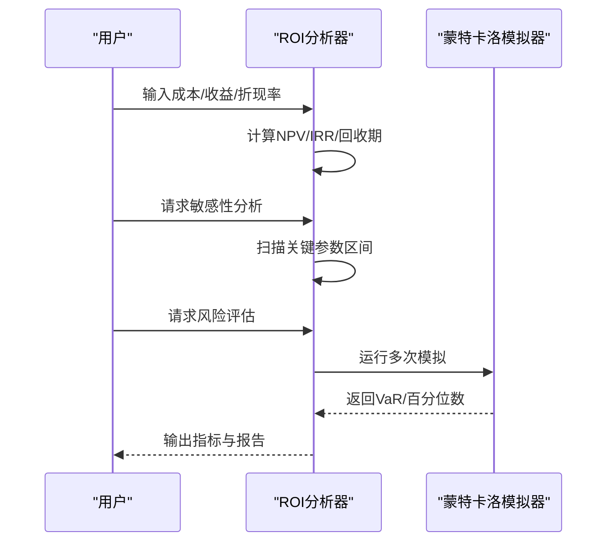
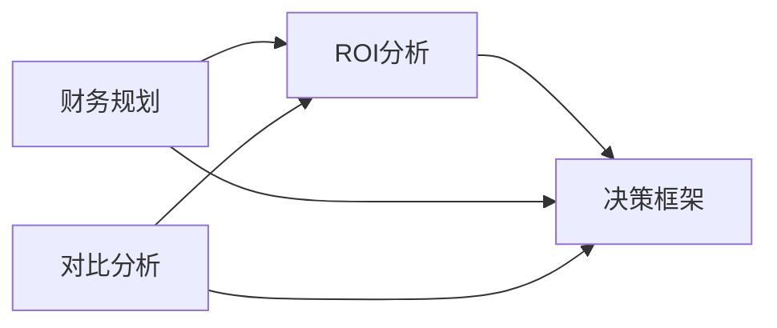

# 决策工具

<cite>
**本文引用的文件**
- [O-RAN成本效益分析说明](file://18-cost-benefit-analysis/readme.md)
- [O-RAN决策框架](file://18-cost-benefit-analysis/decision-tools/oran-decision-frameworks.md)
- [O-RAN财务规划与预算](file://18-cost-benefit-analysis/financial-planning/oran-financial-planning.md)
- [O-RAN投资回报分析](file://18-cost-benefit-analysis/roi-analysis/o-ran-roi-analysis.md)
</cite>

## 目录
1. [简介](#简介)
2. [项目结构](#项目结构)
3. [核心组件](#核心组件)
4. [架构总览](#架构总览)
5. [详细组件分析](#详细组件分析)
6. [依赖关系分析](#依赖关系分析)
7. [性能考量](#性能考量)
8. [故障排查指南](#故障排查指南)
9. [结论](#结论)
10. [附录](#附录)

## 简介
本文件面向O-RAN（开放无线接入网）投资与部署的商业决策需求，系统化梳理并呈现仓库中已有的“成本-效益分析”“财务规划与预算”“投资回报分析”“决策工具与框架”等模块，形成一套可操作的决策支持方法论与工具集。内容覆盖：
- 决策框架：多准则决策分析（MCDA）、投资决策树、对比分析框架
- 财务建模：资金策略、预算分配、成本优化、风险评估与VaR分析
- ROI与敏感性分析：NPV/IRR/回收期、参数敏感性、蒙特卡洛模拟
- 实施路径：分阶段投资、预算模板、风险缓解计划

本指南既可用于高层战略决策，也可作为项目团队落地执行的参考。

## 项目结构
围绕O-RAN决策支持，相关知识与工具主要分布在以下目录与文件：
- 决策工具与框架：oran-decision-frameworks.md
- 财务规划与预算：oran-financial-planning.md
- ROI分析：o-ran-roi-analysis.md
- 成本-效益分析概览：readme.md

**图表来源**
- [O-RAN成本效益分析说明](file://18-cost-benefit-analysis/readme.md#L1-L62)
- [O-RAN决策框架](file://18-cost-benefit-analysis/decision-tools/oran-decision-frameworks.md#L1-L726)
- [O-RAN财务规划与预算](file://18-cost-benefit-analysis/financial-planning/oran-financial-planning.md#L1-L773)
- [O-RAN投资回报分析](file://18-cost-benefit-analysis/roi-analysis/o-ran-roi-analysis.md#L1-L181)

**章节来源**
- [O-RAN成本效益分析说明](file://18-cost-benefit-analysis/readme.md#L1-L62)

## 核心组件
- 多准则决策分析（MCDA）框架：定义财务、技术、战略三层次评价维度与权重体系，支持多种综合评估方法。
- 投资决策树：以技术路径与部署情景为分支，结合概率、成本、收益与风险调整，计算期望值并进行敏感性分析。
- 对比分析框架：提供供应商对比矩阵与部署情景对比工具，支持加权评分与整体推荐。
- 财务规划与预算：分阶段投资、资金策略、预算组合、成本优化与财务风险。
- ROI与敏感性分析：NPV/IRR/回收期、参数敏感性、蒙特卡洛模拟与VaR。

**章节来源**
- [O-RAN决策框架](file://18-cost-benefit-analysis/decision-tools/oran-decision-frameworks.md#L8-L53)
- [O-RAN决策框架](file://18-cost-benefit-analysis/decision-tools/oran-decision-frameworks.md#L55-L304)
- [O-RAN决策框架](file://18-cost-benefit-analysis/decision-tools/oran-decision-frameworks.md#L306-L726)
- [O-RAN财务规划与预算](file://18-cost-benefit-analysis/financial-planning/oran-financial-planning.md#L6-L66)
- [O-RAN财务规划与预算](file://18-cost-benefit-analysis/financial-planning/oran-financial-planning.md#L68-L307)
- [O-RAN财务规划与预算](file://18-cost-benefit-analysis/financial-planning/oran-financial-planning.md#L309-L507)
- [O-RAN财务规划与预算](file://18-cost-benefit-analysis/financial-planning/oran-financial-planning.md#L509-L771)
- [O-RAN投资回报分析](file://18-cost-benefit-analysis/roi-analysis/o-ran-roi-analysis.md#L6-L181)

## 架构总览
下图展示O-RAN决策支持系统的“输入-处理-输出”闭环：输入为项目背景、预算与情景假设；处理包含财务建模、多准则评估与敏感性分析；输出为推荐方案、风险缓解与实施路径。

[此图为概念性流程示意，无需图表来源标注]

## 详细组件分析

### 组件A：多准则决策分析（MCDA）
- 评价维度：财务（CAPEX/OPEX/TCO/ROI）、技术（性能/可扩展/互操作/未来适应）、战略（上市速度/竞争优势/风险缓解/创新赋能）
- 权重体系：从CTO/CFO/CIO视角分别赋权，体现多利益相关方视角
- 综合方法：层次分析法、TOPSIS、加权求和、序关系排序等

**图表来源**
- [O-RAN决策框架](file://18-cost-benefit-analysis/decision-tools/oran-decision-frameworks.md#L10-L53)

**章节来源**
- [O-RAN决策框架](file://18-cost-benefit-analysis/decision-tools/oran-decision-frameworks.md#L8-L53)

### 组件B：投资决策树
- 分支：技术路径（传统RAN/O-RAN/混合架构）与部署情景（绿地/棕地/混合）
- 节点：包含概率、成本、收益，并可加入风险缓解子分支
- 输出：期望成本与收益，敏感性分析与盈亏平衡点

**图表来源**
- [O-RAN决策框架](file://18-cost-benefit-analysis/decision-tools/oran-decision-frameworks.md#L105-L181)

**章节来源**
- [O-RAN决策框架](file://18-cost-benefit-analysis/decision-tools/oran-decision-frameworks.md#L55-L181)

### 组件C：对比分析框架（供应商/部署情景）
- 供应商对比：技术能力、财务报价、运营因素的加权评分
- 部署情景对比：成本效率、时间到价值、风险、灵活性、未来就绪度的加权评分与推荐

**图表来源**
- [O-RAN决策框架](file://18-cost-benefit-analysis/decision-tools/oran-decision-frameworks.md#L513-L724)

**章节来源**
- [O-RAN决策框架](file://18-cost-benefit-analysis/decision-tools/oran-decision-frameworks.md#L478-L724)

### 组件D：财务规划与预算（分阶段/资金策略/成本优化/风险）
- 分阶段投资：试点部署、受控扩展、全网部署的阶段目标、预算与优化杠杆
- 资金策略：传统CapEx、运营费用、即服务、合资、渐进式迁移五种模型的财务影响评估
- 预算分配：战略性投资、运营增强、维持性投资的组合与时间线
- 成本优化：分类预算差异分析、优化机会与实施阶段
- 财务风险：风险识别、暴露计算、VaR与缓解优先级

**图表来源**
- [O-RAN财务规划与预算](file://18-cost-benefit-analysis/financial-planning/oran-financial-planning.md#L10-L66)
- [O-RAN财务规划与预算](file://18-cost-benefit-analysis/financial-planning/oran-financial-planning.md#L68-L307)
- [O-RAN财务规划与预算](file://18-cost-benefit-analysis/financial-planning/oran-financial-planning.md#L309-L507)
- [O-RAN财务规划与预算](file://18-cost-benefit-analysis/financial-planning/oran-financial-planning.md#L509-L771)

**章节来源**
- [O-RAN财务规划与预算](file://18-cost-benefit-analysis/financial-planning/oran-financial-planning.md#L6-L771)

### 组件E：ROI与敏感性分析（NPV/IRR/回收期/蒙特卡洛/VaR）
- ROI计算：直接/间接收益、成本构成、NPV/IRR/回收期
- 敏感性分析：成本变化、收入波动、时间跨度对ROI的影响
- 风险评估：基于蒙特卡洛模拟的VaR与最坏情形估计

**图表来源**
- [O-RAN投资回报分析](file://18-cost-benefit-analysis/roi-analysis/o-ran-roi-analysis.md#L50-L181)

**章节来源**
- [O-RAN投资回报分析](file://18-cost-benefit-analysis/roi-analysis/o-ran-roi-analysis.md#L6-L181)

## 依赖关系分析
- 决策框架依赖财务建模提供的指标（NPV/IRR/回收期）与风险评估（VaR），以支撑多准则权重下的综合判断
- 对比分析框架依赖预算与ROI分析的量化输入，形成可比较的评分矩阵
- 财务规划与预算模块为决策提供阶段化与资金可得性的约束条件

[此图为概念性依赖示意，无需图表来源标注]

**章节来源**
- [O-RAN决策框架](file://18-cost-benefit-analysis/decision-tools/oran-decision-frameworks.md#L1-L726)
- [O-RAN财务规划与预算](file://18-cost-benefit-analysis/financial-planning/oran-financial-planning.md#L1-L773)
- [O-RAN投资回报分析](file://18-cost-benefit-analysis/roi-analysis/o-ran-roi-analysis.md#L1-L181)

## 性能考量
- 计算复杂度
  - 决策树期望值计算随分支深度线性增长，建议控制分支数量或采用剪枝策略
  - 蒙特卡洛模拟次数越多，结果越稳定但计算耗时增加，建议根据精度需求折中
- 数据质量
  - 预算与成本数据的准确性直接影响ROI与风险评估的可信度
  - 权重与评分的主观性需通过专家评审与敏感性测试校准
- 可扩展性
  - 将各模块封装为函数/类，便于替换输入、复用评估逻辑、集成到仪表盘

[本节为通用指导，无需章节来源]

## 故障排查指南
- 资金策略不可行
  - 症状：超出债务能力、NPV为负、IRR低于门槛
  - 措施：调整首付比例、延长摊还期、引入合作模式、降低一次性投入
- 预算超支
  - 症状：硬件/专业服务/设施超支
  - 措施：识别高潜力优化机会（如批量采购、内部能力建设、在线培训），制定分阶段实施计划
- 风险暴露过高
  - 症状：总风险敞口超过容忍度、VaR偏高
  - 措施：优先实施高净收益缓解方案（如供应商成熟度验证、进度缓冲、技能培养），动态监控并更新风险清单

**章节来源**
- [O-RAN财务规划与预算](file://18-cost-benefit-analysis/financial-planning/oran-financial-planning.md#L176-L278)
- [O-RAN财务规划与预算](file://18-cost-benefit-analysis/financial-planning/oran-financial-planning.md#L415-L475)
- [O-RAN财务规划与预算](file://18-cost-benefit-analysis/financial-planning/oran-financial-planning.md#L639-L733)

## 结论
本仓库提供了从“决策框架—财务建模—ROI与风险分析—预算与成本优化”的完整决策工具链。建议在实际应用中：
- 明确决策目标与利益相关方权重，使用MCDA与决策树进行方案筛选
- 基于ROI与敏感性分析设定分阶段目标与预算模板
- 以财务风险评估与缓解计划保障实施稳健性
- 建立持续监控与回溯机制，动态优化实施路径

[本节为总结性内容，无需章节来源]

## 附录
- 决策流程建议
  - 识别关键决策要素（财务/技术/战略）
  - 分配权重并进行多准则评估
  - 量化风险并计算VaR
  - 形成推荐方案与优先级
  - 制定分阶段目标与预算模板
  - 建立监控仪表盘与回溯机制

[本节为通用流程建议，无需章节来源]