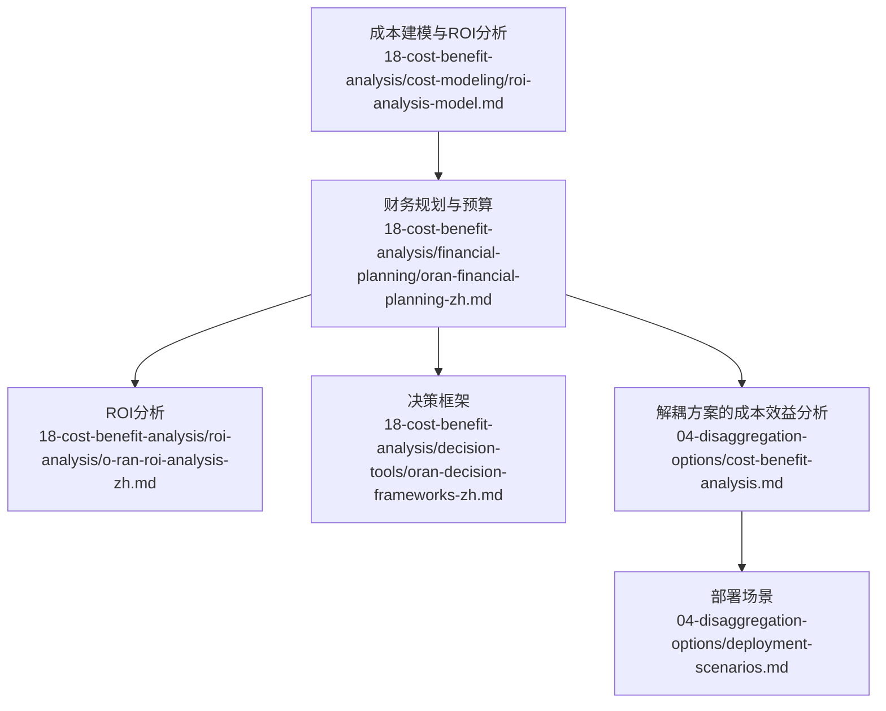
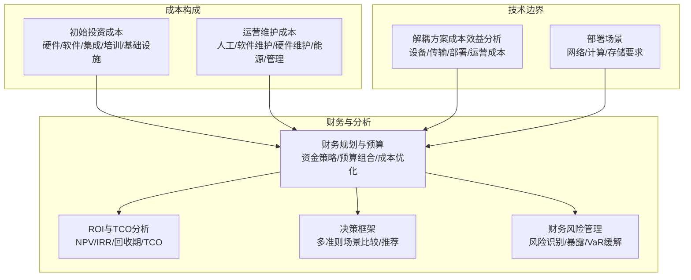
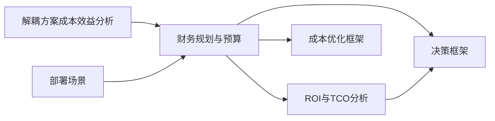

# 成本建模

<cite>
**本文引用的文件**
- [成本建模与ROI分析](file://18-cost-benefit-analysis/cost-modeling/roi-analysis-model.md)
- [财务规划与预算](file://18-cost-benefit-analysis/financial-planning/oran-financial-planning-zh.md)
- [ROI分析](file://18-cost-benefit-analysis/roi-analysis/o-ran-roi-analysis-zh.md)
- [决策框架](file://18-cost-benefit-analysis/decision-tools/oran-decision-frameworks-zh.md)
- [解耦方案的成本效益分析](file://04-disaggregation-options/cost-benefit-analysis.md)
- [部署场景](file://04-disaggregation-options/deployment-scenarios.md)
</cite>

## 目录
1. [引言](#引言)
2. [项目结构](#项目结构)
3. [核心组件](#核心组件)
4. [架构总览](#架构总览)
5. [详细组件分析](#详细组件分析)
6. [依赖分析](#依赖分析)
7. [性能考量](#性能考量)
8. [故障排查指南](#故障排查指南)
9. [结论](#结论)
10. [附录](#附录)

## 引言
本文件面向O-RAN项目的成本建模与商业分析，系统梳理初始投资成本与运营维护成本的构成，给出成本要素识别、成本分配原则、成本估算技术与成本预测模型，并结合仓库中的财务规划、ROI分析与决策框架，提供不同部署规模与场景下的成本估算方法、成本控制策略与优化建议，帮助项目管理者制定合理预算与成本控制方案。

## 项目结构
围绕成本建模与财务分析的相关内容主要分布在“18-cost-benefit-analysis”目录下，包含成本建模、财务规划、ROI分析与决策工具；同时，“04-disaggregation-options”提供了不同解耦方案的成本效益分析与部署场景的技术要求，为成本估算提供场景与技术边界。

图表来源
- [成本建模与ROI分析](file://18-cost-benefit-analysis/cost-modeling/roi-analysis-model.md#L1-L200)
- [财务规划与预算](file://18-cost-benefit-analysis/financial-planning/oran-financial-planning-zh.md#L1-L773)
- [ROI分析](file://18-cost-benefit-analysis/roi-analysis/o-ran-roi-analysis-zh.md#L1-L30)
- [决策框架](file://18-cost-benefit-analysis/decision-tools/oran-decision-frameworks-zh.md#L511-L724)
- [解耦方案的成本效益分析](file://04-disaggregation-options/cost-benefit-analysis.md#L1-L418)
- [部署场景](file://04-disaggregation-options/deployment-scenarios.md#L296-L344)

章节来源
- [成本建模与ROI分析](file://18-cost-benefit-analysis/cost-modeling/roi-analysis-model.md#L1-L200)
- [财务规划与预算](file://18-cost-benefit-analysis/financial-planning/oran-financial-planning-zh.md#L1-L773)
- [ROI分析](file://18-cost-benefit-analysis/roi-analysis/o-ran-roi-analysis-zh.md#L1-L30)
- [决策框架](file://18-cost-benefit-analysis/decision-tools/oran-decision-frameworks-zh.md#L511-L724)
- [解耦方案的成本效益分析](file://04-disaggregation-options/cost-benefit-analysis.md#L1-L418)
- [部署场景](file://04-disaggregation-options/deployment-scenarios.md#L296-L344)

## 核心组件
- 初始投资成本（IIC）：硬件设备、软件许可、集成服务、培训认证、基础设施
- 运营维护成本（O&M）：人工成本、软件维护、硬件维护、能源成本、管理费用
- 资金策略模型：传统CapEx、运营费用模式、即服务、合资伙伴、渐进式迁移
- 预算分配组合：战略性投资、运营增强、维持性投资
- 成本优化框架：分类预算差异分析、优化机会识别、风险缓解
- 财务风险管理：风险识别、暴露计算、VaR与缓解计划
- ROI与TCO分析：投资回报率、总拥有成本、NPV/IRR/回收期
- 决策工具：多准则场景比较、权重评分、推荐与权衡分析

章节来源
- [财务规划与预算](file://18-cost-benefit-analysis/financial-planning/oran-financial-planning-zh.md#L6-L66)
- [ROI分析](file://18-cost-benefit-analysis/roi-analysis/o-ran-roi-analysis-zh.md#L6-L30)
- [成本建模与ROI分析](file://18-cost-benefit-analysis/cost-modeling/roi-analysis-model.md#L1-L200)

## 架构总览
从成本建模视角，O-RAN项目成本由“初始投资成本”和“运营维护成本”两大块组成；财务规划与预算模块提供资金策略、预算分配与成本优化工具；ROI与TCO分析模块提供量化评估手段；决策框架模块提供多场景对比与推荐；解耦方案与部署场景模块提供技术边界与成本驱动因素。

图表来源
- [财务规划与预算](file://18-cost-benefit-analysis/financial-planning/oran-financial-planning-zh.md#L6-L66)
- [ROI分析](file://18-cost-benefit-analysis/roi-analysis/o-ran-roi-analysis-zh.md#L6-L30)
- [成本建模与ROI分析](file://18-cost-benefit-analysis/cost-modeling/roi-analysis-model.md#L1-L200)
- [解耦方案的成本效益分析](file://04-disaggregation-options/cost-benefit-analysis.md#L1-L418)
- [部署场景](file://04-disaggregation-options/deployment-scenarios.md#L296-L344)

## 详细组件分析

### 初始投资成本（IIC）与运营维护成本（O&M）
- 初始投资成本（IIC）包含硬件设备、软件许可、集成服务、培训认证、基础设施等，是项目启动阶段的一次性投入。
- 运营维护成本（O&M）包含人工成本、软件维护、硬件维护、能源成本、管理费用等，是项目生命周期内的持续性支出。
- IIC与O&M的划分直接影响资金策略选择与现金流预测，需结合项目阶段与预算分配组合进行统筹。

章节来源
- [财务规划与预算](file://18-cost-benefit-analysis/financial-planning/oran-financial-planning-zh.md#L6-L66)
- [ROI分析](file://18-cost-benefit-analysis/roi-analysis/o-ran-roi-analysis-zh.md#L6-L30)

### 资金策略模型
- 传统CapEx：一次性大额投入，适合有充足现金流与债务空间的组织，灵活性较低。
- 运营费用模式（OpEx）：分期支付，降低初期压力，但总成本偏高。
- 即服务（As-a-Service）：服务溢价最高，灵活性最佳，供应商锁定最低。
- 合伙伙伴：共同投资，分担风险，灵活性中等。
- 渐进式迁移：分阶段投入，平衡成本与风险，适合稳健型组织。

章节来源
- [财务规划与预算](file://18-cost-benefit-analysis/financial-planning/oran-financial-planning-zh.md#L68-L307)

### 预算分配组合
- 战略性投资（约40%）：核心网络改造、边缘计算集成、AI/ML能力，高风险高回报，周期1-3年。
- 运营增强（约35%）：网络优化、自动化、监控系统，中等风险回报，周期1-5年。
- 维持性投资（约25%）：维护与支持、人员发展、应急储备，低风险回报，持续性。

章节来源
- [财务规划与预算](file://18-cost-benefit-analysis/financial-planning/oran-financial-planning-zh.md#L309-L341)

### 成本优化框架
- 分类预算差异分析：按成本类别（硬件设备、软件许可、专业服务、员工培训、设施升级、测试验证、应急储备）对比计划与实际，计算差异与优化机会。
- 优化机会识别：按潜在节省额度分级，制定分阶段实施方案（立即行动、短期举措、长期优化）。
- 风险缓解：针对高影响优化机会识别质量保证、知识转移、技能差距等风险。

章节来源
- [财务规划与预算](file://18-cost-benefit-analysis/financial-planning/oran-financial-planning-zh.md#L343-L507)

### 财务风险管理
- 风险识别：技术风险（标准化、性能）、供应链风险（厂商依赖、组件可用性）、运营风险（管理复杂度、故障处理）。
- 风险暴露计算：基于概率×影响，计算总风险敞口与类别敞口，结合VaR（置信水平）与期望损失评估极端情形。
- 缓解计划：按净效益排序，优先实施高价值缓解措施，明确总缓解成本与预期风险降低。

章节来源
- [财务规划与预算](file://18-cost-benefit-analysis/financial-planning/oran-financial-planning-zh.md#L509-L771)

### ROI与TCO分析
- ROI计算：ROI =（总收益 − 总投资）/总投资 × 100%，收益包含运营成本节约、收入增长、技术演进成本节约、厂商竞争带来的成本节约。
- TCO分析：包含初始投资成本与5-10年的运营成本（能耗、维护、升级、人员），采用5-10%折现率折现到当前时点。
- NPV/IRR/回收期：用于评估长期投资价值与盈利能力，指导资金策略与预算安排。

章节来源
- [ROI分析](file://18-cost-benefit-analysis/roi-analysis/o-ran-roi-analysis-zh.md#L6-L30)
- [成本建模与ROI分析](file://18-cost-benefit-analysis/cost-modeling/roi-analysis-model.md#L1-L200)

### 决策工具：多准则场景比较
- 场景维度：CAPEX、OPEX、部署周期、风险等级、复杂度、供应商锁定、可扩展性。
- 权重评分：成本效率（低CAPEX更优）、时间到价值（快更优）、风险缓解（低风险更优）、灵活性（低锁定更优）、未来准备度（可扩展更优）。
- 推荐与权衡：综合得分择优，识别成本与速度、风险与灵活性之间的权衡。

章节来源
- [决策框架](file://18-cost-benefit-analysis/decision-tools/oran-decision-frameworks-zh.md#L511-L724)

### 技术边界与成本驱动因素
- 解耦方案成本：CU/DU设备成本、RU设备成本、CU/DU传输成本、前传传输成本随分割点与RU形态变化。
- 部署方式成本：集中式（低站点数、高传输成本、大延迟）、分布式（高站点数、低传输成本、低延迟）、混合式（平衡成本与性能）。
- 运营成本：能耗、维护、升级成本受部署方式与解耦程度影响。
- 场景匹配：密集城区（低延迟、URLLC）、一般城区（eMBB为主）、郊区（低密度、高覆盖）、特殊场景（工业物联网）。

章节来源
- [解耦方案的成本效益分析](file://04-disaggregation-options/cost-benefit-analysis.md#L1-L418)
- [部署场景](file://04-disaggregation-options/deployment-scenarios.md#L296-L344)

## 依赖分析
- 成本建模依赖财务规划与预算模块提供的资金策略、预算分配与成本优化工具。
- ROI与TCO分析依赖成本建模与预算数据，结合决策框架进行场景对比与推荐。
- 技术边界（解耦方案与部署场景）为成本估算提供场景与技术参数，影响设备、传输与部署成本。

图表来源
- [财务规划与预算](file://18-cost-benefit-analysis/financial-planning/oran-financial-planning-zh.md#L6-L771)
- [ROI分析](file://18-cost-benefit-analysis/roi-analysis/o-ran-roi-analysis-zh.md#L6-L30)
- [决策框架](file://18-cost-benefit-analysis/decision-tools/oran-decision-frameworks-zh.md#L511-L724)
- [解耦方案的成本效益分析](file://04-disaggregation-options/cost-benefit-analysis.md#L1-L418)
- [部署场景](file://04-disaggregation-options/deployment-scenarios.md#L296-L344)

## 性能考量
- 成本估算准确性：依赖场景参数（业务密度、延迟要求、覆盖范围）与技术参数（分割点、RU形态、传输带宽）的合理性。
- 风险与不确定性：通过敏感性分析与蒙特卡洛模拟评估设备成本波动、流量增长、技术演进对TCO与ROI的影响。
- 现金流与回报：关注NPV、IRR与回收期，结合债务能力与现金流预测，确保资金策略与财务可持续性。

## 故障排查指南
- 预算偏差：若某类别出现超支或节余，应结合成本优化框架进行差异分析，识别优化机会与风险，调整后续预算与执行策略。
- 资金策略不匹配：若债务能力不足或现金流紧张，应转向OpEx或即服务模式，或采用渐进式迁移降低初期压力。
- 决策偏差：若多准则评分与实际偏好不一致，应调整权重或细化场景定义，确保推荐与组织目标一致。
- 风险暴露过高：若总风险敞口超出容忍度，应优先实施高价值缓解措施，必要时调整技术方案或供应商策略。

章节来源
- [财务规划与预算](file://18-cost-benefit-analysis/financial-planning/oran-financial-planning-zh.md#L343-L771)
- [决策框架](file://18-cost-benefit-analysis/decision-tools/oran-decision-frameworks-zh.md#L511-L724)

## 结论
O-RAN成本建模应以“初始投资成本 + 运营维护成本”为核心，结合资金策略、预算分配与成本优化工具，运用ROI与TCO分析、多准则场景比较与财务风险管理，形成可量化、可执行、可迭代的成本控制方案。技术边界（解耦方案与部署场景）是成本估算的关键输入，需与业务需求、网络条件与投资约束相匹配，以实现长期价值最大化。

## 附录

### 成本要素识别与分配原则
- 成本要素识别：硬件设备、软件许可、集成服务、培训认证、基础设施、人工、软件维护、硬件维护、能源、管理费用。
- 分配原则：按项目阶段（IIC/O&M）、业务领域（核心网络/边缘/AI/ML）、预算组合（战略性/运营增强/维持性）进行归集与分摊。

章节来源
- [财务规划与预算](file://18-cost-benefit-analysis/financial-planning/oran-financial-planning-zh.md#L6-L66)
- [ROI分析](file://18-cost-benefit-analysis/roi-analysis/o-ran-roi-analysis-zh.md#L6-L30)

### 成本估算技术与预测模型
- 成本估算技术：类比估算法、参数模型法、自下而上法、三点估算法。
- 预测模型：基于场景的TCO预测（含折现率）、基于资金策略的现金流预测（NPV/IRR/回收期）、基于多准则的场景评分与推荐。

章节来源
- [成本建模与ROI分析](file://18-cost-benefit-analysis/cost-modeling/roi-analysis-model.md#L1-L200)
- [财务规划与预算](file://18-cost-benefit-analysis/financial-planning/oran-financial-planning-zh.md#L68-L307)
- [ROI分析](file://18-cost-benefit-analysis/roi-analysis/o-ran-roi-analysis-zh.md#L6-L30)

### 不同部署规模与场景的成本估算方法
- 密集城区：低延迟、URLLC为主，推荐分布式部署与高度解耦，TCO在中期优势明显。
- 一般城区：eMBB为主，推荐混合部署与中度解耦，TCO最低且性能满足需求。
- 郊区：低密度、高覆盖，推荐集中式部署，降低初始投资。
- 特殊场景（工业物联网）：超低延迟、高可靠，推荐高度解耦与分布式部署，ROI取决于业务价值。

章节来源
- [解耦方案的成本效益分析](file://04-disaggregation-options/cost-benefit-analysis.md#L203-L240)
- [部署场景](file://04-disaggregation-options/deployment-scenarios.md#L296-L344)

### 成本控制策略与优化建议
- 采购策略：批量采购、长期合同、多厂商竞争，降低设备与软件许可成本。
- 传输优化：根据带宽需求选择合适传输技术，优化网络拓扑，复用现有资源。
- 运维优化：预测性维护、自动化工具、人员培训，降低能耗、维护与升级成本。
- 预算管理：基于组合的预算分配，定期差异分析与优化建议，分阶段实施。

章节来源
- [解耦方案的成本效益分析](file://04-disaggregation-options/cost-benefit-analysis.md#L279-L321)
- [财务规划与预算](file://18-cost-benefit-analysis/financial-planning/oran-financial-planning-zh.md#L343-L507)